# MVC Architecture (Model-View-Controller)

## Table of Contents
- [Introduction](#introduction)
- [Core Concepts](#core-concepts)
- [Architecture Diagram](#architecture-diagram)
- [Components Deep Dive](#components-deep-dive)
- [Request-Response Flow](#request-response-flow)
- [Code Examples](#code-examples)
- [Project Structure](#project-structure)
- [Advantages](#advantages)
- [Disadvantages](#disadvantages)
- [Use Cases](#use-cases)
- [Best Practices](#best-practices)
- [Common Pitfalls](#common-pitfalls)
- [MVC vs MVVM vs MVP](#mvc-vs-mvvm-vs-mvp)
- [Interview Questions](#interview-questions)

## Introduction

**MVC (Model-View-Controller)** is one of the most fundamental and widely-used architectural patterns in web application development. First introduced in the 1970s for desktop applications, it has evolved to become a cornerstone of modern web frameworks.

### What is MVC?

MVC is a design pattern that separates an application into three interconnected components:
- **Model**: Represents the data and business logic
- **View**: Handles the presentation layer (UI)
- **Controller**: Acts as an intermediary between Model and View

### Why MVC?

- **Separation of Concerns**: Each component has a distinct responsibility
- **Maintainability**: Easier to modify and extend
- **Testability**: Components can be tested independently
- **Parallel Development**: Teams can work on different components simultaneously

## Core Concepts

### The MVC Triad


### Separation of Responsibilities

| Component | Responsibility | Should NOT |
|-----------|---------------|------------|
| **Model** | Business logic, data validation, database interactions | Contain formatting logic, know about HTTP |
| **View** | Display data, user interface | Contain business logic, database access |
| **Controller** | Handle requests, coordinate Model & View | Contain business logic, data formatting |

## Architecture Diagram

### High-Level MVC Flow

```mermaid
flowchart TD
    Client[👤 Client/Browser]
    
    subgraph "MVC Application"
        Router[Router/Routing Engine]
        Controller[🎮 Controller]
        Model[📊 Model]
        View[🖼️ View]
        DB[(🗄️ Database)]
    end
    
    Client -->|1. HTTP Request| Router
    Router -->|2. Route to Action| Controller
    Controller -->|3. Get/Update Data| Model
    Model -->|4. Query/Update| DB
    DB -->|5. Return Data| Model
    Model -->|6. Return Data| Controller
    Controller -->|7. Select View & Pass Data| View
    View -->|8. Render HTML| Controller
    Controller -->|9. HTTP Response| Client
    
    style Client fill:#e1f5ff
    style Router fill:#fff3cd
    style Controller fill:#ffd700
    style Model fill:#90EE90
    style View fill:#FFB6C1
    style DB fill:#D3D3D3
```



### Detailed Component Interaction


## Components Deep Dive

### 1. Model

The Model represents the application's data and business logic. It is responsible for:

- **Data Structure**: Defining the shape of your data
- **Business Rules**: Validation, calculations, and domain logic
- **Data Access**: Interacting with the database
- **State Management**: Maintaining application state

**Example Responsibilities:**
- Validating that an email is in the correct format
- Calculating the total price of an order with discounts
- Enforcing that a user must be 18+ years old
- Querying the database for records

### 2. View

The View is responsible for presentation logic. It:

- **Displays Data**: Renders the Model data in a human-readable format
- **User Interface**: Contains HTML, CSS, and minimal presentation logic
- **Template Rendering**: Uses template engines (Razor, JSP, etc.)
- **No Business Logic**: Should not contain calculations or data manipulation

**Example Responsibilities:**
- Displaying a list of products in a grid layout
- Showing error messages from validation
- Rendering forms for user input
- Formatting dates and currency for display

### 3. Controller

The Controller acts as the coordinator between Model and View. It:

- **Handles Requests**: Receives and interprets user input
- **Invokes Model**: Calls appropriate model methods
- **Selects View**: Chooses which view to render
- **Passes Data**: Sends model data to the view
- **Returns Response**: Sends the HTTP response back to the client

**Example Responsibilities:**
- Routing /products/123 to the correct action
- Calling ProductModel.GetById(123)
- Passing the product to ProductDetailsView
- Handling form submissions and redirecting

## Request-Response Flow

### Step-by-Step Breakdown

1. **User Action**: User clicks a link or submits a form
2. **HTTP Request**: Browser sends request to server (e.g., GET /products/123)
3. **Routing**: Framework routes the request to the appropriate controller action
4. **Controller Receives**: Controller action method is invoked
5. **Model Interaction**: Controller calls model methods to get/update data
6. **Business Logic**: Model executes business rules and database operations
7. **Data Return**: Model returns data to the controller
8. **View Selection**: Controller selects the appropriate view
9. **Data Binding**: Controller passes model data to the view
10. **View Rendering**: View engine renders HTML with the data
11. **HTTP Response**: Server sends HTML back to the browser
12. **Display**: Browser renders the HTML for the user

### Real-World Example Flow


## Code Examples

### Complete MVC Implementation in ASP.NET Core

#### 1. Model Layer

**Product.cs** - Entity Model
```csharp
using System.ComponentModel.DataAnnotations;

namespace MyApp.Models
{
    public class Product
    {
        public int Id { get; set; }
        
        [Required(ErrorMessage = "Product name is required")]
        [StringLength(100, MinimumLength = 3)]
        public string Name { get; set; }
        
        [Required]
        [Range(0.01, 10000.00, ErrorMessage = "Price must be between $0.01 and $10,000")]
        public decimal Price { get; set; }
        
        [StringLength(500)]
        public string Description { get; set; }
        
        [Range(0, int.MaxValue)]
        public int StockQuantity { get; set; }
        
        public DateTime CreatedDate { get; set; }
        
        public bool IsActive { get; set; }
        
        // Navigation property
        public int CategoryId { get; set; }
        public Category Category { get; set; }
    }
}
```

**ProductViewModel.cs** - View Model for presentation
```csharp
namespace MyApp.Models.ViewModels
{
    public class ProductViewModel
    {
        public int Id { get; set; }
        public string Name { get; set; }
        public decimal Price { get; set; }
        public string FormattedPrice => $"${Price:N2}";
        public string Description { get; set; }
        public int StockQuantity { get; set; }
        public string StockStatus => StockQuantity > 0 ? "In Stock" : "Out of Stock";
        public string CategoryName { get; set; }
        public bool IsAvailable => IsActive && StockQuantity > 0;
        public bool IsActive { get; set; }
    }
}
```

**IProductRepository.cs** - Repository Interface
```csharp
namespace MyApp.Models.Repositories
{
    public interface IProductRepository
    {
        Task<IEnumerable<Product>> GetAllAsync();
        Task<Product> GetByIdAsync(int id);
        Task<Product> CreateAsync(Product product);
        Task<Product> UpdateAsync(Product product);
        Task<bool> DeleteAsync(int id);
        Task<IEnumerable<Product>> SearchAsync(string searchTerm);
        Task<bool> ExistsAsync(int id);
    }
}
```

**ProductRepository.cs** - Data Access Implementation
```csharp
using Microsoft.EntityFrameworkCore;

namespace MyApp.Models.Repositories
{
    public class ProductRepository : IProductRepository
    {
        private readonly ApplicationDbContext _context;
        
        public ProductRepository(ApplicationDbContext context)
        {
            _context = context;
        }
        
        public async Task<IEnumerable<Product>> GetAllAsync()
        {
            return await _context.Products
                .Include(p => p.Category)
                .Where(p => p.IsActive)
                .OrderBy(p => p.Name)
                .ToListAsync();
        }
        
        public async Task<Product> GetByIdAsync(int id)
        {
            return await _context.Products
                .Include(p => p.Category)
                .FirstOrDefaultAsync(p => p.Id == id);
        }
        
        public async Task<Product> CreateAsync(Product product)
        {
            product.CreatedDate = DateTime.UtcNow;
            _context.Products.Add(product);
            await _context.SaveChangesAsync();
            return product;
        }
        
        public async Task<Product> UpdateAsync(Product product)
        {
            _context.Entry(product).State = EntityState.Modified;
            await _context.SaveChangesAsync();
            return product;
        }
        
        public async Task<bool> DeleteAsync(int id)
        {
            var product = await GetByIdAsync(id);
            if (product == null) return false;
            
            _context.Products.Remove(product);
            await _context.SaveChangesAsync();
            return true;
        }
        
        public async Task<IEnumerable<Product>> SearchAsync(string searchTerm)
        {
            return await _context.Products
                .Where(p => p.Name.Contains(searchTerm) || 
                           p.Description.Contains(searchTerm))
                .ToListAsync();
        }
        
        public async Task<bool> ExistsAsync(int id)
        {
            return await _context.Products.AnyAsync(p => p.Id == id);
        }
    }
}
```

#### 2. Controller Layer

**ProductsController.cs**
```csharp
using Microsoft.AspNetCore.Mvc;
using MyApp.Models;
using MyApp.Models.Repositories;
using MyApp.Models.ViewModels;

namespace MyApp.Controllers
{
    public class ProductsController : Controller
    {
        private readonly IProductRepository _productRepository;
        private readonly ILogger<ProductsController> _logger;
        
        public ProductsController(
            IProductRepository productRepository,
            ILogger<ProductsController> logger)
        {
            _productRepository = productRepository;
            _logger = logger;
        }
        
        // GET: /Products
        [HttpGet]
        public async Task<IActionResult> Index()
        {
            try
            {
                var products = await _productRepository.GetAllAsync();
                var viewModels = products.Select(p => new ProductViewModel
                {
                    Id = p.Id,
                    Name = p.Name,
                    Price = p.Price,
                    Description = p.Description,
                    StockQuantity = p.StockQuantity,
                    CategoryName = p.Category?.Name,
                    IsActive = p.IsActive
                });
                
                return View(viewModels);
            }
            catch (Exception ex)
            {
                _logger.LogError(ex, "Error retrieving products");
                return View("Error");
            }
        }
        
        // GET: /Products/Details/5
        [HttpGet]
        public async Task<IActionResult> Details(int id)
        {
            var product = await _productRepository.GetByIdAsync(id);
            
            if (product == null)
            {
                return NotFound();
            }
            
            var viewModel = new ProductViewModel
            {
                Id = product.Id,
                Name = product.Name,
                Price = product.Price,
                Description = product.Description,
                StockQuantity = product.StockQuantity,
                CategoryName = product.Category?.Name,
                IsActive = product.IsActive
            };
            
            return View(viewModel);
        }
        
        // GET: /Products/Create
        [HttpGet]
        public IActionResult Create()
        {
            return View();
        }
        
        // POST: /Products/Create
        [HttpPost]
        [ValidateAntiForgeryToken]
        public async Task<IActionResult> Create(Product product)
        {
            if (!ModelState.IsValid)
            {
                return View(product);
            }
            
            try
            {
                await _productRepository.CreateAsync(product);
                TempData["Success"] = "Product created successfully!";
                return RedirectToAction(nameof(Index));
            }
            catch (Exception ex)
            {
                _logger.LogError(ex, "Error creating product");
                ModelState.AddModelError("", "An error occurred while creating the product.");
                return View(product);
            }
        }
        
        // GET: /Products/Edit/5
        [HttpGet]
        public async Task<IActionResult> Edit(int id)
        {
            var product = await _productRepository.GetByIdAsync(id);
            
            if (product == null)
            {
                return NotFound();
            }
            
            return View(product);
        }
        
        // POST: /Products/Edit/5
        [HttpPost]
        [ValidateAntiForgeryToken]
        public async Task<IActionResult> Edit(int id, Product product)
        {
            if (id != product.Id)
            {
                return BadRequest();
            }
            
            if (!ModelState.IsValid)
            {
                return View(product);
            }
            
            try
            {
                await _productRepository.UpdateAsync(product);
                TempData["Success"] = "Product updated successfully!";
                return RedirectToAction(nameof(Index));
            }
            catch (DbUpdateConcurrencyException)
            {
                if (!await _productRepository.ExistsAsync(id))
                {
                    return NotFound();
                }
                throw;
            }
            catch (Exception ex)
            {
                _logger.LogError(ex, "Error updating product");
                ModelState.AddModelError("", "An error occurred while updating the product.");
                return View(product);
            }
        }
        
        // GET: /Products/Delete/5
        [HttpGet]
        public async Task<IActionResult> Delete(int id)
        {
            var product = await _productRepository.GetByIdAsync(id);
            
            if (product == null)
            {
                return NotFound();
            }
            
            return View(product);
        }
        
        // POST: /Products/Delete/5
        [HttpPost, ActionName("Delete")]
        [ValidateAntiForgeryToken]
        public async Task<IActionResult> DeleteConfirmed(int id)
        {
            try
            {
                var result = await _productRepository.DeleteAsync(id);
                
                if (!result)
                {
                    return NotFound();
                }
                
                TempData["Success"] = "Product deleted successfully!";
                return RedirectToAction(nameof(Index));
            }
            catch (Exception ex)
            {
                _logger.LogError(ex, "Error deleting product");
                TempData["Error"] = "An error occurred while deleting the product.";
                return RedirectToAction(nameof(Index));
            }
        }
        
        // GET: /Products/Search?term=laptop
        [HttpGet]
        public async Task<IActionResult> Search(string term)
        {
            if (string.IsNullOrWhiteSpace(term))
            {
                return RedirectToAction(nameof(Index));
            }
            
            var products = await _productRepository.SearchAsync(term);
            var viewModels = products.Select(p => new ProductViewModel
            {
                Id = p.Id,
                Name = p.Name,
                Price = p.Price,
                Description = p.Description,
                StockQuantity = p.StockQuantity,
                CategoryName = p.Category?.Name,
                IsActive = p.IsActive
            });
            
            ViewBag.SearchTerm = term;
            return View("Index", viewModels);
        }
    }
}
```

#### 3. View Layer

**Index.cshtml** - List All Products
```html
@model IEnumerable<MyApp.Models.ViewModels.ProductViewModel>

@{
    ViewData["Title"] = "Products";
}

<div class="container mt-4">
    <div class="row mb-3">
        <div class="col-md-6">
            <h2>Products</h2>
        </div>
        <div class="col-md-6 text-end">
            <a asp-action="Create" class="btn btn-primary">
                <i class="bi bi-plus-circle"></i> Create New Product
            </a>
        </div>
    </div>
    
    @if (TempData["Success"] != null)
    {
        <div class="alert alert-success alert-dismissible fade show">
            @TempData["Success"]
            <button type="button" class="btn-close" data-bs-dismiss="alert"></button>
        </div>
    }
    
    <!-- Search Form -->
    <div class="row mb-3">
        <div class="col-md-6">
            <form asp-action="Search" method="get" class="d-flex">
                <input type="text" name="term" class="form-control me-2" 
                       placeholder="Search products..." value="@ViewBag.SearchTerm" />
                <button type="submit" class="btn btn-outline-primary">Search</button>
            </form>
        </div>
    </div>
    
    @if (!Model.Any())
    {
        <div class="alert alert-info">
            No products found.
        </div>
    }
    else
    {
        <div class="table-responsive">
            <table class="table table-striped table-hover">
                <thead class="table-dark">
                    <tr>
                        <th>Name</th>
                        <th>Category</th>
                        <th>Price</th>
                        <th>Stock</th>
                        <th>Status</th>
                        <th>Actions</th>
                    </tr>
                </thead>
                <tbody>
                    @foreach (var product in Model)
                    {
                        <tr>
                            <td>@product.Name</td>
                            <td>@product.CategoryName</td>
                            <td>@product.FormattedPrice</td>
                            <td>
                                <span class="badge bg-@(product.StockQuantity > 10 ? "success" : product.StockQuantity > 0 ? "warning" : "danger")">
                                    @product.StockQuantity
                                </span>
                            </td>
                            <td>
                                <span class="badge bg-@(product.IsAvailable ? "success" : "secondary")">
                                    @product.StockStatus
                                </span>
                            </td>
                            <td>
                                <div class="btn-group" role="group">
                                    <a asp-action="Details" asp-route-id="@product.Id" 
                                       class="btn btn-sm btn-info" title="View Details">
                                        <i class="bi bi-eye"></i>
                                    </a>
                                    <a asp-action="Edit" asp-route-id="@product.Id" 
                                       class="btn btn-sm btn-warning" title="Edit">
                                        <i class="bi bi-pencil"></i>
                                    </a>
                                    <a asp-action="Delete" asp-route-id="@product.Id" 
                                       class="btn btn-sm btn-danger" title="Delete">
                                        <i class="bi bi-trash"></i>
                                    </a>
                                </div>
                            </td>
                        </tr>
                    }
                </tbody>
            </table>
        </div>
    }
</div>
```

**Details.cshtml** - Product Details View
```html
@model MyApp.Models.ViewModels.ProductViewModel

@{
    ViewData["Title"] = "Product Details";
}

<div class="container mt-4">
    <div class="row">
        <div class="col-md-8 offset-md-2">
            <div class="card">
                <div class="card-header bg-primary text-white">
                    <h3>@Model.Name</h3>
                </div>
                <div class="card-body">
                    <dl class="row">
                        <dt class="col-sm-4">Product ID</dt>
                        <dd class="col-sm-8">@Model.Id</dd>
                        
                        <dt class="col-sm-4">Name</dt>
                        <dd class="col-sm-8">@Model.Name</dd>
                        
                        <dt class="col-sm-4">Category</dt>
                        <dd class="col-sm-8">@Model.CategoryName</dd>
                        
                        <dt class="col-sm-4">Price</dt>
                        <dd class="col-sm-8">
                            <span class="h4 text-success">@Model.FormattedPrice</span>
                        </dd>
                        
                        <dt class="col-sm-4">Description</dt>
                        <dd class="col-sm-8">@Model.Description</dd>
                        
                        <dt class="col-sm-4">Stock Quantity</dt>
                        <dd class="col-sm-8">
                            <span class="badge bg-@(Model.StockQuantity > 10 ? "success" : Model.StockQuantity > 0 ? "warning" : "danger")">
                                @Model.StockQuantity units
                            </span>
                        </dd>
                        
                        <dt class="col-sm-4">Availability</dt>
                        <dd class="col-sm-8">
                            <span class="badge bg-@(Model.IsAvailable ? "success" : "secondary")">
                                @Model.StockStatus
                            </span>
                        </dd>
                    </dl>
                </div>
                <div class="card-footer">
                    <a asp-action="Edit" asp-route-id="@Model.Id" class="btn btn-warning">
                        <i class="bi bi-pencil"></i> Edit
                    </a>
                    <a asp-action="Delete" asp-route-id="@Model.Id" class="btn btn-danger">
                        <i class="bi bi-trash"></i> Delete
                    </a>
                    <a asp-action="Index" class="btn btn-secondary">
                        <i class="bi bi-arrow-left"></i> Back to List
                    </a>
                </div>
            </div>
        </div>
    </div>
</div>
```

**Create.cshtml** - Create Product Form
```html
@model MyApp.Models.Product

@{
    ViewData["Title"] = "Create Product";
}

<div class="container mt-4">
    <div class="row">
        <div class="col-md-8 offset-md-2">
            <div class="card">
                <div class="card-header bg-primary text-white">
                    <h3>Create New Product</h3>
                </div>
                <div class="card-body">
                    <form asp-action="Create" method="post">
                        <div asp-validation-summary="ModelOnly" class="alert alert-danger"></div>
                        
                        <div class="mb-3">
                            <label asp-for="Name" class="form-label"></label>
                            <input asp-for="Name" class="form-control" />
                            <span asp-validation-for="Name" class="text-danger"></span>
                        </div>
                        
                        <div class="mb-3">
                            <label asp-for="Price" class="form-label"></label>
                            <div class="input-group">
                                <span class="input-group-text">$</span>
                                <input asp-for="Price" class="form-control" type="number" step="0.01" />
                            </div>
                            <span asp-validation-for="Price" class="text-danger"></span>
                        </div>
                        
                        <div class="mb-3">
                            <label asp-for="Description" class="form-label"></label>
                            <textarea asp-for="Description" class="form-control" rows="4"></textarea>
                            <span asp-validation-for="Description" class="text-danger"></span>
                        </div>
                        
                        <div class="mb-3">
                            <label asp-for="StockQuantity" class="form-label"></label>
                            <input asp-for="StockQuantity" class="form-control" type="number" />
                            <span asp-validation-for="StockQuantity" class="text-danger"></span>
                        </div>
                        
                        <div class="mb-3 form-check">
                            <input asp-for="IsActive" class="form-check-input" type="checkbox" />
                            <label asp-for="IsActive" class="form-check-label"></label>
                        </div>
                        
                        <div class="d-grid gap-2">
                            <button type="submit" class="btn btn-primary">
                                <i class="bi bi-check-circle"></i> Create Product
                            </button>
                            <a asp-action="Index" class="btn btn-secondary">
                                <i class="bi bi-x-circle"></i> Cancel
                            </a>
                        </div>
                    </form>
                </div>
            </div>
        </div>
    </div>
</div>

@section Scripts {
    @{await Html.RenderPartialAsync("_ValidationScriptsPartial");}
}
```

#### 4. Dependency Injection Setup

**Program.cs** - Service Registration
```csharp
using Microsoft.EntityFrameworkCore;
using MyApp.Models;
using MyApp.Models.Repositories;

var builder = WebApplication.CreateBuilder(args);

// Add services to the container
builder.Services.AddControllersWithViews();

// Database Context
builder.Services.AddDbContext<ApplicationDbContext>(options =>
    options.UseSqlServer(builder.Configuration.GetConnectionString("DefaultConnection")));

// Repository Pattern - Dependency Injection
builder.Services.AddScoped<IProductRepository, ProductRepository>();

// Logging
builder.Services.AddLogging();

var app = builder.Build();

// Configure the HTTP request pipeline
if (!app.Environment.IsDevelopment())
{
    app.UseExceptionHandler("/Home/Error");
    app.UseHsts();
}

app.UseHttpsRedirection();
app.UseStaticFiles();

app.UseRouting();

app.UseAuthorization();

// Default route: {controller=Home}/{action=Index}/{id?}
app.MapControllerRoute(
    name: "default",
    pattern: "{controller=Home}/{action=Index}/{id?}");

app.Run();
```

## Project Structure

```
MyApp/
├── Controllers/
│   ├── HomeController.cs
│   ├── ProductsController.cs
│   └── OrdersController.cs
├── Models/
│   ├── Entities/
│   │   ├── Product.cs
│   │   ├── Category.cs
│   │   └── Order.cs
│   ├── ViewModels/
│   │   ├── ProductViewModel.cs
│   │   └── OrderViewModel.cs
│   ├── Repositories/
│   │   ├── IProductRepository.cs
│   │   └── ProductRepository.cs
│   └── ApplicationDbContext.cs
├── Views/
│   ├── Products/
│   │   ├── Index.cshtml
│   │   ├── Details.cshtml
│   │   ├── Create.cshtml
│   │   ├── Edit.cshtml
│   │   └── Delete.cshtml
│   ├── Shared/
│   │   ├── _Layout.cshtml
│   │   ├── _ValidationScriptsPartial.cshtml
│   │   └── Error.cshtml
│   └── _ViewImports.cshtml
├── wwwroot/
│   ├── css/
│   ├── js/
│   └── images/
├── appsettings.json
└── Program.cs
```

## Advantages

### ✅ 1. Separation of Concerns
Each component has a single, well-defined responsibility, making the codebase easier to understand and maintain.

### ✅ 2. Parallel Development
Multiple developers can work simultaneously on different components without conflicts:
- Frontend developers work on Views
- Backend developers work on Models and Controllers
- Database developers work on data access layer

### ✅ 3. Testability
Components can be unit tested independently:
- Models can be tested without UI
- Controllers can be tested with mock models
- Business logic is isolated and testable

### ✅ 4. Reusability
Models can be reused across multiple views and controllers.

### ✅ 5. Flexibility
Easy to change one component without affecting others:
- Change database without affecting UI
- Redesign UI without changing business logic

### ✅ 6. Industry Standard
Widely adopted pattern with extensive documentation, tools, and community support.

### ✅ 7. SEO Friendly
Server-side rendering produces HTML that search engines can easily crawl.

## Disadvantages

### ❌ 1. Increased Complexity
For simple applications, MVC can introduce unnecessary overhead and complexity.

### ❌ 2. Learning Curve
Developers need to understand the pattern and framework conventions, which can be challenging for beginners.

### ❌ 3. Controllers Can Become Fat
Controllers often accumulate too much logic, leading to "fat controller" anti-pattern.

### ❌ 4. Tight Coupling
In traditional MVC, components can still have tight coupling if not carefully designed.

### ❌ 5. Over-Engineering
Small projects might not benefit from the structure MVC provides.

### ❌ 6. Multiple Files
Even simple features require creating multiple files (Model, View, Controller), which can be cumbersome.

### ❌ 7. Framework Dependency
Applications become tightly coupled to the specific MVC framework being used.

## Use Cases

### ✅ When to Use MVC

1. **Web Applications with UI**
   - Traditional web applications with server-side rendered pages
   - Content management systems
   - E-commerce platforms

2. **Medium to Large Projects**
   - Applications that will scale and evolve over time
   - Projects with multiple developers

3. **SEO-Critical Applications**
   - Applications where search engine ranking is important
   - Content-heavy websites

4. **Line-of-Business Applications**
   - Internal enterprise applications
   - Admin panels and dashboards

5. **When You Need Server-Side Rendering**
   - Applications that benefit from initial server-rendered HTML
   - Progressive enhancement scenarios

### ❌ When NOT to Use MVC

1. **Single Page Applications (SPAs)**
   - Use frontend frameworks (React, Angular, Vue) instead
   - MVC is less suitable for highly interactive UIs

2. **Simple Static Websites**
   - Static site generators are more appropriate
   - Minimal dynamic functionality

3. **Real-Time Applications**
   - WebSocket-heavy applications
   - Chat applications, collaborative tools

4. **Microservices / APIs Only**
   - RESTful API services without UI
   - Use Web API or minimal API instead

5. **Extremely Simple CRUD Apps**
   - Scaffolding tools might suffice
   - Custom MVC might be overkill

## Best Practices

### 1. Keep Controllers Thin
Controllers should only:
- Handle HTTP requests
- Validate input
- Call services/repositories
- Return appropriate responses

**Bad Example:**
```csharp
public IActionResult CreateOrder(Order order)
{
    // DON'T put business logic in controller
    var total = 0m;
    foreach(var item in order.Items)
    {
        total += item.Price * item.Quantity;
        if(item.Quantity > 10)
            total *= 0.9m; // 10% discount
    }
    order.Total = total;
    _context.Orders.Add(order);
    _context.SaveChanges();
    return View();
}
```

**Good Example:**
```csharp
public IActionResult CreateOrder(Order order)
{
    // Business logic in service
    var result = _orderService.CreateOrder(order);
    if(!result.Success)
        return BadRequest(result.Errors);
    return RedirectToAction("Details", new { id = result.OrderId });
}
```

### 2. Use ViewModels
Don't pass domain entities directly to views. Use dedicated ViewModels.

**Benefits:**
- Decouple presentation from domain
- Include only data needed for the view
- Add computed properties for display

### 3. Follow Naming Conventions
- Controllers: `ProductsController`, `OrdersController` (plural)
- Actions: `Index`, `Details`, `Create`, `Edit`, `Delete`
- Views: Match action names
- Models: Singular nouns

### 4. Leverage Dependency Injection
Inject dependencies rather than creating them:
```csharp
public class ProductsController : Controller
{
    private readonly IProductRepository _repository;
    
    public ProductsController(IProductRepository repository)
    {
        _repository = repository;
    }
}
```

### 5. Use Repository Pattern
Abstract data access behind repository interfaces for testability and flexibility.

### 6. Implement Proper Validation
- Use Data Annotations for basic validation
- Use FluentValidation for complex scenarios
- Validate in both client and server

### 7. Handle Errors Gracefully
- Use try-catch blocks
- Log errors properly
- Show user-friendly error messages
- Use custom error pages

### 8. Use Async/Await
For I/O operations (database, API calls), use asynchronous methods:
```csharp
public async Task<IActionResult> Index()
{
    var products = await _repository.GetAllAsync();
    return View(products);
}
```

### 9. Secure Your Application
- Use `[ValidateAntiForgeryToken]` on POST actions
- Implement authorization
- Sanitize user input
- Use HTTPS

### 10. Organize Views with Layouts
- Use `_Layout.cshtml` for common structure
- Use partial views for reusable components
- Use view sections for page-specific scripts

## Common Pitfalls

### 1. Fat Controllers Anti-Pattern

**Problem:** Controllers contain business logic, data access, and complex operations.

**Solution:** Move logic to services and repositories.

### 2. Anemic Domain Model

**Problem:** Models are just data containers with no behavior.

**Solution:** Add domain logic to model classes where appropriate.

### 3. Ignoring ViewModels

**Problem:** Passing domain entities directly to views.

**Solution:** Create ViewModels tailored to each view's needs.

### 4. Not Using Routing Properly

**Problem:** Hardcoding URLs in views.

**Solution:** Use tag helpers and route names.

### 5. Mixing Concerns

**Problem:** Views contain business logic, or models know about HTTP.

**Solution:** Strictly separate concerns.

### 6. Over-Posting Attack

**Problem:** Accepting all properties from forms without filtering.

**Solution:** Use ViewModels and `[Bind]` attribute.

### 7. Not Handling Exceptions

**Problem:** Letting exceptions bubble up to users.

**Solution:** Implement global exception handling and logging.

### 8. Synchronous I/O Operations

**Problem:** Using synchronous database calls causing thread blocking.

**Solution:** Use async/await for all I/O operations.

## MVC vs MVVM vs MVP

### Comparison Table

| Aspect | MVC | MVVM | MVP |
|--------|-----|------|-----|
| **Used In** | Web applications (ASP.NET MVC) | Desktop/Mobile apps (WPF, Xamarin) | Desktop apps (WinForms) |
| **View-Logic** | View is passive, rendered by controller | View binds to ViewModel via data binding | View is passive, controlled by Presenter |
| **User Input** | Routed to Controller | Handled by View, bound to ViewModel | Routed to Presenter |
| **Testability** | Good | Excellent | Excellent |
| **Coupling** | Moderate | Low | Low |
| **Complexity** | Moderate | Higher (due to binding) | Moderate |

### Visual Comparison


## Interview Questions

### Q1: What is MVC and why is it used?

**Answer:** MVC (Model-View-Controller) is a design pattern that separates an application into three interconnected components: Model (data and business logic), View (presentation), and Controller (handles requests and coordinates between Model and View). It's used to achieve separation of concerns, improve maintainability, enable parallel development, and enhance testability.

### Q2: Explain the request-response cycle in MVC.

**Answer:** 
1. User makes a request (e.g., clicks a link)
2. Routing engine maps the URL to a Controller action
3. Controller receives the request and processes input
4. Controller interacts with Model to get/update data
5. Model executes business logic and database operations
6. Controller selects an appropriate View
7. Controller passes Model data to the View
8. View renders HTML using the data
9. HTML response is sent back to the browser

### Q3: What is the difference between Model and ViewModel?

**Answer:** 
- **Model**: Represents domain entities and business logic. Directly maps to database tables.
- **ViewModel**: Data transfer object designed specifically for a view. It may combine data from multiple models, include computed properties for display, and exclude sensitive data.

Example:
```csharp
// Model
public class Product { 
    public int Id { get; set; }
    public decimal Price { get; set; }
}

// ViewModel
public class ProductViewModel { 
    public int Id { get; set; }
    public string FormattedPrice => $"${Price:N2}";
}
```

### Q4: What is the Repository Pattern and why use it with MVC?

**Answer:** The Repository Pattern abstracts data access logic behind an interface. Benefits include:
- **Testability**: Easy to mock repositories in unit tests
- **Flexibility**: Can switch data sources without changing business logic
- **Maintainability**: Centralizes data access logic
- **Separation of Concerns**: Controllers don't know about data access details

### Q5: How do you prevent over-posting attacks in MVC?

**Answer:** Over-posting occurs when an attacker posts extra fields that weren't intended. Prevention methods:
1. Use ViewModels instead of domain entities
2. Use `[Bind]` attribute to whitelist properties
3. Validate all input
4. Use AutoMapper with explicit mapping
5. Never trust client-side data

```csharp
// Using ViewModel (preferred)
public IActionResult Create(ProductViewModel model) { ... }

// Using Bind attribute
public IActionResult Create([Bind("Name,Price")] Product product) { ... }
```

### Q6: Explain Action Filters in MVC.

**Answer:** Action Filters are attributes that add pre- and post-processing logic to controller actions. Types include:
- **Authorization Filters**: `[Authorize]` - Check permissions
- **Action Filters**: Execute before/after action
- **Result Filters**: Execute before/after result execution
- **Exception Filters**: Handle exceptions
- **Resource Filters**: Execute before/after entire request

Example:
```csharp
[Authorize]
[ValidateAntiForgeryToken]
public IActionResult Create(Product product) { ... }
```

### Q7: What is TempData, ViewData, and ViewBag?

**Answer:**
- **ViewData**: Dictionary object, available in current request only, requires typecasting
- **ViewBag**: Dynamic wrapper around ViewData, no typecasting needed
- **TempData**: Persists across requests (one redirect), stored in session

```csharp
// Controller
ViewData["Message"] = "Hello";
ViewBag.Message = "Hello";
TempData["Success"] = "Saved!";

// View
@ViewData["Message"]
@ViewBag.Message
@TempData["Success"]
```

### Q8: How do you handle errors in MVC applications?

**Answer:**
1. **Try-Catch in Actions**: Handle specific exceptions
2. **Custom Error Pages**: Configure in `Program.cs`
3. **Exception Filters**: Global exception handling
4. **Logging**: Use ILogger to log errors
5. **User-Friendly Messages**: Never expose technical details

```csharp
// Global error handling
app.UseExceptionHandler("/Home/Error");

// In controller
try {
    await _repository.SaveAsync(product);
} catch (Exception ex) {
    _logger.LogError(ex, "Error saving product");
    return View("Error");
}
```

### Q9: What is the difference between RedirectToAction and View?

**Answer:**
- **View()**: Returns a view result to render the view template. URL doesn't change. Form data persists.
- **RedirectToAction()**: Returns HTTP 302 redirect, creating a new GET request. URL changes. Prevents form resubmission (PRG pattern).

```csharp
// Use View for validation errors (keeps form data)
if (!ModelState.IsValid)
    return View(model);

// Use RedirectToAction after successful POST (PRG pattern)
await _repository.SaveAsync(model);
return RedirectToAction("Index");
```

### Q10: Explain Areas in MVC.

**Answer:** Areas are a way to organize a large MVC application into smaller functional groupings. Each area has its own Controllers, Models, and Views folders.

**Use Cases:**
- Separate admin section from public site
- Organize by business module (Products, Orders, Users)
- Multi-tenant applications

**Structure:**
```
MyApp/
├── Areas/
│   ├── Admin/
│   │   ├── Controllers/
│   │   ├── Models/
│   │   └── Views/
│   └── Shop/
│       ├── Controllers/
│       ├── Models/
│       └── Views/
```

**Routing:**
```csharp
app.MapControllerRoute(
    name: "areas",
    pattern: "{area:exists}/{controller=Home}/{action=Index}/{id?}");
```

---

## Further Reading

- [ASP.NET Core MVC Official Documentation](https://docs.microsoft.com/en-us/aspnet/core/mvc/)
- [Pro ASP.NET Core MVC](https://www.apress.com/gp/book/9781484279564)
- [Clean Architecture by Robert C. Martin](https://blog.cleancoder.com/uncle-bob/2012/08/13/the-clean-architecture.html)

---

**Next:** [N-Layered Architecture](02-N-Layered-Architecture.md) →
