# N-Layered Architecture (Layered Architecture)

## Table of Contents
- [Introduction](#introduction)
- [Core Concepts](#core-concepts)
- [Architecture Diagrams](#architecture-diagrams)
- [Layer Descriptions](#layer-descriptions)
- [3-Tier vs N-Tier](#3-tier-vs-n-tier)
- [Code Examples](#code-examples)
- [Project Structure](#project-structure)
- [Dependency Rules](#dependency-rules)
- [Advantages](#advantages)
- [Disadvantages](#disadvantages)
- [Use Cases](#use-cases)
- [Best Practices](#best-practices)
- [Common Pitfalls](#common-pitfalls)
- [Evolution to Modern Architectures](#evolution-to-modern-architectures)
- [Interview Questions](#interview-questions)

## Introduction

**N-Layered Architecture** (also called N-Tier Architecture) is a traditional architectural pattern that organizes code into horizontal layers, where each layer has a specific responsibility and interacts only with the layers adjacent to it.

### What is N-Layered Architecture?

N-Layered Architecture structures an application into distinct layers stacked on top of each other:
- Each layer provides services to the layer above it
- Each layer depends only on the layers below it
- Layers promote separation of concerns

### Historical Context

- **1960s-1970s**: Mainframe 2-tier (client-server) systems
- **1990s**: 3-tier architecture becomes standard for enterprise apps
- **2000s**: N-tier extends to support complex enterprise systems
- **2010s+**: Evolution to Clean/Onion/Hexagonal architectures

## Core Concepts

### Layer vs Tier

| Layer | Tier |
|-------|------|
| **Logical** separation of code | **Physical** separation of deployment |
| Exists in the codebase as projects/namespaces | Exists as separate servers/containers |
| Example: Presentation Layer | Example: Web Server |

**Note:** This guide focuses on **layers** (logical separation), though the concepts apply to physical tiers as well.

### Key Principles

1. **Separation of Concerns**: Each layer has a specific responsibility
2. **Dependency Direction**: Layers can only depend on layers below them
3. **Abstraction**: Higher layers don't know implementation details of lower layers
4. **Isolation**: Changes in one layer shouldn't affect other layers (ideally)

## Architecture Diagrams

### Standard N-Layered Architecture

```mermaid
graph TB
    subgraph "Client"
        Browser[🌐 Browser / Mobile App]
    end
    
    subgraph "N-Layered Application"
        PL[📱 Presentation Layer<br/>Controllers, Views, APIs]
        BLL[⚙️ Business Logic Layer<br/>Services, Business Rules]
        DAL[💾 Data Access Layer<br/>Repositories, ORM]
        DB[(🗄️ Database<br/>SQL Server, PostgreSQL)]
    end
    
    Browser <--> PL
    PL --> BLL
    BLL --> DAL
    DAL --> DB
    
    style Browser fill:#e1f5ff
    style PL fill:#fff3cd
    style BLL fill:#d4edda
    style DAL fill:#d1ecf1
    style DB fill:#D3D3D3
```



### Detailed Layer Interaction

```mermaid
flowchart TD
    User[👤 User]
    
    subgraph PresentationLayer["📱 Presentation Layer"]
        C[Controllers]
        V[Views/UI]
        DTO[DTOs]
    end
    
    subgraph BusinessLayer["⚙️ Business Logic Layer"]
        S[Services]
        BR[Business Rules]
        Val[Validators]
        Map[Mappers]
    end
    
    subgraph DataLayer["💾 Data Access Layer"]
        R[Repositories]
        EF[Entity Framework / ORM]
        Ent[Entities]
    end
    
    subgraph Database["🗄️ Database"]
        DB[(SQL Database)]
    end
    
    User <--> V
    V <--> C
    C <--> DTO
    DTO <--> S
    S <--> BR
    S <--> Val
    BR <--> Map
    Map <--> R
    R <--> EF
    EF <--> Ent
    Ent <--> DB
    
    style User fill:#e1f5ff
    style C fill:#ffd700
    style S fill:#90EE90
    style R fill:#87CEEB
    style DB fill:#D3D3D3
```



### Layer Dependencies (Dependency Flow)


### Request Flow Example


## Layer Descriptions

### 1. Presentation Layer (UI Layer)

**Purpose:** Handle user interactions and display data

**Responsibilities:**
- Receive user input
- Display data to users
- Handle HTTP requests/responses
- Input validation (format, required fields)
- Route requests to business layer
- Format responses (JSON, HTML, XML)

**Components:**
- Controllers (MVC, Web API)
- Views (Razor, React, Angular)
- DTOs (Data Transfer Objects)
- ViewModels
- API Endpoints

**Technologies:**
- ASP.NET MVC Controllers
- ASP.NET Core Web API
- React/Angular/Vue.js
- Blazor

**Example:**
```csharp
[ApiController]
[Route("api/[controller]")]
public class ProductsController : ControllerBase
{
    private readonly IProductService _productService;
    
    public ProductsController(IProductService productService)
    {
        _productService = productService;
    }
    
    [HttpGet("{id}")]
    public async Task<IActionResult> GetProduct(int id)
    {
        var product = await _productService.GetProductByIdAsync(id);
        if (product == null)
            return NotFound();
        return Ok(product);
    }
}
```

### 2. Business Logic Layer (BLL / Service Layer)

**Purpose:** Implement business rules and orchestrate application logic

**Responsibilities:**
- Business rule validation
- Business calculations
- Workflow orchestration
- Transaction management
- Authorization logic
- Data transformation
- Coordinate multiple data operations

**Components:**
- Services
- Business Rule Validators
- Workflow Engines
- Domain Logic
- Mappers (Entity ↔ DTO)

**Technologies:**
- Service classes
- AutoMapper
- FluentValidation
- Business rule engines

**Example:**
```csharp
public class ProductService : IProductService
{
    private readonly IProductRepository _repository;
    private readonly IMapper _mapper;
    
    public async Task<ProductDTO> GetProductByIdAsync(int id)
    {
        // Business rule: Only return active products
        var product = await _repository.GetByIdAsync(id);
        if (product == null || !product.IsActive)
            return null;
            
        // Business rule: Apply current discount
        ApplyCurrentDiscount(product);
        
        // Map to DTO
        return _mapper.Map<ProductDTO>(product);
    }
    
    private void ApplyCurrentDiscount(Product product)
    {
        // Business logic
        if (product.StockQuantity > 100)
            product.DiscountPercentage = 10;
    }
}
```

### 3. Data Access Layer (DAL / Persistence Layer)

**Purpose:** Manage all data persistence operations

**Responsibilities:**
- CRUD operations
- Database queries
- ORM configuration
- Connection management
- Transaction handling
- Data mapping (DB ↔ Entities)

**Components:**
- Repositories
- Database Context
- Entities (Domain Models)
- Migrations
- Query builders

**Technologies:**
- Entity Framework Core
- Dapper
- ADO.NET
- NHibernate

**Example:**
```csharp
public class ProductRepository : IProductRepository
{
    private readonly ApplicationDbContext _context;
    
    public async Task<Product> GetByIdAsync(int id)
    {
        return await _context.Products
            .Include(p => p.Category)
            .FirstOrDefaultAsync(p => p.Id == id);
    }
    
    public async Task<Product> AddAsync(Product product)
    {
        _context.Products.Add(product);
        await _context.SaveChangesAsync();
        return product;
    }
}
```

### 4. Database Layer

**Purpose:** Store and retrieve persistent data

**Components:**
- Tables
- Views
- Stored Procedures
- Functions
- Indexes
- Constraints

**Technologies:**
- SQL Server
- PostgreSQL
- MySQL
- Oracle

## 3-Tier vs N-Tier

### 3-Tier Architecture

The traditional and most common implementation with three layers:


**When to Use:**
- Small to medium applications
- Clear separation between UI, logic, and data
- Most common enterprise applications

### N-Tier Architecture (Extended Layers)

More complex architectures with additional layers:


**Additional Layers:**

1. **Application Layer**: Use cases and application-specific logic
2. **Integration Layer**: External system integration
3. **Cross-Cutting Concerns**: Logging, caching, security (used by all layers)
4. **Infrastructure Layer**: Framework-specific implementations

**When to Use:**
- Large enterprise applications
- Complex domain logic
- Multiple integration points
- Microservices architecture

## Code Examples

### Complete N-Layered Implementation

Let's build a complete Product Management system.

#### Project Structure

```
ECommerce.Solution/
├── ECommerce.Presentation/          # ASP.NET Core Web API
├── ECommerce.BusinessLogic/         # Business services
├── ECommerce.DataAccess/            # Repositories & EF Core
├── ECommerce.Domain/                # Entities & Interfaces
└── ECommerce.CrossCutting/          # Shared utilities
```

---

### 1. Domain Layer (Entities & Interfaces)

**Product.cs** - Domain Entity
```csharp
namespace ECommerce.Domain.Entities
{
    public class Product
    {
        public int Id { get; set; }
        public string Name { get; set; }
        public string Description { get; set; }
        public decimal Price { get; set; }
        public int StockQuantity { get; set; }
        public bool IsActive { get; set; }
        public DateTime CreatedDate { get; set; }
        public DateTime? LastModifiedDate { get; set; }
        
        // Navigation properties
        public int CategoryId { get; set; }
        public Category Category { get; set; }
    }
}
```

**Category.cs**
```csharp
namespace ECommerce.Domain.Entities
{
    public class Category
    {
        public int Id { get; set; }
        public string Name { get; set; }
        public string Description { get; set; }
        
        public ICollection<Product> Products { get; set; }
    }
}
```

**IProductRepository.cs** - Repository Interface
```csharp
namespace ECommerce.Domain.Interfaces
{
    public interface IProductRepository
    {
        Task<IEnumerable<Product>> GetAllAsync();
        Task<Product> GetByIdAsync(int id);
        Task<IEnumerable<Product>> GetByCategoryAsync(int categoryId);
        Task<Product> AddAsync(Product product);
        Task<Product> UpdateAsync(Product product);
        Task<bool> DeleteAsync(int id);
        Task<bool> ExistsAsync(int id);
        Task<int> GetStockQuantityAsync(int id);
    }
}
```

---

### 2. Data Access Layer

**ApplicationDbContext.cs**
```csharp
using Microsoft.EntityFrameworkCore;
using ECommerce.Domain.Entities;

namespace ECommerce.DataAccess
{
    public class ApplicationDbContext : DbContext
    {
        public ApplicationDbContext(DbContextOptions<ApplicationDbContext> options)
            : base(options)
        {
        }
        
        public DbSet<Product> Products { get; set; }
        public DbSet<Category> Categories { get; set; }
        
        protected override void OnModelCreating(ModelBuilder modelBuilder)
        {
            // Product configuration
            modelBuilder.Entity<Product>(entity =>
            {
                entity.HasKey(e => e.Id);
                entity.Property(e => e.Name).IsRequired().HasMaxLength(100);
                entity.Property(e => e.Price).HasColumnType("decimal(18,2)");
                entity.HasOne(e => e.Category)
                      .WithMany(c => c.Products)
                      .HasForeignKey(e => e.CategoryId)
                      .OnDelete(DeleteBehavior.Restrict);
            });
            
            // Category configuration
            modelBuilder.Entity<Category>(entity =>
            {
                entity.HasKey(e => e.Id);
                entity.Property(e => e.Name).IsRequired().HasMaxLength(50);
            });
        }
    }
}
```

**ProductRepository.cs** - Data Access Implementation
```csharp
using Microsoft.EntityFrameworkCore;
using ECommerce.Domain.Entities;
using ECommerce.Domain.Interfaces;

namespace ECommerce.DataAccess.Repositories
{
    public class ProductRepository : IProductRepository
    {
        private readonly ApplicationDbContext _context;
        private readonly ILogger<ProductRepository> _logger;
        
        public ProductRepository(
            ApplicationDbContext context,
            ILogger<ProductRepository> logger)
        {
            _context = context;
            _logger = logger;
        }
        
        public async Task<IEnumerable<Product>> GetAllAsync()
        {
            return await _context.Products
                .Include(p => p.Category)
                .AsNoTracking()
                .ToListAsync();
        }
        
        public async Task<Product> GetByIdAsync(int id)
        {
            return await _context.Products
                .Include(p => p.Category)
                .AsNoTracking()
                .FirstOrDefaultAsync(p => p.Id == id);
        }
        
        public async Task<IEnumerable<Product>> GetByCategoryAsync(int categoryId)
        {
            return await _context.Products
                .Where(p => p.CategoryId == categoryId && p.IsActive)
                .Include(p => p.Category)
                .AsNoTracking()
                .ToListAsync();
        }
        
        public async Task<Product> AddAsync(Product product)
        {
            product.CreatedDate = DateTime.UtcNow;
            await _context.Products.AddAsync(product);
            await _context.SaveChangesAsync();
            
            _logger.LogInformation("Product {ProductId} created successfully", product.Id);
            return product;
        }
        
        public async Task<Product> UpdateAsync(Product product)
        {
            product.LastModifiedDate = DateTime.UtcNow;
            _context.Entry(product).State = EntityState.Modified;
            await _context.SaveChangesAsync();
            
            _logger.LogInformation("Product {ProductId} updated successfully", product.Id);
            return product;
        }
        
        public async Task<bool> DeleteAsync(int id)
        {
            var product = await _context.Products.FindAsync(id);
            if (product == null)
            {
                return false;
            }
            
            _context.Products.Remove(product);
            await _context.SaveChangesAsync();
            
            _logger.LogInformation("Product {ProductId} deleted successfully", id);
            return true;
        }
        
        public async Task<bool> ExistsAsync(int id)
        {
            return await _context.Products.AnyAsync(p => p.Id == id);
        }
        
        public async Task<int> GetStockQuantityAsync(int id)
        {
            var product = await _context.Products
                .AsNoTracking()
                .FirstOrDefaultAsync(p => p.Id == id);
            
            return product?.StockQuantity ?? 0;
        }
    }
}
```

---

### 3. Business Logic Layer

**DTOs** - Data Transfer Objects
```csharp
namespace ECommerce.BusinessLogic.DTOs
{
    public class ProductDTO
    {
        public int Id { get; set; }
        public string Name { get; set; }
        public string Description { get; set; }
        public decimal Price { get; set; }
        public string FormattedPrice => $"${Price:N2}";
        public int StockQuantity { get; set; }
        public string StockStatus => StockQuantity > 0 ? "In Stock" : "Out of Stock";
        public bool IsAvailable => StockQuantity > 0 && IsActive;
        public bool IsActive { get; set; }
        public string CategoryName { get; set; }
    }
    
    public class CreateProductDTO
    {
        public string Name { get; set; }
        public string Description { get; set; }
        public decimal Price { get; set; }
        public int StockQuantity { get; set; }
        public int CategoryId { get; set; }
    }
    
    public class UpdateProductDTO
    {
        public int Id { get; set; }
        public string Name { get; set; }
        public string Description { get; set; }
        public decimal Price { get; set; }
        public int StockQuantity { get; set; }
        public bool IsActive { get; set; }
    }
}
```

**IProductService.cs** - Service Interface
```csharp
namespace ECommerce.BusinessLogic.Interfaces
{
    public interface IProductService
    {
        Task<IEnumerable<ProductDTO>> GetAllProductsAsync();
        Task<ProductDTO> GetProductByIdAsync(int id);
        Task<IEnumerable<ProductDTO>> GetProductsByCategoryAsync(int categoryId);
        Task<ProductDTO> CreateProductAsync(CreateProductDTO createDto);
        Task<ProductDTO> UpdateProductAsync(UpdateProductDTO updateDto);
        Task<bool> DeleteProductAsync(int id);
        Task<bool> IsProductAvailableAsync(int id, int requestedQuantity);
    }
}
```

**ProductService.cs** - Business Logic Implementation
```csharp
using AutoMapper;
using ECommerce.BusinessLogic.DTOs;
using ECommerce.BusinessLogic.Interfaces;
using ECommerce.Domain.Entities;
using ECommerce.Domain.Interfaces;

namespace ECommerce.BusinessLogic.Services
{
    public class ProductService : IProductService
    {
        private readonly IProductRepository _productRepository;
        private readonly IMapper _mapper;
        private readonly ILogger<ProductService> _logger;
        
        public ProductService(
            IProductRepository productRepository,
            IMapper mapper,
            ILogger<ProductService> logger)
        {
            _productRepository = productRepository;
            _mapper = mapper;
            _logger = logger;
        }
        
        public async Task<IEnumerable<ProductDTO>> GetAllProductsAsync()
        {
            var products = await _productRepository.GetAllAsync();
            
            // Business rule: Only return active products
            var activeProducts = products.Where(p => p.IsActive);
            
            return _mapper.Map<IEnumerable<ProductDTO>>(activeProducts);
        }
        
        public async Task<ProductDTO> GetProductByIdAsync(int id)
        {
            var product = await _productRepository.GetByIdAsync(id);
            
            if (product == null || !product.IsActive)
            {
                _logger.LogWarning("Product {ProductId} not found or inactive", id);
                return null;
            }
            
            return _mapper.Map<ProductDTO>(product);
        }
        
        public async Task<IEnumerable<ProductDTO>> GetProductsByCategoryAsync(int categoryId)
        {
            var products = await _productRepository.GetByCategoryAsync(categoryId);
            return _mapper.Map<IEnumerable<ProductDTO>>(products);
        }
        
        public async Task<ProductDTO> CreateProductAsync(CreateProductDTO createDto)
        {
            // Business validation
            ValidateProductData(createDto.Name, createDto.Price, createDto.StockQuantity);
            
            var product = _mapper.Map<Product>(createDto);
            product.IsActive = true;
            product.CreatedDate = DateTime.UtcNow;
            
            var createdProduct = await _productRepository.AddAsync(product);
            
            _logger.LogInformation("Product {ProductName} created with ID {ProductId}", 
                createdProduct.Name, createdProduct.Id);
            
            return _mapper.Map<ProductDTO>(createdProduct);
        }
        
        public async Task<ProductDTO> UpdateProductAsync(UpdateProductDTO updateDto)
        {
            // Check if product exists
            var existingProduct = await _productRepository.GetByIdAsync(updateDto.Id);
            if (existingProduct == null)
            {
                throw new KeyNotFoundException($"Product with ID {updateDto.Id} not found");
            }
            
            // Business validation
            ValidateProductData(updateDto.Name, updateDto.Price, updateDto.StockQuantity);
            
            // Map updates to entity
            _mapper.Map(updateDto, existingProduct);
            existingProduct.LastModifiedDate = DateTime.UtcNow;
            
            var updatedProduct = await _productRepository.UpdateAsync(existingProduct);
            
            return _mapper.Map<ProductDTO>(updatedProduct);
        }
        
        public async Task<bool> DeleteProductAsync(int id)
        {
            // Business rule: Check if product can be deleted
            var product = await _productRepository.GetByIdAsync(id);
            if (product == null)
            {
                return false;
            }
            
            // Additional business logic could check if product has orders, etc.
            
            return await _productRepository.DeleteAsync(id);
        }
        
        public async Task<bool> IsProductAvailableAsync(int id, int requestedQuantity)
        {
            // Business logic for checking availability
            var stockQuantity = await _productRepository.GetStockQuantityAsync(id);
            
            // Business rule: Minimum stock buffer
            const int minimumStockBuffer = 2;
            
            return stockQuantity >= (requestedQuantity + minimumStockBuffer);
        }
        
        // Private helper methods for business rules
        private void ValidateProductData(string name, decimal price, int stockQuantity)
        {
            if (string.IsNullOrWhiteSpace(name))
            {
                throw new ArgumentException("Product name is required", nameof(name));
            }
            
            if (price <= 0)
            {
                throw new ArgumentException("Price must be greater than zero", nameof(price));
            }
            
            if (stockQuantity < 0)
            {
                throw new ArgumentException("Stock quantity cannot be negative", nameof(stockQuantity));
            }
            
            // Additional business rules
            if (price > 10000)
            {
                _logger.LogWarning("Product with high price (${Price}) being created", price);
            }
        }
    }
}
```

**AutoMapper Profile**
```csharp
using AutoMapper;
using ECommerce.BusinessLogic.DTOs;
using ECommerce.Domain.Entities;

namespace ECommerce.BusinessLogic.Mappings
{
    public class MappingProfile : Profile
    {
        public MappingProfile()
        {
            // Product mappings
            CreateMap<Product, ProductDTO>()
                .ForMember(dest => dest.CategoryName, 
                          opt => opt.MapFrom(src => src.Category.Name));
            
            CreateMap<CreateProductDTO, Product>();
            
            CreateMap<UpdateProductDTO, Product>()
                .ForMember(dest => dest.CreatedDate, opt => opt.Ignore())
                .ForMember(dest => dest.Category, opt => opt.Ignore());
        }
    }
}
```

---

### 4. Presentation Layer

**ProductsController.cs** - API Controller
```csharp
using Microsoft.AspNetCore.Mvc;
using ECommerce.BusinessLogic.DTOs;
using ECommerce.BusinessLogic.Interfaces;

namespace ECommerce.Presentation.Controllers
{
    [ApiController]
    [Route("api/[controller]")]
    public class ProductsController : ControllerBase
    {
        private readonly IProductService _productService;
        private readonly ILogger<ProductsController> _logger;
        
        public ProductsController(
            IProductService productService,
            ILogger<ProductsController> logger)
        {
            _productService = productService;
            _logger = logger;
        }
        
        /// <summary>
        /// Get all products
        /// </summary>
        [HttpGet]
        [ProducesResponseType(StatusCodes.Status200OK)]
        public async Task<ActionResult<IEnumerable<ProductDTO>>> GetAllProducts()
        {
            var products = await _productService.GetAllProductsAsync();
            return Ok(products);
        }
        
        /// <summary>
        /// Get product by ID
        /// </summary>
        [HttpGet("{id}")]
        [ProducesResponseType(StatusCodes.Status200OK)]
        [ProducesResponseType(StatusCodes.Status404NotFound)]
        public async Task<ActionResult<ProductDTO>> GetProduct(int id)
        {
            var product = await _productService.GetProductByIdAsync(id);
            
            if (product == null)
            {
                return NotFound(new { message = $"Product with ID {id} not found" });
            }
            
            return Ok(product);
        }
        
        /// <summary>
        /// Get products by category
        /// </summary>
        [HttpGet("category/{categoryId}")]
        [ProducesResponseType(StatusCodes.Status200OK)]
        public async Task<ActionResult<IEnumerable<ProductDTO>>> GetProductsByCategory(int categoryId)
        {
            var products = await _productService.GetProductsByCategoryAsync(categoryId);
            return Ok(products);
        }
        
        /// <summary>
        /// Create a new product
        /// </summary>
        [HttpPost]
        [ProducesResponseType(StatusCodes.Status201Created)]
        [ProducesResponseType(StatusCodes.Status400BadRequest)]
        public async Task<ActionResult<ProductDTO>> CreateProduct(CreateProductDTO createDto)
        {
            try
            {
                var product = await _productService.CreateProductAsync(createDto);
                return CreatedAtAction(nameof(GetProduct), new { id = product.Id }, product);
            }
            catch (ArgumentException ex)
            {
                _logger.LogWarning(ex, "Validation error while creating product");
                return BadRequest(new { message = ex.Message });
            }
        }
        
        /// <summary>
        /// Update an existing product
        /// </summary>
        [HttpPut("{id}")]
        [ProducesResponseType(StatusCodes.Status200OK)]
        [ProducesResponseType(StatusCodes.Status400BadRequest)]
        [ProducesResponseType(StatusCodes.Status404NotFound)]
        public async Task<ActionResult<ProductDTO>> UpdateProduct(int id, UpdateProductDTO updateDto)
        {
            if (id != updateDto.Id)
            {
                return BadRequest(new { message = "ID mismatch" });
            }
            
            try
            {
                var product = await _productService.UpdateProductAsync(updateDto);
                return Ok(product);
            }
            catch (KeyNotFoundException ex)
            {
                return NotFound(new { message = ex.Message });
            }
            catch (ArgumentException ex)
            {
                return BadRequest(new { message = ex.Message });
            }
        }
        
        /// <summary>
        /// Delete a product
        /// </summary>
        [HttpDelete("{id}")]
        [ProducesResponseType(StatusCodes.Status204NoContent)]
        [ProducesResponseType(StatusCodes.Status404NotFound)]
        public async Task<IActionResult> DeleteProduct(int id)
        {
            var result = await _productService.DeleteProductAsync(id);
            
            if (!result)
            {
                return NotFound(new { message = $"Product with ID {id} not found" });
            }
            
            return NoContent();
        }
        
        /// <summary>
        /// Check product availability
        /// </summary>
        [HttpGet("{id}/availability")]
        [ProducesResponseType(StatusCodes.Status200OK)]
        public async Task<ActionResult<object>> CheckAvailability(int id, [FromQuery] int quantity = 1)
        {
            var isAvailable = await _productService.IsProductAvailableAsync(id, quantity);
            
            return Ok(new 
            { 
                productId = id,
                requestedQuantity = quantity,
                isAvailable = isAvailable
            });
        }
    }
}
```

**Program.cs** - Dependency Injection Setup
```csharp
using Microsoft.EntityFrameworkCore;
using ECommerce.DataAccess;
using ECommerce.DataAccess.Repositories;
using ECommerce.Domain.Interfaces;
using ECommerce.BusinessLogic.Interfaces;
using ECommerce.BusinessLogic.Services;
using ECommerce.BusinessLogic.Mappings;

var builder = WebApplication.CreateBuilder(args);

// Add services to the container
builder.Services.AddControllers();
builder.Services.AddEndpointsApiExplorer();
builder.Services.AddSwaggerGen();

// Database
builder.Services.AddDbContext<ApplicationDbContext>(options =>
    options.UseSqlServer(builder.Configuration.GetConnectionString("DefaultConnection")));

// AutoMapper
builder.Services.AddAutoMapper(typeof(MappingProfile));

// Dependency Injection - Repositories
builder.Services.AddScoped<IProductRepository, ProductRepository>();

// Dependency Injection - Services
builder.Services.AddScoped<IProductService, ProductService>();

// Logging
builder.Logging.AddConsole();
builder.Logging.AddDebug();

var app = builder.Build();

// Configure the HTTP request pipeline
if (app.Environment.IsDevelopment())
{
    app.UseSwagger();
    app.UseSwaggerUI();
}

app.UseHttpsRedirection();
app.UseAuthorization();
app.MapControllers();

app.Run();
```

## Project Structure

### Solution Structure

```
ECommerce.Solution/
│
├── ECommerce.Presentation/              # API Layer
│   ├── Controllers/
│   │   ├── ProductsController.cs
│   │   └── CategoriesController.cs
│   ├── Program.cs
│   ├── appsettings.json
│   └── ECommerce.Presentation.csproj
│
├── ECommerce.BusinessLogic/             # Business Layer
│   ├── DTOs/
│   │   ├── ProductDTO.cs
│   │   ├── CreateProductDTO.cs
│   │   └── UpdateProductDTO.cs
│   ├── Interfaces/
│   │   └── IProductService.cs
│   ├── Services/
│   │   └── ProductService.cs
│   ├── Mappings/
│   │   └── MappingProfile.cs
│   ├── Validators/
│   │   └── ProductValidator.cs
│   └── ECommerce.BusinessLogic.csproj
│
├── ECommerce.DataAccess/                # Data Layer
│   ├── Repositories/
│   │   └── ProductRepository.cs
│   ├── ApplicationDbContext.cs
│   ├── Migrations/
│   └── ECommerce.DataAccess.csproj
│
├── ECommerce.Domain/                     # Domain Models
│   ├── Entities/
│   │   ├── Product.cs
│   │   └── Category.cs
│   ├── Interfaces/
│   │   └── IProductRepository.cs
│   └── ECommerce.Domain.csproj
│
└── ECommerce.CrossCutting/              # Shared Utilities
    ├── Logging/
    ├── Caching/
    ├── Exceptions/
    │   └── NotFoundException.cs
    └── ECommerce.CrossCutting.csproj
```

### Project Dependencies


## Dependency Rules

### The Dependency Rule

**Golden Rule:** Dependencies point downward only.

```
Presentation Layer
    ↓ (can depend on)
Business Logic Layer
    ↓ (can depend on)
Data Access Layer
```

### Allowed Dependencies

| Layer | Can Reference | Cannot Reference |
|-------|--------------|------------------|
| **Presentation** | Business Logic, Domain | Data Access directly |
| **Business Logic** | Domain, Data Access interfaces | Presentation |
| **Data Access** | Domain | Business Logic, Presentation |
| **Domain** | None (pure entities) | Any layer |

### Dependency Inversion

To avoid direct dependencies, use **interfaces** and **dependency injection**:

```csharp
// ❌ BAD: Direct dependency
public class ProductService
{
    private readonly ProductRepository _repository = new ProductRepository();
}

// ✅ GOOD: Dependency Inversion
public class ProductService
{
    private readonly IProductRepository _repository;
    
    public ProductService(IProductRepository repository)
    {
        _repository = repository;
    }
}
```

## Advantages

### ✅ 1. Clear Separation of Concerns
Each layer has a distinct, well-defined responsibility, making the codebase easier to understand.

### ✅ 2. Maintainability
Changes in one layer have minimal impact on other layers, making maintenance easier.

### ✅ 3. Testability
Layers can be tested independently using mocks and stubs.

### ✅ 4. Parallel Development
Different teams can work on different layers simultaneously.

### ✅ 5. Reusability
Business logic can be reused across different presentation layers (Web, Mobile, Desktop).

### ✅ 6. Technology Independence
You can swap database technologies without affecting business logic.

### ✅ 7. Security
Sensitive data access logic is isolated in the Data Access Layer.

### ✅ 8. Standardization
Well-understood pattern with established best practices.

## Disadvantages

### ❌ 1. Database-Centric Design
Architecture is built around the database rather than the domain.

### ❌ 2. Tight Coupling to Infrastructure
Business logic often depends heavily on the data access layer.

### ❌ 3. Cascading Changes
A change in database schema often requires changes across all layers.

### ❌ 4. Limitations with Complex Domains
Not ideal for complex business domains where domain logic is central.

### ❌ 5. Over-Engineering for Simple Apps
Small applications may not benefit from this structure.

### ❌ 6. Testing Challenges
Despite layer separation, integration tests are still needed, and can be complex.

### ❌ 7. Performance Overhead
Multiple layers can introduce performance overhead due to data transformations.

### ❌ 8. Boilerplate Code
Requires DTOs, mappings, and multiple interface definitions.

## Use Cases

### ✅ When to Use N-Layered Architecture

1. **Traditional Enterprise Applications**
   - Line-of-business applications
   - CRUD-heavy systems
   - Reporting applications

2. **Database-Centric Systems**
   - Applications where database is the primary concern
   - Data warehousing applications

3. **Team with Mixed Experience**
   - Easy to understand for developers
   - Well-documented pattern

4. **Quick Development Need**
   - Scaffolding tools available
   - Rapid application development

5. **Stable, Well-Understood Domains**
   - Requirements are clear and stable
   - Business logic is relatively simple

### ❌ When NOT to Use

1. **Complex Domain Logic**
   - Use DDD, Clean, or Onion Architecture instead
   - When domain rules are central

2. **Microservices Architecture**
   - Too rigid for distributed systems
   - Each service should be independently deployable

3. **Highly Scalable Systems**
   - Monolithic layers can become bottlenecks
   - Consider CQRS or Event Sourcing

4. **Frequent Schema Changes**
   - Changes cascade through layers
   - Consider more flexible architectures

## Best Practices

### 1. Keep Layers Thin and Focused
Each layer should do one thing well. Avoid "God" classes.

### 2. Use Dependency Injection
Always inject dependencies rather than creating them:
```csharp
services.AddScoped<IProductRepository, ProductRepository>();
services.AddScoped<IProductService, ProductService>();
```

### 3. Use DTOs for Layer Communication
Don't pass domain entities to presentation layer:
```csharp
// ✅ GOOD
public async Task<ProductDTO> GetProductAsync(int id) { ... }

// ❌ BAD
public async Task<Product> GetProductAsync(int id) { ... }
```

### 4. Implement Repository Pattern
Abstract data access behind repositories for testability.

### 5. Use AutoMapper for Object Mapping
Reduce boilerplate code for entity-to-DTO conversions.

### 6. Centralize Cross-Cutting Concerns
Logging, caching, and exception handling should be in a shared layer.

### 7. Async All the Way
Use async/await consistently across layers:
```csharp
public async Task<ProductDTO> GetProductByIdAsync(int id)
{
    var product = await _repository.GetByIdAsync(id);
    return _mapper.Map<ProductDTO>(product);
}
```

### 8. Validate at Layer Boundaries
- Presentation: Format validation (required, length)
- Business: Business rule validation
- Data: Database constraints

### 9. Use Interfaces for Abstraction
Define interfaces for all services and repositories.

### 10. Log Appropriately by Layer
- Presentation: HTTP requests/responses
- Business: Business decisions and rule violations
- Data: Database queries and errors

## Common Pitfalls

### 1. Anemic Domain Model
**Problem:** Domain entities are just data containers with no behavior.

**Solution:** Add methods to entities representing business operations.

### 2. Fat Service Layer
**Problem:** Business layer contains all logic, becoming a "god" class.

**Solution:** Split into smaller, focused services.

### 3. Leaky Abstractions
**Problem:** Higher layers know about implementation details of lower layers.

**Solution:** Use interfaces and proper encapsulation.

### 4. Circular Dependencies
**Problem:** Layers referencing each other creating cycles.

**Solution:** Follow strict dependency rules and use interfaces.

### 5. Tight Coupling to EF Core
**Problem:** Business logic uses `IQueryable` and EF-specific features.

**Solution:** Return materialized collections from repositories.

```csharp
// ❌ BAD
public IQueryable<Product> GetProducts() => _context.Products;

// ✅ GOOD
public async Task<IEnumerable<Product>> GetProductsAsync() 
    => await _context.Products.ToListAsync();
```

### 6. Not Using Transactions
**Problem:** Multi-step operations without transaction management.

**Solution:** Use Unit of Work pattern or explicit transactions.

### 7. Exposing Data Layer Exceptions
**Problem:** Letting DbException bubble up to presentation.

**Solution:** Catch and wrap exceptions in business layer.

### 8. Over-Using Domain Entities
**Problem:** Passing entities through all layers.

**Solution:** Use DTOs for data transfer between layers.

## Evolution to Modern Architectures

N-Layered Architecture has evolved into more sophisticated patterns:

### Comparison with Modern Architectures


### Key Differences

| Aspect | N-Layered | Clean/Onion |
|--------|-----------|-------------|
| **Center** | Database | Domain |
| **Dependencies** | Point down to data | Point inward to domain |
| **Database** | Core concern | Infrastructure detail |
| **Domain Logic** | In service layer | In domain entities |
| **Flexibility** | Less flexible | Highly flexible |

### Migration Path

To evolve from N-Layered to Clean Architecture:

1. **Step 1**: Move business logic from services to domain entities
2. **Step 2**: Invert dependencies (interfaces in domain)
3. **Step 3**: Create use case layer
4. **Step 4**: Move EF Core to infrastructure

## Interview Questions

### Q1: What is N-Layered Architecture?

**Answer:** N-Layered Architecture is a design pattern that organizes code into horizontal layers, where each layer has specific responsibilities. The most common implementation is 3-tier: Presentation (UI), Business Logic (services), and Data Access (repository/ORM). Each layer can only depend on layers below it, creating a clear separation of concerns.

### Q2: What is the difference between layers and tiers?

**Answer:**
- **Layers** are logical separation within code (projects/namespaces)
- **Tiers** are physical separation in deployment (different servers)

Example: A 3-layer application (one codebase with 3 namespaces) could be deployed as 1-tier (single server), 2-tier (web server + database server), or 3-tier (web server + app server + database server).

### Q3: What are the advantages of using N-Layered Architecture?

**Answer:**
1. **Separation of Concerns**: Each layer has defined responsibility
2. **Maintainability**: Changes isolated to specific layers
3. **Parallel Development**: Teams work on different layers
4. **Testability**: Layers tested independently
5. **Reusability**: Business logic reused across UIs
6. **Technology Independence**: Can swap implementations

### Q4: What is the Repository Pattern and why use it?

**Answer:** The Repository Pattern abstracts data access logic behind an interface, providing a collection-like API for accessing domain objects.

**Benefits:**
- Centralizes data access logic
- Makes testing easier (mock repositories)
- Allows switching data sources
- Keeps business logic database-agnostic

```csharp
public interface IProductRepository
{
    Task<Product> GetByIdAsync(int id);
    Task<IEnumerable<Product>> GetAllAsync();
    Task AddAsync(Product product);
}
```

### Q5: What is a DTO and why use it?

**Answer:** DTO (Data Transfer Object) is a simple object used to transfer data between layers, without containing business logic.

**Why Use DTOs:**
- Decouple presentation from domain
- Control what data is exposed
- Shape data for specific views
- Prevent over-posting attacks

```csharp
// Entity (Domain)
public class Product { 
    public int Id { get; set; }
    public decimal Cost { get; set; }  // Internal only
    public decimal Price { get; set; }
}

// DTO (for API)
public class ProductDTO {
    public int Id { get; set; }
    public decimal Price { get; set; }  // Cost not exposed
}
```

### Q6: How do you handle errors in N-Layered Architecture?

**Answer:**
1. **Data Layer**: Catch database exceptions, log, and throw custom exceptions
2. **Business Layer**: Validate business rules, throw custom exceptions
3. **Presentation Layer**: Catch exceptions, log, return user-friendly responses

```csharp
// Business Layer
try {
    var product = await _repository.GetByIdAsync(id);
    if (product == null)
        throw new NotFoundException($"Product {id} not found");
    return _mapper.Map<ProductDTO>(product);
}
catch (DbException ex) {
    _logger.LogError(ex, "Database error");
    throw new DataAccessException("Error accessing data", ex);
}
```

### Q7: What is the Unit of Work pattern?

**Answer:** Unit of Work pattern maintains a list of objects affected by a business transaction and coordinates writing changes to the database.

**Benefits:**
- Groups related changes into one transaction
- Reduces database round-trips
- Ensures data consistency

```csharp
public interface IUnitOfWork
{
    IProductRepository Products { get; }
    ICategoryRepository Categories { get; }
    Task<int> SaveChangesAsync();
}
```

### Q8: What are cross-cutting concerns and how do you handle them?

**Answer:** Cross-cutting concerns are aspects that affect multiple layers (logging, caching, security, exception handling).

**Handling Approaches:**
1. **Separate Layer**: Create CrossCutting project
2. **Aspect-Oriented Programming**: Use attributes/decorators
3. **Middleware**: In ASP.NET Core pipeline
4. **Dependency Injection**: Inject logging, caching services

### Q9: What is the difference between Business Logic Layer and Data Access Layer?

**Answer:**
- **Business Logic Layer**: Contains business rules, validations, workflows, and domain logic. Example: "Products over $100 get 10% discount"
- **Data Access Layer**: Handles database operations (CRUD), queries, and data persistence. Example: "Save product to database"

### Q10: How would you optimize N-Layered Architecture for performance?

**Answer:**
1. **Caching**: Implement caching in business layer for frequently accessed data
2. **Async Operations**: Use async/await throughout
3. **Lazy Loading Control**: Disable lazy loading, use explicit includes
4. **Projection**: Return only needed fields using DTOs
5. **Batch Operations**: Group database operations
6. **Connection Pooling**: Configure properly
7. **Indexes**: Optimize database indexes
8. **CDN**: For static assets in presentation layer

---

**Previous:** [← MVC Architecture](01-MVC-Architecture.md)  
**Next:** [Clean Architecture →](03-Clean-Architecture.md)
