# Clean Architecture

## Table of Contents
- [Introduction](#introduction)
- [Core Principles](#core-principles)
- [The Dependency Rule](#the-dependency-rule)
- [Architecture Layers](#architecture-layers)
- [Visual Diagrams](#visual-diagrams)
- [Code Examples](#code-examples)
- [Project Structure](#project-structure)
- [Advantages](#advantages)
- [Disadvantages](#disadvantages)
- [Use Cases](#use-cases)
- [Best Practices](#best-practices)
- [Common Pitfalls](#common-pitfalls)
- [Testing Strategy](#testing-strategy)
- [Interview Questions](#interview-questions)

## Introduction

**Clean Architecture** is an architectural pattern introduced by Robert C. Martin (Uncle Bob) that emphasizes separation of concerns through layers, with dependencies pointing inward toward the business logic and entities. The architecture is designed to be independent of frameworks, UI, databases, and external agencies.

### Core Philosophy

> "The overriding rule that makes this architecture work is The Dependency Rule: Source code dependencies can only point inwards."  
> — Robert C. Martin

### Key Characteristics

- **Framework Independent**: Not tied to any specific framework
- **Testable**: Business rules can be tested without UI, database, or external elements
- **UI Independent**: UI can change without affecting business rules
- **Database Independent**: Can swap databases easily
- **Independent of External Agencies**: Business rules don't know about the outside world

## Core Principles

### 1. Independence

The architecture should be independent of:
- **Frameworks**: Libraries are tools, not constraints
- **UI**: Web, desktop, mobile - all interchangeable
- **Database**: SQL, NoSQL, file system - all swappable
- **External Systems**: APIs, services are details

### 2. The Screaming Architecture

Your architecture should scream its intent. Looking at the project structure should immediately tell you what the application does, not what framework it uses.

```
❌ BAD Structure (Framework-centric):
- Controllers/
- Views/
- Models/

✅ GOOD Structure (Domain-centric):
- Orders/
- Products/
- Customers/
- Payments/
```

### 3. Separation of Concerns

Each layer has a specific responsibility and should not know about layers outside of it.

## The Dependency Rule

### Fundamental Rule

**Source code dependencies must point only inward, toward higher-level policies.**


### Dependency Direction

- **Entities** (innermost): Depend on nothing
- **Use Cases**: Depend only on Entities
- **Interface Adapters**: Depend on Use Cases and Entities
- **Frameworks & Drivers** (outermost): Depend on everything inward

### Dependency Inversion

When an outer layer needs to call an inner layer, we use **Dependency Inversion**:

```csharp
// Use Case (inner) defines interface
public interface IOrderRepository
{
    Task<Order> GetByIdAsync(int id);
}

// Infrastructure (outer) implements it
public class SqlOrderRepository : IOrderRepository
{
    public async Task<Order> GetByIdAsync(int id) { ... }
}

// Dependency injection binds them
services.AddScoped<IOrderRepository, SqlOrderRepository>();
```

## Architecture Layers

### The Four Concentric Circles

```mermaid
graph TB
    subgraph "Clean Architecture Layers"
        direction TB
        
        subgraph L4["🔧 Frameworks & Drivers (Blue)"]
            UI[Web UI]
            DB[Database]
            EXT[External APIs]
            DEV[Devices]
        end
        
        subgraph L3["🔌 Interface Adapters (Green)"]
            CTRL[Controllers]
            GATE[Gateways]
            PRES[Presenters]
        end
        
        subgraph L2["💼 Application Business Rules (Red)"]
            UC[Use Cases<br/>Interactors]
        end
        
        subgraph L1["🎯 Enterprise Business Rules (Yellow)"]
            ENT[Entities]
        end
    end
    
    UI --> CTRL
    CTRL --> UC
    UC --> ENT
    DB --> GATE
    GATE --> UC
    
    style ENT fill:#FFF9C4
    style UC fill:#FFCDD2
    style CTRL fill:#C8E6C9
    style UI fill:#BBDEFB
```



### Layer 1: Entities (Enterprise Business Rules)

**Purpose:** Core business logic and enterprise-wide rules

**Contains:**
- Domain models
- Business logic that would exist even without automation
- Pure business rules
- Value objects

**Characteristics:**
- No dependencies on any other layer
- Framework independent
- Most stable (changes least often)

**Example:**
```csharp
public class Order
{
    public int Id { get; private set; }
    public DateTime OrderDate { get; private set; }
    public OrderStatus Status { get; private set; }
    private readonly List<OrderItem> _items = new();
    public IReadOnlyCollection<OrderItem> Items => _items.AsReadOnly();
    
    // Business rule: Order total calculation
    public decimal GetTotal()
    {
        return _items.Sum(item => item.Price * item.Quantity);
    }
    
    // Business rule: Can only cancel pending orders
    public void Cancel()
    {
        if (Status != OrderStatus.Pending)
            throw new InvalidOperationException("Only pending orders can be cancelled");
            
        Status = OrderStatus.Cancelled;
    }
    
    // Business rule: Apply discount logic
    public void ApplyDiscount(decimal percentage)
    {
        if (percentage < 0 || percentage > 100)
            throw new ArgumentException("Discount must be between 0 and 100");
            
        foreach (var item in _items)
        {
            item.ApplyDiscount(percentage);
        }
    }
}
```

### Layer 2: Use Cases (Application Business Rules)

**Purpose:** Application-specific business rules and orchestration

**Contains:**
- Use case implementations
- Application services
- Input/output ports (interfaces)
- DTOs specific to use cases

**Characteristics:**
- Depends only on Entities
- Orchestrates entity interactions
- Contains application-specific logic

**Example:**
```csharp
public class PlaceOrderUseCase : IPlaceOrderUseCase
{
    private readonly IOrderRepository _orderRepository;
    private readonly IPaymentGateway _paymentGateway;
    private readonly IEmailService _emailService;
    
    public async Task<PlaceOrderResponse> ExecuteAsync(PlaceOrderRequest request)
    {
        // 1. Create order entity
        var order = new Order(
            customerId: request.CustomerId,
            items: request.Items
        );
        
        // 2. Apply business rules
        order.ApplyDiscount(request.DiscountCode);
        
        // 3. Process payment (through port/interface)
        var paymentResult = await _paymentGateway.ProcessPaymentAsync(
            order.GetTotal(),
            request.PaymentMethod
        );
        
        if (!paymentResult.IsSuccess)
        {
            return PlaceOrderResponse.Failed("Payment failed");
        }
        
        // 4. Save order
        await _orderRepository.AddAsync(order);
        
        // 5. Send confirmation
        await _emailService.SendOrderConfirmationAsync(order);
        
        return PlaceOrderResponse.Success(order.Id);
    }
}
```

### Layer 3: Interface Adapters

**Purpose:** Convert data between use cases and external systems

**Contains:**
- Controllers (Web API, MVC)
- Presenters
- View models
- Repository implementations
- External service adapters

**Characteristics:**
- Converts data formats
- Implements interfaces defined by use cases
- Adapts external systems to internal needs

**Example - Controller:**
```csharp
[ApiController]
[Route("api/[controller]")]
public class OrdersController : ControllerBase
{
    private readonly IPlaceOrderUseCase _placeOrderUseCase;
    
    [HttpPost]
    public async Task<IActionResult> PlaceOrder([FromBody] PlaceOrderDto dto)
    {
        // Convert DTO to Use Case Request
        var request = new PlaceOrderRequest
        {
            CustomerId = dto.CustomerId,
            Items = dto.Items.Select(i => new OrderItemRequest
            {
                ProductId = i.ProductId,
                Quantity = i.Quantity
            }).ToList(),
            DiscountCode = dto.DiscountCode,
            PaymentMethod = dto.PaymentMethod
        };
        
        // Execute use case
        var response = await _placeOrderUseCase.ExecuteAsync(request);
        
        // Convert response to HTTP result
        if (response.IsSuccess)
        {
            return CreatedAtAction(
                nameof(GetOrder),
                new { id = response.OrderId },
                new { orderId = response.OrderId }
            );
        }
        
        return BadRequest(new { error = response.ErrorMessage });
    }
}
```

**Example - Repository Implementation:**
```csharp
public class SqlOrderRepository : IOrderRepository
{
    private readonly ApplicationDbContext _context;
    
    public async Task<Order> GetByIdAsync(int id)
    {
        var orderEntity = await _context.Orders
            .Include(o => o.Items)
            .FirstOrDefaultAsync(o => o.Id == id);
            
        // Map EF entity to domain entity
        return MapToDomain(orderEntity);
    }
    
    public async Task AddAsync(Order order)
    {
        // Map domain entity to EF entity
        var orderEntity = MapToDataModel(order);
        
        _context.Orders.Add(orderEntity);
        await _context.SaveChangesAsync();
    }
}
```

### Layer 4: Frameworks & Drivers

**Purpose:** Outermost layer containing tools, frameworks, and devices

**Contains:**
- Web frameworks (ASP.NET Core)
- Database (SQL Server, PostgreSQL)
- UI frameworks (React, Angular)
- External APIs
- Devices

**Characteristics:**
- Most volatile (changes frequently)
- Keeps details away from core
- Glues everything together

## Visual Diagrams

### Complete Clean Architecture Flow


### Data Flow Across Boundaries


## Code Examples

### Complete E-Commerce Example

#### Project Structure

```
ECommerce.CleanArchitecture/
├── ECommerce.Domain/                    # Layer 1: Entities
│   ├── Entities/
│   │   ├── Order.cs
│   │   ├── OrderItem.cs
│   │   └── Product.cs
│   ├── ValueObjects/
│   │   ├── Money.cs
│   │   └── Address.cs
│   └── Exceptions/
│       └── DomainException.cs
│
├── ECommerce.Application/               # Layer 2: Use Cases
│   ├── UseCases/
│   │   ├── PlaceOrder/
│   │   │   ├── IPlaceOrderUseCase.cs
│   │   │   ├── PlaceOrderUseCase.cs
│   │   │   ├── PlaceOrderRequest.cs
│   │   │   └── PlaceOrderResponse.cs
│   │   └── GetOrderDetails/
│   │       ├── IGetOrderDetailsUseCase.cs
│   │       └── GetOrderDetailsUseCase.cs
│   ├── Interfaces/
│   │   ├── IOrderRepository.cs
│   │   ├── IPaymentGateway.cs
│   │   └── IEmailService.cs
│   └── DTOs/
│       └── OrderDTO.cs
│
├── ECommerce.Infrastructure/            # Layer 3 & 4: Adapters & Frameworks
│   ├── Persistence/
│   │   ├── ApplicationDbContext.cs
│   │   ├── Repositories/
│   │   │   └── OrderRepository.cs
│   │   └── Configurations/
│   │       └── OrderConfiguration.cs
│   ├── ExternalServices/
│   │   ├── StripePaymentGateway.cs
│   │   └── SendGridEmailService.cs
│   └── DependencyInjection.cs
│
└── ECommerce.WebApi/                     # Layer 3 & 4: Presentation
    ├── Controllers/
    │   └── OrdersController.cs
    ├── DTOs/
    │   └── PlaceOrderDto.cs
    ├── Program.cs
    └── appsettings.json
```

#### Layer 1: Domain (Entities)

**Order.cs** - Rich Domain Model
```csharp
namespace ECommerce.Domain.Entities
{
    public class Order
    {
        private readonly List<OrderItem> _items = new();
        
        public int Id { get; private set; }
        public int CustomerId { get; private set; }
        public DateTime OrderDate { get; private set; }
        public OrderStatus Status { get; private set; }
        public Money Total { get; private set; }
        
        public IReadOnlyCollection<OrderItem> Items => _items.AsReadOnly();
        
        // Private constructor for EF Core
        private Order() { }
        
        // Factory method - enforces business rules
        public static Order Create(int customerId, List<OrderItem> items)
        {
            if (items == null || !items.Any())
                throw new DomainException("Order must have at least one item");
            
            var order = new Order
            {
                CustomerId = customerId,
                OrderDate = DateTime.UtcNow,
                Status = OrderStatus.Pending
            };
            
            foreach (var item in items)
            {
                order.AddItem(item);
            }
            
            order.CalculateTotal();
            
            return order;
        }
        
        // Business logic methods
        public void AddItem(OrderItem item)
        {
            if (Status != OrderStatus.Pending)
                throw new DomainException("Cannot add items to a non-pending order");
                
            _items.Add(item);
            CalculateTotal();
        }
        
        public void RemoveItem(int productId)
        {
            var item = _items.FirstOrDefault(i => i.ProductId == productId);
            if (item != null)
            {
                _items.Remove(item);
                CalculateTotal();
            }
        }
        
        public void ApplyDiscount(decimal percentage)
        {
            if (percentage < 0 || percentage > 100)
                throw new DomainException("Discount percentage must be between 0 and 100");
            
            foreach (var item in _items)
            {
                var discountAmount = item.Price.Amount * (percentage / 100);
                item.ApplyDiscount(discountAmount);
            }
            
            CalculateTotal();
        }
        
        public void Confirm()
        {
            if (Status != OrderStatus.Pending)
                throw new DomainException("Only pending orders can be confirmed");
                
            Status = OrderStatus.Confirmed;
        }
        
        public void Cancel()
        {
            if (Status == OrderStatus.Shipped || Status == OrderStatus.Delivered)
                throw new DomainException("Cannot cancel shipped or delivered orders");
                
            Status = OrderStatus.Cancelled;
        }
        
        private void CalculateTotal()
        {
            var totalAmount = _items.Sum(item => item.GetSubtotal().Amount);
            Total = new Money(totalAmount, "USD");
        }
    }
    
    public enum OrderStatus
    {
        Pending,
        Confirmed,
        Shipped,
        Delivered,
        Cancelled
    }
}
```

**OrderItem.cs**
```csharp
namespace ECommerce.Domain.Entities
{
    public class OrderItem
    {
        public int Id { get; private set; }
        public int ProductId { get; private set; }
        public string ProductName { get; private set; }
        public Money Price { get; private set; }
        public int Quantity { get; private set; }
        public Money Discount { get; private set; }
        
        private OrderItem() { }
        
        public static OrderItem Create(int productId, string productName, Money price, int quantity)
        {
            if (quantity <= 0)
                throw new DomainException("Quantity must be greater than zero");
                
            return new OrderItem
            {
                ProductId = productId,
                ProductName = productName,
                Price = price,
                Quantity = quantity,
                Discount = Money.Zero("USD")
            };
        }
        
        public void ApplyDiscount(decimal discountAmount)
        {
            Discount = new Money(discountAmount, Price.Currency);
        }
        
        public Money GetSubtotal()
        {
            var subtotal = (Price.Amount - Discount.Amount) * Quantity;
            return new Money(subtotal, Price.Currency);
        }
    }
}
```

**Money.cs** - Value Object
```csharp
namespace ECommerce.Domain.ValueObjects
{
    public class Money : IEquatable<Money>
    {
        public decimal Amount { get; }
        public string Currency { get; }
        
        public Money(decimal amount, string currency)
        {
            if (amount < 0)
                throw new DomainException("Amount cannot be negative");
                
            if (string.IsNullOrWhiteSpace(currency))
                throw new DomainException("Currency is required");
                
            Amount = amount;
            Currency = currency;
        }
        
        public static Money Zero(string currency) => new Money(0, currency);
        
        public static Money operator +(Money left, Money right)
        {
            if (left.Currency != right.Currency)
                throw new DomainException("Cannot add money with different currencies");
                
            return new Money(left.Amount + right.Amount, left.Currency);
        }
        
        public static Money operator -(Money left, Money right)
        {
            if (left.Currency != right.Currency)
                throw new DomainException("Cannot subtract money with different currencies");
                
            return new Money(left.Amount - right.Amount, left.Currency);
        }
        
        public bool Equals(Money other)
        {
            if (other is null) return false;
            return Amount == other.Amount && Currency == other.Currency;
        }
        
        public override bool Equals(object obj) => Equals(obj as Money);
        public override int GetHashCode() => HashCode.Combine(Amount, Currency);
    }
}
```

#### Layer 2: Application (Use Cases)

**IOrderRepository.cs** - Port (Interface defined by use case)
```csharp
namespace ECommerce.Application.Interfaces
{
    public interface IOrderRepository
    {
        Task<Order> GetByIdAsync(int id);
        Task<IEnumerable<Order>> GetByCustomerIdAsync(int customerId);
        Task AddAsync(Order order);
        Task UpdateAsync(Order order);
    }
}
```

**IPaymentGateway.cs** - Port
```csharp
namespace ECommerce.Application.Interfaces
{
    public interface IPaymentGateway
    {
        Task<PaymentResult> ProcessPaymentAsync(Money amount, string paymentMethod);
        Task<RefundResult> RefundPaymentAsync(string transactionId, Money amount);
    }
    
    public class PaymentResult
    {
        public bool IsSuccess { get; set; }
        public string TransactionId { get; set; }
        public string ErrorMessage { get; set; }
        
        public static PaymentResult Success(string transactionId) =>
            new PaymentResult { IsSuccess = true, TransactionId = transactionId };
            
        public static PaymentResult Failed(string errorMessage) =>
            new PaymentResult { IsSuccess = false, ErrorMessage = errorMessage };
    }
}
```

**PlaceOrderUseCase.cs** - Use Case Implementation
```csharp
namespace ECommerce.Application.UseCases.PlaceOrder
{
    public class PlaceOrderUseCase : IPlaceOrderUseCase
    {
        private readonly IOrderRepository _orderRepository;
        private readonly IProductRepository _productRepository;
        private readonly IPaymentGateway _paymentGateway;
        private readonly IEmailService _emailService;
        private readonly ILogger<PlaceOrderUseCase> _logger;
        
        public PlaceOrderUseCase(
            IOrderRepository orderRepository,
            IProductRepository productRepository,
            IPaymentGateway paymentGateway,
            IEmailService emailService,
            ILogger<PlaceOrderUseCase> logger)
        {
            _orderRepository = orderRepository;
            _productRepository = productRepository;
            _paymentGateway = paymentGateway;
            _emailService = emailService;
            _logger = logger;
        }
        
        public async Task<PlaceOrderResponse> ExecuteAsync(PlaceOrderRequest request)
        {
            try
            {
                // 1. Validate and fetch products
                var orderItems = new List<OrderItem>();
                
                foreach (var item in request.Items)
                {
                    var product = await _productRepository.GetByIdAsync(item.ProductId);
                    if (product == null)
                    {
                        return PlaceOrderResponse.Failed($"Product {item.ProductId} not found");
                    }
                    
                    if (product.StockQuantity < item.Quantity)
                    {
                        return PlaceOrderResponse.Failed($"Insufficient stock for {product.Name}");
                    }
                    
                    var orderItem = OrderItem.Create(
                        product.Id,
                        product.Name,
                        new Money(product.Price, "USD"),
                        item.Quantity
                    );
                    
                    orderItems.Add(orderItem);
                }
                
                // 2. Create order entity (business rules enforced)
                var order = Order.Create(request.CustomerId, orderItems);
                
                // 3. Apply discount if provided
                if (!string.IsNullOrEmpty(request.DiscountCode))
                {
                    var discountPercentage = await GetDiscountPercentage(request.DiscountCode);
                    order.ApplyDiscount(discountPercentage);
                }
                
                // 4. Process payment
                var paymentResult = await _paymentGateway.ProcessPaymentAsync(
                    order.Total,
                    request.PaymentMethod
                );
                
                if (!paymentResult.IsSuccess)
                {
                    _logger.LogWarning("Payment failed for customer {CustomerId}: {Error}",
                        request.CustomerId, paymentResult.ErrorMessage);
                    return PlaceOrderResponse.Failed($"Payment failed: {paymentResult.ErrorMessage}");
                }
                
                // 5. Confirm order
                order.Confirm();
                
                // 6. Save to repository
                await _orderRepository.AddAsync(order);
                
                // 7. Update product stock
                foreach (var item in request.Items)
                {
                    await _productRepository.DecrementStockAsync(item.ProductId, item.Quantity);
                }
                
                // 8. Send confirmation email
                await _emailService.SendOrderConfirmationAsync(order.Id, request.CustomerId);
                
                _logger.LogInformation("Order {OrderId} placed successfully for customer {CustomerId}",
                    order.Id, request.CustomerId);
                
                return PlaceOrderResponse.Success(order.Id, paymentResult.TransactionId);
            }
            catch (DomainException ex)
            {
                _logger.LogError(ex, "Domain error while placing order");
                return PlaceOrderResponse.Failed(ex.Message);
            }
            catch (Exception ex)
            {
                _logger.LogError(ex, "Unexpected error while placing order");
                return PlaceOrderResponse.Failed("An unexpected error occurred");
            }
        }
        
        private async Task<decimal> GetDiscountPercentage(string discountCode)
        {
            // Business logic for discount codes
            // Could be moved to a separate service
            return discountCode.ToUpper() switch
            {
                "WELCOME10" => 10m,
                "SAVE20" => 20m,
                _ => 0m
            };
        }
    }
}
```

**PlaceOrderRequest.cs & PlaceOrderResponse.cs**
```csharp
namespace ECommerce.Application.UseCases.PlaceOrder
{
    public class PlaceOrderRequest
    {
        public int CustomerId { get; set; }
        public List<OrderItemRequest> Items { get; set; }
        public string DiscountCode { get; set; }
        public string PaymentMethod { get; set; }
    }
    
    public class OrderItemRequest
    {
        public int ProductId { get; set; }
        public int Quantity { get; set; }
    }
    
    public class PlaceOrderResponse
    {
        public bool IsSuccess { get; set; }
        public int OrderId { get; set; }
        public string TransactionId { get; set; }
        public string ErrorMessage { get; set; }
        
        public static PlaceOrderResponse Success(int orderId, string transactionId) =>
            new PlaceOrderResponse
            {
                IsSuccess = true,
                OrderId = orderId,
                TransactionId = transactionId
            };
            
        public static PlaceOrderResponse Failed(string errorMessage) =>
            new PlaceOrderResponse
            {
                IsSuccess = false,
                ErrorMessage = errorMessage
            };
    }
}
```

#### Layer 3: Infrastructure (Adapters)

**OrderRepository.cs** - Repository Implementation
```csharp
namespace ECommerce.Infrastructure.Persistence.Repositories
{
    public class OrderRepository : IOrderRepository
    {
        private readonly ApplicationDbContext _context;
        
        public OrderRepository(ApplicationDbContext context)
        {
            _context = context;
        }
        
        public async Task<Order> GetByIdAsync(int id)
        {
            return await _context.Orders
                .Include(o => o.Items)
                .FirstOrDefaultAsync(o => o.Id == id);
        }
        
        public async Task<IEnumerable<Order>> GetByCustomerIdAsync(int customerId)
        {
            return await _context.Orders
                .Where(o => o.CustomerId == customerId)
                .Include(o => o.Items)
                .OrderByDescending(o => o.OrderDate)
                .ToListAsync();
        }
        
        public async Task AddAsync(Order order)
        {
            await _context.Orders.AddAsync(order);
            await _context.SaveChangesAsync();
        }
        
        public async Task UpdateAsync(Order order)
        {
            _context.Orders.Update(order);
            await _context.SaveChangesAsync();
        }
    }
}
```

**StripePaymentGateway.cs** - External Service Adapter
```csharp
namespace ECommerce.Infrastructure.ExternalServices
{
    public class StripePaymentGateway : IPaymentGateway
    {
        private readonly ILogger<StripePaymentGateway> _logger;
        private readonly IConfiguration _configuration;
        
        public StripePaymentGateway(
            ILogger<StripePaymentGateway> logger,
            IConfiguration configuration)
        {
            _logger = logger;
            _configuration = configuration;
        }
        
        public async Task<PaymentResult> ProcessPaymentAsync(Money amount, string paymentMethod)
        {
            try
            {
                // Stripe API integration
                StripeConfiguration.ApiKey = _configuration["Stripe:SecretKey"];
                
                var options = new ChargeCreateOptions
                {
                    Amount = (long)(amount.Amount * 100), // Convert to cents
                    Currency = amount.Currency.ToLower(),
                    Source = paymentMethod,
                    Description = "Order payment"
                };
                
                var service = new ChargeService();
                var charge = await service.CreateAsync(options);
                
                if (charge.Status == "succeeded")
                {
                    return PaymentResult.Success(charge.Id);
                }
                
                return PaymentResult.Failed(charge.FailureMessage ?? "Payment failed");
            }
            catch (StripeException ex)
            {
                _logger.LogError(ex, "Stripe payment error");
                return PaymentResult.Failed(ex.Message);
            }
        }
        
        public async Task<RefundResult> RefundPaymentAsync(string transactionId, Money amount)
        {
            // Implementation for refunds
            throw new NotImplementedException();
        }
    }
}
```

#### Layer 4: Presentation (Web API)

**OrdersController.cs**
```csharp
namespace ECommerce.WebApi.Controllers
{
    [ApiController]
    [Route("api/[controller]")]
    public class OrdersController : ControllerBase
    {
        private readonly IPlaceOrderUseCase _placeOrderUseCase;
        private readonly IGetOrderDetailsUseCase _getOrderDetailsUseCase;
        
        public OrdersController(
            IPlaceOrderUseCase placeOrderUseCase,
            IGetOrderDetailsUseCase getOrderDetailsUseCase)
        {
            _placeOrderUseCase = placeOrderUseCase;
            _getOrderDetailsUseCase = getOrderDetailsUseCase;
        }
        
        [HttpPost]
        [ProducesResponseType(typeof(OrderCreatedDto), StatusCodes.Status201Created)]
        [ProducesResponseType(typeof(ErrorDto), StatusCodes.Status400BadRequest)]
        public async Task<IActionResult> PlaceOrder([FromBody] PlaceOrderDto dto)
        {
            // Map web DTO to use case request
            var request = new PlaceOrderRequest
            {
                CustomerId = dto.CustomerId,
                Items = dto.Items.Select(i => new OrderItemRequest
                {
                    ProductId = i.ProductId,
                    Quantity = i.Quantity
                }).ToList(),
                DiscountCode = dto.DiscountCode,
                PaymentMethod = dto.PaymentMethod
            };
            
            // Execute use case
            var response= await _placeOrderUseCase.ExecuteAsync(request);
            
            // Map use case response to web DTO
            if (response.IsSuccess)
            {
                var result = new OrderCreatedDto
                {
                    OrderId = response.OrderId,
                    TransactionId = response.TransactionId
                };
                
                return CreatedAtAction(
                    nameof(GetOrder),
                    new { id = response.OrderId },
                    result
                );
            }
            
            return BadRequest(new ErrorDto { Message = response.ErrorMessage });
        }
        
        [HttpGet("{id}")]
        [ProducesResponseType(typeof(OrderDetailsDto), StatusCodes.Status200OK)]
        [ProducesResponseType(StatusCodes.Status404NotFound)]
        public async Task<IActionResult> GetOrder(int id)
        {
            var response = await _getOrderDetailsUseCase.ExecuteAsync(id);
            
            if (response == null)
            {
                return NotFound();
            }
            
            return Ok(response);
        }
    }
}
```

**Program.cs** - Dependency Injection
```csharp
var builder = WebApplication.CreateBuilder(args);

// Add services
builder.Services.AddControllers();
builder.Services.AddEndpointsApiExplorer();
builder.Services.AddSwaggerGen();

// Database
builder.Services.AddDbContext<ApplicationDbContext>(options =>
    options.UseSqlServer(builder.Configuration.GetConnectionString("DefaultConnection")));

// Application Services (Use Cases)
builder.Services.AddScoped<IPlaceOrderUseCase, PlaceOrderUseCase>();
builder.Services.AddScoped<IGetOrderDetailsUseCase, GetOrderDetailsUseCase>();

// Infrastructure Services (Repositories)
builder.Services.AddScoped<IOrderRepository, OrderRepository>();
builder.Services.AddScoped<IProductRepository, ProductRepository>();

// External Services (Gateways)
builder.Services.AddScoped<IPaymentGateway, StripePaymentGateway>();
builder.Services.AddScoped<IEmailService, SendGridEmailService>();

var app = builder.Build();

if (app.Environment.IsDevelopment())
{
    app.UseSwagger();
    app.UseSwaggerUI();
}

app.UseHttpsRedirection();
app.UseAuthorization();
app.MapControllers();

app.Run();
```

## Project Structure

### Recommended Folder Organization

```
Solution/
├── src/
│   ├── Core/                            # Inner layers
│   │   ├── Domain/                      # Layer 1
│   │   │   ├── Entities/
│   │   │   ├── ValueObjects/
│   │   │   ├── Enums/
│   │   │   └── Exceptions/
│   │   │
│   │   └── Application/                 # Layer 2
│   │       ├── UseCases/
│   │       │   ├── PlaceOrder/
│   │       │   ├── GetOrderDetails/
│   │       │   └── CancelOrder/
│   │       ├── Interfaces/
│   │       │   ├── IOrderRepository.cs
│   │       │   ├── IPaymentGateway.cs
│   │       │   └── IEmailService.cs
│   │       └── DTOs/
│   │
│   ├── Infrastructure/                   # Layer 3 & 4 (Outer layers)
│   │   ├── Persistence/
│   │   │   ├── ApplicationDbContext.cs
│   │   │   ├── Repositories/
│   │   │   ├── Configurations/
│   │   │   └── Migrations/
│   │   ├── ExternalServices/
│   │   │   ├── StripePaymentGateway.cs
│   │   │   └── SendGridEmailService.cs
│   │   └── DependencyInjection.cs
│   │
│   └── Presentation/
│       ├── WebApi/                       # Layer 3 & 4
│       │   ├── Controllers/
│       │   ├── DTOs/
│       │   ├── Middlewares/
│       │   └── Program.cs
│       │
│       └── BlazorUI/                     # Alternative presentation
│
└── tests/
    ├── Domain.UnitTests/
    ├── Application.UnitTests/
    ├── Infrastructure.IntegrationTests/
    └── WebApi.IntegrationTests/
```

## Advantages

### ✅ 1. Framework Independence
Business logic doesn't depend on frameworks. Can switch from ASP.NET to another framework easily.

### ✅ 2. Database Independence
Can switch from SQL Server to MongoDB without changing business rules.

### ✅ 3. Testability
- Entities: Pure unit tests
- Use Cases: Test with mocked repositories
- No need for database or UI to test business logic

### ✅ 4. UI Independence
Same business logic can serve multiple UIs (Web, Mobile, Desktop).

### ✅ 5. Domain-Centric Design
Architecture screams the domain, not the framework.

### ✅ 6. Maintainability
Changes to external systems don't affect core business logic.

### ✅ 7. Defer Decisions
Can defer decisions about databases, frameworks until necessary.

### ✅ 8. Clear Separation
Every component knows its responsibility and boundaries.

## Disadvantages

### ❌ 1. Increased Complexity
More layers, interfaces, and indirection than traditional architectures.

### ❌ 2. Learning Curve
Requires understanding of SOLID principles, especially Dependency Inversion.

### ❌ 3. More Code
More interfaces, DTOs, and mapping code required.

### ❌ 4. Over-Engineering Risk
Can be overkill for simple CRUD applications.

### ❌ 5. Initial Setup Time
Takes longer to set up compared to traditional layered architecture.

### ❌ 6. Mapping Overhead
Requires mapping between entities, DTOs, use case requests/responses.

### ❌ 7. Team Buy-In Required
Entire team needs to understand and follow the architecture.

## Use Cases

### ✅ When to Use Clean Architecture

1. **Complex Business Domains**
   - Applications with rich business logic
   - Enterprise-level systems

2. **Long-Lived Applications**
   - Systems that will evolve over years
   - When maintainability is critical

3. **Multiple Client Interfaces**
   - Web + Mobile + Desktop
   - Public API + Internal admin panel

4. **Uncertain Technology Stack**
   - May need to change databases or frameworks
   - Technology decisions not yet finalized

5. **Large Development Teams**
   - Need clear boundaries between teams
   - Want to enable parallel development

6. **Mission-Critical Systems**
   - Banking, healthcare, finance
   - Where business rules must be bulletproof

### ❌ When NOT to Use

1. **Simple CRUD Apps**
   - Basic forms over database
   - No complex business logic

2. **Prototypes**
   - Quick proof of concepts
   - Short-lived applications

3. **Small Teams with Time Constraints**
   - Startup MVPs
   - Rapid development needed

4. **Well-Defined Stable Technology**
   - No expectation to change database or framework
   - Simple requirements

## Best Practices

### 1. Keep Entities Pure
Entities should only contain business logic, no framework dependencies.

```csharp
// ✅ GOOD
public class Order
{
    public void Cancel()
    {
        if (Status == OrderStatus.Shipped)
            throw new DomainException("Cannot cancel shipped order");
        Status = OrderStatus.Cancelled;
    }
}

// ❌ BAD
public class Order
{
    public void Cancel(IOrderRepository repository)
    {
        // Entity shouldn't know about repository
        repository.Update(this);
    }
}
```

### 2. Define Interfaces in Application Layer
Use cases define what they need; infrastructure implements it.

```csharp
// Application layer defines
public interface IOrderRepository
{
    Task<Order> GetByIdAsync(int id);
}

// Infrastructure implements
public class SqlOrderRepository : IOrderRepository
{
    public async Task<Order> GetByIdAsync(int id) { ... }
}
```

### 3. Use Value Objects
For concepts without identity (Money, Address, Email).

### 4. One Use Case Per Class
Each use case should be a separate class with a single responsibility.

### 5. Map at Boundaries
Convert between layers at boundaries, not within layers.

### 6. Use Factory Methods
For complex entity creation.

```csharp
public static Order Create(int customerId, List<OrderItem> items)
{
    // Validation and business rules
    var order = new Order { ... };
    return order;
}
```

### 7. Validate Early
- Presentation: Format validation
- Use Case: Business validation
- Entity: Invariant validation

### 8. Use Domain Exceptions
Create custom exceptions for domain errors.

```csharp
public class DomainException : Exception
{
    public DomainException(string message) : base(message) { }
}
```

### 9. Keep Use Cases Focused
Each use case should do one thing well.

### 10. Test Each Layer Independently
- Domain: Pure unit tests
- Application: Test with mocks
- Infrastructure: Integration tests

## Common Pitfalls

### 1. Anemic Domain Model
**Problem:** Entities are just data containers.

**Solution:** Move business logic into entities.

### 2. Use Case Bloat
**Problem:** Use cases become too large and complex.

**Solution:** Split into smaller, focused use cases.

### 3. Over-Abstracting
**Problem:** Too many layers of abstraction.

**Solution:** Add abstraction only when needed.

### 4. Ignoring the Dependency Rule
**Problem:** Inner layers depending on outer layers.

**Solution:** Use dependency inversion with interfaces.

### 5. Leaky Abstractions
**Problem:** Implementation details leaking through interfaces.

**Solution:** Design interfaces based on use case needs, not database structure.

```csharp
// ❌ BAD: Leaky abstraction
public interface IOrderRepository
{
    IQueryable<Order> GetOrders(); // Exposes EF Core IQueryable
}

// ✅ GOOD
public interface IOrderRepository
{
    Task<IEnumerable<Order>> GetOrdersAsync();
}
```

### 6. Not Using Value Objects
**Problem:** Primitive obsession (using strings/ints for concepts).

**Solution:** Create value objects for domain concepts.

### 7. Testing Through Layers
**Problem:** Only writing integration tests.

**Solution:** Test each layer independently.

### 8. Mixing UI Concerns with Business Logic
**Problem:** Entities knowing about HTTP, JSON, etc.

**Solution:** Keep domain pure, handle serialization at boundaries.

## Testing Strategy

### Test Pyramid for Clean Architecture


### Domain Layer Tests (Unit Tests)

```csharp
public class OrderTests
{
    [Fact]
    public void Create_Order_With_Valid_Items_Should_Succeed()
    {
        // Arrange
        var items = new List<OrderItem>
        {
            OrderItem.Create(1, "Product 1", new Money(100, "USD"), 2)
        };
        
        // Act
        var order = Order.Create(customerId: 1, items);
        
        // Assert
        Assert.NotNull(order);
        Assert.Equal(OrderStatus.Pending, order.Status);
        Assert.Equal(200, order.Total.Amount);
    }
    
    [Fact]
    public void Cancel_Shipped_Order_Should_Throw_Exception()
    {
        // Arrange
        var order = CreateTestOrder();
        order.Confirm();
        order.Ship();
        
        // Act & Assert
        Assert.Throws<DomainException>(() => order.Cancel());
    }
}
```

### Application Layer Tests (Use Case Tests)

```csharp
public class PlaceOrderUseCaseTests
{
    [Fact]
    public async Task PlaceOrder_With_Valid_Data_Should_Succeed()
    {
        // Arrange
        var mockOrderRepo = new Mock<IOrderRepository>();
        var mockProductRepo = new Mock<IProductRepository>();
        var mockPaymentGateway = new Mock<IPaymentGateway>();
        var mockEmailService = new Mock<IEmailService>();
        
        mockProductRepo.Setup(r => r.GetByIdAsync(It.IsAny<int>()))
            .ReturnsAsync(new Product { Id = 1, Price = 100, StockQuantity = 10 });
            
        mockPaymentGateway.Setup(g => g.ProcessPaymentAsync(It.IsAny<Money>(), It.IsAny<string>()))
            .ReturnsAsync(PaymentResult.Success("txn_123"));
        
        var useCase = new PlaceOrderUseCase(
            mockOrderRepo.Object,
            mockProductRepo.Object,
            mockPaymentGateway.Object,
            mockEmailService.Object,
            Mock.Of<ILogger<PlaceOrderUseCase>>()
        );
        
        var request = new PlaceOrderRequest
        {
            CustomerId = 1,
            Items = new List<OrderItemRequest>
            {
                new OrderItemRequest { ProductId = 1, Quantity = 2 }
            },
            PaymentMethod = "card_123"
        };
        
        // Act
        var response = await useCase.ExecuteAsync(request);
        
        // Assert
        Assert.True(response.IsSuccess);
        mockOrderRepo.Verify(r => r.AddAsync(It.IsAny<Order>()), Times.Once);
        mockEmailService.Verify(e => e.SendOrderConfirmationAsync(It.IsAny<int>(), It.IsAny<int>()), Times.Once);
    }
}
```

### Infrastructure Layer Tests (Integration Tests)

```csharp
public class OrderRepositoryTests : IClassFixture<DatabaseFixture>
{
    private readonly ApplicationDbContext _context;
    
    public OrderRepositoryTests(DatabaseFixture fixture)
    {
        _context = fixture.Context;
    }
    
    [Fact]
    public async Task AddAsync_Should_Save_Order_To_Database()
    {
        // Arrange
        var repository = new OrderRepository(_context);
        var order = CreateTestOrder();
        
        // Act
        await repository.AddAsync(order);
        
        // Assert
        var savedOrder = await _context.Orders
            .Include(o => o.Items)
            .FirstOrDefaultAsync(o => o.Id == order.Id);
            
        Assert.NotNull(savedOrder);
        Assert.Equal(order.Items.Count, savedOrder.Items.Count);
    }
}
```

## Interview Questions

### Q1: What is Clean Architecture?

**Answer:** Clean Architecture is an architectural pattern by Robert C. Martin that organizes code into layers with dependencies pointing inward toward business logic. The core principle is The Dependency Rule: source code dependencies must point only inward. This makes the architecture independent of frameworks, UI, databases, and external agencies.

**Four main layers:**
1. Entities (innermost) - Enterprise business rules
2. Use Cases - Application business rules
3. Interface Adapters - Controllers, presenters, gateways
4. Frameworks & Drivers (outermost) - UI, database, external systems

### Q2: Explain the Dependency Rule.

**Answer:** The Dependency Rule states that source code dependencies can only point inwards. Inner layers cannot know about outer layers. This means:
- Entities depend on nothing
- Use Cases depend only on Entities
- Interface Adapters depend on Use Cases and Entities
- Frameworks depend on everything inward

This is achieved through Dependency Inversion: inner layers define interfaces, outer layers implement them.

### Q3: What is the difference between Clean Architecture and N-Layered Architecture?

**Answer:**

| Aspect | N-Layered | Clean Architecture |
|--------|-----------|-------------------|
| **Center** | Database | Domain/Entities |
| **Dependencies** | Point downward to data | Point inward to domain |
| **Database** | Core concern | Infrastructure detail |
| **Business Logic** | In service layer | In domain entities |
| **Framework Coupling** | Tightly coupled | Framework independent |

### Q4: What are Use Cases and why are they important?

**Answer:** Use Cases (also called Interactors) are application-specific business rules that orchestrate the flow of data to and from entities. They:
- Contain application logic (not domain logic)
- Coordinate entity interactions
- Implement specific user goals
- Are independent of delivery mechanism (UI, API)

Example: `PlaceOrderUseCase` orchestrates creating an order, processing payment, and sending email.

### Q5: What is Dependency Inversion and how is it used?

**Answer:** Dependency Inversion is a SOLID principle stating that high-level modules should not depend on low-level modules; both should depend on abstractions.

In Clean Architecture:
```csharp
// Use Case (high-level) defines interface
public interface IOrderRepository { ... }

// Infrastructure (low-level) implements
public class SqlOrderRepository : IOrderRepository { ... }

// DI container binds them
services.AddScoped<IOrderRepository, SqlOrderRepository>();
```

This allows us to change database implementation without changing business logic.

### Q6: How do you handle cross-cutting concerns?

**Answer:** Cross-cutting concerns (logging, caching, validation, authentication) can be handled through:

1. **Interfaces in Application Layer**: Define `ILogger`, inject into use cases
2. **Decorator Pattern**: Wrap use cases with logging/caching decorators
3. **Aspect-Oriented Programming**: Use attributes/middleware
4. **Middleware Pipeline**: In ASP.NET Core

Example:
```csharp
public class PlaceOrderUseCase
{
    private readonly ILogger _logger; // Injected
    
    public async Task Execute(Request request)
    {
        _logger.LogInformation("Placing order");
        // Business logic
    }
}
```

### Q7: What are Value Objects and why use them?

**Answer:** Value Objects are domain concepts defined by their attributes, not identity. They are immutable and compared by value.

**Examples:** Money, Address, Email, DateRange

**Benefits:**
- Encapsulate validation
- Make domain concepts explicit
- Prevent primitive obsession
- Enable rich domain models

```csharp
public class Money : IEquatable<Money>
{
    public decimal Amount { get; }
    public string Currency { get; }
    
    public Money(decimal amount, string currency)
    {
        if (amount < 0) throw new DomainException();
        Amount = amount;
        Currency = currency;
    }
}
```

### Q8: How do you test Clean Architecture applications?

**Answer:**
1. **Domain Layer**: Pure unit tests (no mocks needed)
   ```csharp
   var order = Order.Create(...);
   order.Cancel();
   Assert.Equal(OrderStatus.Cancelled, order.Status);
   ```

2. **Application Layer**: Test with mocked repositories
   ```csharp
   var mockRepo = new Mock<IOrderRepository>();
   var useCase = new PlaceOrderUseCase(mockRepo.Object);
   ```

3. **Infrastructure**: Integration tests with real database
4. **Presentation**: API integration tests

### Q9: What is an Aggregate in Clean Architecture?

**Answer:** An Aggregate is a cluster of domain objects (entities and value objects) treated as a single unit for data changes. One entity is the Aggregate Root, which ensures consistency.

**Rules:**
- External objects can only reference the root
- All changes go through the root
- Root enforces invariants

Example: `Order` (root) + `OrderItem` (child entities)

### Q10: When should you NOT use Clean Architecture?

**Answer:**
1. **Simple CRUD Apps**: Overhead not justified
2. **Prototypes/MVPs**: Need fast development
3. **Small Team**: Learning curve too steep
4. **Stable Technology**: Won't change database/framework
5. **Short-Lived Projects**: Won't benefit from maintainability

Use simpler architectures (N-Layered, MVC) for these cases.

---

**Previous:** [← N-Layered Architecture](02-N-Layered-Architecture.md)  
**Next:** [Onion Architecture →](04-Onion-Architecture.md)
