# Onion Architecture

## Table of Contents
- [Introduction](#introduction)
- [Core Concepts](#core-concepts)
- [Architecture Layers](#architecture-layers)
- [Visual Diagrams](#visual-diagrams)
- [Code Examples](#code-examples)
- [Comparison with Clean Architecture](#comparison-with-clean-architecture)
- [Advantages](#advantages)
- [Disadvantages](#disadvantages)
- [Use Cases](#use-cases)
- [Best Practices](#best-practices)
- [Interview Questions](#interview-questions)

## Introduction

**Onion Architecture** was introduced by Jeffrey Palermo in 2008 as a domain-centric architecture that emphasizes dependency inversion and places the domain model at the center. Like an onion, it consists of concentric layers with dependencies pointing inward.

### Core Philosophy

> "All coupling in an application should be toward the center, and the domain model is at the center of the application."  
> — Jeffrey Palermo

### Key Characteristics

- **Domain at the Center**: Business logic is the heart of the application
- **Dependency Inversion**: All dependencies point inward
- **Infrastructure at the Edge**: Databases, UI, external services are outer layers
- **Testability**: Core domain can be tested without infrastructure

## Core Concepts

### The Onion

```mermaid
graph TB
    subgraph "Onion Architecture"
        subgraph L4["🌐 Infrastructure Layer (Outermost)"]
            UI[Web UI / API]
            DB[Database / ORM]
            EXT[External Services]
        end
        
        subgraph L3["📦 Application Services"]
            AS[Application Services]
            IF[Interfaces]
        end
        
        subgraph L2["⚙️ Domain Services"]
            DS[Domain Services]
        end
        
        subgraph L1["🎯 Domain Model (Core)"]
            ENT[Entities]
            VO[Value Objects]
            AGG[Aggregates]
        end
    end
    
    UI -.->|depends on| AS
    DB -.->|depends on| AS
    AS -.->|depends on| DS
    DS -.->|depends on| ENT
    
    style ENT fill:#FFD700
    style DS fill:#FFA500
    style AS fill:#90EE90
    style UI fill:#87CEEB
```



### Four Layers

1. **Domain Model** (innermost): Entities, value objects, aggregates
2. **Domain Services**: Domain logic that doesn't belong to entities
3. **Application Services**: Use cases, workflows, orchestration
4. **Infrastructure** (outermost): UI, databases, external systems

## Architecture Layers

### Layer 1: Domain Model (Core)

**Purpose:** Contains all business entities and business logic

**Contains:**
- Entities
- Value Objects
- Aggregates
- Domain Events
- Enums
- Exceptions

**Example:**
```csharp
namespace ECommerce.Domain.Entities
{
    public class Product
    {
        public int Id { get; private set; }
        public string Name { get; private set; }
        public Money Price { get; private set; }
        public Stock Stock { get; private set; }
        
        private Product() { } // EF Core
        
        public static Product Create(string name, Money price, int initialStock)
        {
            if (string.IsNullOrWhiteSpace(name))
                throw new DomainException("Product name is required");
                
            return new Product
            {
                Name = name,
                Price = price,
                Stock = Stock.Create(initialStock)
            };
        }
        
        public void UpdatePrice(Money newPrice)
        {
            if (newPrice.Amount <= 0)
                throw new DomainException("Price must be greater than zero");
                
            Price = newPrice;
        }
        
        public bool IsAvailable() => Stock.IsAvailable();
        
        public void DecrementStock(int quantity)
        {
            Stock.Decrement(quantity);
        }
    }
}
```

**Value Objects:**
```csharp
namespace ECommerce.Domain.ValueObjects
{
    public class Stock : ValueObject
    {
        public int Quantity { get; private set; }
        
        private Stock() { }
        
        public static Stock Create(int quantity)
        {
            if (quantity < 0)
                throw new DomainException("Stock quantity cannot be negative");
                
            return new Stock { Quantity = quantity };
        }
        
        public bool IsAvailable() => Quantity > 0;
        
        public void Decrement(int amount)
        {
            if (amount > Quantity)
                throw new DomainException("Insufficient stock");
                
            Quantity -= amount;
        }
        
        public void Increment(int amount)
        {
            if (amount <= 0)
                throw new DomainException("Amount must be positive");
                
            Quantity += amount;
        }
        
        protected override IEnumerable<object> GetEqualityComponents()
        {
            yield return Quantity;
        }
    }
}
```

### Layer 2: Domain Services

**Purpose:** Domain logic that doesn't naturally fit within an entity

**Contains:**
- Domain services
- Domain logic involving multiple entities
- Complex business rules

**Example:**
```csharp
namespace ECommerce.Domain.Services
{
    public interface IPricingService
    {
        Money CalculateOrderTotal(Order order);
        Money ApplyDiscount(Money originalPrice, DiscountPolicy policy);
    }
    
    public class PricingService : IPricingService
    {
        public Money CalculateOrderTotal(Order order)
        {
            var subtotal = order.Items.Sum(item => 
                item.Price.Amount * item.Quantity);
                
            // Apply bulk discount
            if (order.Items.Count >= 10)
            {
                subtotal *= 0.9m; // 10% discount
            }
            
            return new Money(subtotal, "USD");
        }
        
        public Money ApplyDiscount(Money originalPrice, DiscountPolicy policy)
        {
            return policy.Type switch
            {
                DiscountType.Percentage => 
                    new Money(originalPrice.Amount * (1 - policy.Value / 100), originalPrice.Currency),
                DiscountType.FixedAmount => 
                    new Money(Math.Max(0, originalPrice.Amount - policy.Value), originalPrice.Currency),
                _ => originalPrice
            };
        }
    }
}
```

### Layer 3: Application Services

**Purpose:** Orchestrate use cases and coordinate domain objects

**Contains:**
- Application services (use cases)
- DTOs
- Interfaces for infrastructure
- Validators
- Mappers

**Application Service Interface (defined in Application layer):**
```csharp
namespace ECommerce.Application.Interfaces
{
    public interface IProductRepository
    {
        Task<Product> GetByIdAsync(int id);
        Task<IEnumerable<Product>> GetAllAsync();
        Task AddAsync(Product product);
        Task UpdateAsync(Product product);
        Task DeleteAsync(int id);
    }
}
```

**Application Service Implementation:**
```csharp
namespace ECommerce.Application.Services
{
    public class ProductApplicationService : IProductApplicationService
    {
        private readonly IProductRepository _productRepository;
        private readonly IPricingService _pricingService;
        private readonly IUnitOfWork _unitOfWork;
        
        public ProductApplicationService(
            IProductRepository productRepository,
            IPricingService pricingService,
            IUnitOfWork unitOfWork)
        {
            _productRepository = productRepository;
            _pricingService = pricingService;
            _unitOfWork = unitOfWork;
        }
        
        public async Task<ProductDto> CreateProductAsync(CreateProductRequest request)
        {
            // Create domain entity
            var product = Product.Create(
                request.Name,
                new Money(request.Price, "USD"),
                request.InitialStock
            );
            
            // Save via repository
            await _productRepository.AddAsync(product);
            await _unitOfWork.CommitAsync();
            
            // Return DTO
            return MapToDto(product);
        }
        
        public async Task<ProductDto> UpdateProductPriceAsync(int productId, decimal newPrice)
        {
            var product = await _productRepository.GetByIdAsync(productId);
            
            if (product == null)
                throw new NotFoundException($"Product {productId} not found");
            
            // Domain method enforces business rules
            product.UpdatePrice(new Money(newPrice, "USD"));
            
            await _productRepository.UpdateAsync(product);
            await _unitOfWork.CommitAsync();
            
            return MapToDto(product);
        }
        
        private ProductDto MapToDto(Product product)
        {
            return new ProductDto
            {
                Id = product.Id,
                Name = product.Name,
                Price = product.Price.Amount,
                StockQuantity = product.Stock.Quantity,
                IsAvailable = product.IsAvailable()
            };
        }
    }
}
```

### Layer 4: Infrastructure

**Purpose:** Implementation of interfaces and external concerns

**Contains:**
- Repository implementations
- Database context
- External API clients
- Email/SMS services
- File storage

**Repository Implementation:**
```csharp
namespace ECommerce.Infrastructure.Persistence
{
    public class ProductRepository : IProductRepository
    {
        private readonly ApplicationDbContext _context;
        
        public ProductRepository(ApplicationDbContext context)
        {
            _context = context;
        }
        
        public async Task<Product> GetByIdAsync(int id)
        {
            return await _context.Products.FindAsync(id);
        }
        
        public async Task<IEnumerable<Product>> GetAllAsync()
        {
            return await _context.Products.ToListAsync();
        }
        
        public async Task AddAsync(Product product)
        {
            await _context.Products.AddAsync(product);
        }
        
        public async Task UpdateAsync(Product product)
        {
            _context.Products.Update(product);
        }
        
        public async Task DeleteAsync(int id)
        {
            var product = await GetByIdAsync(id);
            if (product != null)
            {
                _context.Products.Remove(product);
            }
        }
    }
}
```

**Unit of Work Pattern:**
```csharp
namespace ECommerce.Infrastructure.Persistence
{
    public class UnitOfWork : IUnitOfWork
    {
        private readonly ApplicationDbContext _context;
        
        public UnitOfWork(ApplicationDbContext context)
        {
            _context = context;
        }
        
        public async Task<int> CommitAsync()
        {
            return await _context.SaveChangesAsync();
        }
        
        public void Rollback()
        {
            // DbContext disposed, changes discarded
        }
    }
}
```

## Visual Diagrams

### Dependency Flow


### Complete Request Flow


## Project Structure

```
ECommerce.OnionArchitecture/
├── Core/                                # Inner layers
│   ├── ECommerce.Domain/                # Layer 1: Domain Model
│   │   ├── Entities/
│   │   │   ├── Product.cs
│   │   │   ├── Order.cs
│   │   │   └── Customer.cs
│   │   ├── ValueObjects/
│   │   │   ├── Money.cs
│   │   │   ├── Stock.cs
│   │   │   └── Address.cs
│   │   ├── Aggregates/
│   │   │   └── OrderAggregate/
│   │   ├── Events/
│   │   │   └── ProductCreatedEvent.cs
│   │   └── Exceptions/
│   │       └── DomainException.cs
│   │
│   ├── ECommerce.Domain.Services/       # Layer 2: Domain Services
│   │   ├── IPricingService.cs
│   │   ├── PricingService.cs
│   │   ├── IInventoryService.cs
│   │   └── InventoryService.cs
│   │
│   └── ECommerce.Application/           # Layer 3: Application Services
│       ├── Services/
│       │   ├── IProductApplicationService.cs
│       │   └── ProductApplicationService.cs
│       ├── Interfaces/                  # Ports
│       │   ├── IProductRepository.cs
│       │   ├── IUnitOfWork.cs
│       │   └── IEmailService.cs
│       ├── DTOs/
│       │   ├── ProductDto.cs
│       │   └── CreateProductRequest.cs
│       └── Validators/
│           └── CreateProductValidator.cs
│
└── Infrastructure/                      # Layer 4: Outer layer
    ├── ECommerce.Infrastructure/
    │   ├── Persistence/
    │   │   ├── ApplicationDbContext.cs
    │   │   ├── Repositories/
    │   │   │   └── ProductRepository.cs
    │   │   ├── UnitOfWork.cs
    │   │   └── Configurations/
    │   │       └── ProductConfiguration.cs
    │   └── ExternalServices/
    │       └── SendGridEmailService.cs
    │
    └── ECommerce.API/                   # Presentation
        ├── Controllers/
        │   └── ProductsController.cs
        ├── Program.cs
        └── appsettings.json
```

## Code Examples

### Complete Example: Order Processing

**Domain Entity (Core):**
```csharp
namespace ECommerce.Domain.Entities
{
    public class Order
    {
        public int Id { get; private set; }
        public string OrderNumber { get; private set; }
        public int CustomerId { get; private set; }
        public OrderStatus Status { get; private set; }
        
        private readonly List<OrderItem> _items = new();
        public IReadOnlyCollection<OrderItem> Items => _items.AsReadOnly();
        
        private Order() { }
        
        public static Order Create(int customerId)
        {
            return new Order
            {
                OrderNumber = GenerateOrderNumber(),
                CustomerId = customerId,
                Status = OrderStatus.Draft
            };
        }
        
        public void AddItem(Product product, int quantity)
        {
            if (Status != OrderStatus.Draft)
                throw new DomainException("Can only add items to draft orders");
                
            if (!product.IsAvailable())
                throw new DomainException($"Product {product.Name} is not available");
            
            var existingItem = _items.FirstOrDefault(i => i.ProductId == product.Id);
            
            if (existingItem != null)
            {
                existingItem.IncreaseQuantity(quantity);
            }
            else
            {
                _items.Add(OrderItem.Create(product, quantity));
            }
        }
        
        public void Submit()
        {
            if (!_items.Any())
                throw new DomainException("Cannot submit empty order");
                
            Status = OrderStatus.Submitted;
        }
        
        private static string GenerateOrderNumber()
        {
            return $"ORD-{DateTime.UtcNow:yyyyMMdd}-{Guid.NewGuid().ToString("N").Substring(0, 8).ToUpper()}";
        }
    }
}
```

**Domain Service:**
```csharp
namespace ECommerce.Domain.Services
{
    public class OrderDomainService : IOrderDomainService
    {
        private readonly IPricingService _pricingService;
        
        public OrderDomainService(IPricingService pricingService)
        {
            _pricingService = pricingService;
        }
        
        public bool CanSubmitOrder(Order order)
        {
            // Complex business logic involving multiple domain objects
            if (!order.Items.Any())
                return false;
                
            var total = _pricingService.CalculateOrderTotal(order);
            
            // Business rule: Minimum order amount
            return total.Amount >= 10;
        }
        
        public void ValidateOrder(Order order)
        {
            if (!CanSubmitOrder(order))
                throw new DomainException("Order does not meet submission criteria");
        }
    }
}
```

**Application Service:**
```csharp
namespace ECommerce.Application.Services
{
    public class OrderApplicationService : IOrderApplicationService
    {
        private readonly IOrderRepository _orderRepository;
        private readonly IProductRepository _productRepository;
        private readonly IOrderDomainService _orderDomainService;
        private readonly IUnitOfWork _unitOfWork;
        private readonly IEmailService _emailService;
        
        public async Task<OrderDto> CreateOrderAsync(int customerId)
        {
            var order = Order.Create(customerId);
            
            await _orderRepository.AddAsync(order);
            await _unitOfWork.CommitAsync();
            
            return MapToDto(order);
        }
        
        public async Task<OrderDto> AddItemToOrderAsync(int orderId, int productId, int quantity)
        {
            var order = await _orderRepository.GetByIdAsync(orderId);
            if (order == null)
                throw new NotFoundException($"Order {orderId} not found");
                
            var product = await _productRepository.GetByIdAsync(productId);
            if (product == null)
                throw new NotFoundException($"Product {productId} not found");
            
            // Domain logic enforced
            order.AddItem(product, quantity);
            
            await _orderRepository.UpdateAsync(order);
            await _unitOfWork.CommitAsync();
            
            return MapToDto(order);
        }
        
        public async Task<OrderDto> SubmitOrderAsync(int orderId)
        {
            var order = await _orderRepository.GetByIdAsync(orderId);
            if (order == null)
                throw new NotFoundException($"Order {orderId} not found");
            
            // Use domain service for complex validation
            _orderDomainService.ValidateOrder(order);
            
            // Submit order (domain logic)
            order.Submit();
            
            await _orderRepository.UpdateAsync(order);
            await _unitOfWork.CommitAsync();
            
            // Application-level concern: send email
            await _emailService.SendOrderConfirmationAsync(order.Id);
            
            return MapToDto(order);
        }
    }
}
```

## Comparison with Clean Architecture

### Similarities

- Both are domain-centric
- Dependencies point inward
- Infrastructure is outer layer
- Use dependency inversion

### Differences

| Aspect | Onion Architecture | Clean Architecture |
|--------|-------------------|-------------------|
| **Emphasis** | Domain Services layer | Use Cases layer |
| **Layers** | 4 concentric layers | 4 concentric circles with more subdivision |
| **Domain Services** | Explicit layer | Can be part of Use Cases |
| **Terminology** | Domain Model, Application Services | Entities, Use Cases |
| **Origin** | Jeffrey Palermo (2008) | Robert C. Martin (2012) |


**In Practice:** The differences are subtle. Onion explicitly separates Domain Services, while Clean Architecture includes them in Use Cases or Entities.

## Advantages

### ✅ 1. Domain-Centric Design
Business logic is at the center, not infrastructure.

### ✅ 2. Highly Testable
- Domain model: Pure unit tests
- Domain services: Unit tests with minimal dependencies
- Application services: Test with mocked repositories

### ✅ 3. Infrastructure Independence
Can swap databases, UI frameworks without changing core.

### ✅ 4. Enforces Separation of Concerns
Each layer has well-defined responsibilities.

### ✅ 5. Supports DDD

Works well with Domain-Driven Design practices.

### ✅ 6. Maintainability
Changes to infrastructure don't affect domain logic.

## Disadvantages

### ❌ 1. Complexity
Multiple layers can be overwhelming for simple applications.

### ❌ 2. Learning Curve
Requires understanding of DI, DDD, and architectural patterns.

### ❌ 3. More Code
More interfaces, projects, and  mapping code.

### ❌ 4. Over-Engineering Risk
Can be overkill for CRUD applications.

### ❌ 5. Initial Setup Time
More time to set up compared to traditional architectures.

## Use Cases

### ✅ When to Use Onion Architecture

1. **Complex Domain Logic**
   - Rich business rules
   - Domain-driven design approach

2. **Long-Term Projects**
   - Systems that will evolve over years
   - Maintainability is critical

3. **Enterprise Applications**
   - Large-scale systems
   - Multiple teams working on different layers

4. **Uncertain Infrastructure**
   - May need to change databases
   - Technology decisions not finalized

### ❌ When NOT to Use

1. **Simple CRUD Apps**: Too much overhead
2. **Prototypes**: Need quick development
3. **Small Projects**: Complexity not justified
4. **Stable Technology**: No need to swap infrastructure

## Best Practices

### 1. Keep Domain Pure
Domain entities should have no infrastructure dependencies.

```csharp
// ✅ GOOD
public class Product
{
    public void UpdatePrice(Money newPrice) { ... }
}

// ❌ BAD
public class Product
{
    public void UpdatePrice(decimal newPrice, ILogger logger) { ... }
}
```

### 2. Use Domain Services for Multi-Entity Logic
When logic involves multiple entities.

### 3. Application Services Orchestrate
Application services coordinate domain objects and infrastructure.

### 4. Define Interfaces in Application Layer
Infrastructure implements interfaces defined by application needs.

### 5. Use Unit of Work for Transactions
Manage transactions at application service level.

### 6. Map at Boundaries
Convert between domain entities and DTOs at application service level.

### 7. Validate at Multiple Levels
- Domain: Invariant validation
- Application: Business rule validation
- Presentation: Format validation

## Interview Questions

### Q1: What is Onion Architecture?

**Answer:** Onion Architecture is a domain-centric architecture that places the domain model at the center, surrounded by concentric layers with dependencies pointing inward. It consists of four layers: Domain Model (core), Domain Services, Application Services, and Infrastructure (outer).

### Q2: How is Onion Architecture different from N-Layered Architecture?

**Answer:**
- **N-Layered**: Dependencies point down to database (database-centric)
- **Onion**: Dependencies point inward to domain (domain-centric)

Onion inverts the typical dependency direction, making the domain independent of infrastructure.

### Q3: What are Domain Services?

**Answer:** Domain Services contain domain logic that doesn't naturally fit within a single entity. They orchestrate multiple domain objects and implement complex business rules.

Example: `OrderDomainService` might validate an order by checking multiple entities and applying complex business rules.

### Q4: What is the difference between Domain Services and Application Services?

**Answer:**
- **Domain Services**: Pure business logic, no infrastructure concerns
- **Application Services**: Orchestrate use cases, coordinate domain + infrastructure

Example:
```csharp
// Domain Service
public class PricingService { 
    Money CalculatePrice(Order order) { ... }  // Pure logic
}

// Application Service
public class OrderApplicationService {
    async Task SubmitOrder(int id) {
        var order = await _repo.GetById(id);  // Infrastructure
        _pricingService.CalculatePrice(order);  // Domain
        await _emailService.Send(...);  // Infrastructure
    }
}
```

### Q5: How do you handle cross-cutting concerns in Onion Architecture?

**Answer:**
1. **Logging**: Inject `ILogger` into application services
2. **Validation**: Separate validators in application layer
3. **Caching**: Decorator pattern or middleware
4. **Authorization**: Handled at presentation layer

Cross-cutting concerns should not leak into domain layer.

---

**Previous:** [← Clean Architecture](03-Clean-Architecture.md)  
**Next:** [Hexagonal Architecture →](05-Hexagonal-Architecture.md)
