# Hexagonal Architecture (Ports and Adapters)

## Table of Contents
- [Introduction](#introduction)
- [Core Concepts](#core-concepts)
- [Ports and Adapters Explained](#ports-and-adapters-explained)
- [Architecture Diagrams](#architecture-diagrams)
- [Code Examples](#code-examples)
- [Project Structure](#project-structure)
- [Advantages](#advantages)
- [Disadvantages](#disadvantages)
- [Use Cases](#use-cases)
- [Best Practices](#best-practices)
- [Interview Questions](#interview-questions)

## Introduction

**Hexagonal Architecture** (also known as Ports and Adapters) was introduced by Alistair Cockburn in 2005. It emphasizes creating applications that are independent of external systems and can be tested in isolation.

### Core Philosophy

> "Allow an application to equally be driven by users, programs, automated test or batch scripts, and to be developed and tested in isolation from its eventual run-time devices and databases."  
> — Alistair Cockburn

### Key Characteristics

- **Application Core Isolation**: Business logic completely isolated from external concerns
- **Ports**: Interfaces that define how the outside world communicates with the application
- **Adapters**: Implementations that connect external systems to ports
- **Symmetry**: All external systems are treated equally (UI, database, external APIs)

## Core Concepts

### The Hexagon

The hexagonal shape is symbolic - it's not literally 6 sides. The key is that there are **multiple entry and exit points** to/from the application core.


### Primary vs Secondary

**Primary (Driving) Side:**
- External systems that USE the application
- Examples: Web UI, REST API, CLI, Tests
- **Primary Ports**: Interfaces exposed by the application (e.g., `IOrderService`)
- **Primary Adapters**: Entry points that call primary ports (e.g., Controllers)

**Secondary (Driven) Side:**
- External systems USED BY the application
- Examples: Databases, external APIs, file systems
- **Secondary Ports**: Interfaces defined by application needs (e.g., `IOrderRepository`)
- **Secondary Adapters**: Implementations that connect to external systems (e.g., SQL Repository)

## Ports and Adapters Explained

### Ports (Interfaces)

Ports are interfaces that define contracts between the application core and the outside world.

**Primary Port Example:**
```csharp
// Application defines what it offers to the outside world
public interface IOrderService
{
    Task<OrderResult> PlaceOrderAsync(PlaceOrderCommand command);
    Task<Order> GetOrderAsync(int orderId);
    Task CancelOrderAsync(int orderId);
}
```

**Secondary Port Example:**
```csharp
// Application defines what it needs from external systems
public interface IOrderRepository
{
    Task<Order> GetByIdAsync(int id);
    Task SaveAsync(Order order);
}

public interface IPaymentGateway
{
    Task<PaymentResult> ProcessPaymentAsync(Payment payment);
}
```

### Adapters (Implementations)

Adapters are concrete implementations that connect external systems to ports.

**Primary Adapter Example (Web Controller):**
```csharp
[ApiController]
[Route("api/orders")]
public class OrdersController : ControllerBase
{
    private readonly IOrderService _orderService; // Primary Port
    
    public OrdersController(IOrderService orderService)
    {
        _orderService = orderService;
    }
    
    [HttpPost]
    public async Task<IActionResult> PlaceOrder([FromBody] PlaceOrderDto dto)
    {
        var command = MapToCommand(dto);
        var result = await _orderService.PlaceOrderAsync(command);
        
        return result.IsSuccess 
            ? Ok(result) 
            : BadRequest(result.ErrorMessage);
    }
}
```

**Secondary Adapter Example (Database Repository):**
```csharp
public class SqlOrderRepository : IOrderRepository
{
    private readonly DbContext _context;
    
    public SqlOrderRepository(DbContext context)
    {
        _context = context;
    }
    
    public async Task<Order> GetByIdAsync(int id)
    {
        var entity = await _context.Orders.FindAsync(id);
        return MapToDomain(entity);
    }
    
    public async Task SaveAsync(Order order)
    {
        var entity = MapToEntity(order);
        _context.Orders.Add(entity);
        await _context.SaveChangesAsync();
    }
}
```

## Architecture Diagrams

### Complete Hexagonal Flow

```mermaid
flowchart TB
    subgraph External["External Systems"]
        User[👤 User]
        DB[(🗄️ Database)]
        PayAPI[💳 Payment API]
    end
    
    subgraph PrimaryAdapters["Primary Adapters (Driving)"]
        WebCtrl[Web Controller]
        TestHarness[Test Harness]
    end
    
    subgraph PrimaryPorts["Primary Ports"]
        IOrderSvc[IOrderService]
    end
    
    subgraph Core["⬡ Application Core"]
        OrderSvc[OrderService<br/>Business Logic]
        OrderDomain[Order Entity<br/>Domain Model]
    end
    
    subgraph SecondaryPorts["Secondary Ports"]
        IRepo[IOrderRepository]
        IPayment[IPaymentGateway]
    end
    
    subgraph SecondaryAdapters["Secondary Adapters (Driven)"]
        SQLRepo[SQL Repository]
        StripeAdapter[Stripe Adapter]
    end
    
    User -->|HTTP Request| WebCtrl
    WebCtrl -->|calls| IOrderSvc
    TestHarness -->|calls| IOrderSvc
    IOrderSvc -.->|implemented by| OrderSvc
    OrderSvc -->|uses| OrderDomain
    OrderSvc -->|needs| IRepo
    OrderSvc -->|needs| IPayment
    IRepo -.->|implemented by| SQLRepo
    IPayment -.->|implemented by| StripeAdapter
    SQLRepo -->|queries| DB
    StripeAdapter -->|calls| PayAPI
    
    style Core fill:#FFD700
    style PrimaryPorts fill:#C8E6C9
    style SecondaryPorts fill:#FFCCBC
    style PrimaryAdapters fill:#BBDEFB
    style SecondaryAdapters fill:#E1BEE7
```



### Symmetry of Adapters


## Code Examples

### Complete E-Commerce Example

#### Project Structure

```
ECommerce.Hexagonal/
├── Core/                                    # Application Core (Hexagon)
│   ├── Domain/
│   │   ├── Entities/
│   │   │   ├── Order.cs
│   │   │   └── Product.cs
│   │   ├── ValueObjects/
│   │   │   └── Money.cs
│   │   └── Exceptions/
│   │       └── DomainException.cs
│   │
│   ├── Application/
│   │   ├── Services/                        # Business Logic
│   │   │   ├── OrderService.cs
│   │   │   └── ProductService.cs
│   │   ├── Ports/
│   │   │   ├── Primary/                     # What we offer
│   │   │   │   ├── IOrderService.cs
│   │   │   │   └── IProductService.cs
│   │   │   └── Secondary/                   # What we need
│   │   │       ├── IOrderRepository.cs
│   │   │       ├── IProductRepository.cs
│   │   │       └── IPaymentGateway.cs
│   │   └── Commands/
│   │       └── PlaceOrderCommand.cs
│   │
├── Adapters/
│   ├── Primary/                             # Driving Adapters
│   │   ├── Web/
│   │   │   └── Controllers/
│   │   │       └── OrdersController.cs
│   │   ├── CLI/
│   │   │   └── OrderCommandLine.cs
│   │   └── Tests/
│   │       └── OrderServiceTests.cs
│   │
│   └── Secondary/                           # Driven Adapters
│       ├── Persistence/
│       │   ├── SQL/
│       │   │   └── SqlOrderRepository.cs
│       │   └── InMemory/
│       │       └── InMemoryOrderRepository.cs
│       └── ExternalServices/
│           └── StripePaymentGateway.cs
```

#### 1. Application Core (The Hexagon)

**Domain Entity:**
```csharp
namespace ECommerce.Core.Domain.Entities
{
    public class Order
    {
        public int Id { get; private set; }
        public int CustomerId { get; private set; }
        public DateTime OrderDate { get; private set; }
        public OrderStatus Status { get; private set; }
        private readonly List<OrderItem> _items = new();
        public IReadOnlyCollection<OrderItem> Items => _items.AsReadOnly();
        
        private Order() { }
        
        public static Order Create(int customerId)
        {
            return new Order
            {
                CustomerId = customerId,
                OrderDate = DateTime.UtcNow,
                Status = OrderStatus.Pending
            };
        }
        
        public void AddItem(int productId, string productName, decimal price, int quantity)
        {
            if (Status != OrderStatus.Pending)
                throw new DomainException("Cannot modify confirmed order");
                
            _items.Add(new OrderItem(productId, productName, price, quantity));
        }
        
        public decimal GetTotal() => _items.Sum(i => i.Price * i.Quantity);
        
        public void Confirm()
        {
            if (!_items.Any())
                throw new DomainException("Cannot confirm empty order");
                
            Status = OrderStatus.Confirmed;
        }
    }
}
```

**Primary Port (What application offers):**
```csharp
namespace ECommerce.Core.Application.Ports.Primary
{
    public interface IOrderService
    {
        Task<OrderResult> PlaceOrderAsync(PlaceOrderCommand command);
        Task<OrderResult> GetOrderAsync(int orderId);
        Task<OrderResult> CancelOrderAsync(int orderId);
    }
    
    public class PlaceOrderCommand
    {
        public int CustomerId { get; set; }
        public List<OrderItemDto> Items { get; set; }
        public string PaymentMethod { get; set; }
    }
    
    public class OrderResult
    {
        public bool IsSuccess { get; set; }
        public int OrderId { get; set; }
        public string ErrorMessage { get; set; }
        
        public static OrderResult Success(int orderId) => 
            new OrderResult { IsSuccess = true, OrderId = orderId };
            
        public static OrderResult Failure(string error) => 
            new OrderResult { IsSuccess = false, ErrorMessage = error };
    }
}
```

**Secondary Ports (What application needs):**
```csharp
namespace ECommerce.Core.Application.Ports.Secondary
{
    // Port for persistence
    public interface IOrderRepository
    {
        Task<Order> GetByIdAsync(int id);
        Task<int> SaveAsync(Order order);
        Task UpdateAsync(Order order);
    }
    
    // Port for payment processing
    public interface IPaymentGateway
    {
        Task<PaymentResult> ProcessPaymentAsync(decimal amount, string paymentMethod);
    }
    
    public class PaymentResult
    {
        public bool IsSuccess { get; set; }
        public string TransactionId { get; set; }
        public string ErrorMessage { get; set; }
    }
    
    // Port for product catalog
    public interface IProductRepository
    {
        Task<Product> GetByIdAsync(int id);
        Task<bool> CheckStockAsync(int productId, int quantity);
    }
}
```

**Service Implementation (Business Logic):**
```csharp
namespace ECommerce.Core.Application.Services
{
    public class OrderService : IOrderService
    {
        private readonly IOrderRepository _orderRepository;
        private readonly IProductRepository _productRepository;
        private readonly IPaymentGateway _paymentGateway;
        
        public OrderService(
            IOrderRepository orderRepository,
            IProductRepository productRepository,
            IPaymentGateway paymentGateway)
        {
            _orderRepository = orderRepository;
            _productRepository = productRepository;
            _paymentGateway = paymentGateway;
        }
        
        public async Task<OrderResult> PlaceOrderAsync(PlaceOrderCommand command)
        {
            try
            {
                // 1. Create order
                var order = Order.Create(command.CustomerId);
                
                // 2. Add items and validate stock
                foreach (var item in command.Items)
                {
                    var product = await _productRepository.GetByIdAsync(item.ProductId);
                    if (product == null)
                        return OrderResult.Failure($"Product {item.ProductId} not found");
                    
                    var hasStock = await _productRepository.CheckStockAsync(
                        item.ProductId, 
                        item.Quantity
                    );
                    
                    if (!hasStock)
                        return OrderResult.Failure($"Insufficient stock for {product.Name}");
                    
                    order.AddItem(product.Id, product.Name, product.Price, item.Quantity);
                }
                
                // 3. Process payment
                var paymentResult = await _paymentGateway.ProcessPaymentAsync(
                    order.GetTotal(),
                    command.PaymentMethod
                );
                
                if (!paymentResult.IsSuccess)
                    return OrderResult.Failure($"Payment failed: {paymentResult.ErrorMessage}");
                
                // 4. Confirm order
                order.Confirm();
                
                // 5. Save order
                var orderId = await _orderRepository.SaveAsync(order);
                
                return OrderResult.Success(orderId);
            }
            catch (DomainException ex)
            {
                return OrderResult.Failure(ex.Message);
            }
        }
        
        public async Task<OrderResult> GetOrderAsync(int orderId)
        {
            var order = await _orderRepository.GetByIdAsync(orderId);
            return order != null 
                ? OrderResult.Success(order.Id) 
                : OrderResult.Failure("Order not found");
        }
        
        public async Task<OrderResult> CancelOrderAsync(int orderId)
        {
            var order = await _orderRepository.GetByIdAsync(orderId);
            if (order == null)
                return OrderResult.Failure("Order not found");
                
            order.Cancel();
            await _orderRepository.UpdateAsync(order);
            
            return OrderResult.Success(orderId);
        }
    }
}
```

#### 2. Primary Adapters (Driving)

**Web API Adapter:**
```csharp
namespace ECommerce.Adapters.Primary.Web.Controllers
{
    [ApiController]
    [Route("api/[controller]")]
    public class OrdersController : ControllerBase
    {
        private readonly IOrderService _orderService; // Primary Port
        
        public OrdersController(IOrderService orderService)
        {
            _orderService = orderService;
        }
        
        [HttpPost]
        public async Task<IActionResult> PlaceOrder([FromBody] PlaceOrderDto dto)
        {
            // Adapter converts HTTP request to domain command
            var command = new PlaceOrderCommand
            {
                CustomerId = dto.CustomerId,
                Items = dto.Items,
                PaymentMethod = dto.PaymentMethod
            };
            
            // Call application through primary port
            var result = await _orderService.PlaceOrderAsync(command);
            
            // Adapter converts domain result to HTTP response
            return result.IsSuccess 
                ? CreatedAtAction(nameof(GetOrder), new { id = result.OrderId }, result)
                : BadRequest(new { error = result.ErrorMessage });
        }
        
        [HttpGet("{id}")]
        public async Task<IActionResult> GetOrder(int id)
        {
            var result = await _orderService.GetOrderAsync(id);
            return result.IsSuccess ? Ok(result) : NotFound();
        }
    }
}
```

**CLI Adapter:**
```csharp
namespace ECommerce.Adapters.Primary.CLI
{
    public class OrderCommandLine
    {
        private readonly IOrderService _orderService; // Same primary port!
        
        public OrderCommandLine(IOrderService orderService)
        {
            _orderService = orderService;
        }
        
        public async Task Run(string[] args)
        {
            Console.WriteLine("Order Management CLI");
            
            var command = new PlaceOrderCommand
            {
                CustomerId = int.Parse(args[0]),
                Items = ParseItems(args[1]),
                PaymentMethod = args[2]
            };
            
            var result = await _orderService.PlaceOrderAsync(command);
            
            if (result.IsSuccess)
                Console.WriteLine($"Order placed successfully! Order ID: {result.OrderId}");
            else
                Console.WriteLine($"Error: {result.ErrorMessage}");
        }
    }
}
```

**Test Adapter:**
```csharp
namespace ECommerce.Adapters.Primary.Tests
{
    public class OrderServiceTests
    {
        [Fact]
        public async Task PlaceOrder_WithValidData_ShouldSucceed()
        {
            // Arrange - Use mock adapters for secondary ports
            var mockOrderRepo = new Mock<IOrderRepository>();
            var mockProductRepo = new Mock<IProductRepository>();
            var mockPaymentGateway = new Mock<IPaymentGateway>();
            
            mockProductRepo
                .Setup(r => r.GetByIdAsync(It.IsAny<int>()))
                .ReturnsAsync(new Product { Id = 1, Name = "Test", Price = 100 });
                
            mockProductRepo
                .Setup(r => r.CheckStockAsync(It.IsAny<int>(), It.IsAny<int>()))
                .ReturnsAsync(true);
                
            mockPaymentGateway
                .Setup(g => g.ProcessPaymentAsync(It.IsAny<decimal>(), It.IsAny<string>()))
                .ReturnsAsync(new PaymentResult { IsSuccess = true, TransactionId = "txn_123" });
            
            var orderService = new OrderService(
                mockOrderRepo.Object,
                mockProductRepo.Object,
                mockPaymentGateway.Object
            );
            
            var command = new PlaceOrderCommand
            {
                CustomerId = 1,
                Items = new List<OrderItemDto>
                {
                    new OrderItemDto { ProductId = 1, Quantity = 2 }
                },
                PaymentMethod = "credit_card"
            };
            
            // Act
            var result = await orderService.PlaceOrderAsync(command);
            
            // Assert
            Assert.True(result.IsSuccess);
            mockOrderRepo.Verify(r => r.SaveAsync(It.IsAny<Order>()), Times.Once);
        }
    }
}
```

#### 3. Secondary Adapters (Driven)

**SQL Repository Adapter:**
```csharp
namespace ECommerce.Adapters.Secondary.Persistence.SQL
{
    public class SqlOrderRepository : IOrderRepository
    {
        private readonly ApplicationDbContext _context;
        
        public SqlOrderRepository(ApplicationDbContext context)
        {
            _context = context;
        }
        
        public async Task<Order> GetByIdAsync(int id)
        {
            var entity = await _context.Orders
                .Include(o => o.Items)
                .FirstOrDefaultAsync(o => o.Id == id);
                
            return entity != null ? MapToDomain(entity) : null;
        }
        
        public async Task<int> SaveAsync(Order order)
        {
            var entity = MapToEntity(order);
            _context.Orders.Add(entity);
            await _context.SaveChangesAsync();
            return entity.Id;
        }
        
        public async Task UpdateAsync(Order order)
        {
            var entity = MapToEntity(order);
            _context.Orders.Update(entity);
            await _context.SaveChangesAsync();
        }
        
        private Order MapToDomain(OrderEntity entity)
        {
            // Map EF entity to domain model
            var order = Order.Create(entity.CustomerId);
            // Set private fields via reflection or other means
            return order;
        }
        
        private OrderEntity MapToEntity(Order order)
        {
            // Map domain model to EF entity
            return new OrderEntity
            {
                Id = order.Id,
                CustomerId = order.CustomerId,
                OrderDate = order.OrderDate,
                Status = order.Status.ToString()
            };
        }
    }
}
```

**In-Memory Repository Adapter (for testing):**
```csharp
namespace ECommerce.Adapters.Secondary.Persistence.InMemory
{
    public class InMemoryOrderRepository : IOrderRepository
    {
        private readonly Dictionary<int, Order> _orders = new();
        private int _nextId = 1;
        
        public Task<Order> GetByIdAsync(int id)
        {
            _orders.TryGetValue(id, out var order);
            return Task.FromResult(order);
        }
        
        public Task<int> SaveAsync(Order order)
        {
            var id = _nextId++;
            // Use reflection to set Id
            typeof(Order).GetProperty("Id")
                .SetValue(order, id);
            _orders[id] = order;
            return Task.FromResult(id);
        }
        
        public Task UpdateAsync(Order order)
        {
            _orders[order.Id] = order;
            return Task.CompletedTask;
        }
    }
}
```

**Stripe Payment Adapter:**
```csharp
namespace ECommerce.Adapters.Secondary.ExternalServices
{
    public class StripePaymentGateway : IPaymentGateway
    {
        private readonly IConfiguration _configuration;
        
        public StripePaymentGateway(IConfiguration configuration)
        {
            _configuration = configuration;
        }
        
        public async Task<PaymentResult> ProcessPaymentAsync(
            decimal amount, 
            string paymentMethod)
        {
            try
            {
                StripeConfiguration.ApiKey = _configuration["Stripe:SecretKey"];
                
                var options = new ChargeCreateOptions
                {
                    Amount = (long)(amount * 100),
                    Currency = "usd",
                    Source = paymentMethod
                };
                
                var service = new ChargeService();
                var charge = await service.CreateAsync(options);
                
                return new PaymentResult
                {
                    IsSuccess = charge.Status == "succeeded",
                    TransactionId = charge.Id,
                    ErrorMessage = charge.FailureMessage
                };
            }
            catch (StripeException ex)
            {
                return new PaymentResult
                {
                    IsSuccess = false,
                    ErrorMessage = ex.Message
                };
            }
        }
    }
}
```

## Project Structure

```
Solution/
├── src/
│   ├── Core/                                # THE HEXAGON
│   │   ├── ECommerce.Domain/                # Domain models
│   │   │   ├── Entities/
│   │   │   ├── ValueObjects/
│   │   │   └── Exceptions/
│   │   │
│   │   └── ECommerce.Application/           # Business logic + Ports
│   │       ├── Services/
│   │       │   └── OrderService.cs
│   │       ├── Ports/
│   │       │   ├── Primary/                 # Offered by app
│   │       │   │   └── IOrderService.cs
│   │       │   └── Secondary/               # Needed by app
│   │       │       ├── IOrderRepository.cs
│   │       │       └── IPaymentGateway.cs
│   │       └── Commands/
│   │
│   └── Adapters/
│       ├── Primary/                         # Driving adapters
│       │   ├── ECommerce.WebApi/
│       │   │   └── Controllers/
│       │   ├── ECommerce.CLI/
│       │   └── ECommerce.Tests/
│       │
│       └── Secondary/                       # Driven adapters
│           ├── ECommerce.Persistence.SQL/
│           ├── ECommerce.Persistence.InMemory/
│           └── ECommerce.ExternalServices/
│
└── tests/
    └── ECommerce.AcceptanceTests/
```

## Advantages

### ✅ 1. Testability
Application core can be tested without any infrastructure:
```csharp
// Test with in-memory adapters
var service = new OrderService(
    new InMemoryOrderRepository(),
    new InMemoryProductRepository(),
    new MockPaymentGateway()
);
```

### ✅ 2. Flexibility
Easy to swap adapters without changing core:
- Switch from SQL to MongoDB
- Replace Stripe with PayPal
- Add new UI (Web, Mobile, CLI)

### ✅ 3. Framework Independence
Core doesn't depend on ASP.NET, EF Core, or any framework.

### ✅ 4. Symmetry
All external systems are treated equally - no special status for database.

### ✅ 5. Clear Boundaries
Ports make dependencies explicit and testable.

### ✅ 6. Parallel Development
Teams can work on adapters independently.

## Disadvantages

### ❌ 1. Learning Curve
Concepts of ports and adapters can be confusing initially.

### ❌ 2. More Interfaces
Every external dependency needs a port (interface).

### ❌ 3. Mapping Overhead
Need to map between adapters and core domain.

### ❌ 4. Over-Engineering
Can be excessive for simple CRUD apps.

## Use Cases

### ✅ When to Use

1. **Testing is Critical**: Need to test business logic in isolation
2. **Multiple Clients**: Same logic for Web, Mobile, CLI
3. **Uncertain Technology**: May need to swap databases/frameworks
4. **Legacy System Integration**: Need to adapt multiple external systems
5. **Long-Term Projects**: Maintainability over years

### ❌ When NOT to Use

1. **Simple CRUD**: Overhead not justified
2. **Stable Technology Stack**: No expectation to swap adapters
3. **Small Projects**: Complexity not needed
4. **Rapid Prototyping**: Need speed over architecture

## Best Practices

### 1. Define Ports Based on Business Needs
Don't let infrastructure dictate your ports.

```csharp
// ✅ GOOD: Business-focused
public interface IOrderRepository
{
    Task<Order> GetByIdAsync(int id);
}

// ❌ BAD: Infrastructure-focused
public interface IOrderRepository
{
    IQueryable<Order> GetQueryable(); // Leaks EF Core
}
```

### 2. Keep Core Independent
No framework references in core projects.

### 3. Use Dependency Injection
Wire up adapters to ports via DI:
```csharp
services.AddScoped<IOrderRepository, SqlOrderRepository>();
services.AddScoped<IPaymentGateway, StripePaymentGateway>();
```

### 4. Create Multiple Adapter Implementations
- Production: SQL, Stripe
- Testing: In-memory, Mock
- Development: Fake implementations

### 5. Map at Adapter Boundaries
Convert between external formats and domain models in adapters.

## Interview Questions

### Q1: What is Hexagonal Architecture?

**Answer:** Hexagonal Architecture (Ports and Adapters) is a pattern that isolates the application core from external systems through ports (interfaces) and adapters (implementations). The application defines ports for what it offers (primary) and what it needs (secondary), while adapters connect external systems to these ports.

### Q2: What are Ports and Adapters?

**Answer:**
- **Ports**: Interfaces that define contracts between the application and external world
  - Primary Ports: What the application offers (e.g., `IOrderService`)
  - Secondary Ports: What the application needs (e.g., `IOrderRepository`)
- **Adapters**: Concrete implementations that connect external systems to ports
  - Primary Adapters: Drive the application (e.g., Web Controller, CLI)
  - Secondary Adapters: Driven by the application (e.g., SQL Repository, API Client)

### Q3: What is the difference between Primary and Secondary ports?

**Answer:**
- **Primary (Driving)**: External systems use the application
  - Port: Interface offered by application
  - Adapter: Entry point (Controller, CLI)
  - Example: Web UI calls `IOrderService`
  
- **Secondary (Driven)**: Application uses external systems
  - Port: Interface needed by application
  - Adapter: Implementation connecting to external system
  - Example: Application uses `IOrderRepository` implemented by SQL adapter

### Q4: How is Hexagonal different from Clean Architecture?

**Answer:** They're very similar - both emphasize dependency inversion and isolation of core logic. Main differences:
- **Terminology**: Hexagonal uses "ports/adapters", Clean uses "entities/use cases"
- **Emphasis**: Hexagonal emphasizes symmetry (all externals equal), Clean emphasizes layers
- **Visualization**: Hexagonal uses hexagon, Clean uses concentric circles
  
In practice, they often look the same when implemented.

### Q5: How do you test Hexagonal Architecture?

**Answer:**
1. **Unit Tests**: Test core with mock adapters
```csharp
var service = new OrderService(
    mockOrderRepo.Object,
    mockPaymentGateway.Object
);
```

2. **Integration Tests**: Test adapters against real systems
3. **Acceptance Tests**: Test through primary adapters
4. **Benefits**: Core can be tested without database, UI, or external APIs

---

**Previous:** [← Onion Architecture](04-Onion-Architecture.md)  
**Next:** [CQRS Architecture →](06-CQRS-Architecture.md)
