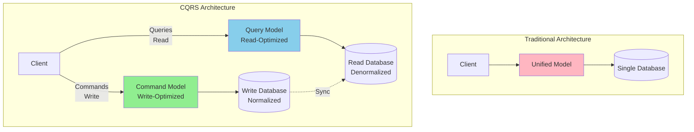
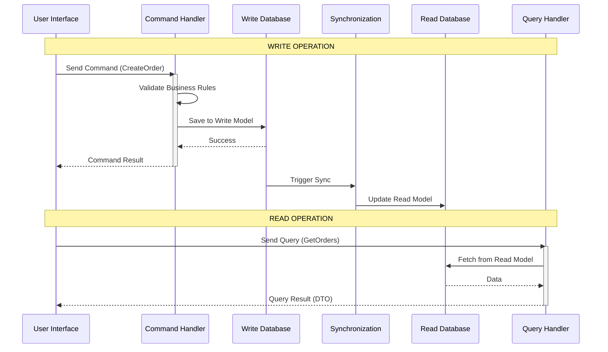
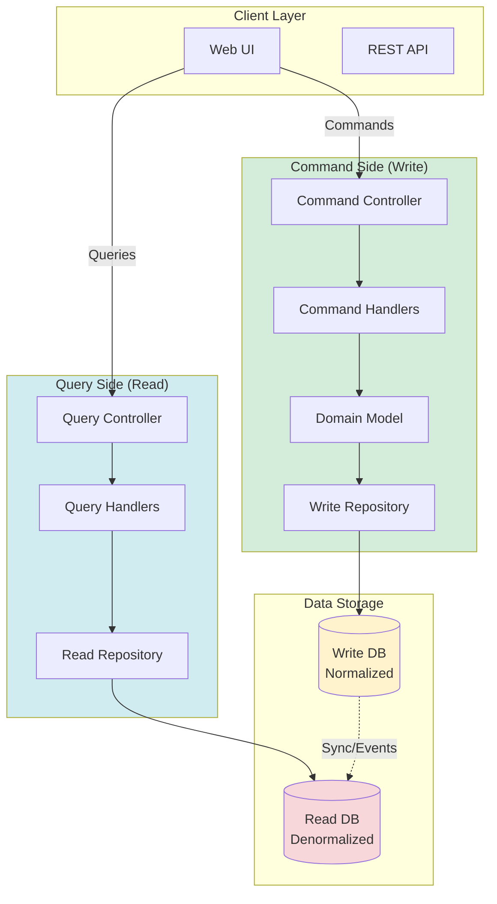
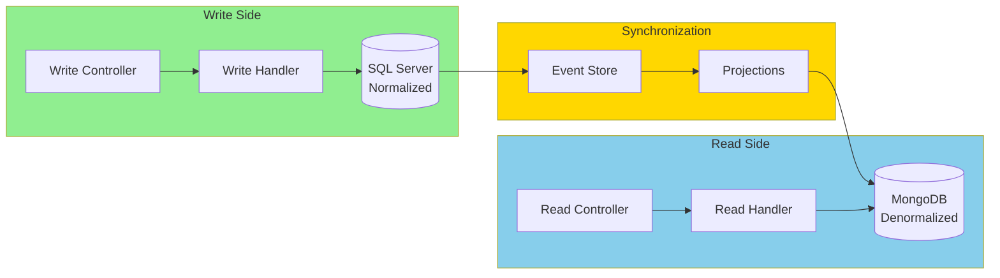
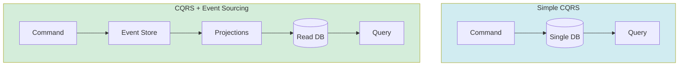

# CQRS Architecture (Command Query Responsibility Segregation)

## Table of Contents
- [Introduction](#introduction)
- [Core Concepts](#core-concepts)
- [CQRS Pattern Explained](#cqrs-pattern-explained)
- [Architecture Diagrams](#architecture-diagrams)
- [Simple CQRS vs CQRS with Event Sourcing](#simple-cqrs-vs-cqrs-with-event-sourcing)
- [Code Examples](#code-examples)
- [MediatR Implementation](#mediatr-implementation)
- [Advantages](#advantages)
- [Disadvantages](#disadvantages)
- [Use Cases](#use-cases)
- [Best Practices](#best-practices)
- [Common Pitfalls](#common-pitfalls)
- [Interview Questions](#interview-questions)

## Introduction

**CQRS (Command Query Responsibility Segregation)** is an architectural pattern introduced by Greg Young that separates read and write operations into different models. It's based on the CQS (Command Query Separation) principle by Bertrand Meyer.

### Core Philosophy

> "Use a different model to update information than the model you use to read information."  
> — Greg Young

### Key Characteristics

- **Separation**: Reads and writes use different models
- **Scalability**: Scale read and write sides independently
- **Optimization**: Optimize each side for its specific purpose
- **Flexibility**: Different data stores for reads and writes

## Core Concepts

### Command Query Separation (CQS)

**Commands**: 
- Change state
- Return void (or result object)
- Examples: CreateOrder, UpdateProduct, DeleteCustomer

**Queries**:
- Return data
- Don't change state
- Examples: GetOrderById, SearchProducts, GetCustomerHistory

### CQRS Takes It Further

Instead of just separating methods, CQRS separates the entire models.



### Benefits of Separation

| Aspect | Write Model | Read Model |
|--------|------------|-----------|
| **Purpose** | Business logic, validation | Display data |
| **Complexity** | Complex domain rules | Simple DTOs |
| **Database** | Normalized for consistency | Denormalized for performance |
| **Optimization** | Write-heavy operations | Read-heavy operations |
| **Scaling** | Scale writes independently | Scale reads independently |

## CQRS Pattern Explained

### The CQRS Flow



## Architecture Diagrams

### Simple CQRS Architecture



### CQRS with Separate Databases



## Simple CQRS vs CQRS with Event Sourcing

### Simple CQRS

- Same database, different models
- Synchronous sync between models
- Easier to implement
- Good for moderate complexity

### CQRS with Event Sourcing

- Event store as source of truth
- Asynchronous projections
- Complete audit trail
- Higher complexity but more benefits



## Code Examples

### Complete CQRS Implementation

#### Project Structure

```
ECommerce.CQRS/
├── Commands/                           # Write Side
│   ├── CreateOrder/
│   │   ├── CreateOrderCommand.cs
│   │   ├── CreateOrderCommandHandler.cs
│   │   └── CreateOrderValidator.cs
│   ├── UpdateProduct/
│   └── DeleteCustomer/
│
├── Queries/                            # Read Side
│   ├── GetOrderById/
│   │   ├── GetOrderByIdQuery.cs
│   │   ├── GetOrderByIdQueryHandler.cs
│   │   └── OrderDto.cs
│   ├── SearchProducts/
│   └── GetCustomerOrders/
│
├── Domain/                             # Write Model
│   ├── Entities/
│   │   └── Order.cs
│   └── Repositories/
│       └── IOrderRepository.cs
│
├── ReadModel/                          # Read Model
│   ├── DTOs/
│   │   └── OrderReadModel.cs
│   └── Repositories/
│       └── IOrderReadRepository.cs
│
└── Infrastructure/
    ├── WriteRepository.cs
    ├── ReadRepository.cs
    └── Synchronization.cs
```

### 1. Commands (Write Side)

**CreateOrderCommand.cs**
```csharp
namespace ECommerce.CQRS.Commands.CreateOrder
{
    // Command - represents intent to change state
    public class CreateOrderCommand : IRequest<CreateOrderResult>
    {
        public int CustomerId { get; set; }
        public List<OrderItemDto> Items { get; set; }
        public string ShippingAddress { get; set; }
        public string PaymentMethod { get; set; }
    }
    
    public class OrderItemDto
    {
        public int ProductId { get; set; }
        public int Quantity { get; set; }
    }
    
    public class CreateOrderResult
    {
        public bool Success { get; set; }
        public int OrderId { get; set; }
        public string ErrorMessage { get; set; }
    }
}
```

**CreateOrderCommandHandler.cs**
```csharp
namespace ECommerce.CQRS.Commands.CreateOrder
{
    public class CreateOrderCommandHandler 
        : IRequestHandler<CreateOrderCommand, CreateOrderResult>
    {
        private readonly IOrderRepository _orderRepository;
        private readonly IProductRepository _productRepository;
        private readonly IPaymentService _paymentService;
        private readonly IEventPublisher _eventPublisher;
        private readonly ILogger<CreateOrderCommandHandler> _logger;
        
        public CreateOrderCommandHandler(
            IOrderRepository orderRepository,
            IProductRepository productRepository,
            IPaymentService paymentService,
            IEventPublisher eventPublisher,
            ILogger<CreateOrderCommandHandler> logger)
        {
            _orderRepository = orderRepository;
            _productRepository = productRepository;
            _paymentService = paymentService;
            _eventPublisher = eventPublisher;
            _logger = logger;
        }
        
        public async Task<CreateOrderResult> Handle(
            CreateOrderCommand request, 
            CancellationToken cancellationToken)
        {
            try
            {
                // 1. Create domain entity
                var order = new Order
                {
                    CustomerId = request.CustomerId,
                    OrderDate = DateTime.UtcNow,
                    Status = OrderStatus.Pending,
                    ShippingAddress = request.ShippingAddress
                };
                
                // 2. Add items and validate
                foreach (var item in request.Items)
                {
                    var product = await _productRepository.GetByIdAsync(item.ProductId);
                    if (product == null)
                        return new CreateOrderResult 
                        { 
                            Success = false, 
                            ErrorMessage = $"Product {item.ProductId} not found" 
                        };
                    
                    if (product.Stock < item.Quantity)
                        return new CreateOrderResult 
                        { 
                            Success = false, 
                            ErrorMessage = $"Insufficient stock for {product.Name}" 
                        };
                    
                    order.AddItem(product.Id, product.Name, product.Price, item.Quantity);
                }
                
                // 3. Process payment
                var paymentResult = await _paymentService.ProcessPaymentAsync(
                    order.GetTotal(),
                    request.PaymentMethod
                );
                
                if (!paymentResult.Success)
                    return new CreateOrderResult 
                    { 
                        Success = false, 
                        ErrorMessage = paymentResult.ErrorMessage 
                    };
                
                // 4. Save to write database
                order.Confirm();
                await _orderRepository.AddAsync(order);
                await _orderRepository.SaveChangesAsync();
                
                // 5. Publish event for read model sync
                await _eventPublisher.PublishAsync(new OrderCreatedEvent
                {
                    OrderId = order.Id,
                    CustomerId = order.CustomerId,
                    Total = order.GetTotal(),
                    OrderDate = order.OrderDate,
                    Items = order.Items.Select(i => new OrderCreatedEvent.Item
                    {
                        ProductId = i.ProductId,
                        ProductName = i.ProductName,
                        Quantity = i.Quantity,
                        Price = i.Price
                    }).ToList()
                });
                
                _logger.LogInformation("Order {OrderId} created successfully", order.Id);
                
                return new CreateOrderResult 
                { 
                    Success = true, 
                    OrderId = order.Id 
                };
            }
            catch (Exception ex)
            {
                _logger.LogError(ex, "Error creating order");
                return new CreateOrderResult 
                { 
                    Success = false, 
                    ErrorMessage = "An error occurred while creating the order" 
                };
            }
        }
    }
}
```

**CreateOrderValidator.cs** (FluentValidation)
```csharp
namespace ECommerce.CQRS.Commands.CreateOrder
{
    public class CreateOrderValidator : AbstractValidator<CreateOrderCommand>
    {
        public CreateOrderValidator()
        {
            RuleFor(x => x.CustomerId)
                .GreaterThan(0)
                .WithMessage("Customer ID is required");
            
            RuleFor(x => x.Items)
                .NotEmpty()
                .WithMessage("Order must have at least one item");
            
            RuleFor(x => x.ShippingAddress)
                .NotEmpty()
                .WithMessage("Shipping address is required");
            
            RuleFor(x => x.PaymentMethod)
                .NotEmpty()
                .WithMessage("Payment method is required");
            
            RuleForEach(x => x.Items).ChildRules(item =>
            {
                item.RuleFor(x => x.ProductId)
                    .GreaterThan(0)
                    .WithMessage("Valid product ID is required");
                    
                item.RuleFor(x => x.Quantity)
                    .GreaterThan(0)
                    .WithMessage("Quantity must be at least 1");
            });
        }
    }
}
```

### 2. Queries (Read Side)

**GetOrderByIdQuery.cs**
```csharp
namespace ECommerce.CQRS.Queries.GetOrderById
{
    // Query - request for data
    public class GetOrderByIdQuery : IRequest<OrderDto>
    {
        public int OrderId { get; set; }
    }
    
    // Read model DTO
    public class OrderDto
    {
        public int Id { get; set; }
        public int CustomerId { get; set; }
        public string CustomerName { get; set; }
        public DateTime OrderDate { get; set; }
        public string Status { get; set; }
        public decimal Total { get; set; }
        public string ShippingAddress { get; set; }
        public List<OrderItemDto> Items { get; set; }
    }
    
    public class OrderItemDto
    {
        public int ProductId { get; set; }
        public string ProductName { get; set; }
        public decimal Price { get; set; }
        public int Quantity { get; set; }
        public decimal Subtotal => Price * Quantity;
    }
}
```

**GetOrderByIdQueryHandler.cs**
```csharp
namespace ECommerce.CQRS.Queries.GetOrderById
{
    public class GetOrderByIdQueryHandler 
        : IRequestHandler<GetOrderByIdQuery, OrderDto>
    {
        private readonly IOrderReadRepository _readRepository;
        
        public GetOrderByIdQueryHandler(IOrderReadRepository readRepository)
        {
            _readRepository = readRepository;
        }
        
        public async Task<OrderDto> Handle(
            GetOrderByIdQuery request, 
            CancellationToken cancellationToken)
        {
            // Query from read-optimized database
            var order = await _readRepository.GetOrderByIdAsync(request.OrderId);
            
            return order; // Already a DTO, no mapping needed
        }
    }
}
```

**SearchProductsQuery.cs** - Complex query example
```csharp
namespace ECommerce.CQRS.Queries.SearchProducts
{
    public class SearchProductsQuery : IRequest<SearchProductsResult>
    {
        public string SearchTerm { get; set; }
        public decimal? MinPrice { get; set; }
        public decimal? MaxPrice { get; set; }
        public int? CategoryId { get; set; }
        public int PageNumber { get; set; } = 1;
        public int PageSize { get; set; } = 20;
    }
    
    public class SearchProductsResult
    {
        public List<ProductDto> Products { get; set; }
        public int TotalCount { get; set; }
        public int PageNumber { get; set; }
        public int PageSize { get; set; }
        public int TotalPages => (int)Math.Ceiling(TotalCount / (double)PageSize);
    }
    
    public class ProductDto
    {
        public int Id { get; set; }
        public string Name { get; set; }
        public string Description { get; set; }
        public decimal Price { get; set; }
        public string CategoryName { get; set; }
        public int StockQuantity { get; set; }
        public double AverageRating { get; set; }
        public int ReviewCount { get; set; }
    }
}
```

### 3. Domain Model (Write Model)

**Order.cs** - Write Model Entity
```csharp
namespace ECommerce.CQRS.Domain.Entities
{
    public class Order
    {
        public int Id { get; set; }
        public int CustomerId { get; set; }
        public DateTime OrderDate { get; set; }
        public OrderStatus Status { get; set; }
        public string ShippingAddress { get; set; }
        
        private readonly List<OrderItem> _items = new();
        public IReadOnlyCollection<OrderItem> Items => _items.AsReadOnly();
        
        public void AddItem(int productId, string productName, decimal price, int quantity)
        {
            if (Status != OrderStatus.Pending)
                throw new InvalidOperationException("Cannot modify confirmed order");
            
            _items.Add(new OrderItem
            {
                ProductId = productId,
                ProductName = productName,
                Price = price,
                Quantity = quantity
            });
        }
        
        public decimal GetTotal() => _items.Sum(i => i.Price * i.Quantity);
        
        public void Confirm()
        {
            if (!_items.Any())
                throw new InvalidOperationException("Cannot confirm empty order");
            
            Status = OrderStatus.Confirmed;
        }
        
        public void Ship() => Status = OrderStatus.Shipped;
        public void Deliver() => Status = OrderStatus.Delivered;
        public void Cancel() => Status = OrderStatus.Cancelled;
    }
    
    public enum OrderStatus
    {
        Pending,
        Confirmed,
        Shipped,
        Delivered,
        Cancelled
    }
}
```

### 4. Read Model

**OrderReadModel.cs** - Denormalized for Queries
```csharp
namespace ECommerce.CQRS.ReadModel
{
    // Denormalized read model - optimized for queries
    public class OrderReadModel
    {
        public int Id { get; set; }
        public int CustomerId { get; set; }
        public string CustomerName { get; set; }
        public string CustomerEmail { get; set; }
        public DateTime OrderDate { get; set; }
        public string Status { get; set; }
        public decimal Total { get; set; }
        public string ShippingAddress { get; set; }
        public int ItemCount { get; set; }
        
        // Denormalized items for faster queries
        public string ItemsSummary { get; set; } // "3 items: Product A, Product B, ..."
        public List<OrderItemReadModel> Items { get; set; }
    }
    
    public class OrderItemReadModel
    {
        public int ProductId { get; set; }
        public string ProductName { get; set; }
        public string ProductImageUrl { get; set; }
        public decimal Price { get; set; }
        public int Quantity { get; set; }
        public decimal Subtotal { get; set; }
    }
}
```

### 5. Repositories

**Write Repository:**
```csharp
namespace ECommerce.CQRS.Infrastructure
{
    public class OrderWriteRepository : IOrderRepository
    {
        private readonly WriteDbContext _context;
        
        public async Task<Order> GetByIdAsync(int id)
        {
            return await _context.Orders
                .Include(o => o.Items)
                .FirstOrDefaultAsync(o => o.Id == id);
        }
        
        public async Task AddAsync(Order order)
        {
            await _context.Orders.AddAsync(order);
        }
        
        public async Task SaveChangesAsync()
        {
            await _context.SaveChangesAsync();
        }
    }
}
```

**Read Repository:**
```csharp
namespace ECommerce.CQRS.Infrastructure
{
    public class OrderReadRepository : IOrderReadRepository
    {
        private readonly ReadDbContext _context;
        
        public async Task<OrderDto> GetOrderByIdAsync(int id)
        {
            // Query denormalized read model
            return await _context.OrderReadModels
                .Where(o => o.Id == id)
                .Select(o => new OrderDto
                {
                    Id = o.Id,
                    CustomerId = o.CustomerId,
                    CustomerName = o.CustomerName,
                    OrderDate = o.OrderDate,
                    Status = o.Status,
                    Total = o.Total,
                    ShippingAddress = o.ShippingAddress,
                    Items = o.Items.Select(i => new OrderItemDto
                    {
                        ProductId = i.ProductId,
                        ProductName = i.ProductName,
                        Price = i.Price,
                        Quantity = i.Quantity
                    }).ToList()
                })
                .FirstOrDefaultAsync();
        }
        
        public async Task<List<OrderDto>> GetCustomerOrdersAsync(int customerId)
        {
            // Optimized query on denormalized data
            return await _context.OrderReadModels
                .Where(o => o.CustomerId == customerId)
                .OrderByDescending(o => o.OrderDate)
                .Select(o => new OrderDto { /* ... */ })
                .ToListAsync();
        }
    }
}
```

## MediatR Implementation

### Setup

**Installation:**
```bash
dotnet add package MediatR
dotnet add package MediatR.Extensions.Microsoft.DependencyInjection
```

**Registration in Program.cs:**
```csharp
builder.Services.AddMediatR(cfg => 
    cfg.RegisterServicesFromAssembly(typeof(Program).Assembly));

// Repositories
builder.Services.AddScoped<IOrderRepository, OrderWriteRepository>();
builder.Services.AddScoped<IOrderReadRepository, OrderReadRepository>();

// Validation
builder.Services.AddScoped<IValidator<CreateOrderCommand>, CreateOrderValidator>();
```

### Controller Implementation

```csharp
[ApiController]
[Route("api/[controller]")]
public class OrdersController : ControllerBase
{
    private readonly IMediator _mediator;
    
    public OrdersController(IMediator mediator)
    {
        _mediator = mediator;
    }
    
    // Command endpoint
    [HttpPost]
    public async Task<IActionResult> CreateOrder([FromBody] CreateOrderCommand command)
    {
        var result = await _mediator.Send(command);
        
        return result.Success 
            ? CreatedAtAction(nameof(GetOrder), new { id = result.OrderId }, result)
            : BadRequest(new { error = result.ErrorMessage });
    }
    
    // Query endpoint
    [HttpGet("{id}")]
    public async Task<IActionResult> GetOrder(int id)
    {
        var query = new GetOrderByIdQuery { OrderId = id };
        var result = await _mediator.Send(query);
        
        return result != null ? Ok(result) : NotFound();
    }
    
    // Query endpoint with parameters
    [HttpGet("search")]
    public async Task<IActionResult> SearchProducts([FromQuery] SearchProductsQuery query)
    {
        var result = await _mediator.Send(query);
        return Ok(result);
    }
}
```

### Pipeline Behaviors

**Validation Behavior:**
```csharp
public class ValidationBehavior<TRequest, TResponse> 
    : IPipelineBehavior<TRequest, TResponse>
    where TRequest : IRequest<TResponse>
{
    private readonly IEnumerable<IValidator<TRequest>> _validators;
    
    public ValidationBehavior(IEnumerable<IValidator<TRequest>> validators)
    {
        _validators = validators;
    }
    
    public async Task<TResponse> Handle(
        TRequest request,
        RequestHandlerDelegate<TResponse> next,
        CancellationToken cancellationToken)
    {
        if (!_validators.Any())
            return await next();
        
        var context = new ValidationContext<TRequest>(request);
        
        var validationResults = await Task.WhenAll(
            _validators.Select(v => v.ValidateAsync(context, cancellationToken))
        );
        
        var failures = validationResults
            .SelectMany(r => r.Errors)
            .Where(f => f != null)
            .ToList();
        
        if (failures.Any())
            throw new ValidationException(failures);
        
        return await next();
    }
}
```

**Logging Behavior:**
```csharp
public class LoggingBehavior<TRequest, TResponse> 
    : IPipelineBehavior<TRequest, TResponse>
    where TRequest : IRequest<TResponse>
{
    private readonly ILogger<LoggingBehavior<TRequest, TResponse>> _logger;
    
    public async Task<TResponse> Handle(
        TRequest request,
        RequestHandlerDelegate<TResponse> next,
        CancellationToken cancellationToken)
    {
        _logger.LogInformation("Handling {RequestName}", typeof(TRequest).Name);
        
        var response = await next();
        
        _logger.LogInformation("Handled {RequestName}", typeof(TRequest).Name);
        
        return response;
    }
}
```

## Advantages

### ✅ 1. Scalability
Scale read and write sides independently based on load.

### ✅ 2. Performance Optimization
- Write model: Normalized for consistency
- Read model: Denormalized for query performance

### ✅ 3. Flexibility
Different databases for reads and writes (SQL for writes, MongoDB for reads).

### ✅ 4. Simplified Queries
Read models tailored to specific UI needs.

### ✅ 5. Clear Intent
Commands and queries make intent explicit.

### ✅ 6. Better Security
Fine-grained security on commands vs queries.

## Disadvantages

### ❌ 1. Increased Complexity
More code, more infrastructure, more concepts.

### ❌ 2. Eventual Consistency
Read model may be slightly out of sync.

### ❌ 3. Code Duplication
Separate models mean more code.

### ❌ 4. Learning Curve
Team needs to understand CQRS principles.

## Use Cases

### ✅ When to Use CQRS

1. **Different Read/Write Patterns**: Lots of reads, few writes (or vice versa)
2. **Complex Domain Logic**: Rich business rules on write side
3. **Performance Requirements**: Need to optimize reads separately
4. **Scalability Needs**: Different scaling requirements for reads/writes
5. **Event Sourcing**: Works well with event-sourced systems

### ❌ When NOT to Use

1. **Simple CRUD**: Overhead not justified
2. **Small Applications**: Complexity not needed
3. **Tight Consistency Required**: Can't tolerate eventual consistency
4. **Small Team**: Learning curve too steep

## Best Practices

### 1. Use MediatR for Clean Implementation
Simplifies command/query dispatching.

### 2. Validate Commands, Not Queries
Queries should be simple and always succeed.

### 3. Keep Commands Focused
One command = one business operation.

### 4. Optimize Read Models for UI
Create read models matching UI needs exactly.

### 5. Handle Synchronization Carefully
Ensure write → read sync is reliable.

## Common Pitfalls

### 1. Over-Using CQRS
Not every operation needs CQRS. Simple reads can bypass query handlers.

### 2. Not Handling Sync Failures
Read model sync must be robust and retryable.

### 3. Too Many Commands
Don't create a command for every field update.

### 4. Ignoring Eventual Consistency
UI must handle potentially stale data.

## Interview Questions

### Q1: What is CQRS?

**Answer:** CQRS (Command Query Responsibility Segregation) is a pattern that separates read operations (queries) from write operations (commands) using different models. Commands change state and return void/result, while queries return data without changing state.

### Q2: What's the difference between CQS and CQRS?

**Answer:**
- **CQS**: Method-level separation (command methods vs query methods)
- **CQRS**: Model-level separation (separate write model and read model, potentially different databases)

### Q3: When should you use CQRS?

**Answer:** Use CQRS when:
- Read and write patterns differ significantly
- Complex domain logic on write side
- Need to scale reads and writes independently
- Using Event Sourcing
- Performance optimization required for queries

Don't use for simple CRUD applications.

### Q4: How do you synchronize read and write models?

**Answer:** Common approaches:
1. **Direct sync**: Write handler updates both models
2. **Event-based**: Publish events, projections update read model
3. **Change Data Capture**: Database triggers
4. **Polling**: Background job syncs periodically

### Q5: What are the downsides of CQRS?

**Answer:**
- Increased complexity (more code, concepts)
- Eventual consistency between models
- More infrastructure (potentially separate databases)
- Learning curve for team
- Code duplication between models

---

**Previous:** [← Hexagonal Architecture](05-Hexagonal-Architecture.md)  
**Next:** [Event Sourcing →](07-Event-Sourcing.md)
