# Event Sourcing

## Table of Contents
- [Introduction](#introduction)
- [Core Concepts](#core-concepts)
- [Event Store](#event-store)
- [Architecture Diagrams](#architecture-diagrams)
- [Event Sourcing with CQRS](#event-sourcing-with-cqrs)
- [Code Examples](#code-examples)
- [Projections](#projections)
- [Snapshots](#snapshots)
- [Advantages](#advantages)
- [Disadvantages](#disadvantages)
- [Use Cases](#use-cases)
- [Best Practices](#best-practices)
- [Interview Questions](#interview-questions)

## Introduction

**Event Sourcing** is an architectural pattern where state changes are stored as a sequence of events rather than storing just the current state. Instead of updating records, you append immutable events that describe what happened.

### Core Philosophy

> "Don't store the current state. Store the events that led to that state."  
> — Greg Young

### Key Characteristics

- **Events as Source of Truth**: Event log is the primary source of data
- **Immutable Events**: Events are never modified or deleted
- **Temporal Queries**: Can rebuild state at any point in time
- **Audit Trail**: Complete history of all changes
- **Event Replay**: Rebuild current state by replaying events

## Core Concepts

### Traditional vs Event Sourcing


### Example: Bank Account

**Traditional Approach:**
```
Account Balance: $500  (Only current state)
```

**Event Sourcing Approach:**
```
1. AccountOpened: initialBalance = $0
2. MoneyDeposited: amount = $100
3. MoneyDeposited: amount = $500
4. MoneyWithdrawn: amount = $100
Current Balance = SUM(all events) = $500
```

## Event Store

### What is an Event Store?

An **Event Store** is an append-only log that stores domain events in sequence.


### Event Store Operations

| Operation | Description | Allowed? |
|-----------|-------------|----------|
| **Append** | Add new event | ✅ Yes |
| **Read** | Read events | ✅ Yes |
| **Update** | Modify existing event | ❌ No (Immutable) |
| **Delete** | Remove event | ❌ No (Append-only) |

### Event Structure

```csharp
public abstract class DomainEvent
{
    public Guid EventId { get; set; }
    public Guid AggregateId { get; set; }
    public int Version { get; set; }
    public DateTime OccurredAt { get; set; }
    public string EventType { get; set; }
}
```

## Architecture Diagrams

### Event Sourcing Flow


### Complete Event Sourcing Architecture

```mermaid
graph TB
    subgraph CommandSide["Command Side (Write)"]
        CMD[Commands]
        AGG[Aggregates]
        ES[(Event Store)]
    end
    
    subgraph QuerySide["Query Side (Read)"]
        PROJ[Projections]
        RM[(Read Models)]
        QUERY[Queries]
    end
    
    User[👤 User]
    
    User -->|Send Command| CMD
    CMD --> AGG
    AGG -->|Load Events| ES
    ES -->|Historical Events| AGG
    AGG -->|Append New Event| ES
    
    ES -.->|Event Published| PROJ
    PROJ -->|Update| RM
    User -->|Query| QUERY
    QUERY -->|Fetch| RM
    
    style ES fill:#FFD700
    style RM fill:#87CEEB
```



## Event Sourcing with CQRS

Event Sourcing works exceptionally well with CQRS:


## Code Examples

### Complete Event Sourcing Implementation

#### 1. Domain Events

```csharp
namespace ECommerce.EventSourcing.Events
{
    // Base event
    public abstract class DomainEvent
    {
        public Guid EventId { get; set; } = Guid.NewGuid();
        public Guid AggregateId { get; set; }
        public int Version { get; set; }
        public DateTime OccurredAt { get; set; } = DateTime.UtcNow;
        public string EventType => GetType().Name;
    }
    
    // Specific events
    public class OrderCreatedEvent : DomainEvent
    {
        public int CustomerId { get; set; }
        public DateTime OrderDate { get; set; }
    }
    
    public class OrderItemAddedEvent : DomainEvent
    {
        public int ProductId { get; set; }
        public string ProductName { get; set; }
        public decimal Price { get; set; }
        public int Quantity { get; set; }
    }
    
    public class OrderConfirmedEvent : DomainEvent
    {
        public decimal Total { get; set; }
        public DateTime ConfirmedAt { get; set; }
    }
    
    public class OrderShippedEvent : DomainEvent
    {
        public string TrackingNumber { get; set; }
        public DateTime ShippedAt { get; set; }
    }
    
    public class OrderCancelledEvent : DomainEvent
    {
        public string Reason { get; set; }
        public DateTime CancelledAt { get; set; }
    }
}
```

#### 2. Aggregate Root with Event Sourcing

```csharp
namespace ECommerce.EventSourcing.Domain
{
    public class Order
    {
        // Current state
        public Guid Id { get; private set; }
        public int CustomerId { get; private set; }
        public DateTime OrderDate { get; private set; }
        public OrderStatus Status { get; private set; }
        private readonly List<OrderItem> _items = new();
        public IReadOnlyCollection<OrderItem> Items => _items.AsReadOnly();
        
        // Event sourcing infrastructure
        private readonly List<DomainEvent> _uncommittedEvents = new();
        public IReadOnlyCollection<DomainEvent> UncommittedEvents => _uncommittedEvents.AsReadOnly();
        public int Version { get; private set; }
        
        // Private constructor for event replay
        private Order() { }
        
        // Factory method - generates events
        public static Order Create(int customerId)
        {
            var order = new Order();
            var @event = new OrderCreatedEvent
            {
                AggregateId = Guid.NewGuid(),
                CustomerId = customerId,
                OrderDate = DateTime.UtcNow
            };
            
            order.ApplyEvent(@event, isNew: true);
            return order;
        }
        
        // Command methods - generate events
        public void AddItem(int productId, string productName, decimal price, int quantity)
        {
            if (Status != OrderStatus.Pending)
                throw new InvalidOperationException("Cannot modify confirmed order");
            
            var @event = new OrderItemAddedEvent
            {
                AggregateId = Id,
                ProductId = productId,
                ProductName = productName,
                Price = price,
                Quantity = quantity
            };
            
            ApplyEvent(@event, isNew: true);
        }
        
        public void Confirm()
        {
            if (Status != OrderStatus.Pending)
                throw new InvalidOperationException("Only pending orders can be confirmed");
            
            if (!_items.Any())
                throw new InvalidOperationException("Cannot confirm empty order");
            
            var @event = new OrderConfirmedEvent
            {
                AggregateId = Id,
                Total = GetTotal(),
                ConfirmedAt = DateTime.UtcNow
            };
            
            ApplyEvent(@event, isNew: true);
        }
        
        public void Ship(string trackingNumber)
        {
            if (Status != OrderStatus.Confirmed)
                throw new InvalidOperationException("Only confirmed orders can be shipped");
            
            var @event = new OrderShippedEvent
            {
                AggregateId = Id,
                TrackingNumber = trackingNumber,
                ShippedAt = DateTime.UtcNow
            };
            
            ApplyEvent(@event, isNew: true);
        }
        
        public void Cancel(string reason)
        {
            if (Status == OrderStatus.Shipped || Status == OrderStatus.Delivered)
                throw new InvalidOperationException("Cannot cancel shipped or delivered orders");
            
            var @event = new OrderCancelledEvent
            {
                AggregateId = Id,
                Reason = reason,
                CancelledAt = DateTime.UtcNow
            };
            
            ApplyEvent(@event, isNew: true);
        }
        
        // Event application - updates state
        private void ApplyEvent(DomainEvent @event, bool isNew)
        {
            // Apply the event to update state
            Apply(@event);
            
            // If new event, add to uncommitted list
            if (isNew)
            {
                @event.Version = ++Version;
                _uncommittedEvents.Add(@event);
            }
        }
        
        // Event dispatcher - routes to specific handler
        private void Apply(DomainEvent @event)
        {
            switch (@event)
            {
                case OrderCreatedEvent e:
                    Apply(e);
                    break;
                case OrderItemAddedEvent e:
                    Apply(e);
                    break;
                case OrderConfirmedEvent e:
                    Apply(e);
                    break;
                case OrderShippedEvent e:
                    Apply(e);
                    break;
                case OrderCancelledEvent e:
                    Apply(e);
                    break;
            }
        }
        
        // Event handlers - update internal state
        private void Apply(OrderCreatedEvent @event)
        {
            Id = @event.AggregateId;
            CustomerId = @event.CustomerId;
            OrderDate = @event.OrderDate;
            Status = OrderStatus.Pending;
        }
        
        private void Apply(OrderItemAddedEvent @event)
        {
            _items.Add(new OrderItem
            {
                ProductId = @event.ProductId,
                ProductName = @event.ProductName,
                Price = @event.Price,
                Quantity = @event.Quantity
            });
        }
        
        private void Apply(OrderConfirmedEvent @event)
        {
            Status = OrderStatus.Confirmed;
        }
        
        private void Apply(OrderShippedEvent @event)
        {
            Status = OrderStatus.Shipped;
        }
        
        private void Apply(OrderCancelledEvent @event)
        {
            Status = OrderStatus.Cancelled;
        }
        
        // Rebuild from events (event replay)
        public static Order FromEvents(IEnumerable<DomainEvent> events)
        {
            var order = new Order();
            
            foreach (var @event in events)
            {
                order.Apply(@event);
                order.Version = @event.Version;
            }
            
            return order;
        }
        
        // Clear uncommitted events after save
        public void MarkEventsAsCommitted()
        {
            _uncommittedEvents.Clear();
        }
        
        // Helper
        private decimal GetTotal() => _items.Sum(i => i.Price * i.Quantity);
    }
}
```

#### 3. Event Store Implementation

```csharp
namespace ECommerce.EventSourcing.Infrastructure
{
    public interface IEventStore
    {
        Task SaveEventsAsync(Guid aggregateId, IEnumerable<DomainEvent> events, int expectedVersion);
        Task<IEnumerable<DomainEvent>> GetEventsAsync(Guid aggregateId);
        Task<IEnumerable<DomainEvent>> GetEventsAsync(Guid aggregateId, int fromVersion);
    }
    
    public class SqlEventStore : IEventStore
    {
        private readonly ApplicationDbContext _context;
        private readonly IEventSerializer _serializer;
        
        public SqlEventStore(ApplicationDbContext context, IEventSerializer serializer)
        {
            _context = context;
            _serializer = serializer;
        }
        
        public async Task SaveEventsAsync(
            Guid aggregateId, 
            IEnumerable<DomainEvent> events, 
            int expectedVersion)
        {
            // Optimistic concurrency check
            var currentVersion = await _context.Events
                .Where(e => e.AggregateId == aggregateId)
                .MaxAsync(e => (int?)e.Version) ?? 0;
            
            if (currentVersion != expectedVersion)
            {
                throw new ConcurrencyException(
                    $"Expected version {expectedVersion}, but found {currentVersion}");
            }
            
            // Save events
            foreach (var @event in events)
            {
                var eventEntity = new EventEntity
                {
                    EventId = @event.EventId,
                    AggregateId = aggregateId,
                    EventType = @event.EventType,
                    EventData = _serializer.Serialize(@event),
                    Version = @event.Version,
                    OccurredAt = @event.OccurredAt
                };
                
                await _context.Events.AddAsync(eventEntity);
            }
            
            await _context.SaveChangesAsync();
        }
        
        public async Task<IEnumerable<DomainEvent>> GetEventsAsync(Guid aggregateId)
        {
            return await GetEventsAsync(aggregateId, fromVersion: 0);
        }
        
        public async Task<IEnumerable<DomainEvent>> GetEventsAsync(
            Guid aggregateId, 
            int fromVersion)
        {
            var eventEntities = await _context.Events
                .Where(e => e.AggregateId == aggregateId && e.Version > fromVersion)
                .OrderBy(e => e.Version)
                .ToListAsync();
            
            return eventEntities.Select(e => _serializer.Deserialize(e.EventData, e.EventType));
        }
    }
    
    // Event entity for database
    public class EventEntity
    {
        public Guid EventId { get; set; }
        public Guid AggregateId { get; set; }
        public string EventType { get; set; }
        public string EventData { get; set; }
        public int Version { get; set; }
        public DateTime OccurredAt { get; set; }
    }
}
```

#### 4. Repository with Event Sourcing

```csharp
namespace ECommerce.EventSourcing.Infrastructure
{
    public interface IOrderRepository
    {
        Task<Order> GetByIdAsync(Guid id);
        Task SaveAsync(Order order);
    }
    
    public class EventSourcedOrderRepository : IOrderRepository
    {
        private readonly IEventStore _eventStore;
        
        public EventSourcedOrderRepository(IEventStore eventStore)
        {
            _eventStore = eventStore;
        }
        
        public async Task<Order> GetByIdAsync(Guid id)
        {
            // Load events from event store
            var events = await _eventStore.GetEventsAsync(id);
            
            if (!events.Any())
                return null;
            
            // Rebuild aggregate from events
            return Order.FromEvents(events);
        }
        
        public async Task SaveAsync(Order order)
        {
            // Get uncommitted events
            var events = order.UncommittedEvents;
            
            if (!events.Any())
                return;
            
            // Calculate expected version (before new events)
            var expectedVersion = order.Version - events.Count;
            
            // Save events to event store
            await _eventStore.SaveEventsAsync(order.Id, events, expectedVersion);
            
            // Mark events as committed
            order.MarkEventsAsCommitted();
        }
    }
}
```

## Projections

**Projections** transform events into read models for queries.

### Projection Example

```csharp
namespace ECommerce.EventSourcing.Projections
{
    public class OrderListProjection
    {
        private readonly ReadDbContext _readContext;
        
        public OrderListProjection(ReadDbContext readContext)
        {
            _readContext = readContext;
        }
        
        public async Task Handle(OrderCreatedEvent @event)
        {
            var orderReadModel = new OrderListReadModel
            {
                OrderId = @event.AggregateId,
                CustomerId = @event.CustomerId,
                OrderDate = @event.OrderDate,
                Status = "Pending",
                Total = 0,
                ItemCount = 0
            };
            
            await _readContext.OrderList.AddAsync(orderReadModel);
            await _readContext.SaveChangesAsync();
        }
        
        public async Task Handle(OrderItemAddedEvent @event)
        {
            var order = await _readContext.OrderList
                .FindAsync(@event.AggregateId);
            
            if (order != null)
            {
                order.Total += @event.Price * @event.Quantity;
                order.ItemCount++;
                await _readContext.SaveChangesAsync();
            }
        }
        
        public async Task Handle(OrderConfirmedEvent @event)
        {
            var order = await _readContext.OrderList
                .FindAsync(@event.AggregateId);
            
            if (order != null)
            {
                order.Status = "Confirmed";
                order.ConfirmedAt = @event.ConfirmedAt;
                await _readContext.SaveChangesAsync();
            }
        }
    }
}
```

## Snapshots

For aggregates with many events, **snapshots** improve performance.

```csharp
public class SnapshotRepository
{
    private readonly IEventStore _eventStore;
    private readonly ISnapshotStore _snapshotStore;
    
    public async Task<Order> GetByIdAsync(Guid id)
    {
        // Try to load latest snapshot
        var snapshot = await _snapshotStore.GetLatestSnapshotAsync(id);
        
        Order order;
        int fromVersion;
        
        if (snapshot != null)
        {
            // Rebuild from snapshot
            order = snapshot.Order;
            fromVersion = snapshot.Version;
        }
        else
        {
            // No snapshot, start from scratch
            order = new Order();
            fromVersion = 0;
        }
        
        // Load events since snapshot
        var events = await _eventStore.GetEventsAsync(id, fromVersion);
        
        // Apply remaining events
        foreach (var @event in events)
        {
            order.Apply(@event);
        }
        
        return order;
    }
    
    public async Task SaveAsync(Order order)
    {
        // Save events
        await _eventStore.SaveEventsAsync(order.Id, order.UncommittedEvents, order.Version);
        
        // Create snapshot every 100 events
        if (order.Version % 100 == 0)
        {
            await _snapshotStore.SaveSnapshotAsync(new Snapshot
            {
                AggregateId = order.Id,
                Order = order,
                Version = order.Version,
                CreatedAt = DateTime.UtcNow
            });
        }
    }
}
```

## Advantages

### ✅ 1. Complete Audit Trail
Every change is recorded. Perfect for compliance and debugging.

### ✅ 2. Temporal Queries
Can query state at any point in time.

### ✅ 3. Event Replay
Can rebuild state or create new projections from historical events.

### ✅ 4. Debugging
Can replay events to reproduce bugs.

### ✅ 5. Business Insights
Event stream provides rich data for analytics.

### ✅ 6. No Data Loss
Events are never deleted, complete history preserved.

## Disadvantages

### ❌ 1. Complexity
Significantly more complex than CRUD.

### ❌ 2. Learning Curve
Team needs to understand event sourcing concepts.

### ❌ 3. Event Versioning
Changing event structure requires migration strategies.

### ❌ 4. Eventual Consistency
Projections may lag behind events.

### ❌ 5. Storage Growth
Event store grows continuously.

### ❌ 6. Query Complexity
Need projections for efficient queries.

## Use Cases

### ✅ When to Use Event Sourcing

1. **Audit Requirements**: Financial, healthcare, legal systems
2. **Temporal Queries**: Need to query historical state
3. **Complex Domains**: Rich business logic with state changes
4. **Event-Driven Systems**: Already using event-driven architecture
5. **Analytics**: Need detailed business insights
6. **Debugging**: Need to reproduce issues

### ❌ When NOT to Use

1. **Simple CRUD**: Overhead not justified
2. **Limited Resources**: Team lacks expertise
3. **Real-Time Consistency Required**: Can't tolerate lag
4. **Small Applications**: Complexity outweighs benefits

## Best Practices

### 1. Design Events Carefully
Events are permanent. Design them well from the start.

### 2. Use Snapshots
For long-lived aggregates with many events.

### 3. Handle Event Versioning
Plan for event schema evolution.

### 4. Separate Event Store
Use dedicated storage for events.

### 5. Idempotent Projections
Projections should handle duplicate events.

## Interview Questions

### Q1: What is Event Sourcing?

**Answer:** Event Sourcing stores state changes as a sequence of immutable events rather than storing current state. The current state is derived by replaying all events from the beginning.

### Q2: How does Event Sourcing differ from traditional CRUD?

**Answer:**
- **Traditional**: Stores current state, updates in place, history lost
- **Event Sourcing**: Stores all events, append-only, complete history preserved

### Q3: What are the benefits of Event Sourcing?

**Answer:**
1. Complete audit trail
2. Temporal queries (state at any time)
3. Event replay capability
4. No data loss
5. Rich analytics from event stream
6. Easier debugging

### Q4: What are projections?

**Answer:** Projections are read models built from event streams. They transform events into queryable data structures optimized for specific queries. Multiple projections can be built from the same events.

### Q5: How do you handle event versioning?

**Answer:** Strategies:
1. **Upcasting**: Convert old events to new format when reading
2. **Multiple Versions**: Support multiple event versions
3. **Weak Schema**: Use flexible JSON with optional fields
4. **Event Migration**: Batch process to new format

---

**Previous:** [← CQRS Architecture](06-CQRS-Architecture.md)  
**Next:** [Microservices Architecture →](08-Microservices-Architecture.md)
