# Microservices Architecture

## Table of Contents
- [Introduction](#introduction)
- [Core Concepts](#core-concepts)
- [From Monolith to Microservices](#from-monolith-to-microservices)
- [Architecture Diagrams](#architecture-diagrams)
- [Service Decomposition](#service-decomposition)
- [Inter-Service Communication](#inter-service-communication)
- [API Gateway Pattern](#api-gateway-pattern)
- [Service Discovery](#service-discovery)
- [Distributed Transactions](#distributed-transactions)
- [Code Examples](#code-examples)
- [Advantages](#advantages)
- [Disadvantages](#disadvantages)
- [Use Cases](#use-cases)
- [Best Practices](#best-practices)
- [Common Pitfalls](#common-pitfalls)
- [Interview Questions](#interview-questions)

## Introduction

**Microservices Architecture** is an architectural style that structures an application as a collection of small, autonomous services modeled around a business domain. Each microservice is independently deployable, scalable, and maintainable.

### Core Philosophy

> "The microservice architectural style is an approach to developing a single application as a suite of small services, each running in its own process and communicating with lightweight mechanisms."  
> — Martin Fowler

### Key Characteristics

- **Independently Deployable**: Each service can be deployed without affecting others
- **Loosely Coupled**: Services communicate through well-defined APIs
- **Business-Focused**: Each service represents a business capability
- **Technology Agnostic**: Different services can use different technology stacks
- **Decentralized**: Each team owns their services completely

## Core Concepts

### Microservices vs Monolith


## From Monolith to Microservices

### Evolution Stages


### When to Migrate

**✅ Migrate when:**
- Monolith is too large to maintain
- Different parts need different scaling
- Teams are organized by business domains
- Deploy frequency is bottlenecked
- Technology stack needs flexibility

**❌ Don't migrate when:**
- Application is small and simple
- Team is small (< 10 developers)
- Domain boundaries are unclear
- Operational maturity is low

## Architecture Diagrams

### Complete Microservices Architecture

```mermaid
graph TB
    Client[👤 Client Apps]
    
    subgraph Gateway["API Gateway Layer"]
        APIGW[API Gateway]
    end
    
    subgraph Services["Microservices"]
        US[User Service]
        OS[Order Service]
        PS[Product Service]
        IS[Inventory Service]
        NS[Notification Service]
    end
    
    subgraph Infrastructure["Infrastructure"]
        SD[Service Discovery<br/>Consul/Eureka]
        CF[Config Server]
        MB[Message Broker<br/>RabbitMQ/Kafka]
    end
    
    subgraph Data["Data Layer"]
        USDB[(User DB)]
        OSDB[(Order DB)]
        PSDB[(Product DB)]
        ISDB[(Inventory DB)]
    end
    
    Client --> APIGW
    APIGW --> US
    APIGW --> OS
    APIGW --> PS
    
    US --> SD
    OS --> SD
    PS --> SD
    IS --> SD
    
    OS --> MB
    IS --> MB
    NS --> MB
    
    US --> USDB
    OS --> OSDB
    PS --> PSDB
    IS --> ISDB
    
    style APIGW fill:#FFD700
    style US fill:#90EE90
    style OS fill:#87CEEB
    style PS fill:#FFA500
    style IS fill:#FFB6C1
    style NS fill:#DDA0DD
```



### Request Flow


## Service Decomposition

### Decomposition Strategies

**1. Decompose by Business Capability**
```
E-Commerce Application:
- User Management Service
- Product Catalog Service
- Shopping Cart Service
- Order Management Service
- Payment Service
- Inventory Service
- Shipping Service
- Notification Service
```

**2. Decompose by Sub-domain (DDD)**
```
Bounded Contexts:
- Customer Context → Customer Service
- Product Context → Product Service
- Order Context → Order Service
- Payment Context → Payment Service
```

**3. Decompose by Team Structure (Conway's Law)**
```
Team Organization:
- Frontend Team → UI Service
- Customer Team → Customer Service
- Inventory Team → Inventory Service
- Fulfillment Team → Order & Shipping Services
```

### Service Boundaries Diagram


## Inter-Service Communication

### Synchronous Communication (REST)

```csharp
// Order Service calling Product Service via HTTP
public class OrderService
{
    private readonly HttpClient _httpClient;
    
    public async Task<Order> CreateOrderAsync(CreateOrderRequest request)
    {
        // Call Product Service
        var productResponse = await _httpClient.GetAsync(
            $"http://product-service/api/products/{request.ProductId}"
        );
        
        var product = await productResponse.Content
            .ReadFromJsonAsync<ProductDto>();
        
        // Create order with product info
        var order = new Order
        {
            ProductId = product.Id,
            ProductName = product.Name,
            Price = product.Price
        };
        
        return order;
    }
}
```

### Asynchronous Communication (Message Bus)

```csharp
// Order Service publishing events
public class OrderService
{
    private readonly IMessageBus _messageBus;
    
    public async Task<Order> CreateOrderAsync(CreateOrderRequest request)
    {
        var order = new Order { /* ... */ };
        await _repository.SaveAsync(order);
        
        // Publish event for other services
        await _messageBus.PublishAsync(new OrderCreatedEvent
        {
            OrderId = order.Id,
            CustomerId = order.CustomerId,
            TotalAmount = order.TotalAmount,
            Items = order.Items
        });
        
        return order;
    }
}

// Inventory Service consuming events
public class InventoryEventHandler
{
    public async Task HandleOrderCreatedAsync(OrderCreatedEvent @event)
    {
        foreach (var item in @event.Items)
        {
            await _inventoryService.ReduceStockAsync(
                item.ProductId, 
                item.Quantity
            );
        }
    }
}
```

### Communication Patterns


## API Gateway Pattern

### API Gateway Responsibilities


### Implementation Example

```csharp
// ASP.NET Core API Gateway using Ocelot
{
  "Routes": [
    {
      "DownstreamPathTemplate": "/api/products/{everything}",
      "DownstreamScheme": "http",
      "DownstreamHostAndPorts": [
        { "Host": "product-service", "Port": 80 }
      ],
      "UpstreamPathTemplate": "/products/{everything}",
      "UpstreamHttpMethod": [ "GET", "POST", "PUT", "DELETE" ]
    },
    {
      "DownstreamPathTemplate": "/api/orders/{everything}",
      "DownstreamScheme": "http",
      "DownstreamHostAndPorts": [
        { "Host": "order-service", "Port": 80 }
      ],
      "UpstreamPathTemplate": "/orders/{everything}",
      "UpstreamHttpMethod": [ "GET", "POST", "PUT", "DELETE" ],
      "AuthenticationOptions": {
        "AuthenticationProviderKey": "Bearer"
      }
    }
  ],
  "GlobalConfiguration": {
    "BaseUrl": "https://api.mycompany.com"
  }
}
```

## Service Discovery

### Service Registry Pattern


### Implementation

```csharp
// Service Registration (Startup.cs)
public void ConfigureServices(IServiceCollection services)
{
    services.AddConsul();
    services.AddSingleton<IServiceDiscovery, ConsulServiceDiscovery>();
}

public void Configure(IApplicationBuilder app)
{
    app.UseConsul(Configuration);
}

// Discovering and calling a service
public class OrderService
{
    private readonly IServiceDiscovery _serviceDiscovery;
    private readonly HttpClient _httpClient;
    
    public async Task<Product> GetProductAsync(int productId)
    {
        // Discover product service
        var serviceUri = await _serviceDiscovery
            .GetServiceUriAsync("product-service");
        
        // Call the service
        var response = await _httpClient.GetAsync(
            $"{serviceUri}/api/products/{productId}"
        );
        
        return await response.Content.ReadFromJsonAsync<Product>();
    }
}
```

## Distributed Transactions

### Saga Pattern


### Saga Implementation

```csharp
// Choreography-based Saga using events
public class OrderSagaOrchestrator
{
    private readonly IMessageBus _messageBus;
    
    public async Task StartOrderSagaAsync(CreateOrderCommand command)
    {
        // 1. Create Order
        var order = await CreateOrderAsync(command);
        
        // 2. Publish OrderCreated event
        await _messageBus.PublishAsync(new OrderCreatedEvent
        {
            OrderId = order.Id,
            Amount = order.Total,
            Items = order.Items
        });
    }
}

// Payment Service Handler
public class PaymentServiceHandler
{
    public async Task HandleOrderCreatedAsync(OrderCreatedEvent @event)
    {
        var paymentResult = await ProcessPaymentAsync(@event.Amount);
        
        if (paymentResult.Success)
        {
            await _messageBus.PublishAsync(new PaymentCompletedEvent
            {
                OrderId = @event.OrderId,
                TransactionId = paymentResult.TransactionId
            });
        }
        else
        {
            await _messageBus.PublishAsync(new PaymentFailedEvent
            {
                OrderId = @event.OrderId,
                Reason = paymentResult.ErrorMessage
            });
        }
    }
}

// Order Service Compensation Handler
public class OrderCompensationHandler
{
    public async Task HandlePaymentFailedAsync(PaymentFailedEvent @event)
    {
        // Compensate: Cancel order
        await _orderRepository.CancelOrderAsync(@event.OrderId);
        
        // Notify customer
        await _messageBus.PublishAsync(new OrderCancelledEvent
        {
            OrderId = @event.OrderId,
            Reason = "Payment failed"
        });
    }
}
```

## Code Examples

### Complete Microservice Example - Order Service

```csharp
// Program.cs
var builder = WebApplication.CreateBuilder(args);

// Add services
builder.Services.AddControllers();
builder.Services.AddDbContext<OrderDbContext>(options =>
    options.UseSqlServer(builder.Configuration.GetConnectionString("OrderDb")));

// Service Discovery
builder.Services.AddConsul(builder.Configuration);

// Message Bus
builder.Services.AddSingleton<IMessageBus, RabbitMQMessageBus>();

// Repositories
builder.Services.AddScoped<IOrderRepository, OrderRepository>();

// Services
builder.Services.AddScoped<IOrderService, OrderService>();

// HTTP Clients for inter-service communication
builder.Services.AddHttpClient<IProductServiceClient, ProductServiceClient>(client =>
{
    client.BaseAddress = new Uri(builder.Configuration["ProductService:Url"]);
});

var app = builder.Build();

app.UseRouting();
app.UseAuthentication();
app.UseAuthorization();
app.MapControllers();

app.Run();

// Controllers/OrdersController.cs
[ApiController]
[Route("api/[controller]")]
public class OrdersController : ControllerBase
{
    private readonly IOrderService _orderService;
    
    public OrdersController(IOrderService orderService)
    {
        _orderService = orderService;
    }
    
    [HttpPost]
    public async Task<IActionResult> CreateOrder([FromBody] CreateOrderRequest request)
    {
        var result = await _orderService.CreateOrderAsync(request);
        return result.Success 
            ? CreatedAtAction(nameof(GetOrder), new { id = result.OrderId }, result)
            : BadRequest(result.ErrorMessage);
    }
    
    [HttpGet("{id}")]
    public async Task<IActionResult> GetOrder(int id)
    {
        var order = await _orderService.GetOrderByIdAsync(id);
        return order != null ? Ok(order) : NotFound();
    }
}
```

### Docker Compose for Microservices

```yaml
version: '3.8'

services:
  api-gateway:
    image: mycompany/api-gateway:latest
    ports:
      - "8080:80"
    environment:
      - ASPNETCORE_ENVIRONMENT=Production
    depends_on:
      - order-service
      - product-service
      - user-service

  order-service:
    image: mycompany/order-service:latest
    ports:
      - "8081:80"
    environment:
      - ConnectionStrings__DefaultConnection=Server=order-db;Database=Orders;
      - MessageBus__Host=rabbitmq
      - ServiceDiscovery__Host=consul
    depends_on:
      - order-db
      - rabbitmq
      - consul

  product-service:
    image: mycompany/product-service:latest
    ports:
      - "8082:80"
    environment:
      - ConnectionStrings__DefaultConnection=Server=product-db;Database=Products;
    depends_on:
      - product-db

  order-db:
    image: mcr.microsoft.com/mssql/server:2022-latest
    environment:
      - ACCEPT_EULA=Y
      - SA_PASSWORD=YourStrong@Password
    volumes:
      - order-db-data:/var/opt/mssql

  product-db:
    image: mcr.microsoft.com/mssql/server:2022-latest
    environment:
      - ACCEPT_EULA=Y
      - SA_PASSWORD=YourStrong@Password
    volumes:
      - product-db-data:/var/opt/mssql

  rabbitmq:
    image: rabbitmq:3-management
    ports:
      - "5672:5672"
      - "15672:15672"

  consul:
    image: consul:latest
    ports:
      - "8500:8500"

volumes:
  order-db-data:
  product-db-data:
```

## Advantages

### ✅ 1. Independent Deployment
Each service can be deployed independently without affecting others.

### ✅ 2. Technology Flexibility
Different services can use different technology stacks.

### ✅ 3. Scalability
Scale services independently based on demand.

### ✅ 4. Team Autonomy
Teams can work independently on different services.

### ✅ 5. Fault Isolation
Failure in one service doesn't bring down the entire system.

### ✅ 6. Easier Understanding
Smaller codebases are easier to understand and maintain.

## Disadvantages

### ❌ 1. Operational Complexity
Managing multiple services, databases, and deployments is complex.

### ❌ 2. Distributed System Challenges
Network latency, partial failures, data consistency issues.

### ❌ 3. Testing Complexity
Integration testing across services is difficult.

### ❌ 4. DevOps Requirements
Requires sophisticated CI/CD, monitoring, and logging.

### ❌ 5. Data Consistency
Maintaining consistency across services is challenging.

### ❌ 6. Initial Development Overhead
More complex setup compared to monoliths.

## Use Cases

### ✅ When to Use Microservices

1. **Large, Complex Applications**: Multiple bounded contexts
2. **Multiple Teams**: Teams working independently
3. **Different Scaling Needs**: Some features need more resources
4. **Technology Diversity**: Need different tech for different features
5. **Continuous Deployment**: Frequent, independent deployments
6. **Cloud-Native**: Leveraging cloud infrastructure

### ❌ When NOT to Use

1. **Small Applications**: Overhead outweighs benefits
2. **Small Teams**: Can't support operational complexity
3. **Unclear Boundaries**: Domain not well understood
4. **Low Operational Maturity**: No DevOps expertise
5. **Startup MVPs**: Need speed over architecture

## Best Practices

### 1. Database Per Service
Each service owns its database - no shared databases.

### 2. API Gateway
Single entry point for clients.

### 3. Service Discovery
Automatic service location and health checking.

### 4. Circuit Breaker
Protect services from cascading failures.

### 5. Centralized Logging
Aggregate logs from all services.

### 6. Distributed Tracing
Track requests across services.

### 7. Health Checks
Monitor service health continuously.

### 8. Async Communication
Use events for non-critical operations.

## Common Pitfalls

### 1. Too Fine-Grained Services
Creating too many small services increases complexity.

### 2. Shared Databases
Services sharing databases create coupling.

### 3. Synchronous Communication Overuse
Makes system brittle and slow.

### 4. Distributed Monolith
Services too coupled, defeating the purpose.

### 5. Ignoring Operations
Under-investing in DevOps and monitoring.

## Interview Questions

### Q1: What are Microservices?

**Answer:** Microservices are an architectural style that structures an application as a collection of small, loosely coupled services, each focused on a specific business capability, independently deployable, and communicating through lightweight protocols.

### Q2: Microservices vs Monolith - when to use which?

**Answer:**
**Monolith**: Small apps, small teams, simple domains, MVP
**Microservices**: Large apps, multiple teams, complex domains, different scaling needs

### Q3: How do microservices communicate?

**Answer:** Two main patterns:
1. **Synchronous**: REST/HTTP, gRPC (request/response)
2. **Asynchronous**: Message queues, event streams (event-driven)

### Q4: What is the Saga pattern?

**Answer:** Saga pattern manages distributed transactions across microservices. Instead of ACID transactions, it uses a sequence of local transactions with compensating actions for rollback.

### Q5: What is an API Gateway?

**Answer:** API Gateway is a single entry point for clients that routes requests to appropriate services. Handles authentication, rate limiting, caching, and response aggregation.

---

**Previous:** [← Event Sourcing](07-Event-Sourcing.md)  
**Next:** [Domain-Driven Design →](09-DDD-Domain-Driven-Design.md)
