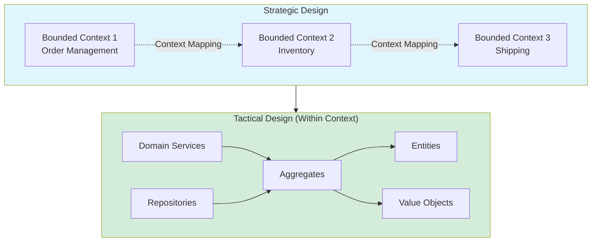
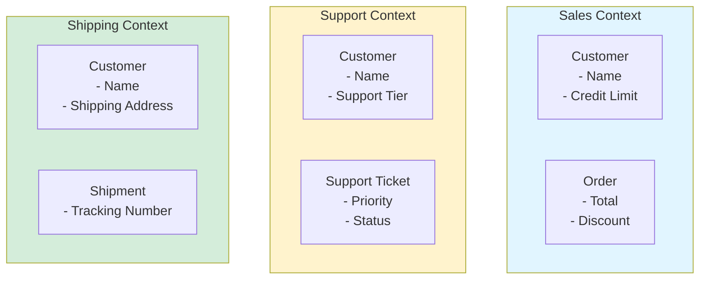
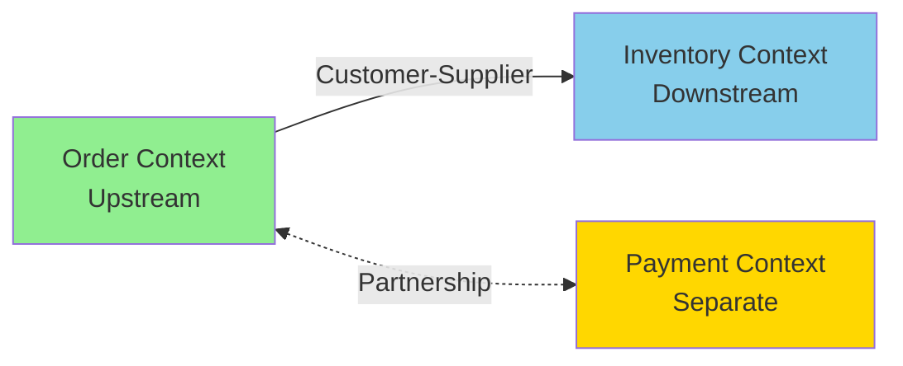
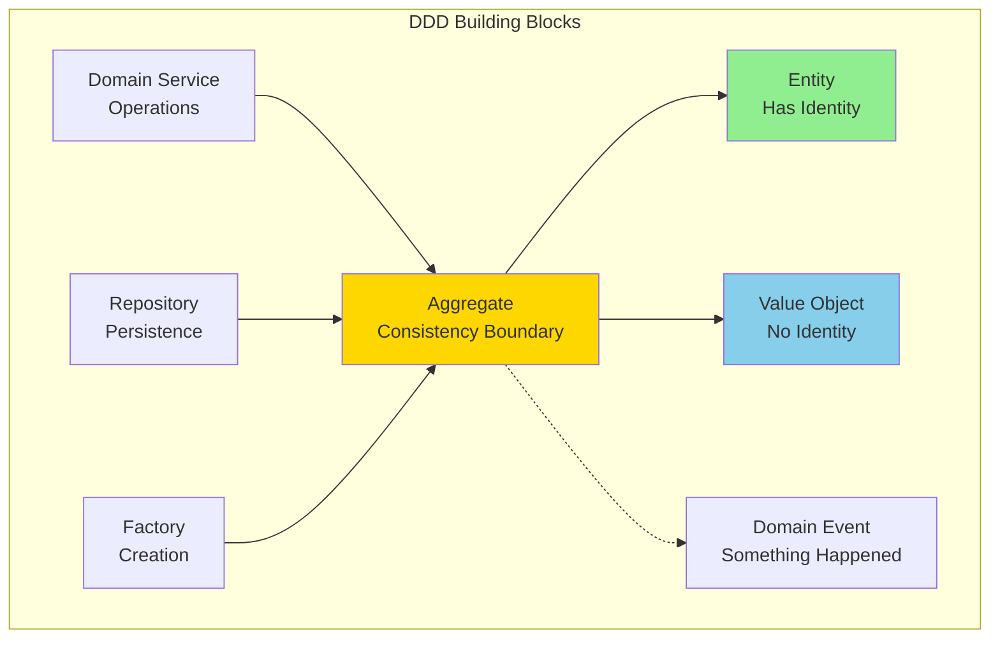
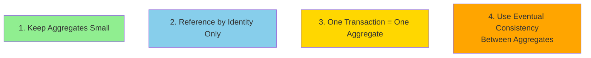
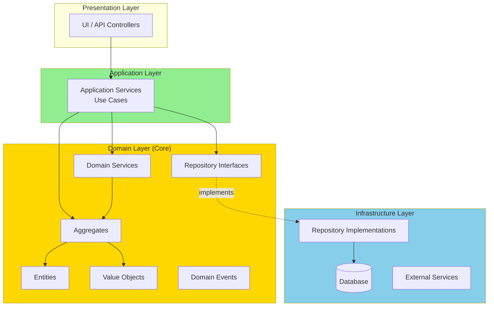
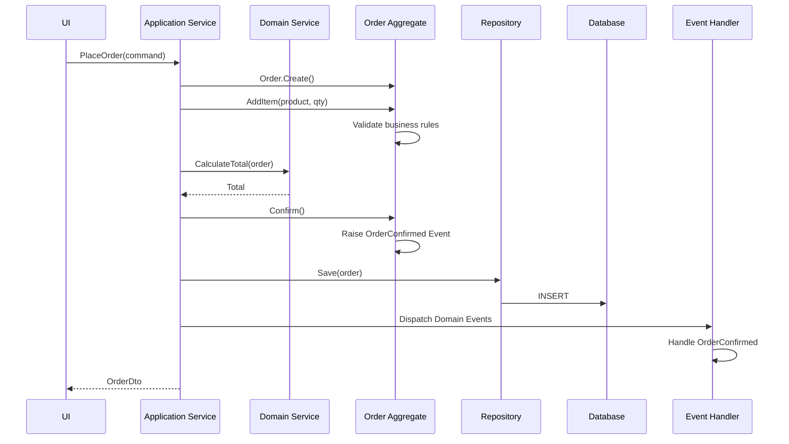

# Domain-Driven Design (DDD)

## Table of Contents
- [Introduction](#introduction)
- [Core Concepts](#core-concepts)
- [Strategic DDD](#strategic-ddd)
- [Tactical DDD](#tactical-ddd)
- [Building Blocks](#building-blocks)
- [Architecture Diagrams](#architecture-diagrams)
- [Code Examples](#code-examples)
- [Aggregates in Detail](#aggregates-in-detail)
- [Domain Events](#domain-events)
- [Advantages](#advantages)
- [Disadvantages](#disadvantages)
- [Use Cases](#use-cases)
- [Best Practices](#best-practices)
- [Common Pitfalls](#common-pitfalls)
- [Interview Questions](#interview-questions)

## Introduction

**Domain-Driven Design (DDD)** is an approach to software development that focuses on creating a deep understanding of the business domain and modeling the software around that understanding. Introduced by Eric Evans in 2003.

### Core Philosophy

> "It is not the domain expert's job to understand technology. It is the developer's job to understand the domain."  
> — Eric Evans

### Key Characteristics

- **Ubiquitous Language**: Common language shared by developers and domain experts
- **Bounded Contexts**: Clear boundaries around models
- **Domain Model**: Rich object model representing business concepts
- **Strategic Design**: High-level patterns for complex systems
- **Tactical Design**: Low-level patterns for implementation

## Core Concepts

### The Big Picture



## Strategic DDD

### Bounded Contexts

A **Bounded Context** is a boundary within which a particular domain model is defined and applicable.



**Key Point**: "Customer" means different things in different contexts!

### Context Mapping

How bounded contexts relate to each other:



**Context Relationship Patterns:**
- **Customer-Supplier**: Upstream influences downstream
- **Partnership**: Mutual dependency
- **Shared Kernel**: Shared code subset
- **Anticorruption Layer**: Protect from external changes

### Ubiquitous Language

A common language between developers and domain experts.

```mermaid
graph TB
    Domain[Domain Expert Says:<br/>"When a customer places an order,<br/>we check inventory,<br/>process payment,<br/>and create a shipment"]
    
    Code[Code Reflects:<br/>Order.Place()<br/>Inventory.CheckAvailability()<br/>Payment.Process()<br/>Shipment.Create()]
    
    Domain -.->|Same Language| Code
    
    style Domain fill:#ffffcc
    style Code fill:#ccffcc
```

## Tactical DDD

### Building Blocks



## Building Blocks

### 1. Entities

Objects with identity that persists over time.

```csharp
namespace ECommerce.Domain.Entities
{
    // Entity - has identity (Id)
    public class Order
    {
        // Identity
        public int Id { get; private set; }
        
        // Properties
        public int CustomerId { get; private set; }
        public DateTime OrderDate { get; private set; }
        public OrderStatus Status { get; private set; }
        
        // Value Objects
        public Address ShippingAddress { get; private set; }
        public Money Total { get; private set; }
        
        // Collections
        private readonly List<OrderItem> _items = new();
        public IReadOnlyCollection<OrderItem> Items => _items.AsReadOnly();
        
        // Factory Method
        public static Order Create(int customerId, Address shippingAddress)
        {
            return new Order
            {
                CustomerId = customerId,
                OrderDate = DateTime.UtcNow,
                Status = OrderStatus.Pending,
                ShippingAddress = shippingAddress
            };
        }
        
        // Business Logic
        public void AddItem(Product product, int quantity)
        {
            if (Status != OrderStatus.Pending)
                throw new DomainException("Cannot modify confirmed order");
            
            _items.Add(new OrderItem(product, quantity));
            RecalculateTotal();
        }
        
        public void Confirm()
        {
            if (!_items.Any())
                throw new DomainException("Cannot confirm empty order");
            
            Status = OrderStatus.Confirmed;
            RaiseDomainEvent(new OrderConfirmedEvent(Id, Total));
        }
        
        private void RecalculateTotal()
        {
            var total = _items.Sum(i => i.Price.Amount * i.Quantity);
            Total = new Money(total, "USD");
        }
    }
}
```

### 2. Value Objects

Objects without identity, defined by their attributes.

```csharp
namespace ECommerce.Domain.ValueObjects
{
    // Value Object - no identity, immutable, equality by value
    public class Money : ValueObject
    {
        public decimal Amount { get; }
        public string Currency { get; }
        
        public Money(decimal amount, string currency)
        {
            if (amount < 0)
                throw new ArgumentException("Amount cannot be negative");
            
            if (string.IsNullOrWhiteSpace(currency))
                throw new ArgumentException("Currency is required");
            
            Amount = amount;
            Currency = currency;
        }
        
        // Operations return new instances
        public Money Add(Money other)
        {
            if (Currency != other.Currency)
                throw new InvalidOperationException("Cannot add different currencies");
            
            return new Money(Amount + other.Amount, Currency);
        }
        
        public Money Multiply(decimal multiplier)
        {
            return new Money(Amount * multiplier, Currency);
        }
        
        // Equality
        protected override IEnumerable<object> GetEqualityComponents()
        {
            yield return Amount;
            yield return Currency;
        }
        
        // Operators
        public static Money operator +(Money a, Money b) => a.Add(b);
        public static Money operator *(Money money, decimal multiplier) => money.Multiply(multiplier);
    }
    
    // Another Value Object
    public class Address : ValueObject
    {
        public string Street { get; }
        public string City { get; }
        public string State { get; }
        public string ZipCode { get; }
        public string Country { get; }
        
        public Address(string street, string city, string state, string zipCode, string country)
        {
            Street = street ?? throw new ArgumentNullException(nameof(street));
            City = city ?? throw new ArgumentNullException(nameof(city));
            State = state ?? throw new ArgumentNullException(nameof(state));
            ZipCode = zipCode ?? throw new ArgumentNullException(nameof(zipCode));
            Country = country ?? throw new ArgumentNullException(nameof(country));
        }
        
        protected override IEnumerable<object> GetEqualityComponents()
        {
            yield return Street;
            yield return City;
            yield return State;
            yield return ZipCode;
            yield return Country;
        }
        
        public override string ToString()
        {
            return $"{Street}, {City}, {State} {ZipCode}, {Country}";
        }
    }
}
```

### 3. Aggregates

Cluster of entities and value objects with a consistency boundary.

```csharp
namespace ECommerce.Domain.Aggregates
{
    // Aggregate Root - Order
    public class Order : AggregateRoot
    {
        // Aggregate Root Identity
        public OrderId Id { get; private set; }
        
        // Entities within aggregate
        private readonly List<OrderItem> _items = new();
        public IReadOnlyCollection<OrderItem> Items => _items.AsReadOnly();
        
        // Value Objects
        public CustomerId CustomerId { get; private set; }
        public Money Total { get; private set; }
        
        // Invariant: Order total must equal sum of items
        private void EnforceInvariants()
        {
            var calculatedTotal = _items
                .Sum(item => item.Price.Amount * item.Quantity);
            
            if (Total.Amount != calculatedTotal)
                throw new DomainException("Order total mismatch");
        }
        
        // All modifications go through aggregate root
        public void AddItem(Product product, int quantity)
        {
            var item = new OrderItem(product.Id, product.Name, product.Price, quantity);
            _items.Add(item);
            RecalculateTotal();
            EnforceInvariants(); // Ensure consistency
        }
        
        // No direct access to OrderItem.ChangeQuantity from outside
        public void ChangeItemQuantity(OrderItemId itemId, int newQuantity)
        {
            var item = _items.FirstOrDefault(i => i.Id == itemId);
            if (item == null)
                throw new DomainException("Item not found");
            
            item.ChangeQuantity(newQuantity);
            RecalculateTotal();
            EnforceInvariants();
        }
    }
    
    // Entity within aggregate - NOT an aggregate root
    public class OrderItem : Entity<OrderItemId>
    {
        public ProductId ProductId { get; private set; }
        public string ProductName { get; private set; }
        public Money Price { get; private set; }
        public int Quantity { get; private set; }
        
        internal OrderItem(ProductId productId, string productName, Money price, int quantity)
        {
            ProductId = productId;
            ProductName = productName;
            Price = price;
            Quantity = quantity;
        }
        
        // Can only be called by aggregate root
        internal void ChangeQuantity(int newQuantity)
        {
            if (newQuantity <= 0)
                throw new DomainException("Quantity must be positive");
            
            Quantity = newQuantity;
        }
    }
}
```

### Aggregate Design Rules



### 4. Domain Services

Operations that don't naturally fit within entities or value objects.

```csharp
namespace ECommerce.Domain.Services
{
    // Domain Service - encapsulates domain logic not belonging to entities
    public class OrderPricingService : IDomainService
    {
        public Money CalculateOrderTotal(Order order, Customer customer)
        {
            var subtotal = order.Items
                .Sum(item => item.Price.Amount * item.Quantity);
            
            // Apply customer-specific discount
            var discount = CalculateDiscount(customer, subtotal);
            var total = subtotal - discount;
            
            // Apply tax based on shipping address
            var tax = CalculateTax(order.ShippingAddress, total);
            
            return new Money(total + tax, "USD");
        }
        
        private decimal CalculateDiscount(Customer customer, decimal subtotal)
        {
            return customer.Tier switch
            {
                CustomerTier.Gold => subtotal * 0.15m,
                CustomerTier.Silver => subtotal * 0.10m,
                CustomerTier.Bronze => subtotal * 0.05m,
                _ => 0
            };
        }
        
        private decimal CalculateTax(Address address, decimal amount)
        {
            // Complex tax calculation logic
            var taxRate = GetTaxRate(address.State);
            return amount * taxRate;
        }
    }
}
```

### 5. Repositories

Abstraction for retrieving and persisting aggregates.

```csharp
namespace ECommerce.Domain.Repositories
{
    // Repository interface in domain layer
    public interface IOrderRepository
    {
        Task<Order> GetByIdAsync(OrderId id);
        Task<IEnumerable<Order>> GetByCustomerAsync(CustomerId customerId);
        Task AddAsync(Order order);
        Task UpdateAsync(Order order);
        Task DeleteAsync(OrderId id);
    }
    
    // Specification pattern for complex queries
    public interface ISpecification<T>
    {
        bool IsSatisfiedBy(T entity);
    }
    
    public class OrdersByStatusSpecification : ISpecification<Order>
    {
        private readonly OrderStatus _status;
        
        public OrdersByStatusSpecification(OrderStatus status)
        {
            _status = status;
        }
        
        public bool IsSatisfiedBy(Order order)
        {
            return order.Status == _status;
        }
    }
}

// Implementation in infrastructure layer
namespace ECommerce.Infrastructure.Repositories
{
    public class OrderRepository : IOrderRepository
    {
        private readonly DbContext _context;
        
        public async Task<Order> GetByIdAsync(OrderId id)
        {
            var entity = await _context.Orders
                .Include(o => o.Items)
                .FirstOrDefaultAsync(o => o.Id == id.Value);
            
            return entity != null ? MapToDomain(entity) : null;
        }
        
        public async Task AddAsync(Order order)
        {
            var entity = MapToEntity(order);
            await _context.Orders.AddAsync(entity);
            await _context.SaveChangesAsync();
        }
    }
}
```

## Domain Events

Events that represent something that happened in the domain.

```csharp
namespace ECommerce.Domain.Events
{
    // Domain Event
    public class OrderConfirmedEvent : IDomainEvent
    {
        public OrderId OrderId { get; }
        public Money Total { get; }
        public DateTime ConfirmedAt { get; }
        
        public OrderConfirmedEvent(OrderId orderId, Money total)
        {
            OrderId = orderId;
            Total = total;
            ConfirmedAt = DateTime.UtcNow;
        }
    }
    
    // Event Handler
    public class OrderConfirmedEventHandler : IDomainEventHandler<OrderConfirmedEvent>
    {
        private readonly IInventoryService _inventoryService;
        private readonly IEmailService _emailService;
        
        public async Task Handle(OrderConfirmedEvent @event)
        {
            // Reserve inventory
            await _inventoryService.ReserveForOrderAsync(@event.OrderId);
            
            // Send confirmation email
            await _emailService.SendOrderConfirmationAsync(@event.OrderId);
        }
    }
}

// Aggregate Root base class with event support
public abstract class AggregateRoot
{
    private readonly List<IDomainEvent> _domainEvents = new();
    public IReadOnlyCollection<IDomainEvent> DomainEvents => _domainEvents.AsReadOnly();
    
    protected void RaiseDomainEvent(IDomainEvent domainEvent)
    {
        _domainEvents.Add(domainEvent);
    }
    
    public void ClearDomainEvents()
    {
        _domainEvents.Clear();
    }
}
```

## Architecture Diagrams

### DDD Layered Architecture



### Complete DDD Example Flow



## Advantages

### ✅ 1. Business-Focused
Code reflects business language and concepts.

### ✅ 2. Rich Domain Model
Business logic in domain objects, not services.

### ✅ 3. Ubiquitous Language
Shared understanding between developers and domain experts.

### ✅ 4. Clear Boundaries
Bounded contexts prevent model ambiguity.

### ✅ 5. Maintainability
Well-organized code that's easier to understand and modify.

### ✅ 6. Testability
Domain logic can be tested independently.

## Disadvantages

### ❌ 1. Complexity
Significant initial learning curve.

### ❌ 2. Time Investment
Requires more upfront design and modeling.

### ❌ 3. Domain Expert Access
Requires ongoing collaboration with domain experts.

### ❌ 4. Overkill for Simple Domains
Not suitable for basic CRUD applications.

### ❌ 5. Organizational Challenges
Requires buy-in from business stakeholders.

## Use Cases

### ✅ When to Use DDD

1. **Complex Business Logic**: Rich domain rules
2. **Long-term Projects**: Years of evolution expected
3. **Domain Expert Availability**: Can collaborate with experts
4. **Large Teams**: Multiple teams on same project
5. **Core Domain**: The competitive advantage of the business

### ❌ When NOT to Use

1. **Simple CRUD**: Basic data management
2. **Short-term Projects**: Quick MVPs
3. **No Domain Experts**: Can't access business knowledge
4. **Small Applications**: Overhead outweighs benefits

## Best Practices

### 1. Collaborate with Domain Experts
Continuous conversation to refine ubiquitous language.

### 2. Focus on Core Domain
Apply DDD to core business logic, not supporting domains.

### 3. Keep Aggregates Small
Large aggregates cause performance and maintenance issues.

### 4. Protect Invariants
Ensure aggregates always in valid state.

### 5. Use Domain Events
Communicate changes within and between bounded contexts.

### 6. Context Mapping
Explicitly define relationships between bounded contexts.

## Common Pitfalls

### 1. Anemic Domain Model
Putting all logic in services instead of domain objects.

### 2. Large Aggregates
Creating aggregates that are too big and complex.

### 3. Ignoring Bounded Contexts
Trying to create one model for everything.

### 4. No Ubiquitous Language
Not establishing shared vocabulary.

### 5. Over-Engineering
Applying DDD to simple CRUD operations.

## Interview Questions

### Q1: What is Domain-Driven Design?

**Answer:** DDD is an approach to software development that focuses on creating a deep model of a business domain and using that model to guide design. It emphasizes collaboration with domain experts, ubiquitous language, and modeling complex business logic.

### Q2: What is a Bounded Context?

**Answer:** A Bounded Context is a boundary within which a particular domain model is defined and applicable. It separates different models to prevent ambiguity. Example: "Customer" in Sales context vs "Customer" in Support context.

### Q3: What is an Aggregate?

**Answer:** An Aggregate is a cluster of entities and value objects treated as a single unit for data changes. It has an Aggregate Root (entry point) that enforces consistency boundaries and business rules. Transactions should not span aggregates.

### Q4: Difference between Entity and Value Object?

**Answer:**
- **Entity**: Has identity that persists over time (e.g., Order with Id)
- **Value Object**: No identity, defined by attributes, immutable (e.g., Money, Address)

### Q5: What is Ubiquitous Language?

**Answer:** A common language shared by developers and domain experts used in code, conversations, and documentation. It bridges the gap between technical and business terminology. Example: Using "Place Order" in code instead of "CreateOrderRecord".

---

**Previous:** [← Microservices Architecture](08-Microservices-Architecture.md)  
**Next:** [Architecture Comparison →](10-Architecture-Comparison.md)
