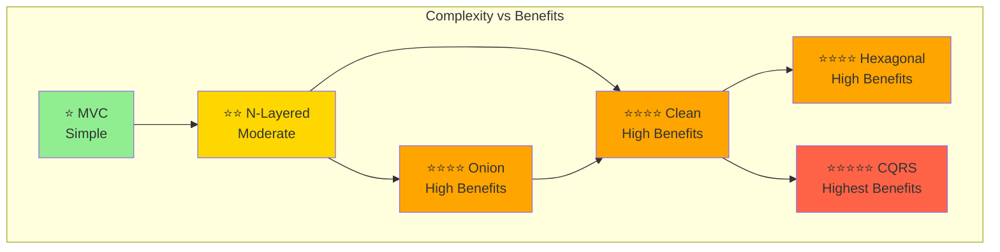
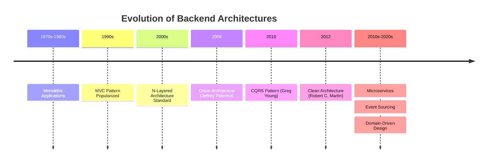
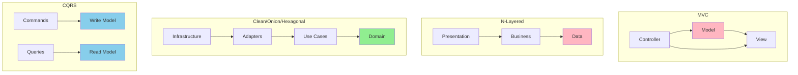
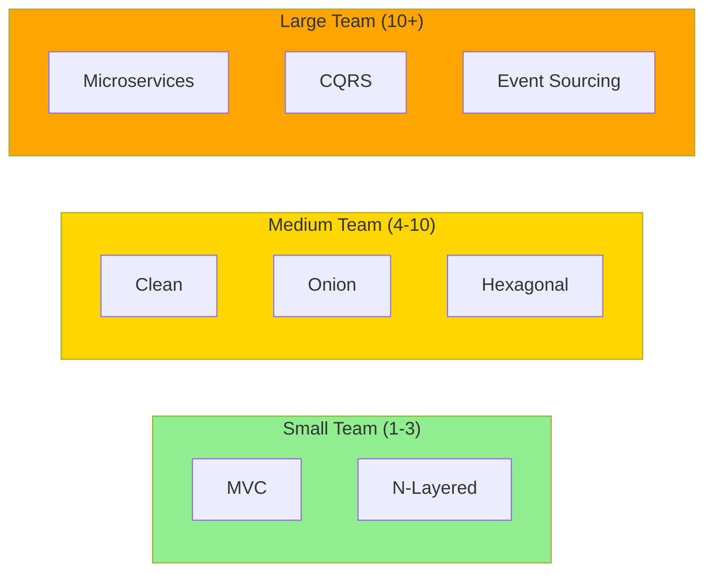
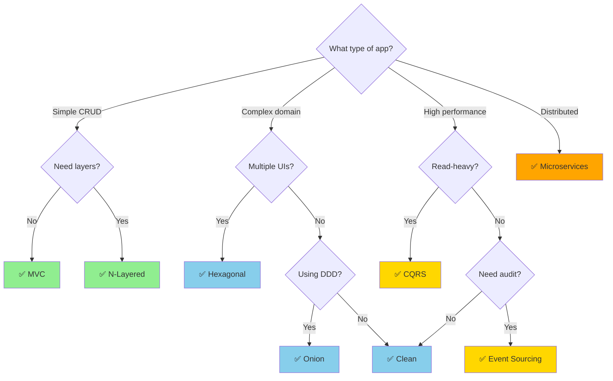
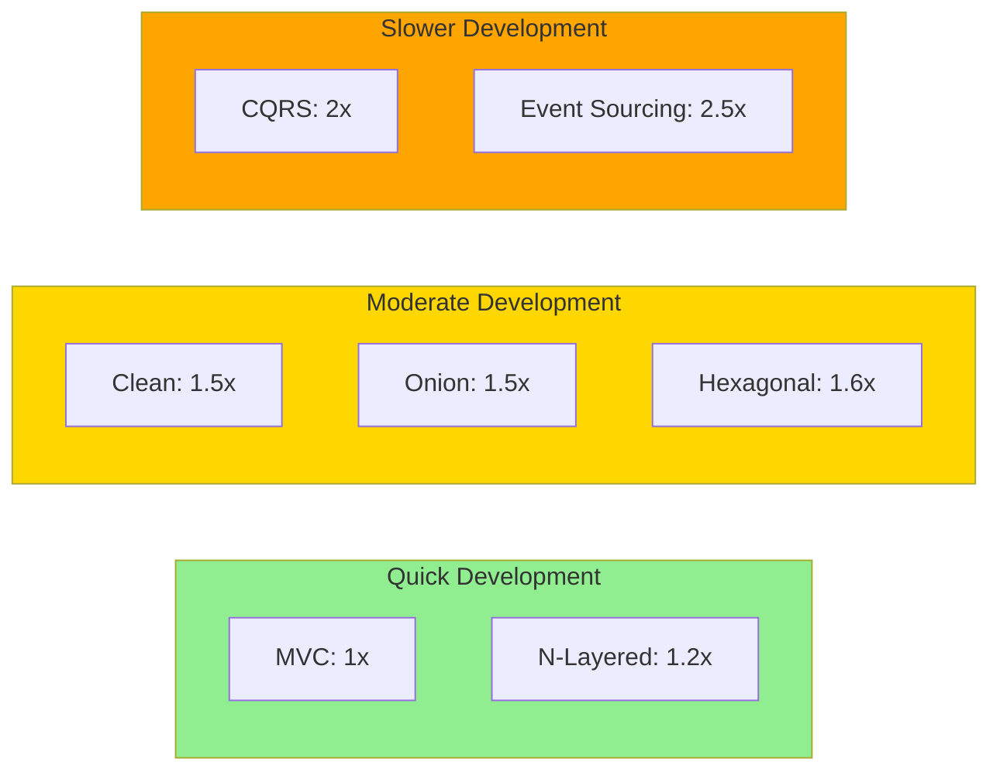
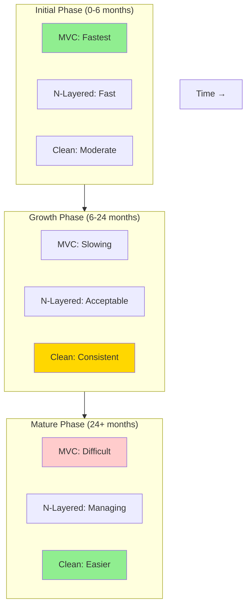

# Architecture Comparison & Decision Guide

## Table of Contents
- [Introduction](#introduction)
- [Complete Architecture Comparison](#complete-architecture-comparison)
- [Visual Comparison](#visual-comparison)
- [Decision Matrix](#decision-matrix)
- [When to Use Which Architecture](#when-to-use-which-architecture)
- [Migration Paths](#migration-paths)
- [Hybrid Approaches](#hybrid-approaches)
- [Real-World Scenarios](#real-world-scenarios)
- [Team Considerations](#team-considerations)
- [Cost-Benefit Analysis](#cost-benefit-analysis)

## Introduction

This guide provides a comprehensive comparison of all backend architectures covered in this series, helping you make informed decisions about which architecture to use for your projects.

## Complete Architecture Comparison

### Side-by-Side Comparison Table

| Aspect | MVC | N-Layered | Clean | Onion | Hexagonal | CQRS |
|--------|-----|-----------|-------|-------|-----------|------|
| **Complexity** | Low | Medium | High | High | High | High |
| **Learning Curve** | Easy | Easy-Medium | Steep | Steep | Steep | Medium-Steep |
| **Testability** | Medium | Medium | Excellent | Excellent | Excellent | Excellent |
| **Dependencies** | Framework-coupled | Layer-coupled | Inward | Inward | Inward | Separated R/W |
| **Domain Focus** | Low | Medium | High | High | High | Medium |
| **Database Coupling** | High | High | Low | Low | Low | Variable |
| **Scalability** | Vertical | Vertical | Both | Both | Both | Horizontal |
| **Best For** | Simple web apps | Enterprise apps | Complex domains | DDD projects | Multiple clients | Read-heavy systems |

### Detailed Comparison



### Architecture Evolution



## Visual Comparison

### Dependency Direction



## Decision Matrix

### Project Characteristics vs Architecture

| Characteristic | Best Architecture | Alternative |
|---------------|-------------------|-------------|
| **Simple CRUD app** | MVC, N-Layered | - |
| **Complex business rules** | Clean, Onion, DDD | Hexagonal |
| **Multiple UIs (Web, Mobile, API)** | Hexagonal, Clean | Onion |
| **High read traffic** | CQRS | N-Layered + Caching |
| **Audit requirements** | Event Sourcing + CQRS | N-Layered + Logging |
| **Microservices** | Clean + CQRS | Hexagonal |
| **Legacy integration** | Hexagonal | Onion |
| **Startup MVP** | MVC | N-Layered |
| **Enterprise application** | N-Layered, Clean | Onion |
| **Event-driven** | CQRS + Event Sourcing | - |

### Team Size & Architecture



## When to Use Which Architecture

### Decision Flowchart



### Quick Reference Guide

**Choose MVC when:**
- ✅ Building simple web applications
- ✅ Rapid development needed
- ✅ Team familiar with MVC
- ✅ SEO is important
- ❌ Complex business logic
- ❌ Multiple interfaces needed

**Choose N-Layered when:**
- ✅ Traditional enterprise app
- ✅ Team familiar with pattern
- ✅ Clear separation needed
- ✅ Database-centric design
- ❌ Domain is very complex
- ❌ Need framework independence

**Choose Clean Architecture when:**
- ✅ Complex business domains
- ✅ Long-term maintainability critical
- ✅ Framework independence desired
- ✅ High testability requirement
- ❌ Simple CRUD application
- ❌ Time-to-market critical

**Choose Onion Architecture when:**
- ✅ Implementing DDD
- ✅ Domain logic is central
- ✅ Need explicit domain services
- ✅ Team understands DDD
- ❌ Simple applications
- ❌ Database-centric design

**Choose Hexagonal Architecture when:**
- ✅ Multiple client types
- ✅ Legacy system integration
- ✅ Testing is top priority
- ✅ External dependencies change
- ❌ Single interface app
- ❌ Stable technology stack

**Choose CQRS when:**
- ✅ Read/write patterns differ
- ✅ Complex querying requirements
- ✅ Different scaling needs
- ✅ Event-driven architecture
- ❌ Simple read-write operations
- ❌ Small application

## Migration Paths

### From Traditional to Modern


### Step-by-Step Migration

**Phase 1: MVC → N-Layered**
1. Extract business logic from controllers
2. Create service layer
3. Implement repository pattern
4. Move data access to repositories

**Phase 2: N-Layered → Clean**
1. Identify domain entities
2. Move business logic to entities
3. Create application services (use cases)
4. Invert dependencies (interfaces in domain)
5. Move infrastructure to outer layer

**Phase 3: Clean → CQRS**
1. Separate commands and queries
2. Create dedicated read models
3. Implement command handlers
4. Implement query handlers
5. Add synchronization between models

**Phase 4: CQRS → Event Sourcing**
1. Design domain events
2. Implement event store
3. Convert aggregates to event sourcing
4. Build projections for read models
5. Add snapshots for performance

## Hybrid Approaches

### Combining Architectures

Many real-world systems use hybrid approaches:

**Clean Architecture + CQRS**
```
Write Side: Clean Architecture with rich domain
Read Side: Simple projections with denormalized data
```

**N-Layered + CQRS (Pragmatic)**
```
Most features: N-Layered (simple)
Complex features: CQRS (specific modules)
```

**Microservices with Mixed Architectures**
```
Service A: MVC (simple catalog)
Service B: Clean + CQRS (complex ordering)
Service C: Event Sourcing (financial transactions)
```

## Real-World Scenarios

### Scenario 1: E-Commerce Platform

**Requirements:**
- Product catalog (read-heavy)
- Order processing (complex business rules)
- Inventory management (high consistency)
- Analytics (historical data)

**Recommended Architecture:**
```
Product Catalog: CQRS (optimize reads)
Order Processing: Clean Architecture (complex domain)
Inventory: Event Sourcing (audit trail)
Analytics: Event Sourcing projections
```

### Scenario 2: Banking Application

**Requirements:**
- Account management
- Transaction processing
- Audit compliance
- Real-time balance

**Recommended Architecture:**
```
Core: Event Sourcing (complete audit)
Transactions: CQRS + Event Sourcing
Read Models: Multiple projections
API Layer: Hexagonal (multiple channels)
```

### Scenario 3: Content Management System

**Requirements:**
- CRUD operations
- Multi-tenant
- Simple workflows
- SEO requirements

**Recommended Architecture:**
```
Core: N-Layered (proven, simple)
Multi-tenancy: Repository pattern with tenant context
SEO: Server-side rendering with MVC
```

## Team Considerations

### Skills Required

| Architecture | Required Skills | Learning Time |
|-------------|----------------|---------------|
| **MVC** | Basic OOP, Web fundamentals | 1-2 weeks |
| **N-Layered** | OOP, Design patterns | 2-4 weeks |
| **Clean** | SOLID, DI, Interfaces | 1-2 months |
| **Onion** | DDD, SOLID, DI | 1-2 months |
| **Hexagonal** | Ports/Adapters concept, DI | 1-2 months |
| **CQRS** | Event-driven, MediatR | 2-3 months |
| **Event Sourcing** | Event modeling, CQRS | 3-6 months |

### Team Size Recommendations

**Small Team (1-5 developers):**
- ✅ MVC, N-Layered, Clean
- ⚠️ CQRS (if absolutely needed)
- ❌ Microservices, Event Sourcing

**Medium Team (6-15 developers):**
- ✅ All architectures
- ⚠️ Microservices (with caution)

**Large Team (15+ developers):**
- ✅ Microservices
- ✅ CQRS + Event Sourcing
- ✅ Complex architectures

## Cost-Benefit Analysis

### Development Time



### Long-Term Maintenance



## Architecture Selection Checklist

Use this checklist to guide your decision:

### Project Characteristics
- [ ] Project size (small/medium/large)
- [ ] Expected lifespan (months/years/decade)
- [ ] Domain complexity (simple/moderate/complex)
- [ ] Read vs Write ratio
- [ ] Number of users (hundreds/thousands/millions)

### Technical Requirements
- [ ] Framework flexibility needed?
- [ ] Multiple client types?
- [ ] Audit/compliance requirements?
- [ ] Performance requirements?
- [ ] Scalability requirements?

### Team Factors
- [ ] Team size and experience
- [ ] Available learning time
- [ ] Budget constraints
- [ ] Time-to-market pressure

### Business Factors
- [ ] Budget for development
- [ ] Maintenance budget
- [ ] Risk tolerance
- [ ] Innovation vs stability

## Final Recommendations

### Simple Projects
**Use:** MVC or N-Layered
- Fast development
- Well-understood
- Easy to maintain
- Cost-effective

### Complex Domain
**Use:** Clean, Onion, or Hexagonal
- Long-term maintainability
- High testability
- Domain-focused
- Framework-independent

### High Performance
**Use:** CQRS
- Scalable reads and writes
- Optimized queries
- Flexible data stores

### Audit & Compliance
**Use:** Event Sourcing
- Complete history
- Replay capability
- Regulatory compliance

### Distributed Systems
**Use:** Microservices + Clean/CQRS
- Independent scaling
- Technology flexibility
- Team autonomy

## Summary

**Key Takeaways:**

1. **No Silver Bullet**: Each architecture has trade-offs
2. **Context Matters**: Choose based on requirements, not hype
3. **Start Simple**: Can always evolve to complex architectures
4. **Team Skills**: Consider team capability and learning curve
5. **Hybrid is OK**: Mix architectures for different modules
6. **Evolution**: Plan migration path for future growth

**Remember:** The best architecture is the simplest one that meets your requirements!

---

**Previous:** [← DDD](09-DDD-Domain-Driven-Design.md)  
**Complete Guide:** [Return to README](README.md)
