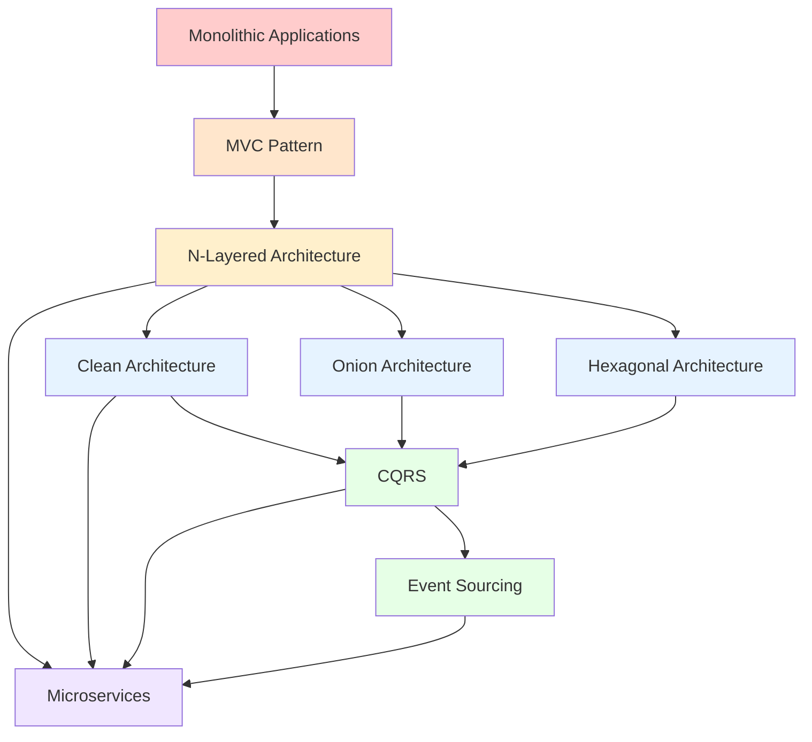

# Backend Architecture Guide

A comprehensive guide to modern backend architectural patterns, from traditional MVC to advanced distributed systems architectures.

## 📚 Table of Contents

### Foundational Architectures
1. [**MVC Architecture**](01-MVC-Architecture.md)
   - Model-View-Controller pattern
   - Request/response flow
   - Best practices and common pitfalls

2. [**N-Layered Architecture**](02-N-Layered-Architecture.md)
   - Traditional layered approach
   - 3-tier and N-tier patterns
   - Layer responsibilities and dependencies

### Modern Clean Architectures
3. [**Clean Architecture**](03-Clean-Architecture.md)
   - Robert C. Martin's principles
   - The Dependency Rule
   - Entities, Use Cases, and Interface Adapters

4. [**Onion Architecture**](04-Onion-Architecture.md)
   - Domain-centric design
   - Dependency inversion
   - Comparison with Clean Architecture

5. [**Hexagonal Architecture**](05-Hexagonal-Architecture.md)
   - Ports and Adapters pattern
   - Application core isolation
   - Testability and flexibility

### Advanced Patterns
6. [**CQRS (Command Query Responsibility Segregation)**](06-CQRS-Architecture.md)
   - Separating reads and writes
   - Command and Query handlers
   - Integration with Event Sourcing

7. [**Event Sourcing**](07-Event-Sourcing.md)
   - Events as source of truth
   - Event stores and projections
   - Combining with CQRS

### Distributed Systems
8. [**Microservices Architecture**](08-Microservices-Architecture.md)
   - Service decomposition
   - Inter-service communication
   - Distributed transactions and Saga pattern

### Design Methodologies
9. [**Domain-Driven Design (DDD)**](09-DDD-Domain-Driven-Design.md)
   - Bounded contexts and ubiquitous language
   - Aggregates, entities, and value objects
   - Strategic and tactical patterns

### Decision Guide
10. [**Architecture Comparison & Selection**](10-Architecture-Comparison.md)
    - Side-by-side comparison
    - Decision matrix
    - When to use which architecture

## 🎯 How to Use This Guide

### For Beginners
Start with the foundational architectures:
1. **MVC Architecture** - Understand the basics
2. **N-Layered Architecture** - Learn traditional separation of concerns
3. **Clean Architecture** - Modern principles and practices

### For Intermediate Developers
Focus on understanding modern patterns:
1. Review foundational architectures quickly
2. Deep dive into Clean, Onion, and Hexagonal architectures
3. Understand CQRS and when to apply it
4. Study DDD principles

### For Advanced Developers
Explore advanced and distributed patterns:
1. Review all architectures for completeness
2. Focus on CQRS + Event Sourcing
3. Master Microservices patterns
4. Study the Architecture Comparison guide for decision-making

### For Architects
Use the complete guide as a reference:
1. Use the **Architecture Comparison** guide for project planning
2. Reference specific patterns for team training
3. Use diagrams for stakeholder communication

## 📖 What You'll Learn

Each architecture guide includes:

- ✅ **Core Concepts** - Fundamental principles and components
- ✅ **Visual Diagrams** - Mermaid diagrams showing structure and flow
- ✅ **Code Examples** - Production-ready C# examples
- ✅ **Project Structure** - Recommended folder organization
- ✅ **Advantages & Disadvantages** - Honest pros and cons
- ✅ **Use Cases** - When to use and when to avoid
- ✅ **Best Practices** - Implementation guidelines
- ✅ **Common Pitfalls** - What to watch out for
- ✅ **Interview Questions** - Common Q&A for preparation

## 🛠️ Technology Stack

The code examples in this guide primarily use:
- **C# / .NET 8+** (ASP.NET Core)
- **Entity Framework Core** for data access
- **MediatR** for CQRS implementation
- **Clean coding principles**

> **Note:** While examples use C#, the architectural concepts apply to any backend technology stack.

## 📊 Architecture Evolution

Understanding how architectures evolved helps you appreciate modern patterns:



## 🎓 Prerequisites

To get the most out of this guide, you should have:

- Basic understanding of object-oriented programming
- Familiarity with C# or similar language
- Understanding of web APIs and HTTP
- Basic knowledge of databases and SQL
- Familiarity with dependency injection concepts

## 🚀 Quick Start

1. **Choose your starting point** based on your experience level (see "How to Use This Guide")
2. **Read sequentially** or jump to specific architectures
3. **Try the code examples** - All examples are production-ready and can be implemented
4. **Review diagrams** - Visual understanding is crucial for architecture
5. **Practice** - Apply patterns to your own projects

## 💡 Key Takeaways

After completing this guide, you will:

- ✅ Understand the evolution and motivation behind different architectures
- ✅ Know when to apply which architectural pattern
- ✅ Be able to design scalable and maintainable backend systems
- ✅ Understand trade-offs between different approaches
- ✅ Be prepared for architecture discussions in interviews
- ✅ Have a reference for implementing various patterns

## 📚 Recommended Reading Order

### Path 1: Traditional to Modern
```
MVC → N-Layered → Clean → DDD → Architecture Comparison
```

### Path 2: Clean Architecture Focus
```
Clean → Onion → Hexagonal → DDD → CQRS → Architecture Comparison
```

### Path 3: Distributed Systems Focus
```
N-Layered → Clean → CQRS → Event Sourcing → Microservices → DDD
```

### Path 4: Complete Journey
```
MVC → N-Layered → Clean → Onion → Hexagonal → 
CQRS → Event Sourcing → Microservices → DDD → Architecture Comparison
```

## 🔄 Version History

- **v1.0** - Initial comprehensive guide covering all major backend architectures

## 📝 Feedback & Contributions

This guide is designed to be a living document. As architectures evolve and new patterns emerge, this guide will be updated.

## ⚖️ License

This guide is created for educational purposes.

---

## 🌟 Getting Started

Ready to dive in? Start with [**MVC Architecture**](01-MVC-Architecture.md) or jump to any architecture that interests you!

**Happy Learning! 🚀**
