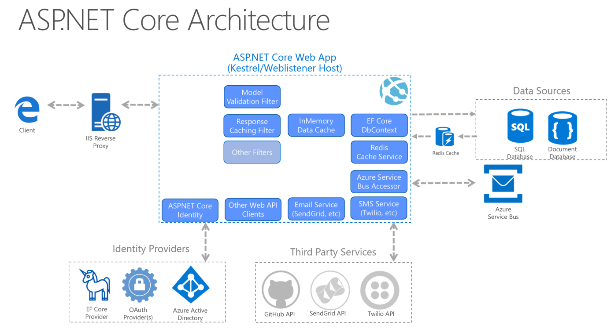

# ASP.NET Core Architecture - Comprehensive Guide



## Table of Contents
1. [Overview](#overview)
2. [Request Flow](#request-flow)
3. [Core Components](#core-components)
4. [Data Access Layer](#data-access-layer)
5. [Caching Strategy](#caching-strategy)
6. [Identity and Authentication](#identity-and-authentication)
7. [Third-Party Integrations](#third-party-integrations)
8. [Messaging and Communication](#messaging-and-communication)
9. [Best Practices](#best-practices)

---

## Overview

ASP.NET Core is a cross-platform, high-performance framework for building modern, cloud-based, and internet-connected applications. This architecture diagram illustrates a comprehensive enterprise-level application setup that leverages various components, services, and external integrations.

### Key Architectural Principles
- **Separation of Concerns**: Each component has a specific responsibility
- **Scalability**: Multiple caching layers and async messaging support
- **Security**: Identity providers and authentication mechanisms
- **Flexibility**: Support for multiple data sources and third-party services

---

## Request Flow

### 1. Client Layer
**Component**: Browser (Edge icon shown)

The client is any device or application that makes HTTP requests to your ASP.NET Core application. This could be:
- Web browsers (Chrome, Firefox, Edge, Safari)
- Mobile applications (iOS, Android)
- Desktop applications
- Other APIs or services (server-to-server communication)

### 2. IIS Reverse Proxy
**Purpose**: Acts as the first entry point for all incoming requests

#### What is IIS (Internet Information Services)?
IIS is Microsoft's web server that can act as a reverse proxy for ASP.NET Core applications.

#### Why Use a Reverse Proxy?
- **Load Balancing**: Distribute traffic across multiple application instances
- **SSL/TLS Termination**: Handle HTTPS encryption/decryption at the proxy level
- **Security**: Add an additional layer of security before requests reach your application
- **Caching**: Cache static content at the proxy level
- **Request Filtering**: Block malicious requests before they reach your app

#### How It Works
```
Client Request → IIS Reverse Proxy → Kestrel Web Server → ASP.NET Core App
```

> [!NOTE]
> While IIS is shown here, you could also use other reverse proxies like:
> - **Nginx** (popular on Linux)
> - **Apache** (with mod_proxy)
> - **Azure Application Gateway**
> - **AWS Application Load Balancer**

### 3. ASP.NET Core Web App (Kestrel/WebListener Host)
This is your actual application running on Kestrel, the built-in cross-platform web server.

#### Kestrel vs WebListener
- **Kestrel**: Cross-platform, lightweight, fast (recommended)
- **WebListener**: Windows-only, supports Windows-specific features (deprecated in favor of IIS integration)

---

## Core Components

### Request Pipeline & Filters

The ASP.NET Core request pipeline uses **middleware** and **filters** to process HTTP requests.

#### 1. Model Validation Filter
**Purpose**: Automatically validates incoming data against model validation rules

**How It Works**:
```csharp
public class User
{
    [Required]
    [StringLength(100)]
    public string Name { get; set; }
    
    [Required]
    [EmailAddress]
    public string Email { get; set; }
}
```

When a request comes in:
1. ASP.NET Core deserializes the request body into your model
2. The Model Validation Filter checks all validation attributes
3. If validation fails, it automatically returns a 400 Bad Request with error details
4. If validation succeeds, the request proceeds to your controller action

**Benefits**:
- Reduces boilerplate validation code
- Consistent error responses
- Separation of validation logic from business logic

#### 2. Response Caching Filter
**Purpose**: Caches HTTP responses to improve performance

**How It Works**:
```csharp
[ResponseCache(Duration = 60)] // Cache for 60 seconds
public IActionResult GetProducts()
{
    var products = _productService.GetAll();
    return Ok(products);
}
```

**Caching Locations**:
- **Client-side**: Browser caches the response
- **Server-side**: ASP.NET Core caches the response in memory
- **Proxy**: Intermediate proxies can cache responses

**When to Use**:
- ✅ Static or rarely-changing data
- ✅ Public data (not user-specific)
- ✅ GET requests
- ❌ User-specific data
- ❌ Frequently changing data
- ❌ POST/PUT/DELETE requests

#### 3. Other Filters
ASP.NET Core supports various filter types:

**Authorization Filters**: Check if user has permission
```csharp
[Authorize(Roles = "Admin")]
public IActionResult DeleteUser(int id) { }
```

**Action Filters**: Run code before/after action execution
```csharp
public class LoggingFilter : IActionFilter
{
    public void OnActionExecuting(ActionExecutingContext context)
    {
        // Log before action executes
    }
}
```

**Exception Filters**: Handle exceptions globally
```csharp
public class GlobalExceptionFilter : IExceptionFilter
{
    public void OnException(ExceptionContext context)
    {
        // Log error and return friendly error response
    }
}
```

**Resource Filters**: Run before model binding
**Result Filters**: Run before/after result execution

---

## Data Access Layer

### Entity Framework Core (EF Core)
**Purpose**: Object-Relational Mapper (ORM) for database access

#### What is an ORM?
An ORM bridges the gap between object-oriented programming and relational databases. Instead of writing SQL queries manually, you work with C# objects.

**Without ORM (Raw SQL)**:
```csharp
var command = new SqlCommand("SELECT * FROM Users WHERE Id = @id", connection);
command.Parameters.AddWithValue("@id", userId);
var reader = command.ExecuteReader();
// Manually map data to objects...
```

**With EF Core**:
```csharp
var user = await _context.Users.FindAsync(userId);
```

#### Key Features

**1. Code-First Approach**
Define your models in C#, and EF Core generates the database schema:
```csharp
public class Product
{
    public int Id { get; set; }
    public string Name { get; set; }
    public decimal Price { get; set; }
    public int CategoryId { get; set; }
    
    // Navigation property
    public Category Category { get; set; }
}
```

**2. Migrations**
Track and apply database schema changes:
```bash
dotnet ef migrations add AddProductTable
dotnet ef database update
```

**3. LINQ Queries**
Write type-safe queries using C#:
```csharp
var expensiveProducts = await _context.Products
    .Where(p => p.Price > 100)
    .Include(p => p.Category)
    .OrderByDescending(p => p.Price)
    .ToListAsync();
```

**4. Change Tracking**
EF Core automatically tracks changes to entities:
```csharp
var product = await _context.Products.FindAsync(1);
product.Price = 99.99m; // EF Core tracks this change
await _context.SaveChangesAsync(); // Generates UPDATE SQL
```

#### Database Providers Supported
- SQL Server
- PostgreSQL
- MySQL/MariaDB
- SQLite
- Oracle
- Cosmos DB
- In-Memory (for testing)

---

## Caching Strategy

The architecture shows a **multi-layer caching strategy** for optimal performance.

### 1. InMemory Data Cache
**Location**: Inside the ASP.NET Core application process
**Technology**: `IMemoryCache`

#### How It Works
```csharp
public class ProductService
{
    private readonly IMemoryCache _cache;
    
    public async Task<Product> GetProductAsync(int id)
    {
        var cacheKey = $"product_{id}";
        
        if (!_cache.TryGetValue(cacheKey, out Product product))
        {
            // Not in cache, fetch from database
            product = await _context.Products.FindAsync(id);
            
            // Store in cache for 10 minutes
            _cache.Set(cacheKey, product, TimeSpan.FromMinutes(10));
        }
        
        return product;
    }
}
```

#### Characteristics
- ⚡ **Fastest**: Data is in the same process (no network calls)
- 🔒 **Isolated**: Each application instance has its own cache
- 💾 **Limited**: Constrained by application memory
- 🔄 **Volatile**: Lost when application restarts

#### When to Use
- Frequently accessed data
- Small datasets
- Single-server deployments
- Data that's expensive to compute but rarely changes

### 2. Redis Cache Service
**Location**: External distributed cache server
**Technology**: Redis (Remote Dictionary Server)

#### What is Redis?
Redis is an in-memory data structure store used as a distributed cache, message broker, and database.

#### How It Works
```csharp
public class DistributedProductService
{
    private readonly IDistributedCache _cache;
    
    public async Task<Product> GetProductAsync(int id)
    {
        var cacheKey = $"product_{id}";
        var cachedData = await _cache.GetStringAsync(cacheKey);
        
        if (cachedData == null)
        {
            var product = await _context.Products.FindAsync(id);
            var serialized = JsonSerializer.Serialize(product);
            
            await _cache.SetStringAsync(cacheKey, serialized, new DistributedCacheEntryOptions
            {
                AbsoluteExpirationRelativeToNow = TimeSpan.FromHours(1)
            });
            
            return product;
        }
        
        return JsonSerializer.Deserialize<Product>(cachedData);
    }
}
```

#### Characteristics
- 🌐 **Shared**: All application instances access the same cache
- 📈 **Scalable**: Can handle large datasets
- 🔄 **Persistent**: Can survive application restarts (with persistence enabled)
- 🐌 **Slower than InMemory**: Requires network call
- ⚡ **Faster than Database**: Still much faster than database queries

#### When to Use
- Multi-server deployments (load-balanced applications)
- Large datasets that don't fit in memory
- Data that needs to be shared across application instances
- Session state in distributed systems

#### Caching Strategy: Cache-Aside Pattern
```
1. Application checks cache first
2. If cache miss → fetch from database
3. Store in cache for next request
4. Return data to client
```

### 3. EF Core Built-in Caching
EF Core has first-level caching (Identity Map pattern):
- Tracks entities within a single `DbContext` instance
- Prevents duplicate queries within the same request
- Not a replacement for distributed caching

---

## Identity and Authentication

### ASP.NET Core Identity
**Purpose**: Built-in membership system for managing users, passwords, roles, and claims

#### Core Features

**1. User Management**
```csharp
public class ApplicationUser : IdentityUser
{
    public string FirstName { get; set; }
    public string LastName { get; set; }
    public DateTime DateOfBirth { get; set; }
}
```

**2. Password Hashing**
- Automatic password hashing using PBKDF2
- Configurable password requirements:
```csharp
services.Configure<IdentityOptions>(options =>
{
    options.Password.RequireDigit = true;
    options.Password.RequiredLength = 8;
    options.Password.RequireNonAlphanumeric = true;
    options.Password.RequireUppercase = true;
});
```

**3. Role-Based Authorization**
```csharp
await _userManager.AddToRoleAsync(user, "Administrator");

[Authorize(Roles = "Administrator")]
public IActionResult DeleteUser(int id) { }
```

**4. Claims-Based Authorization**
```csharp
var claims = new List<Claim>
{
    new Claim("EmployeeId", "12345"),
    new Claim("Department", "Engineering")
};

[Authorize(Policy = "EngineeringOnly")]
public IActionResult ViewTeamData() { }
```

**5. Two-Factor Authentication**
```csharp
await _userManager.SetTwoFactorEnabledAsync(user, true);
var token = await _userManager.GenerateTwoFactorTokenAsync(user, "Email");
```

### Identity Providers

The diagram shows three identity provider options:

#### 1. EF Core Provider
**Default**: Stores user data in a SQL database using EF Core

**Database Tables Created**:
- `AspNetUsers`: User accounts
- `AspNetRoles`: Roles (Admin, User, etc.)
- `AspNetUserRoles`: User-to-role mappings
- `AspNetUserClaims`: User claims
- `AspNetUserLogins`: External login associations

#### 2. OAuth Provider(s)
**Purpose**: Allow users to sign in using external accounts

**Supported Providers**:
- Google
- Facebook
- Microsoft Account
- Twitter
- GitHub
- LinkedIn

**Implementation**:
```csharp
services.AddAuthentication()
    .AddGoogle(options =>
    {
        options.ClientId = Configuration["Google:ClientId"];
        options.ClientSecret = Configuration["Google:ClientSecret"];
    })
    .AddFacebook(options =>
    {
        options.AppId = Configuration["Facebook:AppId"];
        options.AppSecret = Configuration["Facebook:AppSecret"];
    });
```

**How OAuth Works**:
```
1. User clicks "Sign in with Google"
2. App redirects to Google's login page
3. User authenticates with Google
4. Google redirects back with authorization code
5. App exchanges code for access token
6. App retrieves user info from Google
7. App creates/updates local user account
8. User is logged in
```

#### 3. Azure Active Directory (Azure AD)
**Purpose**: Enterprise identity provider for organizations

**Use Cases**:
- Corporate applications
- Single Sign-On (SSO) across multiple apps
- Integration with Office 365
- Multi-tenant SaaS applications

**Implementation**:
```csharp
services.AddAuthentication(AzureADDefaults.AuthenticationScheme)
    .AddAzureAD(options =>
    {
        options.Instance = "https://login.microsoftonline.com/";
        options.TenantId = Configuration["AzureAd:TenantId"];
        options.ClientId = Configuration["AzureAd:ClientId"];
    });
```

**Benefits**:
- Centralized user management
- Conditional access policies
- Multi-factor authentication
- Integration with on-premises Active Directory

---

## Data Sources

### SQL Database
**Purpose**: Primary relational data store

**Typical Uses**:
- Transactional data (orders, users, products)
- Data requiring ACID guarantees
- Complex queries with joins
- Data with relationships

**Examples**: SQL Server, PostgreSQL, MySQL

### Document Database
**Purpose**: NoSQL database for unstructured/semi-structured data

**Typical Uses**:
- Flexible schemas
- Hierarchical data (e.g., product catalogs)
- JSON documents
- High write throughput

**Examples**: MongoDB, Azure Cosmos DB, RavenDB

**Example Document**:
```json
{
  "id": "product_123",
  "name": "Laptop",
  "specs": {
    "cpu": "Intel i7",
    "ram": "16GB",
    "storage": "512GB SSD"
  },
  "reviews": [
    { "rating": 5, "comment": "Great product!" },
    { "rating": 4, "comment": "Good value" }
  ]
}
```

**When to Use SQL vs Document DB**:

| SQL Database | Document Database |
|-------------|------------------|
| Fixed schema | Flexible schema |
| Complex relationships | Hierarchical data |
| ACID transactions | High scalability |
| Complex joins | Denormalized data |
| Strong consistency | Eventual consistency |

---

## Third-Party Integrations

### Other Web API Clients
**Purpose**: Consume external APIs or microservices

**Example**: Calling a payment processing API
```csharp
public class PaymentService
{
    private readonly HttpClient _httpClient;
    
    public async Task<PaymentResult> ProcessPaymentAsync(PaymentRequest request)
    {
        var response = await _httpClient.PostAsJsonAsync(
            "https://api.stripe.com/v1/charges", 
            request
        );
        
        return await response.Content.ReadFromJsonAsync<PaymentResult>();
    }
}
```

**Best Practices**:
- Use `IHttpClientFactory` to manage HttpClient instances
- Implement retry policies with Polly
- Handle rate limiting
- Cache responses when appropriate

### Email Service (SendGrid API)
**Purpose**: Send transactional emails

**Use Cases**:
- Welcome emails
- Password reset emails
- Order confirmations
- Notifications

**Implementation**:
```csharp
public class EmailService
{
    private readonly SendGridClient _client;
    
    public async Task SendWelcomeEmailAsync(string toEmail, string userName)
    {
        var message = new SendGridMessage
        {
            From = new EmailAddress("noreply@yourapp.com", "Your App"),
            Subject = "Welcome to Our Platform!",
            PlainTextContent = $"Hello {userName}, welcome aboard!",
            HtmlContent = $"<h1>Hello {userName}</h1><p>Welcome aboard!</p>"
        };
        
        message.AddTo(new EmailAddress(toEmail));
        
        await _client.SendEmailAsync(message);
    }
}
```

### SMS Service (Twilio API)
**Purpose**: Send SMS messages

**Use Cases**:
- Two-factor authentication codes
- Order status updates
- Alerts and notifications
- Appointment reminders

**Implementation**:
```csharp
public class SmsService
{
    private readonly TwilioRestClient _client;
    
    public async Task SendVerificationCodeAsync(string phoneNumber, string code)
    {
        var message = await MessageResource.CreateAsync(
            to: new PhoneNumber(phoneNumber),
            from: new PhoneNumber("+1234567890"),
            body: $"Your verification code is: {code}"
        );
    }
}
```

### GitHub API
**Purpose**: Integrate with GitHub repositories

**Use Cases**:
- CI/CD pipelines
- Automated repository management
- Pull request automation
- Issue tracking integration

**Example**:
```csharp
public class GitHubService
{
    private readonly GitHubClient _client;
    
    public async Task CreateIssueAsync(string repo, string title, string body)
    {
        var issue = new NewIssue(title) { Body = body };
        await _client.Issue.Create("owner", repo, issue);
    }
}
```

---

## Messaging and Communication

### Azure Service Bus
**Purpose**: Enterprise messaging service for asynchronous communication

#### What is a Message Bus?
A message bus enables decoupled communication between different parts of your application or between different applications.

#### Key Concepts

**1. Queues (Point-to-Point)**
```
Producer → Queue → Single Consumer
```

**Example**: Order processing
```csharp
// Send message to queue
public async Task PlaceOrderAsync(Order order)
{
    var message = new ServiceBusMessage(JsonSerializer.Serialize(order));
    await _sender.SendMessageAsync(message);
}

// Receive message from queue
public async Task ProcessOrdersAsync()
{
    await _receiver.ProcessMessageAsync(async args =>
    {
        var order = JsonSerializer.Deserialize<Order>(args.Message.Body);
        await ProcessOrder(order);
        await args.CompleteMessageAsync(args.Message);
    });
}
```

**2. Topics and Subscriptions (Publish-Subscribe)**
```
Producer → Topic → Multiple Subscribers
```

**Example**: User registration event
```csharp
// Publish to topic
public async Task OnUserRegisteredAsync(User user)
{
    var message = new ServiceBusMessage(JsonSerializer.Serialize(user));
    await _topicSender.SendMessageAsync(message);
}

// Subscriber 1: Send welcome email
// Subscriber 2: Create user profile
// Subscriber 3: Log analytics event
```

#### Benefits
- **Decoupling**: Services don't need to know about each other
- **Scalability**: Handle traffic spikes by queuing requests
- **Reliability**: Messages are persisted and won't be lost
- **Load Leveling**: Process messages at your own pace
- **Resilience**: If a consumer is down, messages wait in the queue

#### Use Cases
- Processing background jobs
- Event-driven architectures
- Microservices communication
- Handling long-running operations
- Email/notification queues

---

## Best Practices

### 1. Layered Architecture

Organize your code into logical layers:

```
┌─────────────────────────┐
│   Presentation Layer    │  Controllers, Views, APIs
├─────────────────────────┤
│   Application Layer     │  Business logic, Services
├─────────────────────────┤
│   Domain Layer          │  Models, Entities, DTOs
├─────────────────────────┤
│   Data Access Layer     │  EF Core, Repositories
├─────────────────────────┤
│   Infrastructure Layer  │  External services, Email, SMS
└─────────────────────────┘
```

### 2. Dependency Injection

ASP.NET Core has built-in DI:

```csharp
// Register services
public void ConfigureServices(IServiceCollection services)
{
    services.AddScoped<IProductRepository, ProductRepository>();
    services.AddScoped<IProductService, ProductService>();
}

// Use in controllers
public class ProductsController : ControllerBase
{
    private readonly IProductService _productService;
    
    public ProductsController(IProductService productService)
    {
        _productService = productService;
    }
}
```

**Service Lifetimes**:
- **Transient**: Created each time requested
- **Scoped**: Created once per request
- **Singleton**: Created once for application lifetime

### 3. Repository Pattern

Abstract data access logic:

```csharp
public interface IRepository<T> where T : class
{
    Task<T> GetByIdAsync(int id);
    Task<IEnumerable<T>> GetAllAsync();
    Task AddAsync(T entity);
    Task UpdateAsync(T entity);
    Task DeleteAsync(int id);
}

public class ProductRepository : IRepository<Product>
{
    private readonly AppDbContext _context;
    
    public async Task<Product> GetByIdAsync(int id)
    {
        return await _context.Products.FindAsync(id);
    }
    
    // Other methods...
}
```

### 4. Configuration Management

Use `appsettings.json` and environment variables:

```json
{
  "ConnectionStrings": {
    "DefaultConnection": "Server=localhost;Database=MyApp;..."
  },
  "Redis": {
    "ConnectionString": "localhost:6379"
  },
  "SendGrid": {
    "ApiKey": "Your-API-Key"
  }
}
```

```csharp
// Access configuration
var connectionString = Configuration.GetConnectionString("DefaultConnection");
var apiKey = Configuration["SendGrid:ApiKey"];
```

**Use User Secrets for Development**:
```bash
dotnet user-secrets set "SendGrid:ApiKey" "your-secret-key"
```

**Use Azure Key Vault for Production**:
```csharp
builder.Configuration.AddAzureKeyVault(
    new Uri("https://your-keyvault.vault.azure.net/"),
    new DefaultAzureCredential()
);
```

### 5. Error Handling

Implement global exception handling:

```csharp
public class GlobalExceptionMiddleware
{
    private readonly RequestDelegate _next;
    private readonly ILogger<GlobalExceptionMiddleware> _logger;
    
    public async Task InvokeAsync(HttpContext context)
    {
        try
        {
            await _next(context);
        }
        catch (Exception ex)
        {
            _logger.LogError(ex, "An unhandled exception occurred");
            await HandleExceptionAsync(context, ex);
        }
    }
    
    private static Task HandleExceptionAsync(HttpContext context, Exception exception)
    {
        context.Response.ContentType = "application/json";
        context.Response.StatusCode = StatusCodes.Status500InternalServerError;
        
        var response = new
        {
            error = "An error occurred while processing your request",
            details = exception.Message // Only in development!
        };
        
        return context.Response.WriteAsJsonAsync(response);
    }
}
```

### 6. Logging

Use structured logging with Serilog or built-in logging:

```csharp
public class ProductService
{
    private readonly ILogger<ProductService> _logger;
    
    public async Task<Product> GetProductAsync(int id)
    {
        _logger.LogInformation("Fetching product with ID {ProductId}", id);
        
        try
        {
            var product = await _repository.GetByIdAsync(id);
            
            if (product == null)
            {
                _logger.LogWarning("Product with ID {ProductId} not found", id);
            }
            
            return product;
        }
        catch (Exception ex)
        {
            _logger.LogError(ex, "Error fetching product with ID {ProductId}", id);
            throw;
        }
    }
}
```

### 7. Security Best Practices

**HTTPS Everywhere**:
```csharp
app.UseHttpsRedirection();
```

**CORS Configuration**:
```csharp
services.AddCors(options =>
{
    options.AddPolicy("AllowSpecificOrigin", builder =>
    {
        builder.WithOrigins("https://yourfrontend.com")
               .AllowAnyMethod()
               .AllowAnyHeader();
    });
});
```

**Data Protection**:
```csharp
services.AddDataProtection()
    .PersistKeysToAzureBlobStorage(/* ... */)
    .ProtectKeysWithAzureKeyVault(/* ... */);
```

**Rate Limiting**:
```csharp
services.AddRateLimiter(options =>
{
    options.GlobalLimiter = PartitionedRateLimiter.Create<HttpContext, string>(context =>
        RateLimitPartition.GetFixedWindowLimiter(
            partitionKey: context.User.Identity?.Name ?? context.Request.Headers.Host.ToString(),
            factory: partition => new FixedWindowRateLimiterOptions
            {
                AutoReplenishment = true,
                PermitLimit = 100,
                QueueLimit = 0,
                Window = TimeSpan.FromMinutes(1)
            }));
});
```

### 8. Performance Optimization

**Async/Await Everywhere**:
```csharp
public async Task<IActionResult> GetProducts()
{
    var products = await _productService.GetAllAsync();
    return Ok(products);
}
```

**Database Query Optimization**:
```csharp
// Bad: N+1 query problem
var products = await _context.Products.ToListAsync();
foreach (var product in products)
{
    var category = await _context.Categories.FindAsync(product.CategoryId);
}

// Good: Use Include to eager load
var products = await _context.Products
    .Include(p => p.Category)
    .ToListAsync();
```

**Pagination**:
```csharp
public async Task<PagedResult<Product>> GetProductsAsync(int page, int pageSize)
{
    var totalCount = await _context.Products.CountAsync();
    var products = await _context.Products
        .Skip((page - 1) * pageSize)
        .Take(pageSize)
        .ToListAsync();
    
    return new PagedResult<Product>
    {
        Items = products,
        TotalCount = totalCount,
        Page = page,
        PageSize = pageSize
    };
}
```

---

## Summary

This ASP.NET Core architecture demonstrates a **production-ready, enterprise-grade** application with:

✅ **Robust Request Pipeline**: Filters for validation, caching, and error handling  
✅ **Multi-Layer Caching**: InMemory + Redis for optimal performance  
✅ **Flexible Data Access**: EF Core supporting multiple databases  
✅ **Comprehensive Security**: Multiple identity providers (local, OAuth, Azure AD)  
✅ **Scalable Messaging**: Azure Service Bus for async communication  
✅ **Third-Party Integration**: Email (SendGrid), SMS (Twilio), APIs (GitHub)  
✅ **High Performance**: Reverse proxy, caching, async operations  

> [!IMPORTANT]
> This architecture is designed to scale from small applications to large enterprise systems. You can start simple and add components as needed.

### Next Steps for Learning

1. **Build a Simple API**: Start with CRUD operations
2. **Add EF Core**: Implement data access with Code-First approach
3. **Implement Caching**: Start with InMemory, then add Redis
4. **Add Authentication**: Implement ASP.NET Core Identity
5. **Integrate External APIs**: Practice with SendGrid or Twilio
6. **Deploy to Azure**: Learn cloud deployment and scaling

---

## Additional Resources

- [Official ASP.NET Core Documentation](https://docs.microsoft.com/aspnet/core)
- [Entity Framework Core Documentation](https://docs.microsoft.com/ef/core)
- [Azure Service Bus Documentation](https://docs.microsoft.com/azure/service-bus-messaging)
- [ASP.NET Core Architecture eBook](https://docs.microsoft.com/dotnet/architecture/modern-web-apps-azure)
