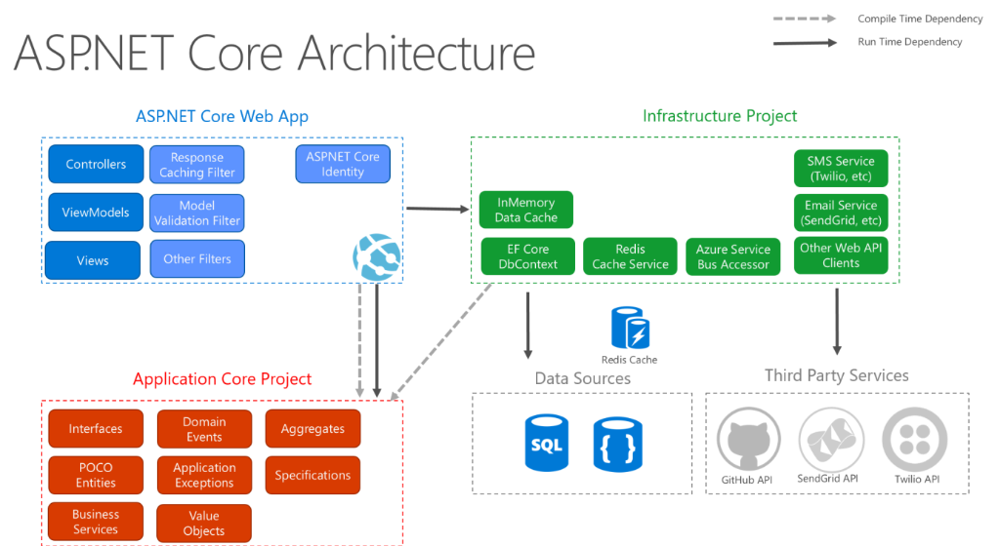
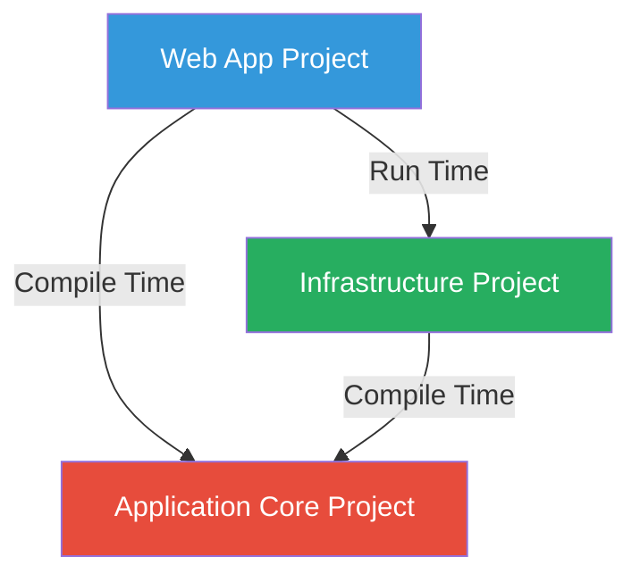

# ASP.NET Core Clean Architecture - Comprehensive Guide



## Table of Contents
1. [Overview](#overview)
2. [Clean Architecture Principles](#clean-architecture-principles)
3. [Project Structure](#project-structure)
4. [Application Core Project](#application-core-project)
5. [ASP.NET Core Web App Project](#aspnet-core-web-app-project)
6. [Infrastructure Project](#infrastructure-project)
7. [Dependency Rules](#dependency-rules)
8. [Domain-Driven Design Concepts](#domain-driven-design-concepts)
9. [Implementation Examples](#implementation-examples)
10. [Best Practices](#best-practices)

---

## Overview

This diagram illustrates **Clean Architecture** (also known as **Onion Architecture** or **Hexagonal Architecture**) applied to an ASP.NET Core application. Clean Architecture is a software design philosophy that separates concerns into layers with strict dependency rules, making applications more maintainable, testable, and independent of frameworks, databases, and external services.

### Key Benefits

✅ **Independence**: Business logic doesn't depend on UI, database, or external services  
✅ **Testability**: Core business logic can be tested in isolation  
✅ **Maintainability**: Changes in one layer don't affect others  
✅ **Flexibility**: Easy to swap implementations (e.g., change from SQL to MongoDB)  
✅ **Scalability**: Clear separation makes it easier to scale teams and features  

### The Three Projects

This architecture organizes code into three distinct projects:

1. **ASP.NET Core Web App**: Presentation layer (UI, Controllers, Views)
2. **Application Core**: Business logic and domain models (framework-agnostic)
3. **Infrastructure**: External concerns (databases, APIs, caching, messaging)

> [!IMPORTANT]
> The dependency flow is **unidirectional**: Web App and Infrastructure depend on Application Core, but Application Core depends on **NOTHING**. This is the fundamental principle of Clean Architecture.

---

## Clean Architecture Principles

### The Dependency Rule

```
┌─────────────────────────────────────┐
│     ASP.NET Core Web App            │ ──┐
│  (Controllers, Views, Filters)      │   │
└─────────────────────────────────────┘   │
                                          │
┌─────────────────────────────────────┐   ├──→ Depends On
│     Infrastructure Project          │   │
│  (EF Core, Redis, Email, APIs)      │   │
└─────────────────────────────────────┘   │
                                          │
┌─────────────────────────────────────┐   │
│     Application Core Project        │ ◄─┘
│  (Entities, Interfaces, Logic)      │
│  DEPENDS ON NOTHING!                │
└─────────────────────────────────────┘
```

**The Rule**: Dependencies point **INWARD**. Inner layers never depend on outer layers.

- ✅ Web App can reference Application Core
- ✅ Infrastructure can reference Application Core  
- ❌ Application Core **cannot** reference Web App or Infrastructure
- ❌ Application Core **cannot** reference Entity Framework, ASP.NET, or any external library

### Why This Matters

**Traditional Architecture Problem**:
```csharp
// BAD: Business logic tightly coupled to database
public class OrderService
{
    private readonly SqlConnection _connection; // Directly depends on SQL!
    
    public void CreateOrder(Order order)
    {
        var command = new SqlCommand("INSERT INTO Orders...", _connection);
        // Business logic mixed with database code
    }
}
```

**Clean Architecture Solution**:
```csharp
// GOOD: Business logic depends on abstraction
public class OrderService
{
    private readonly IOrderRepository _repository; // Depends on interface!
    
    public void CreateOrder(Order order)
    {
        // Pure business logic
        order.Validate();
        order.CalculateTotal();
        _repository.Add(order);
    }
}
```

---

## Project Structure

### Complete Project Organization

```
MySolution/
│
├── src/
│   ├── MyApp.Core/                    # Application Core
│   │   ├── Entities/
│   │   ├── Interfaces/
│   │   ├── Aggregates/
│   │   ├── DomainEvents/
│   │   ├── Specifications/
│   │   ├── Services/
│   │   ├── Exceptions/
│   │   └── ValueObjects/
│   │
│   ├── MyApp.Infrastructure/          # Infrastructure
│   │   ├── Data/
│   │   ├── Caching/
│   │   ├── Messaging/
│   │   ├── Email/
│   │   ├── SMS/
│   │   └── ExternalAPIs/
│   │
│   └── MyApp.Web/                     # Web App
│       ├── Controllers/
│       ├── Views/
│       ├── ViewModels/
│       ├── Filters/
│       └── Program.cs
│
└── tests/
    ├── MyApp.Core.Tests/
    ├── MyApp.Infrastructure.Tests/
    └── MyApp.Web.Tests/
```

### Dependency Graph



**Legend**:
- **Compile Time Dependency**: Project reference in `.csproj` file
- **Run Time Dependency**: Dependency injection at runtime

---

## Application Core Project

The **heart** of your application. Contains all business logic, domain models, and business rules. **100% independent** of any external frameworks or libraries.

### Components

#### 1. Interfaces

**Purpose**: Define contracts for external dependencies

These interfaces are defined in the Core but **implemented** in the Infrastructure project. This is the **Dependency Inversion Principle** in action.

**Example**:
```csharp
namespace MyApp.Core.Interfaces
{
    // Repository interface
    public interface IRepository<T> where T : BaseEntity
    {
        Task<T> GetByIdAsync(int id);
        Task<IEnumerable<T>> ListAllAsync();
        Task<T> AddAsync(T entity);
        Task UpdateAsync(T entity);
        Task DeleteAsync(T entity);
    }
    
    // Specific repository
    public interface IOrderRepository : IRepository<Order>
    {
        Task<IEnumerable<Order>> GetOrdersByCustomerAsync(int customerId);
        Task<Order> GetOrderWithItemsAsync(int orderId);
    }
    
    // Email service interface
    public interface IEmailService
    {
        Task SendEmailAsync(string to, string subject, string body);
    }
    
    // Cache service interface
    public interface ICacheService
    {
        Task<T> GetAsync<T>(string key);
        Task SetAsync<T>(string key, T value, TimeSpan expiration);
        Task RemoveAsync(string key);
    }
}
```

**Benefits**:
- Core defines **WHAT** it needs
- Infrastructure provides **HOW** it's done
- Easy to swap implementations (SQL → MongoDB, SendGrid → AWS SES)
- Easy to mock for testing

#### 2. POCO Entities

**POCO** = Plain Old CLR Objects

**Purpose**: Core domain models representing business concepts

**Characteristics**:
- No dependencies on any framework
- No data annotations (like `[Required]`, `[MaxLength]`)
- Pure C# classes with business logic
- Rich domain models (not anemic)

**Example**:
```csharp
namespace MyApp.Core.Entities
{
    public class Order : BaseEntity
    {
        public int CustomerId { get; private set; }
        public DateTime OrderDate { get; private set; }
        public OrderStatus Status { get; private set; }
        public decimal TotalAmount { get; private set; }
        
        private List<OrderItem> _items = new();
        public IReadOnlyList<OrderItem> Items => _items.AsReadOnly();
        
        // Factory method
        public static Order Create(int customerId)
        {
            return new Order
            {
                CustomerId = customerId,
                OrderDate = DateTime.UtcNow,
                Status = OrderStatus.Pending,
                TotalAmount = 0
            };
        }
        
        // Business logic methods
        public void AddItem(int productId, int quantity, decimal price)
        {
            if (Status != OrderStatus.Pending)
                throw new InvalidOperationException("Cannot modify confirmed order");
            
            var item = new OrderItem(productId, quantity, price);
            _items.Add(item);
            RecalculateTotal();
        }
        
        public void RemoveItem(int productId)
        {
            var item = _items.FirstOrDefault(i => i.ProductId == productId);
            if (item != null)
            {
                _items.Remove(item);
                RecalculateTotal();
            }
        }
        
        public void Confirm()
        {
            if (_items.Count == 0)
                throw new InvalidOperationException("Cannot confirm empty order");
            
            Status = OrderStatus.Confirmed;
        }
        
        private void RecalculateTotal()
        {
            TotalAmount = _items.Sum(i => i.Quantity * i.Price);
        }
    }
    
    public enum OrderStatus
    {
        Pending,
        Confirmed,
        Shipped,
        Delivered,
        Cancelled
    }
}
```

**Key Points**:
- Private setters protect invariants
- Business methods enforce rules
- Validation is part of the model
- Domain events can be raised (see Domain Events section)

#### 3. Aggregates

**Purpose**: Group related entities and enforce consistency boundaries

An **Aggregate** is a cluster of domain objects that can be treated as a single unit. One entity is the **Aggregate Root**.

**Rules**:
- External objects can only reference the Aggregate Root
- Changes to the aggregate are made through the root
- Transactional consistency is maintained within the aggregate

**Example**:
```csharp
namespace MyApp.Core.Aggregates
{
    // Order is the Aggregate Root
    public class OrderAggregate : BaseEntity, IAggregateRoot
    {
        public int CustomerId { get; private set; }
        public Address ShippingAddress { get; private set; } // Value Object
        
        private List<OrderItem> _items = new();
        public IReadOnlyList<OrderItem> Items => _items.AsReadOnly();
        
        private List<DomainEvent> _domainEvents = new();
        public IReadOnlyList<DomainEvent> DomainEvents => _domainEvents.AsReadOnly();
        
        // Business operations that maintain consistency
        public void ChangeShippingAddress(Address newAddress)
        {
            if (Status == OrderStatus.Shipped)
                throw new InvalidOperationException("Cannot change address after shipping");
            
            ShippingAddress = newAddress;
            _domainEvents.Add(new OrderAddressChangedEvent(this.Id, newAddress));
        }
        
        public void ApplyDiscount(decimal discountAmount)
        {
            // Ensure discount doesn't exceed total
            if (discountAmount > TotalAmount)
                throw new InvalidOperationException("Discount cannot exceed order total");
            
            // Apply discount to items proportionally
            foreach (var item in _items)
            {
                var itemDiscount = (item.TotalPrice / TotalAmount) * discountAmount;
                item.ApplyDiscount(itemDiscount);
            }
            
            RecalculateTotal();
        }
    }
    
    // OrderItem is part of the aggregate (not a root)
    public class OrderItem : BaseEntity
    {
        public int ProductId { get; private set; }
        public string ProductName { get; private set; }
        public int Quantity { get; private set; }
        public decimal Price { get; private set; }
        public decimal Discount { get; private set; }
        
        public decimal TotalPrice => (Price * Quantity) - Discount;
        
        internal void ApplyDiscount(decimal amount)
        {
            Discount += amount;
        }
    }
}
```

**Why Use Aggregates?**
- Enforces transactional boundaries
- Prevents inconsistent state
- Encapsulates complex business rules
- Makes concurrency control easier

#### 4. Domain Events

**Purpose**: Represent something that happened in the domain

Domain events enable **eventual consistency** and **loose coupling** between aggregates.

**Example**:
```csharp
namespace MyApp.Core.DomainEvents
{
    public abstract class DomainEvent
    {
        public DateTime OccurredOn { get; } = DateTime.UtcNow;
        public Guid EventId { get; } = Guid.NewGuid();
    }
    
    // Specific events
    public class OrderCreatedEvent : DomainEvent
    {
        public int OrderId { get; }
        public int CustomerId { get; }
        public decimal TotalAmount { get; }
        
        public OrderCreatedEvent(int orderId, int customerId, decimal totalAmount)
        {
            OrderId = orderId;
            CustomerId = customerId;
            TotalAmount = totalAmount;
        }
    }
    
    public class OrderConfirmedEvent : DomainEvent
    {
        public int OrderId { get; }
        
        public OrderConfirmedEvent(int orderId)
        {
            OrderId = orderId;
        }
    }
    
    public class PaymentReceivedEvent : DomainEvent
    {
        public int OrderId { get; }
        public decimal Amount { get; }
        public string PaymentMethod { get; }
        
        public PaymentReceivedEvent(int orderId, decimal amount, string paymentMethod)
        {
            OrderId = orderId;
            Amount = amount;
            PaymentMethod = paymentMethod;
        }
    }
}
```

**Event Handlers**:
```csharp
namespace MyApp.Core.DomainEvents
{
    public interface IDomainEventHandler<T> where T : DomainEvent
    {
        Task HandleAsync(T domainEvent);
    }
    
    // Handler for order confirmation
    public class OrderConfirmedEventHandler : IDomainEventHandler<OrderConfirmedEvent>
    {
        private readonly IEmailService _emailService;
        private readonly ICustomerRepository _customerRepository;
        
        public async Task HandleAsync(OrderConfirmedEvent domainEvent)
        {
            // Send confirmation email
            var customer = await _customerRepository.GetByIdAsync(domainEvent.CustomerId);
            await _emailService.SendEmailAsync(
                customer.Email,
                "Order Confirmed",
                $"Your order #{domainEvent.OrderId} has been confirmed!"
            );
        }
    }
}
```

**Benefits**:
- Decouples aggregates (Order doesn't need to know about Email)
- Enables audit trails
- Supports event sourcing
- Makes side effects explicit

#### 5. Specifications

**Purpose**: Encapsulate query logic in reusable, testable objects

The **Specification Pattern** helps avoid repetitive query code and makes business rules reusable.

**Example**:
```csharp
namespace MyApp.Core.Specifications
{
    // Base specification
    public abstract class BaseSpecification<T>
    {
        public Expression<Func<T, bool>> Criteria { get; }
        public List<Expression<Func<T, object>>> Includes { get; } = new();
        public Expression<Func<T, object>> OrderBy { get; private set; }
        public Expression<Func<T, object>> OrderByDescending { get; private set; }
        public int Take { get; private set; }
        public int Skip { get; private set; }
        public bool IsPagingEnabled { get; private set; }
        
        protected BaseSpecification(Expression<Func<T, bool>> criteria = null)
        {
            Criteria = criteria;
        }
        
        protected void AddInclude(Expression<Func<T, object>> includeExpression)
        {
            Includes.Add(includeExpression);
        }
        
        protected void ApplyPaging(int skip, int take)
        {
            Skip = skip;
            Take = take;
            IsPagingEnabled = true;
        }
        
        protected void ApplyOrderBy(Expression<Func<T, object>> orderByExpression)
        {
            OrderBy = orderByExpression;
        }
    }
    
    // Specific specifications
    public class CustomerOrdersSpecification : BaseSpecification<Order>
    {
        public CustomerOrdersSpecification(int customerId)
            : base(o => o.CustomerId == customerId)
        {
            AddInclude(o => o.Items);
            AddInclude(o => o.ShippingAddress);
            ApplyOrderByDescending(o => o.OrderDate);
        }
    }
    
    public class RecentOrdersSpecification : BaseSpecification<Order>
    {
        public RecentOrdersSpecification(int days)
            : base(o => o.OrderDate >= DateTime.UtcNow.AddDays(-days))
        {
            ApplyOrderByDescending(o => o.OrderDate);
        }
    }
    
    public class PendingOrdersSpecification : BaseSpecification<Order>
    {
        public PendingOrdersSpecification()
            : base(o => o.Status == OrderStatus.Pending)
        {
        }
    }
    
    // Combine specifications
    public class CustomerPendingOrdersSpecification : BaseSpecification<Order>
    {
        public CustomerPendingOrdersSpecification(int customerId)
            : base(o => o.CustomerId == customerId && o.Status == OrderStatus.Pending)
        {
            AddInclude(o => o.Items);
        }
    }
}
```

**Usage**:
```csharp
// In repository implementation
public async Task<IEnumerable<Order>> ListAsync(ISpecification<Order> spec)
{
    var query = _context.Orders.AsQueryable();
    
    if (spec.Criteria != null)
        query = query.Where(spec.Criteria);
    
    foreach (var include in spec.Includes)
        query = query.Include(include);
    
    if (spec.OrderBy != null)
        query = query.OrderBy(spec.OrderBy);
    
    if (spec.IsPagingEnabled)
        query = query.Skip(spec.Skip).Take(spec.Take);
    
    return await query.ToListAsync();
}

// In service
var spec = new CustomerPendingOrdersSpecification(customerId);
var pendingOrders = await _orderRepository.ListAsync(spec);
```

**Benefits**:
- Reusable query logic
- Testable in isolation
- Business rules as first-class objects
- Avoids code duplication

#### 6. Business Services

**Purpose**: Orchestrate domain logic that doesn't belong to a single entity

**When to Use**:
- Logic involves multiple aggregates
- External service calls
- Complex workflows

**Example**:
```csharp
namespace MyApp.Core.Services
{
    public class OrderService
    {
        private readonly IOrderRepository _orderRepository;
        private readonly IProductRepository _productRepository;
        private readonly ICustomerRepository _customerRepository;
        
        public async Task<Order> PlaceOrderAsync(int customerId, List<OrderItemDto> items)
        {
            // Validate customer exists
            var customer = await _customerRepository.GetByIdAsync(customerId);
            if (customer == null)
                throw new NotFoundException("Customer not found");
            
            // Create order
            var order = Order.Create(customerId);
            
            // Add items and validate product availability
            foreach (var item in items)
            {
                var product = await _productRepository.GetByIdAsync(item.ProductId);
                if (product == null)
                    throw new NotFoundException($"Product {item.ProductId} not found");
                
                if (product.Stock < item.Quantity)
                    throw new InsufficientStockException(product.Name);
                
                order.AddItem(item.ProductId, item.Quantity, product.Price);
                product.ReduceStock(item.Quantity);
            }
            
            // Save order
            await _orderRepository.AddAsync(order);
            
            return order;
        }
        
        public async Task CancelOrderAsync(int orderId)
        {
            var order = await _orderRepository.GetOrderWithItemsAsync(orderId);
            if (order == null)
                throw new NotFoundException("Order not found");
            
            // Business rule: Can only cancel pending or confirmed orders
            if (order.Status == OrderStatus.Shipped || order.Status == OrderStatus.Delivered)
                throw new InvalidOperationException("Cannot cancel shipped or delivered orders");
            
            // Restore product stock
            foreach (var item in order.Items)
            {
                var product = await _productRepository.GetByIdAsync(item.ProductId);
                product.IncreaseStock(item.Quantity);
            }
            
            // Cancel order
            order.Cancel();
            await _orderRepository.UpdateAsync(order);
        }
    }
}
```

#### 7. Value Objects

**Purpose**: Objects that are defined by their attributes, not identity

**Characteristics**:
- No unique identifier
- Immutable
- Equality based on values
- Can contain business logic

**Example**:
```csharp
namespace MyApp.Core.ValueObjects
{
    public class Address : ValueObject
    {
        public string Street { get; private set; }
        public string City { get; private set; }
        public string State { get; private set; }
        public string ZipCode { get; private set; }
        public string Country { get; private set; }
        
        private Address() { } // For EF Core
        
        public Address(string street, string city, string state, string zipCode, string country)
        {
            Street = street ?? throw new ArgumentNullException(nameof(street));
            City = city ?? throw new ArgumentNullException(nameof(city));
            State = state ?? throw new ArgumentNullException(nameof(state));
            ZipCode = zipCode ?? throw new ArgumentNullException(nameof(zipCode));
            Country = country ?? throw new ArgumentNullException(nameof(country));
            
            ValidateZipCode(zipCode);
        }
        
        private void ValidateZipCode(string zipCode)
        {
            if (Country == "USA" && !Regex.IsMatch(zipCode, @"^\d{5}(-\d{4})?$"))
                throw new ArgumentException("Invalid US zip code");
        }
        
        protected override IEnumerable<object> GetEqualityComponents()
        {
            yield return Street;
            yield return City;
            yield return State;
            yield return ZipCode;
            yield return Country;
        }
    }
    
    public class Money : ValueObject
    {
        public decimal Amount { get; private set; }
        public string Currency { get; private set; }
        
        public Money(decimal amount, string currency)
        {
            if (amount < 0)
                throw new ArgumentException("Amount cannot be negative");
            
            Amount = amount;
            Currency = currency ?? throw new ArgumentNullException(nameof(currency));
        }
        
        public Money Add(Money other)
        {
            if (Currency != other.Currency)
                throw new InvalidOperationException("Cannot add different currencies");
            
            return new Money(Amount + other.Amount, Currency);
        }
        
        protected override IEnumerable<object> GetEqualityComponents()
        {
            yield return Amount;
            yield return Currency;
        }
    }
    
    // Base class
    public abstract class ValueObject
    {
        protected abstract IEnumerable<object> GetEqualityComponents();
        
        public override bool Equals(object obj)
        {
            if (obj == null || obj.GetType() != GetType())
                return false;
            
            var valueObject = (ValueObject)obj;
            return GetEqualityComponents().SequenceEqual(valueObject.GetEqualityComponents());
        }
        
        public override int GetHashCode()
        {
            return GetEqualityComponents()
                .Aggregate(1, (current, obj) =>
                {
                    unchecked
                    {
                        return current * 23 + (obj?.GetHashCode() ?? 0);
                    }
                });
        }
    }
}
```

**Entity vs Value Object**:

| Entity | Value Object |
|--------|-------------|
| Has unique ID | No ID |
| Mutable | Immutable |
| Identity matters | Values matter |
| `User`, `Order` | `Address`, `Money` |
| Two users with same name are different | Two addresses with same values are equal |

#### 8. Application Exceptions

**Purpose**: Domain-specific exceptions for business rule violations

**Example**:
```csharp
namespace MyApp.Core.Exceptions
{
    public class DomainException : Exception
    {
        public DomainException(string message) : base(message) { }
    }
    
    public class NotFoundException : DomainException
    {
        public NotFoundException(string entityName, object key)
            : base($"{entityName} with key {key} was not found")
        {
        }
        
        public NotFoundException(string message) : base(message)
        {
        }
    }
    
    public class InsufficientStockException : DomainException
    {
        public InsufficientStockException(string productName)
            : base($"Insufficient stock for product: {productName}")
        {
        }
    }
    
    public class InvalidOrderStateException : DomainException
    {
        public InvalidOrderStateException(string operation, OrderStatus currentStatus)
            : base($"Cannot {operation} order in {currentStatus} status")
        {
        }
    }
}
```

---

## ASP.NET Core Web App Project

The **presentation layer** that handles HTTP requests and responses.

### Components

#### 1. Controllers

**Purpose**: Handle HTTP requests and return responses

```csharp
namespace MyApp.Web.Controllers
{
    [ApiController]
    [Route("api/[controller]")]
    public class OrdersController : ControllerBase
    {
        private readonly IOrderService _orderService;
        private readonly IMapper _mapper;
        
        public OrdersController(IOrderService orderService, IMapper mapper)
        {
            _orderService = orderService;
            _mapper = mapper;
        }
        
        [HttpPost]
        public async Task<ActionResult<OrderDto>> CreateOrder([FromBody] CreateOrderDto dto)
        {
            var order = await _orderService.PlaceOrderAsync(dto.CustomerId, dto.Items);
            return CreatedAtAction(nameof(GetOrder), new { id = order.Id }, _mapper.Map<OrderDto>(order));
        }
        
        [HttpGet("{id}")]
        public async Task<ActionResult<OrderDto>> GetOrder(int id)
        {
            var order = await _orderService.GetOrderByIdAsync(id);
            if (order == null)
                return NotFound();
            
            return Ok(_mapper.Map<OrderDto>(order));
        }
        
        [HttpPut("{id}/confirm")]
        public async Task<IActionResult> ConfirmOrder(int id)
        {
            await _orderService.ConfirmOrderAsync(id);
            return NoContent();
        }
    }
}
```

#### 2. ViewModels

**Purpose**: DTOs (Data Transfer Objects) for API requests/responses

```csharp
namespace MyApp.Web.ViewModels
{
    public class OrderDto
    {
        public int Id { get; set; }
        public int CustomerId { get; set; }
        public DateTime OrderDate { get; set; }
        public string Status { get; set; }
        public decimal TotalAmount { get; set; }
        public List<OrderItemDto> Items { get; set; }
    }
    
    public class CreateOrderDto
    {
        [Required]
        public int CustomerId { get; set; }
        
        [Required]
        [MinLength(1)]
        public List<OrderItemDto> Items { get; set; }
    }
    
    public class OrderItemDto
    {
        [Required]
        public int ProductId { get; set; }
        
        [Range(1, 1000)]
        public int Quantity { get; set; }
    }
}
```

**Why Use ViewModels/DTOs?**
- Separate API contract from domain models
- Control what data is exposed
- Add validation attributes
- Prevent over-posting vulnerabilities
- Enable API versioning

#### 3. Views

**Purpose**: Razor pages or views for server-side rendering

```razor
@model OrderViewModel

<h2>Order #@Model.Id</h2>

<div class="order-details">
    <p><strong>Customer:</strong> @Model.CustomerName</p>
    <p><strong>Date:</strong> @Model.OrderDate.ToString("yyyy-MM-dd")</p>
    <p><strong>Status:</strong> <span class="badge">@Model.Status</span></p>
    
    <h3>Items</h3>
    <table class="table">
        <thead>
            <tr>
                <th>Product</th>
                <th>Quantity</th>
                <th>Price</th>
                <th>Total</th>
            </tr>
        </thead>
        <tbody>
            @foreach (var item in Model.Items)
            {
                <tr>
                    <td>@item.ProductName</td>
                    <td>@item.Quantity</td>
                    <td>@item.Price.ToString("C")</td>
                    <td>@item.TotalPrice.ToString("C")</td>
                </tr>
            }
        </tbody>
    </table>
    
    <p class="total"><strong>Total:</strong> @Model.TotalAmount.ToString("C")</p>
</div>
```

#### 4. Filters

Filters are covered in the previous guide, but key ones include:

- **Model Validation Filter**: Automatic validation
- **Response Caching Filter**: HTTP caching
- **Authorization Filters**: Security
- **Exception Filters**: Global error handling

#### 5. ASP.NET Core Identity

**Purpose**: User authentication and authorization

```csharp
// Startup configuration
services.AddIdentity<ApplicationUser, IdentityRole>()
    .AddEntityFrameworkStores<ApplicationDbContext>()
    .AddDefaultTokenProviders();

// Usage in controller
[Authorize]
public class AccountController : Controller
{
    private readonly UserManager<ApplicationUser> _userManager;
    private readonly SignInManager<ApplicationUser> _signInManager;
    
    [HttpPost]
    public async Task<IActionResult> Register(RegisterViewModel model)
    {
        var user = new ApplicationUser { UserName = model.Email, Email = model.Email };
        var result = await _userManager.CreateAsync(user, model.Password);
        
        if (result.Succeeded)
        {
            await _signInManager.SignInAsync(user, isPersistent: false);
            return RedirectToAction("Index", "Home");
        }
        
        return View(model);
    }
}
```

---

## Infrastructure Project

The **external layer** that implements interfaces defined in Application Core.

### Components

#### 1. InMemory Data Cache

**Purpose**: Fast in-process caching

**Implementation**:
```csharp
namespace MyApp.Infrastructure.Caching
{
    public class InMemoryCacheService : ICacheService
    {
        private readonly IMemoryCache _cache;
        
        public InMemoryCacheService(IMemoryCache cache)
        {
            _cache = cache;
        }
        
        public Task<T> GetAsync<T>(string key)
        {
            _cache.TryGetValue(key, out T value);
            return Task.FromResult(value);
        }
        
        public Task SetAsync<T>(string key, T value, TimeSpan expiration)
        {
            _cache.Set(key, value, expiration);
            return Task.CompletedTask;
        }
        
        public Task RemoveAsync(string key)
        {
            _cache.Remove(key);
            return Task.CompletedTask;
        }
    }
}
```

#### 2. EF Core DbContext

**Purpose**: Database access using Entity Framework Core

**Implementation**:
```csharp
namespace MyApp.Infrastructure.Data
{
    public class ApplicationDbContext : DbContext
    {
        public DbSet<Order> Orders { get; set; }
        public DbSet<Product> Products { get; set; }
        public DbSet<Customer> Customers { get; set; }
        
        protected override void OnModelCreating(ModelBuilder modelBuilder)
        {
            // Configure entities
            modelBuilder.Entity<Order>(entity =>
            {
                entity.ToTable("Orders");
                entity.HasKey(e => e.Id);
                
                // Value object configuration
                entity.OwnsOne(o => o.ShippingAddress, address =>
                {
                    address.Property(a => a.Street).HasMaxLength(200);
                    address.Property(a => a.City).HasMaxLength(100);
                });
                
                // One-to-many relationship
                entity.HasMany(o => o.Items)
                      .WithOne()
                      .HasForeignKey("OrderId");
            });
        }
    }
    
    // Repository implementation
    public class OrderRepository : IOrderRepository
    {
        private readonly ApplicationDbContext _context;
        
        public async Task<Order> GetByIdAsync(int id)
        {
            return await _context.Orders.FindAsync(id);
        }
        
        public async Task<Order> GetOrderWithItemsAsync(int orderId)
        {
            return await _context.Orders
                .Include(o => o.Items)
                .FirstOrDefaultAsync(o => o.Id == orderId);
        }
        
        public async Task<IEnumerable<Order>> GetOrdersByCustomerAsync(int customerId)
        {
            return await _context.Orders
                .Where(o => o.CustomerId == customerId)
                .Include(o => o.Items)
                .ToListAsync();
        }
    }
}
```

#### 3. Redis Cache Service

**Purpose**: Distributed caching

**Implementation**:
```csharp
namespace MyApp.Infrastructure.Caching
{
    public class RedisCacheService : ICacheService
    {
        private readonly IConnectionMultiplexer _redis;
        
        public RedisCacheService(IConnectionMultiplexer redis)
        {
            _redis = redis;
        }
        
        public async Task<T> GetAsync<T>(string key)
        {
            var db = _redis.GetDatabase();
            var value = await db.StringGetAsync(key);
            
            if (value.IsNullOrEmpty)
                return default;
            
            return JsonSerializer.Deserialize<T>(value);
        }
        
        public async Task SetAsync<T>(string key, T value, TimeSpan expiration)
        {
            var db = _redis.GetDatabase();
            var serialized = JsonSerializer.Serialize(value);
            await db.StringSetAsync(key, serialized, expiration);
        }
        
        public async Task RemoveAsync(string key)
        {
            var db = _redis.GetDatabase();
            await db.KeyDeleteAsync(key);
        }
    }
}
```

#### 4. Azure Service Bus Accessor

**Purpose**: Message queue integration

**Implementation**:
```csharp
namespace MyApp.Infrastructure.Messaging
{
    public interface IMessageBus
    {
        Task PublishAsync<T>(T message) where T : class;
    }
    
    public class ServiceBusMessageBus : IMessageBus
    {
        private readonly ServiceBusClient _client;
        
        public async Task PublishAsync<T>(T message) where T : class
        {
            var sender = _client.CreateSender("orders-queue");
            var busMessage = new ServiceBusMessage(JsonSerializer.Serialize(message));
            await sender.SendMessageAsync(busMessage);
        }
    }
}
```

#### 5. Email Service (SendGrid)

**Purpose**: Send emails

**Implementation**:
```csharp
namespace MyApp.Infrastructure.Email
{
    public class SendGridEmailService : IEmailService
    {
        private readonly SendGridClient _client;
        
        public async Task SendEmailAsync(string to, string subject, string body)
        {
            var message = new SendGridMessage
            {
                From = new EmailAddress("noreply@myapp.com"),
                Subject = subject,
                HtmlContent = body
            };
            
            message.AddTo(new EmailAddress(to));
            await _client.SendEmailAsync(message);
        }
    }
}
```

#### 6. SMS Service (Twilio)

**Purpose**: Send SMS messages

**Implementation**:
```csharp
namespace MyApp.Infrastructure.SMS
{
    public class TwilioSmsService : ISmsService
    {
        private readonly TwilioRestClient _client;
        private readonly string _fromNumber;
        
        public async Task SendSmsAsync(string to, string message)
        {
            await MessageResource.CreateAsync(
                to: new PhoneNumber(to),
                from: new PhoneNumber(_fromNumber),
                body: message
            );
        }
    }
}
```

#### 7. Other Web API Clients

**Purpose**: Integrate with external APIs

**Example - GitHub API**:
```csharp
namespace MyApp.Infrastructure.ExternalAPIs
{
    public interface IGitHubService
    {
        Task<Repository> GetRepositoryAsync(string owner, string repo);
    }
    
    public class GitHubService : IGitHubService
    {
        private readonly GitHubClient _client;
        
        public async Task<Repository> GetRepositoryAsync(string owner, string repo)
        {
            return await _client.Repository.Get(owner, repo);
        }
    }
}
```

---

## Dependency Rules

### Compile-Time Dependencies

Shown with **dashed arrows** in the diagram.

```xml
<!-- Application.Core.csproj -->
<Project Sdk="Microsoft.NET.Sdk">
  <PropertyGroup>
    <TargetFramework>net8.0</TargetFramework>
  </PropertyGroup>
  
  <!-- NO PROJECT REFERENCES! -->
  <!-- Core depends on NOTHING -->
</Project>

<!-- Infrastructure.csproj -->
<Project Sdk="Microsoft.NET.Sdk">
  <ItemGroup>
    <!-- Infrastructure references Core -->
    <ProjectReference Include="..\Application.Core\Application.Core.csproj" />
  </ItemGroup>
  
  <ItemGroup>
    <!-- External packages -->
    <PackageReference Include="Microsoft.EntityFrameworkCore" />
    <PackageReference Include="StackExchange.Redis" />
    <PackageReference Include="SendGrid" />
  </ItemGroup>
</Project>

<!-- Web.csproj -->
<Project Sdk="Microsoft.NET.Sdk.Web">
  <ItemGroup>
    <!-- Web references Core -->
    <ProjectReference Include="..\Application.Core\Application.Core.csproj" />
    <!-- NO direct reference to Infrastructure at compile time! -->
  </ItemGroup>
</Project>
```

### Run-Time Dependencies

Shown with **solid arrows** in the diagram.

At runtime, the Web project needs Infrastructure implementations, configured via Dependency Injection:

```csharp
// Program.cs in Web project
var builder = WebApplication.CreateBuilder(args);

// Register Core services
builder.Services.AddScoped<IOrderService, OrderService>();

// Register Infrastructure implementations
builder.Services.AddScoped<IOrderRepository, OrderRepository>();
builder.Services.AddScoped<IEmailService, SendGridEmailService>();
builder.Services.AddScoped<ISmsService, TwilioSmsService>();
builder.Services.AddSingleton<ICacheService, RedisCacheService>();

// EF Core
builder.Services.AddDbContext<ApplicationDbContext>(options =>
    options.UseSqlServer(builder.Configuration.GetConnectionString("DefaultConnection")));

var app = builder.Build();
```

**Why This Matters**:
- Web project doesn't reference Infrastructure at **compile time**
- Dependencies are injected at **runtime**
- Easy to swap implementations (e.g., Redis → Memory cache for testing)
- Follows Dependency Inversion Principle

---

## Domain-Driven Design Concepts

### Ubiquitous Language

**Concept**: Use the same language in code as the business uses

**Bad**:
```csharp
public class Transaction { } // Generic, unclear
public class Record { }
public class Item { }
```

**Good**:
```csharp
public class Order { } // Clear business term
public class Invoice { }
public class Product { }
```

### Bounded Contexts

**Concept**: Different parts of the application may have different models for the same concept

**Example**: "Customer" means different things in different contexts

```
┌─────────────────────┐  ┌─────────────────────┐  ┌─────────────────────┐
│  Sales Context      │  │  Shipping Context   │  │  Support Context    │
├─────────────────────┤  ├─────────────────────┤  ├─────────────────────┤
│ Customer            │  │ Customer            │  │ Customer            │
│ - Id                │  │ - Id                │  │ - Id                │
│ - CreditLimit       │  │ - Address           │  │ - TicketHistory     │
│ - PaymentTerms      │  │ - PreferredCarrier  │  │ - SupportLevel      │
└─────────────────────┘  └─────────────────────┘  └─────────────────────┘
```

Each context has its own model, optimized for its needs.

### Entities vs Value Objects

**When to Use Entities**:
- Object has a lifecycle
- Identity matters
- Needs to be tracked over time

**When to Use Value Objects**:
- Object is defined by its attributes
- Immutable
- No lifecycle
- Can be replaced

---

## Implementation Examples

### Complete Feature: Order Management

Let's walk through implementing a complete feature across all layers.

#### 1. Core Layer

**Entity**:
```csharp
// Core/Entities/Order.cs
public class Order : BaseEntity, IAggregateRoot
{
    public int CustomerId { get; private set; }
    public DateTime OrderDate { get; private set; }
    public OrderStatus Status { get; private set; }
    
    private List<OrderItem> _items = new();
    public IReadOnlyList<OrderItem> Items => _items.AsReadOnly();
    
    public static Order Create(int customerId)
    {
        return new Order
        {
            CustomerId = customerId,
            OrderDate = DateTime.UtcNow,
            Status = OrderStatus.Pending
        };
    }
    
    public void AddItem(int productId, int quantity, decimal price)
    {
        _items.Add(new OrderItem(productId, quantity, price));
    }
    
    public void Confirm()
    {
        if (Status != OrderStatus.Pending)
            throw new InvalidOrderStateException("confirm", Status);
        
        Status = OrderStatus.Confirmed;
        DomainEvents.Add(new OrderConfirmedEvent(this.Id));
    }
}
```

**Interface**:
```csharp
// Core/Interfaces/IOrderRepository.cs
public interface IOrderRepository : IRepository<Order>
{
    Task<IEnumerable<Order>> GetOrdersByCustomerAsync(int customerId);
}
```

**Service**:
```csharp
// Core/Services/IOrderService.cs
public interface IOrderService
{
    Task<Order> PlaceOrderAsync(int customerId, List<OrderItemDto> items);
    Task ConfirmOrderAsync(int orderId);
}

// Core/Services/OrderService.cs
public class OrderService : IOrderService
{
    private readonly IOrderRepository _orderRepository;
    private readonly IProductRepository _productRepository;
    
    public async Task<Order> PlaceOrderAsync(int customerId, List<OrderItemDto> items)
    {
        var order = Order.Create(customerId);
        
        foreach (var item in items)
        {
            var product = await _productRepository.GetByIdAsync(item.ProductId);
            order.AddItem(item.ProductId, item.Quantity, product.Price);
        }
        
        await _orderRepository.AddAsync(order);
        return order;
    }
    
    public async Task ConfirmOrderAsync(int orderId)
    {
        var order = await _orderRepository.GetByIdAsync(orderId);
        order.Confirm();
        await _orderRepository.UpdateAsync(order);
    }
}
```

#### 2. Infrastructure Layer

**Repository**:
```csharp
// Infrastructure/Data/OrderRepository.cs
public class OrderRepository : IOrderRepository
{
    private readonly ApplicationDbContext _context;
    
    public async Task<Order> GetByIdAsync(int id)
    {
        return await _context.Orders
            .Include(o => o.Items)
            .FirstOrDefaultAsync(o => o.Id == id);
    }
    
    public async Task<IEnumerable<Order>> GetOrdersByCustomerAsync(int customerId)
    {
        return await _context.Orders
            .Where(o => o.CustomerId == customerId)
            .ToListAsync();
    }
    
    public async Task<Order> AddAsync(Order order)
    {
        _context.Orders.Add(order);
        await _context.SaveChangesAsync();
        return order;
    }
}
```

#### 3. Web Layer

**Controller**:
```csharp
// Web/Controllers/OrdersController.cs
[ApiController]
[Route("api/[controller]")]
public class OrdersController : ControllerBase
{
    private readonly IOrderService _orderService;
    
    [HttpPost]
    public async Task<ActionResult<OrderDto>> CreateOrder([FromBody] CreateOrderDto dto)
    {
        var order = await _orderService.PlaceOrderAsync(dto.CustomerId, dto.Items);
        return CreatedAtAction(nameof(GetOrder), new { id = order.Id }, order);
    }
    
    [HttpPut("{id}/confirm")]
    public async Task<IActionResult> ConfirmOrder(int id)
    {
        await _orderService.ConfirmOrderAsync(id);
        return NoContent();
    }
    
    [HttpGet("{id}")]
    public async Task<ActionResult<Order>> GetOrder(int id)
    {
        var order = await _orderService.GetOrderByIdAsync(id);
        return Ok(order);
    }
}
```

**ViewModel**:
```csharp
// Web/ViewModels/CreateOrderDto.cs
public class CreateOrderDto
{
    [Required]
    public int CustomerId { get; set; }
    
    [Required]
    [MinLength(1)]
    public List<OrderItemDto> Items { get; set; }
}
```

---

## Best Practices

### 1. Keep Core Pure

✅ **DO**:
- Use plain C# classes
- Define interfaces for external dependencies
- Implement rich domain models with business logic

❌ **DON'T**:
- Reference any infrastructure libraries
- Use data annotations from EF Core
- Depend on ASP.NET Core libraries

### 2. Use Dependency Injection

```csharp
// Program.cs
builder.Services.AddScoped<IOrderService, OrderService>();
builder.Services.AddScoped<IOrderRepository, OrderRepository>();
```

### 3. Implement Unit of Work Pattern

```csharp
public interface IUnitOfWork
{
    IOrderRepository Orders { get; }
    ICustomerRepository Customers { get; }
    Task<int> CommitAsync();
}

public class UnitOfWork : IUnitOfWork
{
    private readonly ApplicationDbContext _context;
    
    public IOrderRepository Orders { get; }
    public ICustomerRepository Customers { get; }
    
    public async Task<int> CommitAsync()
    {
        return await _context.SaveChangesAsync();
    }
}
```

### 4. Use AutoMapper for DTO Mapping

```csharp
public class MappingProfile : Profile
{
    public MappingProfile()
    {
        CreateMap<Order, OrderDto>();
        CreateMap<OrderItem, OrderItemDto>();
    }
}
```

### 5. Implement Global Exception Handling

```csharp
app.UseExceptionHandler(errorApp =>
{
    errorApp.Run(async context =>
    {
        var exception = context.Features.Get<IExceptionHandlerFeature>()?.Error;
        
        var statusCode = exception switch
        {
            NotFoundException => 404,
            InvalidOperationException => 400,
            _ => 500
        };
        
        context.Response.StatusCode = statusCode;
        await context.Response.WriteAsJsonAsync(new { error = exception.Message });
    });
});
```

### 6. Use Specification Pattern for Queries

```csharp
var spec = new CustomerOrdersSpecification(customerId);
var orders = await _repository.ListAsync(spec);
```

### 7. Implement Caching Strategy

```csharp
public async Task<Product> GetProductAsync(int id)
{
    var cacheKey = $"product:{id}";
    var cached = await _cache.GetAsync<Product>(cacheKey);
    
    if (cached != null)
        return cached;
    
    var product = await _repository.GetByIdAsync(id);
    await _cache.SetAsync(cacheKey, product, TimeSpan.FromMinutes(10));
    
    return product;
}
```

### 8. Use Domain Events for Side Effects

```csharp
// After saving order
foreach (var domainEvent in order.DomainEvents)
{
    await _eventDispatcher.DispatchAsync(domainEvent);
}
```

---

## Summary

Clean Architecture in ASP.NET Core provides:

✅ **Separation of Concerns**: Each layer has a specific responsibility  
✅ **Independence**: Core business logic is framework-agnostic  
✅ **Testability**: Easy to test business logic in isolation  
✅ **Maintainability**: Changes in one layer don't cascade to others  
✅ **Flexibility**: Easy to swap databases, frameworks, or external services  

### Key Takeaways

1. **Application Core** is the heart - pure business logic, no dependencies
2. **Infrastructure** implements interfaces defined in Core
3. **Web** orchestrates and presents data
4. Dependencies flow **inward** (Dependency Rule)
5. Use **DDD patterns** (Aggregates, Value Objects, Specifications)
6. Implement **rich domain models**, not anemic ones
7. Use **Domain Events** for loose coupling
8. Keep **ViewModels** separate from domain models

### When to Use Clean Architecture

✅ **Complex business logic**: Worth the extra structure  
✅ **Long-term projects**: Will change and evolve over time  
✅ **Team projects**: Clear boundaries help teams work independently  
✅ **Enterprise applications**: Need maintainability and testability  

❌ **Simple CRUD apps**: Might be over-engineering  
❌ **Prototypes**: Too much structure for quick experiments  
❌ **Small utilities**: Overhead not justified  

---

## Additional Resources

- [Clean Architecture by Robert C. Martin](https://blog.cleancoder.com/uncle-bob/2012/08/13/the-clean-architecture.html)
- [Domain-Driven Design by Eric Evans](https://www.domainlanguage.com/ddd/)
- [Microsoft eShopOnWeb Sample](https://github.com/dotnet-architecture/eShopOnWeb)
- [Ardalis Clean Architecture Template](https://github.com/ardalis/CleanArchitecture)
- [ASP.NET Core Architecture Documentation](https://docs.microsoft.com/en-us/dotnet/architecture/modern-web-apps-azure/)
