# Web Deployment Fundamentals: From Ground Up

> [!NOTE]
> This guide explains all the technical concepts and jargon you need to understand before working with web application deployment. Each concept is explained from first principles with visual diagrams and real-world analogies.

## Table of Contents

1. [Networking Fundamentals](#1-networking-fundamentals)
2. [Domain Names and DNS](#2-domain-names-and-dns)
3. [HTTP and HTTPS](#3-http-and-https)
4. [Proxies Explained](#4-proxies-explained)
5. [Load Balancers](#5-load-balancers)
6. [Virtualization and Containers](#6-virtualization-and-containers)
7. [Docker Ecosystem](#7-docker-ecosystem)
8. [SSL/TLS Certificates](#8-ssltls-certificates)
9. [Firewalls and Security](#9-firewalls-and-security)
10. [Putting It All Together](#10-putting-it-all-together)

---

## 1. Networking Fundamentals

### 1.1 What is a Network?

**Simple Analogy**: Think of a network like a postal system. Instead of letters, computers send data packets. Instead of addresses, they use IP addresses.


### 1.2 IP Addresses

**What is it?** A unique identifier for each device on a network.

**Real-World Analogy**: Like a home address (123 Main Street), an IP address tells data where to go.

#### Types of IP Addresses


**IPv4 Example**: `192.168.1.100`
- Format: Four numbers (0-255) separated by dots
- Total possible: ~4.3 billion addresses
- Problem: Running out!

**IPv6 Example**: `2001:0db8:85a3:0000:0000:8a2e:0370:7334`
- Format: Eight groups of hexadecimal numbers
- Total possible: 340 undecillion addresses (basically unlimited)

#### Private vs Public IPs

| Type | Range | Usage | Example |
|------|-------|-------|---------|
| **Private** | 192.168.0.0 - 192.168.255.255 | Internal network | Your home WiFi devices |
| **Private** | 10.0.0.0 - 10.255.255.255 | Large internal networks | Corporate networks |
| **Public** | Everything else | Internet-facing | Your router's external IP |

**How to find your IPs:**

```bash
# Windows - Local IP
ipconfig

# Linux/Mac - Local IP
ip addr show
# or
ifconfig

# Public IP (any OS)
curl ifconfig.me
```

### 1.3 Ports

**What is it?** A numbered channel that helps direct traffic to the right application.

**Real-World Analogy**: If IP address is your apartment building address, the port number is your apartment number.


#### Common Ports Reference

| Port | Service | Purpose |
|------|---------|---------|
| **20, 21** | FTP | File transfer |
| **22** | SSH | Secure remote access |
| **25** | SMTP | Email sending |
| **53** | DNS | Domain name resolution |
| **80** | HTTP | Web traffic (unencrypted) |
| **443** | HTTPS | Web traffic (encrypted) |
| **3306** | MySQL | MySQL database |
| **5432** | PostgreSQL | PostgreSQL database |
| **6379** | Redis | Redis cache/database |
| **8000-8080** | Custom | Development servers |
| **27017** | MongoDB | MongoDB database |

**Port Numbers Range**: 0 - 65535
- **0-1023**: Well-known ports (system/privileged)
- **1024-49151**: Registered ports (applications)
- **49152-65535**: Dynamic/private ports

### 1.4 Protocols

**What is it?** Rules for how data is transmitted and received.

**Real-World Analogy**: Like languages - both parties must speak the same language to communicate.


#### TCP vs UDP

```mermaid
graph LR
    subgraph "TCP - Reliable"
        direction TB
        T1[Sender] -->|1. SYN| T2[Receiver]
        T2 -->|2. SYN-ACK| T1
        T1 -->|3. ACK| T2
        T1 -->|4. Data| T2
        T2 -->|5. Acknowledge| T1
    end
    
    subgraph "UDP - Fast"
        direction TB
        U1[Sender] -->|Data → → →| U2[Receiver]
        U2 -.->|No Response| U1
    end
    
    style T1 fill:#4caf50
    style U1 fill:#ff9800
```



| Feature | TCP | UDP |
|---------|-----|-----|
| **Connection** | Connection-based (handshake) | Connectionless |
| **Reliability** | Guaranteed delivery | Best effort |
| **Speed** | Slower (overhead) | Faster |
| **Order** | Packets arrive in order | May arrive out of order |
| **Use Cases** | Web browsing, email, file transfer | Video streaming, gaming, DNS |

**Example:**
- Opening a webpage: `TCP` (must load completely)
- Video call: `UDP` (a few dropped frames are okay for speed)

### 1.5 Localhost and Loopback

**Localhost**: Your own computer when acting as a server.

**IP Address**: `127.0.0.1` (IPv4) or `::1` (IPv6)

**Hostname**: `localhost`


**Why it matters**: When developing locally, you access `http://localhost:3000` - this means "this computer, port 3000".

### 1.6 Network Types


---

## 2. Domain Names and DNS

### 2.1 What is DNS?

**DNS** (Domain Name System) = The internet's phonebook

**Purpose**: Translates human-readable names to IP addresses

**Real-World Analogy**: Like looking up a friend's name in your contacts to get their phone number.


### 2.2 Domain Structure


**Examples:**
- `google.com` → Domain
- `www.google.com` → Subdomain.Domain.TLD
- `mail.google.com` → Different subdomain
- `docs.google.com` → Another subdomain

**Each can point to different servers!**

### 2.3 DNS Resolution Process


### 2.4 DNS Record Types

| Record Type | Purpose | Example |
|-------------|---------|---------|
| **A** | Maps domain to IPv4 | `example.com` → `192.168.1.1` |
| **AAAA** | Maps domain to IPv6 | `example.com` → `2001:db8::1` |
| **CNAME** | Alias for another domain | `www` → `example.com` |
| **MX** | Mail server | `mail.example.com` |
| **TXT** | Text records (verification, SPF) | `"v=spf1 ..."` |
| **NS** | Name server | `ns1.hosting.com` |

**Practical Example:**

```
example.com.        IN  A       93.184.216.34
www.example.com.    IN  CNAME   example.com.
mail.example.com.   IN  A       93.184.216.35
example.com.        IN  MX  10  mail.example.com.
```

### 2.5 Local DNS (hosts file)

**Purpose**: Override DNS for local development

**Location:**
- **Windows**: `C:\Windows\System32\drivers\etc\hosts`
- **Linux/Mac**: `/etc/hosts`

**Example Content:**

```
127.0.0.1       localhost
192.168.1.100   coolify.local
192.168.1.100   myapp.local
```

**Result**: When you visit `coolify.local`, your computer goes to `192.168.1.100` without asking DNS servers.

---

## 3. HTTP and HTTPS

### 3.1 What is HTTP?

**HTTP** (HyperText Transfer Protocol) = The language web browsers and servers use to communicate.


### 3.2 HTTP Request Structure

```
GET /api/users HTTP/1.1
Host: api.example.com
User-Agent: Mozilla/5.0
Accept: application/json
Authorization: Bearer token123
```

**Parts:**
1. **Method**: GET, POST, PUT, DELETE, etc.
2. **Path**: `/api/users`
3. **Headers**: Metadata (Host, Authorization, etc.)
4. **Body** (optional): Data being sent

#### HTTP Methods

| Method | Purpose | Example Use Case |
|--------|---------|------------------|
| **GET** | Retrieve data | Load a webpage, fetch user list |
| **POST** | Create new data | Submit a form, create user |
| **PUT** | Update existing data | Update user profile |
| **PATCH** | Partial update | Update just the email field |
| **DELETE** | Delete data | Delete a user account |
| **OPTIONS** | Get available methods | CORS preflight requests |

### 3.3 HTTP Response Structure

```
HTTP/1.1 200 OK
Content-Type: application/json
Content-Length: 82
Set-Cookie: session=abc123

{"id": 1, "name": "John Doe", "email": "john@example.com"}
```

**Parts:**
1. **Status Line**: Protocol version + Status code
2. **Headers**: Metadata
3. **Body**: The actual data

#### HTTP Status Codes


**Common Codes:**
- **200 OK**: Success
- **201 Created**: New resource created successfully
- **400 Bad Request**: Invalid request from client
- **401 Unauthorized**: Authentication required
- **403 Forbidden**: No permission
- **404 Not Found**: Resource doesn't exist
- **500 Internal Server Error**: Server crashed/error
- **502 Bad Gateway**: Proxy received invalid response
- **503 Service Unavailable**: Server overloaded/down

### 3.4 HTTP vs HTTPS

```mermaid
graph TB
    subgraph "HTTP - Insecure"
        H1[Browser] -->|Plain Text<br/>Can be read by anyone| H2[Server]
        H2 -->|Plain Text| H1
    end
    
    subgraph "HTTPS - Secure"
        direction TB
        S1[Browser] -->|Encrypted<br/>🔒 Locked| S2[Server]
        S2 -->|Encrypted<br/>🔒 Locked| S1
    end
    
    style H1 fill:#ffcdd2
    style S1 fill:#c8e6c9
```



**HTTP** (Port 80):
- Data sent in **plain text**
- Anyone can intercept and read
- ❌ Insecure for sensitive data

**HTTPS** (Port 443):
- Data is **encrypted** using SSL/TLS
- Even if intercepted, cannot be read
- ✅ Secure for passwords, payments, etc.

**Visual Example:**

```
HTTP:  username=john&password=secret123
       ↑ Anyone on the network can see this!

HTTPS: 7f3c9e2a1b5d8f... (encrypted gibberish)
       ↑ Only client and server can decrypt
```

### 3.5 HTTPS Handshake


---

## 4. Proxies Explained

### 4.1 What is a Proxy?

**Simple Definition**: An intermediary server that sits between client and destination.

**Real-World Analogy**: Like a translator or middleman in a business deal.

### 4.2 Forward Proxy

**Purpose**: Acts on behalf of the **client**.


**Use Cases:**
1. **Privacy**: Hide your real IP address
2. **Access Control**: Block certain websites (school/work firewalls)
3. **Caching**: Speed up repeated requests
4. **Bypass Restrictions**: Access geo-blocked content (VPN-like)

**Example:**
- Your office network blocks social media
- All your traffic goes through forward proxy
- Proxy blocks requests to facebook.com

### 4.3 Reverse Proxy

**Purpose**: Acts on behalf of the **server**.


**Use Cases:**
1. **Load Balancing**: Distribute traffic across multiple servers
2. **SSL Termination**: Handle HTTPS encryption
3. **Caching**: Serve cached content quickly
4. **Security**: Hide real server IPs, protect from attacks
5. **Routing**: Send different URLs to different servers

**Coolify Uses Traefik** as a reverse proxy!

### 4.4 How Reverse Proxy Routes Requests


**What happens:**
1. User visits `app1.example.com`
2. DNS resolves to your server's IP
3. Request hits Traefik on port 80/443
4. Traefik checks domain name
5. Routes to correct container based on rules
6. Returns response to user

### 4.5 Reverse Proxy Benefits Visualization


**Benefits:**
- Users only need to remember domain names, not ports
- Only one port (80/443) needs to be open
- Easy to add SSL to all apps at once
- Can add security rules centrally

---

## 5. Load Balancers

### 5.1 What is a Load Balancer?

**Purpose**: Distribute incoming traffic across multiple servers.

**Real-World Analogy**: Like a restaurant host distributing customers across multiple tables.


### 5.2 Load Balancing Algorithms

```mermaid
graph TB
    subgraph "Load Balancing Strategies"
        RR[Round Robin<br/>1→2→3→1→2→3...]
        LC[Least Connections<br/>Send to least busy server]
        IP[IP Hash<br/>Same user → same server]
        WRR[Weighted Round Robin<br/>More powerful servers get more traffic]
        RAND[Random<br/>Pick randomly]
    end
    
    style RR fill:#e3f2fd
    style LC fill:#90caf9
    style IP fill:#42a5f5
```



**Examples:**

1. **Round Robin**: Requests go 1→2→3→1→2→3
2. **Least Connections**: Server with fewest active connections gets next request
3. **IP Hash**: User A always goes to Server 1, User B always to Server 2
4. **Weighted**: Powerful server gets 60%, smaller gets 40%

### 5.3 Health Checks

```mermaid
sequenceDiagram
    participant LB as Load Balancer
    participant S1 as Server 1 ✓
    participant S2 as Server 2 ✗
    participant S3 as Server 3 ✓
    
    LB->>S1: Health check ping
    S1->>LB: 200 OK (healthy)
    LB->>S2: Health check ping
    S2--xLB: Timeout (down)
    LB->>S3: Health check ping
    S3->>LB: 200 OK (healthy)
    
    Note over LB: Remove S2 from pool
    Note over LB: Route to S1 and S3 only
```

**Load balancer continuously checks if servers are healthy:**
- Sends regular "ping" requests
- If server doesn't respond, remove it
- When it recovers, add it back

---

## 6. Virtualization and Containers

### 6.1 Physical vs Virtual vs Container

```mermaid
graph TB
    subgraph "Physical Server"
        direction TB
        PH[Hardware<br/>CPU, RAM, Disk]
        POS[Operating System]
        PAPP1[App 1]
        PAPP2[App 2]
        
        PH --> POS
        POS --> PAPP1
        POS --> PAPP2
    end
    
    subgraph "Virtual Machines"
        direction TB
        VH[Hardware]
        VHYP[Hypervisor]
        VVM1[VM 1<br/>Full OS + Apps]
        VVM2[VM 2<br/>Full OS + Apps]
        
        VH --> VHYP
        VHYP --> VVM1
        VHYP --> VVM2
    end
    
    subgraph "Containers"
        direction TB
        CH[Hardware]
        COS[Operating System]
        CDOCKER[Docker Engine]
        CC1[Container 1<br/>App Only]
        CC2[Container 2<br/>App Only]
        
        CH --> COS
        COS --> CDOCKER
        CDOCKER --> CC1
        CDOCKER --> CC2
    end
    
    style PH fill:#ffcdd2
    style VHYP fill:#fff9c4
    style CDOCKER fill:#c8e6c9
```

### 6.2 Virtual Machines Explained

**What is it?** A complete computer simulated in software.

```mermaid
graph TB
    subgraph "Your Physical Computer"
        HW[Hardware: CPU, RAM, Disk]
        HOST_OS[Host OS: Windows]
        VBOX[VirtualBox/VMware]
        
        subgraph "Virtual Machine 1"
            VM1_OS[Guest OS: Ubuntu]
            VM1_APPS[Apps: Web Server]
        end
        
        subgraph "Virtual Machine 2"
            VM2_OS[Guest OS: CentOS]
            VM2_APPS[Apps: Database]
        end
        
        HW --> HOST_OS
        HOST_OS --> VBOX
        VBOX --> VM1_OS
        VBOX --> VM2_OS
        VM1_OS --> VM1_APPS
        VM2_OS --> VM2_APPS
    end
    
    style HW fill:#e3f2fd
    style VBOX fill:#90caf9
    style VM1_OS fill:#ffcc80
    style VM2_OS fill:#ffcc80
```

**Characteristics:**
- **Full OS**: Each VM runs complete operating system
- **Isolated**: VMs don't affect each other
- **Resource Heavy**: Each OS consumes RAM, CPU
- **Slow Start**: Booting OS takes time
- **Size**: GBs of disk space per VM

**Use Case**: Testing different operating systems, strong isolation needed

### 6.3 Containers Explained

**What is it?** Lightweight, isolated processes sharing the host OS kernel.

```mermaid
graph TB
    subgraph "One Operating System - Multiple Containers"
        HW[Hardware]
        OS[Operating System: Linux]
        DOCKER[Docker Engine]
        
        subgraph "Containers"
            C1[Container 1<br/>Node.js App<br/>50 MB]
            C2[Container 2<br/>Python App<br/>60 MB]
            C3[Container 3<br/>Database<br/>200 MB]
        end
        
        HW --> OS
        OS --> DOCKER
        DOCKER --> C1
        DOCKER --> C2
        DOCKER --> C3
    end
    
    style OS fill:#4caf50
    style DOCKER fill:#2196f3
    style C1 fill:#e3f2fd
    style C2 fill:#e3f2fd
    style C3 fill:#e3f2fd
```

**Characteristics:**
- **Share OS Kernel**: No separate OS per container
- **Lightweight**: MBs instead of GBs
- **Fast Start**: Milliseconds to start
- **Portable**: Runs same everywhere
- **Efficient**: More containers per server

**Use Case**: Deploying applications, microservices

### 6.4 VM vs Container Comparison

| Feature | Virtual Machine | Container |
|---------|----------------|-----------|
| **OS** | Separate OS per VM | Shares host OS |
| **Size** | GBs | MBs |
| **Startup** | Minutes | Seconds |
| **Performance** | Slower (overhead) | Near-native |
| **Isolation** | Strong (hardware-level) | Process-level |
| **Portability** | Less portable | Highly portable |
| **Use Case** | Different operating systems | Same OS, different apps |

**Visual Size Comparison:**

```
Virtual Machine:  [█████████████████] 2-10 GB
Container:        [█] 50-500 MB
```

---

## 7. Docker Ecosystem

### 7.1 Docker Components

```mermaid
graph TB
    subgraph "Docker Architecture"
        DOCKER[Docker Ecosystem]
        
        DOCKER --> IMAGE[Docker Image<br/>Blueprint/Template]
        DOCKER --> CONTAINER[Docker Container<br/>Running Instance]
        DOCKER --> VOLUME[Docker Volume<br/>Persistent Storage]
        DOCKER --> NETWORK[Docker Network<br/>Communication]
        DOCKER --> DOCKERFILE[Dockerfile<br/>Build Instructions]
        DOCKER --> COMPOSE[Docker Compose<br/>Multi-Container Apps]
        DOCKER --> REGISTRY[Docker Registry<br/>Image Storage]
    end
    
    style IMAGE fill:#e3f2fd
    style CONTAINER fill:#90caf9
    style VOLUME fill:#42a5f5
    style NETWORK fill:#1e88e5
```

### 7.2 Docker Image

**What is it?** A read-only template with instructions for creating a container.

**Real-World Analogy**: Like a blueprint for building a house or a recipe for cooking.

```mermaid
graph LR
    DOCKERFILE[Dockerfile<br/>Instructions] -->|docker build| IMAGE[Docker Image<br/>Immutable Template]
    IMAGE -->|docker run| C1[Container 1]
    IMAGE -->|docker run| C2[Container 2]
    IMAGE -->|docker run| C3[Container 3]
    
    style DOCKERFILE fill:#fff9c4
    style IMAGE fill:#90caf9
    style C1 fill:#c8e6c9
    style C2 fill:#c8e6c9
    style C3 fill:#c8e6c9
```

**Image Layers:**

```mermaid
graph TB
    subgraph "Docker Image Layers"
        L1[Base: Ubuntu OS - 70 MB]
        L2[Install Node.js - 50 MB]
        L3[Copy package.json - 1 KB]
        L4[Run npm install - 30 MB]
        L5[Copy app code - 2 MB]
        
        L1 --> L2
        L2 --> L3
        L3 --> L4
        L4 --> L5
    end
    
    style L1 fill:#e3f2fd
    style L5 fill:#1e88e5
```

**Why layers matter**: If only your code changes, only the last layer rebuilds!

### 7.3 Dockerfile Example

```dockerfile
# Start from base image (Layer 1)
FROM node:18-alpine

# Set working directory (Layer 2)
WORKDIR /app

# Copy dependency files (Layer 3)
COPY package*.json ./

# Install dependencies (Layer 4)
RUN npm install --production

# Copy application code (Layer 5)
COPY . .

# Expose port
EXPOSE 3000

# Start command
CMD ["npm", "start"]
```

**What this does:**
1. Starts with Node.js 18 image
2. Creates `/app` directory
3. Copies package.json
4. Installs npm packages
5. Copies your code
6. Tells Docker app uses port 3000
7. Defines start command

### 7.4 Docker Container

**What is it?** A running instance of an image.

```mermaid
stateDiagram-v2
    [*] --> Created: docker create
    Created --> Running: docker start
    Running --> Paused: docker pause
    Paused --> Running: docker unpause
    Running --> Stopped: docker stop
    Stopped --> Running: docker start
    Stopped --> [*]: docker rm
```

**Container Lifecycle:**

```bash
# Create and start
docker run -d --name myapp -p 3000:3000 myimage

# Check status
docker ps

# View logs
docker logs myapp

# Stop container
docker stop myapp

# Start again
docker start myapp

# Remove container
docker rm myapp
```

### 7.5 Docker Volumes

**Problem**: Containers are ephemeral - when deleted, data is lost!

**Solution**: Volumes persist data outside containers.

```mermaid
graph TB
    subgraph "With Volumes - Data Persists"
        C1[Container 1] -.->|Read/Write| V[Volume<br/>Persistent Storage]
        C2[Container 2<br/>After restart] -.->|Read/Write| V
    end
    
    subgraph "Without Volumes - Data Lost"
        C3[Container] -->|Deleted| LOST[❌ Data Gone]
    end
    
    style V fill:#4caf50
    style LOST fill:#ffcdd2
```

**Example:**

```bash
# Create volume
docker volume create db-data

# Use volume with container
docker run -d \
  --name postgres \
  -v db-data:/var/lib/postgresql/data \
  postgres:15

# Even if container is deleted, data in 'db-data' volume remains!
```

### 7.6 Docker Networks

**Purpose**: Allow containers to communicate with each other.

```mermaid
graph TB
    subgraph "Docker Network: myapp"
        WEB[Web Container<br/>web:3000]
        API[API Container<br/>api:5000]
        DB[(Database Container<br/>db:5432)]
        
        WEB -->|http://api:5000| API
        API -->|postgresql://db:5432| DB
    end
    
    OUTSIDE[Outside World] -->|Port 80| WEB
    
    style WEB fill:#2196f3
    style API fill:#ff9800
    style DB fill:#9c27b0
```

**Key Concept**: Containers on same network can reach each other by **container name**.

```bash
# Create network
docker network create myapp

# Run containers on network
docker run -d --name db --network myapp postgres
docker run -d --name api --network myapp myapi
docker run -d --name web --network myapp myweb

# API can connect to: postgresql://db:5432
# Web can connect to: http://api:5000
```

### 7.7 Docker Compose

**Purpose**: Define and run multi-container applications.

**File**: `docker-compose.yml`

```yaml
version: '3.8'

services:
  # Frontend
  web:
    image: nginx:alpine
    ports:
      - "80:80"
    networks:
      - myapp

  # Backend API
  api:
    build: ./api
    ports:
      - "5000:5000"
    environment:
      - DATABASE_URL=postgresql://db:5432/mydb
    networks:
      - myapp
    depends_on:
      - db

  # Database
  db:
    image: postgres:15
    volumes:
      - db-data:/var/lib/postgresql/data
    environment:
      - POSTGRES_PASSWORD=secret
    networks:
      - myapp

volumes:
  db-data:

networks:
  myapp:
```

**Commands:**

```bash
# Start all containers
docker-compose up -d

# View logs
docker-compose logs -f

# Stop all
docker-compose down

# Stop and remove volumes
docker-compose down -v
```

---

## 8. SSL/TLS Certificates

### 8.1 What is SSL/TLS?

**SSL** (Secure Sockets Layer) / **TLS** (Transport Layer Security)

**Purpose**: Encrypt data between client and server.

**Real-World Analogy**: Like putting your letter in a locked box that only the recipient can open.

```mermaid
graph LR
    subgraph "Without SSL"
        C1[Client] -->|Plain Text<br/>Password: secret123| S1[Server]
        HACKER1[😈 Hacker] -.->|Can Read Everything| C1
    end
    
    subgraph "With SSL/TLS"
        C2[Client] -->|Encrypted<br/>7f3c9e2a...| S2[Server]
        HACKER2[😈 Hacker] -.->|Cannot Decrypt| C2
    end
    
    style S1 fill:#ffcdd2
    style S2 fill:#c8e6c9
```

### 8.2 How SSL/TLS Works

```mermaid
sequenceDiagram
    participant Browser
    participant Server
    participant CA as Certificate Authority<br/>(Let's Encrypt)
    
    Note over Server,CA: Setup Phase
    Server->>CA: Give me a certificate for example.com
    CA->>CA: Verify you own example.com
    CA->>Server: Here's your certificate 📜
    
    Note over Browser,Server: Connection Phase
    Browser->>Server: Hello! Give me HTTPS
    Server->>Browser: Here's my certificate 📜
    Browser->>Browser: Verify certificate with CA
    Browser->>Server: Encrypt with: [random key]
    Server->>Browser: OK, encryption active 🔒
    Browser->>Server: 🔒 Encrypted: GET /page
    Server->>Browser: 🔒 Encrypted: 200 OK + content
```

### 8.3 SSL Certificate Components

```mermaid
graph TB
    subgraph "SSL Certificate Contents"
        CERT[SSL Certificate]
        
        CERT --> DOMAIN[Domain Name<br/>example.com]
        CERT --> ISSUER[Issued By<br/>Let's Encrypt]
        CERT --> DATES[Valid From - To<br/>2024-01-01 to 2024-04-01]
        CERT --> PUBKEY[Public Key<br/>For Encryption]
        CERT --> SIG[Digital Signature<br/>Proof of Authenticity]
    end
    
    style CERT fill:#4caf50
```

### 8.4 Certificate Types

| Type | Validation | Cost | Use Case |
|------|------------|------|----------|
| **DV** (Domain Validation) | Prove domain ownership | Free | Personal sites, blogs |
| **OV** (Organization Validation) | Verify organization exists | $ | Business websites |
| **EV** (Extended Validation) | Thorough company verification | $$$ | Banks, e-commerce |

**Let's Encrypt**: Free DV certificates (what Coolify uses!)

### 8.5 Certificate Chain of Trust

```mermaid
graph TB
    ROOT[Root CA<br/>Trusted by Browsers<br/>e.g., DigiCert Root]
    INTERMEDIATE[Intermediate CA<br/>Let's Encrypt]
    SITE[Your Site<br/>example.com]
    
    ROOT -->|Signs| INTERMEDIATE
    INTERMEDIATE -->|Signs| SITE
    
    BROWSER[Browser] -.->|Trusts| ROOT
    
    style ROOT fill:#4caf50
    style BROWSER fill:#2196f3
```

**How browsers trust your certificate:**
1. Browser has list of trusted Root CAs
2. Root CA signed Intermediate CA
3. Intermediate CA signed your certificate
4. Chain is verified ✓

---

## 9. Firewalls and Security

### 9.1 What is a Firewall?

**Purpose**: Controls incoming and outgoing network traffic based on rules.

**Real-World Analogy**: Like a security guard at a building entrance - checks who can enter or leave.

```mermaid
graph LR
    INTERNET[Internet] -->|All Traffic| FIREWALL{Firewall<br/>Rules Engine}
    
    FIREWALL -->|✅ Allowed| ALLOWED[Port 80 HTTP<br/>Port 443 HTTPS<br/>Port 22 SSH]
    FIREWALL -->|❌ Blocked| BLOCKED[Port 3306 MySQL<br/>Port 5432 PostgreSQL<br/>Port 8080 Admin Panel]
    
    ALLOWED --> SERVER[Your Server]
    
    style FIREWALL fill:#ff9800
    style ALLOWED fill:#c8e6c9
    style BLOCKED fill:#ffcdd2
```

### 9.2 Firewall Rules

**Format**: `[Allow/Deny] [Source] [Destination] [Port] [Protocol]`

**Examples:**

```
✅ ALLOW from ANYWHERE to THIS_SERVER on PORT 80  (TCP) - HTTP
✅ ALLOW from ANYWHERE to THIS_SERVER on PORT 443 (TCP) - HTTPS
✅ ALLOW from ANYWHERE to THIS_SERVER on PORT 22  (TCP) - SSH
❌ DENY  from ANYWHERE to THIS_SERVER on PORT 3306 (TCP) - MySQL
❌ DENY  from ANYWHERE to THIS_SERVER on PORT 5432 (TCP) - PostgreSQL
```

### 9.3 Firewall on Linux (UFW)

```bash
# Enable firewall
sudo ufw enable

# Allow SSH (important - don't lock yourself out!)
sudo ufw allow 22/tcp

# Allow HTTP and HTTPS
sudo ufw allow 80/tcp
sudo ufw allow 443/tcp

# Allow specific port
sudo ufw allow 8000/tcp

# Deny port
sudo ufw deny 3306/tcp

# Check status
sudo ufw status

# Delete rule
sudo ufw delete allow 8000/tcp
```

### 9.4 Security Zones

```mermaid
graph TB
    subgraph "Security Architecture"
        INTERNET[Internet<br/>Untrusted Zone]
        DMZ[DMZ<br/>Public-Facing Servers<br/>Web Server]
        INTERNAL[Internal Network<br/>Database, Backend Services]
        
        INTERNET -->|Firewall 1| DMZ
        DMZ -->|Firewall 2| INTERNAL
    end
    
    style INTERNET fill:#ffcdd2
    style DMZ fill:#fff9c4
    style INTERNAL fill:#c8e6c9
```

**Principle**: Layers of security - even if one layer is breached, others protect critical resources.

### 9.5 Common Security Practices

```mermaid
graph TB
    subgraph "Security Best Practices"
        SEC[Security Measures]
        
        SEC --> FW[Firewall<br/>Block unused ports]
        SEC --> SSH[SSH Keys<br/>No password login]
        SEC --> SSL[SSL/TLS<br/>Always use HTTPS]
        SEC --> UPDATE[Regular Updates<br/>Patch vulnerabilities]
        SEC --> PRINCIPLE[Least Privilege<br/>Minimal permissions]
        SEC --> BACKUP[Backups<br/>Disaster recovery]
        SEC --> MONITOR[Monitoring<br/>Detect anomalies]
    end
    
    style SEC fill:#4caf50
```

---

## 10. Putting It All Together

### 10.1 Complete Deployment Flow

```mermaid
graph TB
    DEV[Developer] -->|1. Git Push| GIT[Git Repository<br/>GitHub/GitLab]
    GIT -->|2. Webhook| COOLIFY[Coolify on VM]
    
    COOLIFY -->|3. Pull Code| BUILD[Build Docker Image]
    BUILD -->|4. Create| CONTAINER[Start Container]
    CONTAINER -->|5. Connect| NETWORK[Docker Network]
    CONTAINER -->|6. Use| VOLUME[Docker Volume]
    
    NETWORK --> TRAEFIK[Traefik Reverse Proxy]
    TRAEFIK -->|7. SSL/TLS| SSL[Let's Encrypt Certificate]
    
    FIREWALL{Firewall} -->|8. Allow 80/443| TRAEFIK
    INTERNET[Internet] -->|9. Request| FIREWALL
    
    TRAEFIK -->|10. Route| CONTAINER
    CONTAINER -->|11. Response| TRAEFIK
    TRAEFIK -->|12. Encrypted| INTERNET
    
    style COOLIFY fill:#ff9800
    style TRAEFIK fill:#4caf50
    style FIREWALL fill:#f44336
```

### 10.2 Real-World Example Walkthrough

**Scenario**: User visits `https://myapp.example.com`

```mermaid
sequenceDiagram
    participant User
    participant DNS
    participant Firewall
    participant Traefik
    participant Container
    participant Database
    
    User->>DNS: What's IP for myapp.example.com?
    DNS->>User: 93.184.216.34
    
    User->>Firewall: HTTPS request to 93.184.216.34:443
    Firewall->>Firewall: Check rules - Port 443 allowed ✓
    Firewall->>Traefik: Forward request
    
    Traefik->>User: SSL handshake
    User->>Traefik: Encrypted connection established 🔒
    
    Traefik->>Traefik: Check routing rules<br/>myapp.example.com → container "myapp"
    Traefik->>Container: Forward request to myapp:3000
    
    Container->>Database: Query data from postgres:5432
    Database->>Container: Return data
    
    Container->>Traefik: HTTP response
    Traefik->>User: Encrypted HTTPS response 🔒
    User->>User: Display webpage
```

**Step-by-Step:**

1. **DNS Lookup**: Browser asks DNS for IP address
2. **Firewall Check**: Request hits firewall, port 443 allowed
3. **Reverse Proxy**: Traefik receives request
4. **SSL/TLS**: Encrypted connection established
5. **Routing**: Traefik checks domain name, routes to correct container
6. **Application**: Container processes request
7. **Database**: App queries database on internal network
8. **Response**: Data flows back through same path, encrypted
9. **User**: Sees webpage in browser

### 10.3 Technology Stack Summary

```mermaid
graph TB
    subgraph "Complete Stack"
        direction TB
        
        LAYER1[User Layer<br/>Browser]
        LAYER2[Network Layer<br/>Internet, DNS, Firewall]
        LAYER3[Security Layer<br/>SSL/TLS]
        LAYER4[Proxy Layer<br/>Reverse Proxy, Load Balancer]
        LAYER5[Application Layer<br/>Docker Containers]
        LAYER6[Data Layer<br/>Databases, Volumes]
        
        LAYER1 --> LAYER2
        LAYER2 --> LAYER3
        LAYER3 --> LAYER4
        LAYER4 --> LAYER5
        LAYER5 --> LAYER6
    end
    
    style LAYER1 fill:#e3f2fd
    style LAYER2 fill:#90caf9
    style LAYER3 fill:#42a5f5
    style LAYER4 fill:#1e88e5
    style LAYER5 fill:#1565c0
    style LAYER6 fill:#0d47a1
```

### 10.4 How Coolify Uses These Concepts

| Concept | How Coolify Uses It |
|---------|---------------------|
| **Networking** | Containers communicate via Docker networks |
| **DNS** | Configure domains for applications |
| **HTTP/HTTPS** | All apps accessible via web protocols |
| **Reverse Proxy** | Traefik routes requests to correct containers |
| **Load Balancer** | Traefik can distribute load (with replicas) |
| **Containers** | Every app runs in isolated Docker container |
| **Volumes** | Persistent data storage for databases |
| **SSL/TLS** | Automatic Let's Encrypt certificates |
| **Firewall** | UFW protects server, allows  necessary ports |

### 10.5 Quick Reference Cheat Sheet

**Common Commands:**

```bash
# Networking
ip addr show                 # Show IP addresses
ping google.com              # Test connectivity
nslookup example.com         # DNS lookup
netstat -tulpn              # Show listening ports

# Docker
docker ps                    # List running containers
docker logs <container>      # View logs
docker exec -it <container> sh  # Access container shell
docker network ls            # List networks

# Firewall
sudo ufw status              # Check firewall status
sudo ufw allow 80/tcp        # Allow port

# SSL/TLS
openssl s_client -connect example.com:443  # Test SSL
```

**Port Quick Reference:**

```
80   - HTTP (unencrypted web)
443  - HTTPS (encrypted web)
22   - SSH (remote access)
3306 - MySQL
5432 - PostgreSQL
6379 - Redis
27017 - MongoDB
8000 - Coolify
```

---

## Final Summary

### What You've Learned

✅ **Networking fundamentals**: IP addresses, ports, protocols
✅ **DNS**: How domain names work
✅ **HTTP/HTTPS**: Web communication protocols
✅ **Proxies**: Forward and reverse proxy patterns
✅ **Load balancers**: Traffic distribution
✅ **Virtualization**: VMs vs Containers
✅ **Docker**: Images, containers, volumes, networks
✅ **SSL/TLS**: Encryption and certificates
✅ **Firewalls**: Network security
✅ **Integration**: How everything works together

### Next Steps

Now that you understand the fundamentals, you're ready to:

1. **Follow the Coolify deployment guide** with full understanding
2. **Set up your VM** knowing what each component does
3. **Configure networking** understanding ports and proxies
4. **Deploy applications** comprehending the entire flow
5. **Debug issues** with knowledge of where to look

### Key Takeaways

> [!IMPORTANT]
> - **Everything is layered**: Each technology builds on the previous one
> - **Isolation is key**: Containers, networks, and firewalls keep things separate
> - **Automation helps**: Tools like Coolify, Docker, and Traefik automate complex tasks
> - **Security matters**: Always use HTTPS, firewalls, and best practices
> - **Practice makes perfect**: The more you deploy, the clearer it becomes

**You now have a solid foundation to tackle web application deployment!** 🎉
