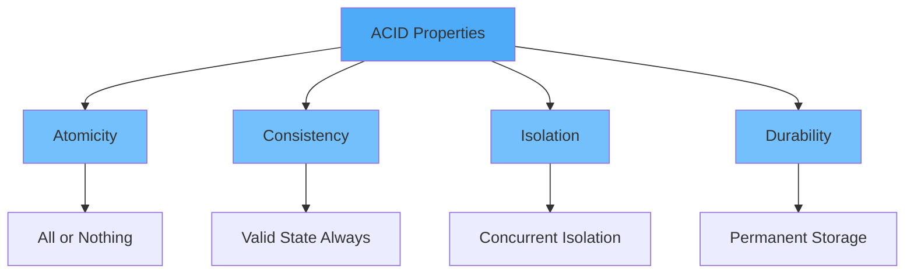
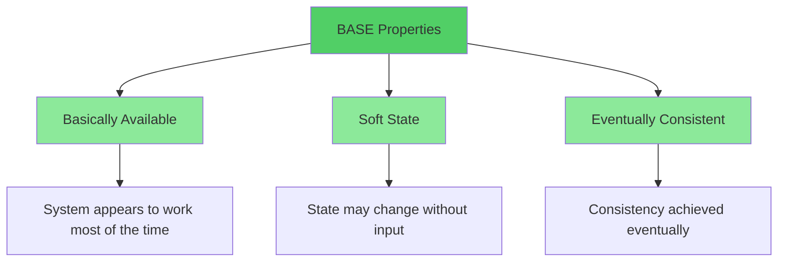
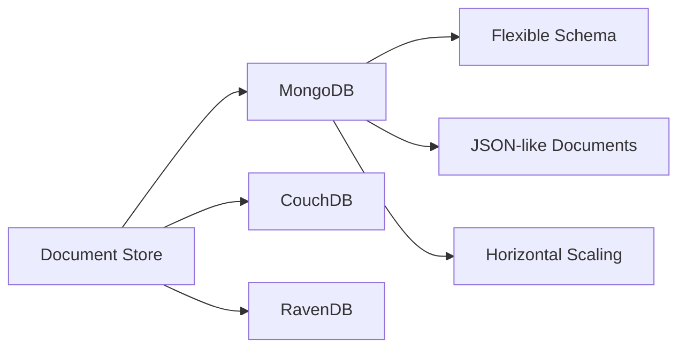
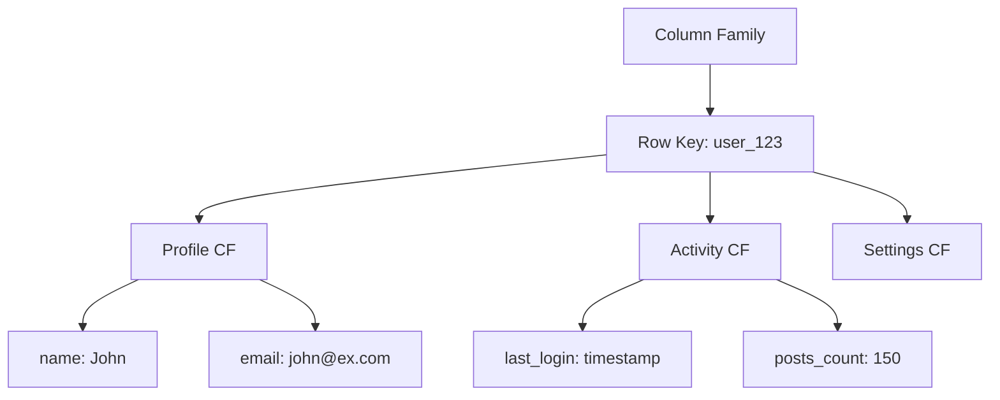
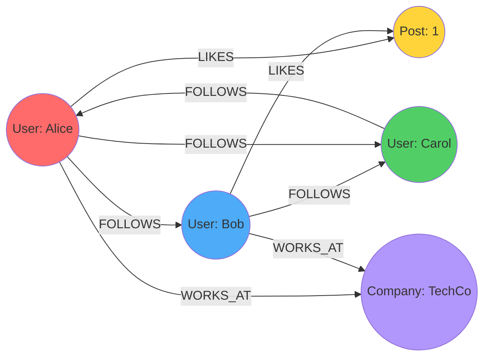
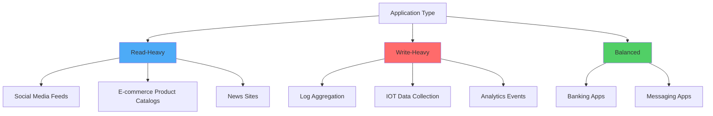
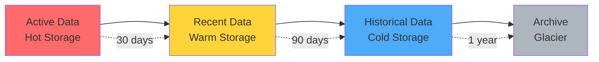
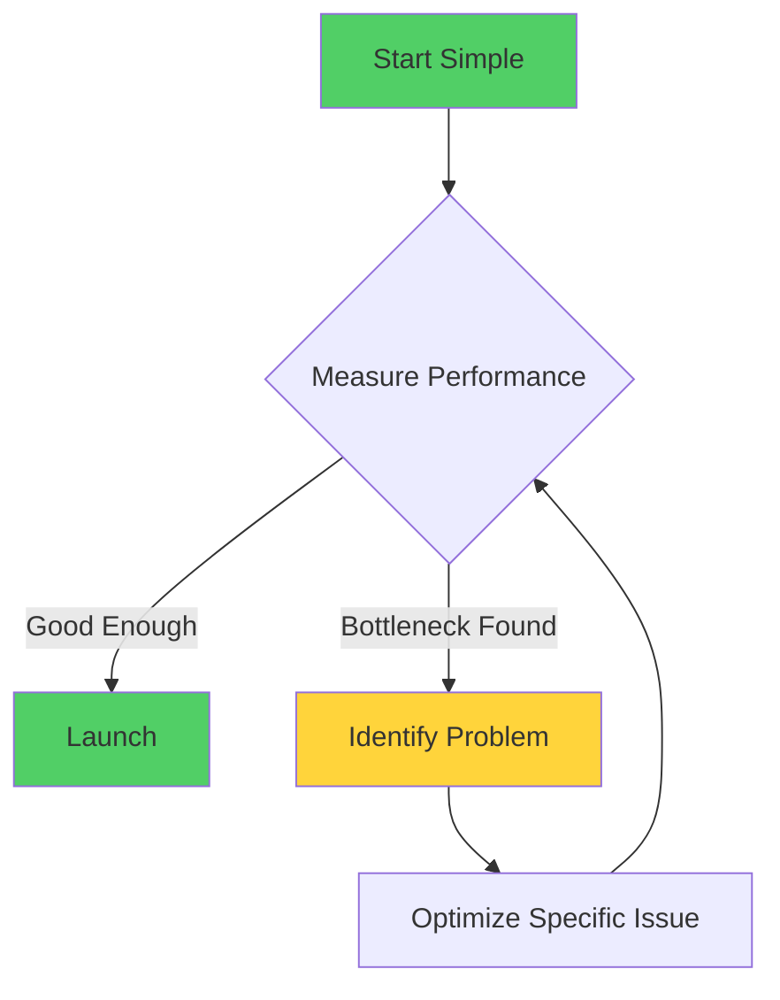
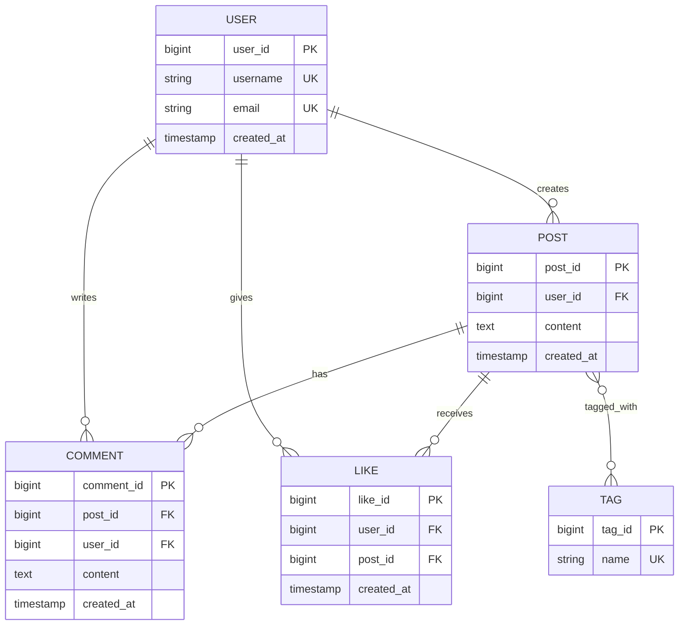

# Part 1: Database Design Fundamentals

## Introduction

Designing a database for millions of users requires careful planning, architectural decisions, and deep understanding of both business requirements and technical constraints. This guide will walk you through the essential concepts and real-world strategies for building scalable database systems.

## Table of Contents
1. [Understanding Database Requirements](#understanding-database-requirements)
2. [ACID vs BASE Properties](#acid-vs-base-properties)
3. [Relational vs NoSQL Databases](#relational-vs-nosql-databases)
4. [Core Design Principles](#core-design-principles)
5. [Data Modeling Fundamentals](#data-modeling-fundamentals)

---

## Understanding Database Requirements

Before designing any database, you must understand three critical dimensions:

### 1. Functional Requirements
- **What data** needs to be stored?
- **What operations** will be performed?
- **What queries** will be most common?

### 2. Non-Functional Requirements
- **Scale**: How many users? How much data?
- **Performance**: Response time requirements (read/write latency)
- **Availability**: Uptime requirements (99.9%, 99.99%, 99.999%)
- **Consistency**: How fresh must data be?

### 3. Data Growth Patterns


> [!IMPORTANT]
> Understanding your growth pattern helps determine when to implement different scaling strategies. Don't over-engineer for day one, but plan for the future.

### Real-World Example: Social Media Platform

**Functional Requirements:**
- Store user profiles, posts, comments, likes, friendships
- Support feed generation, search, notifications
- Handle media uploads (images, videos)

**Non-Functional Requirements:**
- Scale: 100M users, 500M posts
- Performance: Feed loads in <500ms, writes complete in <200ms
- Availability: 99.95% uptime
- Consistency: Eventually consistent for some operations

**Data Growth:**
- Users: ~100K new/day
- Posts: ~10M new/day
- Media: ~5TB new/day

---

## ACID vs BASE Properties

### ACID Properties (Traditional Relational Databases)



**Atomicity**: Transactions are all-or-nothing
```sql
-- Example: Bank transfer (must succeed completely or fail completely)
BEGIN TRANSACTION;
    UPDATE accounts SET balance = balance - 100 WHERE account_id = 1;
    UPDATE accounts SET balance = balance + 100 WHERE account_id = 2;
COMMIT;
```

**Consistency**: Database remains in valid state
```sql
-- Example: Constraint enforcement
ALTER TABLE orders 
ADD CONSTRAINT check_total CHECK (total_amount >= 0);
```

**Isolation**: Concurrent transactions don't interfere
```sql
-- Example: Read Committed isolation level
SET TRANSACTION ISOLATION LEVEL READ COMMITTED;
BEGIN TRANSACTION;
    SELECT balance FROM accounts WHERE account_id = 1;
    -- Another transaction can't modify this until commit
COMMIT;
```

**Durability**: Committed data persists
- Write-ahead logging (WAL)
- Transaction logs
- Replication

### BASE Properties (NoSQL/Distributed Systems)



> [!NOTE]
> BASE is not "worse" than ACID - it's optimized for different use cases. Choose based on your requirements.

### When to Use Each?

| Use ACID When | Use BASE When |
|---------------|---------------|
| Financial transactions | Social media feeds |
| Inventory management | Analytics/logging |
| Order processing | Content delivery |
| User authentication | Caching layers |
| Critical data integrity needed | High availability is priority |

---

## Relational vs NoSQL Databases

### Relational Databases (SQL)

**Strengths:**
- Strong consistency guarantees
- Complex queries with JOINs
- Transaction support
- Mature ecosystem

**Weaknesses:**
- Harder to scale horizontally
- Schema changes can be costly
- Can be slower for massive datasets

**Popular Options:**
- PostgreSQL (feature-rich, extensible)
- MySQL (widely adopted, good performance)
- SQL Server (enterprise features)
- Oracle (enterprise-grade)

### NoSQL Databases

#### Document Stores



**Example: User Profile in MongoDB**
```javascript
{
  "_id": "user_12345",
  "username": "john_doe",
  "email": "john@example.com",
  "profile": {
    "firstName": "John",
    "lastName": "Doe",
    "bio": "Software engineer",
    "avatar": "https://cdn.example.com/avatars/12345.jpg"
  },
  "preferences": {
    "theme": "dark",
    "notifications": true,
    "language": "en"
  },
  "followers": 15420,
  "following": 892,
  "created_at": ISODate("2020-01-15T08:30:00Z")
}
```

**Use Cases:**
- Content management systems
- User profiles
- Product catalogs
- Real-time analytics

#### Key-Value Stores

```javascript
// Redis Example
SET user:12345:session "jwt_token_here" EX 3600
SET user:12345:cart '[{"product_id": 1, "quantity": 2}]'
INCR post:67890:views
```

**Popular Options:**
- Redis (in-memory, caching)
- DynamoDB (AWS managed)
- Riak (distributed)

**Use Cases:**
- Session management
- Caching
- Real-time analytics
- Rate limiting

#### Column-Family Stores



**Cassandra Example:**
```sql
CREATE TABLE user_timeline (
    user_id uuid,
    post_time timestamp,
    post_id uuid,
    content text,
    likes int,
    PRIMARY KEY (user_id, post_time)
) WITH CLUSTERING ORDER BY (post_time DESC);
```

**Use Cases:**
- Time-series data
- Event logging
- Analytics
- IOT data

#### Graph Databases



**Neo4j Example:**
```cypher
// Find friends of friends (2nd degree connections)
MATCH (user:User {name: "Alice"})-[:FOLLOWS]->(friend)-[:FOLLOWS]->(fof)
WHERE NOT (user)-[:FOLLOWS]->(fof) AND user <> fof
RETURN fof.name, COUNT(*) as mutual_friends
ORDER BY mutual_friends DESC
LIMIT 10
```

**Use Cases:**
- Social networks
- Recommendation engines
- Fraud detection
- Knowledge graphs

---

## Core Design Principles

### 1. Design for Your Access Patterns

> [!IMPORTANT]
> Don't design your schema first and figure out queries later. Design your schema based on how you'll query the data.

**Bad Approach:**
```
1. Create normalized schema
2. Try to make queries work
3. Add indexes everywhere
4. Still slow ❌
```

**Good Approach:**
```
1. List all queries you need to support
2. Determine access patterns and frequency
3. Design schema optimized for those patterns
4. Add indexes strategically ✅
```

### 2. Understand Read vs Write Patterns



**Optimization Strategies:**

| Pattern | Optimization |
|---------|--------------|
| Read-Heavy (90% reads) | Denormalization, Read replicas, Caching |
| Write-Heavy (90% writes) | Write-optimized storage, Batch writes, Partitioning |
| Balanced | Standard normalization, Strategic indexes |

### 3. Plan for Data Lifecycle



**Real-World Example: E-commerce Orders**

```sql
-- Hot: Recent orders (30 days) - Fast SSD storage
CREATE TABLE orders_active (
    order_id BIGSERIAL PRIMARY KEY,
    user_id BIGINT NOT NULL,
    order_date TIMESTAMP DEFAULT NOW(),
    status VARCHAR(20),
    total_amount DECIMAL(10,2),
    -- Frequently accessed columns
    INDEX idx_user_date (user_id, order_date),
    INDEX idx_status (status)
) PARTITION BY RANGE (order_date);

-- Warm: Orders 30-365 days - Standard storage
CREATE TABLE orders_recent (
    -- Similar structure, less indexing
) PARTITION BY RANGE (order_date);

-- Cold: Orders 1+ years - Compressed, archived
CREATE TABLE orders_historical (
    -- Compressed, minimal indexes
) PARTITION BY RANGE (order_date);
```

### 4. Embrace Eventual Consistency Where Possible

**Strong Consistency Example (Required):**
```sql
-- Bank balance must be immediately consistent
BEGIN TRANSACTION;
    UPDATE accounts SET balance = balance - 500 WHERE id = 1;
    UPDATE accounts SET balance = balance + 500 WHERE id = 2;
COMMIT;
```

**Eventual Consistency Example (Acceptable):**
```sql
-- Social media follower count can be eventually consistent
-- User A follows User B
INSERT INTO follows (follower_id, following_id) VALUES (123, 456);

-- Update follower count asynchronously (via queue/background job)
-- Temporary inconsistency is acceptable
```

> [!TIP]
> Not everything needs immediate consistency. Identify what can tolerate eventual consistency to improve performance and scalability.

### 5. Avoid Premature Optimization



**Progression Example:**

```
Phase 1: Single PostgreSQL instance
├─ 0-10K users ✅

Phase 2: Add read replicas
├─ 10K-100K users ✅

Phase 3: Implement caching layer
├─ 100K-1M users ✅

Phase 4: Partition/shard database
├─ 1M-10M users ✅

Phase 5: Multi-region deployment
├─ 10M+ users ✅
```

---

## Data Modeling Fundamentals

### Entity-Relationship Modeling



### Cardinality Relationships

**One-to-One (1:1)**
```sql
-- User has one profile
CREATE TABLE users (
    user_id BIGSERIAL PRIMARY KEY,
    username VARCHAR(50) UNIQUE NOT NULL,
    email VARCHAR(255) UNIQUE NOT NULL
);

CREATE TABLE user_profiles (
    user_id BIGINT PRIMARY KEY,
    bio TEXT,
    avatar_url VARCHAR(500),
    birth_date DATE,
    FOREIGN KEY (user_id) REFERENCES users(user_id) ON DELETE CASCADE
);
```

**One-to-Many (1:N)**
```sql
-- User creates many posts
CREATE TABLE posts (
    post_id BIGSERIAL PRIMARY KEY,
    user_id BIGINT NOT NULL,
    content TEXT,
    created_at TIMESTAMP DEFAULT NOW(),
    FOREIGN KEY (user_id) REFERENCES users(user_id) ON DELETE CASCADE,
    INDEX idx_user_created (user_id, created_at DESC)
);
```

**Many-to-Many (M:N)**
```sql
-- Users follow many users, users have many followers
CREATE TABLE follows (
    follower_id BIGINT NOT NULL,
    following_id BIGINT NOT NULL,
    created_at TIMESTAMP DEFAULT NOW(),
    PRIMARY KEY (follower_id, following_id),
    FOREIGN KEY (follower_id) REFERENCES users(user_id) ON DELETE CASCADE,
    FOREIGN KEY (following_id) REFERENCES users(user_id) ON DELETE CASCADE,
    INDEX idx_following (following_id, created_at DESC)
);
```

### Primary Keys and Natural vs Surrogate Keys

#### Natural Keys
```sql
-- Natural key: Business-meaningful identifier
CREATE TABLE countries (
    iso_code CHAR(2) PRIMARY KEY,  -- 'US', 'UK', 'IN'
    name VARCHAR(100) NOT NULL
);
```

**Pros:** Business meaning, human-readable
**Cons:** Can change, composite keys complicate relationships

#### Surrogate Keys
```sql
-- Surrogate key: System-generated identifier
CREATE TABLE users (
    user_id BIGSERIAL PRIMARY KEY,  -- Auto-incrementing
    username VARCHAR(50) UNIQUE NOT NULL
);
```

**Pros:** Immutable, simple, efficient joins
**Cons:** No business meaning

#### UUIDs (Universally Unique Identifiers)
```sql
CREATE TABLE distributed_users (
    user_id UUID PRIMARY KEY DEFAULT gen_random_uuid(),
    username VARCHAR(50) UNIQUE NOT NULL
);
```

**Pros:** Globally unique, great for distributed systems, no coordination needed
**Cons:** Larger storage (16 bytes), non-sequential (index fragmentation)

> [!TIP]
> For applications scaling to millions of users with distributed databases, consider UUIDs or snowflake IDs for primary keys.

### Snowflake IDs (Twitter's Approach)

```
Snowflake ID Structure (64 bits):
┌─────────────┬──────────┬────────────┬───────────┐
│  Timestamp  │ Machine  │  Sequence  │  Reserved │
│   41 bits   │  10 bits │  12 bits   │   1 bit   │
└─────────────┴──────────┴────────────┴───────────┘
```

**Benefits:**
- Time-ordered (sortable)
- Globally unique
- No database coordination
- Can generate millions per second

**Implementation Example:**
```python
import time

class SnowflakeIDGenerator:
    def __init__(self, datacenter_id, machine_id):
        self.datacenter_id = datacenter_id
        self.machine_id = machine_id
        self.sequence = 0
        self.last_timestamp = -1
        
    def generate(self):
        timestamp = int(time.time() * 1000)
        
        if timestamp == self.last_timestamp:
            self.sequence = (self.sequence + 1) & 0xFFF
            if self.sequence == 0:
                # Wait for next millisecond
                while timestamp <= self.last_timestamp:
                    timestamp = int(time.time() * 1000)
        else:
            self.sequence = 0
            
        self.last_timestamp = timestamp
        
        # Combine components
        id = ((timestamp - 1288834974657) << 22) | \
             (self.datacenter_id << 17) | \
             (self.machine_id << 12) | \
             self.sequence
             
        return id
```

---

## Key Takeaways

> [!IMPORTANT]
> **Golden Rules for Database Design:**
> 1. Understand your access patterns before designing schema
> 2. Choose consistency model based on business requirements
> 3. Design for the database type that fits your use case
> 4. Plan for growth, but don't over-engineer early
> 5. Use appropriate key strategies for your scale
> 6. Embrace eventual consistency where acceptable
> 7. Design data lifecycle management from day one

---

## Next Steps

In **Part 2**, we'll dive deep into:
- Normalization and when to apply it
- Denormalization strategies for performance
- Schema design patterns
- Data types and their performance implications
- Practical examples of schema evolution

---

**Continue to:** [Part 2: Normalization, Denormalization & Schema Design](file:///C:/Users/phusukale/Downloads/Docs/Repo/Database_Architecture_Guide/Part2-Normalization-Schema-Design.md)
