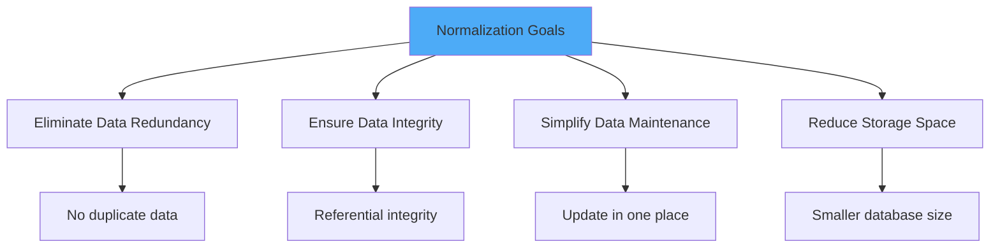
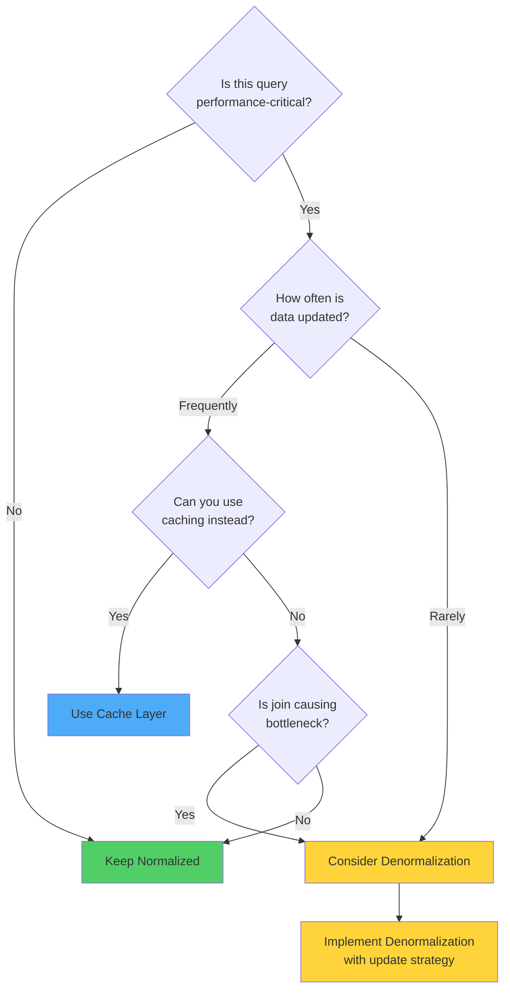
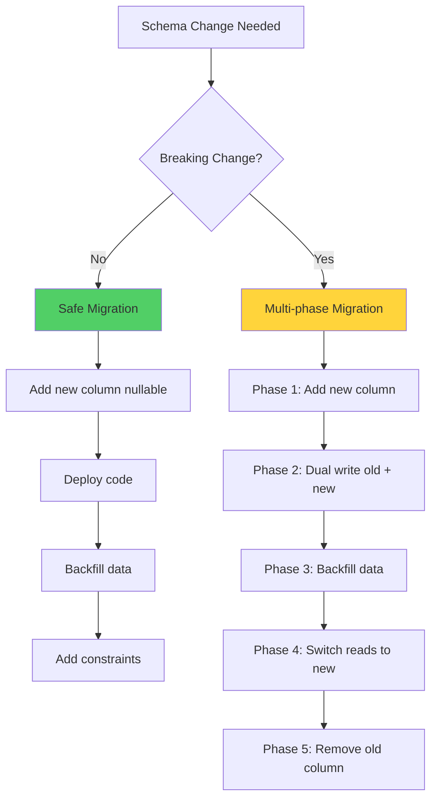

# Part 2: Normalization, Denormalization & Schema Design

## Table of Contents
1. [Understanding Normalization](#understanding-normalization)
2. [Normal Forms Explained](#normal-forms-explained)
3. [When to Denormalize](#when-to-denormalize)
4. [Schema Design Patterns](#schema-design-patterns)
5. [Data Types and Performance](#data-types-and-performance)
6. [Schema Evolution Strategies](#schema-evolution-strategies)

---

## Understanding Normalization

Normalization is the process of organizing data to reduce redundancy and improve data integrity. However, for systems serving millions of users, blind normalization can hurt performance.

### Goals of Normalization



### The Trade-off

| Normalized | Denormalized |
|------------|--------------|
| ✅ No data duplication | ❌ Data duplicated across tables |
| ✅ Easy to update | ✅ Fast to read |
| ✅ Data integrity maintained | ❌ Update anomalies possible |
| ❌ Multiple JOINs required | ✅ Minimal JOINs |
| ❌ Slower reads | ✅ Very fast reads |
| ✅ Smaller storage | ❌ More storage needed |

---

## Normal Forms Explained

### First Normal Form (1NF)

**Rule:** Each column contains atomic (indivisible) values, and each row is unique.

❌ **Violates 1NF:**
```sql
CREATE TABLE users_bad (
    user_id INT PRIMARY KEY,
    name VARCHAR(100),
    phone_numbers VARCHAR(500)  -- '555-1234, 555-5678, 555-9012'
);
```

✅ **Satisfies 1NF:**
```sql
CREATE TABLE users (
    user_id BIGSERIAL PRIMARY KEY,
    name VARCHAR(100) NOT NULL
);

CREATE TABLE user_phones (
    phone_id BIGSERIAL PRIMARY KEY,
    user_id BIGINT NOT NULL,
    phone_number VARCHAR(20) NOT NULL,
    phone_type VARCHAR(20),  -- 'mobile', 'home', 'work'
    FOREIGN KEY (user_id) REFERENCES users(user_id) ON DELETE CASCADE,
    INDEX idx_user (user_id)
);
```

### Second Normal Form (2NF)

**Rule:** Must be in 1NF, and all non-key attributes must depend on the entire primary key (no partial dependencies).

❌ **Violates 2NF:**
```sql
-- Composite primary key (order_id, product_id)
CREATE TABLE order_items_bad (
    order_id BIGINT,
    product_id BIGINT,
    product_name VARCHAR(200),     -- Depends only on product_id!
    product_price DECIMAL(10,2),   -- Depends only on product_id!
    quantity INT,
    PRIMARY KEY (order_id, product_id)
);
```

✅ **Satisfies 2NF:**
```sql
CREATE TABLE products (
    product_id BIGSERIAL PRIMARY KEY,
    product_name VARCHAR(200) NOT NULL,
    price DECIMAL(10,2) NOT NULL,
    INDEX idx_name (product_name)
);

CREATE TABLE order_items (
    order_id BIGINT,
    product_id BIGINT,
    quantity INT NOT NULL,
    price_at_purchase DECIMAL(10,2) NOT NULL,  -- Snapshot of price
    PRIMARY KEY (order_id, product_id),
    FOREIGN KEY (order_id) REFERENCES orders(order_id) ON DELETE CASCADE,
    FOREIGN KEY (product_id) REFERENCES products(product_id),
    INDEX idx_order (order_id)
);
```

> [!IMPORTANT]
> Notice we store `price_at_purchase` in the order_items table. This is intentional - product prices change over time, but historical orders should reflect the price paid at purchase time.

### Third Normal Form (3NF)

**Rule:** Must be in 2NF, and no transitive dependencies (non-key attributes depending on other non-key attributes).

❌ **Violates 3NF:**
```sql
CREATE TABLE employees_bad (
    employee_id BIGSERIAL PRIMARY KEY,
    name VARCHAR(100),
    department_id INT,
    department_name VARCHAR(100),    -- Depends on department_id, not employee_id!
    department_location VARCHAR(100) -- Depends on department_id, not employee_id!
);
```

✅ **Satisfies 3NF:**
```sql
CREATE TABLE departments (
    department_id SERIAL PRIMARY KEY,
    department_name VARCHAR(100) NOT NULL,
    location VARCHAR(100),
    INDEX idx_name (department_name)
);

CREATE TABLE employees (
    employee_id BIGSERIAL PRIMARY KEY,
    name VARCHAR(100) NOT NULL,
    department_id INT NOT NULL,
    hire_date DATE,
    FOREIGN KEY (department_id) REFERENCES departments(department_id),
    INDEX idx_department (department_id)
);
```

### Boyce-Codd Normal Form (BCNF)

**Rule:** A stronger version of 3NF. Every determinant must be a candidate key.

❌ **Violates BCNF:**
```sql
-- A professor can teach multiple courses
-- A course can have multiple professors
-- But each professor teaches a course in only one room
CREATE TABLE teaching_bad (
    professor_id INT,
    course_id INT,
    room_number VARCHAR(10), -- Determined by (professor_id, course_id) but also by professor_id alone for a given course
    PRIMARY KEY (professor_id, course_id)
);
```

✅ **Satisfies BCNF:**
```sql
CREATE TABLE professor_course_assignments (
    assignment_id BIGSERIAL PRIMARY KEY,
    professor_id INT NOT NULL,
    course_id INT NOT NULL,
    UNIQUE (professor_id, course_id)
);

CREATE TABLE course_rooms (
    professor_id INT,
    course_id INT,
    room_number VARCHAR(10) NOT NULL,
    PRIMARY KEY (professor_id, course_id),
    FOREIGN KEY (professor_id, course_id) 
        REFERENCES professor_course_assignments(professor_id, course_id)
);
```

> [!NOTE]
> In practice, 3NF is sufficient for most applications. BCNF and higher normal forms are primarily academic and rarely used in production systems.

---

## When to Denormalize

### Decision Framework



### Common Denormalization Patterns

#### 1. Storing Aggregated Counts

**Normalized (Slow for large datasets):**
```sql
-- Count followers every time
SELECT COUNT(*) 
FROM follows 
WHERE following_id = 12345;
```

**Denormalized (Fast, eventually consistent):**
```sql
-- Store count in users table
CREATE TABLE users (
    user_id BIGSERIAL PRIMARY KEY,
    username VARCHAR(50) NOT NULL,
    follower_count INT DEFAULT 0,
    following_count INT DEFAULT 0,
    post_count INT DEFAULT 0
);

-- Update via trigger or async job
CREATE OR REPLACE FUNCTION update_follower_count()
RETURNS TRIGGER AS $$
BEGIN
    IF (TG_OP = 'INSERT') THEN
        UPDATE users SET follower_count = follower_count + 1 
        WHERE user_id = NEW.following_id;
        
        UPDATE users SET following_count = following_count + 1 
        WHERE user_id = NEW.follower_id;
    ELSIF (TG_OP = 'DELETE') THEN
        UPDATE users SET follower_count = follower_count - 1 
        WHERE user_id = OLD.following_id;
        
        UPDATE users SET following_count = following_count - 1 
        WHERE user_id = OLD.follower_id;
    END IF;
    RETURN NULL;
END;
$$ LANGUAGE plpgsql;

CREATE TRIGGER follower_count_trigger
AFTER INSERT OR DELETE ON follows
FOR EACH ROW EXECUTE FUNCTION update_follower_count();
```

> [!WARNING]
> Triggers can cause performance issues at scale. Consider using async jobs (message queues) for count updates in high-traffic scenarios.

#### 2. Duplicating Frequently Accessed Data

**Real-World Example: E-commerce Order Summary**

```sql
-- Normalized: Requires JOIN to get product details
CREATE TABLE order_items (
    order_id BIGINT,
    product_id BIGINT,
    quantity INT,
    PRIMARY KEY (order_id, product_id),
    FOREIGN KEY (product_id) REFERENCES products(product_id)
);

-- Problem: To display order history, we need to JOIN products table
SELECT o.order_id, oi.quantity, p.name, p.image_url
FROM orders o
JOIN order_items oi ON o.order_id = oi.order_id
JOIN products p ON oi.product_id = p.product_id
WHERE o.user_id = 12345;
```

**Denormalized: Store snapshot at time of purchase**
```sql
CREATE TABLE order_items (
    order_item_id BIGSERIAL PRIMARY KEY,
    order_id BIGINT NOT NULL,
    product_id BIGINT NOT NULL,
    quantity INT NOT NULL,
    -- Denormalized fields (snapshot)
    product_name VARCHAR(200) NOT NULL,
    product_image_url VARCHAR(500),
    price_per_unit DECIMAL(10,2) NOT NULL,
    subtotal DECIMAL(10,2) NOT NULL,
    FOREIGN KEY (order_id) REFERENCES orders(order_id) ON DELETE CASCADE,
    INDEX idx_order (order_id)
);

-- Now query is simple and fast
SELECT order_id, product_name, product_image_url, quantity, subtotal
FROM order_items
WHERE order_id = 67890;
```

**Benefits:**
- ✅ No JOINs required
- ✅ Historical accuracy (price/name at purchase time)
- ✅ Faster queries
- ✅ Product can be deleted without affecting order history

#### 3. Materialized Views

**Problem: Complex aggregation query**
```sql
-- This query is expensive for millions of posts
SELECT 
    u.user_id,
    u.username,
    COUNT(DISTINCT p.post_id) as post_count,
    COUNT(DISTINCT l.like_id) as total_likes,
    COUNT(DISTINCT c.comment_id) as total_comments,
    AVG(p.likes_count) as avg_likes_per_post
FROM users u
LEFT JOIN posts p ON u.user_id = p.user_id
LEFT JOIN likes l ON p.post_id = l.post_id
LEFT JOIN comments c ON p.post_id = c.post_id
WHERE p.created_at >= NOW() - INTERVAL '30 days'
GROUP BY u.user_id, u.username;
```

**Solution: Materialized View (PostgreSQL)**
```sql
CREATE MATERIALIZED VIEW user_stats_30d AS
SELECT 
    u.user_id,
    u.username,
    COUNT(DISTINCT p.post_id) as post_count,
    COUNT(DISTINCT l.like_id) as total_likes,
    COUNT(DISTINCT c.comment_id) as total_comments,
    AVG(p.likes_count) as avg_likes_per_post,
    NOW() as last_updated
FROM users u
LEFT JOIN posts p ON u.user_id = p.user_id AND p.created_at >= NOW() - INTERVAL '30 days'
LEFT JOIN likes l ON p.post_id = l.post_id
LEFT JOIN comments c ON p.post_id = c.post_id
GROUP BY u.user_id, u.username;

-- Create index for fast lookups
CREATE INDEX idx_user_stats_user_id ON user_stats_30d(user_id);

-- Refresh periodically (e.g., every hour via cron job)
REFRESH MATERIALIZED VIEW CONCURRENTLY user_stats_30d;
```

---

## Schema Design Patterns

### 1. Single Table Inheritance (STI)

**Use Case:** Different types of entities sharing common attributes.

```sql
-- Example: Different user types (regular, premium, admin)
CREATE TABLE users (
    user_id BIGSERIAL PRIMARY KEY,
    username VARCHAR(50) UNIQUE NOT NULL,
    email VARCHAR(255) UNIQUE NOT NULL,
    user_type VARCHAR(20) NOT NULL, -- 'regular', 'premium', 'admin'
    
    -- Common fields
    created_at TIMESTAMP DEFAULT NOW(),
    last_login TIMESTAMP,
    
    -- Type-specific fields (nullable)
    premium_expiry_date DATE,           -- Only for premium
    admin_permissions JSONB,            -- Only for admin
    free_trial_used BOOLEAN DEFAULT FALSE, -- Only for regular
    
    CHECK (
        (user_type = 'regular' AND premium_expiry_date IS NULL AND admin_permissions IS NULL) OR
        (user_type = 'premium' AND admin_permissions IS NULL) OR
        (user_type = 'admin' AND premium_expiry_date IS NULL)
    ),
    INDEX idx_type (user_type)
);
```

**Pros:**
- Simple queries
- Easy to query across all types
- Good for shared behavior

**Cons:**
- Sparse columns (wasted space)
- Table can become bloated
- Complex constraints

### 2. Class Table Inheritance (CTI)

**Use Case:** When type-specific fields are numerous and distinct.

```sql
-- Base table
CREATE TABLE users (
    user_id BIGSERIAL PRIMARY KEY,
    username VARCHAR(50) UNIQUE NOT NULL,
    email VARCHAR(255) UNIQUE NOT NULL,
    user_type VARCHAR(20) NOT NULL,
    created_at TIMESTAMP DEFAULT NOW()
);

-- Type-specific tables
CREATE TABLE regular_users (
    user_id BIGINT PRIMARY KEY,
    free_trial_used BOOLEAN DEFAULT FALSE,
    referral_code VARCHAR(20),
    FOREIGN KEY (user_id) REFERENCES users(user_id) ON DELETE CASCADE
);

CREATE TABLE premium_users (
    user_id BIGINT PRIMARY KEY,
    subscription_tier VARCHAR(20), -- 'monthly', 'yearly'
    expiry_date DATE NOT NULL,
    auto_renew BOOLEAN DEFAULT TRUE,
    payment_method_id VARCHAR(100),
    FOREIGN KEY (user_id) REFERENCES users(user_id) ON DELETE CASCADE
);

CREATE TABLE admin_users (
    user_id BIGINT PRIMARY KEY,
    permissions JSONB NOT NULL,
    department VARCHAR(50),
    access_level INT,
    FOREIGN KEY (user_id) REFERENCES users(user_id) ON DELETE CASCADE
);
```

**Pros:**
- No sparse columns
- Clear separation
- Easy to add type-specific fields

**Cons:**
- Requires JOINs
- More complex queries

### 3. EAV (Entity-Attribute-Value) Pattern

**Use Case:** Highly dynamic attributes, product catalogs with varying properties.

> [!WARNING]
> EAV is considered an anti-pattern for most use cases. Use JSONB instead when possible.

❌ **EAV (Avoid if possible):**
```sql
CREATE TABLE products (
    product_id BIGSERIAL PRIMARY KEY,
    name VARCHAR(200) NOT NULL,
    category VARCHAR(50)
);

CREATE TABLE product_attributes (
    product_id BIGINT,
    attribute_name VARCHAR(100),
    attribute_value TEXT,
    PRIMARY KEY (product_id, attribute_name),
    FOREIGN KEY (product_id) REFERENCES products(product_id)
);

-- Querying is painful
SELECT p.product_id, p.name,
    MAX(CASE WHEN pa.attribute_name = 'color' THEN pa.attribute_value END) as color,
    MAX(CASE WHEN pa.attribute_name = 'size' THEN pa.attribute_value END) as size
FROM products p
LEFT JOIN product_attributes pa ON p.product_id = pa.product_id
GROUP BY p.product_id, p.name;
```

✅ **Better: Use JSONB (PostgreSQL) or JSON (MySQL 5.7+):**
```sql
CREATE TABLE products (
    product_id BIGSERIAL PRIMARY KEY,
    name VARCHAR(200) NOT NULL,
    category VARCHAR(50),
    attributes JSONB, -- Dynamic attributes
    created_at TIMESTAMP DEFAULT NOW(),
    INDEX idx_category (category)
);

-- Index specific JSON paths for performance
CREATE INDEX idx_product_color ON products ((attributes->>'color'));
CREATE INDEX idx_product_brand ON products ((attributes->>'brand'));

-- Querying is much cleaner
SELECT product_id, name, 
       attributes->>'color' as color,
       attributes->>'size' as size,
       attributes->>'brand' as brand
FROM products
WHERE category = 'clothing'
  AND attributes->>'color' = 'blue';

-- Insert products with different attributes
INSERT INTO products (name, category, attributes) VALUES
('T-Shirt', 'clothing', '{"color": "blue", "size": "L", "material": "cotton"}'),
('Laptop', 'electronics', '{"brand": "Dell", "ram": "16GB", "storage": "512GB SSD"}');
```

### 4. Polymorphic Associations

**Use Case:** Multiple entity types can be associated with another entity.

**Example: Comments on Posts, Photos, Videos**

```sql
-- posts, photos, videos tables exist

CREATE TABLE comments (
    comment_id BIGSERIAL PRIMARY KEY,
    user_id BIGINT NOT NULL,
    commentable_type VARCHAR(50) NOT NULL, -- 'post', 'photo', 'video'
    commentable_id BIGINT NOT NULL,
    content TEXT NOT NULL,
    created_at TIMESTAMP DEFAULT NOW(),
    
    INDEX idx_commentable (commentable_type, commentable_id),
    INDEX idx_user (user_id),
    FOREIGN KEY (user_id) REFERENCES users(user_id) ON DELETE CASCADE
);

-- Query comments for a specific post
SELECT * FROM comments 
WHERE commentable_type = 'post' AND commentable_id = 12345;
```

> [!CAUTION]
> Polymorphic associations prevent foreign key constraints. Consider creating separate tables for each association type in critical systems.

**Better approach with referential integrity:**
```sql
CREATE TABLE post_comments (
    comment_id BIGSERIAL PRIMARY KEY,
    post_id BIGINT NOT NULL,
    user_id BIGINT NOT NULL,
    content TEXT NOT NULL,
    created_at TIMESTAMP DEFAULT NOW(),
    FOREIGN KEY (post_id) REFERENCES posts(post_id) ON DELETE CASCADE,
    FOREIGN KEY (user_id) REFERENCES users(user_id) ON DELETE CASCADE,
    INDEX idx_post_created (post_id, created_at DESC)
);

CREATE TABLE photo_comments (
    comment_id BIGSERIAL PRIMARY KEY,
    photo_id BIGINT NOT NULL,
    user_id BIGINT NOT NULL,
    content TEXT NOT NULL,
    created_at TIMESTAMP DEFAULT NOW(),
    FOREIGN KEY (photo_id) REFERENCES photos(photo_id) ON DELETE CASCADE,
    FOREIGN KEY (user_id) REFERENCES users(user_id) ON DELETE CASCADE,
    INDEX idx_photo_created (photo_id, created_at DESC)
);
```

---

## Data Types and Performance

### Choosing the Right Integer Type

```sql
-- Storage and range comparison
┌──────────────┬─────────┬──────────────────────────────┐
│ Type         │ Bytes   │ Range                        │
├──────────────┼─────────┼──────────────────────────────┤
│ SMALLINT     │ 2       │ -32,768 to 32,767            │
│ INT          │ 4       │ -2.1B to 2.1B                │
│ BIGINT       │ 8       │ -9.2 quintillion to 9.2Q     │
└──────────────┴─────────┴──────────────────────────────┘
```

**Guidelines:**
```sql
-- User IDs (millions of users) - use BIGINT
user_id BIGINT

-- Status codes (limited options) - use SMALLINT
status_code SMALLINT

-- Boolean flags - use BOOLEAN, not TINYINT
is_active BOOLEAN

-- Counts that may grow large - use BIGINT
view_count BIGINT
follower_count BIGINT
```

### String Types: VARCHAR vs CHAR vs TEXT

```sql
-- Fixed-length (padded with spaces) - use for fixed-size codes
country_code CHAR(2)        -- 'US', 'UK'
currency_code CHAR(3)       -- 'USD', 'EUR'

-- Variable-length with limit - use for most strings
username VARCHAR(50)
email VARCHAR(255)
bio VARCHAR(500)

-- Unlimited length - use for long content
post_content TEXT
article_body TEXT
```

> [!TIP]
> In PostgreSQL, `VARCHAR` and `TEXT` have the same performance. `VARCHAR(n)` just adds a constraint. In MySQL, there are performance differences.

### Decimal vs Float

```sql
-- WRONG: Using FLOAT for money (rounding errors!)
price FLOAT -- ❌ Can be 19.99999999 or 20.00000001

-- CORRECT: Use DECIMAL for money
price DECIMAL(10, 2) -- ✅ Exactly 2 decimal places

-- Examples:
CREATE TABLE products (
    product_id BIGSERIAL PRIMARY KEY,
    price DECIMAL(10, 2) NOT NULL,  -- Max: 99,999,999.99
    weight_kg DECIMAL(8, 3),         -- Max: 99,999.999 kg
    discount_percentage DECIMAL(5, 2) -- Max: 999.99%
);
```

### Timestamp Types

```sql
-- Without timezone (stores local time)
created_at TIMESTAMP DEFAULT NOW()

-- With timezone (recommended for global apps)
created_at TIMESTAMPTZ DEFAULT NOW()

-- Date only (birthdays, expiry dates)
birth_date DATE

-- Time only (business hours)
opening_time TIME
```

**Best Practice for Global Applications:**
```sql
CREATE TABLE events (
    event_id BIGSERIAL PRIMARY KEY,
    name VARCHAR(200),
    -- Always store in UTC
    event_time TIMESTAMPTZ NOT NULL,
    -- Store user's timezone separately
    timezone VARCHAR(50), -- 'America/New_York'
    created_at TIMESTAMPTZ DEFAULT NOW()
);
```

### JSON/JSONB (PostgreSQL)

```sql
-- JSON: Stores exact text (slower)
metadata JSON

-- JSONB: Stores binary format (faster, indexable)
metadata JSONB

-- Example with indexing
CREATE TABLE users (
    user_id BIGSERIAL PRIMARY KEY,
    username VARCHAR(50),
    preferences JSONB
);

-- GIN index for JSONB queries
CREATE INDEX idx_preferences ON users USING GIN (preferences);

-- Query with JSON operators
SELECT * FROM users 
WHERE preferences->>'theme' = 'dark'
  AND preferences->>'language' = 'en';

-- JSON path indexing for specific keys
CREATE INDEX idx_pref_theme ON users ((preferences->>'theme'));
```

---

## Schema Evolution Strategies

### Managing Schema Changes at Scale



### Example: Renaming a Column Safely

**❌ Dangerous (causes downtime):**
```sql
-- This breaks running application code immediately
ALTER TABLE users RENAME COLUMN name TO full_name;
```

**✅ Safe multi-phase approach:**

**Phase 1: Add new column**
```sql
-- Add new column (nullable initially)
ALTER TABLE users ADD COLUMN full_name VARCHAR(100);

-- Deploy application code that writes to BOTH columns
```

**Phase 2: Backfill data**
```sql
-- Backfill in batches to avoid locking
DO $$
DECLARE
    batch_size INT := 10000;
    offset_val INT := 0;
BEGIN
    LOOP
        UPDATE users
        SET full_name = name
        WHERE full_name IS NULL
          AND user_id IN (
              SELECT user_id FROM users 
              WHERE full_name IS NULL 
              LIMIT batch_size
          );
        
        EXIT WHEN NOT FOUND;
        
        -- Small delay to avoid overwhelming database
        PERFORM pg_sleep(0.1);
    END LOOP;
END $$;
```

**Phase 3: Make NOT NULL and add index**
```sql
ALTER TABLE users ALTER COLUMN full_name SET NOT NULL;
CREATE INDEX CONCURRENTLY idx_full_name ON users(full_name);
```

**Phase 4: Update application to use new column**
```sql
-- Deploy new code that only uses full_name
```

**Phase 5: Drop old column**
```sql
ALTER TABLE users DROP COLUMN name;
```

### Adding Indexes Without Downtime

**❌ Dangerous (locks table):**
```sql
CREATE INDEX idx_email ON users(email); -- Blocks writes!
```

**✅ Safe (PostgreSQL):**
```sql
CREATE INDEX CONCURRENTLY idx_email ON users(email);
```

**✅ Safe (MySQL 5.6+):**
```sql
ALTER TABLE users ADD INDEX idx_email (email), ALGORITHM=INPLACE, LOCK=NONE;
```

### Partitioning Existing Large Tables

**Problem:** Table with 500M rows, need to partition by date.

**Migration Strategy:**

1. **Create new partitioned table**
```sql
CREATE TABLE orders_new (
    order_id BIGINT,
    user_id BIGINT,
    order_date TIMESTAMPTZ NOT NULL,
    total_amount DECIMAL(10,2),
    PRIMARY KEY (order_id, order_date)
) PARTITION BY RANGE (order_date);

-- Create partitions for each month
CREATE TABLE orders_2024_01 PARTITION OF orders_new
    FOR VALUES FROM ('2024-01-01') TO ('2024-02-01');

CREATE TABLE orders_2024_02 PARTITION OF orders_new
    FOR VALUES FROM ('2024-02-01') TO ('2024-03-01');
-- ... etc
```

2. **Dual write to both tables**
```python
# Application code
def create_order(order_data):
    # Write to both old and new table
    db.execute("INSERT INTO orders (...) VALUES (...)")
    db.execute("INSERT INTO orders_new (...) VALUES (...)")
```

3. **Backfill historical data in batches**
```sql
-- Copy data in chunks
INSERT INTO orders_new 
SELECT * FROM orders 
WHERE order_date >= '2024-01-01' AND order_date < '2024-02-01'
ON CONFLICT DO NOTHING;
```

4. **Switch reads to new table**
```python
# Update application to read from orders_new
```

5. **Drop old table**
```sql
DROP TABLE orders;
ALTER TABLE orders_new RENAME TO orders;
```

---

## Key Takeaways

> [!IMPORTANT]
> **Schema Design Best Practices:**
> 1. Start with normalization, denormalize strategically based on access patterns
> 2. Use appropriate data types to minimize storage and maximize performance
> 3. Prefer JSONB for dynamic attributes over EAV pattern
> 4. Plan migrations carefully - avoid breaking changes
> 5. Always use CONCURRENTLY when creating indexes on large tables
> 6. Store monetary values in DECIMAL, never FLOAT
> 7. Use TIMESTAMPTZ and store in UTC for global applications
> 8. Denormalize aggregated counts for performance, update asynchronously

---

## Next Steps

In **Part 3**, we'll explore:
- Indexing strategies for optimal query performance
- Query optimization techniques
- Execution plan analysis
- Index types and when to use each
- Covering indexes and partial indexes

---

**Continue to:** [Part 3: Indexing Strategies & Query Optimization](file:///C:/Users/phusukale/Downloads/Docs/Repo/Database_Architecture_Guide/Part3-Indexing-Query-Optimization.md)
