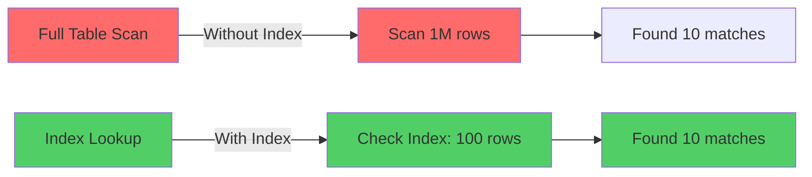
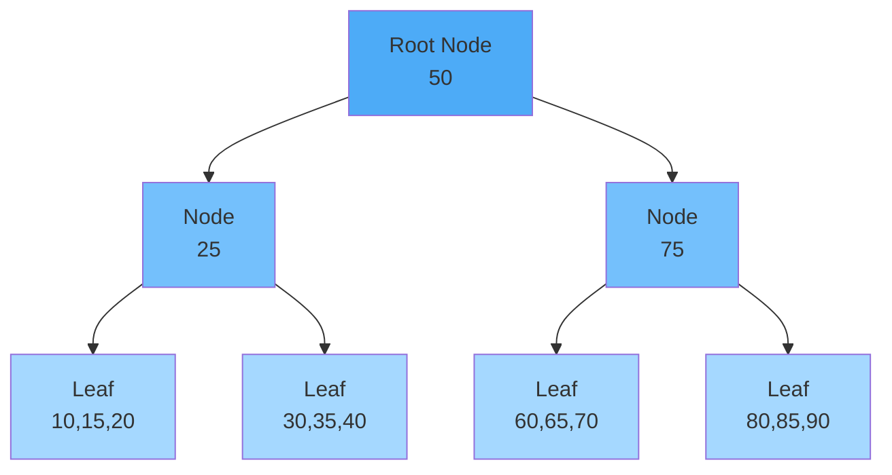
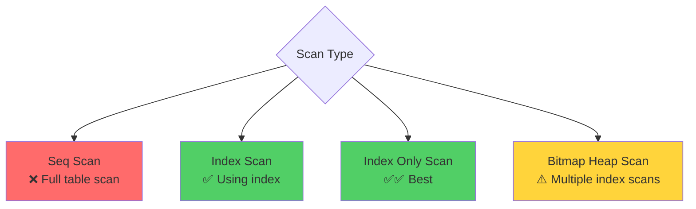

# Part 3: Indexing Strategies & Query Optimization

## Table of Contents
1. [Understanding Indexes](#understanding-indexes)
2. [Index Types and Use Cases](#index-types-and-use-cases)
3. [Index Design Strategies](#index-design-strategies)
4. [Query Optimization Techniques](#query-optimization-techniques)
5. [Analyzing Query Performance](#analyzing-query-performance)
6. [Common Performance Anti-patterns](#common-performance-anti-patterns)

---

## Understanding Indexes

### What is an Index?

An index is a data structure that improves the speed of data retrieval operations on a database table. Think of it like a book's index - instead of scanning every page to find a topic, you look it up in the index and jump directly to the right page.



### The Cost of Indexes

> [!IMPORTANT]
> Indexes are not free! They improve read performance but slow down writes and consume storage.

**Trade-offs:**

| Benefit | Cost |
|---------|------|
| ✅ Faster SELECT queries | ❌ Slower INSERT/UPDATE/DELETE |
| ✅ Faster ORDER BY | ❌ Additional storage space |
| ✅ Faster WHERE clause | ❌ Index maintenance overhead |
| ✅ Faster JOINs | ❌ More memory usage |

### How Indexes Work: B-Tree Example



**Search for value 35:**
1. Start at root (50)
2. 35 < 50, go left to (25)
3. 35 > 25, go right
4. Found in leaf node [30,35,40]

**Complexity:** O(log n) vs O(n) for full table scan

---

## Index Types and Use Cases

### 1. B-Tree Index (Default)

**Best for:**
- Equality queries (`WHERE id = 123`)
- Range queries (`WHERE created_at > '2024-01-01'`)
- Sorting (`ORDER BY username`)
- Prefix matching (`WHERE email LIKE 'john%'`)

**PostgreSQL:**
```sql
CREATE INDEX idx_users_email ON users(email);
CREATE INDEX idx_posts_created ON posts(created_at);
```

**Real-World Example: Social Media User Lookup**
```sql
-- Index for username lookups
CREATE INDEX idx_users_username ON users(username);

-- Index for email lookups
CREATE INDEX idx_users_email ON users(email);

-- Now these queries are fast:
SELECT * FROM users WHERE username = 'john_doe'; -- Index seek
SELECT * FROM users WHERE email = 'john@example.com'; -- Index seek
```

### 2. Hash Index

**Best for:**
- Equality queries ONLY
- No range queries
- Generally avoid (B-Tree is usually better)

**PostgreSQL:**
```sql
CREATE INDEX idx_users_id_hash ON users USING HASH (user_id);
```

> [!NOTE]
> Hash indexes were not crash-safe in PostgreSQL before version 10. B-Tree indexes are generally preferred.

### 3. GIN (Generalized Inverted Index)

**Best for:**
- Full-text search
- JSONB queries
- Array contains queries

**PostgreSQL Examples:**

**Full-text search:**
```sql
-- Add tsvector column for full-text search
ALTER TABLE posts ADD COLUMN content_tsv tsvector;

-- Generate tsvector from content
UPDATE posts SET content_tsv = to_tsvector('english', content);

-- Create GIN index
CREATE INDEX idx_posts_fts ON posts USING GIN(content_tsv);

-- Fast full-text search
SELECT * FROM posts 
WHERE content_tsv @@ to_tsquery('english', 'database & design');
```

**JSONB queries:**
```sql
CREATE TABLE users (
    user_id BIGSERIAL PRIMARY KEY,
    username VARCHAR(50),
    metadata JSONB
);

-- GIN index on JSONB column
CREATE INDEX idx_users_metadata ON users USING GIN(metadata);

-- Fast JSONB queries
SELECT * FROM users WHERE metadata @> '{"premium": true}';
SELECT * FROM users WHERE metadata ? 'referral_code';
```

### 4. GiST (Generalized Search Tree)

**Best for:**
- Geometric data
- Full-text search (alternative to GIN)
- Range types

**PostgreSQL Example: Geolocation**
```sql
CREATE EXTENSION IF NOT EXISTS postgis;

CREATE TABLE locations (
    location_id BIGSERIAL PRIMARY KEY,
    name VARCHAR(200),
    coordinates GEOGRAPHY(POINT)
);

-- GiST index for spatial queries
CREATE INDEX idx_locations_coords ON locations USING GIST(coordinates);

-- Find locations within 5km radius
SELECT name, 
       ST_Distance(coordinates, ST_MakePoint(-73.935242, 40.730610)::geography) as distance
FROM locations
WHERE ST_DWithin(
    coordinates, 
    ST_MakePoint(-73.935242, 40.730610)::geography,
    5000  -- 5km in meters
)
ORDER BY distance;
```

### 5. Partial Index

**Best for:**
- Indexing subset of rows
- Reducing index size
- Optimizing specific queries

**Examples:**

```sql
-- Index only active users (ignore deleted/inactive)
CREATE INDEX idx_active_users ON users(username) 
WHERE deleted_at IS NULL AND is_active = true;

-- Index only recent orders (last 90 days)
CREATE INDEX idx_recent_orders ON orders(created_at, user_id)
WHERE created_at >= NOW() - INTERVAL '90 days';

-- Index only premium users
CREATE INDEX idx_premium_users ON users(user_id, subscription_tier)
WHERE subscription_tier IN ('premium', 'enterprise');
```

**Benefits:**
- Smaller index size
- Faster index updates
- Lower memory usage
- Optimized for specific query patterns

### 6. Covering Index (Index-Only Scan)

**Goal:** Include all columns needed by query in the index, so database doesn't need to access the table.

```sql
-- Query needs: username, email, created_at
SELECT username, email, created_at 
FROM users 
WHERE user_id = 12345;

-- Non-covering index (requires table lookup)
CREATE INDEX idx_users_id ON users(user_id);

-- Covering index (no table lookup needed)
CREATE INDEX idx_users_id_covering ON users(user_id) 
INCLUDE (username, email, created_at);
```

**PostgreSQL 11+ syntax:**
```sql
CREATE INDEX idx_orders_covering ON orders(user_id, created_at)
INCLUDE (order_id, total_amount, status);
```

**MySQL (use composite index):**
```sql
CREATE INDEX idx_orders_covering ON orders(user_id, created_at, order_id, total_amount, status);
```

### 7. Composite (Multi-Column) Index

**Order matters!** Indexes work left-to-right.

```sql
-- Composite index on (user_id, created_at, status)
CREATE INDEX idx_orders_composite ON orders(user_id, created_at, status);

-- ✅ Can use index (uses first column)
SELECT * FROM orders WHERE user_id = 123;

-- ✅ Can use index (uses first two columns)
SELECT * FROM orders WHERE user_id = 123 AND created_at > '2024-01-01';

-- ✅ Can use index (uses all columns)
SELECT * FROM orders 
WHERE user_id = 123 
  AND created_at > '2024-01-01' 
  AND status = 'completed';

-- ❌ Cannot use index (skips first column)
SELECT * FROM orders WHERE created_at > '2024-01-01';

-- ❌ Cannot use index (skips first column)
SELECT * FROM orders WHERE status = 'completed';
```

**Index Column Ordering Strategy:**
```
1. Equality conditions first (WHERE col = value)
2. Range conditions second (WHERE col > value)
3. Sort columns last (ORDER BY col)
```

**Example:**
```sql
-- Query: Find user's recent completed orders
SELECT * FROM orders 
WHERE user_id = 123          -- Equality
  AND created_at > '2024-01-01'  -- Range
  AND status = 'completed'   -- Equality
ORDER BY created_at DESC;    -- Sort

-- Optimal index order:
CREATE INDEX idx_orders_optimal ON orders(
    user_id,        -- Equality first
    status,         -- Equality second
    created_at DESC -- Range + sort last
);
```

---

## Index Design Strategies

### Strategy 1: Index Your Foreign Keys

```sql
-- Posts table with user_id foreign key
CREATE TABLE posts (
    post_id BIGSERIAL PRIMARY KEY,
    user_id BIGINT NOT NULL,
    content TEXT,
    created_at TIMESTAMPTZ DEFAULT NOW(),
    FOREIGN KEY (user_id) REFERENCES users(user_id)
);

-- Always index foreign keys!
CREATE INDEX idx_posts_user ON posts(user_id);
```

> [!IMPORTANT]
> Foreign keys are not automatically indexed in PostgreSQL or MySQL. You must create indexes manually!

### Strategy 2: Index for Common JOIN Patterns

```sql
-- Common query: Get posts with user info
SELECT p.*, u.username, u.avatar_url
FROM posts p
JOIN users u ON p.user_id = u.user_id
WHERE p.created_at > '2024-01-01'
ORDER BY p.created_at DESC
LIMIT 20;

-- Indexes needed:
CREATE INDEX idx_posts_created ON posts(created_at DESC);
CREATE INDEX idx_posts_user ON posts(user_id);
-- users(user_id) already has PRIMARY KEY index
```

### Strategy 3: Index for Sorting and Pagination

```sql
-- Pagination query
SELECT * FROM posts
WHERE user_id = 123
ORDER BY created_at DESC
LIMIT 20 OFFSET 0;

-- Optimal index (supports filter + sort)
CREATE INDEX idx_posts_user_created ON posts(user_id, created_at DESC);
```

**Descending Indexes:**
```sql
-- If you frequently sort descending, create descending index
CREATE INDEX idx_posts_created_desc ON posts(created_at DESC);

-- This is faster than:
CREATE INDEX idx_posts_created_asc ON posts(created_at ASC);
-- ... with query ORDER BY created_at DESC
```

### Strategy 4: Index Frequently Filtered Columns

**Analyze your queries:**
```sql
-- If this is a common filter:
SELECT * FROM users WHERE is_active = true AND created_at > '2024-01-01';

-- Create composite index
CREATE INDEX idx_users_active_created ON users(is_active, created_at);
```

### Strategy 5: Avoid Over-Indexing

**❌ Bad: Too many indexes**
```sql
CREATE INDEX idx1 ON users(email);
CREATE INDEX idx2 ON users(username);
CREATE INDEX idx3 ON users(created_at);
CREATE INDEX idx4 ON users(last_login);
CREATE INDEX idx5 ON users(email, username);
CREATE INDEX idx6 ON users(email, created_at);
CREATE INDEX idx7 ON users(username, created_at);
-- ... etc
```

**Problems:**
- Slows down INSERT/UPDATE/DELETE
- Wastes storage
- Wastes memory
- Confuses query optimizer

**✅ Good: Strategic indexes**
```sql
-- Analyze actual query patterns
CREATE INDEX idx_users_email ON users(email);              -- Login by email
CREATE INDEX idx_users_username ON users(username);        -- Profile lookup
CREATE INDEX idx_users_created ON users(created_at DESC);  -- Recent users
```

---

## Query Optimization Techniques

### 1. Avoid SELECT *

**❌ Bad:**
```sql
SELECT * FROM posts WHERE post_id = 12345;
```

**✅ Good:**
```sql
SELECT post_id, user_id, content, created_at 
FROM posts 
WHERE post_id = 12345;
```

**Why?**
- Transfers less data over network
- Uses less memory
- Can use covering indexes
- More cache-efficient

### 2. Use LIMIT for Pagination

**❌ Bad: Loading all rows**
```sql
SELECT * FROM posts ORDER BY created_at DESC;
-- Returns millions of rows!
```

**✅ Good: Limit results**
```sql
SELECT * FROM posts 
ORDER BY created_at DESC 
LIMIT 20;
```

**✅ Better: Cursor-based pagination**
```sql
-- First page
SELECT * FROM posts 
ORDER BY created_at DESC 
LIMIT 20;

-- Next page (using last created_at from previous page)
SELECT * FROM posts 
WHERE created_at < '2024-01-15 10:30:00'
ORDER BY created_at DESC 
LIMIT 20;
```

**Why cursor pagination is better than OFFSET:**
```sql
-- ❌ OFFSET gets slower as you paginate deeper
SELECT * FROM posts 
ORDER BY created_at DESC 
LIMIT 20 OFFSET 100000;  -- Scans 100,020 rows, returns 20 ❌

-- ✅ Cursor-based is always fast
SELECT * FROM posts 
WHERE created_at < '2024-01-10 08:00:00'
ORDER BY created_at DESC 
LIMIT 20;  -- Scans 20 rows, returns 20 ✅
```

### 3. Optimize JOINs

**❌ Bad: N+1 Query Problem**
```python
# Load posts
posts = db.query("SELECT * FROM posts LIMIT 20")

# For each post, load user (20 additional queries!)
for post in posts:
    user = db.query("SELECT * FROM users WHERE user_id = ?", post.user_id)
```

**✅ Good: Single JOIN query**
```sql
SELECT p.*, u.username, u.avatar_url
FROM posts p
JOIN users u ON p.user_id = u.user_id
LIMIT 20;
```

**JOIN Order Matters:**
```sql
-- Query: Find posts by user's followers
-- ❌ Bad: Large intermediate result
SELECT p.*
FROM posts p
JOIN follows f ON f.following_id = p.user_id  -- Millions of rows
WHERE f.follower_id = 123;

-- ✅ Better: Filter early
SELECT p.*
FROM (
    SELECT following_id FROM follows WHERE follower_id = 123
) f
JOIN posts p ON p.user_id = f.following_id;
```

### 4. Use EXISTS Instead of IN for Large Subqueries

**❌ Slower: IN with large subquery**
```sql
SELECT * FROM users
WHERE user_id IN (
    SELECT DISTINCT user_id FROM posts WHERE created_at > '2024-01-01'
);
```

**✅ Faster: EXISTS**
```sql
SELECT * FROM users u
WHERE EXISTS (
    SELECT 1 FROM posts p 
    WHERE p.user_id = u.user_id 
      AND p.created_at > '2024-01-01'
);
```

**Why?** EXISTS stops searching once it finds a match, IN builds entire result set.

### 5. Use UNION ALL Instead of UNION When Possible

**UNION** removes duplicates (slower):
```sql
SELECT user_id FROM followers
UNION
SELECT user_id FROM following;
```

**UNION ALL** keeps duplicates (faster):
```sql
SELECT user_id FROM followers
UNION ALL
SELECT user_id FROM following;
```

Use `UNION ALL` when you know there are no duplicates or duplicates are acceptable.

### 6. Avoid Functions on Indexed Columns in WHERE Clause

**❌ Bad: Function prevents index usage**
```sql
-- Index on created_at cannot be used!
SELECT * FROM posts 
WHERE DATE(created_at) = '2024-01-15';

-- Index on email cannot be used!
SELECT * FROM users 
WHERE LOWER(email) = 'john@example.com';
```

**✅ Good: Rewrite to use index**
```sql
-- Index on created_at CAN be used
SELECT * FROM posts 
WHERE created_at >= '2024-01-15' 
  AND created_at < '2024-01-16';

-- Store email lowercased or create functional index
CREATE INDEX idx_users_email_lower ON users(LOWER(email));
SELECT * FROM users WHERE LOWER(email) = 'john@example.com';
```

### 7. Optimize LIKE Queries

**❌ Cannot use index:**
```sql
-- Leading wildcard prevents index usage
SELECT * FROM users WHERE email LIKE '%@gmail.com';
```

**✅ Can use index:**
```sql
-- Prefix matching uses index
SELECT * FROM users WHERE email LIKE 'john%';
```

**For full-text search, use dedicated features:**
```sql
-- PostgreSQL full-text search
CREATE INDEX idx_posts_fts ON posts USING GIN(to_tsvector('english', content));

SELECT * FROM posts 
WHERE to_tsvector('english', content) @@ to_tsquery('database & design');
```

---

## Analyzing Query Performance

### Using EXPLAIN and EXPLAIN ANALYZE

**PostgreSQL:**
```sql
-- Show execution plan (doesn't run query)
EXPLAIN 
SELECT * FROM posts WHERE user_id = 123;

-- Show actual execution with timing
EXPLAIN ANALYZE
SELECT * FROM posts WHERE user_id = 123;
```

**Example Output:**
```
Index Scan using idx_posts_user on posts  (cost=0.43..8.45 rows=5 width=100)
                                           (actual time=0.012..0.015 rows=5 loops=1)
  Index Cond: (user_id = 123)
Planning Time: 0.082 ms
Execution Time: 0.035 ms
```

**Key metrics to watch:**
- **Seq Scan** (bad for large tables) vs **Index Scan** (good)
- **rows**: estimated vs actual
- **cost**: relative cost estimate
- **actual time**: real execution time

### Reading EXPLAIN Output



**Common operations:**

| Operation | Meaning | Performance |
|-----------|---------|-------------|
| Seq Scan | Full table scan | ❌ Slow for large tables |
| Index Scan | Using index | ✅ Good |
| Index Only Scan | All data in index | ✅✅ Excellent |
| Bitmap Heap Scan | Multiple index scans | ⚠️ OK for moderate selectivity |
| Nested Loop | JOIN method | ✅ Good for small sets |
| Hash Join | JOIN method | ✅ Good for large sets |
| Merge Join | JOIN method | ✅ Good for sorted data |

### MySQL: Analyze Queries

```sql
-- Show execution plan
EXPLAIN 
SELECT * FROM posts WHERE user_id = 123;

-- Extended information
EXPLAIN FORMAT=JSON
SELECT * FROM posts WHERE user_id = 123;
```

**Example Output:**
```
+----+-------------+-------+------+---------------+---------+---------+-------+------+-------+
| id | select_type | table | type | possible_keys | key     | key_len | ref   | rows | Extra |
+----+-------------+-------+------+---------------+---------+---------+-------+------+-------+
|  1 | SIMPLE      | posts | ref  | idx_posts_user| idx_... | 8       | const | 5    | NULL  |
+----+-------------+-------+------+---------------+---------+---------+-------+------+-------+
```

**Key columns:**
- **type**: `ALL` (bad) vs `ref/eq_ref/const` (good)
- **possible_keys**: indexes that could be used
- **key**: index actually used
- **rows**: estimated rows to scan

---

## Common Performance Anti-patterns

### 1. The "Get Everything and Filter in Code" Anti-pattern

**❌ Bad:**
```python
# Get all users, filter in application
users = db.query("SELECT * FROM users")
active_users = [u for u in users if u.is_active and u.created_at > cutoff_date]
```

**✅ Good:**
```sql
-- Filter in database
SELECT * FROM users 
WHERE is_active = true 
  AND created_at > '2024-01-01';
```

### 2. The "Implicit Type Conversion" Anti-pattern

**❌ Bad: String comparison on INT column**
```sql
-- user_id is BIGINT, but comparing with string
SELECT * FROM users WHERE user_id = '12345';  -- Implicit conversion!
```

**✅ Good:**
```sql
SELECT * FROM users WHERE user_id = 12345;
```

### 3. The "SELECT DISTINCT as a Bandaid" Anti-pattern

```sql
-- ❌ Using DISTINCT to hide duplicate results from bad JOIN
SELECT DISTINCT u.username
FROM users u
JOIN posts p ON u.user_id = p.user_id;
```

**Better:** Understand why duplicates exist and fix the query logic.

### 4. The "Death by OR" Anti-pattern

**❌ Bad: OR conditions on different columns**
```sql
-- Cannot efficiently use indexes
SELECT * FROM posts 
WHERE user_id = 123 OR title LIKE '%database%';
```

**✅ Better: Use UNION**
```sql
SELECT * FROM posts WHERE user_id = 123
UNION
SELECT * FROM posts WHERE title LIKE '%database%' AND user_id != 123;
```

---

## Key Takeaways

> [!IMPORTANT]
> **Indexing Best Practices:**
> 1. Index foreign keys
> 2. Index columns in WHERE, JOIN, ORDER BY clauses
> 3. Use composite indexes for multi-column queries (order matters!)
> 4. Use covering indexes to avoid table lookups
> 5. Create partial indexes for subset queries
> 6. Don't over-index - balance read vs write performance
> 7. Always use EXPLAIN to verify index usage
> 8. Avoid functions on indexed columns in WHERE clauses
> 9. Use cursor-based pagination instead of OFFSET
> 10. Monitor index usage and remove unused indexes

---

## Next Steps

In **Part 4**, we'll explore:
- Horizontal scaling with sharding
- Vertical scaling strategies
- Partitioning techniques
- Choosing shard keys
- Cross-shard queries
- Consistent hashing

---

**Continue to:** [Part 4: Horizontal & Vertical Scaling](file:///C:/Users/phusukale/Downloads/Docs/Repo/Database_Architecture_Guide/Part4-Scaling-Sharding-Partitioning.md)
