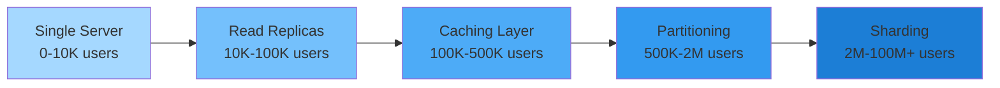
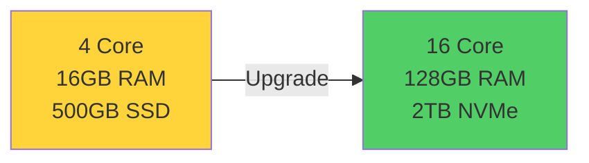
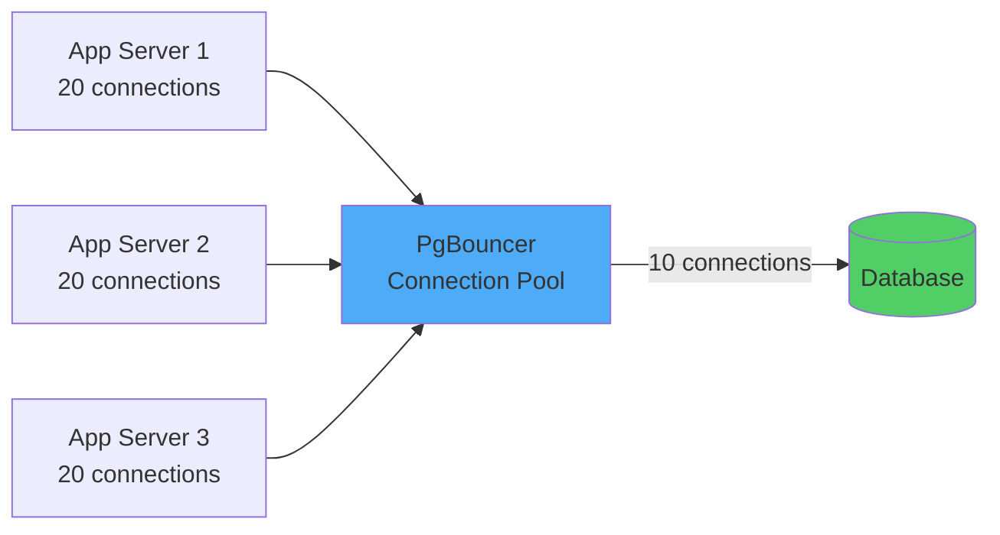
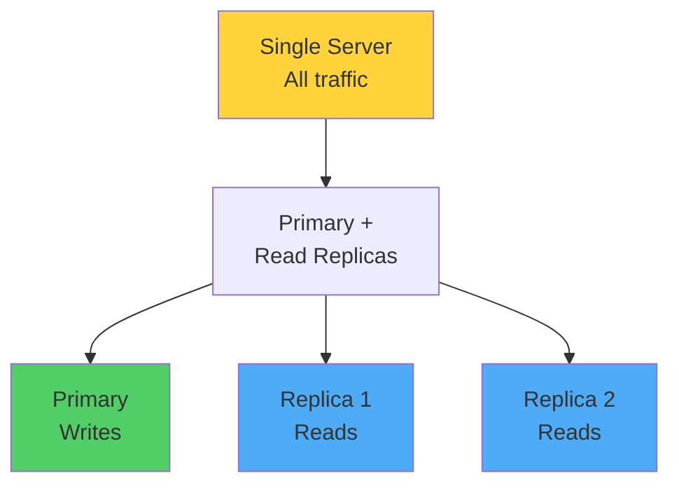
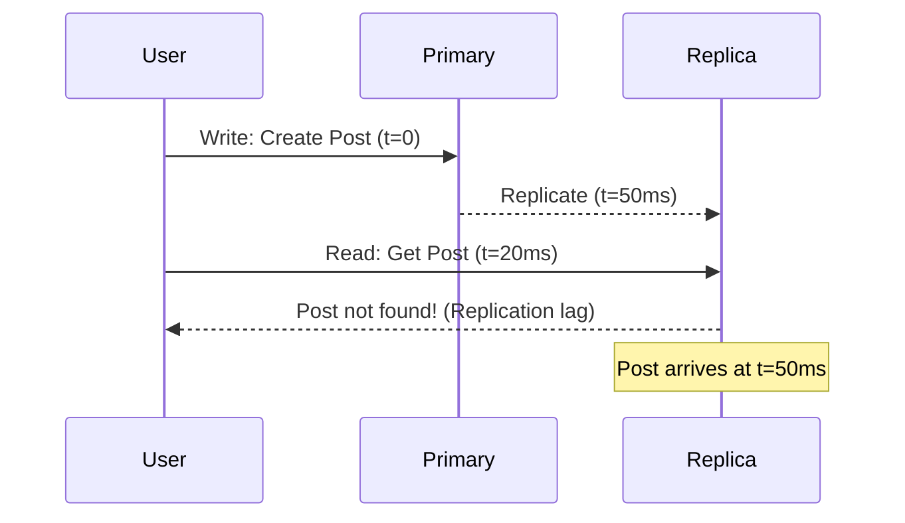
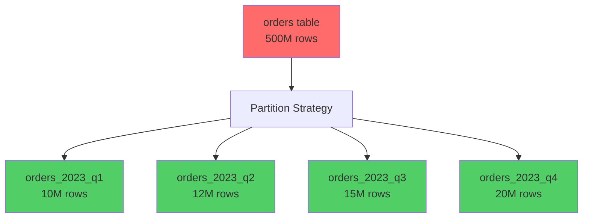
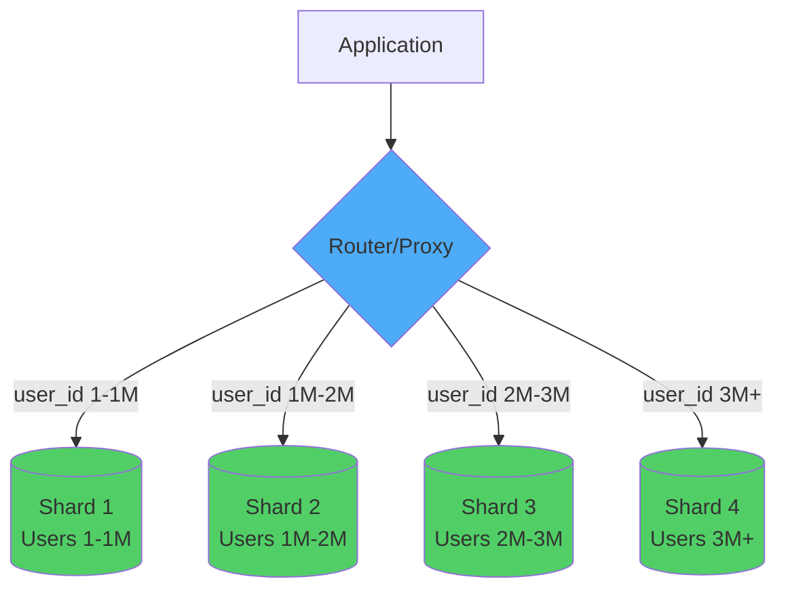
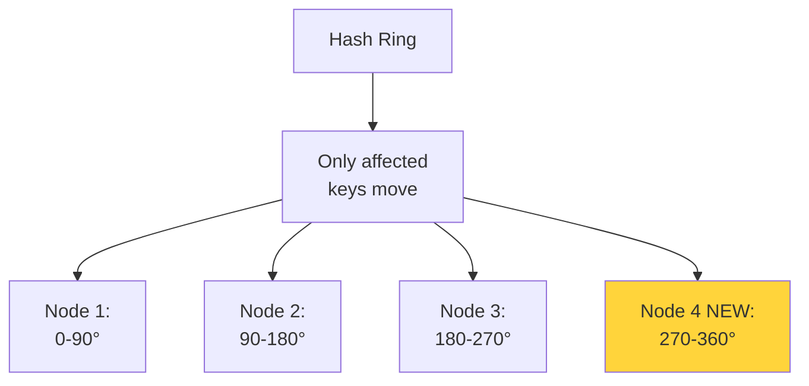
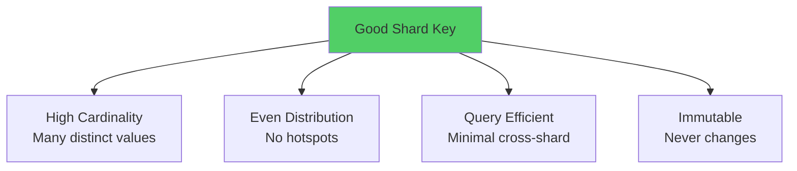
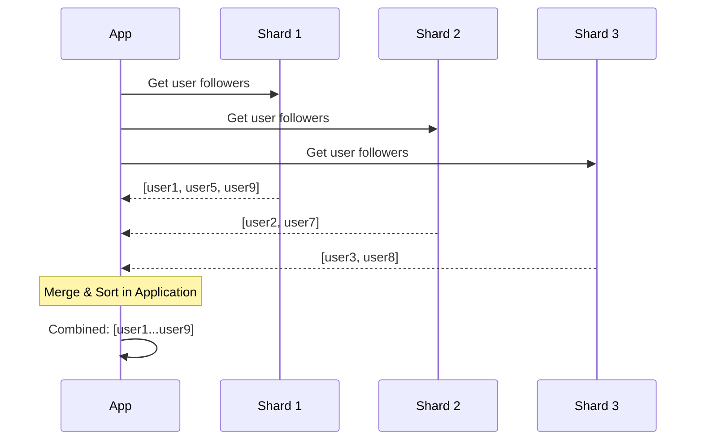

# Part 4: Horizontal & Vertical Scaling (Sharding & Partitioning)

## Table of Contents
1. [Scaling Fundamentals](#scaling-fundamentals)
2. [Vertical Scaling (Scale Up)](#vertical-scaling-scale-up)
3. [Horizontal Scaling (Scale Out)](#horizontal-scaling-scale-out)
4. [Database Partitioning](#database-partitioning)
5. [Database Sharding](#database-sharding)
6. [Choosing Shard Keys](#choosing-shard-keys)
7. [Cross-Shard Queries](#cross-shard-queries)

---

## Scaling Fundamentals

### The Scaling Spectrum



### Scalability Metrics

**Three dimensions to consider:**

| Dimension | Metric | Example Limit |
|-----------|--------- |--------------|
| **Data Size** | Total storage | 10TB per server |
| **Query Load** | Queries per second | 10K QPS per server |
| **Connection Count** | Concurrent connections | 5K connections per server |

---

## Vertical Scaling (Scale Up)

### What is Vertical Scaling?

Adding more resources (CPU, RAM, disk) to existing server.



### Advantages

✅ **Simple** - No application changes needed
✅ **No data distribution complexity** - Single source of truth
✅ **Strong consistency** - ACID transactions work normally
✅ **Easy to maintain** - One database to manage

### Disadvantages

❌ **Hard limits** - Physical hardware has ceiling
❌ **Expensive** - Diminishing returns (2x power = 4x cost)
❌ **Single point of failure** - No redundancy
❌ **Downtime** - Upgrades require restart

### Vertical Scaling Strategies

#### 1. Optimize Database Configuration

**PostgreSQL Configuration Example:**

```sql
-- postgresql.conf optimizations

-- Memory settings (for server with 64GB RAM)
shared_buffers = 16GB                  -- 25% of RAM
effective_cache_size = 48GB            -- 75% of RAM
maintenance_work_mem = 2GB             -- For VACUUM, CREATE INDEX
work_mem = 32MB                        -- Per query operation

-- Connection settings
max_connections = 200                  -- Limit concurrent connections
connection_limit = 100                 -- Per database

-- Query planning
random_page_cost = 1.1                 -- For SSD (default 4.0 for HDD)
effective_io_concurrency = 200         -- For SSD

-- Write-ahead logging
wal_buffers = 16MB
checkpoint_completion_target = 0.9
```

#### 2. Upgrade Storage to NVMe SSDs

**IOPS Comparison:**

| Storage Type | Random IOPS | Sequential Throughput |
|--------------|-------------|----------------------|
| HDD (7200 RPM) | ~100 | 100 MB/s |
| SATA SSD | ~10,000 | 500 MB/s |
| NVMe SSD | ~500,000 | 3500 MB/s |

**Impact:** Queries become I/O bound at scale. NVMe dramatically improves performance.

#### 3. Connection Pooling

**Problem:** Each connection consumes memory (~10MB)

```python
# ❌ Bad: Direct connections (100 app servers × 20 connections = 2000 connections!)
import psycopg2
conn = psycopg2.connect("dbname=mydb user=postgres")
```

**Solution: Connection pooler (PgBouncer, ProxySQL)**



**PgBouncer Configuration:**

```ini
[databases]
mydb = host=localhost port=5432 dbname=mydb

[pgbouncer]
pool_mode = transaction          # Connection reused after transaction
max_client_conn = 1000          # Max client connections
default_pool_size = 20          # Connections per database
reserve_pool_size = 5           # Emergency reserve
```

### When Vertical Scaling is Enough

```
✅ Use vertical scaling when:
   - Dataset fits on single server (<10TB)
   - QPS is manageable (<10K writes/sec)
   - Strong consistency is critical
   - Team size is small
   - Budget allows powerful hardware
```

---

## Horizontal Scaling (Scale Out)

### What is Horizontal Scaling?

Adding more servers to distribute load.



### Advantages

✅ **Nearly infinite scaling** - Add more servers
✅ **Better cost efficiency** - Use commodity hardware
✅ **High availability** - Redundancy built-in
✅ **Fault tolerance** - Survive server failures

### Disadvantages

❌ **Complex architecture** - Distributed systems challenges
❌ **Eventual consistency** - Cross-server data sync
❌ **Application changes** - Must handle distribution logic

### Read Replicas

**Use Case:** Read-heavy workloads (90%+ reads)

```sql
-- Application code splits reads and writes

-- Writes go to primary
write_db = connect("primary.db.example.com")
write_db.execute("INSERT INTO users ...", data)

-- Reads go to replicas
read_db = connect("replica1.db.example.com")  
users = read_db.query("SELECT * FROM users WHERE ...")
```

**Replication Methods:**

#### 1. Streaming Replication (PostgreSQL)

```sql
-- On primary server
-- postgresql.conf
wal_level = replica
max_wal_senders = 3
wal_keep_size = 1GB

-- On replica server
-- recovery.conf
primary_conninfo = 'host=primary.example.com port=5432 user=replicator'
```

#### 2. Read Replica Lag



**Handling Replication Lag:**

```python
# Strategy 1: Read from primary for recent writes
def create_post(user_id, content):
    # Write to primary
    post_id = primary_db.insert("INSERT INTO posts ...", user_id, content)
    
    # Read from primary (within 1 second of write)
    return primary_db.query("SELECT * FROM posts WHERE post_id = ?", post_id)

# Strategy 2: Read from replica for older data
def get_user_feed(user_id):
    # Eventual consistency OK for feed
    return replica_db.query("SELECT * FROM posts WHERE user_id = ? ORDER BY...", user_id)
```

---

## Database Partitioning

### What is Partitioning?

Splitting large table into smaller pieces **on the same server**.



### Partitioning Types

#### 1. Range Partitioning

**Use Case:** Time-series data, sequential IDs

**PostgreSQL Example:**
```sql
-- Create partitioned table
CREATE TABLE orders (
    order_id BIGSERIAL,
    user_id BIGINT NOT NULL,
    order_date DATE NOT NULL,
    total_amount DECIMAL(10,2),
    status VARCHAR(20),
    PRIMARY KEY (order_id, order_date)
) PARTITION BY RANGE (order_date);

-- Create partitions for each month
CREATE TABLE orders_2024_01 PARTITION OF orders
    FOR VALUES FROM ('2024-01-01') TO ('2024-02-01');

CREATE TABLE orders_2024_02 PARTITION OF orders
    FOR VALUES FROM ('2024-02-01') TO ('2024-03-01');

CREATE TABLE orders_2024_03 PARTITION OF orders
    FOR VALUES FROM ('2024-03-01') TO ('2024-04-01');

-- Queries automatically use correct partition
SELECT * FROM orders 
WHERE order_date >= '2024-02-15' AND order_date < '2024-03-01';
-- Only scans orders_2024_02 partition!
```

**Automatic partition creation (PostgreSQL + pg_partman):**
```sql
-- Install pg_partman extension
CREATE EXTENSION pg_partman;

-- Auto-create future partitions
SELECT partman.create_parent(
    'public.orders',
    'order_date',
    'native',
    'monthly',
    p_premake := 3,  -- Create 3 months ahead
    p_start_partition := '2024-01-01'
);
```

#### 2. Hash Partitioning

**Use Case:** Evenly distribute data without natural range

**PostgreSQL Example:**
```sql
CREATE TABLE users (
    user_id BIGSERIAL,
    username VARCHAR(50),
    email VARCHAR(255),
    created_at TIMESTAMPTZ,
    PRIMARY KEY (user_id)
) PARTITION BY HASH (user_id);

-- Create 8 partitions for even distribution
CREATE TABLE users_p0 PARTITION OF users FOR VALUES WITH (MODULUS 8, REMAINDER 0);
CREATE TABLE users_p1 PARTITION OF users FOR VALUES WITH (MODULUS 8, REMAINDER 1);
CREATE TABLE users_p2 PARTITION OF users FOR VALUES WITH (MODULUS 8, REMAINDER 2);
CREATE TABLE users_p3 PARTITION OF users FOR VALUES WITH (MODULUS 8, REMAINDER 3);
CREATE TABLE users_p4 PARTITION OF users FOR VALUES WITH (MODULUS 8, REMAINDER 4);
CREATE TABLE users_p5 PARTITION OF users FOR VALUES WITH (MODULUS 8, REMAINDER 5);
CREATE TABLE users_p6 PARTITION OF users FOR VALUES WITH (MODULUS 8, REMAINDER 6);
CREATE TABLE users_p7 PARTITION OF users FOR VALUES WITH (MODULUS 8, REMAINDER 7);

-- User with ID 12345 goes to: 12345 % 8 = partition 1
```

#### 3. List Partitioning

**Use Case:** Partition by discrete values (region, category)

```sql
CREATE TABLE products (
    product_id BIGSERIAL,
    name VARCHAR(200),
    category VARCHAR(50),
    price DECIMAL(10,2),
    PRIMARY KEY (product_id, category)
) PARTITION BY LIST (category);

CREATE TABLE products_electronics PARTITION OF products 
    FOR VALUES IN ('laptop', 'phone', 'tablet', 'tv');

CREATE TABLE products_clothing PARTITION OF products 
    FOR VALUES IN ('shirt', 'pants', 'shoes', 'jacket');

CREATE TABLE products_books PARTITION OF products 
    FOR VALUES IN ('fiction', 'nonfiction', 'textbook');
```

### Benefits of Partitioning

✅ **Query Performance** - Scan only relevant partitions (partition pruning)
✅ **Maintenance** - VACUUM, backup individual partitions
✅ **Data Lifecycle** - Drop old partitions instantly
✅ **Parallel Processing** - Query partitions in parallel

**Example: Drop old data instantly**
```sql
-- Instead of slow DELETE (scans entire table)
DELETE FROM orders WHERE order_date < '2023-01-01';  -- Hours!

-- Just drop the partition (instant)
DROP TABLE orders_2023_q1;  -- Milliseconds!
```

---

## Database Sharding

### What is Sharding?

Splitting data across **multiple independent databases** (shards).



### Sharding Strategies

#### 1. Range-Based Sharding

**Partition by ID ranges**

```python
def get_shard(user_id):
    if user_id < 1_000_000:
        return "shard1.db.example.com"
    elif user_id < 2_000_000:
        return "shard2.db.example.com"
    elif user_id < 3_000_000:
        return "shard3.db.example.com"
    else:
        return "shard4.db.example.com"

# Query user
user_id = 1_500_000
shard = get_shard(user_id)
user = db.connect(shard).query("SELECT * FROM users WHERE user_id = ?", user_id)
```

**Pros:**
- Simple to implement
- Easy to add new shards (just add range)

**Cons:**
- Uneven distribution (newer users more active)
- Hotspots (last shard gets all new users)

#### 2. Hash-Based Sharding

**Partition by hash of shard key**

```python
import hashlib

SHARD_COUNT = 4
SHARDS = [
    "shard1.db.example.com",
    "shard2.db.example.com",
    "shard3.db.example.com",
    "shard4.db.example.com"
]

def get_shard(user_id):
    # Hash the user_id
    hash_value = int(hashlib.md5(str(user_id).encode()).hexdigest(), 16)
    shard_index = hash_value % SHARD_COUNT
    return SHARDS[shard_index]

# User 12345 always goes to same shard
print(get_shard(12345))  # shard3.db.example.com
```

**Pros:**
- Even distribution
- No hotspots

**Cons:**
- Difficult to add shards (rehashing needed)
- Can't easily migrate single user to different shard

#### 3. Consistent Hashing

**Better hash-based sharding that minimizes re-sharding**

```python
import hashlib
import bisect

class ConsistentHash:
    def __init__(self, nodes=None, replicas=3):
        self.replicas = replicas  # Virtual nodes per physical node
        self.ring = {}            # Hash ring
        self.sorted_keys = []     # Sorted ring positions
        
        if nodes:
            for node in nodes:
                self.add_node(node)
    
    def _hash(self, key):
        return int(hashlib.md5(str(key).encode()).hexdigest(), 16)
    
    def add_node(self, node):
        """Add node to hash ring with virtual replicas"""
        for i in range(self.replicas):
            virtual_key = f"{node}:{i}"
            hash_value = self._hash(virtual_key)
            self.ring[hash_value] = node
            self.sorted_keys.append(hash_value)
        
        self.sorted_keys.sort()
    
    def remove_node(self, node):
        """Remove node from hash ring"""
        for i in range(self.replicas):
            virtual_key = f"{node}:{i}"
            hash_value = self._hash(virtual_key)
            del self.ring[hash_value]
            self.sorted_keys.remove(hash_value)
    
    def get_node(self, key):
        """Get node for given key"""
        if not self.ring:
            return None
        
        hash_value = self._hash(key)
        
        # Find first node clockwise on ring
        index = bisect.bisect_right(self.sorted_keys, hash_value)
        if index == len(self.sorted_keys):
            index = 0
        
        return self.ring[self.sorted_keys[index]]

# Usage
shards = ConsistentHash([
    "shard1.db.example.com",
    "shard2.db.example.com",
    "shard3.db.example.com"
])

# Route user to shard
user_id = 12345
shard = shards.get_node(f"user:{user_id}")
print(f"User {user_id} -> {shard}")

# Add new shard - only ~25% of data needs to move!
shards.add_node("shard4.db.example.com")
```



**Benefits:**
- Adding/removing shard only moves ~1/N of data
- Minimal disruption
- Even distribution

#### 4. Geographic Sharding

**Partition by user location for latency**

```python
SHARD_MAP = {
    "us-east": "shard-useast.db.example.com",
    "us-west": "shard-uswest.db.example.com",
    "eu-west": "shard-euwest.db.example.com",
    "ap-south": "shard-apsouth.db.example.com"
}

def get_shard(user_region):
    return SHARD_MAP.get(user_region, SHARD_MAP["us-east"])

# User from Europe
shard = get_shard("eu-west")
```

**Benefits:**
- Low latency (data close to users)
- Data sovereignty compliance (GDPR)

**Challenges:**
- Users traveling across regions
- Uneven distribution (more US users than other regions)

---

## Choosing Shard Keys

### Critical Decision: The Shard Key

> [!WARNING]
> Choosing the wrong shard key can be **catastrophic**. It's very difficult to change later!

### Good Shard Key Characteristics



### Examples

#### ✅ Good: User ID for User Data

```sql
-- Users sharded by user_id
-- Shard 1: user_id 1-1M
-- Shard 2: user_id 1M-2M
-- etc.

-- Query user profile (single shard)
SELECT * FROM users WHERE user_id = 1_234_567;

-- Query user's posts (single shard, colocated)
SELECT * FROM posts WHERE user_id = 1_234_567;
```

#### ✅ Good: Tenant ID for Multi-tenant SaaS

```sql
-- Each company/tenant on one shard
-- Shard 1: tenant_id 1-1000
-- Shard 2: tenant_id 1001-2000

-- All queries for tenant stay on one shard
SELECT * FROM documents WHERE tenant_id = 550;
SELECT * FROM users WHERE tenant_id = 550;
```

#### ❌ Bad: Status Field

```sql
-- Sharding by order status
-- Shard 1: status = 'pending'
-- Shard 2: status = 'completed'
-- Shard 3: status = 'cancelled'

-- Problems:
-- 1. Low cardinality (only 3 values)
-- 2. Uneven distribution (most orders completed)
-- 3. Hotspot (all new orders to shard 1)
-- 4. Mutable (status changes)
```

#### ❌ Bad: Timestamp

```sql
-- Sharding by created_at
-- Shard 1: 2024-01-01 to 2024-03-31
-- Shard 2: 2024-04-01 to 2024-06-30

-- Problems:
-- 1. Hotspot (all new writes to latest shard)
-- 2. Uneven read distribution
```

---

## Cross-Shard Queries

### The Challenge



**Problem:** Aggregations, JOINs, sorting across shards must be done in application layer.

### Strategies

#### 1. Denormalize to Avoid Cross-Shard Queries

```sql
-- Instead of joining users and posts across shards
-- Denormalize user info into posts table

CREATE TABLE posts (
    post_id BIGINT PRIMARY KEY,
    user_id BIGINT NOT NULL,
    -- Denormalized user data
    username VARCHAR(50),
    user_avatar_url VARCHAR(500),
    content TEXT,
    created_at TIMESTAMPTZ
);

-- Now query posts with user info (single shard)
SELECT * FROM posts WHERE user_id = 12345;
```

#### 2. Application-Level Aggregation

```python
# Get follower count across all shards
def get_total_followers(user_id):
    shard = get_shard(user_id)
    
    # Get follower IDs from user's shard
    follower_ids = db.query(shard, """
        SELECT follower_id FROM follows WHERE following_id = ?
    """, user_id)
    
    # Group followers by shard
    followers_by_shard = defaultdict(list)
    for follower_id in follower_ids:
        shard = get_shard(follower_id)
        followers_by_shard[shard].append(follower_id)
    
    # Fetch follower details from each shard in parallel
    results = []
    with ThreadPoolExecutor() as executor:
        futures = []
        for shard, ids in followers_by_shard.items():
            future = executor.submit(
                db.query, shard, 
                "SELECT * FROM users WHERE user_id IN (%s)" % ','.join(map(str, ids))
            )
            futures.append(future)
        
        for future in futures:
            results.extend(future.result())
    
    return results
```

#### 3. Global ID Service

**Problem:** Auto-increment IDs collide across shards

**Solution:** Centralized ID generator (Twitter Snowflake pattern)

```python
import time
import threading

class SnowflakeIDGenerator:
    """
    64-bit ID structure:
    - 41 bits: timestamp (milliseconds since epoch)
    - 10 bits: machine/shard ID
    - 12 bits: sequence number
    """
    
    EPOCH = 1609459200000  # 2021-01-01 00:00:00 UTC
    
    def __init__(self, machine_id):
        self.machine_id = machine_id & 0x3FF  # 10 bits
        self.sequence = 0
        self.last_timestamp = -1
        self.lock = threading.Lock()
    
    def generate(self):
        with self.lock:
            timestamp = int(time.time() * 1000)
            
            if timestamp < self.last_timestamp:
                raise Exception("Clock moved backwards!")
            
            if timestamp == self.last_timestamp:
                self.sequence = (self.sequence + 1) & 0xFFF  # 12 bits
                if self.sequence == 0:
                    # Sequence exhausted, wait for next millisecond
                    while timestamp <= self.last_timestamp:
                        timestamp = int(time.time() * 1000)
            else:
                self.sequence = 0
            
            self.last_timestamp = timestamp
            
            # Combine components
            id = ((timestamp - self.EPOCH) << 22) | \
                 (self.machine_id << 12) | \
                 self.sequence
            
            return id

# Usage
generator = SnowflakeIDGenerator(machine_id=1)
new_id = generator.generate()
print(new_id)  # 1234567890123456789
```

---

## Key Takeaways

> [!IMPORTANT]
> **Scaling Strategy Checklist:**
> 1. Start with vertical scaling (simplest)
> 2. Add read replicas for read-heavy workloads
> 3. Implement caching before sharding
> 4. Use partitioning for large tables on single server
> 5. Only shard when absolutely necessary (>10TB data or complex scalability needs)
> 6. Choose shard key carefully - high cardinality, even distribution, query-efficient, immutable
> 7. Use consistent hashing for flexible resharding
> 8. Denormalize data to minimize cross-shard queries
> 9. Design schema with sharding in mind from the start if targeting millions of users

---

## Next Steps

In **Part 5**, we'll explore:
- Replication strategies (primary-replica, multi-primary)
- High availability architectures
- Disaster recovery planning
- Backup strategies
- Failover mechanisms

---

**Continue to:** [Part 5: Replication, High Availability & Disaster Recovery](file:///C:/Users/phusukale/Downloads/Docs/Repo/Database_Architecture_Guide/Part5-Replication-High-Availability.md)
