# Part 5: Replication, High Availability & Disaster Recovery

## Table of Contents
1. [Replication Fundamentals](#replication-fundamentals)
2. [Replication Architectures](#replication-architectures)
3. [High Availability Patterns](#high-availability-patterns)
4. [Failover Strategies](#failover-strategies)
5. [Backup Strategies](#backup-strategies)
6. [Disaster Recovery Planning](#disaster-recovery-planning)

---

## Replication Fundamentals

### What is Database Replication?

Maintaining copies of data across multiple database servers.

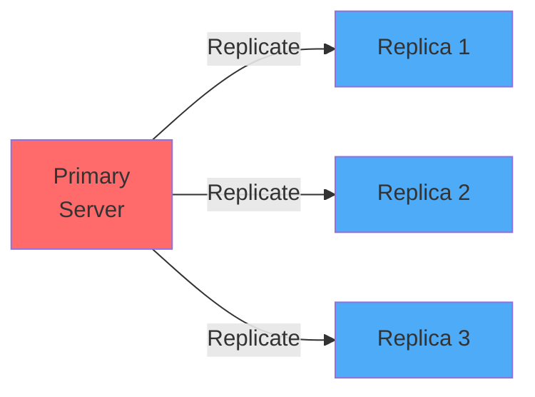

### Why Replicate?

| Benefit | Description |
|---------|-------------|
| **High Availability** | If primary fails, promote replica |
| **Read Scaling** | Distribute read queries across replicas |
| **Data Locality** | Replicas in different regions for low latency |
| **Backup** | Replicas serve as live backups |
| **Analytics** | Run heavy reports on replica without affecting primary |

### Replication Methods

#### 1. Synchronous Replication

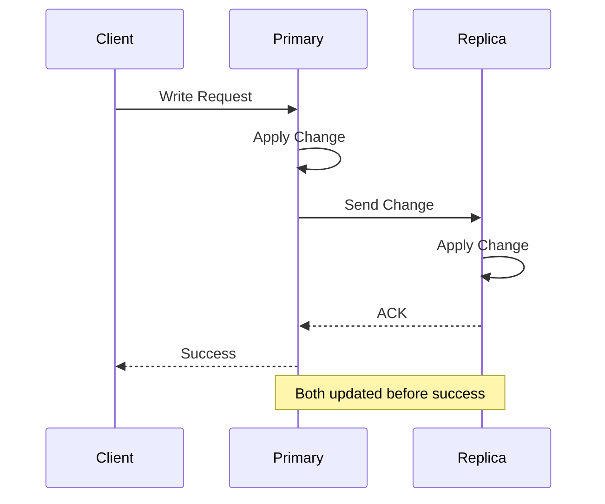

**Characteristics:**
- ✅ Zero data loss (strong consistency)
- ✅ All replicas have same data
- ❌ Higher latency (waits for replicas)
- ❌ Write fails if replica unavailable

**Use Cases:**
- Financial transactions
- Critical data that cannot be lost
- Systems requiring strong consistency

#### 2. Asynchronous Replication

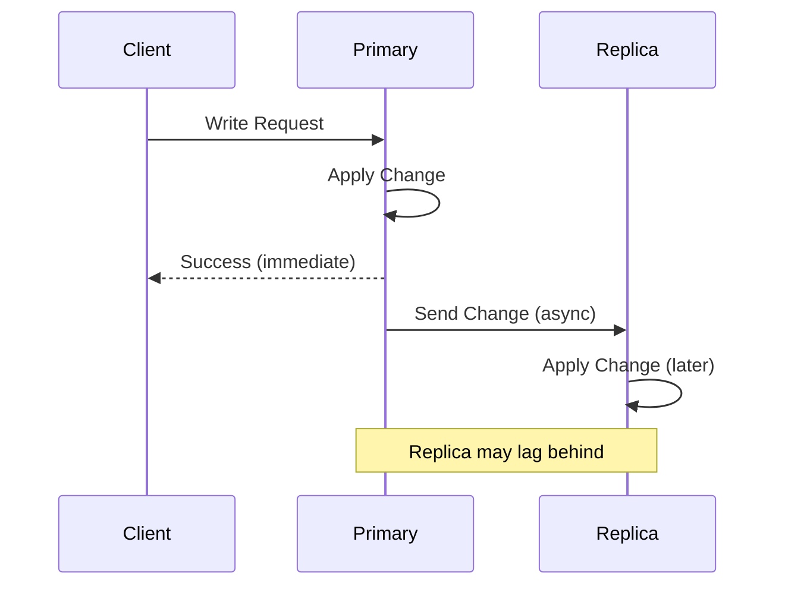

**Characteristics:**
- ✅ Low latency (doesn't wait for replicas)
- ✅ Write succeeds even if replica down
- ❌ Replication lag (eventual consistency)
- ❌ Potential data loss if primary fails

**Use Cases:**
- Social media feeds
- Analytics dashboards
- Non-critical data

#### 3. Semi-Synchronous Replication

**Hybrid approach:** At least one replica must acknowledge, others async.

```sql
-- MySQL semi-sync replication
INSTALL PLUGIN rpl_semi_sync_master SONAME 'semisync_master.so';
SET GLOBAL rpl_semi_sync_master_enabled = 1;
SET GLOBAL rpl_semi_sync_master_timeout = 1000; -- 1 second timeout
```

**Benefits:**
- Balance between consistency and performance
- Some data protection with acceptable latency

---

## Replication Architectures

### 1. Primary-Replica (Master-Slave)

**Most common pattern:** One primary (writes), multiple replicas (reads)

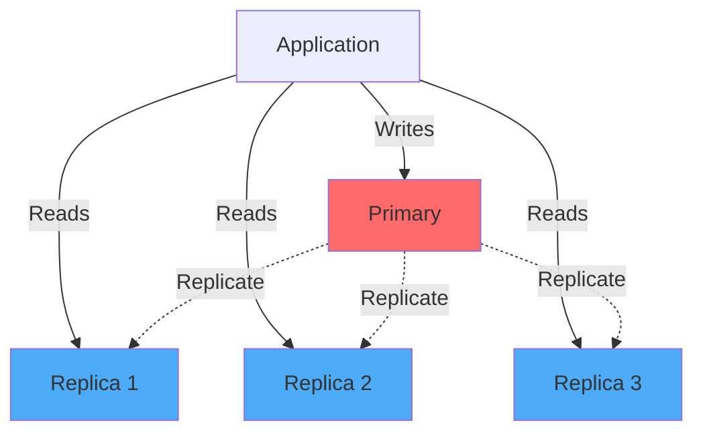

**PostgreSQL Setup:**

**Primary server (primary.conf):**
```sql
-- postgresql.conf
wal_level = replica
max_wal_senders = 10
wal_keep_size = 16GB
hot_standby = on

-- Create replication user
CREATE ROLE replicator WITH REPLICATION LOGIN PASSWORD 'strong_password';
```

**Replica server (replica.conf):**
```sql
-- postgresql.conf
hot_standby = on

-- Create recovery.signal file and configure
primary_conninfo = 'host=primary.example.com port=5432 user=replicator password=strong_password'
restore_command = 'cp /var/lib/postgresql/wal_archive/%f %p'
```

**Application routing:**
```python
import psycopg2

# Write database connection
write_db = psycopg2.connect("host=primary.example.com dbname=mydb user=app")

# Read database connection (round-robin across replicas)
read_replicas = [
    "replica1.example.com",
    "replica2.example.com",
    "replica3.example.com"
]
import random
read_db = psycopg2.connect(f"host={random.choice(read_replicas)} dbname=mydb user=app")

# Write operations
cursor = write_db.cursor()
cursor.execute("INSERT INTO users (username, email) VALUES (%s, %s)", ("john", "john@example.com"))
write_db.commit()

# Read operations
cursor = read_db.cursor()
cursor.execute("SELECT * FROM users WHERE username = %s", ("john",))
users = cursor.fetchall()
```

### 2. Multi-Primary (Multi-Master)

**Multiple databases accept writes simultaneously**

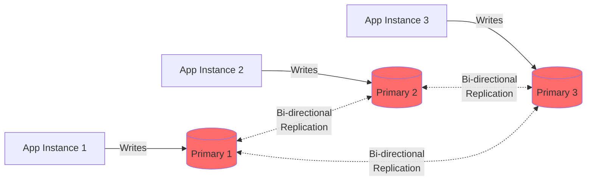

**Challenges:**
- ❌ Write conflicts (same row updated on different primaries)
- ❌ Complex conflict resolution
- ❌ Harder to maintain consistency

**Conflict Resolution Strategies:**

```sql
-- Last Write Wins (LWW)
-- Use timestamp to determine winner
CREATE TABLE users (
    user_id BIGINT PRIMARY KEY,
    username VARCHAR(50),
    email VARCHAR(255),
    updated_at TIMESTAMPTZ DEFAULT NOW(),
    updated_by_server VARCHAR(50)  -- Track which server made change
);

-- Conflict: Both servers updated user_id=123
-- Server 1: updated_at = '2024-01-15 10:30:00'
-- Server 2: updated_at = '2024-01-15 10:30:05'
-- Result: Server 2 wins (later timestamp)
```

**Use Cases:**
- Multi-region applications (writes in each region)
- Systems requiring write availability during network partitions
- Distributed systems where eventual consistency is acceptable

### 3. Cascading Replication

**Replicas replicate from other replicas**

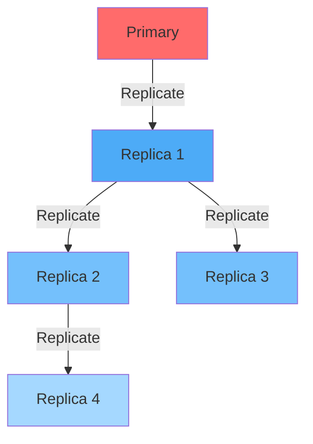

**Benefits:**
- Reduces load on primary
- Supports deeper replication hierarchies

**PostgreSQL Cascading Setup:**
```sql
-- Replica 1 (replicates from primary)
primary_conninfo = 'host=primary.example.com port=5432 user=replicator'

-- Replica 2 (replicates from Replica 1)
primary_conninfo = 'host=replica1.example.com port=5432 user=replicator'
```

---

## High Availability Patterns

### Availability Metrics

```
Availability % = (Total Time - Downtime) / Total Time × 100

99.9%   ("three nines")  = 8.76 hours downtime/year
99.99%  ("four nines")   = 52.6 minutes downtime/year
99.999% ("five nines")   = 5.26 minutes downtime/year
```

### Pattern 1: Active-Passive (Hot Standby)

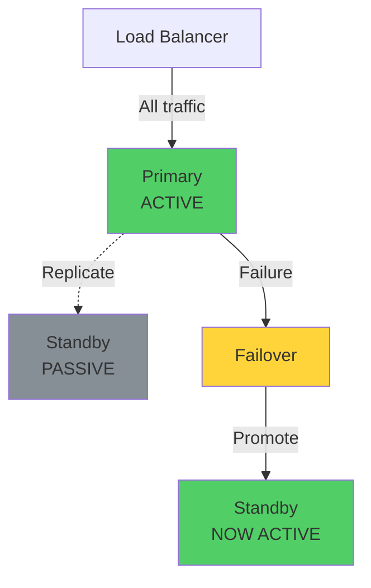

**Setup with Patroni (PostgreSQL HA):**

```yaml
# patroni.yml
scope: postgres-cluster
name: node1

restapi:
  listen: 0.0.0.0:8008
  connect_address: node1.example.com:8008

etcd:
  hosts: etcd1:2379,etcd2:2379,etcd3:2379

bootstrap:
  dcs:
    ttl: 30
    loop_wait: 10
    retry_timeout: 10
    maximum_lag_on_failover: 1048576
    
postgresql:
  listen: 0.0.0.0:5432
  connect_address: node1.example.com:5432
  data_dir: /var/lib/postgresql/data
  authentication:
    replication:
      username: replicator
      password: secure_password
```

**Automatic Failover:**
1. Primary fails
2. Patroni detects failure (via etcd/consul)
3. Selects best replica (least lag)
4. Promotes replica to primary
5. Updates connection routing

### Pattern 2: Active-Active (Multi-Region)

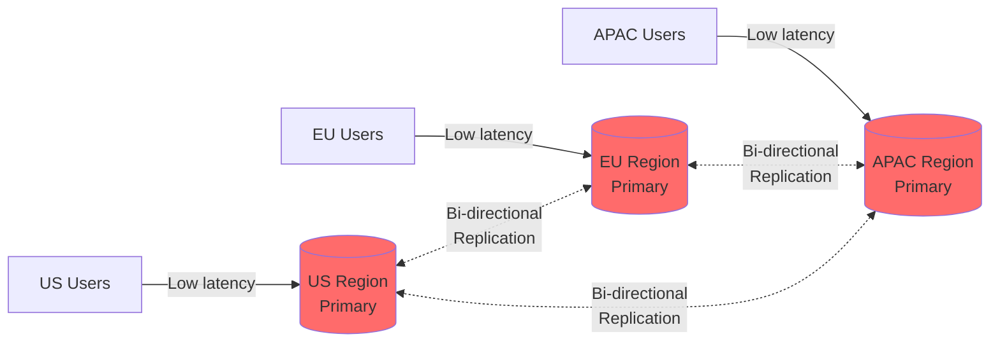

**Use Case:** Global application with users worldwide

**Example: AWS Aurora Global Database**
- Primary region: US-East
- Secondary regions: EU-West, AP-South
- Replication lag: <1 second
- Failover time: <1 minute

### Pattern 3: Split-Brain Prevention

**Problem:** Network partition causes both nodes to think they're primary

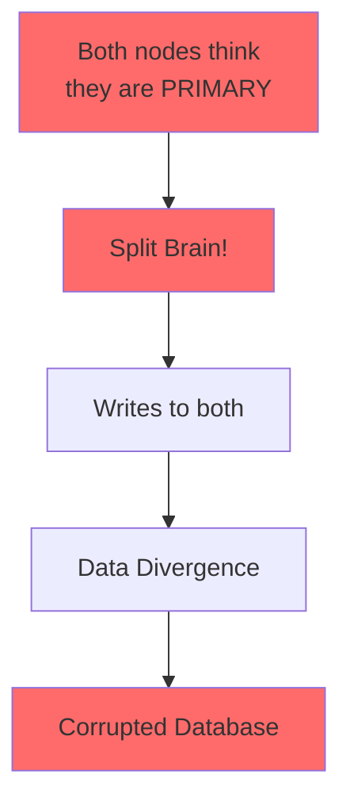

**Solution: Quorum-Based Consensus**

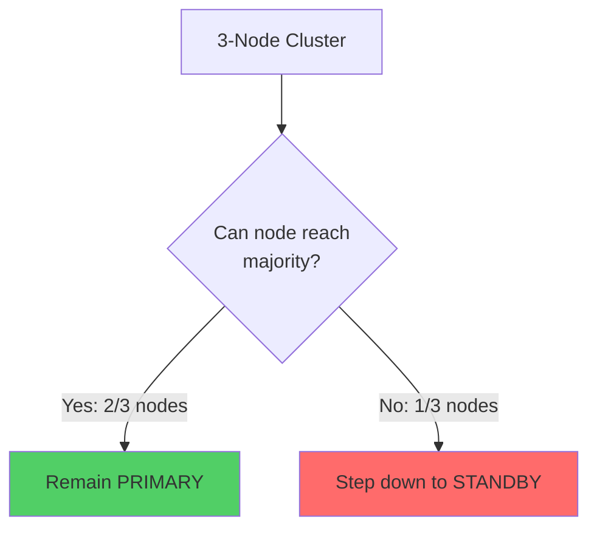

**Implementation: Using etcd/Consul for leader election**

```python
import etcd3

class DatabaseLeaderElection:
    def __init__(self, node_id):
        self.node_id = node_id
        self.etcd = etcd3.client()
        self.lease = None
        self.is_leader = False
    
    def campaign_for_leadership(self):
        """Try to become leader"""
        # Create lease (TTL 10 seconds)
        self.lease = self.etcd.lease(10)
        
        try:
            # Try to acquire lock
            lock = self.etcd.lock('/db/leader', ttl=10)
            lock.acquire(timeout=1)
            
            # Successfully acquired lock
            self.is_leader = True
            print(f"Node {self.node_id} is now LEADER")
            
            # Keep renewing lease
            while True:
                self.lease.refresh()
                time.sleep(5)
                
        except Exception as e:
            self.is_leader = False
            print(f"Node {self.node_id} is FOLLOWER")
```

---

## Failover Strategies

### Automatic Failover Requirements

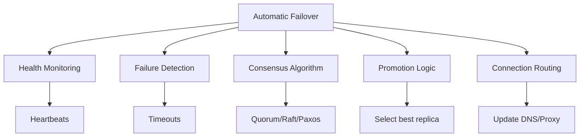

### Failover Process

**1. Detection Phase (5-30 seconds)**

```python
class HealthMonitor:
    def check_primary_health(self, primary_host):
        try:
            conn = psycopg2.connect(
                host=primary_host,
                dbname='postgres',
                user='monitor',
                connect_timeout=5
            )
            cursor = conn.cursor()
            
            # Check if database is accepting writes
            cursor.execute("SELECT pg_is_in_recovery()")
            is_replica = cursor.fetchone()[0]
            
            if is_replica:
                return False, "Primary is in recovery mode"
            
            # Check replication lag
            cursor.execute("""
                SELECT EXTRACT(EPOCH FROM (now() - pg_last_xact_replay_timestamp())) 
                AS lag_seconds
            """)
            
            return True, "Healthy"
            
        except Exception as e:
            return False, f"Connection failed: {e}"
```

**2. Election Phase (5-10 seconds)**

```python
def select_best_replica(replicas):
    """Select replica with least lag and most recent data"""
    best_replica = None
    min_lag = float('inf')
    
    for replica in replicas:
        try:
            conn = psycopg2.connect(host=replica, dbname='postgres')
            cursor = conn.cursor()
            
            # Get replication lag
            cursor.execute("""
                SELECT EXTRACT(EPOCH FROM (now() - pg_last_xact_replay_timestamp())) 
            """)
            lag = cursor.fetchone()[0] or 0
            
            # Get WAL position (higher is more recent)
            cursor.execute("SELECT pg_last_wal_replay_lsn()")
            wal_position = cursor.fetchone()[0]
            
            if lag < min_lag:
                min_lag = lag
                best_replica = {
                    'host': replica,
                    'lag': lag,
                    'wal_position': wal_position
                }
        except:
            continue
    
    return best_replica
```

**3. Promotion Phase (10-30 seconds)**

```sql
-- Promote replica to primary (PostgreSQL)
SELECT pg_promote();

-- Verify promotion
SELECT pg_is_in_recovery();  -- Should return FALSE
```

**4. Routing Update**

```python
# Update HAProxy configuration
def update_haproxy_backend(new_primary_ip):
    config = f"""
    backend postgres_primary
        server primary {new_primary_ip}:5432 check
    """
    
    # Reload HAProxy
    os.system("systemctl reload haproxy")
```

### Handling Failback

**After original primary recovers:**

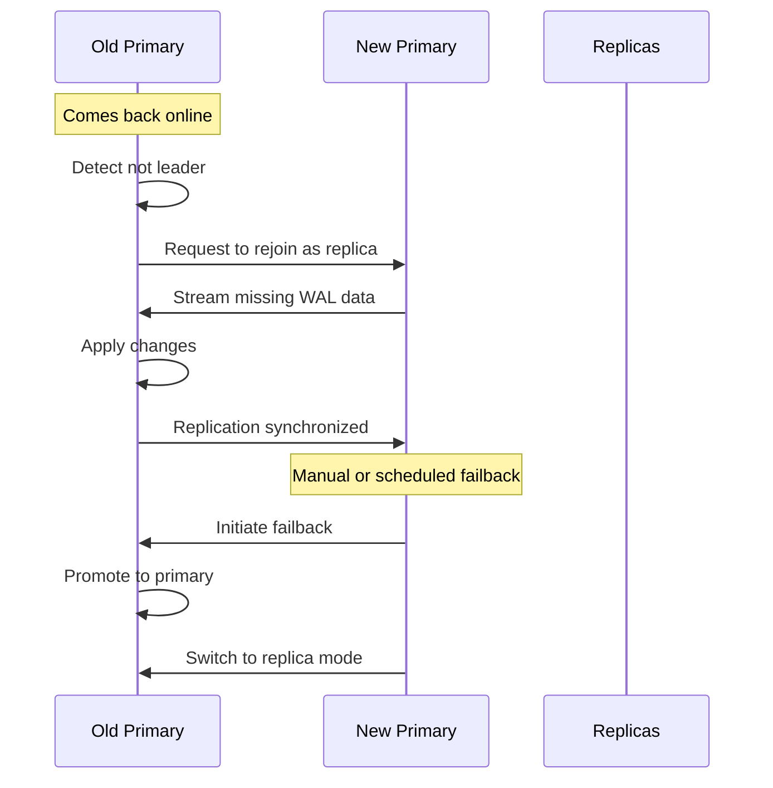

---

## Backup Strategies

### Backup Types

| Type | Description | Recovery Time | Storage | Use Case |
|------|-------------|---------------|---------|----------|
| **Full Backup** | Complete database copy | Fast | Large | Weekly |
| **Incremental** | Only changes since last backup | Slower | Small | Daily |
| **Differential** | Changes since last full backup | Medium | Medium | Daily |
| **Continuous** | WAL archiving (PostgreSQL) | Very Fast | Medium | Real-time |

### Full Backup (PostgreSQL)

```bash
# Using pg_dump (logical backup)
pg_dump -h localhost -U postgres -Fc -f /backups/mydb_$(date +%Y%m%d).dump mydb

# Using pg_basebackup (physical backup)
pg_basebackup -h localhost -U replicator -D /backups/base_$(date +%Y%m%d) -Fp -Xs -P
```

### Continuous Archiving (WAL)

**PostgreSQL WAL archiving:**

```sql
-- postgresql.conf
archive_mode = on
archive_command = 'cp %p /var/lib/postgresql/wal_archive/%f'
archive_timeout = 300  -- Force WAL switch every 5 minutes

-- Or archive to S3
archive_command = 'aws s3 cp %p s3://my-backup-bucket/wal/%f'
```

**Point-in-Time Recovery (PITR):**

```bash
# Restore base backup
pg_basebackup -D /var/lib/postgresql/data

# Configure recovery
cat > /var/lib/postgresql/data/recovery.conf <<EOF
restore_command = 'cp /var/lib/postgresql/wal_archive/%f %p'
recovery_target_time = '2024-01-15 14:30:00'
recovery_target_action = 'promote'
EOF

# Start PostgreSQL - will recover to specified time
systemctl start postgresql
```

### Backup Automation Script

```bash
#!/bin/bash
# backup_db.sh

DATE=$(date +%Y%m%d_%H%M%S)
BACKUP_DIR="/backups/postgresql"
S3_BUCKET="s3://my-db-backups"
RETENTION_DAYS=30

# Full backup
pg_basebackup -h localhost -U replicator \
  -D "${BACKUP_DIR}/base_${DATE}" \
  -Fp -Xs -P

# Compress
tar -czf "${BACKUP_DIR}/base_${DATE}.tar.gz" -C "${BACKUP_DIR}" "base_${DATE}"
rm -rf "${BACKUP_DIR}/base_${DATE}"

# Upload to S3
aws s3 cp "${BACKUP_DIR}/base_${DATE}.tar.gz" "${S3_BUCKET}/"

# Delete local backup
rm -f "${BACKUP_DIR}/base_${DATE}.tar.gz"

# Delete old S3 backups
aws s3 ls "${S3_BUCKET}/" | while read -r line; do
    createDate=$(echo $line | awk {'print $1" "$2'})
    createDate=$(date -d "$createDate" +%s)
    olderThan=$(date -d "-${RETENTION_DAYS} days" +%s)
    
    if [[ $createDate -lt $olderThan ]]; then
        fileName=$(echo $line | awk {'print $4'})
        aws s3 rm "${S3_BUCKET}/${fileName}"
    fi
done
```

### Backup Testing

> [!IMPORTANT]
> **Untested backups are useless!** Regularly test restore procedures.

```bash
# Monthly backup restore test
#!/bin/bash
# test_restore.sh

# Download latest backup
LATEST_BACKUP=$(aws s3 ls s3://my-db-backups/ | sort | tail -n 1 | awk '{print $4}')
aws s3 cp "s3://my-db-backups/${LATEST_BACKUP}" /tmp/

# Extract
tar -xzf "/tmp/${LATEST_BACKUP}" -C /tmp/test_restore/

# Start test instance
docker run -d --name test-postgres \
  -v /tmp/test_restore:/var/lib/postgresql/data \
  -e POSTGRES_PASSWORD=test \
  postgres:15

# Verify data integrity
sleep 10
docker exec test-postgres psql -U postgres -c "SELECT COUNT(*) FROM users;"

# Cleanup
docker stop test-postgres
docker rm test-postgres
rm -rf /tmp/test_restore
```

---

## Disaster Recovery Planning

### RTO vs RPO


**RPO (Recovery Point Objective):** How much data loss is acceptable?
- RPO = 1 hour: Can lose up to 1 hour of data
- RPO = 0: No data loss acceptable

**RTO (Recovery Time Objective):** How quickly must service be restored?
- RTO = 4 hours: System must be back in 4 hours
- RTO = 1 minute: Near-instant recovery needed

### DR Strategy Matrix

| RTO/RPO | Minutes | Hours | Days |
|---------|---------|-------|------|
| **Zero RPO** | Multi-region active-active<br/>$$$$ | Synchronous replication + auto-failover<br/>$$$ | Continuous WAL archiving<br/>$$ |
| **Minutes** | Hot standby + auto-failover<br/>$$$ | Warm standby<br/>$$ | Daily backups<br/>$ |
| **Hours** | Read replicas<br/>$$ | Periodic backups<br/>$ | Weekly backups<br/>$ |

### Multi-Region DR Architecture

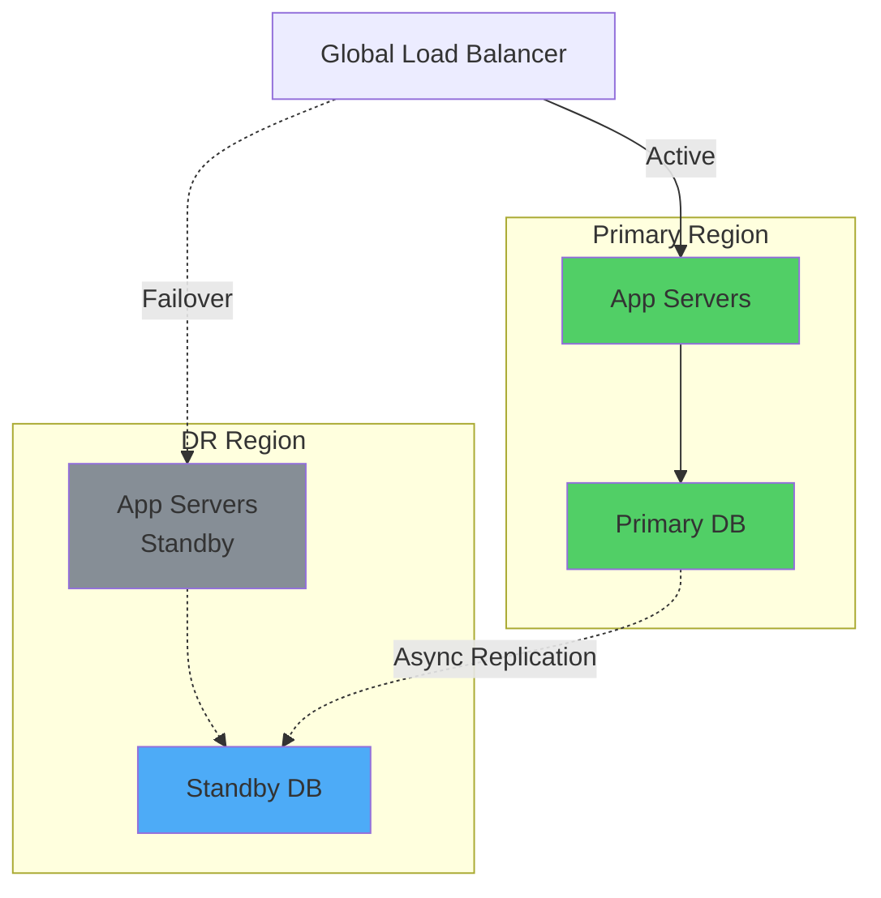

### Disaster Recovery Runbook

```markdown
# Database Disaster Recovery Runbook

## Scenario: Primary Database Complete Failure

### Prerequisites
- [ ] DR database is replicating
- [ ] DR database lag < 1 minute
- [ ] DNS/Load balancer access
- [ ] Team notifications ready

### Steps

1. **Verify Failure (2 minutes)**
   ```bash
   # Check primary health
   pg_isready -h primary.db.example.com
   
   # Check from multiple locations
   # If down from 3+ locations, proceed
   ```

2. **Notify Team (1 minute)**
   ```bash
   # Send alerts
   ./scripts/send_incident_alert.sh "DB_PRIMARY_DOWN"
   ```

3. **Promote DR to Primary (5 minutes)**
   ```bash
   # Connect to DR server
   ssh dr.db.example.com
   
   # Promote to primary
   sudo -u postgres pg_ctl promote -D /var/lib/postgresql/data
   
   # Verify
   psql -c "SELECT pg_is_in_recovery();"  # Should be false
   ```

4. **Update DNS (2 minutes)**
   ```bash
   # Update Route53 / CloudFlare
   aws route53 change-resource-record-sets --hosted-zone-id Z123456 \
     --change-batch file://dns-failover.json
   ```

5. **Verify Application Connectivity (3 minutes)**
   ```bash
   # Test write
   psql -h db.example.com -c "SELECT now();"
   
   # Check application logs
   tail -f /var/log/app/*.log | grep "database"
   ```

6. **Post-Incident**
   - Monitor DR database performance
   - Investigate primary failure cause
   - Plan primary rebuild
   - Update incident log
```

---

## Key Takeaways

> [!IMPORTANT]
> **High Availability Best Practices:**
> 1. Use asynchronous replication for performance, synchronous for critical data
> 2. Implement automatic failover with consensus algorithms (avoid split-brain)
> 3. Test failover regularly (monthly minimum)
> 4. Monitor replication lag continuously
> 5. Backup! Test restores! Multiple backup locations!
> 6. Define clear RTO/RPO objectives based on business needs
> 7. Document and practice disaster recovery procedures
> 8. Use connection pooling to reduce connection overhead
> 9. Implement health checks and alerting
> 10. Consider multi-region deployment for global applications

---

## Next Steps

In **Part 6**, we'll analyze real-world case studies:
- Social media platform architecture (Instagram/Twitter scale)
- E-commerce database design (Amazon/Shopify scale)
- Analytics platform architecture (Billion-row datasets)

---

**Continue to:** [Part 6: Real-World Case Studies](file:///C:/Users/phusukale/Downloads/Docs/Repo/Database_Architecture_Guide/Part6-Real-World-Case-Studies.md)
