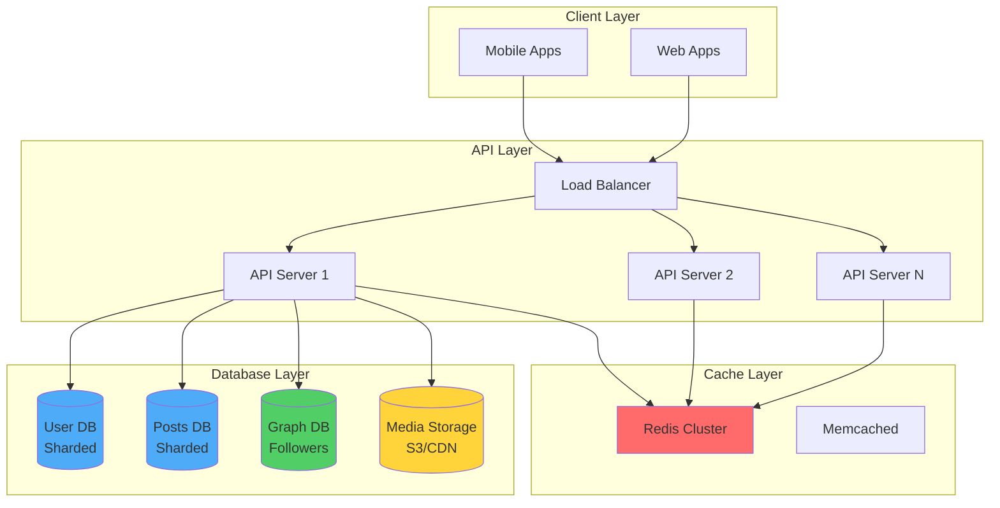
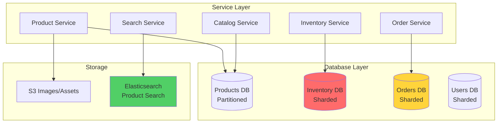
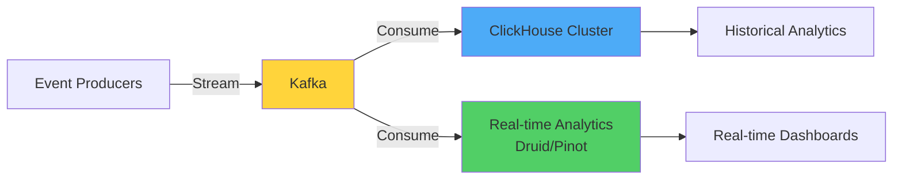

# Part 6: Real-World Case Studies

## Table of Contents
1. [Social Media Platform (Instagram Scale)](#case-study-1-social-media-platform-instagram-scale)
2. [E-commerce Marketplace (Amazon Scale)](#case-study-2-e-commerce-marketplace-amazon-scale)
3. [Analytics Platform (Billion-Row Datasets)](#case-study-3-analytics-platform-billion-row-datasets)
4. [Messaging Application (WhatsApp Scale)](#case-study-4-messaging-application-whatsapp-scale)

---

## Case Study 1: Social Media Platform (Instagram Scale)

### Requirements

**Scale:**
- 500M+ active users
- 100M+ daily active users
- 500M+ posts created per day
- 10B+ likes per day
- 50M+ photos uploaded per day

**Performance:**
- Feed loads in <300ms
- Image upload completes in <2 seconds
- Like/comment actions complete in <100ms

**Data Characteristics:**
- Read-heavy (95% reads, 5% writes)
- Time-series data (posts, comments chronological)
- Graph data (followers, social connections)

### Architecture Overview



### Database Schema Design

#### Users Database (Sharded by user_id)

```sql
-- Shard by user_id (hash-based, 256 shards)
CREATE TABLE users (
    user_id BIGINT PRIMARY KEY,  -- Snowflake ID
    username VARCHAR(30) UNIQUE NOT NULL,
    email VARCHAR(255) UNIQUE NOT NULL,
    full_name VARCHAR(100),
    bio VARCHAR(150),
    profile_pic_url VARCHAR(500),
    follower_count INT DEFAULT 0,
    following_count INT DEFAULT 0,
    post_count INT DEFAULT 0,
    is_verified BOOLEAN DEFAULT FALSE,
    is_private BOOLEAN DEFAULT FALSE,
    created_at TIMESTAMPTZ DEFAULT NOW(),
    updated_at TIMESTAMPTZ DEFAULT NOW(),
    
    INDEX idx_username (username),
    INDEX idx_email (email)
);

-- User settings (same shard as user for colocated queries)
CREATE TABLE user_settings (
    user_id BIGINT PRIMARY KEY,
    notifications_enabled BOOLEAN DEFAULT TRUE,
    dark_mode BOOLEAN DEFAULT FALSE,
    language VARCHAR(10) DEFAULT 'en',
    preferences JSONB,
    FOREIGN KEY (user_id) REFERENCES users(user_id) ON DELETE CASCADE
);
```

#### Posts Database (Sharded by user_id for data locality)

```sql
-- Shard by user_id (same sharding as users for JOIN efficiency)
CREATE TABLE posts (
    post_id BIGINT PRIMARY KEY,  -- Snowflake ID (time-ordered)
    user_id BIGINT NOT NULL,
    caption TEXT,
    media_urls JSONB,  -- Array of URLs
    like_count INT DEFAULT 0,
    comment_count INT DEFAULT 0,
    created_at TIMESTAMPTZ DEFAULT NOW(),
    
    -- Denormalized user data for feed display
    username VARCHAR(30) NOT NULL,
    user_profile_pic VARCHAR(500),
    
    INDEX idx_user_created (user_id, created_at DESC),
    INDEX idx_created (created_at DESC)
) PARTITION BY RANGE (created_at);

-- Partition by month for easier archiving
CREATE TABLE posts_2024_01 PARTITION OF posts
    FOR VALUES FROM ('2024-01-01') TO ('2024-02-01');
-- ... monthly partitions

-- Likes table (separate for scalability)
CREATE TABLE likes (
    post_id BIGINT NOT NULL,
    user_id BIGINT NOT NULL,
    created_at TIMESTAMPTZ DEFAULT NOW(),
    PRIMARY KEY (post_id, user_id),
    INDEX idx_user_created (user_id, created_at DESC)
) PARTITION BY HASH (post_id);  -- 64 partitions

-- Comments
CREATE TABLE comments (
    comment_id BIGINT PRIMARY KEY,
    post_id BIGINT NOT NULL,
    user_id BIGINT NOT NULL,
    parent_comment_id BIGINT,  -- For threaded comments
    content TEXT NOT NULL,
    like_count INT DEFAULT 0,
    created_at TIMESTAMPTZ DEFAULT NOW(),
    
    -- Denormalized for display
    username VARCHAR(30),
    user_profile_pic VARCHAR(500),
    
    INDEX idx_post_created (post_id, created_at),
    INDEX idx_user_created (user_id, created_at DESC)
) PARTITION BY RANGE (created_at);
```

#### Followers Graph (Separate Graph Database or Optimized SQL)

```sql
-- follows table (could also use Neo4j/Neptune for complex graph queries)
CREATE TABLE follows (
    follower_id BIGINT NOT NULL,
    following_id BIGINT NOT NULL,
    created_at TIMESTAMPTZ DEFAULT NOW(),
    PRIMARY KEY (follower_id, following_id),
    INDEX idx_following (following_id, created_at DESC)
) PARTITION BY HASH (follower_id);  -- 128 partitions
```

### Feed Generation Strategy

**Challenge:** Generating personalized feed for 100M daily users efficiently

**Solution: Fanout Approach**

#### 1. Fanout on Write (for users with <1000 followers)

```python
def create_post(user_id, caption, media_urls):
    # 1. Create post
    post_id = snowflake_generator.generate()
    post = {
        'post_id': post_id,
        'user_id': user_id,
        'caption': caption,
        'media_urls': media_urls,
        'created_at': datetime.now()
    }
    
    db.execute("INSERT INTO posts (...) VALUES (...)", post)
    
    # 2. Get followers
    followers = db.query("""
        SELECT follower_id FROM follows 
        WHERE following_id = %s
    """, user_id)
    
    # 3. Fanout: Add post to each follower's Redis feed
    for follower_id in followers:
        redis.lpush(f"feed:{follower_id}", post_id)
        redis.ltrim(f"feed:{follower_id}", 0, 999)  # Keep latest 1000
    
    return post_id
```

#### 2. Fanout on Read (for users with >1000 followers / celebrities)

```python
def get_user_feed(user_id, page=1, limit=20):
    # Check if precomputed feed exists in Redis
    cached_feed = redis.lrange(f"feed:{user_id}", 0, 999)
    
    if cached_feed:
        # Use cached feed
        post_ids = cached_feed[(page-1)*limit : page*limit]
    else:
        # Compute feed on demand (for celebrity followers)
        following = db.query("""
            SELECT following_id FROM follows WHERE follower_id = %s
        """, user_id)
        
        # Get recent posts from followed users
        post_ids = db.query("""
            SELECT post_id FROM posts
            WHERE user_id IN (%s)
            ORDER BY created_at DESC
            LIMIT %s
        """, tuple(following), limit)
    
    # Fetch post details from cache or DB
    posts = []
    for post_id in post_ids:
        # Try cache first
        post = redis.get(f"post:{post_id}")
        if not post:
            post = db.query_one("SELECT * FROM posts WHERE post_id = %s", post_id)
            redis.setex(f"post:{post_id}", 3600, json.dumps(post))
        
        posts.append(post)
    
    return posts
```

### Caching Strategy

```python
# Multi-layer caching
class CacheLayer:
    def __init__(self):
        self.l1 = {}  # In-process cache (LRU, 1000 items)
        self.l2 = redis.Redis(host='redis-cluster')  # Redis
    
    def get_user(self, user_id):
        # L1: Process memory
        if user_id in self.l1:
            return self.l1[user_id]
        
        # L2: Redis
        user = self.l2.get(f"user:{user_id}")
        if user:
            self.l1[user_id] = user
            return user
        
        # L3: Database
        user = db.query_one("SELECT * FROM users WHERE user_id = %s", user_id)
        
        # Populate caches
        self.l2.setex(f"user:{user_id}", 3600, json.dumps(user))
        self.l1[user_id] = user
        
        return user
```

### Key Design Decisions

| Challenge | Solution | Reasoning |
|-----------|----------|-----------|
| Fast feed generation | Hybrid fanout (write for normal users, read for celebrities) | Balance between precomputation and storage |
| Handle viral posts | Separate `likes` table, incremental counters | Avoid hotspot on posts table |
| User profile lookups | Aggressive caching (Redis), denormalization | Username rarely changes, cache heavily |
| Media storage | S3 + CloudFront CDN | Database stores URLs only, media on CDN |
| Search functionality | Elasticsearch cluster | Full-text search on posts/users |

---

## Case Study 2: E-commerce Marketplace (Amazon Scale)

### Requirements

**Scale:**
- 300M+ customers
- 10M+ sellers
- 500M+ products
- 5M+ orders per day
- Peak: 50K orders per minute (Black Friday)

**Performance:**
- Product page loads in <200ms
- Checkout completes in <1 second
- Search results in <100ms

**Critical Requirements:**
- Strong consistency for inventory
- ACID transactions for orders
- Audit trail for fraud detection

### Architecture Overview



### Database Schema Design

#### Products Database (Partitioned by category)

```sql
-- Partitioned by category for query efficiency
CREATE TABLE products (
    product_id BIGINT PRIMARY KEY,
    seller_id BIGINT NOT NULL,
    title VARCHAR(500) NOT NULL,
    description TEXT,
    category_id INT NOT NULL,
    subcategory_id INT,
    brand VARCHAR(100),
    price DECIMAL(10, 2) NOT NULL,
    currency VARCHAR(3) DEFAULT 'USD',
    
    -- Product attributes (varies by category)
    attributes JSONB,
    
    -- SEO
    seo_title VARCHAR(200),
    seo_description TEXT,
    
    -- Status
    status VARCHAR(20) DEFAULT 'active',  -- active, inactive, deleted
    
    -- Timestamps
    created_at TIMESTAMPTZ DEFAULT NOW(),
    updated_at TIMESTAMPTZ DEFAULT NOW(),
    
    INDEX idx_seller (seller_id),
    INDEX idx_category (category_id, subcategory_id),
    INDEX idx_brand (brand),
    INDEX idx_price (price),
    INDEX idx_status (status)
) PARTITION BY LIST (category_id);

-- Separate partitions for major categories
CREATE TABLE products_electronics PARTITION OF products 
    FOR VALUES IN (1, 2, 3);  -- Electronics categories

CREATE TABLE products_clothing PARTITION OF products 
    FOR VALUES IN (10, 11, 12);  -- Clothing categories
-- etc.

-- Product images
CREATE TABLE product_images (
    image_id BIGSERIAL PRIMARY KEY,
    product_id BIGINT NOT NULL,
    image_url VARCHAR(500) NOT NULL,
    display_order INT DEFAULT 0,
    is_primary BOOLEAN DEFAULT FALSE,
    FOREIGN KEY (product_id) REFERENCES products(product_id) ON DELETE CASCADE,
    INDEX idx_product (product_id, display_order)
);
```

#### Inventory Database (Sharded by warehouse_id)

> [!IMPORTANT]
> Inventory requires strong consistency to prevent overselling!

```sql
-- Shard by warehouse_id for data locality
CREATE TABLE inventory (
    inventory_id BIGSERIAL PRIMARY KEY,
    product_id BIGINT NOT NULL,
    warehouse_id INT NOT NULL,
    quantity_available INT NOT NULL DEFAULT 0,
    quantity_reserved INT NOT NULL DEFAULT 0,  -- In shopping carts
    quantity_sold INT NOT NULL DEFAULT 0,
    last_updated TIMESTAMPTZ DEFAULT NOW(),
    
    -- Constraints
    CHECK (quantity_available >= 0),
    CHECK (quantity_reserved >= 0),
    
    UNIQUE (product_id, warehouse_id),
    INDEX idx_product (product_id),
    INDEX idx_warehouse (warehouse_id)
);

-- Inventory transactions (audit trail)
CREATE TABLE inventory_transactions (
    transaction_id BIGSERIAL PRIMARY KEY,
    inventory_id BIGINT NOT NULL,
    transaction_type VARCHAR(20) NOT NULL,  -- restock, reserve, release, sell
    quantity_change INT NOT NULL,
    order_id BIGINT,  -- If related to order
    created_at TIMESTAMPTZ DEFAULT NOW(),
    created_by VARCHAR(100),
    
    INDEX idx_inventory (inventory_id, created_at),
    INDEX idx_order (order_id)
) PARTITION BY RANGE (created_at);
```

#### Orders Database (Sharded by customer_id)

```sql
-- Shard by customer_id for customer query efficiency
CREATE TABLE orders (
    order_id BIGINT PRIMARY KEY,  -- Snowflake ID
    customer_id BIGINT NOT NULL,
    order_number VARCHAR(50) UNIQUE NOT NULL,  -- Human-readable
    
    -- Order details
    subtotal DECIMAL(10, 2) NOT NULL,
    tax DECIMAL(10, 2) NOT NULL,
    shipping_cost DECIMAL(10, 2) NOT NULL,
    discount DECIMAL(10, 2) DEFAULT 0,
    total DECIMAL(10, 2) NOT NULL,
    currency VARCHAR(3) DEFAULT 'USD',
    
    -- Status
    status VARCHAR(20) NOT NULL,  -- pending, confirmed, shipped, delivered, cancelled
    payment_status VARCHAR(20),  -- pending, paid, refunded
    
    -- Shipping
    shipping_address_id BIGINT,
    tracking_number VARCHAR(100),
    estimated_delivery DATE,
    
    -- Timestamps
    created_at TIMESTAMPTZ DEFAULT NOW(),
    updated_at TIMESTAMPTZ DEFAULT NOW(),
    
    INDEX idx_customer (customer_id, created_at DESC),
    INDEX idx_status (status),
    INDEX idx_created (created_at DESC)
) PARTITION BY RANGE (created_at);

-- Monthly partitions
CREATE TABLE orders_2024_01 PARTITION OF orders
    FOR VALUES FROM ('2024-01-01') TO ('2024-02-01');

-- Order items
CREATE TABLE order_items (
    order_item_id BIGSERIAL PRIMARY KEY,
    order_id BIGINT NOT NULL,
    product_id BIGINT NOT NULL,
    seller_id BIGINT NOT NULL,
    
    -- Snapshot at purchase time (denormalized)
    product_title VARCHAR(500) NOT NULL,
    product_image_url VARCHAR(500),
    quantity INT NOT NULL,
    unit_price DECIMAL(10, 2) NOT NULL,
    subtotal DECIMAL(10, 2) NOT NULL,
    
    -- Fulfillment
    warehouse_id INT,
    status VARCHAR(20),  -- pending, shipped, delivered, returned
    
    FOREIGN KEY (order_id) REFERENCES orders(order_id) ON DELETE CASCADE,
    INDEX idx_order (order_id),
    INDEX idx_product (product_id),
    INDEX idx_seller (seller_id)
);
```

### Critical Operation: Placing an Order

**Challenge:** Ensure inventory is reserved atomically across multiple products

```python
from decimal import Decimal
import psycopg2
from psycopg2 import sql

def place_order(customer_id, cart_items, shipping_address_id):
    """
    Place order with ACID transaction guarantees
    
    cart_items: [
        {'product_id': 123, 'quantity': 2},
        {'product_id': 456, 'quantity': 1}
    ]
    """
    
    conn = psycopg2.connect(get_db_connection_string())
    
    try:
        cursor = conn.cursor()
        
        # Start transaction (SERIALIZABLE isolation for inventory)
        cursor.execute("BEGIN TRANSACTION ISOLATION LEVEL SERIALIZABLE;")
        
        # 1. Validate and reserve inventory
        for item in cart_items:
            product_id = item['product_id']
            quantity = item['quantity']
            
            # Select warehouse with sufficient inventory (row lock)
            cursor.execute("""
                SELECT inventory_id, warehouse_id, quantity_available
                FROM inventory
                WHERE product_id = %s 
                  AND quantity_available >= %s
                ORDER BY warehouse_id
                LIMIT 1
                FOR UPDATE;  -- Row-level lock
            """, (product_id, quantity))
            
            inventory = cursor.fetchone()
            
            if not inventory:
                raise InsufficientInventoryError(f"Product {product_id} out of stock")
            
            inventory_id, warehouse_id, quantity_available = inventory
            
            # Reserve inventory
            cursor.execute("""
                UPDATE inventory
                SET quantity_available = quantity_available - %s,
                    quantity_reserved = quantity_reserved + %s,
                    last_updated = NOW()
                WHERE inventory_id = %s
            """, (quantity, quantity, inventory_id))
            
            # Record transaction
            cursor.execute("""
                INSERT INTO inventory_transactions 
                (inventory_id, transaction_type, quantity_change, created_by)
                VALUES (%s, 'reserve', %s, %s)
            """, (inventory_id, -quantity, f'customer:{customer_id}'))
            
            # Store warehouse assignment
            item['warehouse_id'] = warehouse_id
            item['inventory_id'] = inventory_id
        
        # 2. Create order
        order_id = snowflake_generator.generate()
        order_number = generate_order_number()
        
        # Calculate totals
        subtotal = sum(
            get_product_price(item['product_id']) * item['quantity'] 
            for item in cart_items
        )
        tax = calculate_tax(subtotal, shipping_address_id)
        shipping = calculate_shipping(cart_items, shipping_address_id)
        total = subtotal + tax + shipping
        
        cursor.execute("""
            INSERT INTO orders (
                order_id, customer_id, order_number,
                subtotal, tax, shipping_cost, total,
                status, payment_status, shipping_address_id
            ) VALUES (%s, %s, %s, %s, %s, %s, %s, 'pending', 'pending', %s)
        """, (order_id, customer_id, order_number, subtotal, tax, shipping, total, shipping_address_id))
        
        # 3. Create order items
        for item in cart_items:
            product = get_product(item['product_id'])
            
            cursor.execute("""
                INSERT INTO order_items (
                    order_id, product_id, seller_id,
                    product_title, product_image_url,
                    quantity, unit_price, subtotal,
                    warehouse_id, status
                ) VALUES (%s, %s, %s, %s, %s, %s, %s, %s, %s, 'pending')
            """, (
                order_id, item['product_id'], product['seller_id'],
                product['title'], product['primary_image'],
                item['quantity'], product['price'],
                product['price'] * item['quantity'],
                item['warehouse_id']
            ))
        
        # 4. Commit transaction
        conn.commit()
        
        # 5. Async: Send confirmation email, notify warehouse
        queue.publish('order.created', {'order_id': order_id})
        
        return {
            'order_id': order_id,
            'order_number': order_number,
            'total': total
        }
        
    except Exception as e:
        # Rollback on any error
        conn.rollback()
        raise
        
    finally:
        conn.close()
```

### Search Implementation (Elasticsearch)

```python
# Index product data into Elasticsearch
def index_product(product_id):
    product = db.query_one("SELECT * FROM products WHERE product_id = %s", product_id)
    
    # Build search document
    doc = {
        'product_id': product['product_id'],
        'title': product['title'],
        'description': product['description'],
        'brand': product['brand'],
        'category': product['category_id'],
        'price': float(product['price']),
        'rating': get_product_rating(product_id),
        'review_count': get_review_count(product_id),
        'created_at': product['created_at'].isoformat()
    }
    
    elasticsearch.index(index='products', id=product_id, document=doc)

# Search products
def search_products(query, filters=None, page=1, limit=24):
    search_body = {
        'query': {
            'bool': {
                'must': [
                    {
                        'multi_match': {
                            'query': query,
                            'fields': ['title^3', 'description', 'brand^2'],
                            'fuzziness': 'AUTO'
                        }
                    }
                ],
                'filter': []
            }
        },
        'sort': [
            {'_score': {'order': 'desc'}},
            {'rating': {'order': 'desc'}}
        ],
        'from': (page - 1) * limit,
        'size': limit
    }
    
    # Apply filters
    if filters:
        if 'category' in filters:
            search_body['query']['bool']['filter'].append({
                'term': {'category': filters['category']}
            })
        
        if 'price_min' in filters or 'price_max' in filters:
            price_range = {}
            if 'price_min' in filters:
                price_range['gte'] = filters['price_min']
            if 'price_max' in filters:
                price_range['lte'] = filters['price_max']
            
            search_body['query']['bool']['filter'].append({
                'range': {'price': price_range}
            })
    
    results = elasticsearch.search(index='products', body=search_body)
    
    # Fetch full product details from cache/DB
    product_ids = [hit['_id'] for hit in results['hits']['hits']]
    products = get_products_batch(product_ids)
    
    return {
        'products': products,
        'total': results['hits']['total']['value'],
        'page': page
    }
```

### Key Design Decisions

| Challenge | Solution | Reasoning |
|-----------|----------|-----------|
| Inventory accuracy | SERIALIZABLE transactions + row locking | Prevent overselling during high traffic |
| Order history queries | Shard by customer_id | Customer views their own orders most often |
| Product search | Elasticsearch with DB fallback | Full-text search performance |
| Price consistency | Denormalize price in order_items | Historical orders show price paid |
| Fraud detection | Audit trail (inventory_transactions) | Track every inventory change |

---

## Case Study 3: Analytics Platform (Billion-Row Datasets)

### Requirements

**Scale:**
- 1B+ events per day
- 100TB+ historical data
- Ad-hoc queries on terabytes
- Real-time dashboards

**Performance:**
- Query 100M rows in <5 seconds
- Aggregate 1B rows in <30 seconds
- Real-time ingestion (100K events/sec)

### Architecture: Column-Oriented Database

**PostgreSQL is not ideal for this!** Use purpose-built analytics databases:



**Technology Choice: ClickHouse**

```sql
-- ClickHouse schema for web analytics
CREATE TABLE events (
    event_id UUID,
    event_type String,
    user_id UInt64,
    session_id UUID,
    
    -- Event properties
    page_url String,
    referrer String,
    user_agent String,
    
    -- Dimensions
    country String,
    region String,
    city String,
    device_type LowCardinality(String),  -- mobile, desktop, tablet
    browser LowCardinality(String),
    
    -- Metrics
    duration_ms UInt32,
    
    -- Timestamp
    event_time DateTime,
    date Date
    
) ENGINE = MergeTree()
PARTITION BY toYYYYMM(event_time)
ORDER BY (event_type, country, event_time)
SETTINGS index_granularity = 8192;

-- Query: Top pages by country (scans millions of rows in milliseconds)
SELECT 
    country,
    page_url,
    COUNT(*) as page_views,
    AVG(duration_ms) as avg_duration
FROM events
WHERE event_time >= now() - INTERVAL 1 DAY
  AND event_type = 'pageview'
GROUP BY country, page_url
ORDER BY page_views DESC
LIMIT 100;
```

**Key Benefits over PostgreSQL:**
- ✅ 100x faster for analytical queries
- ✅ Column compression (10x storage savings)
- ✅ Designed for high ingestion rates

---

## Case Study 4: Messaging Application (WhatsApp Scale)

### Requirements

**Scale:**
- 2B+ users
- 100B+ messages per day
- 50M+ group chats

**Performance:**
- Message delivery <100ms
- End-to-end encryption
- Offline message queue

### Key Design: Cassandra

```sql
-- Messages table (Cassandra CQL)
CREATE TABLE messages (
    conversation_id UUID,
    message_id TIMEUUID,
    sender_id BIGINT,
    recipient_id BIGINT,
    message_type TEXT,  -- text, image, video
    content TEXT,
    media_url TEXT,
    is_encrypted BOOLEAN,
    status TEXT,  -- sent, delivered, read
    created_at TIMESTAMP,
    PRIMARY KEY (conversation_id, message_id)
) WITH CLUSTERING ORDER BY (message_id DESC);

-- User inbox (per-user partition)
CREATE TABLE user_inbox (
    user_id BIGINT,
    conversation_id UUID,
    last_message_time TIMEUUID,
    unread_count INT,
    PRIMARY KEY (user_id, last_message_time)
) WITH CLUSTERING ORDER BY (last_message_time DESC);
```

**Why Cassandra:**
- ✅ Linear scalability (add nodes)
- ✅ Multi-datacenter replication
- ✅ No single point of failure
- ✅ Optimized for time-series writes

---

## Key Takeaways

> [!IMPORTANT]
> **Choose the right database for the job:**
> - **PostgreSQL/MySQL:** Transactional systems (e-commerce, banking)
> - **MongoDB:** Flexible schemas (CMS, catalogs)
> - **Cassandra:** High-write time-series (messaging, logs)
> - **ClickHouse:** Analytics (billion-row queries)
> - **Neo4j:** Graph relationships (social networks)
> - **Elasticsearch:** Full-text search
> - **Redis:** Caching, session management

---

## Next Steps

In **Part 7 (Final)**, we'll cover:
- CAP theorem practical implications
- Caching strategies (Redis, CDN)
- Database monitoring and observability
- Performance tuning checklist

---

**Continue to:** [Part 7: Advanced Topics](file:///C:/Users/phusukale/Downloads/Docs/Repo/Database_Architecture_Guide/Part7-Advanced-Topics.md)
