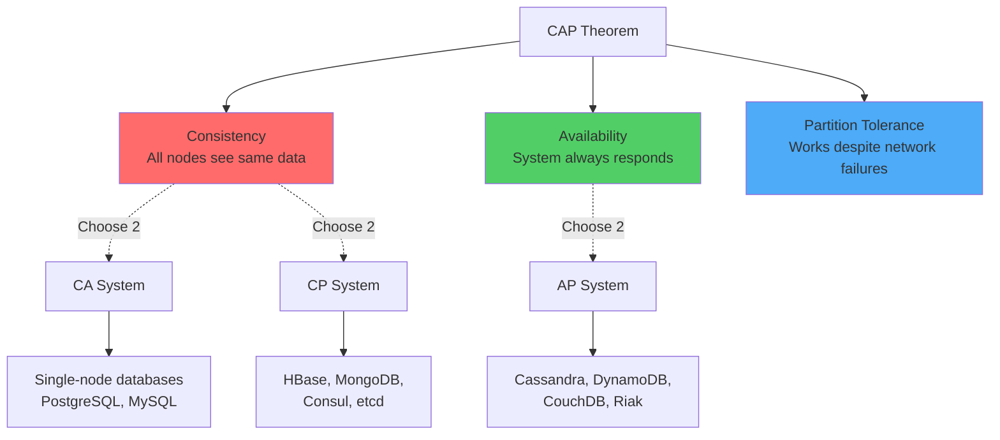
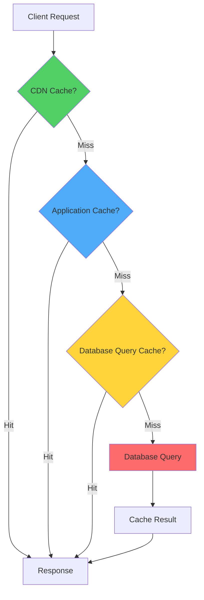
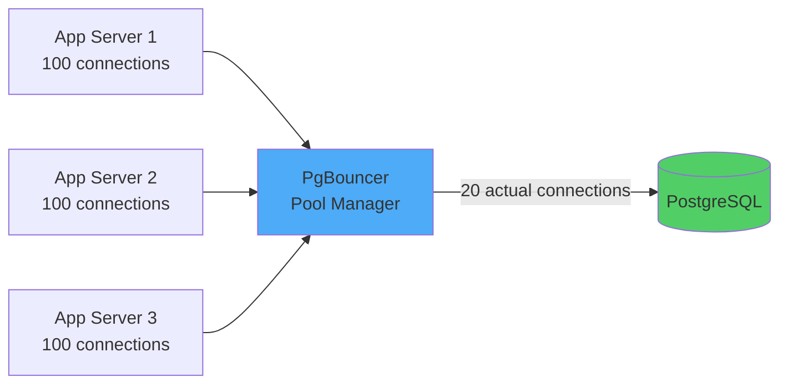
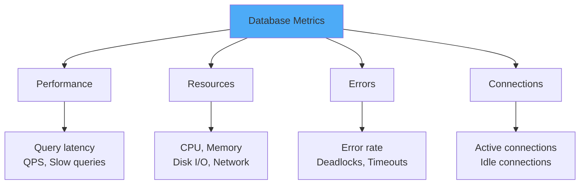

# Part 7: Advanced Topics (CAP Theorem, Caching, Performance Tuning)

## Table of Contents
1. [CAP Theorem in Practice](#cap-theorem-in-practice)
2. [Caching Strategies](#caching-strategies)
3. [Connection Pooling](#connection-pooling)
4. [Database Monitoring & Observability](#database-monitoring--observability)
5. [Performance Tuning Checklist](#performance-tuning-checklist)
6. [Security Best Practices](#security-best-practices)

---

## CAP Theorem in Practice

### Understanding CAP

**CAP Theorem:** In a distributed system, you can only guarantee 2 of 3 properties:



### Reality: Network Partitions Happen

> [!IMPORTANT]
> In distributed systems, network partitions are inevitable. So the real choice is: **CP vs AP**

### CP Systems (Consistency + Partition Tolerance)

**Example: MongoDB (with majority writes)**

```javascript
// MongoDB with writeConcern: majority
db.users.insertOne(
    { username: "john", email: "john@example.com" },
    { writeConcern: { w: "majority", j: true } }
);
// Blocks until majority of nodes acknowledge
// If network partition prevents majority, write FAILS
```

**Behavior during partition:**
- ✅ Consistent: All reads see same data
- ❌ Not available: Minority partition rejects writes

**Use Cases:**
- Financial systems (account balances)
- Inventory management
- Configuration stores (etcd, Consul)

### AP Systems (Availability + Partition Tolerance)

**Example: Cassandra**

```sql
-- Write to Cassandra (eventual consistency)
INSERT INTO users (user_id, username, email) 
VALUES (12345, 'john', 'john@example.com');
-- Always succeeds, even during partition
-- May have conflicts resolved later
```

**Behavior during partition:**
- ✅ Available: All nodes accept writes
- ❌ Not consistent: Temporary divergence
- ✅ Eventually consistent: Converges after partition heals

**Use Cases:**
- Social media (likes, comments)
- Analytics/logging
- Shopping carts (Amazon's approach)

### Database Positioning on CAP Spectrum

```
Strong Consistency (CP)           Eventual Consistency (AP)
    |                                      |
    |                                      |
PostgreSQL -------- MongoDB -------- Cassandra -------- DynamoDB
(single-node)     (majority)      (quorum)          (eventually)
```

### Tunable Consistency (Cassandra Example)

```sql
-- Strong consistency (CP behavior)
SELECT * FROM users WHERE user_id = 12345
USING CONSISTENCY QUORUM;  -- Read from majority

INSERT INTO users (user_id, username) VALUES (12345, 'john')
USING CONSISTENCY QUORUM;  -- Write to majority

-- Eventual consistency (AP behavior)
SELECT * FROM users WHERE user_id = 12345
USING CONSISTENCY ONE;  -- Read from any node

INSERT INTO users (user_id, username) VALUES (12345, 'john')
USING CONSISTENCY ONE;  -- Write to any node
```

### Real-World Strategy: Mixed Consistency

**Different operations need different guarantees**

```python
class UserService:
    def update_profile(self, user_id, profile_data):
        # Profile changes: eventual consistency OK
        cassandra.execute(
            "UPDATE users SET bio = %s WHERE user_id = %s",
            (profile_data['bio'], user_id),
            consistency_level='ONE'  # Fast, eventually consistent
        )
    
    def update_balance(self, user_id, amount):
        # Balance changes: strong consistency required
        postgres.execute(
            "UPDATE accounts SET balance = balance + %s WHERE user_id = %s",
            (amount, user_id),
            isolation_level='SERIALIZABLE'  # Slow, strongly consistent
        )
```

---

## Caching Strategies

### Caching Layers



### 1. Application-Level Caching (Redis/Memcached)

#### Cache-Aside Pattern (Lazy Loading)

```python
import redis
import json

redis_client = redis.Redis(host='localhost', port=6379, db=0)

def get_user(user_id):
    cache_key = f"user:{user_id}"
    
    # Try cache first
    cached = redis_client.get(cache_key)
    if cached:
        return json.loads(cached)
    
    # Cache miss: query database
    user = db.query_one("SELECT * FROM users WHERE user_id = %s", user_id)
    
    # Store in cache (TTL: 1 hour)
    redis_client.setex(cache_key, 3600, json.dumps(user))
    
    return user
```

#### Write-Through Pattern

```python
def update_user(user_id, updates):
    # Update database
    db.execute("UPDATE users SET bio = %s WHERE user_id = %s", 
               (updates['bio'], user_id))
    
    # Update cache immediately
    cache_key = f"user:{user_id}"
    user = db.query_one("SELECT * FROM users WHERE user_id = %s", user_id)
    redis_client.setex(cache_key, 3600, json.dumps(user))
```

#### Write-Behind Pattern (Async Writes)

```python
def like_post(user_id, post_id):
    # Increment counter in Redis immediately
    cache_key = f"post:{post_id}:likes"
    new_count = redis_client.incr(cache_key)
    
    # Queue database update (async)
    queue.publish('post.liked', {
        'post_id': post_id,
        'user_id': user_id,
        'new_count': new_count
    })
    
    return new_count

# Background worker processes queue
def process_like_event(event):
    db.execute(
        "UPDATE posts SET like_count = %s WHERE post_id = %s",
        (event['new_count'], event['post_id'])
    )
```

### 2. Cache Invalidation Strategies

> [!WARNING]
> "There are only two hard things in Computer Science: cache invalidation and naming things." - Phil Karlton

#### TTL (Time To Live)

```python
# Cache for 1 hour
redis_client.setex("user:12345", 3600, user_data)

# Different TTLs for different data
redis_client.setex("session:abc123", 1800, session_data)  # 30 min
redis_client.setex("product:567", 86400, product_data)    # 24 hours
redis_client.setex("config", 300, config_data)            # 5 min
```

#### Active Invalidation

```python
def update_user_profile(user_id, updates):
    # Update database
    db.execute("UPDATE users SET ... WHERE user_id = %s", user_id)
    
    # Invalidate caches
    redis_client.delete(f"user:{user_id}")
    redis_client.delete(f"user:{user_id}:profile")
    
    # Invalidate derived caches
    redis_client.delete(f"user:{user_id}:stats")
```

#### Cache Stampede Prevention

**Problem:** Cache expires, many requests hit database simultaneously

```python
import threading

# ❌ Bad: Cache stampede
def get_popular_posts():
    cached = redis_client.get("popular_posts")
    if cached:
        return json.loads(cached)
    
    # 1000 concurrent requests all hit database!
    posts = db.query("SELECT * FROM posts ORDER BY views DESC LIMIT 20")
    redis_client.setex("popular_posts", 300, json.dumps(posts))
    return posts

# ✅ Good: Lock during refresh
lock_holder = {}
lock = threading.Lock()

def get_popular_posts():
    cache_key = "popular_posts"
    cached = redis_client.get(cache_key)
    if cached:
        return json.loads(cached)
    
    # Try to acquire lock
    acquired = redis_client.set(f"lock:{cache_key}", "1", nx=True, ex=10)
    
    if acquired:
        # This request computes the value
        posts = db.query("SELECT * FROM posts ORDER BY views DESC LIMIT 20")
        redis_client.setex(cache_key, 300, json.dumps(posts))
        redis_client.delete(f"lock:{cache_key}")
        return posts
    else:
        # Wait for lock holder to populate cache
        time.sleep(0.1)
        return get_popular_posts()  # Retry
```

### 3. Query Result Caching (PostgreSQL)

```sql
-- Enable query result caching (PostgreSQL extension)
CREATE EXTENSION IF NOT EXISTS pg_stat_statements;

-- View most expensive queries
SELECT 
    calls,
    total_exec_time,
    mean_exec_time,
    query
FROM pg_stat_statements
ORDER BY total_exec_time DESC
LIMIT 20;
```

### 4. CDN Caching (Static Assets)

```nginx
# Nginx configuration for CDN caching
location ~* \.(jpg|jpeg|png|gif|ico|css|js|woff2)$ {
    expires 1y;
    add_header Cache-Control "public, immutable";
}

# API responses with cache headers
location /api/products {
    add_header Cache-Control "public, max-age=300";  # 5 minutes
    proxy_pass http://backend;
}
```

---

## Connection Pooling

### Why Connection Pooling?

**Problem:** Opening database connection is expensive (100-200ms)

```python
# ❌ Bad: Create connection per request (slow!)
def handle_request():
    conn = psycopg2.connect("host=db.example.com dbname=mydb")
    cursor = conn.cursor()
    cursor.execute("SELECT * FROM users WHERE user_id = 123")
    result = cursor.fetchone()
    conn.close()
    return result
```

**Solution: Connection pool**

```python
# ✅ Good: Reuse connections from pool
from psycopg2 import pool

# Create pool at application startup
connection_pool = pool.SimpleConnectionPool(
    minconn=10,    # Minimum connections
    maxconn=100,   # Maximum connections
    host='db.example.com',
    dbname='mydb',
    user='app',
    password='secret'
)

def handle_request():
    # Get connection from pool (instant!)
    conn = connection_pool.getconn()
    try:
        cursor = conn.cursor()
        cursor.execute("SELECT * FROM users WHERE user_id = 123")
        result = cursor.fetchone()
        return result
    finally:
        # Return connection to pool
        connection_pool.putconn(conn)
```

### PgBouncer (External Connection Pooler)



**Configuration:**

```ini
[databases]
mydb = host=postgres.internal port=5432 dbname=mydb

[pgbouncer]
listen_port = 6432
listen_addr = *

# Pool mode: transaction (connection per transaction)
pool_mode = transaction

# Pool sizes
default_pool_size = 25
max_client_conn = 1000
reserve_pool_size = 5

# Timeouts
server_idle_timeout = 600
server_lifetime = 3600
```

**Application connection string:**

```python
# Connect to PgBouncer instead of PostgreSQL directly
conn = psycopg2.connect(
    host='pgbouncer.internal',
    port=6432,
    dbname='mydb'
)
```

---

## Database Monitoring & Observability

### Key Metrics to Monitor



### 1. Query Performance Monitoring

**PostgreSQL: Slow Query Log**

```sql
-- postgresql.conf
log_min_duration_statement = 1000  -- Log queries > 1 second
log_line_prefix = '%t [%p]: [%l-1] user=%u,db=%d,app=%a,client=%h '
log_statement = 'all'

-- View slow queries
SELECT 
    calls,
    total_exec_time,
    mean_exec_time,
    query
FROM pg_stat_statements
WHERE mean_exec_time > 100  -- More than 100ms average
ORDER BY total_exec_time DESC
LIMIT 20;
```

### 2. Connection Monitoring

```sql
-- Active connections by state
SELECT 
    state,
    COUNT(*) as count
FROM pg_stat_activity
GROUP BY state;

-- Long-running queries
SELECT 
    pid,
    now() - pg_stat_activity.query_start AS duration,
    query,
    state
FROM pg_stat_activity
WHERE state != 'idle'
  AND query_start < now() - interval '5 minutes'
ORDER BY duration DESC;

-- Kill long-running query
SELECT pg_terminate_backend(pid);
```

### 3. Resource Monitoring

```sql
-- Database size
SELECT 
    pg_database.datname,
    pg_size_pretty(pg_database_size(pg_database.datname)) AS size
FROM pg_database
ORDER BY pg_database_size(pg_database.datname) DESC;

-- Table sizes
SELECT 
    schemaname,
    tablename,
    pg_size_pretty(pg_total_relation_size(schemaname||'.'||tablename)) AS size
FROM pg_tables
ORDER BY pg_total_relation_size(schemaname||'.'||tablename) DESC
LIMIT 20;

-- Index usage
SELECT 
    schemaname,
    tablename,
    indexname,
    idx_scan as index_scans
FROM pg_stat_user_indexes
ORDER BY idx_scan ASC;
-- If idx_scan = 0, consider dropping the index
```

### 4. Alerting Rules

**Prometheus + Grafana alerting:**

```yaml
# prometheus_alerts.yml
groups:
  - name: database_alerts
    rules:
      - alert: HighDatabaseConnections
        expr: pg_stat_database_numbackends > 80
        for: 5m
        annotations:
          summary: "High connection count on database"
          
      - alert: SlowQueries
        expr: rate(pg_stat_statements_mean_exec_time[5m]) > 1000
        for: 2m
        annotations:
          summary: "Slow queries detected"
          
      - alert: ReplicationLag
        expr: pg_replication_lag_seconds > 60
        for: 5m
        annotations:
          summary: "Replica lagging behind primary"
          
      - alert: DiskSpaceRunningOut
        expr: node_filesystem_avail_bytes{mountpoint="/var/lib/postgresql"} / node_filesystem_size_bytes < 0.1
        for: 5m
        annotations:
          summary: "Less than 10% disk space remaining"
```

---

## Performance Tuning Checklist

### Database Configuration

```sql
-- PostgreSQL tuning (for 64GB RAM server)

-- Memory settings
shared_buffers = 16GB                    -- 25% of RAM
effective_cache_size = 48GB              -- 75% of RAM
maintenance_work_mem = 2GB               -- For VACUUM, CREATE INDEX
work_mem = 64MB                          -- Per query operation

-- Parallelism
max_parallel_workers_per_gather = 4
max_parallel_workers = 8
max_worker_processes = 8

-- Checkpointing
checkpoint_completion_target = 0.9
wal_buffers = 16MB
min_wal_size = 2GB
max_wal_size = 8GB

-- Query planning
random_page_cost = 1.1                   -- For SSD (default 4.0 for HDD)
effective_io_concurrency = 200           -- For SSD
default_statistics_target = 100          -- Query planner statistics

-- Autovacuum (important!)
autovacuum = on
autovacuum_max_workers = 3
autovacuum_naptime = 10s
```

### Query Optimization

```sql
-- ✅ Use covering indexes
CREATE INDEX idx_users_covering ON users(user_id) INCLUDE (username, email);

-- ✅ Partial indexes for frequent filters
CREATE INDEX idx_active_users ON users(user_id) WHERE is_active = true;

-- ✅ Index for sorting
CREATE INDEX idx_posts_created_desc ON posts(created_at DESC);

-- ✅ Composite index (order matters!)
CREATE INDEX idx_orders_user_date ON orders(user_id, created_at DESC);

-- ✅ CONCURRENTLY to avoid locking
CREATE INDEX CONCURRENTLY idx_email ON users(email);

-- ✅ Drop unused indexes
DROP INDEX idx_unused;
```

### Application-Level Optimizations

```python
# ✅ Batch operations
def bulk_insert_users(users):
    # Instead of 1000 individual INSERTs
    query = """
        INSERT INTO users (username, email) 
        VALUES %s
    """
    psycopg2.extras.execute_values(cursor, query, users, page_size=1000)

# ✅ Use prepared statements
cursor = conn.cursor()
cursor.execute("PREPARE get_user AS SELECT * FROM users WHERE user_id = $1")
cursor.execute("EXECUTE get_user (%s)", (12345,))

# ✅ Select only needed columns
cursor.execute("SELECT user_id, username FROM users WHERE ...")  # Not SELECT *

# ✅ Use LIMIT
cursor.execute("SELECT * FROM posts ORDER BY created_at DESC LIMIT 20")

# ✅ Pagination with cursor (not OFFSET)
cursor.execute("""
    SELECT * FROM posts 
    WHERE created_at < %s 
    ORDER BY created_at DESC 
    LIMIT 20
""", (last_created_at,))
```

---

## Security Best Practices

### 1. Prevent SQL Injection

```python
# ❌ NEVER do this (SQL injection vulnerable!)
user_input = request.get('username')
query = f"SELECT * FROM users WHERE username = '{user_input}'"
cursor.execute(query)
# Attacker input: ' OR '1'='1

# ✅ Always use parameterized queries
cursor.execute("SELECT * FROM users WHERE username = %s", (user_input,))
```

### 2. Least Privilege Access

```sql
-- Create read-only user for analytics
CREATE ROLE analytics_readonly;
GRANT CONNECT ON DATABASE mydb TO analytics_readonly;
GRANT USAGE ON SCHEMA public TO analytics_readonly;
GRANT SELECT ON ALL TABLES IN SCHEMA public TO analytics_readonly;

-- Create application user with limited permissions
CREATE ROLE app_user WITH LOGIN PASSWORD 'strong_password';
GRANT CONNECT ON DATABASE mydb TO app_user;
GRANT SELECT, INSERT, UPDATE, DELETE ON ALL TABLES IN SCHEMA public TO app_user;
-- No DROP, ALTER, TRUNCATE permissions
```

### 3. Encryption

```sql
-- Enable SSL/TLS
-- postgresql.conf
ssl = on
ssl_cert_file = '/path/to/server.crt'
ssl_key_file = '/path/to/server.key'

-- Require SSL connections
hostssl all all 0.0.0.0/0 md5

-- Column-level encryption (pgcrypto extension)
CREATE EXTENSION pgcrypto;

-- Encrypt sensitive data
INSERT INTO users (email, ssn_encrypted) 
VALUES ('john@example.com', pgp_sym_encrypt('123-45-6789', 'encryption_key'));

-- Decrypt
SELECT email, pgp_sym_decrypt(ssn_encrypted, 'encryption_key') 
FROM users;
```

### 4. Audit Logging

```sql
-- Install pgAudit extension
CREATE EXTENSION pgaudit;

-- Log all DDL and DML for specific tables
ALTER DATABASE mydb SET pgaudit.log = 'ddl, write';
ALTER TABLE sensitive_data SET (pgaudit.log = 'read, write');
```

---

## Final Checklist: Database Architecture for Millions of Users

> [!IMPORTANT]
> **Before launching:**
> - [ ] Indexes on all foreign keys
> - [ ] Indexes on WHERE, ORDER BY columns
> - [ ] Connection pooling configured
> - [ ] Caching layer implemented (Redis)
> - [ ] Read replicas for read scaling
> - [ ] Automated backups tested
> - [ ] Monitoring and alerting configured
> - [ ] Slow query logging enabled
> - [ ] Query performance analyzed (EXPLAIN)
> - [ ] SSL/TLS encryption enabled
> - [ ] Database users use least privilege
> - [ ] SQL injection prevention verified
> - [ ] Disaster recovery runbook documented
> - [ ] Regular VACUUM scheduled
> - [ ] Partitioning strategy for large tables
> - [ ] Health checks and failover tested

---

## Conclusion

Designing databases for millions of users requires:

1. **Understanding Access Patterns** - Design schema for how you query, not just how you store
2. **Strategic Denormalization** - Balance normalization with performance needs
3. **Effective Indexing** - Index foreign keys, WHERE clauses, ORDER BY columns
4. **Horizontal Scaling** - Partition, shard, and replicate when needed
5. **High Availability** - Replication, failover, and disaster recovery
6. **Caching Everything** - Application cache, query cache, CDN
7. **Monitoring** - Measure everything, alert on anomalies
8. **Security** - Encryption, least privilege, audit logging

**Most importantly:** Start simple, measure performance, and scale incrementally based on actual needs!

---

## Additional Resources

**Books:**
- "Designing Data-Intensive Applications" by Martin Kleppmann
- "Database Internals" by Alex Petrov

**Online:**
- [Use The Index, Luke!](https://use-the-index-luke.com/) - SQL indexing guide
- [PostgreSQL Performance](https://www.postgresql.org/docs/current/performance-tips.html)
- [AWS Database Best Practices](https://aws.amazon.com/products/databases/)

---

**End of Guide**

This comprehensive guide covered database architecture from fundamentals to advanced topics. Apply these principles based on your specific requirements and scale needs. Happy building! 🚀
