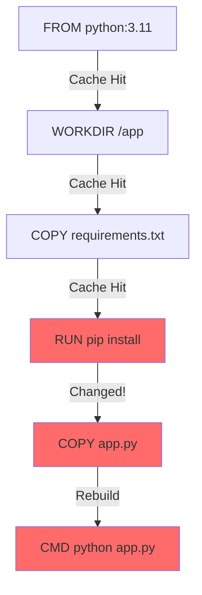

# Part 2: Dockerfile Best Practices & Multi-Stage Builds

## Table of Contents
1. [Dockerfile Basics](#dockerfile-basics)
2. [Dockerfile Instructions](#dockerfile-instructions)
3. [Layer Caching and Optimization](#layer-caching-and-optimization)
4. [Multi-Stage Builds](#multi-stage-builds)
5. [Build Arguments and Secrets](#build-arguments-and-secrets)
6. [Image Optimization Techniques](#image-optimization-techniques)
7. [Security Best Practices](#security-best-practices)

---

## Dockerfile Basics

### What is a Dockerfile?

A text file containing instructions to build a Docker image automatically.

**Simple Example:**
```dockerfile
# Use official Python runtime as base image
FROM python:3.11-slim

# Set working directory
WORKDIR /app

# Copy requirements file
COPY requirements.txt .

# Install dependencies
RUN pip install --no-cache-dir -r requirements.txt

# Copy application code
COPY . .

# Expose port
EXPOSE 8000

# Run application
CMD ["python", "app.py"]
```

**Build and run:**
```bash
# Build image
docker build -t myapp:1.0 .

# Run container
docker run -d -p 8000:8000 myapp:1.0
```

---

## Dockerfile Instructions

### FROM - Base Image

```dockerfile
# Official images (recommended)
FROM python:3.11-slim
FROM node:18-alpine
FROM nginx:1.25-alpine

# Specific version (for reproducibility)
FROM postgres:15.3-alpine

# Multi-stage build (covered later)
FROM node:18 AS builder
FROM nginx:alpine AS production
```

> [!IMPORTANT]
> Always use specific version tags, never `latest` in production!

### WORKDIR - Set Working Directory

```dockerfile
# Sets current directory for all subsequent instructions
WORKDIR /app

# Creates directory if it doesn't exist
# All COPY, ADD, RUN commands execute in this directory
```

### COPY vs ADD

**COPY (preferred for local files):**
```dockerfile
# Copy single file
COPY package.json /app/

# Copy directory
COPY src/ /app/src/

# Copy with renaming
COPY config.prod.json /app/config.json

# Copy multiple files
COPY package.json package-lock.json ./
```

**ADD (use only for URL fetch or tar extraction):**
```dockerfile
# Extract tar automatically
ADD archive.tar.gz /app/

# Download from URL (not recommended, use RUN with curl)
ADD https://example.com/file.txt /app/
```

> [!TIP]
> Prefer `COPY` over `ADD` unless you need URL downloading or auto-extraction.

### RUN - Execute Commands

```dockerfile
# Install packages
RUN apt-get update && apt-get install -y \
    git \
    curl \
    vim \
    && rm -rf /var/lib/apt/lists/*

# Chain commands to reduce layers
RUN pip install --no-cache-dir -r requirements.txt \
    && python -m compileall .

# Multiple RUN commands = multiple layers
RUN apt-get update           # Layer 1
RUN apt-get install -y curl  # Layer 2
RUN apt-get clean            # Layer 3 ❌ Creates 3 layers!

# Better: Single RUN = single layer
RUN apt-get update \
    && apt-get install -y curl \
    && apt-get clean         # ✅ Single layer!
```

### ENV - Environment Variables

```dockerfile
# Set environment variables
ENV NODE_ENV=production
ENV PORT=3000
ENV DATABASE_URL=postgresql://db:5432/myapp

# Multiple variables
ENV APP_HOME=/app \
    LOG_LEVEL=info \
    MAX_CONNECTIONS=100
```

### ARG - Build Arguments

```dockerfile
# Define build-time variable
ARG NODE_VERSION=18
FROM node:${NODE_VERSION}-alpine

ARG BUILD_DATE
ARG VERSION

# Use in RUN commands
RUN echo "Building version ${VERSION} on ${BUILD_DATE}"

# ARG vs ENV:
# ARG: Only available during build
# ENV: Available during build AND runtime
```

**Build with arguments:**
```bash
docker build \
  --build-arg VERSION=1.2.3 \
  --build-arg BUILD_DATE=$(date -u +'%Y-%m-%dT%H:%M:%SZ') \
  -t myapp:1.2.3 .
```

### EXPOSE - Document Ports

```dockerfile
# Document which ports the container listens on
EXPOSE 8000
EXPOSE 8080 8443

# This is DOCUMENTATION ONLY!
# Still need -p flag when running:
# docker run -p 8000:8000 myapp
```

### CMD vs ENTRYPOINT

**CMD - Default command (can be overridden):**
```dockerfile
# Exec form (preferred)
CMD ["python", "app.py"]

# Shell form
CMD python app.py

# Can override when running:
docker run myapp python other_script.py  # Overrides CMD
```

**ENTRYPOINT - Fixed command (harder to override):**
```dockerfile
# Container always runs this command
ENTRYPOINT ["python", "app.py"]

# Arguments can be added:
docker run myapp --debug  # Runs: python app.py --debug
```

**Combining ENTRYPOINT and CMD:**
```dockerfile
# ENTRYPOINT defines executable
ENTRYPOINT ["python"]

# CMD provides default arguments
CMD ["app.py"]

# Default: python app.py
# Override args: docker run myapp script.py → python script.py
```

### USER - Switch User

```dockerfile
# Create non-root user (security best practice)
RUN addgroup --system --gid 1001 appgroup \
    && adduser --system --uid 1001 --ingroup appgroup appuser

# Switch to non-root user
USER appuser

# All subsequent commands run as appuser
WORKDIR /home/appuser/app
```

> [!WARNING]
> Never run containers as root in production! Always create a dedicated user.

### VOLUME - Declare Mount Points

```dockerfile
# Declare volume mount points
VOLUME ["/data", "/logs"]

# Data in these directories persists outside container
```

### HEALTHCHECK - Container Health

```dockerfile
# Check if application is healthy
HEALTHCHECK --interval=30s --timeout=3s --retries=3 \
  CMD curl -f http://localhost:8000/health || exit 1

# Docker will mark container as unhealthy if check fails
```

---

## Layer Caching and Optimization

### How Layer Caching Works



**Key rule:** If a layer changes, all subsequent layers are invalidated!

### ❌ Bad Dockerfile (Inefficient Caching)

```dockerfile
FROM python:3.11-slim

# If ANY file changes, all layers rebuild!
COPY . /app
WORKDIR /app

RUN pip install -r requirements.txt  # Reinstalls every time!

CMD ["python", "app.py"]
```

**Problem:** Changing `app.py` invalidates `RUN pip install` layer!

### ✅ Good Dockerfile (Optimized Caching)

```dockerfile
FROM python:3.11-slim

WORKDIR /app

# Copy only requirements first (changes less frequently)
COPY requirements.txt .

# Install dependencies (cached unless requirements.txt changes)
RUN pip install --no-cache-dir -r requirements.txt

# Copy application code (changes more frequently)
COPY . .

CMD ["python", "app.py"]
```

**Benefit:** Changing `app.py` doesn't rebuild dependencies!

### Dockerfile Layering Strategy

```
1. FROM (base image)
2. Install system packages
3. Copy dependency files (package.json, requirements.txt)
4. Install dependencies (npm install, pip install)
5. Copy application code
6. Set metadata (USER, EXPOSE, CMD)
```

**Order by change frequency: LEAST frequent → MOST frequent**

---

## Multi-Stage Builds

### Problem: Large Image Sizes

**Single-stage build (inefficient):**
```dockerfile
FROM node:18

WORKDIR /app

# Development dependencies needed for build
COPY package*.json ./
RUN npm install  # Includes devDependencies!

COPY . .
RUN npm run build  # Build app

# Final image contains ALL dependencies + build tools!
CMD ["node", "dist/index.js"]

# IMAGE SIZE: 1.2GB! ❌
```

### Solution: Multi-Stage Build

```dockerfile
#
# Stage 1: Build
#
FROM node:18 AS builder

WORKDIR /app

COPY package*.json ./
RUN npm install  # All dependencies

COPY . .
RUN npm run build  # Create production bundle

#
# Stage 2: Production
#
FROM node:18-alpine AS production

WORKDIR /app

# Copy only production dependencies
COPY package*.json ./
RUN npm install --production  # Only prod dependencies

# Copy built artifacts from builder stage
COPY --from=builder /app/dist ./dist

USER node

CMD ["node", "dist/index.js"]

# IMAGE SIZE: 180MB! ✅ (85% reduction!)
```

**Benefits:**
- ✅ Smaller final image (no build tools, dev dependencies)
- ✅ Faster downloads and deployments
- ✅ More secure (less surface area)

### Real-World Example: Go Application

```dockerfile
#
# Stage 1: Build
#
FROM golang:1.21-alpine AS builder

WORKDIR /app

# Copy go mod files
COPY go.mod go.sum ./
RUN go mod download

# Copy source code
COPY . .

# Build binary (static compilation)
RUN CGO_ENABLED=0 GOOS=linux go build -a -installsuffix cgo -o main .

#
# Stage 2: Production
#
FROM alpine:latest

# Install ca-certificates for HTTPS
RUN apk --no-cache add ca-certificates

WORKDIR /root/

# Copy binary from builder
COPY --from=builder /app/main .

# Copy config files (if needed)
COPY --from=builder /app/config.yaml .

EXPOSE 8080

CMD ["./main"]

# IMAGE SIZE: 15MB! ✅ (from golang:1.2GB → alpine:15MB)
```

### Python Multi-Stage Build

```dockerfile
#
# Stage 1: Builder (compile dependencies)
#
FROM python:3.11-slim AS builder

WORKDIR /app

# Install build dependencies
RUN apt-get update && apt-get install -y --no-install-recommends \
    gcc \
    && rm -rf /var/lib/apt/lists/*

# Create virtual environment
RUN python -m venv /opt/venv
ENV PATH="/opt/venv/bin:$PATH"

# Install Python dependencies
COPY requirements.txt .
RUN pip install --no-cache-dir -r requirements.txt

#
# Stage 2: Production
#
FROM python:3.11-slim AS production

# Copy virtual environment from builder
COPY --from=builder /opt/venv /opt/venv

WORKDIR /app

# Activate virtual environment
ENV PATH="/opt/venv/bin:$PATH"

# Copy application code
COPY . .

# Create non-root user
RUN adduser --disabled-password --gecos '' appuser
USER appuser

EXPOSE 8000

CMD ["gunicorn", "--bind", "0.0.0.0:8000", "app:app"]
```

### React/Next.js Multi-Stage Build

```dockerfile
#
# Stage 1: Dependencies
#
FROM node:18-alpine AS deps

WORKDIR /app

COPY package.json package-lock.json ./
RUN npm ci --only=production

#
# Stage 2: Builder
#
FROM node:18-alpine AS builder

WORKDIR /app

COPY package.json package-lock.json ./
RUN npm ci

COPY . .
RUN npm run build

#
# Stage 3: Production
#
FROM node:18-alpine AS runner

WORKDIR /app

ENV NODE_ENV=production

# Copy package files
COPY package.json ./

# Copy dependencies from deps stage
COPY --from=deps /app/node_modules ./node_modules

# Copy built app from builder stage
COPY --from=builder /app/.next ./.next
COPY --from=builder /app/public ./public

# Create non-root user
RUN addgroup --system --gid 1001 nodejs \
    && adduser --system --uid 1001 nextjs

USER nextjs

EXPOSE 3000

CMD ["npm", "start"]
```

---

## Build Arguments and Secrets

### Build Arguments

**Use for configuration at build time:**

```dockerfile
ARG NODE_ENV=production
ARG API_URL
ARG BUILD_VERSION

FROM node:18-alpine

WORKDIR /app

# Use ARG in environment variable
ENV NODE_ENV=${NODE_ENV}
ENV REACT_APP_API_URL=${API_URL}
ENV BUILD_VERSION=${BUILD_VERSION}

COPY package*.json ./
RUN npm ci

COPY . .
RUN npm run build

CMD ["npm", "start"]
```

**Build command:**
```bash
docker build \
  --build-arg NODE_ENV=production \
  --build-arg API_URL=https://api.example.com \
  --build-arg BUILD_VERSION=1.2.3 \
  -t myapp:1.2.3 .
```

### Secrets (BuildKit)

> [!WARNING]
> Never put secrets in Dockerfile or build arguments! They're stored in image layers!

**❌ WRONG - Secret exposed in layer:**
```dockerfile
ARG DATABASE_PASSWORD=supersecret  # ❌ Visible in image!
RUN echo "DB_PASS=${DATABASE_PASSWORD}" > .env
```

**✅ RIGHT - Use BuildKit secrets:**

```dockerfile
# syntax=docker/dockerfile:1

FROM python:3.11-slim

WORKDIR /app

# Mount secret during build (not stored in image)
RUN --mount=type=secret,id=db_password \
    export DB_PASS=$(cat /run/secrets/db_password) \
    && python setup.py configure

COPY . .

CMD ["python", "app.py"]
```

**Build with secret:**
```bash
# Enable BuildKit
export DOCKER_BUILDKIT=1

# Build with secret file
docker build \
  --secret id=db_password,src=./secrets/db_password.txt \
  -t myapp .

# Secret is NOT stored in final image!
```

### SSH Keys in Builds

**For private Git repositories:**

```dockerfile
# syntax=docker/dockerfile:1

FROM node:18-alpine

WORKDIR /app

# Mount SSH key (not stored in image)
RUN --mount=type=ssh \
    apk add git openssh-client \
    && mkdir -p ~/.ssh \
    && ssh-keyscan github.com >> ~/.ssh/known_hosts \
    && git clone git@github.com:company/private-repo.git

COPY . .

CMD ["node", "app.js"]
```

**Build with SSH:**
```bash
docker build --ssh default -t myapp .
```

---

## Image Optimization Techniques

### 1. Use Alpine Base Images

```dockerfile
# ❌ Debian-based (900MB)
FROM python:3.11

# ✅ Alpine-based (50MB)
FROM python:3.11-alpine

# ✅ Distroless (even smaller, more secure)
FROM gcr.io/distroless/python3
```

**Comparison:**

| Base Image | Size | Use Case |
|------------|------|----------|
| `python:3.11` | 900MB | Development, debugging |
| `python:3.11-slim` | 120MB | Production (Debian-based) |
| `python:3.11-alpine` | 50MB | Production (minimal) |
| `distroless/python3` | 55MB | Production (ultra-secure) |

### 2. Minimize Layers

**❌ Many layers:**
```dockerfile
RUN apt-get update
RUN apt-get install -y curl
RUN apt-get install -y vim
RUN apt-get clean
# 4 layers!
```

**✅ Single layer:**
```dockerfile
RUN apt-get update \
    && apt-get install -y \
        curl \
        vim \
    && apt-get clean \
    && rm -rf /var/lib/apt/lists/*
# 1 layer!
```

### 3. Use .dockerignore

**Create `.dockerignore` file:**
```
# Ignore unnecessary files during COPY
.git
.gitignore
node_modules
npm-debug.log
.env
.env.local
README.md
docker-compose.yml
Dockerfile
.dockerignore
coverage/
.pytest_cache/
__pycache__/
*.pyc
dist/
build/
```

**Benefits:**
- Faster builds (fewer files to copy)
- Smaller context sent to Docker daemon
- No accidental inclusion of secrets

### 4. Clean Up in Same Layer

```dockerfile
# ❌ Cache remains in layer
RUN apt-get update
RUN apt-get install -y curl
RUN apt-get clean  # Doesn't reduce layer 1-2 size!

# ✅ Clean in same layer
RUN apt-get update \
    && apt-get install -y curl \
    && apt-get clean \
    && rm -rf /var/lib/apt/lists/*  # Reduces layer size!
```

### 5. Use Specific Package Versions

```dockerfile
# ❌ Unpredictable (version changes over time)
RUN apt-get install -y nginx

# ✅ Reproducible builds
RUN apt-get install -y nginx=1.18.0-0ubuntu1
```

### 6. Combine COPY Commands

```dockerfile
# ❌ Multiple layers
COPY package.json .
COPY package-lock.json .
COPY tsconfig.json .

# ✅ Single layer
COPY package*.json tsconfig.json ./
```

---

## Security Best Practices

### 1. Never Run as Root

```dockerfile
# ✅ Create and use non-root user
FROM node:18-alpine

WORKDIR /app

# Install dependencies as root
COPY package*.json ./
RUN npm ci --production

# Copy app
COPY . .

# Create non-root user
RUN addgroup -g 1001 -S nodejs \
    && adduser -S nodejs -u 1001

# Change ownership
RUN chown -R nodejs:nodejs /app

# Switch to non-root user
USER nodejs

EXPOSE 3000

CMD ["node", "server.js"]
```

### 2. Scan for Vulnerabilities

```bash
# Use Docker Scout (built-in)
docker scout cve myapp:latest

# Use Trivy
trivy image myapp:latest

# Use Snyk
snyk container test myapp:latest
```

### 3. Use Specific Base Image Digest

```dockerfile
# ❌ Tag can change
FROM node:18-alpine

# ✅ Digest is immutable
FROM node:18-alpine@sha256:18eb25c76d2c84fab68c6a7beffc63bd3ccaf96e06c871a5f3e0a7de63e27892
```

**Get digest:**
```bash
docker pull node:18-alpine
docker inspect node:18-alpine --format='{{.RepoDigests}}'
```

### 4. Sign Images

```bash
# Enable Docker Content Trust
export DOCKER_CONTENT_TRUST=1

# Push signed image
docker push myrepo/myapp:1.0

# Only signed images can be pulled
```

### 5. Minimal Base Images

```dockerfile
# ✅ Distroless (no shell, no package manager)
FROM gcr.io/distroless/nodejs18-debian11

WORKDIR /app

COPY --from=builder /app/dist ./dist
COPY --from=builder /app/node_modules ./node_modules

CMD ["dist/index.js"]

# No shell = harder for attackers to exploit
```

---

## Complete Production-Ready Dockerfile Example

```dockerfile
# syntax=docker/dockerfile:1

#
# Stage 1: Dependencies
#
FROM node:18-alpine@sha256:18eb25c76d2c84fab68c6a7beffc63bd3ccaf96e06c871a5f3e0a7de63e27892 AS deps

WORKDIR /app

# Copy package files
COPY package.json package-lock.json ./

# Install dependencies
RUN npm ci --only=production

#
# Stage 2: Builder
#
FROM node:18-alpine@sha256:18eb25c76d2c84fab68c6a7beffc63bd3ccaf96e06c871a5f3e0a7de63e27892 AS builder

WORKDIR /app

# Copy package files
COPY package.json package-lock.json ./

# Install all dependencies (including dev)
RUN npm ci

# Copy source code
COPY . .

# Build application
ARG NODE_ENV=production
ARG BUILD_VERSION
ENV NODE_ENV=${NODE_ENV}

RUN npm run build

#
# Stage 3: Production
#
FROM node:18-alpine@sha256:18eb25c76d2c84fab68c6a7beffc63bd3ccaf96e06c871a5f3e0a7de63e27892 AS production

WORKDIR /app

# Set environment
ENV NODE_ENV=production

# Copy package files
COPY package.json ./

# Copy production dependencies from deps stage
COPY --from=deps /app/node_modules ./node_modules

# Copy built application from builder stage
COPY --from=builder /app/dist ./dist

# Create non-root user
RUN addgroup -g 1001 -S nodejs \
    && adduser -S nodejs -u 1001 \
    && chown -R nodejs:nodejs /app

# Switch to non-root user
USER nodejs

# Expose port
EXPOSE 3000

# Health check
HEALTHCHECK --interval=30s --timeout=3s --start-period=5s --retries=3 \
    CMD node healthcheck.js

# Run application
CMD ["node", "dist/index.js"]
```

---

## Key Takeaways

> [!IMPORTANT]
> **Dockerfile Best Practices:**
> 1. Use **multi-stage builds** to reduce image size
> 2. **Order layers** from least to most frequently changing
> 3. Use **alpine or distroless** base images
> 4. **Never run as root** - create dedicated user
> 5. Combine commands in **single RUN** to reduce layers
> 6. Use **specific version tags** and digests
> 7. Clean up caches in **same layer** they're created
> 8. Use **.dockerignore** to exclude unnecessary files
> 9. Use **BuildKit secrets** for sensitive data
> 10. **Scan images** for vulnerabilities before deployment

---

## Next Steps

In **Part 3**, we'll cover:
- Docker Compose for multi-container applications
- Service definitions and networking
- Environment-specific configurations
- Development workflows
- Volume management in Compose

---

**Continue to:** [Part 3: Docker Compose & Local Development](file:///C:/Users/phusukale/Downloads/Docs/Repo/Docker_Guide/Part3-Docker-Compose.md)
