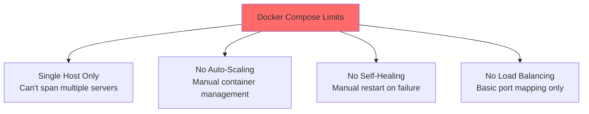
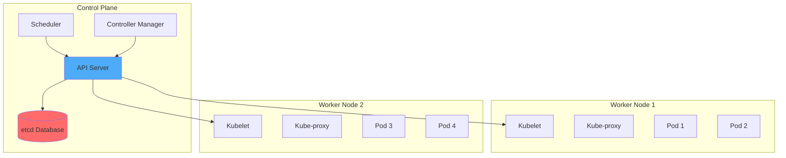
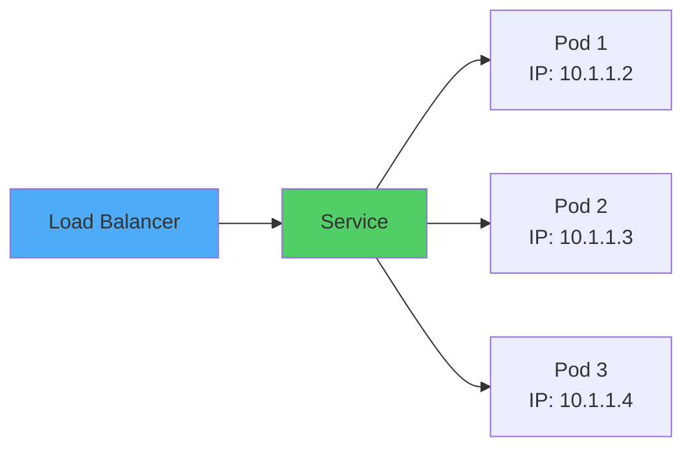
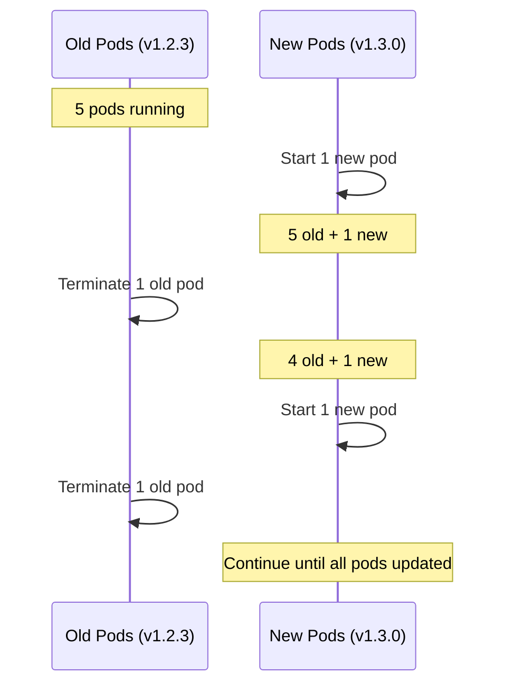

# Part 4: Container Orchestration with Kubernetes

## Table of Contents
1. [Why Kubernetes for Production Scale](#why-kubernetes-for-production-scale)
2. [Kubernetes Architecture](#kubernetes-architecture)
3. [Core Kubernetes Objects](#core-kubernetes-objects)
4. [Deploying Containers to Kubernetes](#deploying-containers-to-kubernetes)
5. [Services and Load Balancing](#services-and-load-balancing)
6. [Auto-Scaling](#auto-scaling)
7. [Rolling Updates and Rollbacks](#rolling-updates-and-rollbacks)

---

## Why Kubernetes for Production Scale

### Docker Compose Limitations



**Docker Compose is great for:**
- Development
- Small-scale applications
- Single-server deployments

**Kubernetes is needed for:**
- Multi-server clusters
- High availability
- Auto-scaling
- Self-healing
- Rolling updates
- Millions of users

### Kubernetes Benefits

| Feature | Benefit |
|---------|---------|
| **Multi-node clustering** | Distribute across 100s/1000s of servers |
| **Auto-scaling** | Scale pods based on CPU/memory/custom metrics |
| **Self-healing** | Automatically restart failed containers |
| **Load balancing** | Built-in service discovery and load balancing |
| **Rolling updates** | Zero-downtime deployments |
| **Secret management** | Secure storage for sensitive data |
| **Storage orchestration** | Automatically mount storage systems |

---

## Kubernetes Architecture



**Components:**
- **API Server**: Entry point for all operations
- **Scheduler**: Decides which node runs each pod
- **Controller Manager**: Maintains desired state
- **etcd**: Distributed key-value store
- **Kubelet**: Agent running on each node
- **Kube-proxy**: Network proxy on each node

---

## Core Kubernetes Objects

### Pods - Smallest Deployable Unit

```yaml
apiVersion: v1
kind: Pod
metadata:
  name: nginx-pod
  labels:
    app: nginx
spec:
  containers:
  - name: nginx
    image: nginx:1.25-alpine
    ports:
    - containerPort: 80
```

**Pod = 1+ containers that share:**
- Network namespace (same IP)
- Storage volumes
- Lifecycle

### Deployments - Manage Pod Replicas

```yaml
apiVersion: apps/v1
kind: Deployment
metadata:
  name: nginx-deployment
spec:
  replicas: 3  # Run 3 identical pods
  selector:
    matchLabels:
      app: nginx
  template:
    metadata:
      labels:
        app: nginx
    spec:
      containers:
      - name: nginx
        image: nginx:1.25-alpine
        ports:
        - containerPort: 80
        resources:
          requests:
            memory: "64Mi"
            cpu: "250m"
          limits:
            memory: "128Mi"
            cpu: "500m"
```

```bash
# Apply deployment
kubectl apply -f deployment.yaml

# View deployments
kubectl get deployments

# View pods
kubectl get pods
```

### Services - Networking and Load Balancing

```yaml
apiVersion: v1
kind: Service
metadata:
  name: nginx-service
spec:
  type: LoadBalancer  # Expose externally
  selector:
    app: nginx
  ports:
  - port: 80
    targetPort: 80
```

**Service Types:**
- **ClusterIP**: Internal only (default)
- **NodePort**: Expose on node IP:port
- **LoadBalancer**: Cloud load balancer
- **ExternalName**: DNS alias

### ConfigMaps - Configuration Data

```yaml
apiVersion: v1
kind: ConfigMap
metadata:
  name: app-config
data:
  DATABASE_HOST: "postgres.default.svc.cluster.local"
  DATABASE_PORT: "5432"
  LOG_LEVEL: "info"
```

**Use in Pod:**
```yaml
spec:
  containers:
  - name: app
    image: myapp:latest
    envFrom:
    - configMapRef:
        name: app-config
```

### Secrets - Sensitive Data

```yaml
apiVersion: v1
kind: Secret
metadata:
  name: db-secret
type: Opaque
stringData:
  username: admin
  password: supersecret123
```

**Use in Pod:**
```yaml
spec:
  containers:
  - name: app
    image: myapp:latest
    env:
    - name: DB_USERNAME
      valueFrom:
        secretKeyRef:
          name: db-secret
          key: username
    - name: DB_PASSWORD
      valueFrom:
        secretKeyRef:
          name: db-secret
          key: password
```

---

## Deploying Containers to Kubernetes

### Complete Application Example

**1. Database Deployment:**
```yaml
apiVersion: apps/v1
kind: Deployment
metadata:
  name: postgres
spec:
  replicas: 1
  selector:
    matchLabels:
      app: postgres
  template:
    metadata:
      labels:
        app: postgres
    spec:
      containers:
      - name: postgres
        image: postgres:15-alpine
        env:
        - name: POSTGRES_PASSWORD
          valueFrom:
            secretKeyRef:
              name: db-secret
              key: password
        - name: POSTGRES_DB
          value: myapp
        ports:
        - containerPort: 5432
        volumeMounts:
        - name: postgres-storage
          mountPath: /var/lib/postgresql/data
      volumes:
      - name: postgres-storage
        persistentVolumeClaim:
          claimName: postgres-pvc
---
apiVersion: v1
kind: Service
metadata:
  name: postgres
spec:
  selector:
    app: postgres
  ports:
  - port: 5432
    targetPort: 5432
```

**2. API Deployment:**
```yaml
apiVersion: apps/v1
kind: Deployment
metadata:
  name: api
spec:
  replicas: 3
  selector:
    matchLabels:
      app: api
  template:
    metadata:
      labels:
        app: api
    spec:
      containers:
      - name: api
        image: myregistry.azurecr.io/myapi:1.2.3
        ports:
        - containerPort: 3000
        env:
        - name: DATABASE_URL
          value: postgresql://postgres:5432/myapp
        - name: DB_PASSWORD
          valueFrom:
            secretKeyRef:
              name: db-secret
              key: password
        resources:
          requests:
            memory: "128Mi"
            cpu: "250m"
          limits:
            memory: "256Mi"
            cpu: "500m"
        livenessProbe:
          httpGet:
            path: /health
            port: 3000
          initialDelaySeconds: 30
          periodSeconds: 10
        readinessProbe:
          httpGet:
            path: /ready
            port: 3000
          initialDelaySeconds: 5
          periodSeconds: 5
---
apiVersion: v1
kind: Service
metadata:
  name: api
spec:
  type: LoadBalancer
  selector:
    app: api
  ports:
  - port: 80
    targetPort: 3000
```

**Deploy:**
```bash
# Create secret
kubectl create secret generic db-secret \
  --from-literal=password=supersecret123

# Apply deployments
kubectl apply -f postgres.yaml
kubectl apply -f api.yaml

# Check status
kubectl get pods
kubectl get services

# View logs
kubectl logs -f deployment/api

# Scale
kubectl scale deployment api --replicas=5
```

---

## Services and Load Balancing



**Service discovers pods automatically using labels!**

---

## Auto-Scaling

### Horizontal Pod Autoscaler (HPA)

```yaml
apiVersion: autoscaling/v2
kind: HorizontalPodAutoscaler
metadata:
  name: api-hpa
spec:
  scaleTargetRef:
    apiVersion: apps/v1
    kind: Deployment
    name: api
  minReplicas: 3
  maxReplicas: 10
  metrics:
  - type: Resource
    resource:
      name: cpu
      target:
        type: Utilization
        averageUtilization: 70  # Scale at 70% CPU
  - type: Resource
    resource:
      name: memory
      target:
        type: Utilization
        averageUtilization: 80  # Scale at 80% memory
```

**Behavior:**
- CPU > 70% → Add more pods (up to 10)
- CPU < 70% → Remove pods (down to 3)
- Automatic scaling every 15-30 seconds

---

## Rolling Updates and Rollbacks

### Rolling Update Strategy

```yaml
apiVersion: apps/v1
kind: Deployment
metadata:
  name: api
spec:
  replicas: 5
  strategy:
    type: RollingUpdate
    rollingUpdate:
      maxSurge: 1        # Add 1 extra pod during update
      maxUnavailable: 1  # Max 1 pod unavailable during update
  template:
    spec:
      containers:
      - name: api
        image: myapi:1.2.3
```

**Update process:**
```bash
# Update image
kubectl set image deployment/api api=myapi:1.3.0

# Watch rollout
kubectl rollout status deployment/api

# View history
kubectl rollout history deployment/api

# Rollback to previous version
kubectl rollout undo deployment/api

# Rollback to specific version
kubectl rollout undo deployment/api --to-revision=2
```



---

## Key Takeaways

> [!IMPORTANT]
> **Kubernetes Essentials:**
> 1. Use **Deployments** (not bare Pods) for applications
> 2. Define **resource limits** (CPU, memory)
> 3. Configure **health checks** (liveness, readiness)
> 4. Use **Services** for networking and load balancing
> 5. Store config in **ConfigMaps**, secrets in **Secrets**
> 6. Enable **HPA** for automatic scaling
> 7. Use **Rolling Updates** for zero-downtime deployments
> 8. Always specify **image versions** (never `latest`)

---

**Continue to:** [Part 5: Production Deployment & Scaling](file:///C:/Users/phusukale/Downloads/Docs/Repo/Docker_Guide/Part5-Production-Deployment.md)
