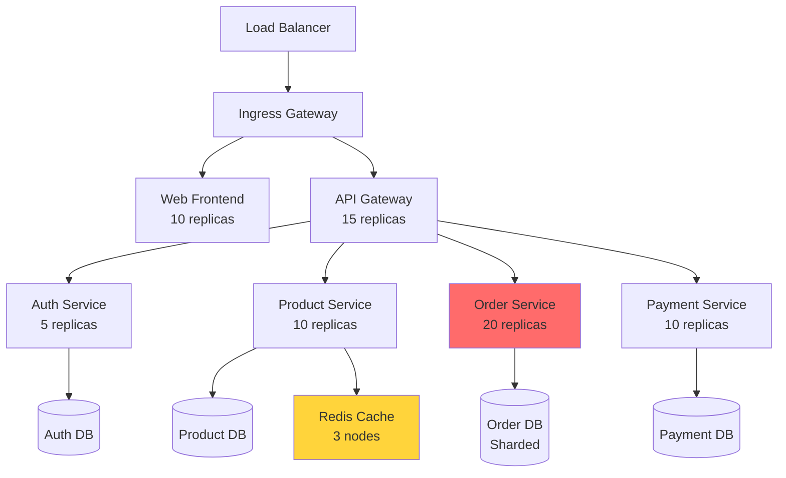

# Part 7: Real-World Case Studies at Scale

## Table of Contents
1. [Case Study 1: E-commerce Platform (Shopify Scale)](#case-study-1-e-commerce-platform)
2. [Case Study 2: Microservices Architecture (Uber Scale)](#case-study-2-microservices-architecture)
3. [Case Study 3: Video Streaming (Netflix Scale)](#case-study-3-video-streaming)

---

## Case Study 1: E-commerce Platform

**Scale:** 10M users, 100K orders/day, Black Friday peaks at 50K orders/min

### Architecture



###complete Kubernetes Deployment

```yaml
# Product Service Deployment
apiVersion: apps/v1
kind: Deployment
metadata:
  name: product-service
spec:
  replicas: 10
  strategy:
    rollingUpdate:
      maxSurge: 3
      maxUnavailable: 1
  selector:
    matchLabels:
      app: product-service
  template:
    metadata:
      labels:
        app: product-service
    spec:
      containers:
      - name: product-service
        image: myregistry.io/product-service:v2.1.5
        ports:
        - containerPort: 3000
        env:
        - name: DATABASE_URL
          valueFrom:
            secretKeyRef:
              name: product-db-secret
              key: url
        - name: REDIS_URL
          value: redis://redis-cluster:6379
        resources:
          requests:
            memory: "512Mi"
            cpu: "500m"
          limits:
            memory: "1Gi"
            cpu: "1000m"
        livenessProbe:
          httpGet:
            path: /health
            port: 3000
          initialDelaySeconds: 30
          periodSeconds: 10
        readinessProbe:
          httpGet:
            path: /ready
            port: 3000
          initialDelaySeconds: 5
          periodSeconds: 5
      affinity:
        podAntiAffinity:
          preferredDuringSchedulingIgnoredDuringExecution:
          - weight: 100
            podAffinityTerm:
              labelSelector:
                matchExpressions:
                - key: app
                  operator: In
                  values:
                  - product-service
              topologyKey: kubernetes.io/hostname
---
# Horizontal Pod Autoscaler
apiVersion: autoscaling/v2
kind: HorizontalPodAutoscaler
metadata:
  name: product-service-hpa
spec:
  scaleTargetRef:
    apiVersion: apps/v1
    kind: Deployment
    name: product-service
  minReplicas: 10
  maxReplicas: 50
  metrics:
  - type: Resource
    resource:
      name: cpu
      target:
        type: Utilization
        averageUtilization: 70
  behavior:
    scaleUp:
      stabilizationWindowSeconds: 60
      policies:
      - type: Pods
        value: 5
        periodSeconds: 60
    scaleDown:
      stabilizationWindowSeconds: 300
      policies:
      - type: Pods
        value: 2
        periodSeconds: 60
```

### Key Design Decisions

| Challenge | Solution |
|-----------|----------|
| Black Friday traffic spikes | HPA with aggressive scale-up (10→50 pods in 2 min) |
| Product catalog caching | Redis cluster with 3 nodes, 95% cache hit rate |
| Order database hotspots | Shard by customer_id, 16 shards |
| Payment reliability | Dedicated service, no shared DB, idempotent operations |
| Image delivery | CDN (CloudFront), container serves URLs only |

---

## Case Study 2: Microservices Architecture (Uber Scale)

**Scale:** 100M users, 15M trips/day, 2000+ microservices

### Service Mesh with Istio

```yaml
apiVersion: networking.istio.io/v1alpha3
kind: VirtualService
metadata:
  name: ride-service
spec:
  hosts:
  - ride-service
  http:
  - match:
    - headers:
        x-version:
          exact: "v2"
    route:
    - destination:
        host: ride-service
        subset: v2
  - route:
    - destination:
        host: ride-service
        subset: v1
      weight: 90
    - destination:
        host: ride-service
        subset: v2
      weight: 10  # Canary deployment: 10% to v2
```

### Circuit Breaker Pattern

```yaml
apiVersion: networking.istio.io/v1alpha3
kind: DestinationRule
metadata:
  name: payment-service
spec:
  host: payment-service
  trafficPolicy:
    connectionPool:
      tcp:
        maxConnections: 100
      http:
        http1MaxPendingRequests: 50
        maxRequestsPerConnection: 2
    outlierDetection:
      consecutiveErrors: 5
      interval: 30s
      baseEjectionTime: 30s
      maxEjectionPercent: 50
```

### Distributed Tracing

```javascript
// OpenTelemetry instrumentation
const { NodeTracerProvider } = require('@opentelemetry/node');
const { getNodeAutoInstrumentations } = require('@opentelemetry/auto-instrumentations-node');

const provider = new NodeTracerProvider();
provider.addSpanProcessor(/* Jaeger exporter */);
provider.register();

registerInstrumentations({
  instrumentations: [getNodeAutoInstrumentations()],
});

// Traces flow through all microservices!
```

---

## Case Study 3: Video Streaming (Netflix Scale)

**Scale:** 200M subscribers, 1B hours watched/month

### Container Strategy

```yaml
# Encoder Service (CPU-intensive)
apiVersion: apps/v1
kind: Deployment
metadata:
  name: video-encoder
spec:
  replicas: 100
  template:
    spec:
      containers:
      - name: encoder
        image: video-encoder:latest
        resources:
          requests:
            cpu: "8000m"      # 8 CPU cores
            memory: "16Gi"
          limits:
            cpu: "16000m"     # Up to 16 cores
            memory: "32Gi"
      nodeSelector:
        workload-type: cpu-intensive
```

### Deployment Strategy

```
1. Blue-Green Deployment
   - Deploy new version (green)
   - Route 0% traffic
   - Run smoke tests
   - Gradually shift traffic (0% → 10% → 50% → 100%)
   - Keep blue for 24h rollback window

2. Regional Rollout
   - Deploy to staging cluster
   - Deploy to 1 production region (us-east-1)
   - Monitor for 6 hours
   - Deploy to remaining regions
```

---

## Lessons Learned

> [!IMPORTANT]
> **Production at Scale:**
> 1. **Auto-scaling is critical** - Traffic patterns are unpredictable
> 2. **Observability first** - Metrics, logs, traces before problems arise
> 3. **Gradual rollouts** - Canary/blue-green deployments prevent disasters
> 4. **Circuit breakers** - Prevent cascading failures
> 5. **Resource limits mandatory** - One bad service shouldn't kill the cluster
> 6. **Multi-region** - Latency and disaster recovery
> 7. **Chaos engineering** - Test failure scenarios regularly
> 8. **Immutable infrastructure** - Never SSH and fix, redeploy instead

---

## Complete Production Stack

```yaml
# Example: All services for a production app
apiVersion: v1
kind: Namespace
metadata:
  name: production
---
# Database (StatefulSet for persistence)
apiVersion: apps/v1
kind: StatefulSet
metadata:
  name: postgres
  namespace: production
spec:
  serviceName: postgres
  replicas: 3
  selector:
    matchLabels:
      app: postgres
  template:
    spec:
      containers:
      - name: postgres
        image: postgres:15-alpine
        volumeMounts:
        - name: data
          mountPath: /var/lib/postgresql/data
  volumeClaimTemplates:
  - metadata:
      name: data
    spec:
      accessModes: ["ReadWriteOnce"]
      resources:
        requests:
          storage: 100Gi
---
# API (Deployment for stateless services)
# Redis (StatefulSet)
# Message Queue (Kafka)
# Monitoring (Prometheus)
# Logging (Elasticsearch + Fluentd)
# ... etc
```

---

## Final Checklist: Docker Production Deployment

```
✅ Multi-stage Dockerfiles for < 200MB images
✅ Non-root user in all containers
✅ Health checks (liveness + readiness)
✅ Resource limits on ALL containers
✅ Horizontal autoscaling (HPA)
✅ 3+ replicas for critical services
✅ Pod disruption budgets
✅ Network policies
✅ Secrets in Kubernetes Secrets (not ENV)
✅ Monitoring (Prometheus + Grafana)
✅ Centralized logging (ELK/Loki)
✅ Distributed tracing (Jaeger/Zipkin)
✅ CI/CD pipeline with automated tests
✅ Image vulnerability scanning
✅ Signed images (Docker Content Trust)
✅ Rolling updates configured
✅ Tested rollback procedures
✅ Multi-region deployment
✅ Disaster recovery plan
✅ Regular chaos engineering tests
```

---

## Conclusion

Docker enables applications to scale from thousands to millions of users through:

1. **Consistency**: Same environment dev → prod
2. **Isolation**: Microservices without interference
3. **Scalability**: Kubernetes auto-scaling
4. **Efficiency**: Lightweight, fast startup
5. **Reliability**: Self-healing, rolling updates

**Start simple, measure, scale based on real needs!**

---

**End of Docker Production Guide** 🚀
