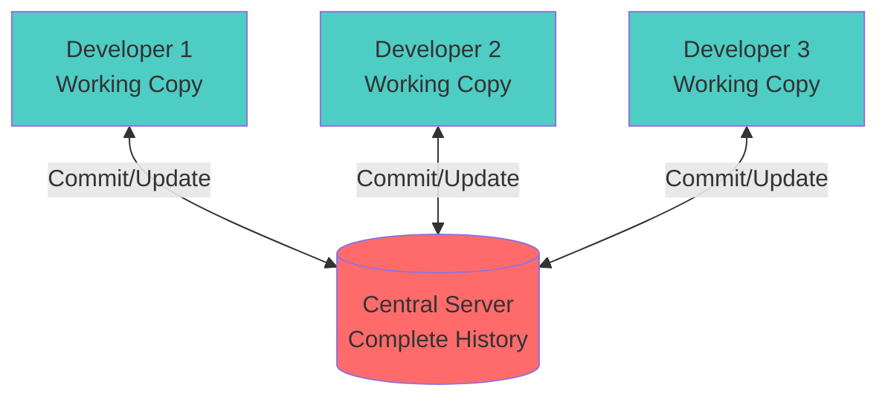
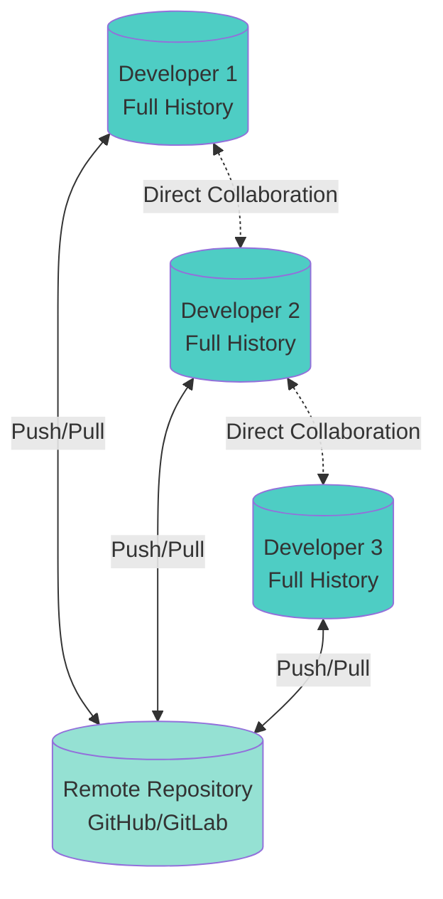
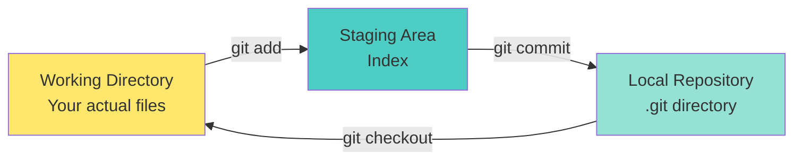
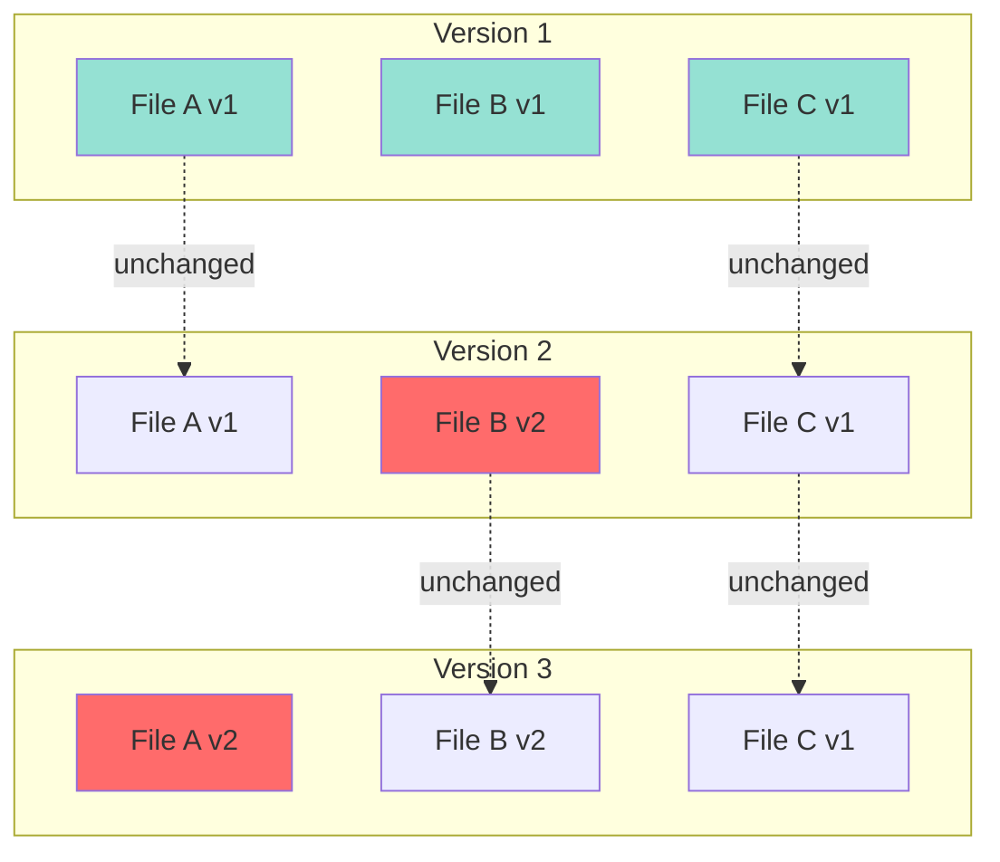
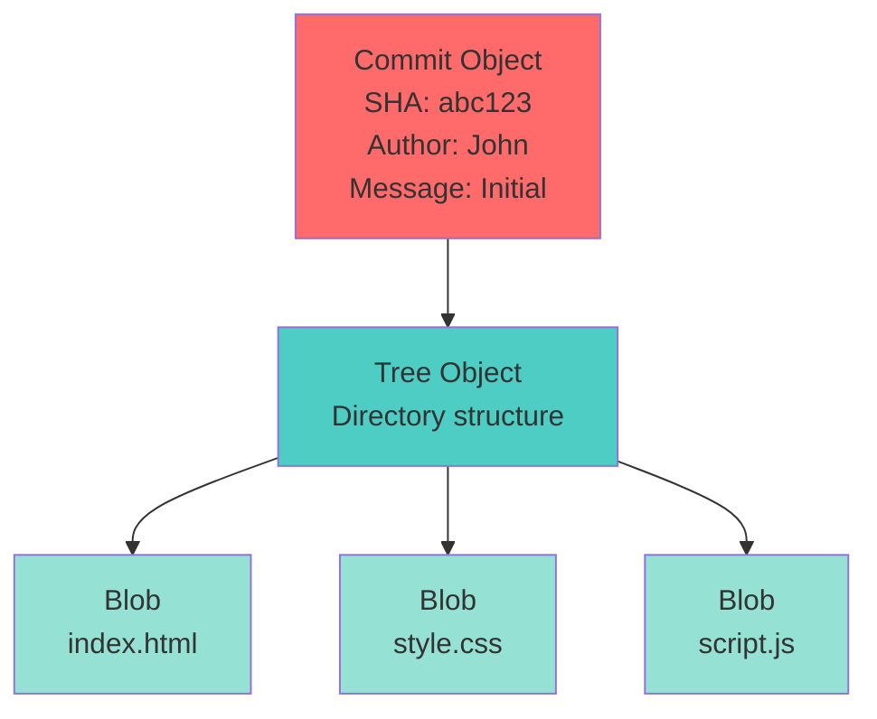
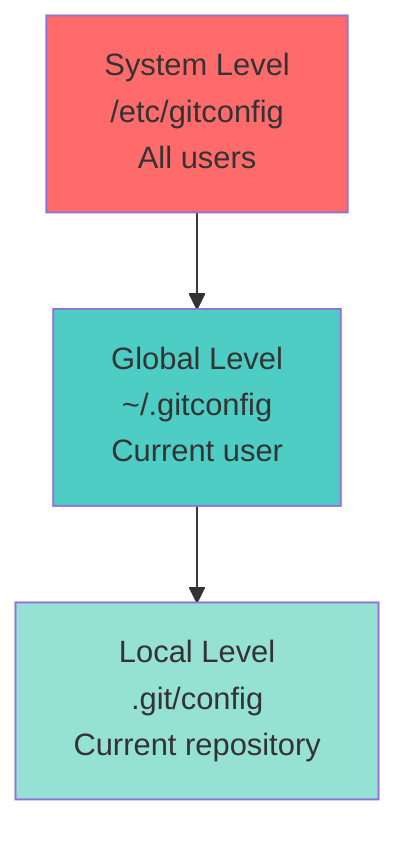
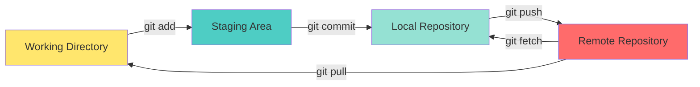
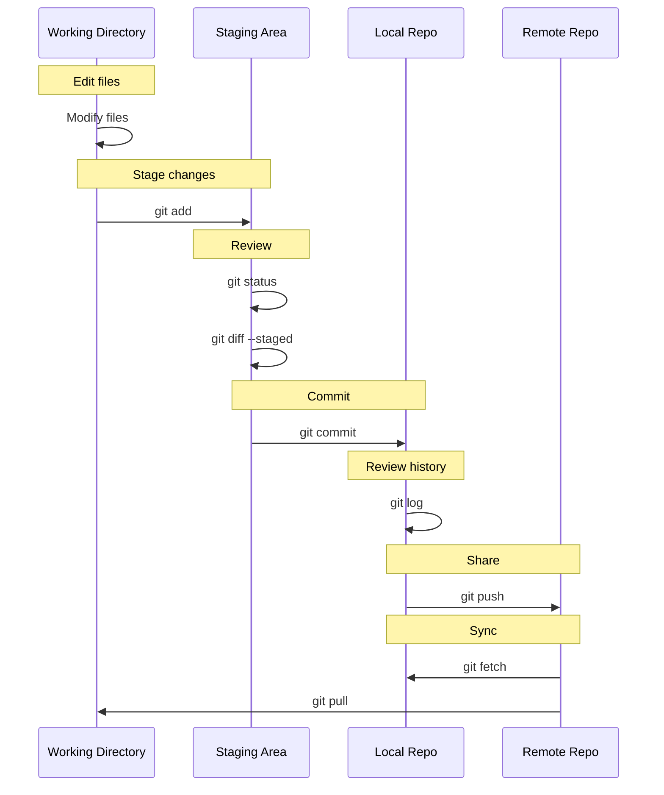

# Part 1: Git Fundamentals

## Table of Contents
- [What is Version Control?](#what-is-version-control)
- [Why Version Control Matters](#why-version-control-matters)
- [Centralized vs Distributed Version Control](#centralized-vs-distributed-version-control)
- [Git Architecture & Internal Workings](#git-architecture--internal-workings)
- [Git Installation & Configuration](#git-installation--configuration)
- [Basic Git Commands](#basic-git-commands)
- [Understanding the Git Workflow](#understanding-the-git-workflow)

---

## What is Version Control?

**Version Control** (also known as Source Control) is a system that records changes to files over time so that you can recall specific versions later. It allows you to:

- Track every modification to your code
- Revert files or entire projects to a previous state
- Compare changes over time
- See who last modified something that might be causing a problem
- Collaborate with multiple developers simultaneously

### Real-World Analogy

Think of version control like a **time machine for your code**. Imagine writing a book:
- Without version control: You keep overwriting `book.docx` and lose all previous versions
- With version control: You can see every draft, compare changes between drafts, and collaborate with co-authors without overwriting each other's work

---

## Why Version Control Matters

### 1. **Collaboration**
Multiple developers can work on the same codebase simultaneously without conflicts or overwriting each other's work.

### 2. **History & Audit Trail**
Every change is tracked with:
- **Who** made the change
- **When** it was made
- **Why** it was made (commit message)
- **What** was changed

### 3. **Backup & Recovery**
Your code is safely stored. If you make a mistake, you can revert to a previous working state.

### 4. **Experimentation**
Create branches to try new features without affecting the stable codebase. If the experiment fails, simply delete the branch.

### 5. **Code Review**
Review changes before they're integrated into the main codebase, ensuring code quality.

### 6. **Deployment & Release Management**
Tag specific versions for releases, making it easy to deploy or rollback.

---

## Centralized vs Distributed Version Control

### Centralized Version Control (CVCS)

In centralized systems like **Subversion (SVN)** or **Perforce**, there is a **single central server** that contains all versioned files.



**Pros:**
- Simple concept: single source of truth
- Fine-grained access control
- Easier to understand for beginners

**Cons:**
- Single point of failure
- No offline commits
- Network required for most operations
- Can be slower for large teams

### Distributed Version Control (DVCS)

In distributed systems like **Git** or **Mercurial**, every developer has a **complete copy** of the repository history.



**Pros:**
- Full history locally available
- Work offline
- Fast operations
- Multiple backups (every clone is a backup)
- Flexible workflows
- Peer-to-peer collaboration possible

**Cons:**
- Steeper learning curve
- Larger local storage requirements
- More complex concepts

---

## Git Architecture & Internal Workings

### The Three States

Git has three main states that your files can reside in:

1. **Modified**: You've changed the file but haven't committed it yet
2. **Staged**: You've marked a modified file to go into your next commit
3. **Committed**: The data is safely stored in your local database

### The Three Trees



#### 1. **Working Directory**
The files you see in your project folder. This is where you make changes.

#### 2. **Staging Area (Index)**
A temporary holding area where you prepare changes for a commit. This gives you control over what gets committed.

#### 3. **Repository (.git directory)**
Where Git stores metadata and the object database for your project. This is what's copied when you clone a repository.

### How Git Stores Data

Unlike other VCS that store changes as file-based changes (delta-based), Git stores data as **snapshots**.



**Key Points:**
- Each commit is a snapshot of all files
- Unchanged files reference the previous version (efficient)
- Everything is checksummed with SHA-1 hash
- Nearly impossible to lose data

### Git Objects

Git internally stores four types of objects:

1. **Blob**: Stores file contents
2. **Tree**: Stores directory structure
3. **Commit**: Points to a tree and contains metadata
4. **Tag**: Points to a commit with additional metadata



---

## Git Installation & Configuration

### Installation

#### Windows
```bash
# Download from git-scm.com or use Chocolatey
choco install git

# Or use winget
winget install Git.Git
```

#### macOS
```bash
# Using Homebrew
brew install git

# Or download from git-scm.com
```

#### Linux (Ubuntu/Debian)
```bash
sudo apt update
sudo apt install git
```

#### Verify Installation
```bash
git --version
# Output: git version 2.40.0
```

### Initial Configuration

Git comes with a tool called `git config` that lets you set configuration variables.

#### Set Your Identity
```bash
# Set username (will appear in commits)
git config --global user.name "John Doe"

# Set email (will appear in commits)
git config --global user.email "john.doe@example.com"
```

#### Set Default Editor
```bash
# Use VS Code as default editor
git config --global core.editor "code --wait"

# Or Vim
git config --global core.editor "vim"

# Or Nano
git config --global core.editor "nano"
```

#### Set Default Branch Name
```bash
# Modern convention is to use 'main' instead of 'master'
git config --global init.defaultBranch main
```

#### View All Configuration
```bash
# List all settings
git config --list

# Check specific setting
git config user.name
```

#### Configuration Levels

Git has three levels of configuration:



```bash
# System level (all users)
git config --system <key> <value>

# Global level (current user)
git config --global <key> <value>

# Local level (current repository)
git config --local <key> <value>
```

### Setting Up SSH Keys

SSH keys provide a secure way to authenticate with Git servers without typing passwords.

#### Generate SSH Key
```bash
# Generate new SSH key
ssh-keygen -t ed25519 -C "your.email@example.com"

# Or use RSA if ed25519 is not supported
ssh-keygen -t rsa -b 4096 -C "your.email@example.com"

# Press Enter to accept default location (~/.ssh/id_ed25519)
# Enter passphrase (optional but recommended)
```

#### Add SSH Key to SSH Agent
```bash
# Start SSH agent
eval "$(ssh-agent -s)"

# Add your key
ssh-add ~/.ssh/id_ed25519
```

#### Add Public Key to GitLab/GitHub
```bash
# Copy public key to clipboard
# macOS
pbcopy < ~/.ssh/id_ed25519.pub

# Linux (with xclip)
xclip -sel clip < ~/.ssh/id_ed25519.pub

# Windows (Git Bash)
cat ~/.ssh/id_ed25519.pub | clip

# Then paste into GitLab/GitHub SSH keys settings
```

#### Test Connection
```bash
# Test GitHub
ssh -T git@github.com

# Test GitLab
ssh -T git@gitlab.com
```

---

## Basic Git Commands

Let's explore the fundamental Git commands with practical examples.

### 1. `git init` - Initialize a Repository

Creates a new Git repository in the current directory.

```bash
# Create a new directory and initialize Git
mkdir my-project
cd my-project
git init

# Output: Initialized empty Git repository in /path/to/my-project/.git/
```

This creates a hidden `.git` folder that contains all Git metadata.

### 2. `git clone` - Clone a Repository

Creates a copy of an existing repository.

```bash
# Clone via HTTPS
git clone https://github.com/username/repository.git

# Clone via SSH
git clone git@github.com:username/repository.git

# Clone into specific directory
git clone https://github.com/username/repository.git my-folder

# Clone specific branch
git clone -b develop https://github.com/username/repository.git

# Shallow clone (only recent history)
git clone --depth 1 https://github.com/username/repository.git
```

### 3. `git status` - Check Repository Status

Shows the state of your working directory and staging area.

```bash
git status

# Short format
git status -s
```

**Example Output:**
```
On branch main
Your branch is up to date with 'origin/main'.

Changes to be committed:
  (use "git restore --staged <file>..." to unstage)
        modified:   README.md

Changes not staged for commit:
  (use "git add <file>..." to update what will be committed)
  (use "git restore <file>..." to discard changes in working directory)
        modified:   src/index.js

Untracked files:
  (use "git add <file>..." to include in what will be committed)
        newfile.txt
```

### 4. `git add` - Stage Changes

Adds files to the staging area.

```bash
# Add specific file
git add filename.txt

# Add all files in current directory
git add .

# Add all files in repository
git add -A

# Add all modified files (not untracked)
git add -u

# Add files interactively
git add -p

# Add all .js files
git add *.js

# Add all files in a directory
git add src/
```

### 5. `git commit` - Save Changes

Records staged changes to the repository.

```bash
# Commit with inline message
git commit -m "Add user authentication feature"

# Commit with detailed message in editor
git commit

# Commit all modified tracked files (skip staging)
git commit -am "Quick fix for bug #123"

# Amend last commit (change message or add files)
git commit --amend

# Amend without changing message
git commit --amend --no-edit
```

**Commit Message Best Practices:**
```bash
# Good commit message structure
git commit -m "feat: add login functionality

- Implement JWT authentication
- Add password hashing with bcrypt
- Create login endpoint
- Add input validation

Closes #42"
```

### 6. `git log` - View Commit History

Shows commit history.

```bash
# Basic log
git log

# One line per commit
git log --oneline

# Show graph
git log --graph --oneline --all

# Show last N commits
git log -n 5

# Show commits by author
git log --author="John Doe"

# Show commits in date range
git log --since="2 weeks ago" --until="yesterday"

# Show commits that modified a specific file
git log -- filename.txt

# Pretty format
git log --pretty=format:"%h - %an, %ar : %s"

# Show stats
git log --stat
```

### 7. `git diff` - Show Changes

Shows differences between commits, working directory, and staging area.

```bash
# Show unstaged changes
git diff

# Show staged changes
git diff --staged
# or
git diff --cached

# Show changes in specific file
git diff filename.txt

# Compare two commits
git diff commit1 commit2

# Compare branches
git diff main feature-branch

# Show word-level diff
git diff --word-diff

# Show summary of changes
git diff --stat
```

### 8. `git restore` - Restore Files

Restores working tree files (replaces git checkout for file operations).

```bash
# Discard changes in working directory
git restore filename.txt

# Unstage file (keep changes in working directory)
git restore --staged filename.txt

# Restore from specific commit
git restore --source=HEAD~2 filename.txt

# Restore all files
git restore .
```

### 9. `git rm` - Remove Files

Removes files from working directory and staging area.

```bash
# Remove file and stage the removal
git rm filename.txt

# Remove from Git but keep in working directory
git rm --cached filename.txt

# Remove directory
git rm -r directory/

# Force removal (if file has uncommitted changes)
git rm -f filename.txt
```

### 10. `git mv` - Move/Rename Files

Moves or renames files.

```bash
# Rename file
git mv oldname.txt newname.txt

# Move file
git mv file.txt directory/

# This is equivalent to:
# mv oldname.txt newname.txt
# git rm oldname.txt
# git add newname.txt
```

---

## Understanding the Git Workflow

### Basic Workflow Diagram



### Practical Workflow Example

Let's walk through a complete workflow:

#### Step 1: Initialize or Clone
```bash
# Option A: Start a new project
mkdir my-app
cd my-app
git init

# Option B: Clone existing project
git clone git@github.com:user/my-app.git
cd my-app
```

#### Step 2: Create/Modify Files
```bash
# Create a new file
echo "# My App" > README.md
echo "console.log('Hello World');" > app.js
```

#### Step 3: Check Status
```bash
git status
# Output shows untracked files
```

#### Step 4: Stage Changes
```bash
# Stage specific files
git add README.md app.js

# Or stage all
git add .
```

#### Step 5: Review Staged Changes
```bash
git status
git diff --staged
```

#### Step 6: Commit
```bash
git commit -m "Initial commit: add README and basic app"
```

#### Step 7: Connect to Remote (if not cloned)
```bash
git remote add origin git@github.com:user/my-app.git
```

#### Step 8: Push to Remote
```bash
git push -u origin main
```

### Complete Workflow Visualization



### Real-World Scenario: First Day on a Project

```bash
# Day 1: Join the team

# 1. Clone the repository
git clone git@gitlab.com:company/awesome-project.git
cd awesome-project

# 2. Check current status
git status
git log --oneline -10  # See recent commits

# 3. Create a new branch for your work (we'll cover branches in Part 2)
git checkout -b feature/user-profile

# 4. Make changes
# Edit files in your editor...

# 5. See what changed
git status
git diff

# 6. Stage your changes
git add src/components/UserProfile.js
git add src/styles/profile.css

# 7. Review staged changes
git diff --staged

# 8. Commit with meaningful message
git commit -m "feat: add user profile component

- Create UserProfile component
- Add profile styling
- Implement avatar upload

Relates to #USER-123"

# 9. Push to remote
git push -u origin feature/user-profile

# 10. Create merge request (in GitLab UI)
# Your code is now ready for review!
```

---

## Common .gitignore Patterns

The `.gitignore` file tells Git which files to ignore.

```bash
# Create .gitignore
cat > .gitignore << 'EOF'
# Dependencies
node_modules/
vendor/
*.lock

# Build outputs
dist/
build/
*.exe
*.dll
*.so
*.dylib

# IDE and Editor files
.vscode/
.idea/
*.swp
*.swo
*~
.DS_Store

# Environment variables
.env
.env.local
.env.*.local

# Logs
logs/
*.log
npm-debug.log*

# Testing
coverage/
.nyc_output/

# OS files
Thumbs.db
.DS_Store

# Temporary files
*.tmp
*.temp
.cache/
EOF
```

---

## Quick Reference: Basic Commands

| Command | Description |
|---------|-------------|
| `git init` | Initialize a new repository |
| `git clone <url>` | Clone a repository |
| `git status` | Check status of working directory |
| `git add <file>` | Stage changes |
| `git commit -m "msg"` | Commit staged changes |
| `git log` | View commit history |
| `git diff` | Show unstaged changes |
| `git diff --staged` | Show staged changes |
| `git restore <file>` | Discard changes in working directory |
| `git restore --staged <file>` | Unstage changes |
| `git rm <file>` | Remove file and stage removal |
| `git mv <old> <new>` | Move/rename file |

---

## Key Takeaways

1. **Git is distributed** - Every developer has the complete history locally
2. **Three states** - Modified, staged, committed
3. **Snapshots, not deltas** - Git stores complete snapshots, not just changes
4. **Everything is local** - Most operations are fast and work offline
5. **Integrity** - Everything is checksummed with SHA-1
6. **Staging area** - Gives you control over what gets committed
7. **Configuration matters** - Set up your identity and preferences properly
8. **SSH keys** - Secure, passwordless authentication

---

## What's Next?

In [Part 2: Git Core Concepts](./Part2-Git-Core-Concepts.md), we'll dive deeper into:
- Commits and commit history
- Branches and branching strategies
- Merging and rebasing
- Handling merge conflicts
- Tags and releases

This foundation will prepare you for more advanced Git workflows and collaboration patterns.

---

**Practice Exercise:**

Try this on your own:
1. Create a new repository
2. Add several files
3. Make multiple commits
4. Use `git log` to view history
5. Use `git diff` to see changes
6. Create a `.gitignore` file
7. Amend a commit

Understanding these fundamentals is crucial before moving to more advanced topics!
