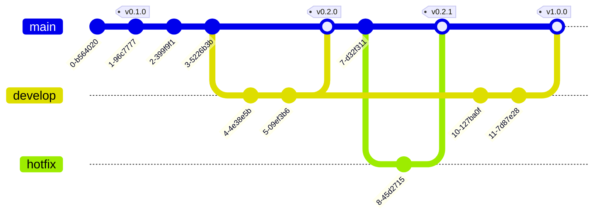

# Part 2: Git Core Concepts

## Table of Contents
- [Understanding Commits](#understanding-commits)
- [Working with Branches](#working-with-branches)
- [Tags and Versioning](#tags-and-versioning)
- [Merging Strategies](#merging-strategies)
- [Rebasing](#rebasing)
- [Merge vs Rebase](#merge-vs-rebase)
- [Handling Merge Conflicts](#handling-merge-conflicts)
- [Advanced Commit Operations](#advanced-commit-operations)

---

## Understanding Commits

### What is a Commit?

A **commit** is a snapshot of your project at a specific point in time. Each commit contains:
- A unique SHA-1 hash identifier (40 characters)
- Author information (name and email)
- Timestamp
- Commit message
- Pointer to the tree object (directory structure)
- Pointer(s) to parent commit(s)
- Changes to the files

### Anatomy of a Commit


### Creating Commits

```bash
# Simple commit
git commit -m "Add user authentication"

# Multi-line commit message
git commit -m "Add user authentication

- Implement JWT tokens
- Add login endpoint
- Create password hashing utility
- Add input validation

Closes #42"

# Commit with editor for detailed message
git commit

# Commit all tracked files (skip staging)
git commit -a -m "Quick fix"

# Sign commit with GPG
git commit -S -m "Secure commit"
```

### Viewing Commit History

```bash
# Basic log
git log

# One-line format
git log --oneline

# Graph view with all branches
git log --graph --oneline --all --decorate

# Show changes in each commit
git log -p

# Show statistics
git log --stat

# Custom format
git log --pretty=format:"%h %an %ar - %s"

# Show commits affecting specific file
git log -- path/to/file.js

# Show commits by author
git log --author="John Doe"

# Show commits in date range
git log --since="2024-01-01" --until="2024-01-31"

# Show merge commits only
git log --merges

# Show non-merge commits only
git log --no-merges
```

### Commit Best Practices

#### 1. Write Meaningful Messages

```bash
# ❌ Bad
git commit -m "fix"
git commit -m "updates"
git commit -m "changes"

# ✅ Good
git commit -m "fix: resolve null pointer in user service"
git commit -m "feat: add email verification for new users"
git commit -m "docs: update API documentation for auth endpoints"
```

#### 2. Conventional Commits Format

```
<type>(<scope>): <subject>

<body>

<footer>
```

**Types:**
- `feat`: New feature
- `fix`: Bug fix
- `docs`: Documentation changes
- `style`: Code formatting (no logic change)
- `refactor`: Code restructuring (no behavior change)
- `test`: Adding or updating tests
- `chore`: Maintenance tasks
- `perf`: Performance improvements

**Example:**
```bash
git commit -m "feat(auth): implement OAuth2 login

Add support for Google and GitHub OAuth2 providers.
Users can now log in using their social accounts.

Benefits:
- Faster user onboarding
- Reduced password management burden
- Improved security

Breaking change: Removed basic auth endpoint /api/auth/basic

Closes #123
Relates to #45, #67"
```

### Commit History Visualization


---

## Working with Branches

### What is a Branch?

A **branch** is a lightweight movable pointer to a commit. It allows you to diverge from the main line of development and work independently without affecting other work.

### Branch Visualization


### Branch Commands

#### Creating Branches

```bash
# Create a new branch
git branch feature-login

# Create and switch to branch
git checkout -b feature-login

# Modern way (Git 2.23+)
git switch -c feature-login

# Create branch from specific commit
git branch bugfix-payment abc1234

# Create branch from remote branch
git branch feature-api origin/feature-api
```

#### Switching Branches

```bash
# Switch to existing branch
git checkout feature-login

# Modern way
git switch feature-login

# Switch to previous branch
git switch -

# Create and switch if doesn't exist
git switch -c new-feature
```

#### Listing Branches

```bash
# List local branches
git branch

# List with last commit
git branch -v

# List all branches (local + remote)
git branch -a

# List remote branches only
git branch -r

# List merged branches
git branch --merged

# List unmerged branches
git branch --no-merged

# List branches with their remotes
git branch -vv
```

#### Renaming Branches

```bash
# Rename current branch
git branch -m new-name

# Rename specific branch
git branch -m old-name new-name

# Force rename (override existing)
git branch -M new-name
```

#### Deleting Branches

```bash
# Delete merged branch
git branch -d feature-login

# Force delete (even if not merged)
git branch -D feature-login

# Delete remote branch
git push origin --delete feature-login

# Prune deleted remote branches
git fetch --prune
```

### Understanding HEAD

**HEAD** is a pointer to the current branch reference, which is a pointer to the last commit on that branch.


```bash
# Show where HEAD points
git log --oneline --decorate

# Detached HEAD state (HEAD points directly to commit, not branch)
git checkout abc1234
# Warning: You are in 'detached HEAD' state
```

### Branch Naming Conventions

```bash
# Feature branches
feature/user-authentication
feature/payment-integration
feat/add-dark-mode

# Bug fix branches
bugfix/login-error
fix/null-pointer-cart
hotfix/critical-security-issue

# Release branches
release/v1.2.0
release/2024-01-15

# Development branches
develop
dev
staging

# Personal branches
john/experiment-new-ui
alice/spike-graphql
```

### Real-World Branching Scenario

```bash
# Working on a new feature

# 1. Start from main and update
git checkout main
git pull origin main

# 2. Create feature branch
git checkout -b feature/user-dashboard

# 3. Make changes and commit
echo "Dashboard component" > Dashboard.js
git add Dashboard.js
git commit -m "feat: add user dashboard component"

# 4. Continue working
echo "Add styles" >> styles.css
git commit -am "style: add dashboard styling"

# 5. Push to remote
git push -u origin feature/user-dashboard

# 6. Meanwhile, someone updates main
# Create bug fix from main
git checkout main
git pull origin main
git checkout -b bugfix/header-alignment

# 7. Fix and commit
git commit -am "fix: correct header alignment issue"
git push -u origin bugfix/header-alignment

# 8. This bugfix needs to be in your feature branch too
git checkout feature/user-dashboard
git merge main  # or git rebase main

# 9. Feature is complete, ready to merge
git checkout main
git merge feature/user-dashboard

# 10. Clean up
git branch -d feature/user-dashboard
git push origin --delete feature/user-dashboard
```

---

## Tags and Versioning

### What are Tags?

**Tags** are references that point to specific commits. Unlike branches, tags don't move. They're typically used to mark release points (v1.0, v2.0, etc.).

### Types of Tags

#### 1. Lightweight Tags
Simple pointer to a commit (like a branch that doesn't move).

```bash
# Create lightweight tag
git tag v1.0.0

# Tag specific commit
git tag v0.9.0 abc1234
```

#### 2. Annotated Tags
Full objects stored in Git database with tagger name, email, date, and message (recommended for releases).

```bash
# Create annotated tag
git tag -a v1.0.0 -m "Release version 1.0.0"

# Tag specific commit
git tag -a v0.9.0 abc1234 -m "Beta release"

# Sign tag with GPG
git tag -s v1.0.0 -m "Signed release"
```

### Working with Tags

```bash
# List all tags
git tag

# List tags matching pattern
git tag -l "v1.*"

# Show tag details
git show v1.0.0

# Checkout specific tag
git checkout v1.0.0  # Detached HEAD state

# Create branch from tag
git checkout -b hotfix-1.0.1 v1.0.0

# Push tags to remote
git push origin v1.0.0

# Push all tags
git push origin --tags

# Delete local tag
git tag -d v1.0.0

# Delete remote tag
git push origin --delete v1.0.0
```

### Semantic Versioning (SemVer)

Format: `MAJOR.MINOR.PATCH`

```
v1.2.3
│ │ │
│ │ └─ PATCH: Bug fixes, no API changes
│ └─── MINOR: New features, backward compatible
└───── MAJOR: Breaking changes, not backward compatible
```

**Examples:**
```bash
git tag -a v1.0.0 -m "Initial release"
git tag -a v1.1.0 -m "Add user profiles (backward compatible)"
git tag -a v1.1.1 -m "Fix profile image upload bug"
git tag -a v2.0.0 -m "New API structure (breaking changes)"
```

### Tag Visualization



---

## Merging Strategies

### What is Merging?

**Merging** is Git's way of putting branches back together. It takes the contents of a source branch and integrates them with a target branch.

### 1. Fast-Forward Merge

Occurs when there's a direct path from the target branch to the source branch.


```bash
# Scenario: No new commits on main since branch creation
git checkout main
git merge feature-login  # Fast-forward

# Output: Updating abc1234..def5678
#         Fast-forward
```

**Result:** Main branch pointer simply moves forward. No merge commit created.

### 2. Three-Way Merge

Occurs when both branches have diverged.


```bash
# Scenario: Both branches have new commits
git checkout main
git merge feature-dashboard

# Creates a merge commit
# Output: Merge made by the 'recursive' strategy.
```

**Result:** Git creates a new "merge commit" with two parents.

### 3. Squash Merge

Combines all commits from feature branch into a single commit on target branch.

```bash
git checkout main
git merge --squash feature-login
git commit -m "Add login feature (squashed)"
```

**Before:**
```
feature: C1 -> C2 -> C3 -> C4 (4 commits)
main:    A -> B
```

**After:**
```
main: A -> B -> C5 (single commit with all changes)
```

### 4. No-Fast-Forward Merge

Forces creation of a merge commit even when fast-forward is possible.

```bash
git merge --no-ff feature-login
```

**Use case:** Preserves feature branch history even after branch is deleted.


### Merge Command Options

```bash
# Standard merge
git merge feature-branch

# No fast-forward (always create merge commit)
git merge --no-ff feature-branch

# Squash merge
git merge --squash feature-branch

# Abort merge (if conflicts arise)
git merge --abort

# Specify merge strategy
git merge -s recursive -X theirs feature-branch
git merge -s recursive -X ours feature-branch

# Merge without commit (review first)
git merge --no-commit feature-branch
```

---

## Rebasing

### What is Rebasing?

**Rebasing** is the process of moving or combining a sequence of commits to a new base commit. It's an alternative to merging that creates a linear history.

### Rebase Visualization


**Key Point:** C3' and C4' are new commits with different SHA hashes (even if content is the same).

### Basic Rebase

```bash
# Rebase feature branch onto main
git checkout feature-dashboard
git rebase main

# Or in one command
git rebase main feature-dashboard

# Continue after resolving conflicts
git rebase --continue

# Skip current commit
git rebase --skip

# Abort rebase
git rebase --abort
```

### Interactive Rebase

Interactive rebase gives you powerful control over commit history.

```bash
# Rebase last 3 commits
git rebase -i HEAD~3

# Rebase from specific commit
git rebase -i abc1234
```

**Interactive rebase editor:**
```
pick abc1234 Add login form
pick def5678 Fix validation
pick ghi9012 Add tests

# Commands:
# p, pick = use commit
# r, reword = use commit, but edit message
# e, edit = use commit, but stop for amending
# s, squash = use commit, but meld into previous commit
# f, fixup = like squash, but discard commit message
# d, drop = remove commit
```

**Example: Squash commits**
```
pick abc1234 Add login form
squash def5678 Fix validation
squash ghi9012 Add tests

# Results in single commit: "Add login form"
```

**Example: Reword commits**
```
pick abc1234 Add login form
reword def5678 Fix validation  # Will prompt for new message
pick ghi9012 Add tests
```

### Practical Interactive Rebase Scenarios

#### Scenario 1: Clean Up Commits Before Merge

```bash
# You have messy commits
# C1: "WIP"
# C2: "Fix typo"
# C3: "Actually fix it"
# C4: "Add feature"

git rebase -i HEAD~4

# In editor, squash/fixup to create clean history:
pick C4 Add feature
fixup C3 Actually fix it
fixup C2 Fix typo
fixup C1 WIP

# Result: Single clean commit "Add feature"
```

#### Scenario 2: Split a Large Commit

```bash
git rebase -i HEAD~1

# Change 'pick' to 'edit'
edit abc1234 Large commit with multiple changes

# Git stops at commit
git reset HEAD~1  # Unstage everything

# Now commit changes separately
git add file1.js
git commit -m "feat: add user service"

git add file2.js
git commit -m "feat: add user controller"

git rebase --continue
```

### Rebase vs Merge


---

## Merge vs Rebase

### When to Use Merge

✅ **Use merge when:**
1. Working on a public branch that others are using
2. Want to preserve complete history and context
3. Want to see when features were integrated
4. Working with Pull/Merge Requests (PR/MR)
5. Following a workflow like GitFlow

```bash
# Merge preserves history
git checkout main
git merge feature-login  # Creates merge commit
```

**Pros:**
- Non-destructive operation
- Complete audit trail
- Safe for shared branches
- Easy to understand

**Cons:**
- Can create complex history with many merge commits
- History can become cluttered

### When to Use Rebase

✅ **Use rebase when:**
1. Cleaning up local commits before pushing
2. Incorporating latest changes from main into feature branch
3. Want linear, clean history
4. Working on a private feature branch

```bash
# Rebase creates linear history
git checkout feature-login
git rebase main  # Replay commits on top of main
```

**Pros:**
- Clean, linear history
- Easier to understand project evolution
- No unnecessary merge commits
- Better for code review

**Cons:**
- Rewrites history (changes commit SHAs)
- Can be confusing for beginners
- Dangerous on public/shared branches

### The Golden Rule of Rebasing

> [!CAUTION]
> **Never rebase commits that have been pushed to a shared/public branch!**

```bash
# ❌ NEVER DO THIS if others are using the branch
git checkout main  # Public branch
git rebase feature-something  # DANGER!

# ✅ DO THIS instead
git checkout feature-something  # Your private branch
git rebase main  # Safe
```

### Recommended Workflow

```bash
# Daily workflow on feature branch

# 1. Update your feature branch with latest main
git checkout feature-dashboard
git fetch origin
git rebase origin/main  # Keep feature branch up to date

# 2. Make commits
git add .
git commit -m "feat: add chart component"

# 3. Clean up commits before pushing (if needed)
git rebase -i HEAD~3  # Interactive rebase to squash/reorder

# 4. Force push (only because this is YOUR branch)
git push --force-with-lease origin feature-dashboard

# 5. When ready to merge, create MR/PR
# Maintainer can choose to merge or rebase on main
```

### Comparison Table

| Aspect | Merge | Rebase |
|--------|-------|--------|
| History | Preserves | Rewrites |
| Graph | Non-linear | Linear |
| Safety | Safe for shared branches | Dangerous for shared branches |
| Commits | Creates merge commit | No merge commit |
| Context | Shows when features merged | Clean timeline |
| Conflicts | Resolve once | May resolve multiple times |
| Use case | Public branches, PRs | Private branches, cleanup |

---

## Handling Merge Conflicts

### What is a Merge Conflict?

A **conflict** occurs when Git can't automatically determine which changes to keep.

### Conflict Scenario


### When Conflicts Occur

1. **During merge:**
   ```bash
   git merge feature-branch
   # CONFLICT (content): Merge conflict in file.txt
   ```

2. **During rebase:**
   ```bash
   git rebase main
   # CONFLICT (content): Merge conflict in file.txt
   ```

3. **During cherry-pick:**
   ```bash
   git cherry-pick abc1234
   # CONFLICT (content): Merge conflict in file.txt
   ```

### Conflict Markers

When a conflict occurs, Git adds markers to the file:

```javascript
<<<<<<< HEAD (Current branch)
const greeting = "Hello Git";
=======
const greeting = "Hello GitHub";
>>>>>>> feature-branch (Incoming changes)
```

**Markers explained:**
- `<<<<<<< HEAD`: Start of current branch changes
- `=======`: Separator
- `>>>>>>> branch-name`: End of incoming changes

### Resolving Conflicts: Step by Step

#### Step 1: Identify Conflicts

```bash
git status

# Output shows:
# Unmerged paths:
#   both modified:   src/app.js
#   both modified:   README.md
```

#### Step 2: Open Conflicted Files

Look for conflict markers and understand both versions.

**Example conflict in `app.js`:**
```javascript
function calculateTotal(items) {
<<<<<<< HEAD
  return items.reduce((sum, item) => sum + item.price, 0);
=======
  return items.reduce((sum, item) => sum + (item.price * item.quantity), 0);
>>>>>>> feature-cart
}
```

#### Step 3: Resolve the Conflict

Choose one version, combine both, or write something new:

```javascript
// Option 1: Keep current (HEAD)
function calculateTotal(items) {
  return items.reduce((sum, item) => sum + item.price, 0);
}

// Option 2: Keep incoming (feature-cart)
function calculateTotal(items) {
  return items.reduce((sum, item) => sum + (item.price * item.quantity), 0);
}

// Option 3: Combine both (manual resolution)
function calculateTotal(items, includeQuantity = false) {
  if (includeQuantity) {
    return items.reduce((sum, item) => sum + (item.price * item.quantity), 0);
  }
  return items.reduce((sum, item) => sum + item.price, 0);
}
```

Remove all conflict markers (`<<<<<<<`, `=======`, `>>>>>>>`).

#### Step 4: Stage the Resolution

```bash
git add src/app.js
git add README.md
```

#### Step 5: Complete the Merge/Rebase

```bash
# For merge
git commit  # Git suggests a merge commit message

# For rebase
git rebase --continue

# If you want to abort
git merge --abort
# or
git rebase --abort
```

### Resolution Tools

#### 1. Using Git Mergetool

```bash
# Configure merge tool (e.g., VS Code)
git config --global merge.tool vscode
git config --global mergetool.vscode.cmd 'code --wait $MERGED'

# Or use other tools
git config --global merge.tool vimdiff
# Options: kdiff3, meld, p4merge, tortoisemerge, etc.

# Run merge tool
git mergetool
```

#### 2. Using VS Code

VS Code shows conflicts with buttons:
- **Accept Current Change** (HEAD)
- **Accept Incoming Change** (merging branch)
- **Accept Both Changes**
- **Compare Changes**

#### 3. Command Line Options

```bash
# Accept theirs (incoming changes) for all conflicts
git checkout --theirs path/to/file.txt
git add path/to/file.txt

# Accept ours (current branch) for all conflicts
git checkout --ours path/to/file.txt
git add path/to/file.txt
```

### Preventing Conflicts

1. **Pull Frequently**
   ```bash
   git pull origin main  # Stay up to date
   ```

2. **Communicate with Team**
   - Coordinate who works on what files
   - Break work into smaller, independent tickets

3. **Use Feature Branches**
   - Keep features isolated
   - Merge frequently

4. **Good Branch Hygiene**
   ```bash
   # Update feature branch with main regularly
   git checkout feature-x
   git rebase main
   ```

### Real-World Conflict Resolution

```bash
# Scenario: Merge conflict during pull request

# 1. You create a feature branch
git checkout -b feature/user-settings
# Make changes and commit
git commit -am "Add user settings page"

# 2. Push to remote
git push origin feature/user-settings

# 3. Meanwhile, someone else updates main
# You create a Merge Request, but it has conflicts!

# 4. Update your branch with latest main
git checkout feature/user-settings
git fetch origin
git rebase origin/main  # or git merge origin/main

# 5. Conflicts appear!
# CONFLICT (content): Merge conflict in src/config.js

# 6. Open src/config.js and resolve
# Remove conflict markers, keep desired changes

# 7. Stage the resolved files
git add src/config.js

# 8. Continue rebase
git rebase --continue

# 9. Force push (rebase rewrote history)
git push --force-with-lease origin feature/user-settings

# 10. Merge request is now conflict-free!
```

---

## Advanced Commit Operations

### Amending Commits

```bash
# Change last commit message
git commit --amend -m "New message"

# Add files to last commit
git add forgotten-file.txt
git commit --amend --no-edit

# Edit last commit interactively
git commit --amend
```

> [!WARNING]
> Only amend commits that haven't been pushed! Amending changes the commit SHA.

### Reverting Commits

Creates a new commit that undoes changes from a previous commit.

```bash
# Revert last commit
git revert HEAD

# Revert specific commit
git revert abc1234

# Revert multiple commits
git revert abc1234 def5678

# Revert without committing (stage changes only)
git revert --no-commit abc1234
```

**Revert vs Reset:**
- **Revert**: Safe for public branches (creates new commit)
- **Reset**: Rewrites history (dangerous for public branches)

### Resetting Commits

Moves the branch pointer to a different commit.

```bash
# Soft reset (keep changes staged)
git reset --soft HEAD~1

# Mixed reset (default, keep changes unstaged)
git reset HEAD~1

# Hard reset (discard all changes)
git reset --hard HEAD~1

# Reset to specific commit
git reset --hard abc1234
```

**Reset Modes:**

| Mode | Working Directory | Staging Area | Commit History |
|------|------------------|--------------|----------------|
| `--soft` | Unchanged | Unchanged | Reset |
| `--mix` (default) | Unchanged | Reset | Reset |
| `--hard` | Reset | Reset | Reset |


> [!CAUTION]
> `git reset --hard` is destructive! Use with extreme caution. Consider `git stash` instead if you want to save your work.

### Cherry-Picking

Apply a specific commit from one branch to another.

```bash
# Cherry-pick single commit
git cherry-pick abc1234

# Cherry-pick multiple commits
git cherry-pick abc1234 def5678

# Cherry-pick without committing
git cherry-pick --no-commit abc1234

# Abort cherry-pick
git cherry-pick --abort
```

**Use case:**
```bash
# You have a bug fix in develop that you need in main
git checkout main
git cherry-pick def5678  # Commit with the fix
```

---

## Quick Reference: Core Concepts

| Command | Description |
|---------|-------------|
| `git commit -m "msg"` | Create commit |
| `git log --oneline` | View commit history |
| `git branch <name>` | Create branch |
| `git checkout <branch>` | Switch to branch |
| `git switch <branch>` | Switch to branch (modern) |
| `git merge <branch>` | Merge branch |
| `git rebase <branch>` | Rebase current branch |
| `git tag <name>` | Create tag |
| `git cherry-pick <sha>` | Apply specific commit |
| `git revert <sha>` | Undo commit (safe) |
| `git reset --hard <sha>` | Reset to commit (destructive) |

---

## Key Takeaways

1. **Commits** are snapshots, not deltas - Each commit is a complete snapshot of your project
2. **Branches** are cheap - Create them freely for features, experiments, bugs
3. **Tags** mark important points - Use semantic versioning for releases
4. **Merge** preserves history - Good for public branches and PRs
5. **Rebase** creates linear history - Good for private branches and cleanup
6. **Never rebase public branches** - The golden rule of rebasing
7. **Conflicts are normal** - Learn to resolve them confidently
8. **Interactive rebase** is powerful - Clean up commits before sharing

---

## What's Next?

In [Part 3: Git Workflows](./Part3-Git-Workflows.md), we'll explore:
- GitFlow workflow
- GitHub Flow
- Trunk-based development
- Feature branch workflow
- Choosing the right workflow for your team

These workflows build upon the core concepts you've learned, providing structured approaches to team collaboration!
