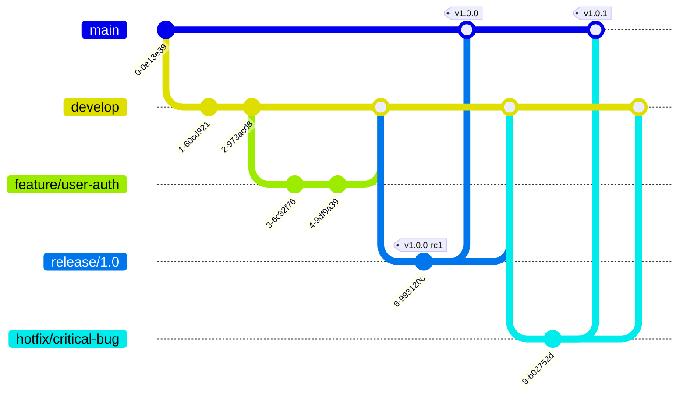
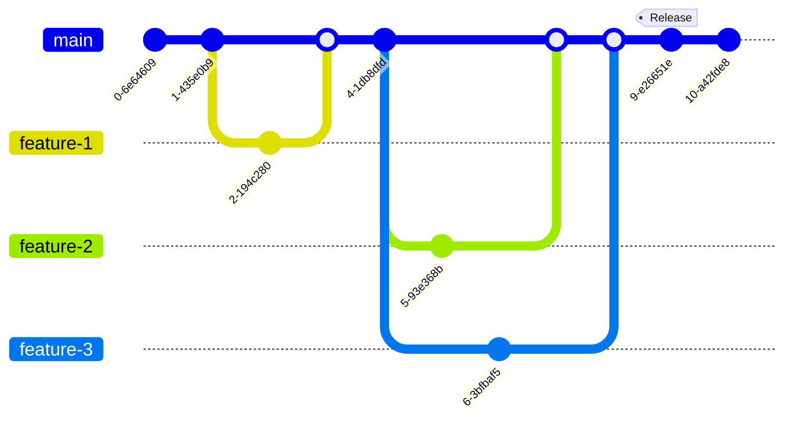
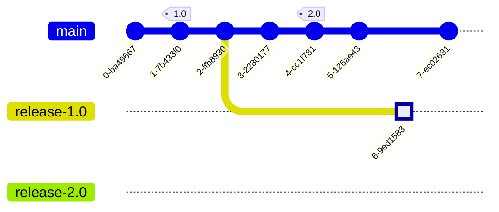

# Part 3: Git Workflows

## Table of Contents
- [What is a Git Workflow?](#what-is-a-git-workflow)
- [GitFlow Workflow](#gitflow-workflow)
- [GitHub Flow](#github-flow)
- [Trunk-Based Development](#trunk-based-development)
- [Feature Branch Workflow](#feature-branch-workflow)
- [Forking Workflow](#forking-workflow)
- [Workflow Comparison](#workflow-comparison)
- [Choosing the Right Workflow](#choosing-the-right-workflow)

---

## What is a Git Workflow?

A **Git workflow** is a recipe or recommendation for how to use Git to accomplish work in a consistent and productive manner. It defines:

- How and when to create branches
- Naming conventions for branches
- When and how to merge
- Who can merge and deploy
- Release management strategy

### Why Workflows Matter

1. **Consistency**: Everyone on the team follows the same process
2. **Quality**: Built-in code review and testing stages
3. **Safety**: Protect production code from bugs
4. **Collaboration**: Clear rules for multi-developer work
5. **Scalability**: Process works for teams of any size

---

## GitFlow Workflow

**GitFlow** is a branching model designed for projects with scheduled releases. Created by Vincent Driessen, it defines a strict branching structure.

### Branch Structure



### Branch Types

#### 1. **Main (Master) Branch**
- **Purpose**: Production-ready code
- **Lifetime**: Permanent
- **Protected**: Yes
- **Can merge from**: Release, hotfix
- **Each merge** is a production release

```bash
# Main branch should always be deployable
# Never commit directly to main
```

#### 2. **Develop Branch**
- **Purpose**: Integration branch for features
- **Lifetime**: Permanent
- **Protected**: Yes (usually)
- **Can merge from**: Feature, release, hotfix
- **Contains**: Latest delivered development changes

```bash
# Create develop from main
git checkout main
git pull
git checkout -b develop
git push -u origin develop
```

#### 3. **Feature Branches**
- **Purpose**: Develop new features
- **Lifetime**: Temporary
- **Branch from**: develop
- **Merge into**: develop
- **Naming**: `feature/*` or `feat/*`

```bash
# Create feature branch
git checkout develop
git pull
git checkout -b feature/user-profile

# Work on feature
git add .
git commit -m "feat: add user profile component"

# Keep feature updated with develop
git fetch origin
git rebase origin/develop

# When complete, merge back
git checkout develop
git merge --no-ff feature/user-profile
git branch -d feature/user-profile
git push origin --delete feature/user-profile
```

#### 4. **Release Branches**
- **Purpose**: Prepare for production release
- **Lifetime**: Temporary
- **Branch from**: develop
- **Merge into**: main AND develop
- **Naming**: `release/*` or `release/v*`

```bash
# Create release branch
git checkout develop
git pull
git checkout -b release/1.2.0

# Bump version, fix bugs, update changelog
# NO new features!

# Finalize release
npm version 1.2.0
git add package.json CHANGELOG.md
git commit -m "chore: bump version to 1.2.0"

# Merge to main
git checkout main
git merge --no-ff release/1.2.0
git tag -a v1.2.0 -m "Release version 1.2.0"

# Merge back to develop
git checkout develop
git merge --no-ff release/1.2.0

# Delete release branch
git branch -d release/1.2.0
git push origin --delete release/1.2.0

# Push everything
git push origin main develop --tags
```

#### 5. **Hotfix Branches**
- **Purpose**: Emergency fix for production
- **Lifetime**: Temporary
- **Branch from**: main
- **Merge into**: main AND develop
- **Naming**: `hotfix/*`

```bash
# Production is broken! Create hotfix
git checkout main
git pull
git checkout -b hotfix/critical-security-fix

# Fix the issue
git add .
git commit -m "fix: patch critical security vulnerability"

# Merge to main
git checkout main
git merge --no-ff hotfix/critical-security-fix
git tag -a v1.2.1 -m "Hotfix: security patch"

# Merge to develop
git checkout develop
git merge --no-ff hotfix/critical-security-fix

# Delete hotfix branch
git branch -d hotfix/critical-security-fix

# Deploy immediately
git push origin main develop --tags
```

### GitFlow Complete Workflow


### GitFlow Pros & Cons

**✅ Pros:**
- Clear, well-defined process
- Parallel development tracks
- Good for scheduled releases
- Clean release history
- Hotfix process built-in

**❌ Cons:**
- Complex for beginners
- Too heavy for continuous deployment
- Lots of branches to manage
- Merge conflicts can accumulate
- Slower iteration cycles

### When to Use GitFlow

- ✅ Traditional software releases (v1.0, v2.0)
- ✅ Multiple versions in production
- ✅ Large teams with junior developers
- ✅ Mobile apps (App Store submission cycles)
- ✅ Enterprise software with strict release schedules
- ❌ Continuous deployment
- ❌ Small teams with fast iteration
- ❌ SaaS products with daily deploys

---

## GitHub Flow

**GitHub Flow** is a simpler, lightweight workflow designed for continuous deployment. It's the workflow used by GitHub itself.

### The Flow


### Workflow Steps


### Step-by-Step Guide

#### Step 1: Create a Branch

```bash
# Always branch from main
git checkout main
git pull origin main
git checkout -b feature/add-notifications

# Descriptive branch names
# Good: feature/user-authentication, fix/header-alignment
# Bad: fix, temp, test
```

#### Step 2: Add Commits

```bash
# Make changes
git add src/notifications/
git commit -m "feat: add email notification service"

git add tests/
git commit -m "test: add notification service tests"

# Push early and often
git push -u origin feature/add-notifications
```

#### Step 3: Open a Pull Request

```bash
# Push to remote
git push origin feature/add-notifications

# Then open PR in GitHub UI
# Add:
# - Description of changes
# - Screenshots (if UI changes)
# - Reference to issue number
# - Request reviewers
```

**PR Description Template:**
```markdown
## What

Add email notification system

## Why

Users requested email alerts for important events (#234)

## How

- Created NotificationService
- Integrated with SendGrid API
- Added notification preferences to user settings

## Testing

- Unit tests added
- Manual testing done with test email account

## Screenshots


Closes #234
```

#### Step 4: Discuss and Review

```bash
# Reviewers suggest changes
# Address feedback

git add .
git commit -m "refactor: use template engine for emails"
git push origin feature/add-notifications

# PR automatically updates
```

#### Step 5: Merge and Deploy

```bash
# After approval, merge via GitHub UI
# (Squash merge recommended)

# Or via command line
git checkout main
git pull origin main
git merge --no-ff feature/add-notifications
git push origin main

# Deploy immediately (usually automated via CI/CD)
```

#### Step 6: Clean Up

```bash
# Delete feature branch
git branch -d feature/add-notifications
git push origin --delete feature/add-notifications

# Or delete via GitHub UI
```

### GitHub Flow Variants

#### Squash Merge
Combines all commits into one:

```bash
# All feature commits become one commit on main
git merge --squash feature/add-notifications
git commit -m "feat: add email notification system (#123)"
```

#### Rebase and Merge
Replays commits without merge commit:

```bash
git checkout feature/add-notifications
git rebase main
git checkout main
git merge feature/add-notifications  # Fast-forward
```

### GitHub Flow Pros & Cons

**✅ Pros:**
- Simple to understand
- Fast iteration cycles
- Built for continuous deployment
- One production branch to worry about
- Easy to learn

**❌ Cons:**
- No clear release points
- Difficult to maintain multiple versions
- Main must always be deployable (requires discipline)
- Can be chaotic for large teams without good CI/CD

### When to Use GitHub Flow

- ✅ Web applications with continuous deployment
- ✅ SaaS products
- ✅ Small to medium teams
- ✅ Fast-paced development
- ✅ Single production version
- ❌ Products with scheduled releases
- ❌ Multiple production versions
- ❌ Mobile apps with long approval processes

---

## Trunk-Based Development

**Trunk-Based Development** (TBD) is a workflow where developers collaborate on a single branch (trunk/main), with short-lived feature branches or direct commits.

### Core Principles

1. **One main branch** (trunk/main) that everyone commits to
2. **Short-lived feature branches** (hours to 1-2 days max)
3. **Frequent integration** (multiple times per day)
4. **Feature flags** to hide incomplete features
5. **Automated testing** to ensure trunk stability

### Workflow Visualization



### Two Variants

#### Variant 1: Direct to Trunk (High-Maturity Teams)

```bash
# Experienced developers commit directly to main
git checkout main
git pull --rebase
# Make small change
git add .
git commit -m "feat: add user avatar upload"
git pull --rebase  # In case someone pushed
git push

# CI/CD runs tests
# If green, auto-deploy
```

#### Variant 2: Short-Lived Branches

```bash
# Create branch for small feature
git checkout -b add-avatar-upload

# Work for max 1-2 days
git commit -m "feat: add avatar upload endpoint"
git commit -m "test: add avatar upload tests"

# Merge same day or next day
git checkout main
git pull
git merge add-avatar-upload
git push
git branch -d add-avatar-upload
```

### Feature Flags

Feature flags allow merging incomplete features safely:

```javascript
// Feature flag in code
const featureFlags = {
  newDashboard: process.env.ENABLE_NEW_DASHBOARD === 'true',
  advancedSearch: process.env.ENABLE_ADVANCED_SEARCH === 'true'
};

// Use flags to toggle features
function renderDashboard() {
  if (featureFlags.newDashboard) {
    return <NewDashboard />;
  }
  return <OldDashboard />;
}
```

```bash
# Feature is hidden in production
ENABLE_NEW_DASHBOARD=false

# Feature is visible in staging
ENABLE_NEW_DASHBOARD=true

# When ready, flip the flag in production
# No code deployment needed!
```

### Release from Trunk


```bash
# Release is just a tag on main
git tag -a v1.5.0 -m "Release 1.5.0"
git push --tags

# CI/CD picks up tag and deploys
```

### Branch for Release (Alternative)

For products that need support for multiple versions:



```bash
# Create release branch when deploying
git checkout -b release-1.0 v1.0-tag

# Continue development on main for v2.0
git checkout main

# If bug found in v1.0, fix in release branch
git checkout release-1.0
git commit -m "fix: critical bug in v1.0"
git tag -a v1.0.1 -m "Hotfix 1.0.1"

# Cherry-pick fix to main if needed
git checkout main
git cherry-pick <commit-sha>
```

### TBD Best Practices

1. **Small commits**: Commit often, small changes
2. **Fast CI/CD**: Test suite must run quickly (<10 minutes)
3. **Comprehensive tests**: High confidence in automated tests
4. **Feature flags**: Hide incomplete work
5. **Code review**: Use pair programming or fast PR review
6. **Monitoring**: Robust production monitoring
7. **Rollback capability**: Quick rollback if issues arise

### Trunk-Based Development Pros & Cons

**✅ Pros:**
- Fastest integration
- Minimal merge conflicts
- Simplest workflow
- Encourages small, incremental changes
- Enables continuous deployment
- No long-lived branches to manage

**❌ Cons:**
- Requires high team discipline
- Needs strong CI/CD infrastructure
- Feature flags add complexity
- Can be scary for inexperienced teams
- Requires comprehensive test coverage

### When to Use TBD

- ✅ Mature engineering teams
- ✅ Strong CI/CD culture
- ✅ Comprehensive automated testing
- ✅ Continuous deployment
- ✅ Microservices architecture
- ❌ Large teams with varying skill levels
- ❌ Weak or slow CI/CD
- ❌ Products needing multiple stable versions

---

## Feature Branch Workflow

The **Feature Branch Workflow** is a simple workflow where all feature development happens in dedicated branches instead of the main branch.

### Basic Structure


### Workflow Steps

```bash
# 1. Start from main
git checkout main
git pull

# 2. Create feature branch
git checkout -b feature/shopping-cart

# 3. Work on feature
git add .
git commit -m "Add cart component"
git commit -m "Add cart quantity controls"
git commit -m "Add cart total calculation"

# 4. Push to remote
git push -u origin feature/shopping-cart

# 5. Keep feature updated (optional)
git fetch origin
git rebase origin/main

# 6. When ready, merge to main
git checkout main
git pull
git merge feature/shopping-cart

# 7. Push and clean up
git push
git branch -d feature/shopping-cart
git push origin --delete feature/shopping-cart
```

### With Pull Requests

```bash
# After step 4, create PR in UI
# Team reviews and approves
# Merge via UI (with or without squash)
```

### Feature Branch Pros & Cons

**✅ Pros:**
- Isolated feature development
- Easy to understand
- Works with any team size
- Flexible merge strategies
- Good balance of simplicity and structure

**❌ Cons:**
- Can lead to long-lived branches
- Merge conflicts if not careful
- No standardized release process
- Requires discipline to keep branches short

### When to Use Feature Branch Workflow

- ✅ Teams new to Git
- ✅ Projects without strict release cycles
- ✅ Small to medium teams
- ✅ Any project needing feature isolation
- ✅ Transition from centralized VCS

---

## Forking Workflow

The **Forking Workflow** is the standard for open-source projects. Each developer has a server-side repository (fork) in addition to the main repository.

### Structure


### Workflow Steps

#### For Contributors

```bash
# 1. Fork the repository on GitHub
# Click "Fork" button in UI

# 2. Clone YOUR fork
git clone git@github.com:your-username/project.git
cd project

# 3. Add upstream remote
git remote add upstream git@github.com:original-org/project.git

# 4. Create feature branch
git checkout -b feature/add-dark-mode

# 5. Make changes and commit
git add .
git commit -m "feat: add dark mode toggle"

# 6. Push to YOUR fork
git push origin feature/add-dark-mode

# 7. Create Pull Request to upstream
# From your fork to original repository

# 8. Keep your fork synced
git fetch upstream
git checkout main
git merge upstream/main
git push origin main
```

#### For Maintainers

```bash
# Review PRs from contributors
# Comment, request changes

# When approved, merge via GitHub UI
# Or pull locally to test
git fetch origin pull/123/head:pr-123
git checkout pr-123
# Test changes
git checkout main
git merge pr-123
git push origin main
```

### Keeping Fork Updated

```bash
# Regular sync with upstream
git fetch upstream
git checkout main
git merge upstream/main

# Or use rebase
git rebase upstream/main

# Push to your fork
git push origin main

# Update your feature branch
git checkout feature/add-dark-mode
git rebase main
```

### Forking Workflow Pros & Cons

**✅ Pros:**
- Perfect for open-source
- Contributors don't need write access
- Maintainers have full control
- Safe experimentation in personal forks
- Clear separation of official vs experimental code

**❌ Cons:**
- More complex setup
- Extra step (fork) for contributors
- Can be confusing for beginners
- More repositories to manage

### When to Use Forking Workflow

- ✅ Open-source projects
- ✅ Public repositories
- ✅ Large number of external contributors
- ✅ When you don't want to give write access
- ❌ Private team projects
- ❌ Small internal teams

---

## Workflow Comparison

### Quick Comparison Table

| Aspect | GitFlow | GitHub Flow | Trunk-Based | Feature Branch | Forking |
|--------|---------|-------------|-------------|----------------|---------|
| **Complexity** | High | Low | Medium | Low | Medium |
| **Learning Curve** | Steep | Gentle | Medium | Gentle | Medium |
| **Branch Count** | Many | Few | Very Few | Medium | Medium |
| **Release Process** | Structured | Continuous | Continuous | Flexible | Flexible |
| **Team Size** | Large | Small-Medium | Medium-Large | Any | Any |
| **Deploy Frequency** | Scheduled | Continuous | Continuous | Varies | Varies |
| **Best For** | Enterprise | SaaS/Web Apps | High-maturity teams | General purpose | Open-source |
| **Hotfix Process** | Dedicated | Main | Main/Tag | Main | Main |
| **CI/CD Required** | Optional | Recommended | Essential | Optional | Optional |
| **Multiple Versions** | Yes | No | With branches | No | No |

### Branch Lifetime Comparison


### Decision Flow Chart


---

## Choosing the Right Workflow

### Questions to Ask

#### 1. **What kind of product?**
- **Mobile app**: GitFlow (App Store approval cycles)
- **Web app/SaaS**: GitHub Flow or Trunk-Based
- **Library/Framework**: GitFlow or Feature Branch
- **Open-source**: Forking Workflow

#### 2. **How often do you deploy?**
- **Multiple times per day**: Trunk-Based or GitHub Flow
- **Weekly/Sprint-based**: Feature Branch or GitHub Flow
- **Monthly/Quarterly**: GitFlow

#### 3. **Team size and experience?**
- **Large team, mixed experience**: GitFlow
- **Small team, experienced**: Trunk-Based
- **Medium team, moderate experience**: GitHub Flow or Feature Branch

#### 4. **Do you need to maintain multiple versions?**
- **Yes** (e.g., v1.x and v2.x): GitFlow
- **No** (single production version): GitHub Flow or Trunk-Based

#### 5. **How strong is your CI/CD?**
- **Very strong** (fast tests, auto-deploy): Trunk-Based
- **Good** (CI with manual deploy): GitHub Flow
- **Basic** (manual testing): GitFlow or Feature Branch

### Real-World Examples

#### Scenario 1: Early-Stage Startup
```
Product: Web application
Team: 3-5 developers
Deploys: Multiple times per day
CI/CD: Strong

✅ Recommendation: GitHub Flow or Trunk-Based
```

#### Scenario 2: Enterprise Software
```
Product: Desktop application
Team: 20+ developers
Deploys: Quarterly releases
CI/CD: Moderate

✅ Recommendation: GitFlow
```

#### Scenario 3: Open-Source Library
```
Product: npm package
Team: 1 maintainer + contributors
Deploys: As needed
CI/CD: GitHub Actions

✅ Recommendation: Forking Workflow
```

#### Scenario 4: Consulting Agency
```
Product: Multiple client projects
Team: 5-10 developers
Deploys: Varies by client
CI/CD: Varies

✅ Recommendation: Feature Branch (flexible)
```

### Hybrid Approaches

Many teams use hybrid workflows:

```bash
# GitFlow for releases + GitHub Flow for features
# - Use feature branches like GitHub Flow
# - Create release branches for QA
# - Use main for production

# Trunk-Based + Feature Flags for complex features
# - Mostly direct to trunk
# - Short feature branches for larger work
# - Feature flags for gradual rollout
```

---

## Best Practices for Any Workflow

### 1. **Protect Your Main Branch**

```bash
# In GitLab/GitHub settings:
# - Require pull request reviews
# - Require status checks to pass
# - Require branches to be up to date
# - Restrict who can push
```

### 2. **Use Meaningful Branch Names**

```bash
# ✅ Good
feature/user-authentication
bugfix/login-error-handling
hotfix/security-patch-xss
docs/api-documentation

# ❌ Bad
fix
temp
test
branch1
```

### 3. **Write Good Commit Messages**

```bash
# Use conventional commits
feat: add user registration
fix: resolve password reset bug
docs: update API documentation
refactor: simplify authentication logic
```

### 4. **Keep Branches Short-Lived**

```bash
# Aim for:
# - Features: Less than a week
# - Bugfixes: Same day
# - Hotfixes: Hours

# If branch is taking too long, consider:
# - Breaking into smaller features
# - Using feature flags
# - Merging partial work (with flags)
```

### 5. **Sync Frequently**

```bash
# Daily (minimum)
git fetch origin
git rebase origin/main  # or git merge origin/main
```

### 6. **Delete Merged Branches**

```bash
# Cleanup after merge
git branch -d feature/completed-work
git push origin --delete feature/completed-work

# Prune stale remote branches
git fetch --prune
```

### 7. **Use Pull/Merge Requests**

Even with simple workflows, PRs provide:
- Code review
- Discussion thread
- CI/CD integration
- Audit trail

```bash
# Never commit directly to main
# Always use a branch + PR
```

---

## Key Takeaways

1. **No one-size-fits-all**: Choose workflow based on your context
2. **GitFlow**: Structured releases, enterprise, multiple versions
3. **GitHub Flow**: Simple, continuous deployment, single version
4. **Trunk-Based**: Highest velocity, requires maturity
5. **Feature Branch**: Flexible, good starting point
6. **Forking**: Open-source standard
7. **Consistency matters**: Pick one and stick with it
8. **Can evolve**: Start simple, add structure as team grows

---

## What's Next?

In [Part 4: GitLab Introduction](./Part4-GitLab-Introduction.md), we'll explore:
- GitLab platform overview
- Projects, groups, and repositories
- Merge requests and code review
- Issues and project management
- Wiki and documentation

Now that you understand Git workflows, you're ready to see how GitLab enhances team collaboration!
