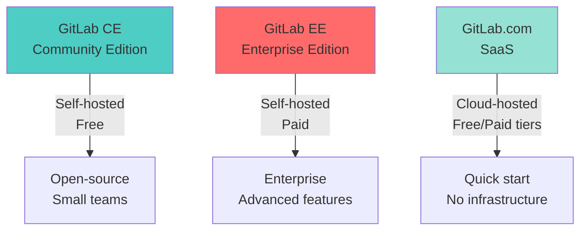
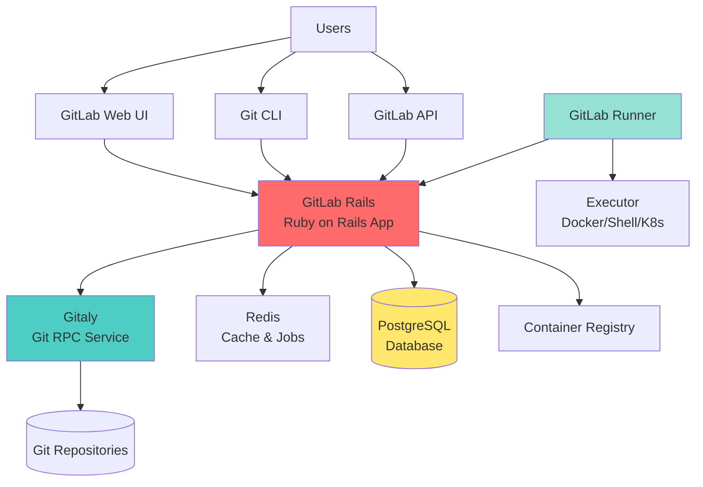
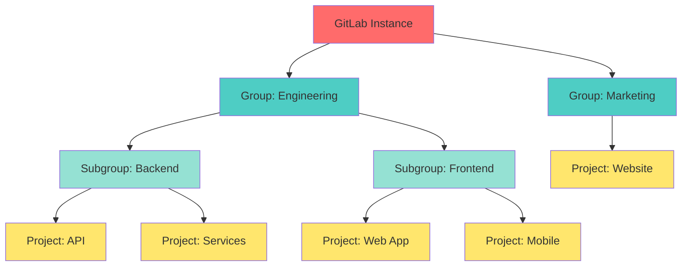
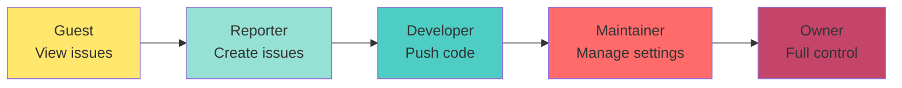
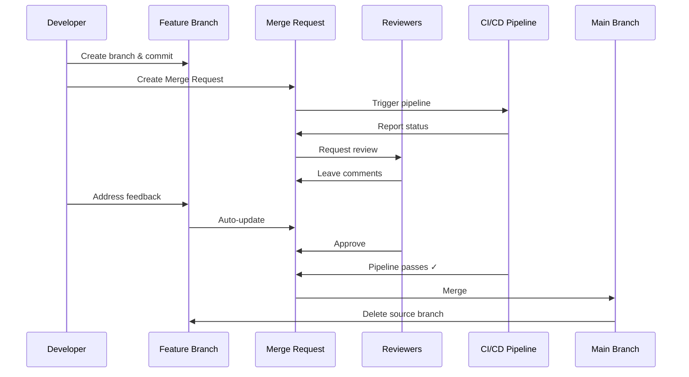
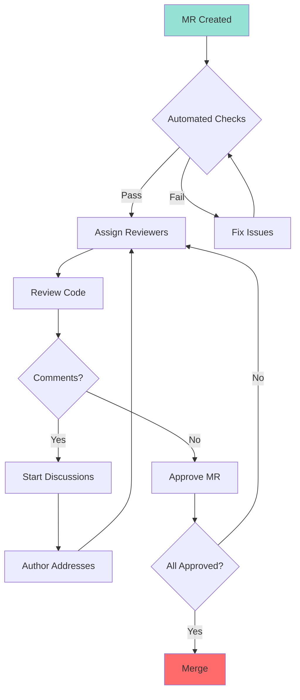
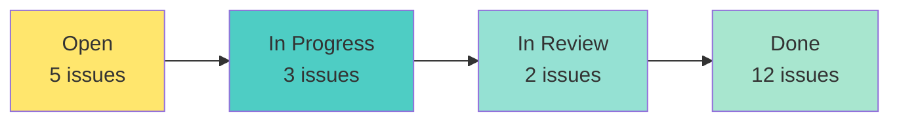
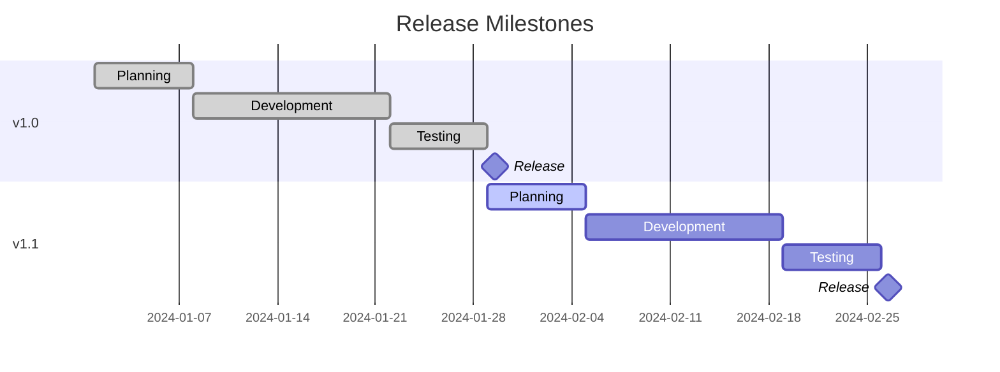

# Part 4: GitLab Introduction

## Table of Contents
- [What is GitLab?](#what-is-gitlab)
- [GitLab vs GitHub vs Bitbucket](#gitlab-vs-github-vs-bitbucket)
- [GitLab Architecture](#gitlab-architecture)
- [Projects and Groups](#projects-and-groups)
- [Repository Management](#repository-management)
- [Merge Requests](#merge-requests)
- [Code Review](#code-review)
- [Issues and Issue Boards](#issues-and-issue-boards)
- [Milestones and Labels](#milestones-and-labels)
- [Wiki and Documentation](#wiki-and-documentation)
- [GitLab Pages](#gitlab-pages)

---

## What is GitLab?

**GitLab** is a complete DevOps platform delivered as a single application. It provides:

- **Source Code Management** (Git repositories)
- **CI/CD** (Continuous Integration/Continuous Deployment)
- **Issue Tracking** and Project Management
- **Code Review** (Merge Requests)
- **Security Testing** and Compliance
- **Package Registry** (npm, Maven, Docker, etc.)
- **Monitoring** and Analytics

### GitLab Editions



#### 1. **GitLab CE** (Community Edition)
- **Free** and open-source
- Self-hosted
- Core features: Git, Issues, MRs, CI/CD
- Perfect for small teams and startups

#### 2. **GitLab EE** (Enterprise Edition)
- **Paid** (Self-hosted)
- Advanced features: SAML SSO, Geo-replication, Advanced security
- Tiers: Premium, Ultimate
- For large organizations

#### 3. **GitLab.com** (SaaS)
- **Cloud-hosted** by GitLab
- Free tier available
- Paid tiers: Premium, Ultimate
- No infrastructure management

### Key Features

| Feature | Description |
|---------|-------------|
| **Git Repository** | Central code storage with version control |
| **Merge Requests** | Code review and collaboration |
| **CI/CD Pipelines** | Automated testing and deployment |
| **Issues** | Task tracking and project management |
| **Wiki** | Documentation within projects |
| **Snippets** | Code snippet sharing |
| **Container Registry** | Docker image storage |
| **Package Registry** | npm, Maven, PyPI, etc. |
| **Security Scanning** | SAST, DAST, dependency scanning |
| **Kubernetes Integration** | Deploy to k8s clusters |

---

## GitLab vs GitHub vs Bitbucket

### Comparison Table

| Feature | GitLab | GitHub | Bitbucket |
|---------|--------|--------|-----------|
| **Hosting** | Self-hosted + SaaS | SaaS (+ Enterprise Server) | SaaS + Self-hosted |
| **Price (Free Tier)** | Unlimited private repos | Unlimited private repos | Unlimited private repos |
| **CI/CD** | Built-in (GitLab CI/CD) | GitHub Actions | Bitbucket Pipelines |
| **Issue Tracking** | Built-in | Built-in | Built-in (Jira integration) |
| **Wiki** | Built-in | Built-in | Confluence integration |
| **Project Management** | Boards, Milestones, Epics | Projects, Milestones | Jira integration |
| **Code Review** | Merge Requests | Pull Requests | Pull Requests |
| **Container Registry** | Built-in | GitHub Container Registry | Limited |
| **Security Scanning** | Built-in (SAST, DAST) | Dependabot, CodeQL | Limited |
| **Self-Hosted** | ✅ Full-featured | ✅ Enterprise Server | ✅ Data Center |
| **Open Source** | ✅ CE Edition | ❌ | ❌ |
| **Market Leader** | DevOps platform | Code hosting | Atlassian ecosystem |

### When to Choose GitLab

✅ **Choose GitLab when:**
- Want all-in-one DevOps platform
- Need self-hosted with full features
- Want built-in CI/CD without third-party tools
- Require comprehensive security scanning
- Prefer open-source option (CE)
- Need advanced project management (epics, roadmaps)

❌ **Choose alternatives when:**
- **GitHub**: Largest community, open-source projects, GitHub Actions
- **Bitbucket**: Deep Jira integration, Atlassian ecosystem

---

## GitLab Architecture

### Platform Architecture



### GitLab Components

| Component | Purpose |
|-----------|---------|
| **GitLab Rails** | Main application (web UI, API) |
| **Gitaly** | Git repository storage RPC service |
| **PostgreSQL** | Primary database |
| **Redis** | Caching and background jobs |
| **Sidekiq** | Background job processor |
| **GitLab Shell** | SSH access for Git operations |
| **GitLab Runner** | CI/CD job executor |
| **Container Registry** | Docker image storage |
| **Minio** | Object storage (artifacts, LFS) |

---

## Projects and Groups

### Hierarchy Structure



### Projects

A **project** contains:
- Git repository
- Issues
- Merge Requests
- CI/CD pipelines
- Wiki
- Container Registry

#### Creating a Project

```bash
# Via Web UI:
# 1. Click "New Project"
# 2. Choose:
#    - Create blank project
#    - Create from template
#    - Import project
# 3. Fill in:
#    - Project name
#    - Project slug (URL)
#    - Visibility level
#    - Initialize with README (optional)

# Via API:
curl --request POST \
  --header "PRIVATE-TOKEN: your-token" \
  --header "Content-Type: application/json" \
  --data '{
    "name": "My Awesome Project",
    "path": "my-awesome-project",
    "visibility": "private",
    "initialize_with_readme": true
  }' \
  "https://gitlab.com/api/v4/projects"
```

#### Cloning a Project

```bash
# SSH (recommended)
git clone git@gitlab.com:username/project-name.git

# HTTPS
git clone https://gitlab.com/username/project-name.git

# With specific branch
git clone -b develop git@gitlab.com:username/project-name.git
```

### Groups

A **group** is a collection of projects and/or other groups (subgroups).

**Benefits:**
- Shared settings across projects
- Member management at group level
- Shared CI/CD variables
- Aggregated analytics
- Epics (cross-project issues)

#### Creating a Group

```bash
# Via Web UI:
# 1. Click "Groups" > "New Group"
# 2. Fill in:
#    - Group name
#    - Group URL
#    - Visibility level
#    - Description

# Add projects to group
# - Create new projects within group
# - Transfer existing projects
```

#### Subgroups

```bash
# Organization: company/team/project

# Example hierarchy:
gitlab.com/acme-corp/                  # Top-level group
├── engineering/                        # Subgroup
│   ├── backend/                        # Sub-subgroup
│   │   ├── api-gateway/               # Project
│   │   └── user-service/              # Project
│   └── frontend/
│       ├── web-app/
│       └── mobile-app/
└── marketing/
    └── website/
```

### Visibility Levels

| Level | Description | Who Can Access |
|-------|-------------|----------------|
| **Private** | Only project members | Explicit members only |
| **Internal** | Logged-in users | Any authenticated user (GitLab instance) |
| **Public** | Everyone | Anyone on the internet |

### Permissions



| Role | Permissions |
|------|-------------|
| **Guest** | View issues, leave comments |
| **Reporter** | Create issues, view code, download artifacts |
| **Developer** | Push to non-protected branches, create MRs, manage issues |
| **Maintainer** | Push to protected branches, manage project settings, add members |
| **Owner** | Full control, delete project, transfer project |

---

## Repository Management

### Branches

#### Protected Branches

**Protected branches** prevent direct pushes and allow only Merge Requests.

```bash
# Settings > Repository > Protected Branches

# Protect main branch:
# - Allowed to merge: Maintainers
# - Allowed to push: No one
# - Allowed to force push: No
# - Code owner approval: Optional
```

**Use cases:**
- Protect `main` and `develop` branches
- Require code review before merge
- Prevent accidental force push
- Enforce CI pipeline success

#### Branch Rules

```yaml
# Example: Require MR for all branches except release/*
Protected branches:
  - main (Maintainers can merge)
  - develop (Developers can merge)
  
Wildcard protected branches:
 - release/* (Maintainers can merge)
```

### Push Rules

**Push rules** enforce commit standards (EE feature).

```bash
# Settings > Repository > Push Rules

Examples:
☑ Reject unsigned commits
☑ Check whether author is a GitLab user
☑ Prevent committing secrets
☑ Reject commit messages that don't match regex
☑ Branch name regex: ^(feature|bugfix|hotfix)/.*
☑ Max file size: 100 MB
```

### Tags

```bash
# Protected tags prevent deletion/modification
# Settings > Repository > Protected Tags

# Protect release tags
Pattern: v*
Allowed to create: Maintainers

# Create tag via UI:
# Repository > Tags > New Tag

# Or via CLI:
git tag -a v1.0.0 -m "Release 1.0.0"
git push origin v1.0.0
```

### Repository Mirroring

**Mirror** a repository to/from external sources.

```bash
# Push mirror: GitLab → External
# Settings > Repository > Mirroring repositories

# Example: Mirror to GitHub
Git repository URL: https://github.com/user/repo.git
Mirror direction: Push
Password: <GitHub personal access token>

# Pull mirror: External → GitLab
# Sync external repo changes to GitLab
Mirror direction: Pull
```

---

## Merge Requests

**Merge Requests** (MRs) are GitLab's code review and collaboration tool (equivalent to Pull Requests in GitHub).

### Merge Request Workflow



### Creating a Merge Request

#### Via Web UI

```bash
# Two methods:

# Method 1: After pushing branch
git push -u origin feature/add-authentication
# GitLab shows: "Create merge request for feature/add-authentication"
# Click link

# Method 2: Manual creation
# 1. Go to project
# 2. Merge Requests > New Merge Request
# 3. Select source branch
# 4. Select target branch (usually main)
# 5. Click "Compare branches and continue"
# 6. Fill in title and description
# 7. Assign reviewers, labels, milestone
# 8. Click "Create merge request"
```

#### MR Template

Create `.gitlab/merge_request_templates/default.md`:

```markdown
## What does this MR do?

<!-- Briefly describe the changes -->

## Why was this MR needed?

<!-- Explain the motivation or context -->

## What are the relevant issue numbers?

Closes #

## Screenshots (if appropriate)

## Does this MR meet the acceptance criteria?

- [ ] Tests added/updated
- [ ] Documentation added/updated
- [ ] Code reviewed
- [ ] Pipeline passes

## Related MRs

<!-- Link to related MRs if any -->
```

### MR Details

#### Title and Description

```markdown
# Good MR title (follows conventional commits)
feat: add user authentication with OAuth2

# Description
## Summary
Implements OAuth2 login with Google and GitHub providers.

## Changes
- Add OAuth2 configuration
- Create authentication middleware
- Add login/logout endpoints
- Update user model for OAuth tokens

## Testing
- Unit tests for auth middleware
- Integration tests for login flow
- Manual testing with test OAuth apps

## Screenshots


Closes #123
Relates to #45, #67
```

#### Assignees and Reviewers

```bash
# Assignee: Person responsible for the MR (usually the author)
# Reviewers: People who need to review code

# Add reviewers:
# - In sidebar during MR creation
# - Or after creation in sidebar
# - Use Code Owners for automatic assignment
```

#### Labels

```bash
# Categorize MRs with labels:
Labels:
  - feature (new functionality)
  - bug (fixes an issue)
  - documentation
  - refactor
  - security
  - breaking-change
  
Priority:
  - priority::high
  - priority::medium
  - priority::low
  
Status:
  - status::in-review
  - status::needs-work
  - status::approved
```

### MR Settings

#### Merge Options

```bash
# Merge methods:

# 1. Merge commit (default)
# Creates merge commit with both parents
git merge --no-ff feature-branch

# 2. Squash and merge
# Combines all commits into one
git merge --squash feature-branch

# 3. Fast-forward merge
# Linear history (only if possible)
git merge --ff-only feature-branch # Settings > General > Merge Requests

☑ Enable "Delete source branch" option by default
☑ Enable "Squash commits when merging"
☑ Merge checks:
  - Pipelines must succeed
  - All threads must be resolved
  - All merge request dependencies resolved
```

#### Approval Rules

```bash
# Settings > General > Merge request approvals (EE)

# Require approvals before merge:
- Number of approvals required: 2
- Eligible approvers: Maintainers, specific users
- Code owner approval: Required

# Approval rules:
Rule: Backend Changes
- Approvals required: 2
- Eligible approvers: @backend-team
- Protected branches: main
- File patterns: app/**, lib/**
```

### Draft Merge Requests

```bash
# Mark MR as work-in-progress (Draft)
# Prevents accidental merging

# Create draft MR:
# Method 1: Prefix title with "Draft:" or "WIP:"
Title: Draft: Add user authentication

# Method 2: Click "Mark as draft" in MR sidebar

# Pipeline runs, but can't be merged
# Remove draft status when ready for review
```

### Dependencies

```bash
# MR can depend on other MRs
# Prevents merging until dependencies are merged

# In MR description:
Depends on !123

# Or add in sidebar: Related merge requests
```

---

## Code Review

### Review Process



### Reviewing Code

#### Inline Comments

```bash
# In MR, go to "Changes" tab
# Click on line number to add comment
# Types of comments:

# Regular comment
"This function could be simplified..."

# Start discussion thread
"Should we add error handling here?"
└─ Author: "Good catch! Will add try-catch"
   └─ Reviewer: "👍 Looks good"
      └─ [Resolve thread]

# Suggestion (code change)
```python
# Reviewer suggests:
def calculate_total(items):
    return sum(item.price for item in items)
# Author can apply suggestion with one click
```

#### Multi-line Comments

```bash
# Select multiple lines
# Click line numbers while holding Shift
# Add comment for entire block
```

#### Discussion Resolution

```bash
# Each thread can be "resolved"
# MR shows: "5 threads, 2 unresolved"

# Settings can require:
☑ All threads must be resolved before merging
```

### Review Strategies

#### 1. **Synchronous Review** (Pair Programming)

```bash
# Review together in real-time
# Video call + screen share
# Discuss as you review
# Fast feedback, high collaboration
```

#### 2. **Asynchronous Review**

```bash
# Reviewer reviews when available
# Leaves comments in MR
# Author addresses later
# Allows distributed teams
```

#### 3. **Multi-stage Review**

```bash
# Stage 1: Automated checks (linter, tests)
# Stage 2: Peer review (developer)
# Stage 3: Senior review (architect/lead)
# Stage 4: Security review (if applicable)
```

### Code Review Best Practices

#### For Authors

```bash
# ✅ Do:
- Keep MRs small (< 400 lines ideally)
- Write clear description
- Add screenshots for UI changes
- Self-review before requesting review
- Respond promptly to feedback
- Explain non-obvious code

# ❌ Don't:
- Create huge MRs (1000+ lines)
- Leave vague descriptions
- Get defensive about feedback
- Ignore comments
- Force push after review starts
```

#### For Reviewers

```bash
# ✅ Do:
- Review promptly (within 24 hours)
- Be specific and constructive
- Explain the "why" behind suggestions
- Acknowledge good work
- Ask questions if unclear
- Approve when satisfied

# ❌ Don't:
- Nitpick on style (use linter instead)
- Be vague ("this is wrong")
- Request unnecessary changes
- Ignore security issues
- Delay reviews indefinitely
```

### Code Review Checklist

```markdown
## Functionality
- [ ] Code does what it's supposed to do
- [ ] Edge cases are handled
- [ ] Error handling is appropriate

## Code Quality
- [ ] Code is readable and maintainable
- [ ] No code duplication
- [ ] Functions/methods are single-purpose
- [ ] Variable names are clear

## Testing
- [ ] Tests are included/updated
- [ ] Tests cover edge cases
- [ ] All tests pass

## Security
- [ ] No hardcoded secrets
- [ ] Input validation present
- [ ] No SQL injection vulnerabilities
- [ ] Sensitive data is encrypted

## Performance
- [ ] No obvious performance issues
- [ ] Database queries are efficient
- [ ] No unnecessary loops

## Documentation
- [ ] Code comments where needed
- [ ] README updated if applicable
- [ ] API docs updated
```

---

## Issues and Issue Boards

### Issues

**Issues** are GitLab's task tracking system.

#### Creating an Issue

```bash
# Via Web UI:
# 1. Issues > New Issue
# 2. Fill in:
Title: Add user registration feature
Description:
  ## Description
  Users should be able to register with email/password
  
  ## Acceptance Criteria
  - [ ] Registration form with email, password fields
  - [ ] Password strength validation
  - [ ] Email verification
  - [ ] User receives welcome email
  
  ## Technical Notes
  - Use bcrypt for password hashing
  - Use JWT for authentication
  
  ## Resources
  - Design mockup: [link]

# 3. Set:
Assignee: @john
Labels: feature, priority::high
Milestone: v1.2.0
Weight: 5
Due date: 2024-02-15
```

#### Issue Templates

Create `.gitlab/issue_templates/bug.md`:

```markdown
## Bug Description

<!-- What went wrong? -->

## Steps to Reproduce

1. 
2. 
3. 

## Expected Behavior

<!-- What should happen? -->

## Actual Behavior

<!-- What actually happens? -->

## Environment

- Browser/App version:
- OS:
- GitLab version:

## Screenshots

<!-- If applicable -->

## Additional Context

<!-- Any other relevant information -->

/label ~bug
```

#### Linking Issues and MRs

```bash
# In MR description:
Closes #123        # Will close issue when MR is merged
Fixes #456         # Same as "Closes"
Relates to #789    # Just links, doesn't close

# In commit message:
git commit -m "feat: add registration form

Closes #123"
```

### Issue Boards

**Issue boards** provide kanban-style visualization of issues.



#### Creating Boards

```bash
# Issues > Boards > New Board

# Board types:
# 1. Label-based: Lists created from labels
# 2. Assignee-based: Lists by assignee (EE)
# 3. Milestone-based: Lists by milestone (EE)

# Example: Development workflow board
Lists:
  - Backlog (label: backlog)
  - To Do (label: todo)
  - In Progress (label: in-progress)
  - In Review (label: in-review)
  - Done (label: done)

# Drag issues between lists (auto-updates labels)
```

#### Board Workflows

```bash
# Scrum Board:
Backlog → Sprint → In Progress → Review → Done

# Kanban Board:
To Do → Doing → Review → Done

# Bug Triage Board:
Reported → Confirmed → Assigned → Fixed → Verified
```

---

## Milestones and Labels

### Milestones

**Milestones** group issues and MRs into releases or sprints.

```bash
# Issues > Milestones > New Milestone

Title: v1.2.0 Release
Start date: 2024-01-01
Due date: 2024-01-31
Description: Winter release with new features

# Add issues/MRs to milestone
# Track progress: 15/20 issues closed (75%)
```



### Labels

**Labels** categorize issues and MRs.

#### Label Types

```bash
# Type labels:
~feature       # New functionality
~bug           # Something isn't working
~enhancement   # Improve existing feature
~documentation # Documentation changes
~refactor      # Code improvement

# Priority labels:
~priority::critical
~priority::high
~priority::medium
~priority::low

# Status labels:
~status::todo
~status::in-progress
~status::blocked
~status::needs-review

# Team labels:
~team::backend
~team::frontend
~team::devops

# Scoped labels (mutually exclusive, EE):
status::todo (can't also have status::in-progress)
priority::high (can't also have priority::low)
```

#### Label Colors

```bash
# Use colors to quickly identify:
Red: Urgent/Blocker
Orange: High priority
Yellow: Medium priority
Green: Low priority
Blue: Enhancement
Purple: Documentation
```

---

## Wiki and Documentation

### GitLab Wiki

Each project has a built-in wiki for documentation.

```bash
# Access: Sidebar > Wiki

# Features:
- Markdown support
- Version control (Git-based)
- Attachments (images, files)
- Table of contents
- Search

# Creating pages:
# 1. Click "New page"
# 2. Enter title: "API Documentation"
# 3. Choose format: Markdown
# 4. Write content
# 5. Save

# Wiki structure:
home.md (Home page)
api/
  auth.md
  endpoints.md
guides/
  getting-started.md
  deployment.md
```

### Wiki Git Repository

```bash
# Wiki is a Git repository
# Clone it separately:

git clone git@gitlab.com:username/project.wiki.git

# Edit locally:
cd project.wiki
echo "# New Page" > new-page.md
git add new-page.md
git commit -m "Add new page"
git push

# Changes appear in wiki
```

### Documentation Best Practices

```markdown
# Good documentation structure:

## README.md (in repository root)
- Project overview
- Quick start
- Installation
- Basic usage
- Link to full docs

## Wiki (detailed documentation)
- Architecture overview
- API documentation
- Deployment guide
- Troubleshooting
- Contributing guide

## CONTRIBUTING.md
- How to contribute
- Code style
- PR process

## CHANGELOG.md
- Version history
- Release notes
```

---

## GitLab Pages

**GitLab Pages** hosts static websites directly from repositories.

### Use Cases

- Project documentation (like this guide!)
- Portfolio websites
- Marketing sites
- Documentation sites (Sphinx, Jekyll, Hugo)

### Simple Example

```yaml
# .gitlab-ci.yml
pages:
  stage: deploy
  script:
    - mkdir .public
    - cp -r * .public
    - mv .public public
  artifacts:
    paths:
      - public
  only:
    - main

# Website will be at:
# https://username.gitlab.io/project-name
```

### With Static Site Generator (Hugo)

```yaml
image: registry.gitlab.com/pages/hugo:latest

pages:
  stage: deploy
  script:
    - hugo
  artifacts:
    paths:
      - public
  only:
    - main
```

---

## Quick Reference

| Feature | Purpose |
|---------|---------|
| **Project** | Git repository + issues + MRs + CI/CD |
| **Group** | Collection of projects |
| **Merge Request** | Code review and merge workflow |
| **Issue** | Task/bug tracking |
| **Issue Board** | Kanban visualization |
| **Milestone** | Sprint/release grouping |
| **Label** | Categorize issues/MRs |
| **Wiki** | Project documentation |
| **Protected Branch** | Require MR for changes |
| **Approval Rules** | Require reviews before merge |

---

## Key Takeaways

1. **GitLab is comprehensive** - All DevOps tools in one platform
2. **Groups organize projects** - Hierarchy for large organizations
3. **Merge Requests enable collaboration** - Code review, discussions, approvals
4. **Issues track work** - Flexible task management with boards
5. **Labels and milestones** - Organize and prioritize work
6. **Protected branches** - Enforce quality and review processes
7. **Built-in wiki** - Document within your project
8. **GitLab Pages** - Host static sites for free

---

## What's Next?

In [Part 5: GitLab CI/CD](./Part5-GitLab-CICD.md), we'll explore:
- CI/CD fundamentals
- Pipeline configuration (`.gitlab-ci.yml`)
- Runners and executors
- Advanced pipeline patterns
- Deployment strategies

With your GitLab knowledge, you're ready to automate your workflows with CI/CD!
