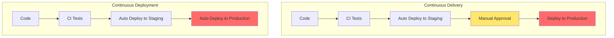
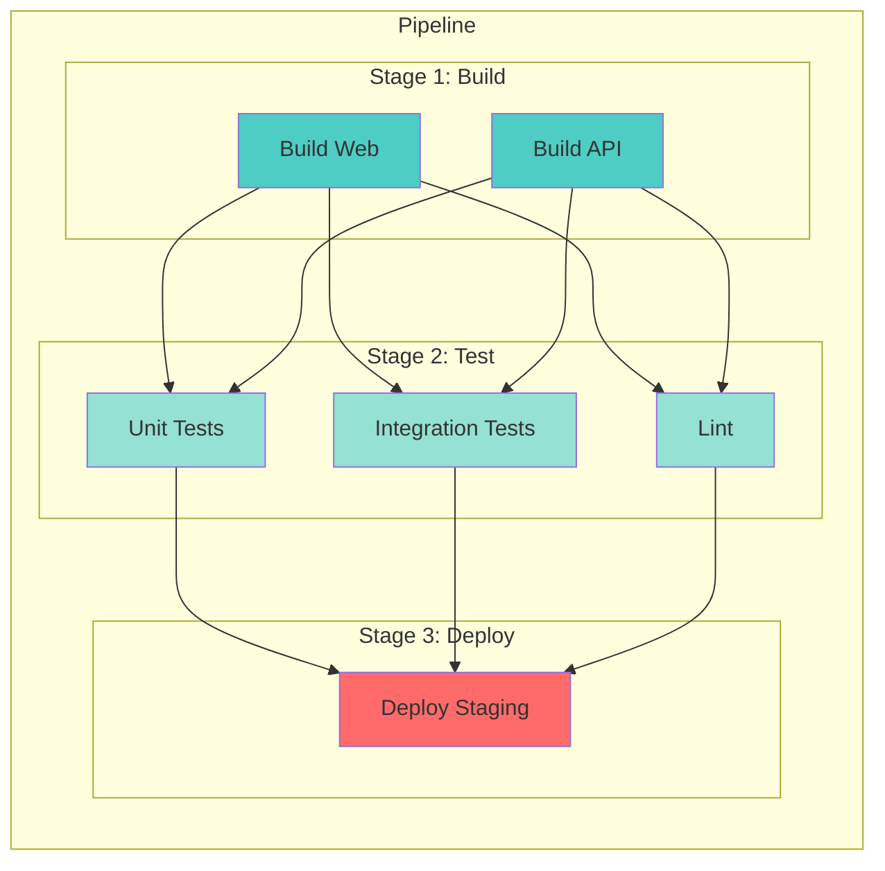
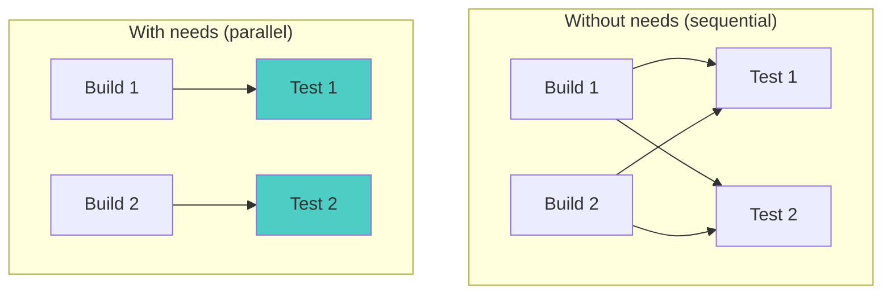
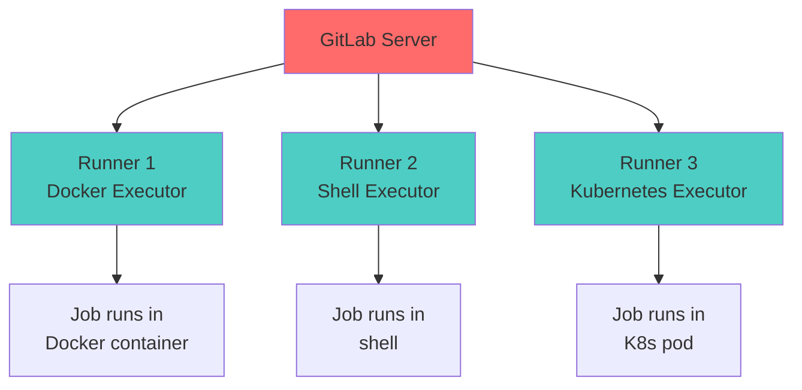

# Part 5: GitLab CI/CD

## Table of Contents
- [CI/CD Fundamentals](#cicd-fundamentals)
- [Pipeline Basics](#pipeline-basics)
- [.gitlab-ci.yml Configuration](#gitlab-ciyml-configuration)
- [Jobs and Stages](#jobs-and-stages)
- [Variables](#variables)
- [Artifacts and Caching](#artifacts-and-caching)
- [Runners and Executors](#runners-and-executors)
- [Advanced Pipeline Patterns](#advanced-pipeline-patterns)
- [Environments and Deployments](#environments-and-deployments)
- [Pipeline Optimization](#pipeline-optimization)

---

## CI/CD Fundamentals

### What is CI/CD?


#### Continuous Integration (CI)

**Continuous Integration** is the practice of automatically building and testing code changes.

**Key principles:**
- Developers commit/push code frequently
- Automated build triggered on each push
- Automated tests run on every build
- Quick feedback (usually < 10 minutes)
- Failures are addressed immediately

```

mermaid
sequenceDiagram
    participant Dev as Developer
    participant Git as Git Repository
    participant CI as CI Pipeline
    participant Test as Test Suite
    participant Notify as Notifications
    
    Dev->>Git: Push code
    Git->>CI: Trigger pipeline
    CI->>Test: Run tests
    Test->>CI: Results
    CI->>Notify: Send status
    Notify->>Dev: ✓ Pass or ✗ Fail
```

#### Continuous Delivery (CD)

**Continuous Delivery** ensures code is always in a deployable state and can be released at any time.

**Key principles:**
- Automated deployment to staging
- Manual approval for production
- All changes deployable
- Deployment is low-risk

#### Continuous Deployment

**Continuous Deployment** takes it further—every change that passes tests is automatically deployed to production.

**Key difference:**
- **Continuous Delivery**: Manual production deploy
- **Continuous Deployment**: Automatic production deploy



---

## Pipeline Basics

### What is a Pipeline?

A **pipeline** is a set of automated processes that run when code is pushed or a merge request is created.

### Pipeline Anatomy



### Pipeline Triggers

Pipelines can be triggered by:

1. **Push to repository**
   ```bash
   git push origin feature/new-feature
   # Pipeline runs automatically
   ```

2. **Merge request**
   ```bash
   # Create MR → Pipeline runs
   # Every update to MR → Pipeline runs
   ```

3. **Schedule** (cron)
   ```yaml
   # CI/CD > Schedules
   # Run nightly at 2 AM
   ```

4. **Manual trigger**
   ```bash
   # Click "Run pipeline" button in UI
   ```

5. **API**
   ```bash
   curl --request POST \
     --form token=TOKEN \
     --form ref=main \
     "https://gitlab.com/api/v4/projects/PROJECT_ID/trigger/pipeline"
   ```

6. **Webhook**
   ```bash
   # External service triggers pipeline
   ```

### Pipeline Viewing

```bash
# View pipelines:
# CI/CD > Pipelines

# Pipeline status indicators:
pending   ⏸️  # Waiting to run
running   ▶️  # Currently executing
passed    ✅  # All jobs succeeded
failed    ❌  # One or more jobs failed
canceled  🚫  # Manually canceled
skipped   ⏭️  # Skipped based on rules
```

---

## .gitlab-ci.yml Configuration

The `.gitlab-ci.yml` file defines your CI/CD pipeline configuration.

### Basic Example

```yaml
# .gitlab-ci.yml

# Define stages (order matters)
stages:
  - build
  - test
  - deploy

# Global before_script (runs before all jobs)
before_script:
  - echo "Starting pipeline..."

# Job 1: Build application
build_job:
  stage: build
  script:
    - echo "Building the application..."
    - npm install
    - npm run build
  artifacts:
    paths:
      - dist/

# Job 2: Run tests
test_job:
  stage: test
  script:
    - echo "Running tests..."
    - npm test
  dependencies:
    - build_job

# Job 3: Deploy to production
deploy_job:
  stage: deploy
  script:
    - echo "Deploying to production..."
    - ./deploy.sh
  only:
    - main
  when: manual
```

### File Structure

```yaml
# Global settings
variables:          # Define variables
  VAR_NAME: value

stages:             # Define stages
  - stage1
  - stage2

before_script:      # Runs before each job
  - command

after_script:       # Runs after each job
  - command

# Job definition
job_name:
  stage: stage1    # Which stage
  image: node:18   # Docker image
  services:        # Additional services
    - postgres:13
  before_script:   # Job-specific before_script
    - command
  script:          # Main commands (required)
    - command1
    - command2
  after_script:    # Job-specific after_script
    - command
  artifacts:       # Files to pass to next stages
    paths:
      - build/
  cache:           # Files to cache between runs
    paths:
      - node_modules/
  only:            # When to run
    - main
  except:          # When NOT to run
    - schedules
  when:            # Conditions
    manual/always/on_success/on_failure
  allow_failure:   # Don't fail pipeline if job fails
    true/false
  retry:           # Retry on failure
    max: 2
  timeout:         # Job timeout
    1h
  dependencies:    # Which jobs to get artifacts from
    - other_job
  needs:           # Run before stage completion
    - other_job
```

---

## Jobs and Stages

### Stages

**Stages** define the pipeline structure. Jobs in the same stage run in parallel.

```yaml
stages:
  - build
  - test
  - deploy

# Build stage (jobs run in parallel)
build_web:
  stage: build
  script: npm run build:web

build_api:
  stage: build
  script: npm run build:api

# Test stage (waits for build to complete)
unit_tests:
  stage: test
  script: npm run test:unit

integration_tests:
  stage: test
  script: npm run test:integration

# Deploy stage (waits for test to complete)
deploy_production:
  stage: deploy
  script: ./deploy.sh
```

### Jobs

**Jobs** are the individual tasks that run in a pipeline.

```yaml
# Job with all common options
my_job:
  stage: test
  image: node:18-alpine
  
  before_script:
    - npm ci
  
  script:
    - npm run lint
    - npm test
    - npm run build
  
  after_script:
    - echo "Job completed"
  
  artifacts:
    paths:
      - coverage/
      - dist/
    expire_in: 1 week
  
  cache:
    key: ${CI_COMMIT_REF_SLUG}
    paths:
      - node_modules/
  
  only:
    - merge_requests
    - main
  
  when: on_success
  allow_failure: false
  
  retry:
    max: 2
    when:
      - runner_system_failure
      - stuck_or_timeout_failure
```

### Hidden Jobs (Templates)

```yaml
# Hidden job (starts with .)
.deploy_template:
  image: alpine:latest
  before_script:
    - apk add --no-cache curl
  script:
    - echo "Deploying to $ENVIRONMENT"
    - curl -X POST $DEPLOY_URL

# Extend template
deploy_staging:
  extends: .deploy_template
  variables:
    ENVIRONMENT: staging
    DEPLOY_URL: https://api.staging.example.com/deploy
  only:
    - develop

deploy_production:
  extends: .deploy_template
  variables:
    ENVIRONMENT: production
    DEPLOY_URL: https://api.example.com/deploy
  only:
    - main
  when: manual
```

### Job Dependencies

#### Using `dependencies`

```yaml
build_job:
  stage: build
  script: make build
  artifacts:
    paths:
      - build/

# Only gets artifacts from build_job
test_job:
  stage: test
  script: make test
  dependencies:
    - build_job  # Explicit dependency
```

#### Using `needs` (DAG - Directed Acyclic Graph)

```yaml
# Doesn't wait for entire stage to complete
build_job:
  stage: build
  script: make build

# Starts as soon as build_job completes
# Doesn't wait for other build stage jobs
test_job:
  stage: test
  needs:
    - build_job
  script: make test
```

**Difference:**
- `dependencies`: Gets artifacts, still waits for stage
- `needs`: Gets artifacts, runs immediately after specified job



---

## Variables

### Types of Variables

#### 1. Predefined Variables

GitLab provides many built-in variables:

```yaml
test_job:
  script:
    - echo "Pipeline ID: $CI_PIPELINE_ID"
    - echo "Commit SHA: $CI_COMMIT_SHA"
    - echo "Branch: $CI_COMMIT_REF_NAME"
    - echo "Project: $CI_PROJECT_NAME"
    - echo "Runner: $CI_RUNNER_DESCRIPTION"
```

**Common predefined variables:**

| Variable | Description |
|----------|-------------|
| `CI_COMMIT_SHA` | Commit SHA triggering pipeline |
| `CI_COMMIT_REF_NAME` | Branch or tag name |
| `CI_COMMIT_REF_SLUG` | Branch/tag name (lowercase, alphanumeric) |
| `CI_PROJECT_ID` | Project ID |
| `CI_PROJECT_NAME` | Project name |
| `CI_PIPELINE_ID` | Pipeline ID |
| `CI_JOB_ID` | Job ID |
| `CI_MERGE_REQUEST_ID` | MR ID (if pipeline for MR) |
| `CI_REGISTRY` | GitLab Container Registry URL |
| `CI_REGISTRY_IMAGE` | Container Registry image path |

#### 2. Custom Variables (Global)

```yaml
variables:
  NODE_VERSION: "18"
  DATABASE_URL: "postgres://localhost:5432/db"
  
build_job:
  script:
    - echo "Using Node $NODE_VERSION"
    - npm run build
```

#### 3. Job Variables

```yaml
build_job:
  variables:
    BUILD_ENV: production
  script:
    - echo "Building for $BUILD_ENV"
```

#### 4. Protected Variables

```bash
# Settings > CI/CD > Variables

# Add protected variable:
Name: API_KEY
Value: super-secret-key
Protected: Yes (only available on protected branches)
Masked: Yes (hidden in logs)
```

#### 5. Environment Variables

```yaml
deploy_staging:
  script:
    - deploy.sh
  environment:
    name: staging
  variables:
    DEPLOY_URL: https://staging.example.com
```

### Variable Precedence

```
Highest priority:
1. Trigger variables
2. Scheduled pipeline variables
3. Manual pipeline variables
4. Project variables
5. Group variables
6. Instance variables
7. .gitlab-ci.yml variables
Lowest priority
```

### Using Variables

```yaml
variables:
  DOCKER_IMAGE: "node:${NODE_VERSION}-alpine"
  CACHE_KEY: "${CI_PROJECT_NAME}-${CI_COMMIT_REF_SLUG}"

build_job:
  image: $DOCKER_IMAGE
  script:
    - echo "Building ${CI_PROJECT_NAME}"
    - echo "Branch: ${CI_COMMIT_REF_NAME}"
  cache:
    key: $CACHE_KEY
    paths:
      - node_modules/
```

---

## Artifacts and Caching

### Artifacts

**Artifacts** are files generated by jobs that are passed to subsequent stages.

```yaml
build_job:
  script:
    - npm run build
  artifacts:
    paths:
      - dist/          # Built files
      - coverage/      # Coverage reports
    exclude:
      - dist/**/*.map  # Exclude source maps
    expire_in: 1 week  # Auto-delete after 1 week
    when: always       # Upload even if job fails

test_job:
  script:
    - ls -la dist/     # Uses artifacts from build_job
  dependencies:
    - build_job
```

**Artifact Options:**

```yaml
artifacts:
  paths:              # Files/directories to upload
    - build/
  exclude:            # Patterns to exclude
    - build/**/*.log
  name: "${CI_JOB_NAME}_${CI_COMMIT_REF_NAME}"  # Archive name
  expire_in: 30 days  # How long to keep
  when: always        # always/on_success/on_failure
  reports:
    junit: test-results.xml
    coverage_report:
      coverage_format: cobertura
      path: coverage/cobertura-coverage.xml
```

### Caching

**Cache** saves files between pipeline runs to speed up execution.

```yaml
cache:
  key: ${CI_COMMIT_REF_SLUG}  # Cache per branch
  paths:
    - node_modules/
    - .npm/

build_job:
  before_script:
    - npm ci --cache .npm --prefer-offline
  script:
    - npm run build
```

**Cache Strategies:**

```yaml
# 1. Per-branch cache
cache:
  key: ${CI_COMMIT_REF_SLUG}
  paths:
    - node_modules/

# 2. Per-job cache
cache:
  key: ${CI_JOB_NAME}
  paths:
    - .build_cache/

# 3. Global cache
cache:
  key: global-cache
  paths:
    - vendor/

# 4. Cache with fallback
cache:
  key: ${CI_COMMIT_REF_SLUG}
  fallback_keys:
    - main-cache  # Use if branch cache doesn't exist
  paths:
    - node_modules/
```

### Artifacts vs Cache

| Aspect | Artifacts | Cache |
|--------|-----------|-------|
| **Purpose** | Pass data between jobs/stages | Speed up jobs across pipelines |
| **Lifetime** | Specific to pipeline | Shared across pipelines |
| **When uploaded** | After job completes | After job completes |
| **When restored** | Before dependent jobs | Before job starts |
| **Reliability** | Guaranteed | Best effort (may be cleared) |
| **Use for** | Build outputs, test reports | Dependencies, build tools |

```yaml
# Example: Build once, use everywhere
build:
  script: npm run build
  artifacts:           # Artifacts for this pipeline
    paths:
      - dist/
  cache:               # Cache for future pipelines
    key: ${CI_COMMIT_REF_SLUG}
    paths:
      - node_modules/
```

---

## Runners and Executors

### What is a Runner?

A **GitLab Runner** is an agent that runs CI/CD jobs.



### Runner Types

#### 1. Shared Runners
- Available to all projects
- Provided by GitLab.com (free tier has limited minutes)
- Or set up for entire GitLab instance

#### 2. Group Runners
- Available to all projects in a group
- Managed at group level

#### 3. Specific/Project Runners
- Dedicated to a specific project
- Full control over runner configuration

### Executors

**Executors** determine how jobs are run.

#### 1. Docker Executor (Most Common)

```yaml
# Runs job in Docker container
my_job:
  image: node:18-alpine
  script:
    - npm install
    - npm test
```

**Pros:**
- Isolated environment
- Reproducible builds
- Easy to specify dependencies (via Docker image)
- Clean state every run

**Cons:**
- Slower startup (pulling images)
- Requires Docker knowledge

#### 2. Shell Executor

```yaml
# Runs directly on runner machine
my_job:
  tags:
    - shell  # Targets shell runner
  script:
    - npm install
    - npm test
```

**Pros:**
- Fast (no container overhead)
- Direct access to machine

**Cons:**
- Not isolated (dirty state between runs)
- Dependencies must be pre-installed
- Security concerns

#### 3. Kubernetes Executor

```yaml
# Runs in Kubernetes pod
my_job:
  tags:
    - kubernetes
  image: node:18
  script:
    - npm install
    - npm test
```

**Pros:**
- Scalable
- Isolated (like Docker)
- Efficient resource usage

**Cons:**
- More complex setup
- Requires Kubernetes cluster

### Runner Tags

**Tags** map jobs to specific runners:

```yaml
# Runner registered with tags: [docker, linux, aws]

docker_job:
  tags:
    - docker
  image: node:18
  script: npm test

shell_job:
  tags:
    - shell
  script: ./build.sh
```

### Installing a Runner

```bash
# Ubuntu/Debian
curl -L "https://packages.gitlab.com/install/repositories/runner/gitlab-runner/script.deb.sh" | sudo bash
sudo apt-get install gitlab-runner

# Register runner
sudo gitlab-runner register
# Follow prompts:
# - GitLab URL: https://gitlab.com
# - Registration token: (from project Settings > CI/CD > Runners)
# - Description: my-runner
# - Tags: docker,linux
# - Executor: docker
# - Default image: alpine:latest
```

---

## Advanced Pipeline Patterns

### Multi-Project Pipelines

Trigger pipelines in other projects:

```yaml
trigger_downstream:
  stage: deploy
  trigger:
    project: group/another-project
    branch: main
    strategy: depend  # Wait for downstream pipeline
```

### Parent-Child Pipelines

```yaml
# Parent pipeline (.gitlab-ci.yml)
trigger_child:
  stage: test
  trigger:
    include: .gitlab-ci-child.yml
    strategy: depend

# Child pipeline (.gitlab-ci-child.yml)
child_job_1:
  script: echo "Child job 1"

child_job_2:
  script: echo "Child job 2"
```

### Dynamic Child Pipelines

```yaml
generate_config:
  stage: build
  script:
    - python generate_pipeline.py > generated-config.yml
  artifacts:
    paths:
      - generated-config.yml

trigger_dynamic:
  stage: test
  trigger:
    include:
      - artifact: generated-config.yml
        job: generate_config
    strategy: depend
```

### Matrix Builds

Test across multiple versions:

```yaml
test:
  parallel:
    matrix:
      - NODE_VERSION: ["16", "18", "20"]
        OS: ["alpine", "bullseye"]
  image: node:${NODE_VERSION}-${OS}
  script:
    - npm ci
    - npm test

# Creates 6 jobs:
# - Node 16 Alpine
# - Node 16 Bullseye
# - Node 18 Alpine
# - Node 18 Bullseye
# - Node 20 Alpine
# - Node 20 Bullseye
```

### Rules (Advanced Conditions)

```yaml
# Complex conditional logic
deploy_job:
  script: ./deploy.sh
  rules:
    # Run on main branch
    - if: $CI_COMMIT_BRANCH == "main"
      variables:
        ENVIRONMENT: production
      when: manual
    
    # Run on develop branch
    - if: $CI_COMMIT_BRANCH == "develop"
      variables:
        ENVIRONMENT: staging
      when: on_success
    
    # Run on merge requests
    - if: $CI_PIPELINE_SOURCE == "merge_request_event"
      when: never  # Don't run on MRs
    
    # Run on tags
    - if: $CI_COMMIT_TAG
      variables:
        ENVIRONMENT: production
      when: manual
```

### Include External Files

```yaml
# Include from same project
include:
  - local: '/templates/.gitlab-ci-template.yml'

# Include from another project
include:
  - project: 'group/shared-ci'
    ref: main
    file: '/templates/deploy.yml'

# Include from URL
include:
  - remote: 'https://example.com/.gitlab-ci.yml'

# Include templates
include:
  - template: Security/SAST.gitlab-ci.yml
  - template: Security/Dependency-Scanning.gitlab-ci.yml
```

---

## Environments and Deployments

### Environments

**Environments** track where your code is deployed.

```yaml
deploy_staging:
  stage: deploy
  script:
    - ./deploy.sh staging
  environment:
    name: staging
    url: https://staging.example.com
    on_stop: stop_staging  # Job to stop environment

deploy_production:
  stage: deploy
  script:
    - ./deploy.sh production
  environment:
    name: production
    url: https://example.com
  when: manual
  only:
    - main

stop_staging:
  stage: deploy
  script:
    - ./cleanup.sh staging
  environment:
    name: staging
    action: stop
  when: manual
```

### Deployment Strategies

#### 1. Manual Deployment

```yaml
deploy:
  script: ./deploy.sh
  when: manual  # Requires manual trigger
  environment:
    name: production
```

#### 2. Automatic Deployment

```yaml
deploy:
  script: ./deploy.sh
  only:
    - main  # Auto-deploy on main
  environment:
    name: production
```

#### 3. Review Apps

Temporary environments for merge requests:

```yaml
review_app:
  stage: deploy
  script:
    - ./deploy-review-app.sh
  environment:
    name: review/$CI_COMMIT_REF_SLUG
    url: https://$CI_COMMIT_REF_SLUG.review.example.com
    on_stop: stop_review
  only:
    - merge_requests

stop_review:
  stage: deploy
  script:
    - ./destroy-review-app.sh
  environment:
    name: review/$CI_COMMIT_REF_SLUG
    action: stop
  when: manual
  only:
    - merge_requests
```

#### 4. Blue-Green Deployment

```yaml
deploy_blue:
  script:
    - ./deploy.sh blue
    - ./switch-traffic.sh green→blue
  environment:
    name: production-blue

deploy_green:
  script:
    - ./deploy.sh green
    - ./switch-traffic.sh blue→green
  environment:
    name: production-green
```

#### 5. Canary Deployment

```yaml
deploy_canary:
  script:
    - ./deploy.sh canary  # 10% of traffic
  environment:
    name: production-canary

deploy_full:
  script:
    - ./deploy.sh full    # 100% of traffic
  environment:
    name: production
  when: manual  # After monitoring canary
```

### Protected Environments

```bash
# Settings > CI/CD > Protected Environments

# Protect "production" environment
Environment: production
Allowed to deploy: Maintainers only
Approval rules: Require 2 approvals
```

---

## Pipeline Optimization

### Optimization Strategies

#### 1. Use DAG (`needs`)

```yaml
# Without needs: ~15 minutes
build_a:
  stage: build
  script: sleep 300

test_a:
  stage: test
  script: sleep 300

# With needs: ~10 minutes (parallel)
build_a:
  stage: build
  script: sleep 300

test_a:
  needs: [build_a]  # Runs immediately after build_a
  script: sleep 300
  
test_b:
  needs: []  # Runs immediately (no dependencies)
  script: sleep 300
```

#### 2. Effective Caching

```yaml
# Bad: No cache
test:
  script:
    - npm ci
    - npm test

# Good: Cachenode_modules
test:
  cache:
    key: ${CI_COMMIT_REF_SLUG}
    paths:
      - node_modules/
      - .npm/
  before_script:
    - npm ci --cache .npm --prefer-offline
  script:
    - npm test
```

#### 3. Parallel Jobs

```yaml
# Sequential: 30 minutes
test_unit:
  script: run_unit_tests  # 10 min
test_integration:
  script: run_integration_tests  # 10 min
test_e2e:
  script: run_e2e_tests  # 10 min

# Parallel: 10 minutes
test:
  parallel: 3
  script:
    - |
      case $CI_NODE_INDEX in
        1) run_unit_tests ;;
        2) run_integration_tests ;;
        3) run_e2e_tests ;;
      esac
```

#### 4. Smaller Docker Images

```yaml
# Bad: 1.2 GB image
test:
  image: node:18
  script: npm test

# Good: 180 MB image
test:
  image: node:18-alpine
  script: npm test
```

#### 5. Skip Unnecessary Jobs

```yaml
# Only run tests on code changes
test:
  script: npm test
  only:
    changes:
      - "**/*.js"
      - "**/*.ts"
      - package.json

# Skip docs-only changes
build:
  script: npm run build
  except:
    changes:
      - "**/*.md"
      - docs/**/*
```

---

## Real-World Pipeline Examples

### Example 1: Node.js Application

```yaml
stages:
  - build
  - test
  - deploy

variables:
  NODE_VERSION: "18"
  npm_config_cache: "$CI_PROJECT_DIR/.npm"

cache:
  key: ${CI_COMMIT_REF_SLUG}
  paths:
    - .npm/
    - node_modules/

build:
  stage: build
  image: node:${NODE_VERSION}-alpine
  before_script:
    - npm ci --cache .npm --prefer-offline
  script:
    - npm run build
  artifacts:
    paths:
      - dist/
    expire_in: 1 day

lint:
  stage: test
  image: node:${NODE_VERSION}-alpine
  before_script:
    - npm ci --cache .npm --prefer-offline
  script:
    - npm run lint

test:unit:
  stage: test
  image: node:${NODE_VERSION}-alpine
  before_script:
    - npm ci --cache .npm --prefer-offline
  script:
    - npm run test:unit
  coverage: '/Lines\s*:\s*(\d+\.\d+)%/'
  artifacts:
    reports:
      junit: junit.xml
      coverage_report:
        coverage_format: cobertura
        path: coverage/cobertura-coverage.xml

test:integration:
  stage: test
  image: node:${NODE_VERSION}-alpine
  services:
    - postgres:13-alpine
  variables:
    POSTGRES_DB: testdb
    POSTGRES_USER: test
    POSTGRES_PASSWORD: test
  before_script:
    - npm ci --cache .npm --prefer-offline
  script:
    - npm run test:integration

deploy:staging:
  stage: deploy
  image: alpine:latest
  before_script:
    - apk add --no-cache curl
  script:
    - curl -X POST -H "Authorization: Bearer $DEPLOY_TOKEN" 
      -d '{"environment":"staging"}' 
      $DEPLOY_WEBHOOK_URL
  environment:
    name: staging
    url: https://staging.example.com
  only:
    - develop

deploy:production:
  stage: deploy
  image: alpine:latest
  before_script:
    - apk add --no-cache curl
  script:
    - curl -X POST -H "Authorization: Bearer $DEPLOY_TOKEN" 
      -d '{"environment":"production"}' 
      $DEPLOY_WEBHOOK_URL
  environment:
    name: production
    url: https://example.com
  only:
    - main
  when: manual
```

### Example 2: Docker Build and Push

```yaml
stages:
  - build
  - deploy

variables:
  DOCKER_DRIVER: overlay2
  IMAGE_TAG: $CI_REGISTRY_IMAGE:$CI_COMMIT_REF_SLUG

build:docker:
  stage: build
  image: docker:latest
  services:
    - docker:dind
  before_script:
    - docker login -u $CI_REGISTRY_USER -p $CI_REGISTRY_PASSWORD $CI_REGISTRY
  script:
    - docker build -t $IMAGE_TAG .
    - docker push $IMAGE_TAG
    - docker tag $IMAGE_TAG $CI_REGISTRY_IMAGE:latest
    - docker push $CI_REGISTRY_IMAGE:latest
  only:
    - main
    - develop

deploy:kubernetes:
  stage: deploy
  image: bitnami/kubectl:latest
  script:
    - kubectl config use-context $KUBE_CONTEXT
    - kubectl set image deployment/myapp myapp=$IMAGE_TAG -n production
    - kubectl rollout status deployment/myapp -n production
  environment:
    name: production
    url: https://example.com
  only:
    - main
  when: manual
```

---

## Key Takeaways

1. **CI/CD automates** - Build, test, deploy automatically
2. **Pipelines are defined** in `.gitlab-ci.yml`
3. **Stages organize jobs** - Sequential execution of stages
4. **Jobs run tasks** - Can run in parallel within a stage
5. **Artifacts pass data** - Between jobs and stages
6. **Cache speeds up** - Repeated pipeline runs
7. **Runners execute jobs** - Docker, Shell, Kubernetes executors
8. **Environments track deployments** - Staging, production, review apps
9. **Optimization matters** - Use DAG, caching, parallel jobs
10. **Security built-in** - SAST, DAST, dependency scanning

---

## What's Next?

In [Part 6: Real-World Scenarios](./Part6-Real-World-Scenarios.md), we'll explore:
- Complete feature development workflow
- Hotfix scenarios
- Release management
- Team collaboration patterns
- Troubleshooting common issues

With your CI/CD knowledge, you're ready to see how everything comes together in real-world situations!
