# Part 6: Real-World Scenarios

## Table of Contents
- [Scenario 1: Feature Development Workflow](#scenario-1-feature-development-workflow)
- [Scenario 2: Emergency Hotfix](#scenario-2-emergency-hotfix)
- [Scenario 3: Release Management](#scenario-3-release-management)
- [Scenario 4: Removing Sensitive Data](#scenario-4-removing-sensitive-data)
- [Scenario 5: Contributing to Open Source](#scenario-5-contributing-to-open-source)
- [Scenario 6: Monorepo Management](#scenario-6-monorepo-management)
- [Scenario 7: Team Onboarding](#scenario-7-team-onboarding)
- [Scenario 8: Undoing Mistakes](#scenario-8-undoing-mistakes)
- [Scenario 9: Code Review Best Practices](#scenario-9-code-review-best-practices)
- [Scenario 10: VCS Migration](#scenario-10-vcs-migration)

---

## Scenario 1: Feature Development Workflow

### Context
You're tasked with implementing a new user authentication feature for your web application. The team uses GitHub Flow with code review.

### Step-by-Step Workflow


#### Step 1: Start from Latest Main

```bash
# Always start with latest code
git checkout main
git pull origin main

# Output: Already up to date.
```

#### Step 2: Create Feature Branch

```bash
# Create descriptive branch
git checkout -b feature/oauth-authentication

# Or:
git switch -c feature/oauth-authentication

# Branch naming shows:
# - Type: feature
# - What: oauth-authentication
```

#### Step 3: Implement Feature

```bash
# Work on the feature
# Create OAuth config
echo "OAuth configuration" > config/oauth.js
git add config/oauth.js
git commit -m "feat: add OAuth configuration

- Support Google and GitHub providers
- Store credentials in environment variables
- Add OAuth callback handling"

# Implement authentication routes
echo "Auth routes" > routes/auth.js
git add routes/auth.js
git commit -m "feat: add authentication routes

- /auth/google - Google OAuth
- /auth/github - GitHub OAuth
- /auth/logout - Logout endpoint"

# Add tests
echo "Auth tests" > tests/auth.test.js
git add tests/auth.test.js
git commit -m "test: add OAuth authentication tests

- Test Google OAuth flow
- Test GitHub OAuth flow
- Test logout functionality"

# Update documentation
echo "# Authentication\n\nOAuth 2.0 support..." >> README.md
git add README.md
git commit -m "docs: add OAuth authentication documentation"
```

#### Step 4: Keep Branch Updated

```bash
# Sync with main (if development is ongoing)
git fetch origin
git rebase origin/main

# Resolve conflicts if any
# Then continue
git rebase --continue
```

#### Step 5: Push to Remote

```bash
# First push
git push -u origin feature/oauth-authentication

# Subsequent pushes
git push
```

#### Step 6: Create Merge Request

```bash
# In GitLab UI:
# 1. Click "Create merge request" button after push
# 2. Fill in template:

Title: feat: Add OAuth 2.0 authentication

## What does this MR do?
Implements OAuth 2.0 login with Google and GitHub providers.

## Why was this MR needed?
Users requested SSO capability. OAuth reduces password fatigue and improves security.

## What are the relevant issue numbers?
Closes #234

## Changes
- Add OAuth 2.0 configuration
- Implement Google OAuth flow
- Implement GitHub OAuth flow
- Add authentication middleware
- Add logout functionality
- Comprehensive test coverage

## Testing
- [x] Unit tests added
- [x] Integration tests added
- [x] Manual testing completed
- [x] Documentation updated

## Screenshots


## Breaking Changes
None

## Deployment Notes
Requires `GOOGLE_CLIENT_ID`, `GOOGLE_CLIENT_SECRET`, `GITHUB_CLIENT_ID`, `GITHUB_CLIENT_SECRET` environment variables.

# 3. Assign reviewers: @alice, @bob
# 4. Add labels: feature, authentication
# 5. Set milestone: v2.1.0
# 6. Click "Create merge request"
```

#### Step 7: CI/CD Runs Automatically

```yaml
# .gitlab-ci.yml runs:
stages:
  - build
  - test
  - security

build:
  script:
    - npm ci
    - npm run build

test:unit:
  script:
    - npm run test:unit

test:integration:
  script:
    - npm run test:integration

security:sast:
  script:
    - npm audit
```

#### Step 8: Code Review

```bash
# Reviewer @alice comments:
# "Line 45: Should we add rate limiting to prevent abuse?"

# You respond in MR and address:
git add middleware/rate-limit.js
git commit -m "feat: add rate limiting to OAuth endpoints

Prevents abuse by limiting to 10 requests per 15 minutes per IP."

git push  # MR updates automatically

# Reviewer @bob comments:
# "Tests look good, but can you add error handling for network failures?"

# Address feedback:
git add routes/auth.js tests/auth.test.js
git commit -m "feat: add error handling for OAuth network failures

- Catch and log OAuth provider errors
- Show user-friendly error messages
- Add retry logic for transient failures
- Tests for error scenarios"

git push
```

#### Step 9: Approval and Merge

```bash
# Both reviewers approve

# Final checks before merge:
# ✓ All tests pass
# ✓ Code reviewed and approved
# ✓ All discussions resolved
# ✓ Branch up to date with main

# Option 1: Merge via UI (recommended)
# Click "Merge" button

# Option 2: Merge locally
git checkout main
git pull origin main
git merge --no-ff feature/oauth-authentication
git push origin main

# Delete feature branch
git branch -d feature/oauth-authentication
git push origin --delete feature/oauth-authentication
```

#### Step 10: Deployment

```bash
# CI/CD automatically deploys to staging
# After staging verification, deploy to production (manual trigger)

# Production deployment triggers
# Users can now log in with Google/GitHub!
```

### Key Takeaways

✅ **Do:**
- Start from latest main
- Use descriptive branch names
- Make small, atomic commits
- Write detailed MR descriptions
- Respond to feedback promptly
- Keep branch up to date
- Clean up after merge

❌ **Don't:**
- Work directly on main
- Make huge commits
- Ignore code review feedback
- Let branches get stale
- Forget to delete merged branches

---

## Scenario 2: Emergency Hotfix

###Context
Critical bug in production: user passwords aren't being hashed before storage! This is a **P0 security issue** that needs immediate fix.

### Step-by-Step Hotfix

```mermaid
graph TB
    Alert[🚨 Production Alert] --> Main[Checkout main]
    Main --> Hotfix[Create hotfix branch]
    Hotfix --> Fix[Implement fix]
    Fix --> Test[Test locally]
    Test --> Push[Push & Create MR]
    Push --> FastReview[Fast-track review]
    FastReview --> Merge[Merge to main]
    Merge --> Deploy[Emergency deploy]
    Deploy --> Tag[Tag hotfix version]
    Tag --> Backport[Backport to develop]
    
    style Alert fill:#ff6b6b
    style Fix fill:#ffe66d
    style Deploy fill:#ff6b6b
```



#### Step 1: Create Hotfix Branch from Production

```bash
# Production is always main branch
git checkout main
git pull origin main

# Create hotfix branch
git checkout -b hotfix/password-hashing-critical

# Naming: hotfix/description-priority
```

#### Step 2: Identify and Fix Bug

```bash
# Find the bug
git log --grep="password" --all
git blame auth/user-create.js

# The bug: password stored in plain text
# File: auth/user-create.js (Line 45)
# Before:
#   await db.users.insert({ email, password });

# Fix:
const bcrypt = require('bcrypt');
const hashedPassword = await bcrypt.hash(password, 10);
await db.users.insert({ email, password: hashedPassword });

# Commit the fix
git add auth/user-create.js package.json
git commit -m "fix(critical): hash passwords before database storage

SECURITY FIX: Passwords were stored in plain text.
Now using bcrypt with 10 rounds.

This fixes a critical security vulnerability introduced in v2.0.1.

Impact: All user passwords created since v2.0.1.
Action required: Force password reset for all users.

Fixes #SECURITY-001"
```

#### Step 3: Add Test to Prevent Regression

```bash
# Add test
cat > tests/password-hashing.test.js << 'EOF'
describe('Password Hashing', () => {
  it('should hash password before storing', async () => {
    const user = await createUser({ password: 'plain123' });
    
    // Password should not be plain text
    expect(user.password).not.toBe('plain123');
    
    // Should be bcrypt hash
    expect(user.password).toMatch(/^\$2[aby]\$.{56}$/);
  });
  
  it('should verify hashed password', async () => {
    const user = await createUser({ password: 'plain123' });
    const isValid = await verifyPassword('plain123', user.password);
    expect(isValid).toBe(true);
  });
});
EOF

git add tests/password-hashing.test.js
git commit -m "test: add password hashing regression test"
```

#### Step 4: Test Locally

```bash
# Run all tests
npm test

# Test specific scenario
npm run test:integration -- password-hashing

# Manual verification
npm start
# Test user creation manually
```

#### Step 5: Fast-Track Merge Request

```bash
# Push hotfix
git push -u origin hotfix/password-hashing-critical

# Create MR with urgency indicators
Title: 🚨 HOTFIX: Hash passwords before storage (CRITICAL SECURITY)

Priority: P0 - Critical Security Issue
Type: Hotfix

## Security Issue
Passwords are currently stored in plain text in the database.

## Impact
All users registered since v2.0.1 (2 days ago).
Approximately 150 affected users.

## Fix
- Added bcrypt password hashing
- 10 rounds of hashing
- Regression test added

## Action Items Post-Deployment
1. Force password reset for all users
2. Audit database for any compromised accounts  
3. Review recent access logs
4. Notify security team

## Testing
- [x] Local testing completed
- [x] Regression test added
- [x] Verified hash format

Time-sensitive: Requires immediate review and deployment.

@security-team @team-lead

# Mark as high priority
Labels: security, critical, hotfix
```

#### Step 6: Expedited Review

```bash
# Team lead reviews immediately
# Security team verifies fix
# Both approve

# Additional security checks run
# - SAST scan
# - Dependency audit
# - Security-specific tests
```

#### Step 7: Merge and Deploy

```bash
# Merge to main
git checkout main
git pull origin main
git merge --no-ff hotfix/password-hashing-critical

# Tag the hotfix
git tag -a v2.0.2 -m "Hotfix: Critical security fix for password hashing"

# Push
git push origin main --tags

# CI/CD auto-deploys to production (bypass staging for P0)
```

#### Step 8: Post-Deployment Actions

```bash
# Backport to develop branch
git checkout develop
git pull origin develop
git merge --no-ff hotfix/password-hashing-critical
git push origin develop

# Create follow-up tasks
# Task 1: Force password reset
# Task 2: Database audit
# Task 3: User notification
# Task 4: Post-mortem analysis
```

#### Step 9: Communication

```bash
# Notify stakeholders
Subject: [RESOLVED] Critical Security Hotfix Deployed

The critical password hashing vulnerability has been resolved.

Version: v2.0.2
Deployed: 2024-01-15 14:30 UTC
Affected period: v2.0.1 (Jan 13) - v2.0.2 (Jan 15)
Affected users: ~150

Actions taken:
- Passwords now properly hashed with bcrypt
- Regression tests added
- All users forced to reset password

Next steps:
- Database audit in progress
- Post-mortem scheduled for Jan 16
- Process improvements to prevent recurrence

# Update issue
Closes #SECURITY-001
Released in v2.0.2
```

### Lessons Learned

1. **Speed matters** - But don't skip testing
2. **Communication is key** - Keep stakeholders informed
3. **Tag everything** - Easy to track which version has the fix
4. **Add regression tests** - Prevent issue from recurring
5. **Document thoroughly** - Future you will thank you
6. **Backport to all branches** - Ensure fix is everywhere
7. **Post-mortem** - Learn from the incident

---

## Scenario 3: Release Management

### Context
You're preparing the v1.5.0 release for your application. The team uses GitFlow workflow with a scheduled release cycle.

### Release Process


#### Step 1: Create Release Branch

```bash
# Release planning complete, features merged to develop
# Time to create release branch

git checkout develop
git pull origin develop

# Create release branch
git checkout -b release/1.5.0

# Push to remote
git push -u origin release/1.5.0
```

#### Step 2: Version Bump and Changelog

```bash
# Update version in package.json
npm version 1.5.0 --no-git-tag-version

# Or manually:
# package.json: "version": "1.5.0"
# pyproject.toml: version = "1.5.0"
# build.gradle: version = '1.5.0'

git add package.json
git commit -m "chore: bump version to 1.5.0"

# Update CHANGELOG.md
cat >> CHANGELOG.md << 'EOF'
## [1.5.0] - 2024-01-20

### Added
- OAuth 2.0 authentication (#234)
- Dark mode support (#245)
- Export data to CSV (#256)
- Advanced search filters (#267)

### Changed
- Improved dashboard performance (#278)
- Updated user profile UI (#289)
- Migrated to React 18 (#290)

### Fixed
- Login timeout issue (#300)
- Memory leak in data grid (#311)
- Timezone handling bug (#322)

### Security
- Updated dependencies with security patches
- Added rate limiting to API endpoints
EOF

git add CHANGELOG.md
git commit -m "docs: update CHANGELOG for v1.5.0"
```

#### Step 3: Code Freeze and QA

```bash
# Announce code freeze
# No new features! Only bug fixes allowed

# QA team tests release/1.5 branch
# Testers report issues

# Bug found: Dark mode toggle not persisting
git checkout release/1.5.0
git pull

# Fix bug
echo "Fix dark mode persistence" > fix.js
git add fix.js
git commit -m "fix: persist dark mode preference in localStorage

Fixes #400"

# QA re-tests
git push

# Another bug: CSV export truncating data
git add export.js
git commit -m "fix: prevent data truncation in CSV export

Fixes #401"

git push
```

#### Step 4: Release Candidate Testing

```bash
# Create release candidate tag
git tag -a v1.5.0-rc1 -m "Release candidate 1 for v1.5.0"
git push --tags

# Deploy to staging for final testing
# Staging URL: https://v1-5-0-rc1.staging.example.com

# Comprehensive testing:
# - Smoke tests
# - Regression tests
# -Performance tests
# - Security scan
# - Accessibility audit

# If critical bugs found: rc2, rc3, etc.
# If all good: proceed to release
```

#### Step 5: Final Release

```bash
# All tests pass! Ready for production

# Merge release branch to main
git checkout main
git pull origin main
git merge --no-ff release/1.5.0

# Create production tag
git tag -a v1.5.0 -m "Release version 1.5.0

Major features:
- OAuth 2.0 authentication
- Dark mode support
- Advanced search

See CHANGELOG.md for full details."

# Push to main
git push origin main --tags
```

#### Step 6: Deploy to Production

```bash
# CI/CD picks up v1.5.0 tag
# Automated deployment pipeline runs:

# 1. Build production assets
# 2. Run final test suite
# 3. Database migrations (if any)
# 4. Blue-green deployment
# 5. Smoke tests on production
# 6. Switch traffic to new version
# 7. Monitor for errors

# Manual verification:
# - Check health endpoint
# - Verify key features
# - Monitor error logs
# - Check performance metrics
```

#### Step 7: Merge Back to Develop

```bash
# Important! Merge release changes back to develop
git checkout develop
git pull origin develop
git merge --no-ff release/1.5.0

# Resolve conflicts if any (usually version number)
# Keep develop's version as it's already bumped to next version

git push origin develop
```

#### Step 8: Cleanup

```bash
# Delete release branch (no longer needed)
git branch -d release/1.5.0
git push origin --delete release/1.5.0

# Keep tags forever
# v1.5.0 now permanently marks this release
```

#### Step 9: Release Announcement

```markdown
# Release v1.5.0 is Live! 🎉

We're excited to announce the release of v1.5.0!

## 🌟 Highlights

### OAuth 2.0 Authentication
Log in with Google or GitHub - no more passwords to remember!

### 🌙 Dark Mode
Easy on the eyes, with automatic system preference detection.

### 🔍 Advanced Search
Find exactly what you need with powerful filters.

### ⚡ Performance Improvements
Dashboard loads 50% faster!

## 📋 Full Changelog

[View complete changelog](https://github.com/org/project/blob/main/CHANGELOG.md#150)

## 🚀 Upgrade Guide

```bash
# For self-hosted instances
git pull
git checkout v1.5.0
./upgrade.sh

# SaaS users: Automatically updated!
```

## 🐛 Known Issues

None at this time. Report issues at [github.com/org/project/issues](link)

## 📦 Download

- [Source code (zip)](link)
- [Source code (tar.gz)](link)
- [Binaries](link)

## 🙏 Contributors

Thanks to all contributors who made this release possible:
@alice, @bob, @charlie, @diana

## 📅 Next Release

v1.6.0 planned for March 2024

---

**Happy coding!** 💻
```

### Release Checklist

```markdown
## Pre-Release
- [ ] All features merged to develop
- [ ] Create release branch
- [ ] Version bump
- [ ] Update CHANGELOG
- [ ] Code freeze announced

## QA
- [ ] QA testing completed
- [ ] All critical bugs fixed
- [ ] Release candidate created
- [ ] Staging deployment tested
- [ ] Performance testing passed
- [ ] Security scan passed

## Release
- [ ] Merge to main
- [ ] Create release tag
- [ ] Deploy to production
- [ ] Smoke tests on production
- [ ] Merge back to develop
- [ ] Delete release branch

## Post-Release
- [ ] Release announcement
- [ ] Documentation updated
- [ ] Migration guide (if needed)
- [ ] Monitor for issues
- [ ] Celebrate! 🎉
```

---

## Scenario 4: Removing Sensitive Data

### Context
You accidentally committed API keys to the repository and pushed to remote. Now you need to remove them from history.

### Solution: Using git filter-repo

> [!WARNING]
> This rewrites Git history. Coordinate with your team before doing this on a shared repository!

#### Step 1: Install git-filter-repo

```bash
# macOS
brew install git-filter-repo

# Linux
pip3 install git-filter-repo

# Windows (with Python)
pip install git-filter-repo
```

#### Step 2: Backup Repository

```bash
# Create backup
git clone https://gitlab.com/user/project.git project-backup
cd project

# Or create bundle
git bundle create ../backup.bundle --all
```

#### Step 3: Find Sensitive Data

```bash
# Search for API key pattern
git log -S"API_KEY=" --all -p

# Or search in all files across all history
git rev-list --all | xargs git grep "sk_live_"

# Find which commits contain the file
git log --all --full-history -- config/secrets.env
```

#### Step 4: Remove Sensitive File

```bash
# Remove file from all commits
git filter-repo --path config/secrets.env --invert-paths

# Or remove specific string
git filter-repo --replace-text <(echo "API_KEY=sk_live_abc123==>\***REMOVED***")
```

#### Step 5: Verify Removal

```bash
# Search again
git log -S"sk_live_" --all
# Should return nothing

# Check file is gone
git log --all -- config/secrets.env
# Should return nothing
```

#### Step 6: Force Push

```bash
# Notify team first!
# Everyone needs to re-clone

# Force push to rewrite remote history
git push origin --force --all
git push origin --force --tags
```

#### Step 7: Rotate Compromised Credentials

```bash
# CRITICAL: Change the exposed credentials!
# - Generate new API keys
# - Update production environment variables
# - Revoke old keys
# - Audit recent API usage

# Add to .gitignore
echo "config/secrets.env" >> .gitignore
git add .gitignore
git commit -m "chore: add secrets.env to .gitignore"
git push
```

#### Step 8: Team Coordination

```bash
#Send team message:
Subject: URGENT - Repository History Rewritten

The repository history has been rewritten to remove accidentally committed API keys.

Action required for all team members:

# 1. Backup your local changes
git stash

# 2. Re-clone the repository
cd ..
mv project project-old
git clone https://gitlab.com/user/project.git
cd project

# 3. Re-apply your changes
# (copy from project-old or git stash pop)

The old API keys have been rotated. New keys are in 1Password.

Sorry for the inconvenience!
```

### Alternative: BFG Repo-Cleaner

```bash
# Download BFG
# https://rtyley.github.io/bfg-repo-cleaner/

# Remove file
java -jar bfg.jar --delete-files secrets.env project.git

# Remove strings
echo "sk_live_abc123" > passwords.txt
java -jar bfg.jar --replace-text passwords.txt project.git

# Cleanup
cd project.git
git reflog expire --expire=now --all
git gc --prune=now --aggressive

# Force push
git push --force
```

### Prevention

```bash
# Use git-secrets to prevent committing secrets
# Install
brew install git-secrets

# Setup
cd project
git secrets --install
git secrets --register-aws

# Add patterns
git secrets --add 'sk_live_[a-zA-Z0-9]{32}'
git secrets --add 'API_KEY=[a-zA-Z0-9]+'

# Scan
git secrets --scan

# Scan history
git secrets --scan-history
```

---

## Scenario 5: Contributing to Open Source

### Context
You want to contribute a bug fix to an open-source project on GitLab.

### Contribution Workflow


#### Step 1: Fork the Repository

```bash
# In GitLab UI:
# 1. Navigate to project
# 2. Click "Fork" button
# 3. Choose namespace (your username or group)
# 4. Fork created at: gitlab.com/your-username/project
```

#### Step 2: Clone Your Fork

```bash
# Clone YOUR fork
git clone git@gitlab.com:your-username/awesome-project.git
cd awesome-project
```

#### Step 3: Add Upstream Remote

```bash
# Add original repository as "upstream"
git remote add upstream git@gitlab.com:original-org/awesome-project.git

# Verify remotes
git remote -v
# origin    git@gitlab.com:your-username/awesome-project.git
# upstream  git@gitlab.com:original-org/awesome-project.git
```

#### Step 4: Create Feature Branch

```bash
# Update from upstream
git fetch upstream
git checkout main
git merge upstream/main

# Create feature branch
git checkout -b fix/typo-in-readme
```

#### Step 5: Make Changes

```bash
# Fix the typo
sed -i 's/teh/the/g' README.md

# Commit with clear message
git add README.md
git commit -m "docs: fix typo in README

Changed 'teh' to 'the' in installation section.
"

# Sign commit if required
git commit -S --amend
```

#### Step 6: Follow Contribution Guidelines

```bash
# Read CONTRIBUTING.md
cat CONTRIBUTING.md

# Usually requires:
# - Code style (run linter)
npm run lint

# - Tests
npm test

# - Sign commits (DCO - Developer Certificate of Origin)
git commit -s -m "docs: fix typo in README"

# - Conventional commits
# feat:, fix:, docs:, etc.
```

#### Step 7: Push to Your Fork

```bash
# Push to your fork (origin)
git push -u origin fix/typo-in-readme
```

#### Step 8: Create Merge Request

```bash
# In GitLab UI:
# 1. Navigate to YOUR fork
# 2. Click "Create merge request"
# 3. Source: your-username/project (fix/typo-in-readme)
# 4. Target: original-org/project (main)
# 5. Fill in template:

Title: docs: fix typo in README

## Description
Fixed typo in the installation section where "teh" should be "the".

## Type of change
- [x] Bug fix (non-breaking change which fixes an issue)
- [ ] New feature (non-breaking change which adds functionality)
- [ ] Breaking change (fix or feature that would cause existing functionality to not work as expected)
- [x] This change requires a documentation update

## Checklist
- [x] My code follows the style guidelines of this project
- [x] I have performed a self-review of my own code
- [x] I have commented my code, particularly in hard-to-understand areas
- [x] I have made corresponding changes to the documentation
- [x] My changes generate no new warnings
- [x] I have added tests that prove my fix is effective or that my feature works
- [x] New and existing unit tests pass locally with my changes

# 6. Click "Create merge request"
```

#### Step 9: Respond to Feedback

```bash
# Maintainer comments:
# "Thanks! Can you also check other markdown files for the same typo?"

# Address feedback
grep -r "teh " docs/
# Found in docs/guide.md

sed -i 's/teh /the /g' docs/guide.md
git add docs/guide.md
git commit -m "docs: fix typo in guide.md as well"
git push

# MR automatically updates
```

#### Step 10: After Merge

```bash
# MR is merged! 🎉

# Update your fork
git checkout main
git fetch upstream
git merge upstream/main
git push origin main

# Delete feature branch
git branch -d fix/typo-in-readme
git push origin --delete fix/typo-in-readme

# Celebrate your contribution! 🎉
# You're now a contributor!
```

### Keeping Fork Synced

```bash
# Regular sync
git fetch upstream
git checkout main
git merge upstream/main
git push origin main

# Or use rebase
git rebase upstream/main
git push origin main --force-with-lease
```

---

**Due to length, I'll create Part 7, Part 8, and README in the next files. Let me continue...**
