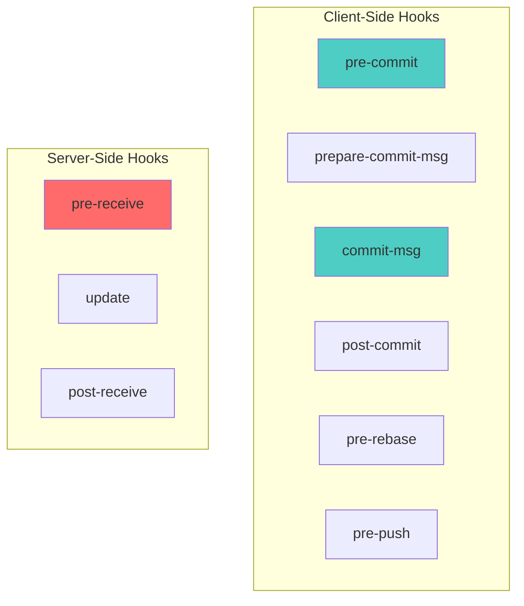
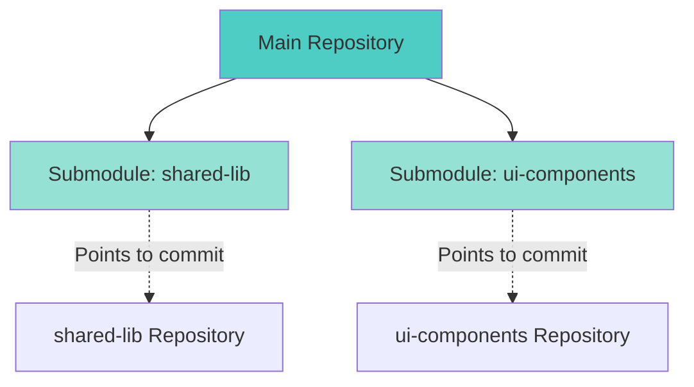
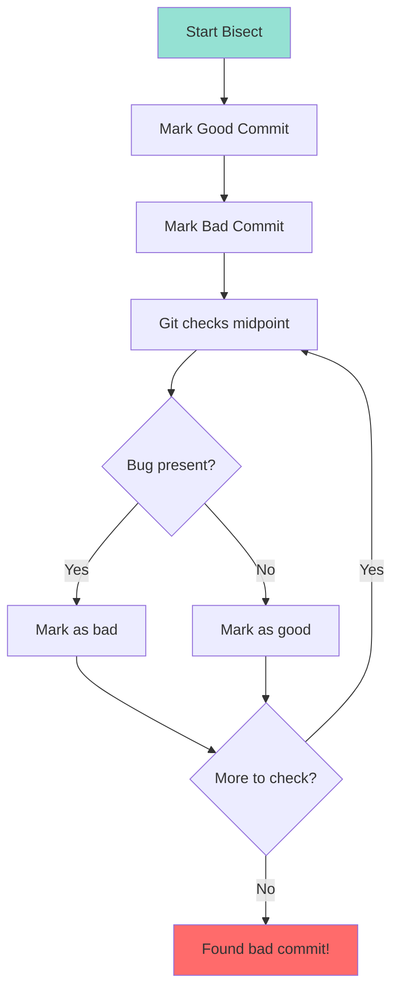

# Part 7: Advanced Git Techniques

## Table of Contents
- [Git Hooks](#git-hooks)
- [Submodules](#submodules)
- [Subtrees](#subtrees)
- [Git Bisect](#git-bisect)
- [Git Reflog](#git-reflog)
- [Git Stash](#git-stash)
- [Cherry-Picking](#cherry-picking)
- [Patch Management](#patch-management)
- [Git Worktrees](#git-worktrees)
- [Advanced Git Internals](#advanced-git-internals)

---

## Git Hooks

**Git hooks** are scripts that run automatically when certain Git events occur.

### Hook Types



### Client-Side Hooks

#### 1. pre-commit

Runs before commit is created. Use for linting, testing.

```bash
# .git/hooks/pre-commit
#!/bin/bash

echo "Running pre-commit checks..."

# Run linter
npm run lint
if [ $? -ne 0 ]; then
    echo "❌ Linting failed. Commit aborted."
    exit 1
fi

# Run tests
npm test
if [ $? -ne 0 ]; then
    echo "❌ Tests failed. Commit aborted."
    exit 1
fi

echo "✅ Pre-commit checks passed!"
exit 0
```

```bash
# Make executable
chmod +x .git/hooks/pre-commit

# Test it
git commit -m "test"
# Runs linter and tests first
```

#### 2. prepare-commit-msg

Modify commit message before editor opens.

```bash
# .git/hooks/prepare-commit-msg
#!/bin/bash

COMMIT_MSG_FILE=$1
COMMIT_SOURCE=$2

# Add issue number from branch name
BRANCH_NAME=$(git symbolic-ref --short HEAD)
ISSUE_NUMBER=$(echo $BRANCH_NAME | grep -oP '(?<=issue-)\d+')

if [ -n "$ISSUE_NUMBER" ]; then
    echo "Closes #$ISSUE_NUMBER" >> $COMMIT_MSG_FILE
fi
```

#### 3. commit-msg

Validate commit message format.

```bash
# .git/hooks/commit-msg
#!/bin/bash

COMMIT_MSG_FILE=$1
COMMIT_MSG=$(cat $COMMIT_MSG_FILE)

# Conventional Commits format
PATTERN="^(feat|fix|docs|style|refactor|test|chore)(\(.+\))?: .+"

if ! echo "$COMMIT_MSG" | grep -qE "$PATTERN"; then
    echo "❌ Invalid commit message format!"
    echo "Expected: type(scope): description"
    echo "Example: feat(auth): add OAuth  login"
    exit 1
fi

echo "✅ Commit message format valid"
exit 0
```

#### 4. pre-push

Run before pushing to remote.

```bash
# .git/hooks/pre-push
#!/bin/bash

echo "Running pre-push checks..."

# Prevent pushing to main directly
protected_branch='main'
current_branch=$(git symbolic-ref HEAD | sed -e 's,.*/\(.*\),\1,')

if [ $current_branch = $protected_branch ]; then
    echo "❌ Direct push to $protected_branch is not allowed!"
    echo "Use a feature branch and create a merge request."
    exit 1
fi

# Run full test suite
npm run test:all
if [ $? -ne 0 ]; then
    echo "❌ Full test suite failed. Push aborted."
    exit 1
fi

echo "✅ Pre-push checks passed!"
exit 0
```

### Server-Side Hooks

#### 1. pre-receive

Runs before any ref updates occur.

```bash
# hooks/pre-receive (on GitLab server)
#!/bin/bash

# Prevent force push to main
while read oldrev newrev refname; do
    if [ "$refname" = "refs/heads/main" ]; then
        # Check if it's a force push
        if ! git merge-base --is-ancestor $oldrev $newrev; then
            echo "❌ Force push to main is not allowed!"
            exit 1
        fi
    fi
done

exit 0
```

#### 2. post-receive

Runs after successful push. Use for deployments, notifications.

```bash
# hooks/post-receive
#!/bin/bash

# Deploy on push to main
while read oldrev newrev refname; do
    if [ "$refname" = "refs/heads/main" ]; then
        echo "Deploying to production..."
        /usr/local/bin/deploy-production.sh
    elif [ "$refname" = "refs/heads/develop" ]; then
        echo "Deploying to staging..."
        /usr/local/bin/deploy-staging.sh
    fi
done
```

### Managing Hooks in Teams

Since `.git/hooks` isn't version controlled:

**Option 1: Hooks in repository**

```bash
# Store hooks in versioned directory
mkdir -p .githooks

# Create hook
cat > .githooks/pre-commit << 'EOF'
#!/bin/bash
npm run lint && npm test
EOF

chmod +x .githooks/pre-commit

# Configure Git to use this directory
git config core.hooksPath .githooks

# Team members run:
git config core.hooksPath .githooks
```

**Option 2: Husky (Node.js)**

```bash
# Install Husky
npm install husky --save-dev
npx husky install

# Create hook
npx husky add .husky/pre-commit "npm run lint"
npx husky add .husky/pre-push "npm test"

# Hooks are now versioned in .husky/
```

---

## Submodules

**Submodules** allow you to keep a Git repository as a subdirectory of another Git repository.

### Use Cases

- Shared library across multiple projects
- Third-party dependencies
- Vendoring dependencies

### Submodule Workflow



### Adding Submodules

```bash
# Add submodule
git submodule add https://github.com/user/shared-lib.git libs/shared-lib

# Creates:
# - libs/shared-lib/ (submodule directory)
# - .gitmodules (submodule configuration)

# Commit
git commit -m "Add shared-lib submodule"
```

### Cloning with Submodules

```bash
# Clone and initialize submodules
git clone --recursive https://github.com/user/main-project.git

# Or if already cloned:
git submodule init
git submodule update

# Or combined:
git submodule update --init --recursive
```

### Updating Submodules

```bash
# Update to latest commit on tracked branch
cd libs/shared-lib
git pull origin main
cd ../..

# Commit the update
git add libs/shared-lib
git commit -m "Update shared-lib to latest version"

# Or update all submodules:
git submodule update --remote --merge
```

### Working with Submodules

```bash
# Make changes in submodule
cd libs/shared-lib
git checkout -b feature/new-function
# Make changes
git commit -am "Add new function"
git push origin feature/new-function

# Update main project to use new commit
cd ../..
git add libs/shared-lib
git commit -m "Use shared-lib with new function"
```

### Removing Submodules

```bash
# Remove submodule
git submodule deinit libs/shared-lib
git rm libs/shared-lib
rm -rf .git/modules/libs/shared-lib

git commit -m "Remove shared-lib submodule"
```

---

## Subtrees

**Subtrees** are an alternative to submodules, merging external repository into a subdirectory.

### Subtree vs Submodule

| Aspect | Submodule | Subtree |
|--------|-----------|---------|
| **Complexity** | More complex | Simpler |
| **Commits** | Separate | Merged into parent |
| **Cloning** | Requires `--recursive` | Normal clone |
| **Updates** | Manual | Manual or automatic |
| **History** | Separate | Combined |
| **Best for** | Independent repos | Vendor dependencies |

### Adding Subtree

```bash
# Add remote
git remote add shared-lib-remote https://github.com/user/shared-lib.git

# Add subtree
git subtree add --prefix=libs/shared-lib shared-lib-remote main --squash

# --squash: Don't import entire history
```

### Updating Subtree

```bash
# Pull updates
git subtree pull --prefix=libs/shared-lib shared-lib-remote main --squash
```

### Push Changes Back

```bash
# Make changes in libs/shared-lib
git add libs/shared-lib
git commit -m "Update shared functions"

# Push to subtree repository
git subtree push --prefix=libs/shared-lib shared-lib-remote feature/updates
```

### Extracting Subtree

```bash
# Extract files/history to new repository
git subtree split --prefix=libs/shared-lib -b split-branch

# Create new repository
mkdir ../new-shared-lib
cd ../new-shared-lib
git init
git pull ../old-project split-branch
```

---

## Git Bisect

**Git bisect** uses binary search to find which commit introduced a bug.

### Bisect Workflow



### Manual Bisect

```bash
# Start bisect
git bisect start

# Mark current commit as bad (bug exists)
git bisect bad

# Mark old commit as good (bug doesn't exist)
git bisect good v1.0.0

# Git checks out midpoint commit
# Test if bug exists
npm test

# If bug exists:
git bisect bad

# If bug doesn't exist:
git bisect good

# Repeat until Git finds the first bad commit
# Output: abc1234 is the first bad commit

# End bisect
git bisect reset
```

### Automated Bisect

```bash
# Start bisect with known good/bad
git bisect start HEAD v1.0.0

# Run automated test
git bisect run npm test

# Git automatically finds bad commit
# Output: abc1234 is the first bad commit

git bisect reset
```

### Bisect Script Example

```bash
# test-script.sh
#!/bin/bash

# Build
npm run build

# Run specific test
npm test -- --grep "payment processing"

# Exit code 0 = good, 1 = bad
```

```bash
# Run bisect with script
git bisect start HEAD v1.0.0
git bisect run ./test-script.sh
git bisect reset
```

---

## Git Reflog

**Reflog** (reference log) records all changes to HEAD and branch tips. It's your safety net!

### Viewing Reflog

```bash
# View reflog
git reflog

# Output:
# abc1234 HEAD@{0}: commit: Add feature
# def5678 HEAD@{1}: checkout: moving from main to feature
# ghi9012 HEAD@{2}: commit: Fix bug
# jkl3456 HE AD@{3}: reset: moving to HEAD~1

# Reflog for specific branch
git reflog show main

# Reflog with dates
git reflog --date=relative
```

### Recovery Scenarios

#### Scenario 1: Undo Hard Reset

```bash
# Oops! Hard reset deleted commits
git reset --hard HEAD~3

# Find lost commits in reflog
git reflog
# abc1234 HEAD@{1}: reset: moving to HEAD~3
# def5678 HEAD@{0}: commit: Important changes (LOST)

# Recover
git reset --hard HEAD@{1}
# Or
git reset --hard def5678
```

#### Scenario 2: Recover Deleted Branch

```bash
# Deleted branch
git branch -D feature-important

# Find branch in reflog
git reflog | grep feature-important
# abc1234 HEAD@{5}: checkout: moving from feature-important to main

# Recover branch
git checkout -b feature-important abc1234
```

#### Scenario 3: Recover from Bad Rebase

```bash
# Rebase went wrong
git rebase main
# Conflicts, confusion, mess...
git rebase --abort

# Or if you already completed bad rebase:
git reflog
# Find commit before rebase
git reset --hard HEAD@{5}
```

### Reflog Expiration

```bash
# Reflog entries expire after 90 days (default)
# Unreachable entries expire after 30 days

# View expiration settings
git config --get-regexp 'gc.reflogExpire'

# Change expiration
git config gc.reflogExpire 180.days
git config gc.reflogExpireUnreachable 60.days

# Never expire (not recommended)
git config gc.reflogExpire never
```

---

## Git Stash

**Stash** temporarily saves uncommitted changes.

### Basic Stash Operations

```bash
# Save current changes
git stash

# Or with message
git stash save "WIP: adding user authentication"

# List stashes
git stash list
# stash@{0}: WIP: adding user authentication
# stash@{1}: On main: Quick fix

# Apply latest stash (keeps in stash list)
git stash apply

# Apply specific stash
git stash apply stash@{1}

# Pop latest stash (removes from stash list)
git stash pop

# Delete stash
git stash drop stash@{0}

# Clear all stashes
git stash clear
```

### Advanced Stash

```bash
# Stash including untracked files
git stash -u

# Stash including ignored files
git stash -a

# Stash with patch mode (interactive)
git stash -p

# Create branch from stash
git stash branch feature/stashed-work stash@{0}
```

### Stash Scenarios

#### Scenario 1: Switch Branches Mid-Work

```bash
# Working on feature, need to fix urgent bug
git stash -u

git checkout main
git checkout -b hotfix/urgent-bug
# Fix bug
git commit -am "Fix urgent bug"

# Back to feature work
git checkout feature-branch
git stash pop
```

#### Scenario 2: Partial Stash

```bash
# Stash only specific files
git stash push -m "Stash config changes" config/settings.js

# Stash everything except specific files
git stash push -k  # Keep staged changes
```

#### Scenario 3: View Stash Contents

```bash
# Show stash contents
git stash show

# Show full diff
git stash show -p stash@{0}
```

---

## Cherry-Picking

**Cherry-pick** applies specific commits from one branch to another.

### Basic Cherry-Pick

```bash
# Apply commit to current branch
git cherry-pick abc1234

# Cherry-pick multiple commits
git cherry-pick abc1234 def5678 ghi9012

# Cherry-pick range
git cherry-pick abc1234..ghi9012
```

### Cherry-Pick Scenarios

#### Scenario 1: Bug Fix to Multiple Branches

```bash
# Fix bug on develop
git checkout develop
git commit -m "fix: resolve payment bug"
# Commit: abc1234

# Apply to main
git checkout main
git cherry-pick abc1234

# Apply to release branch
git checkout release/1.5
git cherry-pick abc1234
```

#### Scenario 2: Selective Feature Extraction

```bash
# Feature branch has 5 commits, you want only 2
git log feature/big-feature --oneline
# abc1234 Add user service
# def5678 Add user controller
# ghi9012 Add user tests
# jkl3456 Add documentation
# mno7890 Add analytics

# Cherry-pick only user service and controller
git checkout main
git cherry-pick abc1234 def5678
```

### Cherry-Pick Options

```bash
# Cherry-pick without committing
git cherry-pick --no-commit abc1234

# Edit commit message
git cherry-pick --edit abc1234

# Sign off commit
git cherry-pick --sign off abc1234

# Cherry-pick resolving conflicts
git cherry-pick abc1234
# CONFLICT!
# Resolve conflicts
git add resolved-files
git cherry-pick --continue

# Abort cherry-pick
git cherry-pick --abort
```

---

## Patch Management

**Patches** are diffs that can be applied to other repositories.

### Creating Patches

```bash
# Create patch from last commit
git format-patch -1

# Output: 0001-Add-user-authentication.patch

# Create patch from last 3 commits
git format-patch -3

# Create patches from range
git format-patch abc1234..def5678

# Create patch for entire branch
git format-patch main..feature-branch
```

### Applying Patches

```bash
# Apply patch
git apply 0001-Add-user-authentication.patch

# Check if patch can be applied
git apply --check 0001-Add-user-authentication.patch

# Apply patch and create commit (like cherry-pick)
git am 0001-Add-user-authentication.patch

# Apply patch series
git am *.patch
```

### Patch Use Cases

#### Use Case 1: Share Changes Without Pushing

```bash
# Create patch
git format-patch -1 HEAD

# Email patch to colleague
# Colleague applies:
git am 0001-Feature.patch
```

#### Use Case 2: Contributing to Email-Based Projects

```bash
# Linux kernel for example
git format-patch -1 --to=maintainer@example.com
git send-email 0001-Fix-bug.patch
```

---

## Git Worktrees

**Worktrees** allow multiple working directories for one repository.

### Why Worktrees?

- Test feature branch while working on another
- Run CI/CD locally on multiple branches
- Compare code between branches
- No need to stash or commit WIP

### Worktree Commands

```bash
# List worktrees
git worktree list

# Add worktree
git worktree add ../project-feature feature/new-feature

# Now you have two directories:
# project/ (main branch)
# project-feature/ (feature/new-feature branch)

# Work in parallel
cd project           # Work on main
cd ../project-feature # Work on feature

# Remove worktree
git worktree remove ../project-feature

# Or
cd project
git worktree prune
```

### Worktree Scenarios

#### Scenario 1: Urgent Fix While Developing

```bash
# Working on feature
cd ~/project
# Changes not ready to commit

# Urgent fix needed
git worktree add ../project-hotfix main
cd ../project-hotfix
# Fix bug
git commit -am "hotfix: critical bug"
git push

# Back to feature work
cd ~/project
# Your changes still intact!

# Later, remove worktree
git worktree remove ../project-hotfix
```

#### Scenario 2: Compare Branches

```bash
# Add worktrees for comparison
git worktree add ../project-v1 release/1.0
git worktree add ../project-v2 release/2.0

# Compare side by side
code ../project-v1
code ../project-v2
```

---

## Advanced Git Internals

### Git Object Types

```bash
# Find object type
git cat-file -t abc1234
# Output: commit, tree, blob, or tag

# View object contents
git cat-file -p abc1234

# View size
git cat-file -s abc1234
```

### Inspecting Objects

```bash
# View commit object
git cat-file -p HEAD

# View tree (directory structure)
git cat-file -p HEAD^{tree}

# View blob (file contents)
git cat-file -p HEAD:README.md
```

### Git Pack Files

```bash
# Optimize repository
git gc

# Aggressive optimization
git gc --aggressive --prune=now

# Count objects
git count-objects -v
```

### Finding Large Files

```bash
# Find largest files in repository history
git rev-list --objects --all |
  git cat-file --batch-check='%(objecttype) %(objectname) %(objectsize) %(rest)' |
  sed -n 's/^blob //p' |
  sort --numeric-sort --key=2 |
  tail -n 10
```

---

## Key Takeaways

1. **Git hooks** - Automate workflows and enforce standards
2. **Submodules/Subtrees** - Manage dependencies and shared code
3. **Git bisect** - Find bugs with binary search
4. **Reflog** - Your safety net, recover anything
5. **Stash** - Temporarily save work without committing
6. **Cherry-pick** - Selectively apply commits
7. **Patches** - Share changes as files
8. **Worktrees** - Multiple working directories
9. **Internals** - Understanding makes you powerful

---

## What's Next?

In [Part 8: Best Practices & Troubleshooting](./Part8-Best-Practices-Troubleshooting.md), we'll cover:
- Commit message conventions
- Security best practices
- Performance optimization
- Common issues and solutions
- Pro tips and configuration

You now have advanced Git techniques to handle any situation!
