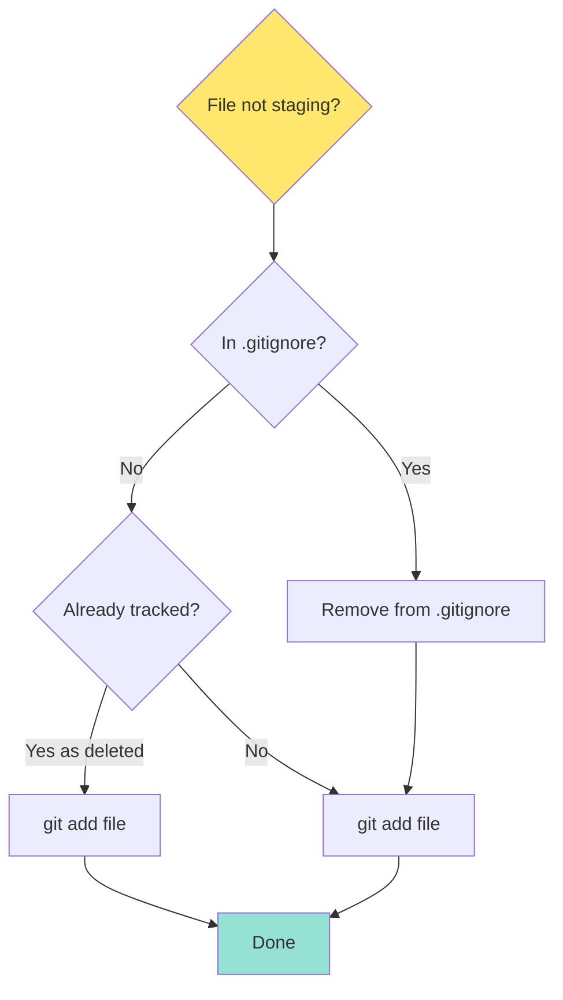
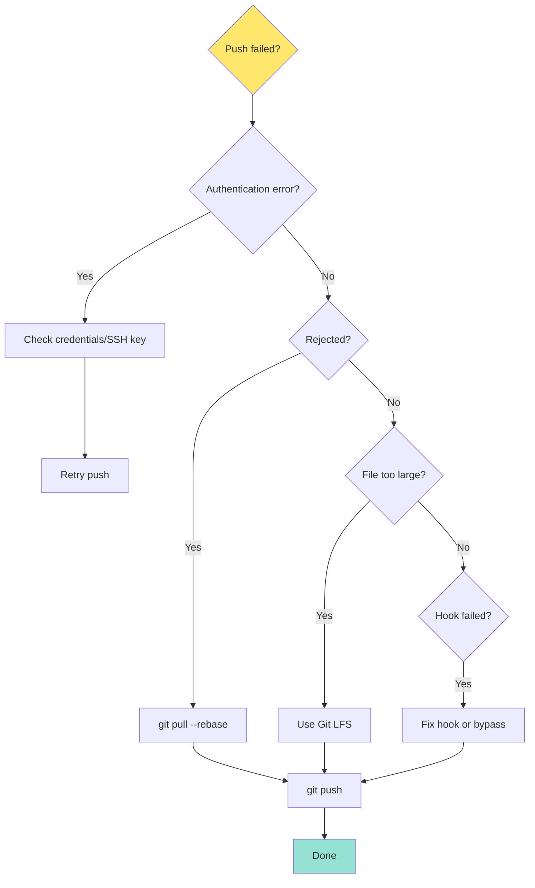
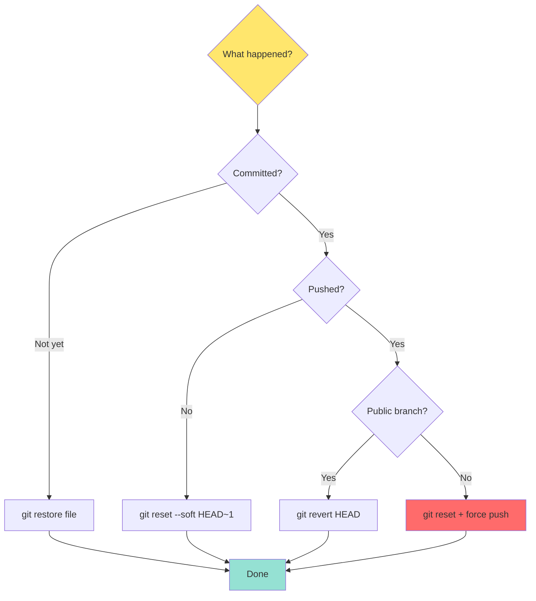

# Part 8: Best Practices & Troubleshooting

## Table of Contents
- [Commit Message Best Practices](#commit-message-best-practices)
- [Branch Naming Strategies](#branch-naming-strategies)
- [Code Review Best Practices](#code-review-best-practices)
- [Security Best Practices](#security-best-practices)
- [Performance Optimization](#performance-optimization)
- [Common Issues and Solutions](#common-issues-and-solutions)
- [Git Configuration Tips](#git-configuration-tips)
- [Troubleshooting Decision Trees](#troubleshooting-decision-trees)

---

## Commit Message Best Practices

### Conventional Commits

The **Conventional Commits** specification provides a standardized format:

```
<type>(<scope>): <subject>

<body>

<footer>
```

#### Types

| Type | Description | Example |
|------|-------------|---------|
| `feat` | New feature | `feat(auth): add OAuth login` |
| `fix` | Bug fix | `fix(api): handle null user response` |
| `docs` | Documentation | `docs(readme): update installation steps` |
| `style` | Code style (formatting) | `style(css): fix indentation` |
| `refactor` | Code refactoring | `refactor(db): optimize query performance` |
| `perf` | Performance improvement | `perf(api): add response caching` |
| `test` | Adding tests | `test(auth): add login unit tests` |
| `build` | Build system changes | `build(deps): update webpack to 5.0` |
| `ci` | CI/CD changes | `ci(gitlab): add deployment stage` |
| `chore` | Maintenance tasks | `chore(deps): update dependencies` |
| `revert` | Revert previous commit | `revert: revert "feat: add feature"` |

#### Examples of Good Commits

```bash
# Feature with description
git commit -m "feat(auth): implement two-factor authentication

Add TOTP-based 2FA using speakeasy library.
Users can enable 2FA in account settings.

Closes #234"

# Bug fix with impact
git commit -m "fix(payment): prevent duplicate charges

Adds idempotency key to Stripe API calls.
Prevents duplicate charges when user double-clicks submit.

Fixes #456"

# Breaking change
git commit -m "feat(api)!: change authentication endpoint

BREAKING CHANGE: /auth endpoint moved to /api/v2/auth
Clients must update their API calls.

Migration guide: docs/migration-v2.md"

# Documentation
git commit -m "docs(api): add authentication examples

Add curl and JavaScript examples for all auth endpoints"
```

#### Commit Message Template

Create `.gitmessage` template:

```bash
# ~/.gitmessage
#<type>(<scope>): <subject> (max 50 char)

# <body> (wrap at 72 char)

# <footer>
# Closes #issue
# Breaking change: description
#
# Types: feat, fix, docs, style, refactor, perf, test, build, ci, chore
```

Configure Git:

```bash
git config --global commit.template ~/.gitmessage
```

### Commit Message Anti-Patterns

```bash
# ❌ Bad Examples
git commit -m "fix"
git commit -m "wip"
git commit -m "changes"
git commit -m "asdf"
git commit -m "Fixed stuff"
git commit -m "Updated files"

# ✅ Good Examples
git commit -m "fix(auth): resolve login timeout issue"
git commit -m "feat(dashboard): add real-time updates"
git commit -m "docs(readme): update installation guide"
git commit -m "refactor(api): simplify error handling"
```

---

## Branch Naming Strategies

### Standard Naming Convention

```
<type>/<short-description>
```

#### Types

```bash
# Feature branches
feature/user-authentication
feature/add-dark-mode
feat/oauth-integration

# Bug fixes
bugfix/login-error
bugfix/memory-leak
fix/null-pointer-exception

# Hotfixes (urgent production fixes)
hotfix/security-patch
hotfix/critical-bug

# Release branches (GitFlow)
release/v1.5.0
release/2024-01-15

# Documentation
docs/api-documentation
docs/update-readme

# Experiments/Spikes
experiment/new-architecture
spike/performance-testing

# Refactoring
refactor/database-layer
refactor/cleanup-legacy-code

# Chores/Maintenance
chore/update-dependencies
chore/cleanup-logs
```

### Including Issue Numbers

```bash
# With issue number
feature/234-user-profile
fix/456-payment-error
hotfix/789-security-vuln

# Alternative format
feature/USER-234-profile-page  # Jira-style
fix/GH-456-payment-bug         # GitHub-style
```

### Team-Specific Prefixes

```bash
# With developer name (for personal forks)
john/feature/new-dashboard
alice/fix/login-bug

# With team name
backend/feature/api-v2
frontend/feature/redesign
devops/chore/ci-optimization
```

### Branch Naming Anti-Patterns

```bash
# ❌ Bad
temp
test
new-branch
fix
patch
branch1
johns-branch

# ✅ Good
feature/user-registration
fix/header-alignment
hotfix/xss-vulnerability
refactor/auth-service
```

---

## Code Review Best Practices

### For Authors

#### Before Creating MR

```bash
# Self-review checklist
☑ All tests pass locally
☑ Code follows team style guide
☑ No console.log() or debug code
☑ No commented-out code
☑ Documentation updated
☑ Commit messages clear
☑ Branch up to date with main
☑ MR description complete
```

#### MR Description Template

```markdown
## What does this MR do?
Brief description of changes

## Why was this needed?
Problem being solved

## Changes Made
- Bullet list of key changes
- Be specific but concise

## Testing Done
- Unit tests: ✅
- Integration tests: ✅
- Manual testing: ✅

## Screenshots
(For UI changes)

## Breaking Changes
None / List any breaking changes

## Migration Guide
(If applicable)

## Checklist
- [ ] Tests added/updated
- [ ] Documentation updated
- [ ] No new warnings
- [ ] Backwards compatible

Closes #issue-number
```

### For Reviewers

#### Review Checklist

```markdown
## Functionality
- [ ] Code does what it claims
- [ ] Edge cases handled
- [ ] Error handling appropriate
- [ ] No obvious bugs

## Code Quality
- [ ] Readable and maintainable
- [ ] Follows team conventions
- [ ] No unnecessary complexity
- [ ] Appropriate abstractions
- [ ] No code duplication

## Testing
- [ ] Tests cover happy path
- [ ] Tests cover edge cases
- [ ] Tests are maintainable
- [ ] All tests pass

## Security
- [ ] No hardcoded secrets
- [ ] Input validation present
- [ ] No SQL injection risks
- [ ] Authentication/authorization correct
- [ ] Sensitive data protected

## Performance
- [ ] No obvious performance issues
- [ ] Database queries optimized
- [ ] Appropriate caching
- [ ] No memory leaks

## Documentation
- [ ] Code comments where needed
- [ ] API docs updated
- [ ] README updated if needed
```

#### Providing Feedback

```markdown
# ✅ Good Feedback

## Be Specific
Instead of: "This is confusing"
Say: "The variable name `data` is vague. Consider `userProfileData` to clarify its purpose."

## Be Constructive
Instead of: "This is wrong"
Say: "This approach could cause issues with concurrent requests. Consider using a transaction here."

## Explain Why
Instead of: "Change this"
Say: "Using a Set here would improve lookup performance from O(n) to O(1) for large datasets."

## Acknowledge Good Work
"Great use of dependency injection here! Makes testing much easier."

## Ask Questions
"Could this function throw an error if the API is down? Should we add error handling?"

## Suggest, Don't Command
Instead of: "Do it this way"
Say: "What do you think about extracting this into a separate function for reusability?"
```

### Review Response Time

```bash
# Target response times:
Small MR (< 100 lines):  < 2 hours
Medium MR (100-400 lines): < 4 hours
Large MR (400+ lines):    < 1 day

# If larger than 400 lines, consider:
- Breaking into smaller MRs
- Pair programming review
- Scheduled review session
```

---

## Security Best Practices

### 1. Never Commit Secrets

```bash
# ❌ Never commit:
- API keys
- Passwords
- Private keys
- OAuth tokens
- Database credentials
- SSL certificates

# ✅ Use instead:
- Environment variables
- Secret management tools (Vault, AWS Secrets Manager)
- GitLab CI/CD variables (masked & protected)
```

#### Prevent Secret Commits

```bash
# Install git-secrets
brew install git-secrets

# Set up in repository
git secrets --install
git secrets --register-aws

# Add custom patterns
git secrets --add 'API_KEY\s*=\s*["\047][A-Za-z0-9]{32}["\047]'
git secrets --add 'password\s*=\s*["\047][^"\047]+["\047]'

# Scan before commit (add to pre-commit hook)
git secrets --scan
```

#### .gitignore for Secrets

```bash
# .gitignore
.env
.env.local
.env.*.local
*.pem
*.key
secrets/
config/secrets.yml
credentials.json
```

### 2. Sign Commits with GPG

**Why?** Proves commits actually came from you.

```bash
# Generate GPG key
gpg --full-generate-key

# List keys
gpg --list-secret-keys --keyid-format=long

# Export public key
gpg --armor --export YOUR_KEY_ID

# Add to GitLab: Settings > GPG Keys

# Configure Git
git config --global user.signingkey YOUR_KEY_ID
git config --global commit.gpgsign true

# Sign commits
git commit -S -m "Signed commit"

# Verify signature
git log --show-signature
```

### 3. Protect Branches

```yaml
# GitLab: Settings > Repository > Protected Branches

main:
  - Allowed to merge: Maintainers
  - Allowed to push: No one
  - Allowed to force push: No
  - Require approval: 2 approvals
  - Code owner approval: Required

develop:
  - Allowed to merge: Developers
  - Allowed to push: No one
  - Require approval: 1 approval
```

### 4. Use SSH Keys

```bash
# Generate ED25519 key (recommended)
ssh-keygen -t ed25519 -C "your.email@example.com"

# Or RSA if ED25519 not supported
ssh-keygen -t rsa -b 4096 -C "your.email@example.com"

# Add to SSH agent
eval "$(ssh-agent -s)"
ssh-add ~/.ssh/id_ed25519

# Add public key to GitLab
cat ~/.ssh/id_ed25519.pub | clip

# Test connection
ssh -T git@gitlab.com
```

### 5. Two-Factor Authentication

```bash
# Enable 2FA on GitLab:
# Settings > Account > Two-Factor Authentication

# Use authenticator app:
# - Google Authenticator
# - Authy
# - 1Password

# Save recovery codes securely!
```

### 6. Audit and Compliance

```bash
# View who changed what
git log --all --author="suspicious@email.com"

# Find who introduced secret
git log -S "API_KEY=" --all -p

# Signed commit verification
git verify-commit HEAD

# Show file history with authors
git log --follow --all -- config/database.yml
```

---

## Performance Optimization

### Large Repository Issues

```bash
# Symptoms:
- Slow clone
- Slow fetch/pull
- Large .git directory
- Slow git status
```

#### 1. Shallow Clone

```bash
# Clone with limited history
git clone --depth 1 https://gitlab.com/user/large-repo.git

# Fetch more history later
git fetch --deepen=100

# Convert to full clone
git fetch --unshallow
```

#### 2. Partial Clone

```bash
# Clone without downloading all files
git clone --filter=blob:none https://gitlab.com/user/repo.git

# Only downloads files when accessed
```

#### 3. Sparse Checkout

```bash
# Clone only specific directories
git clone --no-checkout https://gitlab.com/user/repo.git
cd repo
git sparse-checkout init --cone
git sparse-checkout set src/frontend
git checkout main

# Now only src/frontend is in working directory
```

#### 4. Clean Up Repository

```bash
# Remove unreachable objects
git gc --aggressive --prune=now

# Find and remove large files
git filter-repo --strip-blobs-bigger-than 10M

# Or use BFG
java -jar bfg.jar --strip-blobs-bigger-than 10M
```

#### 5. Git LFS (Large File Storage)

```bash
# Install Git LFS
git lfs install

# Track large files
git lfs track "*.psd"
git lfs track "*.mp4"
git lfs track "**/*.zip"

# Now LFS-tracked files are stored externally
git add .gitattributes
git commit -m "Add LFS tracking"

# Check LFS files
git lfs ls-files
```

### Optimize Common Operations

```bash
# Speed up git status
git config --global core.untrackedCache true
git config --global core.fsmonitor true

# Increase diff performance
git config --global diff.algorithm histogram

# Parallel fetch
git config --global fetch.parallel 4

# Commit graph for faster operations
git config --global feature.experimental true
git config --global core.commitGraph true

# Write commit graph
git commit-graph write --reachable
```

---

## Common Issues and Solutions

### Issue 1: Merge Conflict

```bash
# Problem: Merge conflict during merge/rebase

# Solution 1: Manual resolution
git merge feature-branch
# CONFLICT in file.txt

# Edit file.txt, remove markers:
# <<<<<<< HEAD
# =======
# >>>>>>> feature-branch

git add file.txt
git commit

# Solution 2: Use merge tool
git mergetool

# Solution 3: Take one side entirely
git checkout --ours file.txt    # Keep my changes
git checkout --theirs file.txt  # Take their changes
git add file.txt
git commit
```

### Issue 2: Detached HEAD

```bash
# Problem: Checked out commit directly, now in detached HEAD

# Cause:
git checkout abc1234  # Now HEAD points to commit, not branch

# Solution 1: Create branch at current position
git branch new-branch-name
git checkout new-branch-name

# Solution 2: Go back to branch
git checkout main
```

### Issue 3: Accidental Commit to Wrong Branch

```bash
# Problem: Committed to main instead of feature branch

# Solution: Move commit to new branch
git checkout main
git branch feature/my-work    # Create branch at current position
git reset --hard HEAD~1       # Move main back one commit
git checkout feature/my-work  # Switch to feature branch
```

### Issue 4: Need to Undo Last Commit (Not Pushed)

```bash
# Solution 1: Keep changes, undo commit
git reset --soft HEAD~1

# Solution 2: Discard changes entirely
git reset --hard HEAD~1

# Solution 3: Amend commit
git add forgotten-file
git commit --amend --no-edit
```

### Issue 5: Need to Undo Push

```bash
# Problem: Pushed wrong commit to remote

# Solution 1: Revert (safe, creates new commit)
git revert HEAD
git push

# Solution 2: Force push (dangerous if others pulled)
git reset --hard HEAD~1
git push --force-with-lease

# Only use force push if:
# ☑ It's your branch
# ☑ No one else has pulled
# ☑ You're absolutely sure
```

### Issue 6: Large File Rejected

```bash
# Problem: GitLab rejects push due to large file

# error: file too large (100MB limit)

# Solution: Use Git LFS
git lfs install
git lfs track "large-file.zip"
git add .gitattributes
git add large-file.zip
git commit --amend
git push
```

### Issue 7: Authentication Failed

```bash
# Problem: remote: HTTP Basic: Access denied

# Causes & Solutions:

# 1. Wrong credentials
git config credential.helper store
# Next push will prompt for credentials

# 2. Personal Access Token needed
# GitLab > Settings > Access Tokens
# Use PAT as password

# 3. SSH key not added
ssh -T git@gitlab.com
# Add SSH key if needed

# 4. 2FA enabled
# Must use Personal Access Token, not password
```

### Issue 8: Diverged Branches

```bash
# Problem:
# Your branch and 'origin/main' have diverged,
# and have 3 and 5 different commits each

# Solution 1: Merge
git pull origin main
# Resolve conflicts if any

# Solution 2: Rebase
git pull --rebase origin main
# Resolve conflicts if any
git push --force-with-lease

# Prevention: Always pull before push
git pull --rebase && git push
```

### Issue 9: .gitignore Not Working

```bash
# Problem: .gitignore rules not effective

# Cause: Files already tracked before adding to .gitignore

# Solution: Untrack files
git rm --cached file-to-ignore.txt
git rm -r --cached directory-to-ignore/
git commit -m "Untrack ignored files"
git push

# Now .gitignore rules work
```

### Issue 10: Lost Commits

```bash
# Problem: Commits disappeared after bad operation

# Solution: Use reflog
git reflog
# Find commit SHA before bad operation

git reset --hard abc1234
# Or
git cherry-pick abc1234
```

---

## Git Configuration Tips

### Essential Configuration

```bash
# User identity
git config --global user.name "Your Name"
git config --global user.email "your.email@example.com"

# Default branch name
git config --global init.defaultBranch main

# Default editor
git config --global core.editor "code --wait"  # VS Code
git config --global core.editor "vim"          # Vim

# Line ending handling
# Windows
git config --global core.autocrlf true
# macOS/Linux
git config --global core.autocrlf input

# Colors
git config --global color.ui auto

# Pull strategy
git config --global pull.rebase true  # Rebase instead of merge
```

### Useful Aliases

```bash
# Status shorthand
git config --global alias.s status

# Graph log
git config --global alias.lg "log --graph --oneline --all --decorate"

# Pretty log
git config --global alias.hist "log --pretty=format:'%h %ad | %s%d [%an]' --graph --date=short"

# Undo last commit (keep changes)
git config --global alias.undo "reset --soft HEAD~1"

# Amend without editing message
git config --global alias.amend "commit --amend --no-edit"

# Show aliases
git config --global alias.aliases "config --get-regexp ^alias\."

# Stage all changes
git config --global alias.aa "add --all"

# Diff staged changes
git config --global alias.ds "diff --staged"

# Show branches sorted by last modified
git config --global alias.br "branch --sort=-committerdate"

# Checkout shorthand
git config --global alias.co checkout

# Commit shorthand
git config --global alias.ci commit
```

### Pro Tips Configuration

```bash
# Automatically prune deleted remote branches
git config --global fetch.prune true

# Remember conflict resolutions
git config --global rerere.enabled true

# Show more context in diffs
git config --global diff.context 5

# Better diff algorithm
git config --global diff.algorithm histogram

# Default push behavior
git config --global push.default current

# Show original branch name in reflog
git config --global core.logAllRefUpdates true
```

---

## Troubleshooting Decision Trees

### "Git Add" Not Working



### "Git Push" Failing



### Recovering from Mistakes



---

## Quick Reference Card

```bash
### Daily Commands
git status                     # Check status
git add file.txt               # Stage file
git commit -m "message"        # Commit
git push                       # Push to remote
git pull                       # Pull from remote

### Branching
git branch                     # List branches
git branch feature-x           # Create branch
git checkout feature-x         # Switch branch
git merge feature-x            # Merge branch
git branch -d feature-x        # Delete branch

### Undoing
git restore file.txt           # Discard changes
git restore --staged file.txt  # Unstage
git revert HEAD                # Revert commit (safe)
git reset --hard HEAD~1        # Delete last commit (danger!)

### History
git log                        # View history
git log --oneline              # Compact log
git log --graph --all          # Visual graph
git diff                       # Show changes

### Remote
git remote -v                  # List remotes
git fetch                      # Fetch updates
git pull = fetch + merge       # Pull changes

### Stashing
git stash                      # Save work
git stash pop                  # Restore work
git stash list                 # List stashes

### Help
git help command               # Get help
git command --help             # Same
```

---

## Key Takeaways

1. **Follow conventions** - Conventional commits, clear branch names
2. **Review carefully** - Use checklist, be constructive
3. **Secure your repository** - Never commit secrets, use GPG, enable 2FA
4. **Optimize for scale** - Shallow clones, LFS, sparse checkout
5. **Know how to recover** - Reflog is your friend
6. **Configure wisely** - Aliases and settings save time
7. **When in doubt** - Check reflog, don't panic

---

## Conclusion

You've completed the comprehensive Git & GitLab guide! You now have:

✅ **Solid Git fundamentals**  
✅ **Team workflow expertise**  
✅ **GitLab platform knowledge**  
✅ **CI/CD pipeline skills**  
✅ **Real-world problem-solving**  
✅ **Advanced techniques**  
✅ **Best practices**  
✅ **Troubleshooting skills**

### Next Steps

1. **Practice** - Create a test repository and try everything
2. **Implement** - Apply these practices in your team
3. **Teach** - Share knowledge with colleagues
4. **Contribute** - Contribute to open-source projects
5. **Stay Updated** - Git and GitLab evolve, keep learning

### Final Tips

- **Commit often** - Small, focused commits
- **Pull/Push regularly** - Stay in sync
- **Use branches** - Experiment safely
- **Review code** - Improve quality
- **Automate** - CI/CD saves time
- **Document** - Future you will thank you
- **Backup** - Your reflog expires eventually

**Happy coding with Git and GitLab!** 🚀💻

---

**Return to:** [README](./README.md) | [Part 1](./Part1-Git-Fundamentals.md) | [Part 7](./Part7-Advanced-Git-Techniques.md)
