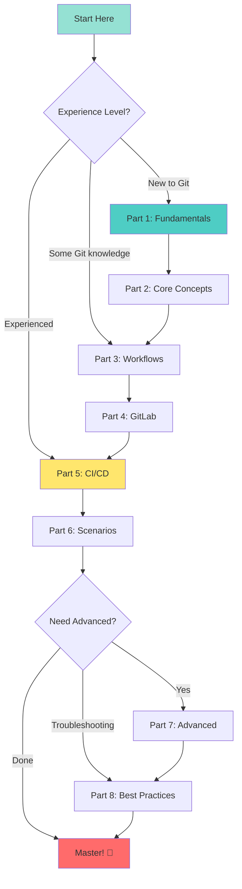

# Git & GitLab Comprehensive Guide

A complete, production-ready guide to Git and GitLab for real-world application development.

---

## 📚 Table of Contents

### Core Git Concepts

**[Part 1: Git Fundamentals](./Part1-Git-Fundamentals.md)**
- What is version control and why it matters
- Git architecture and internal workings
- Installation and configuration
- Basic commands and workflows
- Understanding the three-state architecture

**[Part 2: Git Core Concepts](./Part2-Git-Core-Concepts.md)**
- Understanding commits and commit history
- Working with branches effectively
- Tags and versioning strategies
- Merging strategies (fast-forward, three-way, squash)
- Rebasing and interactive rebase
- Handling merge conflicts like a pro

**[Part 3: Git Workflows](./Part3-Git-Workflows.md)**
- GitFlow workflow (enterprise releases)
- GitHub Flow (continuous deployment)
- Trunk-Based Development (high-velocity teams)
- Feature Branch workflow
- Forking workflow (open-source)
- Choosing the right workflow for your team

### GitLab Platform

**[Part 4: GitLab Introduction](./Part4-GitLab-Introduction.md)**
- GitLab platform overview and editions
- Projects, groups, and hierarchies
- Repository management and protected branches
- Merge requests and code review process
- Issues, boards, and project management
- Wiki and documentation

**[Part 5: GitLab CI/CD](./Part5-GitLab-CICD.md)**
- CI/CD fundamentals and best practices
- Pipeline configuration (`.gitlab-ci.yml`)
- Jobs, stages, and dependencies
- Variables and secrets management
- Artifacts and caching strategies
- Runners and executors
- Advanced pipeline patterns
- Environments and deployment strategies

### Practical Application

**[Part 6: Real-World Scenarios](./Part6-Real-World-Scenarios.md)**
- Complete feature development workflow
- Emergency hotfix procedures
- Release management and versioning
- Removing sensitive data from history
- Contributing to open-source projects
- Monorepo management strategies
- Team onboarding best practices
- Undoing mistakes safely
- Code review excellence
- VCS migration guides

**[Part 7: Advanced Git Techniques](./Part7-Advanced-Git-Techniques.md)**
- Git hooks (client-side and server-side)
- Submodules and subtrees
- Git bisect for bug hunting
- Git reflog for recovery
- Git stash for temporary work
- Cherry-picking commits
- Patch management
- Git worktrees
- Advanced Git internals

**[Part 8: Best Practices & Troubleshooting](./Part8-Best-Practices-Troubleshooting.md)**
- Commit message conventions
- Branch naming strategies
- Code review best practices
- Security best practices (GPG signing, secrets management)
- Performance optimization for large repos
- Common issues and solutions
- Git configuration tips and aliases
- Troubleshooting decision trees

---

## 🚀 Getting Started

### Prerequisites

- Basic command-line knowledge
- Text editor or IDE
- Git installed locally ([download](https://git-scm.com/downloads))
- GitLab account (free at [gitlab.com](https://gitlab.com))

### Quick Start

```bash
# Install Git
# macOS
brew install git

# Ubuntu/Debian
sudo apt install git

# Windows
winget install Git.Git

# Verify installation
git --version

# Configure Git
git config --global user.name "Your Name"
git config --global user.email "your.email@example.com"

# Create your first repository
mkdir my-project
cd my-project
git init
echo "# My Project" > README.md
git add README.md
git commit -m "Initial commit"
```

---

## 📖 How to Use This Guide

### For Beginners

Start from Part 1 and progress sequentially:

1. **Part 1** - Learn Git basics and core commands
2. **Part 2** - Master branches, merging, and conflicts
3. **Part 3** - Choose a team workflow
4. **Part 4** - Set up GitLab projects
5. **Part 5** - Automate with CI/CD
6. **Part 6** - Practice with real scenarios

### For Experienced Developers

Jump to specific topics:

- **Need CI/CD?** → [Part 5: GitLab CI/CD](./Part5-GitLab-CICD.md)
- **Workflow questions?** → [Part 3: Git Workflows](./Part3-Git-Workflows.md)
- **Troubleshooting?** → [Part 8: Best Practices & Troubleshooting](./Part8-Best-Practices-Troubleshooting.md)
- **Real-world help?** → [Part 6: Real-World Scenarios](./Part6-Real-World-Scenarios.md)

### For Teams

Essential reading for your team:

1. **Choose your workflow** - [Part 3](./Part3-Git-Workflows.md)
2. **Set up GitLab** - [Part 4](./Part4-GitLab-Introduction.md)
3. **Configure CI/CD** - [Part 5](./Part5-GitLab-CICD.md)
4. **Establish practices** - [Part 8](./Part8-Best-Practices-Troubleshooting.md)

---

## 🎯 What This Guide Covers

### ✅ Included

- **Complete Git fundamentals** from basics to advanced
- **All major Git workflows** with decision guidance
- **GitLab platform** features and best practices
- **Production-ready CI/CD** pipelines and patterns
- **Real-world scenarios** with step-by-step solutions
- **Security best practices** for code and credentials
- **Troubleshooting guides** for common issues
- **Visual diagrams** using Mermaid for clarity
- **Practical examples** you can copy and adapt

### ❌ Not Included

- GitHub-specific features (focus is on GitLab)
- Every possible Git command (we focus on practical use)
- Programming language-specific details
- Infrastructure setup details (servers, DNS, etc.)

---

## 🔍 Quick Reference

### Essential Git Commands

```bash
# Repository
git init                          # Initialize repository
git clone <url>                   # Clone repository
git status                        # Check status

# Changes
git add <file>                    # Stage file
git commit -m "message"           # Commit changes
git push                          # Push to remote
git pull                          # Pull from remote

# Branches
git branch <name>                 # Create branch
git checkout <branch>             # Switch branch
git merge <branch>                # Merge branch

# History
git log                           # View history
git diff                          # Show changes

# Undo
git restore <file>                # Discard changes
git revert <commit>               # Revert commit (safe)
git reset --hard <commit>         # Reset to commit (dangerous)
```

### GitLab CI/CD Basics

```yaml
# .gitlab-ci.yml
stages:
  - build
  - test
  - deploy

build_job:
  stage: build
  script:
    - npm install
    - npm run build
  artifacts:
    paths:
      - dist/

test_job:
  stage: test
  script:
    - npm test

deploy_job:
  stage: deploy
  script:
    - ./deploy.sh
  only:
    - main
  when: manual
```

---

## 💡 Best Practices Highlights

### Commit Messages

```bash
# Good
git commit -m "feat: add user authentication with OAuth2"
git commit -m "fix: resolve null pointer in payment service"
git commit -m "docs: update API documentation"

# Bad
git commit -m "fix"
git commit -m "changes"
git commit -m "asdf"
```

### Branch Naming

```bash
# Good
feature/user-authentication
bugfix/login-error
hotfix/security-patch
release/v1.5 .0

# Bad
fix
temp
new-branch
```

### Workflow

```bash
# 1. Always start from latest main
git checkout main
git pull

# 2. Create feature branch
git checkout -b feature/new-feature

# 3. Make small, atomic commits
git add file1
git commit -m "add feature part 1"

# 4. Push early and often
git push -u origin feature/new-feature

# 5. Create merge request for review
# 6. Address feedback  
# 7. Merge when approved
# 8. Delete branch after merge
```

---

## 🛠️ Troubleshooting

### Common Issues Quick Fixes

**Merge conflict:**
```bash
# Open conflicted files, resolve manually
git add <resolved-files>
git commit
```

**Pushed wrong commit:**
```bash
git revert <commit-sha>  # Creates new commit undoing changes
git push
```

**Need to undo local changes:**
```bash
git restore <file>        # Discard unstaged changes
git restore --staged <file>  # Unstage changes
git reset --hard HEAD     # Discard ALL changes (careful!)
```

**Forgot to create branch:**
```bash
git stash                 # Save changes
git checkout -b new-branch
git stash pop             # Restore changes
```

---

## 📚 Additional Resources

### Official Documentation

- **Git**: [git-scm.com/doc](https://git-scm.com/doc)
- **GitLab**: [docs.gitlab.com](https://docs.gitlab.com)
- **Git Book**: [git-scm.com/book](https://git-scm.com/book/en/v2)

### Interactive Learning

- **Learn Git Branching**: [learngitbranching.js.org](https://learngitbranching.js.org)
- **GitLab Learn**: [about.gitlab.com/learn](https://about.gitlab.com/learn)

### Cheat Sheets

- **Git Cheat Sheet**: [education.github.com/git-cheat-sheet](https://education.github.com/git-cheat-sheet-education.pdf)
- **GitLab CI/CD**: [docs.gitlab.com/ee/ci/yaml](https://docs.gitlab.com/ee/ci/yaml/)

---

## 🤝 Contributing to This Guide

Found an error? Want to add a scenario? Contributions welcome!

1. Fork this repository
2. Create a feature branch
3. Make your changes
4. Submit a merge request

---

## 📜 License

This guide is provided as-is for educational purposes. Examples and code snippets are free to use.

---

## ✨ What Makes This Guide Different?

- **Production-ready**: Real-world examples you can actually use
- **Comprehensive**: Covers basics to advanced in one place
- **Visual**: Mermaid diagrams for complex concepts
- **Practical**: Step-by-step scenarios with actual commands
- **Up-to-date**: Modern Git and GitLab features
- **Decision guidance**: Helps you choose the right approach
- **Troubleshooting**: Solutions to common problems

---

## 🗺️ Learning Path



---

## 🎓 After Completing This Guide

You'll be able to:

✅ Use Git confidently for version control  
✅ Choose and implement team workflows  
✅ Manage GitLab projects professionally  
✅ Create and maintain CI/CD pipelines  
✅ Handle real-world scenarios and emergencies  
✅ Implement security and best practices  
✅ Troubleshoot common Git issues  
✅ Contribute to open-source projects  
✅ Lead your team's Git adoption  

---

## 📞 Need Help?

- **GitLab Community**: [forum.gitlab.com](https://forum.gitlab.com)
- **Git Questions**: [stackoverflow.com/questions/tagged/git](https://stackoverflow.com/questions/tagged/git)
- **GitLab Issues**: [gitlab.com/gitlab-org/gitlab/-/issues](https://gitlab.com/gitlab-org/gitlab/-/issues)

---

**Ready to master Git and GitLab? Start with [Part 1: Git Fundamentals](./Part1-Git-Fundamentals.md)!**

Happy coding! 💻🚀
