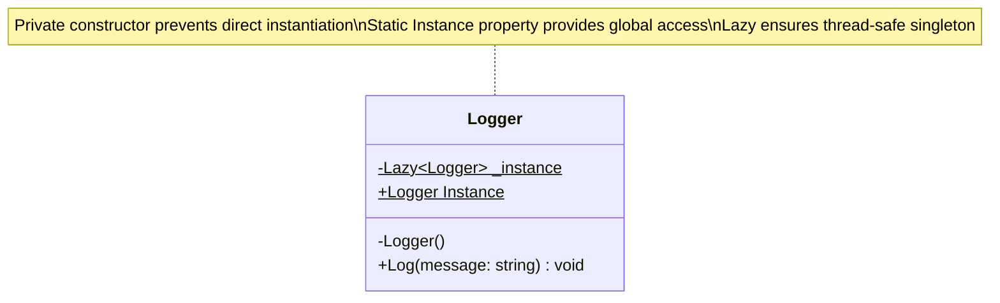
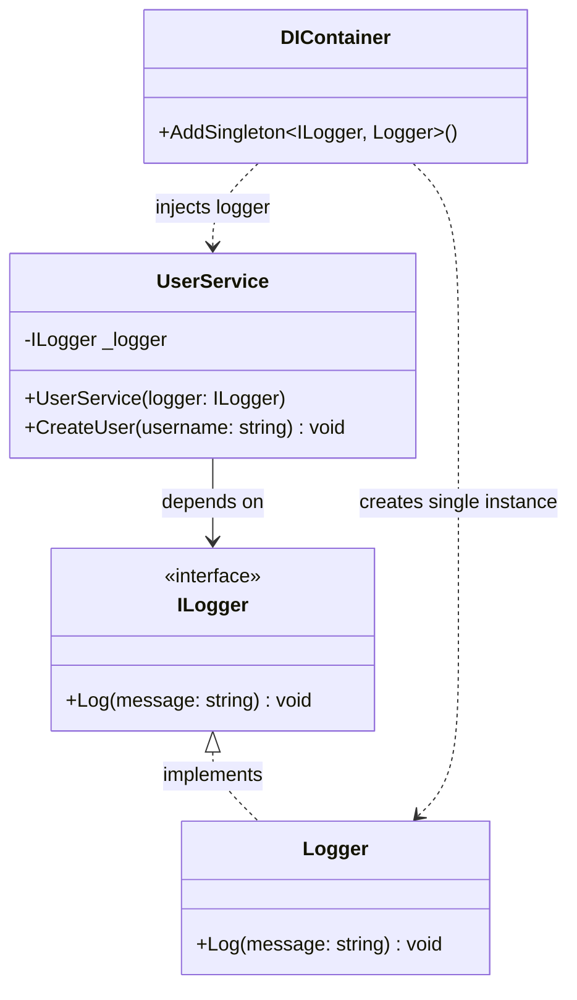
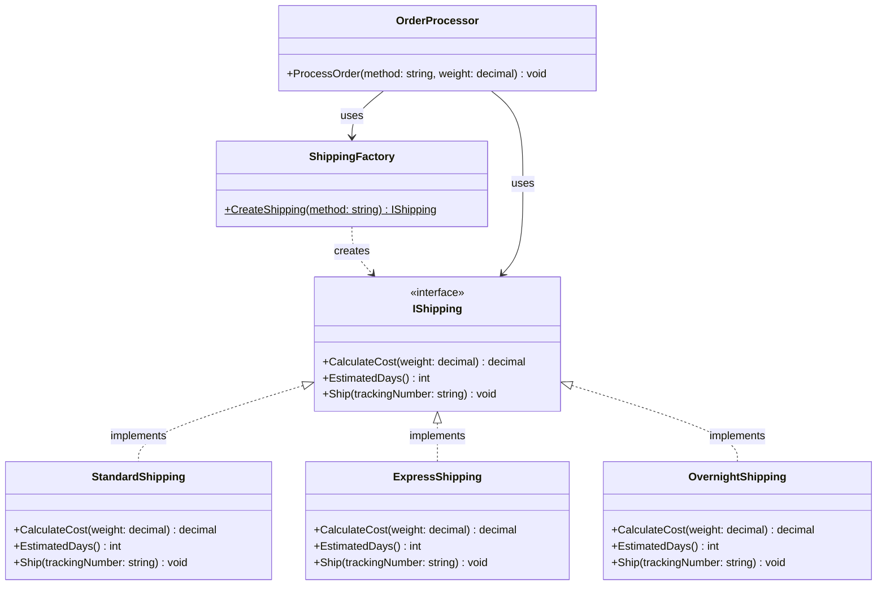
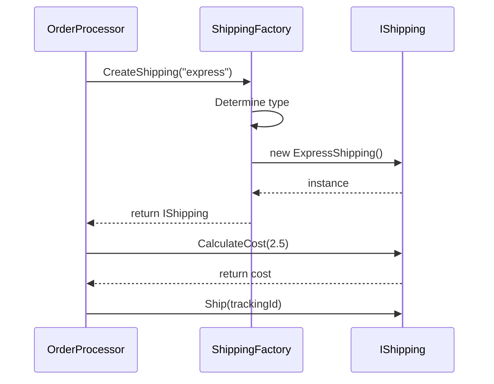
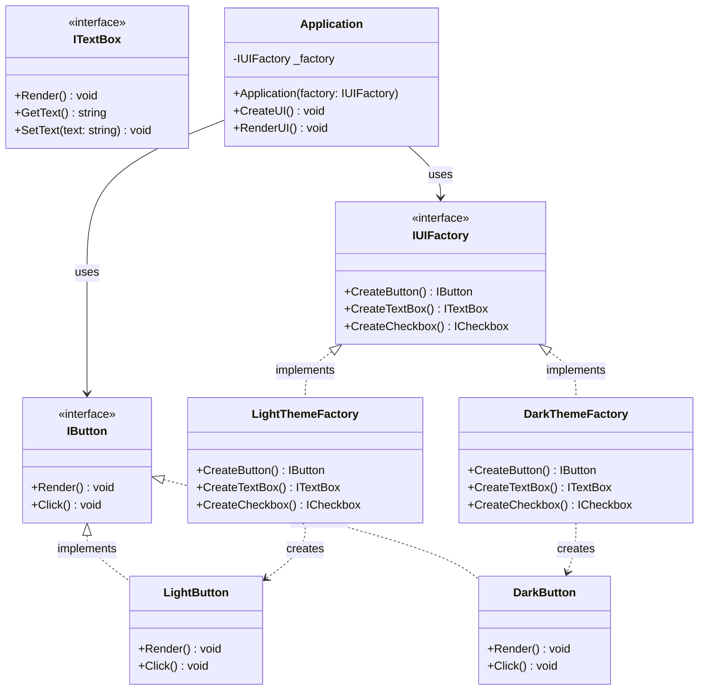
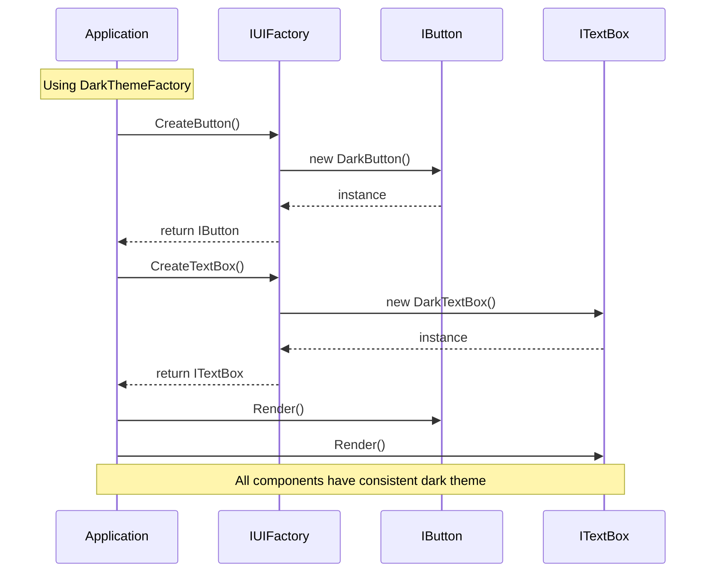
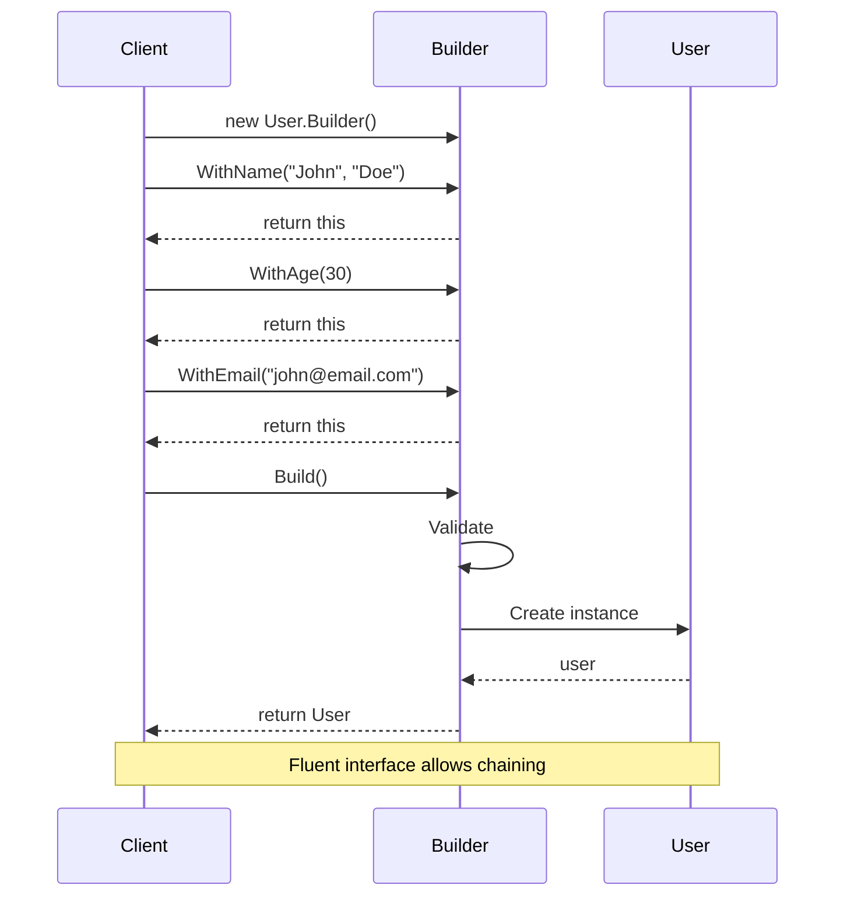

# Low-Level Design Guide for C# - Part 2: Creational Design Patterns

## Table of Contents
- [Introduction to Design Patterns](#introduction-to-design-patterns)
- [Singleton Pattern](#singleton-pattern)
- [Factory Method Pattern](#factory-method-pattern)
- [Abstract Factory Pattern](#abstract-factory-pattern)
- [Builder Pattern](#builder-pattern)
- [Prototype Pattern](#prototype-pattern)
- [Summary](#summary)

---

## Introduction to Design Patterns

**Design patterns** are reusable solutions to common problems in software design. They're like templates that you can customize to solve recurring design problems.

### Categories of Design Patterns

1. **Creational** (this part): Object creation mechanisms
2. **Structural** (Part 3): Object composition and relationships
3. **Behavioral** (Part 4): Object collaboration and responsibilities

### Why Learn Design Patterns?

- **Common vocabulary**: "Use a Factory" is clearer than explaining the concept
- **Proven solutions**: Battle-tested approaches to common problems
- **Better design**: Leads to more maintainable and scalable code
- **Interview prep**: Frequently asked in technical interviews

---

## Singleton Pattern

> **Ensures a class has only one instance and provides a global point of access to it**

### When to Use
- Database connections
- Configuration managers
- Logging services
- Caching mechanisms
- Thread pools

### JavaScript/TypeScript Comparison

In JS, you might use a module with a single exported instance:

```typescript
// logger.ts
class Logger {
  log(message: string) {
    console.log(message);
  }
}

// Export single instance
export const logger = new Logger();

// usage.ts
import { logger } from './logger';
logger.log('Hello'); // Always the same instance
```

C# requires more ceremony to ensure singleton behavior.

---

### Implementation Approaches

#### ❌ Naive Approach (Not Thread-Safe)

```csharp
public class Logger
{
    private static Logger _instance;
    
    // Private constructor prevents instantiation
    private Logger()
    {
        Console.WriteLine("Logger instance created");
    }
    
    public static Logger Instance
    {
        get
        {
            if (_instance == null)
            {
                _instance = new Logger(); // Problem: Two threads can create two instances!
            }
            return _instance;
        }
    }
    
    public void Log(string message)
    {
        Console.WriteLine($"[LOG] {DateTime.Now}: {message}");
    }
}

// Usage
Logger.Instance.Log("Application started");
Logger.Instance.Log("User logged in");
```

**Problem**: In multi-threaded environments, two threads might both see `_instance` as `null` and create two instances.

---

#### ✅ Thread-Safe with Lock

```csharp
public class Logger
{
    private static Logger _instance;
    private static readonly object _lock = new object();
    
    private Logger()
    {
        Console.WriteLine("Logger instance created");
    }
    
    public static Logger Instance
    {
        get
        {
            // Double-check locking pattern
            if (_instance == null)
            {
                lock (_lock)
                {
                    if (_instance == null)
                    {
                        _instance = new Logger();
                    }
                }
            }
            return _instance;
        }
    }
    
    public void Log(string message)
    {
        Console.WriteLine($"[LOG] {DateTime.Now}: {message}");
    }
}
```

**Benefits**: Thread-safe, but requires locking overhead.

---

#### ✅ Lazy<T> Approach (Recommended)

```csharp
public class Logger
{
    // Lazy<T> handles thread-safety automatically
    private static readonly Lazy<Logger> _instance = new Lazy<Logger>(() => new Logger());
    
    private Logger()
    {
        Console.WriteLine("Logger instance created");
    }
    
    public static Logger Instance => _instance.Value;
    
    public void Log(string message)
    {
        Console.WriteLine($"[LOG] {DateTime.Now}: {message}");
    }
}
```

**Benefits**: 
- Thread-safe
- Lazy initialization (only created when first accessed)
- Clean and simple code

---

#### ✅ Static Constructor Approach

```csharp
public class Logger
{
    // Static constructor approach - eager initialization
    private static readonly Logger _instance = new Logger();
    
    // Explicit static constructor to ensure initialization
    static Logger()
    {
        // Called automatically before first use
    }
    
    private Logger()
    {
        Console.WriteLine("Logger instance created");
    }
    
    public static Logger Instance => _instance;
    
    public void Log(string message)
    {
        Console.WriteLine($"[LOG] {DateTime.Now}: {message}");
    }
}
```

**Benefits**: 
- Thread-safe (CLR guarantees it)
- Simple
- Eager initialization (might waste resources if never used)

---

### 📊 Singleton Pattern - Class Diagram



### 📊 Singleton with Dependency Injection - Diagram



---

### Real-World Example: Configuration Manager

```csharp
public class ConfigurationManager
{
    private static readonly Lazy<ConfigurationManager> _instance = 
        new Lazy<ConfigurationManager>(() => new ConfigurationManager());
    
    private readonly Dictionary<string, string> _settings;
    
    private ConfigurationManager()
    {
        // Load configuration from file/database
        _settings = new Dictionary<string, string>
        {
            { "DatabaseConnectionString", "Server=localhost;Database=MyApp" },
            { "ApiKey", "abc123xyz" },
            { "MaxRetries", "3" }
        };
        
        Console.WriteLine("Configuration loaded");
    }
    
    public static ConfigurationManager Instance => _instance.Value;
    
    public string GetSetting(string key)
    {
        return _settings.TryGetValue(key, out var value) ? value : null;
    }
    
    public T GetSetting<T>(string key)
    {
        if (_settings.TryGetValue(key, out var value))
        {
            return (T)Convert.ChangeType(value, typeof(T));
        }
        return default(T);
    }
}

// Usage
var config = ConfigurationManager.Instance;
string connString = config.GetSetting("DatabaseConnectionString");
int maxRetries = config.GetSetting<int>("MaxRetries");
```

---

### ⚠️ Singleton Drawbacks

1. **Global state**: Can make testing difficult
2. **Hidden dependencies**: Not obvious what a class depends on
3. **Tight coupling**: Hard to replace with mock in tests

### Solution: Dependency Injection

Instead of using Singleton directly, use DI:

```csharp
// Define interface
public interface ILogger
{
    void Log(string message);
}

public class Logger : ILogger
{
    public void Log(string message)
    {
        Console.WriteLine($"[LOG] {DateTime.Now}: {message}");
    }
}

// Register as singleton in DI container (ASP.NET Core)
services.AddSingleton<ILogger, Logger>();

// Use via constructor injection
public class UserService
{
    private readonly ILogger _logger;
    
    public UserService(ILogger logger)
    {
        _logger = logger; // DI container provides the same instance everywhere
    }
    
    public void CreateUser(string username)
    {
        _logger.Log($"Creating user: {username}");
    }
}
```

**Benefits**: Easy to mock, testable, explicit dependencies.

---

## Factory Method Pattern

> **Defines an interface for creating objects, but lets subclasses decide which class to instantiate**

### When to Use
- Object creation logic is complex
- Need to centralize object creation
- Don't know the exact type until runtime
- Want to decouple object creation from usage

### Problem Scenario

```csharp
// Without factory - client needs to know concrete types
public class OrderProcessor
{
    public void ProcessOrder(string shippingMethod)
    {
        IShipping shipping;
        
        if (shippingMethod == "standard")
            shipping = new StandardShipping();
        else if (shippingMethod == "express")
            shipping = new ExpressShipping();
        else if (shippingMethod == "overnight")
            shipping = new OvernightShipping();
        else
            throw new ArgumentException("Unknown shipping method");
        
        shipping.Ship();
    }
}
```

**Problems:**
- `OrderProcessor` is coupled to all shipping types
- Violates OCP (must modify when adding new shipping methods)
- Creation logic scattered across codebase

---

### ✅ Solution: Factory Method

```csharp
// Product interface
public interface IShipping
{
    decimal CalculateCost(decimal weight);
    int EstimatedDays();
    void Ship(string trackingNumber);
}

// Concrete products
public class StandardShipping : IShipping
{
    public decimal CalculateCost(decimal weight)
    {
        return weight * 5.0m; // $5 per kg
    }
    
    public int EstimatedDays() => 7;
    
    public void Ship(string trackingNumber)
    {
        Console.WriteLine($"Shipping via standard mail. Tracking: {trackingNumber}");
    }
}

public class ExpressShipping : IShipping
{
    public decimal CalculateCost(decimal weight)
    {
        return weight * 10.0m; // $10 per kg
    }
    
    public int EstimatedDays() => 3;
    
    public void Ship(string trackingNumber)
    {
        Console.WriteLine($"Shipping via express courier. Tracking: {trackingNumber}");
    }
}

public class OvernightShipping : IShipping
{
    public decimal CalculateCost(decimal weight)
    {
        return weight * 20.0m + 15.0m; // $20 per kg + $15 base fee
    }
    
    public int EstimatedDays() => 1;
    
    public void Ship(string trackingNumber)
    {
        Console.WriteLine($"Shipping overnight via air. Tracking: {trackingNumber}");
    }
}

// Factory
public class ShippingFactory
{
    public static IShipping CreateShipping(string method)
    {
        return method.ToLower() switch
        {
            "standard" => new StandardShipping(),
            "express" => new ExpressShipping(),
            "overnight" => new OvernightShipping(),
            _ => throw new ArgumentException($"Unknown shipping method: {method}")
        };
    }
}

// Usage
public class OrderProcessor
{
    public void ProcessOrder(string shippingMethod, decimal weight)
    {
        // Use factory to create shipping
        IShipping shipping = ShippingFactory.CreateShipping(shippingMethod);
        
        decimal cost = shipping.CalculateCost(weight);
        int days = shipping.EstimatedDays();
        
        Console.WriteLine($"Shipping cost: ${cost}, Est. delivery: {days} days");
        shipping.Ship(Guid.NewGuid().ToString());
    }
}

// Client code
var processor = new OrderProcessor();
processor.ProcessOrder("express", 2.5m);
processor.ProcessOrder("overnight", 1.0m);
```

---

### Advanced: Factory Method with Registration

```csharp
// More flexible factory with registration
public class ShippingFactory
{
    private static readonly Dictionary<string, Func<IShipping>> _shippingTypes = 
        new Dictionary<string, Func<IShipping>>(StringComparer.OrdinalIgnoreCase);
    
    // Register shipping types
    static ShippingFactory()
    {
        Register("standard", () => new StandardShipping());
        Register("express", () => new ExpressShipping());
        Register("overnight", () => new OvernightShipping());
    }
    
    public static void Register(string method, Func<IShipping> creator)
    {
        _shippingTypes[method] = creator;
    }
    
    public static IShipping CreateShipping(string method)
    {
        if (_shippingTypes.TryGetValue(method, out var creator))
        {
            return creator();
        }
        throw new ArgumentException($"Unknown shipping method: {method}");
    }
    
    public static IEnumerable<string> GetAvailableMethods()
    {
        return _shippingTypes.Keys;
    }
}

// Now you can register new shipping types without modifying the factory
ShippingFactory.Register("drone", () => new DroneShipping());
```

### 📊 Factory Method Pattern - Class Diagram



### 📊 Factory Method Flow



---

### Real-World Example: Document Creator

```csharp
public interface IDocument
{
    void Open();
    void Save();
    string GetFormat();
}

public class PdfDocument : IDocument
{
    public void Open() => Console.WriteLine("Opening PDF document");
    public void Save() => Console.WriteLine("Saving PDF document");
    public string GetFormat() => "PDF";
}

public class WordDocument : IDocument
{
    public void Open() => Console.WriteLine("Opening Word document");
    public void Save() => Console.WriteLine("Saving Word document");
    public string GetFormat() => "DOCX";
}

public class ExcelDocument : IDocument
{
    public void Open() => Console.WriteLine("Opening Excel document");
    public void Save() => Console.WriteLine("Saving Excel document");
    public string GetFormat() => "XLSX";
}

// Abstract creator
public abstract class DocumentCreator
{
    // Factory method
    public abstract IDocument CreateDocument();
    
    // Template method using factory method
    public void NewDocument()
    {
        IDocument doc = CreateDocument();
        doc.Open();
        Console.WriteLine($"Created new {doc.GetFormat()} document");
    }
}

// Concrete creators
public class PdfCreator : DocumentCreator
{
    public override IDocument CreateDocument() => new PdfDocument();
}

public class WordCreator : DocumentCreator
{
    public override IDocument CreateDocument() => new WordDocument();
}

public class ExcelCreator : DocumentCreator
{
    public override IDocument CreateDocument() => new ExcelDocument();
}

// Usage
DocumentCreator creator = new WordCreator();
creator.NewDocument();

creator = new PdfCreator();
creator.NewDocument();
```

---

## Abstract Factory Pattern

> **Provides an interface for creating families of related objects without specifying their concrete classes**

### When to Use
- Need to create families of related objects
- Want to ensure created objects work together
- Need to support multiple platforms/themes

### Problem: GUI Components for Different Themes

```csharp
// Abstract products
public interface IButton
{
    void Render();
    void Click();
}

public interface ITextBox
{
    void Render();
    string GetText();
    void SetText(string text);
}

public interface ICheckbox
{
    void Render();
    bool IsChecked();
}

// Concrete products - Light theme
public class LightButton : IButton
{
    public void Render() => Console.WriteLine("Rendering light button with white background");
    public void Click() => Console.WriteLine("Light button clicked");
}

public class LightTextBox : ITextBox
{
    private string _text = "";
    public void Render() => Console.WriteLine("Rendering light textbox with white background");
    public string GetText() => _text;
    public void SetText(string text) => _text = text;
}

public class LightCheckbox : ICheckbox
{
    private bool _checked = false;
    public void Render() => Console.WriteLine("Rendering light checkbox");
    public bool IsChecked() => _checked;
}

// Concrete products - Dark theme
public class DarkButton : IButton
{
    public void Render() => Console.WriteLine("Rendering dark button with black background");
    public void Click() => Console.WriteLine("Dark button clicked");
}

public class DarkTextBox : ITextBox
{
    private string _text = "";
    public void Render() => Console.WriteLine("Rendering dark textbox with black background");
    public string GetText() => _text;
    public void SetText(string text) => _text = text;
}

public class DarkCheckbox : ICheckbox
{
    private bool _checked = false;
    public void Render() => Console.WriteLine("Rendering dark checkbox");
    public bool IsChecked() => _checked;
}

// Concrete products - Blue theme
public class BlueButton : IButton
{
    public void Render() => Console.WriteLine("Rendering blue button with blue background");
    public void Click() => Console.WriteLine("Blue button clicked");
}

public class BlueTextBox : ITextBox
{
    private string _text = "";
    public void Render() => Console.WriteLine("Rendering blue textbox with blue accent");
    public string GetText() => _text;
    public void SetText(string text) => _text = text;
}

public class BlueCheckbox : ICheckbox
{
    private bool _checked = false;
    public void Render() => Console.WriteLine("Rendering blue checkbox");
    public bool IsChecked() => _checked;
}
```

---

### ✅ Solution: Abstract Factory

```csharp
// Abstract factory
public interface IUIFactory
{
    IButton CreateButton();
    ITextBox CreateTextBox();
    ICheckbox CreateCheckbox();
}

// Concrete factories
public class LightThemeFactory : IUIFactory
{
    public IButton CreateButton() => new LightButton();
    public ITextBox CreateTextBox() => new LightTextBox();
    public ICheckbox CreateCheckbox() => new LightCheckbox();
}

public class DarkThemeFactory : IUIFactory
{
    public IButton CreateButton() => new DarkButton();
    public ITextBox CreateTextBox() => new DarkTextBox();
    public ICheckbox CreateCheckbox() => new DarkCheckbox();
}

public class BlueThemeFactory : IUIFactory
{
    public IButton CreateButton() => new BlueButton();
    public ITextBox CreateTextBox() => new BlueTextBox();
    public ICheckbox CreateCheckbox() => new BlueCheckbox();
}

// Client code - works with any theme
public class Application
{
    private readonly IUIFactory _factory;
    private IButton _button;
    private ITextBox _textBox;
    private ICheckbox _checkbox;
    
    public Application(IUIFactory factory)
    {
        _factory = factory;
    }
    
    public void CreateUI()
    {
        _button = _factory.CreateButton();
        _textBox = _factory.CreateTextBox();
        _checkbox = _factory.CreateCheckbox();
    }
    
    public void RenderUI()
    {
        _button.Render();
        _textBox.Render();
        _checkbox.Render();
    }
}

// Usage - easy to switch themes
IUIFactory factory = new DarkThemeFactory();
var app = new Application(factory);
app.CreateUI();
app.RenderUI();

// Switch to light theme
factory = new LightThemeFactory();
app = new Application(factory);
app.CreateUI();
app.RenderUI();
```

**Benefits:**
- All UI components match the selected theme
- Easy to add new themes
- Client code doesn't know about concrete classes

### 📊 Abstract Factory Pattern - Class Diagram



### 📊 Abstract Factory Flow



---

### Real-World Example: Database Providers

```csharp
// Abstract products
public interface IConnection
{
    void Open();
    void Close();
    string GetConnectionString();
}

public interface ICommand
{
    void Execute(string sql);
    object ExecuteScalar(string sql);
}

// SQL Server products
public class SqlConnection : IConnection
{
    private readonly string _connectionString;
    
    public SqlConnection(string connectionString)
    {
        _connectionString = connectionString;
    }
    
    public void Open() => Console.WriteLine($"Opening SQL Server connection: {_connectionString}");
    public void Close() => Console.WriteLine("Closing SQL Server connection");
    public string GetConnectionString() => _connectionString;
}

public class SqlCommand : ICommand
{
    private readonly SqlConnection _connection;
    
    public SqlCommand(SqlConnection connection)
    {
        _connection = connection;
    }
    
    public void Execute(string sql)
    {
        Console.WriteLine($"Executing SQL Server command: {sql}");
    }
    
    public object ExecuteScalar(string sql)
    {
        Console.WriteLine($"Executing SQL Server scalar: {sql}");
        return "Result";
    }
}

// PostgreSQL products
public class PostgreSqlConnection : IConnection
{
    private readonly string _connectionString;
    
    public PostgreSqlConnection(string connectionString)
    {
        _connectionString = connectionString;
    }
    
    public void Open() => Console.WriteLine($"Opening PostgreSQL connection: {_connectionString}");
    public void Close() => Console.WriteLine("Closing PostgreSQL connection");
    public string GetConnectionString() => _connectionString;
}

public class PostgreSqlCommand : ICommand
{
    private readonly PostgreSqlConnection _connection;
    
    public PostgreSqlCommand(PostgreSqlConnection connection)
    {
        _connection = connection;
    }
    
    public void Execute(string sql)
    {
        Console.WriteLine($"Executing PostgreSQL command: {sql}");
    }
    
    public object ExecuteScalar(string sql)
    {
        Console.WriteLine($"Executing PostgreSQL scalar: {sql}");
        return "Result";
    }
}

// Abstract factory
public interface IDatabaseFactory
{
    IConnection CreateConnection(string connectionString);
    ICommand CreateCommand(IConnection connection);
}

// Concrete factories
public class SqlServerFactory : IDatabaseFactory
{
    public IConnection CreateConnection(string connectionString)
    {
        return new SqlConnection(connectionString);
    }
    
    public ICommand CreateCommand(IConnection connection)
    {
        return new SqlCommand((SqlConnection)connection);
    }
}

public class PostgreSqlFactory : IDatabaseFactory
{
    public IConnection CreateConnection(string connectionString)
    {
        return new PostgreSqlConnection(connectionString);
    }
    
    public ICommand CreateCommand(IConnection connection)
    {
        return new PostgreSqlCommand((PostgreSqlConnection)connection);
    }
}

// Usage
public class DataRepository
{
    private readonly IDatabaseFactory _factory;
    private readonly string _connectionString;
    
    public DataRepository(IDatabaseFactory factory, string connectionString)
    {
        _factory = factory;
        _connectionString = connectionString;
    }
    
    public void FetchData()
    {
        var connection = _factory.CreateConnection(_connectionString);
        connection.Open();
        
        var command = _factory.CreateCommand(connection);
        command.Execute("SELECT * FROM Users");
        
        connection.Close();
    }
}

// Switch between databases easily
IDatabaseFactory factory = new SqlServerFactory();
var repo = new DataRepository(factory, "Server=localhost;Database=MyDb");
repo.FetchData();

// Switch to PostgreSQL
factory = new PostgreSqlFactory();
repo = new DataRepository(factory, "Host=localhost;Database=MyDb");
repo.FetchData();
```

---

## Builder Pattern

> **Separates the construction of a complex object from its representation, allowing the same construction process to create different representations**

### When to Use
- Object has many optional parameters
- Construction process is complex
- Need different representations of the same object
- Want to improve code readability

### Problem: Telescoping Constructor

```csharp
// ❌ Bad: Telescoping constructor anti-pattern
public class User
{
    public string FirstName { get; set; }
    public string LastName { get; set; }
    public int Age { get; set; }
    public string Email { get; set; }
    public string Phone { get; set; }
    public string Address { get; set; }
    public string City { get; set; }
    public string Country { get; set; }
    
    // Many constructors for different combinations
    public User(string firstName, string lastName)
    {
        FirstName = firstName;
        LastName = lastName;
    }
    
    public User(string firstName, string lastName, int age) : this(firstName, lastName)
    {
        Age = age;
    }
    
    public User(string firstName, string lastName, int age, string email) : this(firstName, lastName, age)
    {
        Email = email;
    }
    
    // ... many more constructors
    
    // Confusing to use:
    // User user = new User("John", "Doe", 30, "john@email.com", null, null, null, "USA");
    // What do those nulls mean?
}
```

---

### ✅ Solution: Builder Pattern

```csharp
public class User
{
    public string FirstName { get; private set; }
    public string LastName { get; private set; }
    public int Age { get; private set; }
    public string Email { get; private set; }
    public string Phone { get; private set; }
    public string Address { get; private set; }
    public string City { get; private set; }
    public string Country { get; private set; }
    
    // Private constructor - only builder can create instances
    private User() { }
    
    // Nested builder class
    public class Builder
    {
        private readonly User _user = new User();
        
        public Builder WithName(string firstName, string lastName)
        {
            _user.FirstName = firstName;
            _user.LastName = lastName;
            return this;
        }
        
        public Builder WithAge(int age)
        {
            if (age < 0 || age > 150)
                throw new ArgumentException("Invalid age");
            _user.Age = age;
            return this;
        }
        
        public Builder WithEmail(string email)
        {
            if (!email.Contains("@"))
                throw new ArgumentException("Invalid email");
            _user.Email = email;
            return this;
        }
        
        public Builder WithPhone(string phone)
        {
            _user.Phone = phone;
            return this;
        }
        
        public Builder WithAddress(string address, string city, string country)
        {
            _user.Address = address;
            _user.City = city;
            _user.Country = country;
            return this;
        }
        
        public User Build()
        {
            // Validation before building
            if (string.IsNullOrEmpty(_user.FirstName) || string.IsNullOrEmpty(_user.LastName))
                throw new InvalidOperationException("First name and last name are required");
            
            return _user;
        }
    }
}

// Usage - much more readable!
var user = new User.Builder()
    .WithName("John", "Doe")
    .WithAge(30)
    .WithEmail("john@email.com")
    .WithAddress("123 Main St", "New York", "USA")
    .Build();

// Can easily create different variations
var simpleUser = new User.Builder()
    .WithName("Jane", "Smith")
    .WithEmail("jane@email.com")
    .Build();
```

---

### Real-World Example: Query Builder

```csharp
public class SqlQuery
{
    public string Table { get; private set; }
    public List<string> Columns { get; private set; }
    public string WhereClause { get; private set; }
    public string OrderByClause { get; private set; }
    public int? Limit { get; private set; }
    public int? Offset { get; private set; }
    
    private SqlQuery()
    {
        Columns = new List<string>();
    }
    
    public string ToSql()
    {
        var sql = "SELECT ";
        sql += Columns.Any() ? string.Join(", ", Columns) : "*";
        sql += $" FROM {Table}";
        
        if (!string.IsNullOrEmpty(WhereClause))
            sql += $" WHERE {WhereClause}";
        
        if (!string.IsNullOrEmpty(OrderByClause))
            sql += $" ORDER BY {OrderByClause}";
        
        if (Limit.HasValue)
            sql += $" LIMIT {Limit.Value}";
        
        if (Offset.HasValue)
            sql += $" OFFSET {Offset.Value}";
        
        return sql;
    }
    
    public class Builder
    {
        private readonly SqlQuery _query = new SqlQuery();
        
        public Builder From(string table)
        {
            _query.Table = table;
            return this;
        }
        
        public Builder Select(params string[] columns)
        {
            _query.Columns.AddRange(columns);
            return this;
        }
        
        public Builder Where(string condition)
        {
            _query.WhereClause = condition;
            return this;
        }
        
        public Builder OrderBy(string column, bool ascending = true)
        {
            _query.OrderByClause = ascending ? column : $"{column} DESC";
            return this;
        }
        
        public Builder Limit(int limit)
        {
            _query.Limit = limit;
            return this;
        }
        
        public Builder Offset(int offset)
        {
            _query.Offset = offset;
            return this;
        }
        
        public SqlQuery Build()
        {
            if (string.IsNullOrEmpty(_query.Table))
                throw new InvalidOperationException("Table is required");
            
            return _query;
        }
    }
}

// Usage - much like ORMs!
var query = new SqlQuery.Builder()
    .From("Users")
    .Select("Id", "Name", "Email")
    .Where("Age > 25")
    .OrderBy("Name")
    .Limit(10)
    .Build();

Console.WriteLine(query.ToSql());
// Output: SELECT Id, Name, Email FROM Users WHERE Age > 25 ORDER BY Name LIMIT 10
```

### 📊 Builder Pattern - Class Diagram

```mermaid
classDiagram
    class User {
        +string FirstName
        +string LastName
        +int Age
        +string Email
        -User()
    }
    
    class Builder {
        -User _user
        +WithName(firstName: string, lastName: string) Builder
        +WithAge(age: int) Builder
        +WithEmail(email: string) Builder
        +WithAddress(address, city, country: string) Builder
        +Build() User
    }
    
    class Client {
        +CreateUser() void
    }
    
    User +-- Builder : nested class
    Client ..> Builder : uses
    Builder ..> User : builds
```

### 📊 Builder Pattern Flow



---

### Builder Pattern: Fluent API Example

```csharp
public class EmailMessage
{
    public string From { get; private set; }
    public List<string> To { get; private set; }
    public List<string> Cc { get; private set; }
    public List<string> Bcc { get; private set; }
    public string Subject { get; private set; }
    public string Body { get; private set; }
    public bool IsHtml { get; private set; }
    public List<string> Attachments { get; private set; }
    
    private EmailMessage()
    {
        To = new List<string>();
        Cc = new List<string>();
        Bcc = new List<string>();
        Attachments = new List<string>();
    }
    
    public class Builder
    {
        private readonly EmailMessage _email = new EmailMessage();
        
        public Builder From(string from)
        {
            _email.From = from;
            return this;
        }
        
        public Builder To(params string[] recipients)
        {
            _email.To.AddRange(recipients);
            return this;
        }
        
        public Builder Cc(params string[] recipients)
        {
            _email.Cc.AddRange(recipients);
            return this;
        }
        
        public Builder Bcc(params string[] recipients)
        {
            _email.Bcc.AddRange(recipients);
            return this;
        }
        
        public Builder WithSubject(string subject)
        {
            _email.Subject = subject;
            return this;
        }
        
        public Builder WithBody(string body, bool isHtml = false)
        {
            _email.Body = body;
            _email.IsHtml = isHtml;
            return this;
        }
        
        public Builder Attach(params string[] filePaths)
        {
            _email.Attachments.AddRange(filePaths);
            return this;
        }
        
        public EmailMessage Build()
        {
            if (string.IsNullOrEmpty(_email.From))
                throw new InvalidOperationException("From address is required");
            if (!_email.To.Any())
                throw new InvalidOperationException("At least one recipient is required");
            if (string.IsNullOrEmpty(_email.Subject))
                throw new InvalidOperationException("Subject is required");
            
            return _email;
        }
    }
    
    public void Send()
    {
        Console.WriteLine($"Sending email from {From} to {string.Join(", ", To)}");
        Console.WriteLine($"Subject: {Subject}");
        Console.WriteLine($"Body: {Body}");
        if (Attachments.Any())
            Console.WriteLine($"Attachments: {string.Join(", ", Attachments)}");
    }
}

// Usage - very readable!
var email = new EmailMessage.Builder()
    .From("sender@example.com")
    .To("recipient1@example.com", "recipient2@example.com")
    .Cc("cc@example.com")
    .WithSubject("Meeting Tomorrow")
    .WithBody("<h1>Hello!</h1><p>Meeting at 3 PM</p>", isHtml: true)
    .Attach("agenda.pdf", "slides.pptx")
    .Build();

email.Send();
```

---

## Prototype Pattern

> **Creates new objects by cloning existing ones**

### When to Use
- Object creation is expensive
- Need to avoid repeating initialization
- Want to hide creation complexity
- Need to create objects at runtime

### JavaScript/TypeScript Comparison

JS uses prototypal inheritance naturally:

```typescript
const prototype = {
  greet() {
    console.log(`Hello, I'm ${this.name}`);
  }
};

const obj1 = Object.create(prototype);
obj1.name = "Alice";

const obj2 = Object.create(prototype);
obj2.name = "Bob";
```

C# doesn't have prototypal inheritance but can implement the pattern.

---

### ✅ Implementation: ICloneable

```csharp
public interface IPrototype<T>
{
    T Clone();
}

public class Person : IPrototype<Person>
{
    public string Name { get; set; }
    public int Age { get; set; }
    public Address Address { get; set; }
    
    // Shallow copy
    public Person Clone()
    {
        return (Person)this.MemberwiseClone();
    }
    
    // Deep copy
    public Person DeepClone()
    {
        return new Person
        {
            Name = this.Name,
            Age = this.Age,
            Address = new Address
            {
                Street = this.Address.Street,
                City = this.Address.City,
                ZipCode = this.Address.ZipCode
            }
        };
    }
}

public class Address
{
    public string Street { get; set; }
    public string City { get; set; }
    public string ZipCode { get; set; }
}

// Usage
var original = new Person
{
    Name = "John",
    Age = 30,
    Address = new Address
    {
        Street = "123 Main St",
        City = "New York",
        ZipCode = "10001"
    }
};

// Shallow copy - shares Address reference
var shallowCopy = original.Clone();
shallowCopy.Name = "Jane";
shallowCopy.Address.City = "Boston"; // This affects original too!

Console.WriteLine(original.Address.City); // Output: Boston (!)

// Deep copy - independent Address
var deepCopy = original.DeepClone();
deepCopy.Name = "Bob";
deepCopy.Address.City = "Chicago"; // Doesn't affect original

Console.WriteLine(original.Address.City); // Output: Boston
Console.WriteLine(deepCopy.Address.City);  // Output: Chicago
```

---

### Real-World Example: Document Templates

```csharp
public class Document : IPrototype<Document>
{
    public string Title { get; set; }
    public string Content { get; set; }
    public List<string> Tags { get; set; }
    public DateTime CreatedAt { get; set; }
    public DocumentSettings Settings { get; set; }
    
    public Document()
    {
        Tags = new List<string>();
        CreatedAt = DateTime.Now;
    }
    
    public Document Clone()
    {
        // Deep clone
        return new Document
        {
            Title = this.Title,
            Content = this.Content,
            Tags = new List<string>(this.Tags),
            CreatedAt = DateTime.Now, // New timestamp
            Settings = this.Settings.Clone()
        };
    }
    
    public void Display()
    {
        Console.WriteLine($"Title: {Title}");
        Console.WriteLine($"Content: {Content}");
        Console.WriteLine($"Tags: {string.Join(", ", Tags)}");
        Console.WriteLine($"Created: {CreatedAt}");
        Console.WriteLine($"Font: {Settings.FontFamily}, Size: {Settings.FontSize}");
    }
}

public class DocumentSettings : IPrototype<DocumentSettings>
{
    public string FontFamily { get; set; }
    public int FontSize { get; set; }
    public string PageSize { get; set; }
    public bool ShowLineNumbers { get; set; }
    
    public DocumentSettings Clone()
    {
        return new DocumentSettings
        {
            FontFamily = this.FontFamily,
            FontSize = this.FontSize,
            PageSize = this.PageSize,
            ShowLineNumbers = this.ShowLineNumbers
        };
    }
}

// Document template registry
public class DocumentTemplateRegistry
{
    private readonly Dictionary<string, Document> _templates = new Dictionary<string, Document>();
    
    public void RegisterTemplate(string name, Document template)
    {
        _templates[name] = template;
    }
    
    public Document CreateFromTemplate(string name)
    {
        if (_templates.TryGetValue(name, out var template))
        {
            return template.Clone();
        }
        throw new ArgumentException($"Template '{name}' not found");
    }
}

// Usage
var registry = new DocumentTemplateRegistry();

// Create templates
var reportTemplate = new Document
{
    Title = "[Report Title]",
    Content = "## Executive Summary\n\n## Details\n\n## Conclusion",
    Tags = new List<string> { "report", "business" },
    Settings = new DocumentSettings
    {
        FontFamily = "Arial",
        FontSize = 12,
        PageSize = "A4",
        ShowLineNumbers = false
    }
};

var proposalTemplate = new Document
{
    Title = "[Proposal Title]",
    Content = "## Introduction\n\n## Scope\n\n## Timeline\n\n## Budget",
    Tags = new List<string> { "proposal", "client" },
    Settings = new DocumentSettings
    {
        FontFamily = "Times New Roman",
        FontSize = 11,
        PageSize = "Letter",
        ShowLineNumbers = true
    }
};

// Register templates
registry.RegisterTemplate("report", reportTemplate);
registry.RegisterTemplate("proposal", proposalTemplate);

// Create new documents from templates
var q1Report = registry.CreateFromTemplate("report");
q1Report.Title = "Q1 Financial Report";
q1Report.Content = "Revenue increased by 25%...";

var clientProposal = registry.CreateFromTemplate("proposal");
clientProposal.Title = "Website Redesign Proposal";
clientProposal.Content = "We propose to redesign your website...";

q1Report.Display();
Console.WriteLine();
clientProposal.Display();
```

---

## Summary

### Creational Patterns Quick Reference

| Pattern | Purpose | When to Use | Key Benefit |
|---------|---------|-------------|-------------|
| **Singleton** | Single instance | Logging, config, cache | Controlled access to single instance |
| **Factory Method** | Create objects via interface | Don't know exact type at design time | Decouples creation from usage |
| **Abstract Factory** | Create families of objects | Multiple related objects | Ensures compatibility |
| **Builder** | Construct complex objects | Many optional parameters | Readable, flexible construction |
| **Prototype** | Clone existing objects | Expensive object creation | Avoids repeated initialization |

### Comparison for JS/TS Developers

| Concept | TypeScript | C# |
|---------|-----------|-----|
| Singleton | Module export | Lazy<T> or static readonly |
| Factory | Function returning objects | Static factory methods |
| Builder | Chained object literal | Fluent API with Builder class |
| Prototype | Object.create() | IPrototype interface |

### Best Practices

1. **Prefer DI over Singleton** - Use dependency injection containers
2. **Use Factory for complex creation** - Hide construction logic
3. **Builder for readability** - Better than many constructor parameters
4. **Deep clone carefully** - Be aware of shallow vs deep copying
5. **Follow SOLID** - All patterns should respect SOLID principles

---

**Continue to:** [Part 3: Structural Design Patterns](LLD-Guide-CSharp-Part3-Structural-Patterns.md)

**Previous:** [Part 1: Introduction & SOLID Principles](LLD-Guide-CSharp-Part1-Introduction-SOLID.md)
