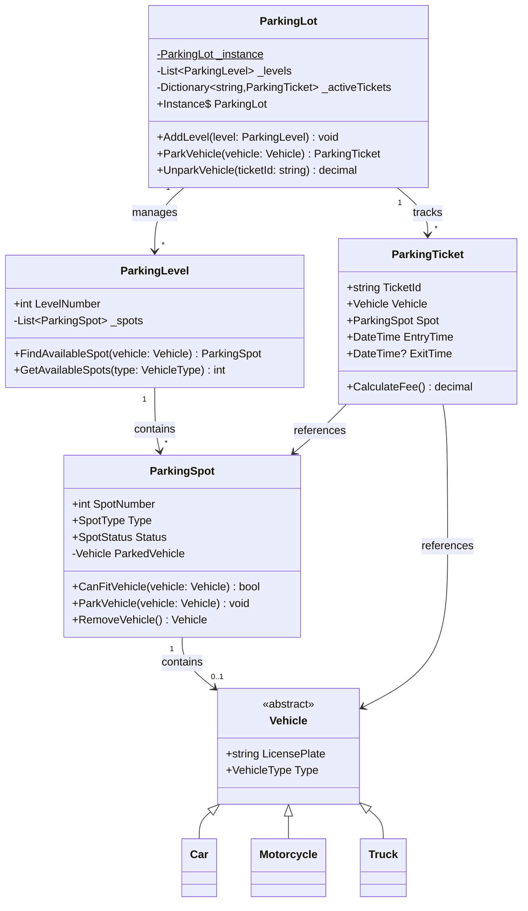
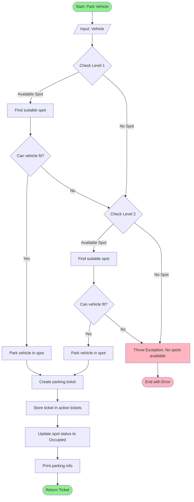
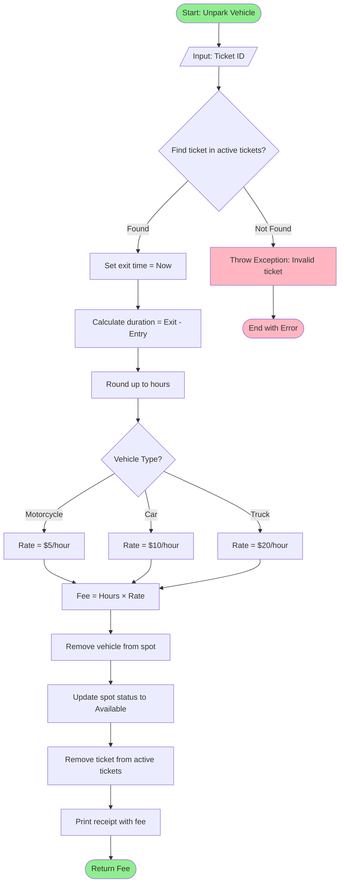

# Low-Level Design Guide for C# - Part 5: Common LLD Problems

## Table of Contents
- [Parking Lot System](#parking-lot-system)
- [Library Management System](#library-management-system)
- [Elevator System](#elevator-system)
- [ATM System](#atm-system)
- [Hotel Booking System](#hotel-booking-system)
- [URL Shortener](#url-shortener)

---

## Parking Lot System

### Requirements
- Multiple levels with parking spots
- Different vehicle types (car, motorcycle, truck)
- Track availability
- Calculate fees based on time

### Design

```csharp
// Enums
public enum VehicleType
{
    Motorcycle,
    Car,
    Truck
}

public enum SpotType
{
    Motorcycle,
    Compact,
    Large
}

public enum SpotStatus
{
    Available,
    Occupied,
    Reserved
}

// Vehicle Classes
public abstract class Vehicle
{
    public string LicensePlate { get; set; }
    public VehicleType Type { get; set; }
    
    protected Vehicle(string licensePlate, VehicleType type)
    {
        LicensePlate = licensePlate;
        Type = type;
    }
}

public class Motorcycle : Vehicle
{
    public Motorcycle(string licensePlate) : base(licensePlate, VehicleType.Motorcycle) { }
}

public class Car : Vehicle
{
    public Car(string licensePlate) : base(licensePlate, VehicleType.Car) { }
}

public class Truck : Vehicle
{
    public Truck(string licensePlate) : base(licensePlate, VehicleType.Truck) { }
}

// Parking Spot
public class ParkingSpot
{
    public int SpotNumber { get; set; }
    public SpotType Type { get; set; }
    public SpotStatus Status { get; private set; }
    public Vehicle ParkedVehicle { get; private set; }
    
    public ParkingSpot(int spotNumber, SpotType type)
    {
        SpotNumber = spotNumber;
        Type = type;
        Status = SpotStatus.Available;
    }
    
    public bool CanFitVehicle(Vehicle vehicle)
    {
        if (Status != SpotStatus.Available) return false;
        
        return vehicle.Type switch
        {
            VehicleType.Motorcycle => true, // Can park anywhere
            VehicleType.Car => Type == SpotType.Compact || Type == SpotType.Large,
            VehicleType.Truck => Type == SpotType.Large,
            _ => false
        };
    }
    
    public void ParkVehicle(Vehicle vehicle)
    {
        if (!CanFitVehicle(vehicle))
            throw new InvalidOperationException("Cannot park vehicle in this spot");
        
        ParkedVehicle = vehicle;
        Status = SpotStatus.Occupied;
    }
    
    public Vehicle RemoveVehicle()
    {
        var vehicle = ParkedVehicle;
        ParkedVehicle = null;
        Status = SpotStatus.Available;
        return vehicle;
    }
}

// Parking Level
public class ParkingLevel
{
    public int LevelNumber { get; set; }
    private readonly List<ParkingSpot> _spots;
    
    public ParkingLevel(int levelNumber, int motorcycleSpots, int compactSpots, int largeSpots)
    {
        LevelNumber = levelNumber;
        _spots = new List<ParkingSpot>();
        
        int spotNumber = 1;
        for (int i = 0; i < motorcycleSpots; i++)
            _spots.Add(new ParkingSpot(spotNumber++, SpotType.Motorcycle));
        
        for (int i = 0; i < compactSpots; i++)
            _spots.Add(new ParkingSpot(spotNumber++, SpotType.Compact));
        
        for (int i = 0; i < largeSpots; i++)
            _spots.Add(new ParkingSpot(spotNumber++, SpotType.Large));
    }
    
    public ParkingSpot FindAvailableSpot(Vehicle vehicle)
    {
        return _spots.FirstOrDefault(spot => spot.CanFitVehicle(vehicle));
    }
    
    public int GetAvailableSpots(VehicleType vehicleType)
    {
        return _spots.Count(spot => spot.Status == SpotStatus.Available && 
                                   spot.CanFitVehicle(new Car("TEMP"))); // Simplified check
    }
}

// Parking Ticket
public class ParkingTicket
{
    public string TicketId { get; set; }
    public Vehicle Vehicle { get; set; }
    public ParkingSpot Spot { get; set; }
    public DateTime EntryTime { get; set; }
    public DateTime? ExitTime { get; set; }
    
    public ParkingTicket(Vehicle vehicle, ParkingSpot spot)
    {
        TicketId = Guid.NewGuid().ToString();
        Vehicle = vehicle;
        Spot = spot;
        EntryTime = DateTime.Now;
    }
    
    public decimal CalculateFee()
    {
        if (!ExitTime.HasValue)
            throw new InvalidOperationException("Vehicle hasn't exited yet");
        
        var duration = ExitTime.Value - EntryTime;
        var hours = Math.Ceiling(duration.TotalHours);
        
        // $5 per hour for motorcycles, $10 for cars, $20 for trucks
        decimal ratePerHour = Vehicle.Type switch
        {
            VehicleType.Motorcycle => 5m,
            VehicleType.Car => 10m,
            VehicleType.Truck => 20m,
            _ => 10m
        };
        
        return (decimal)hours * ratePerHour;
    }
}

// Parking Lot (Singleton)
public class ParkingLot
{
    private static readonly Lazy<ParkingLot> _instance = new Lazy<ParkingLot>(() => new ParkingLot());
    public static ParkingLot Instance => _instance.Value;
    
    private readonly List<ParkingLevel> _levels;
    private readonly Dictionary<string, ParkingTicket> _activeTickets;
    
    private ParkingLot()
    {
        _levels = new List<ParkingLevel>();
        _activeTickets = new Dictionary<string, ParkingTicket>();
    }
    
    public void AddLevel(ParkingLevel level)
    {
        _levels.Add(level);
    }
    
    public ParkingTicket ParkVehicle(Vehicle vehicle)
    {
        foreach (var level in _levels)
        {
            var spot = level.FindAvailableSpot(vehicle);
            if (spot != null)
            {
                spot.ParkVehicle(vehicle);
                var ticket = new ParkingTicket(vehicle, spot);
                _activeTickets[ticket.TicketId] = ticket;
                
                Console.WriteLine($"Vehicle {vehicle.LicensePlate} parked at Level {level.LevelNumber}, Spot {spot.SpotNumber}");
                Console.WriteLine($"Ticket ID: {ticket.TicketId}");
                
                return ticket;
            }
        }
        
        throw new InvalidOperationException("No available parking spots");
    }
    
    public decimal UnparkVehicle(string ticketId)
    {
        if (!_activeTickets.TryGetValue(ticketId, out var ticket))
            throw new ArgumentException("Invalid ticket");
        
        ticket.ExitTime = DateTime.Now;
        ticket.Spot.RemoveVehicle();
        _activeTickets.Remove(ticketId);
        
        var fee = ticket.CalculateFee();
        Console.WriteLine($"Vehicle {ticket.Vehicle.LicensePlate} exited");
        Console.WriteLine($"Duration: {(ticket.ExitTime.Value - ticket.EntryTime).TotalHours:F2} hours");
        Console.WriteLine($"Fee: ${fee}");
        
        return fee;
    }
}

// Usage
var parkingLot = ParkingLot.Instance;
parkingLot.AddLevel(new ParkingLevel(1, motorcycleSpots: 10, compactSpots: 20, largeSpots: 10));
parkingLot.AddLevel(new ParkingLevel(2, motorcycleSpots: 10, compactSpots: 20, largeSpots: 10));

var car1 = new Car("ABC-123");
var car2 = new Car("XYZ-789");
var motorcycle1 = new Motorcycle("MOTO-001");

var ticket1 = parkingLot.ParkVehicle(car1);
var ticket2 = parkingLot.ParkVehicle(car2);
var ticket3 = parkingLot.ParkVehicle(motorcycle1);

// Simulate some time passing
Thread.Sleep(100);

parkingLot.UnparkVehicle(ticket1.TicketId);
```

###📊 Parking Lot System - Class Diagram



### 📊 Park Vehicle - Flowchart



### 📊 Unpark Vehicle & Fee Calculation - Flowchart



---

## Library Management System

### Requirements
- Manage books, members, and librarians
- Check out and return books
- Search for books
- Handle fines for late returns

### Design

```csharp
// Book
public class Book
{
    public string ISBN { get; set; }
    public string Title { get; set; }
    public string Author { get; set; }
    public string Publisher { get; set; }
    public int TotalCopies { get; set; }
    public int AvailableCopies { get; set; }
    
    public Book(string isbn, string title, string author, int totalCopies)
    {
        ISBN = isbn;
        Title = title;
        Author = author;
        TotalCopies = totalCopies;
        AvailableCopies = totalCopies;
    }
    
    public bool IsAvailable() => AvailableCopies > 0;
}

// Person (Base Class)
public abstract class Person
{
    public string Id { get; set; }
    public string Name { get; set; }
    public string Email { get; set; }
    public string Phone { get; set; }
    
    protected Person(string id, string name, string email, string phone)
    {
        Id = id;
        Name = name;
        Email = email;
        Phone = phone;
    }
}

// Member
public class Member : Person
{
    public DateTime MembershipDate { get; set; }
    public List<BookLoan> ActiveLoans { get; set; }
    public decimal TotalFines { get; set; }
    
    public Member(string id, string name, string email, string phone) 
        : base(id, name, email, phone)
    {
        MembershipDate = DateTime.Now;
        ActiveLoans = new List<BookLoan>();
        TotalFines = 0;
    }
    
    public bool CanBorrowBook()
    {
        return ActiveLoans.Count < 5 && TotalFines < 100;
    }
}

// Librarian
public class Librarian : Person
{
    public string EmployeeId { get; set; }
    
    public Librarian(string id, string name, string email, string phone, string employeeId) 
        : base(id, name, email, phone)
    {
        EmployeeId = employeeId;
    }
}

// Book Loan
public class BookLoan
{
    public string LoanId { get; set; }
    public Book Book { get; set; }
    public Member Member { get; set; }
    public DateTime BorrowDate { get; set; }
    public DateTime DueDate { get; set; }
    public DateTime? ReturnDate { get; set; }
    public decimal Fine { get; set; }
    
    public BookLoan(Book book, Member member, int loanDays = 14)
    {
        LoanId = Guid.NewGuid().ToString();
        Book = book;
        Member = member;
        BorrowDate = DateTime.Now;
        DueDate = BorrowDate.AddDays(loanDays);
        Fine = 0;
    }
    
    public void ReturnBook()
    {
        ReturnDate = DateTime.Now;
        
        if (ReturnDate > DueDate)
        {
            var daysLate = (ReturnDate.Value - DueDate).Days;
            Fine = daysLate * 1.0m; // $1 per day late
            Member.TotalFines += Fine;
            Console.WriteLine($"Book returned {daysLate} days late. Fine: ${Fine}");
        }
        else
        {
            Console.WriteLine("Book returned on time");
        }
    }
}

// Library Catalog (Search functionality)
public class LibraryCatalog
{
    private readonly List<Book> _books = new List<Book>();
    
    public void AddBook(Book book)
    {
        _books.Add(book);
    }
    
    public List<Book> SearchByTitle(string title)
    {
        return _books.Where(b => b.Title.Contains(title, StringComparison.OrdinalIgnoreCase)).ToList();
    }
    
    public List<Book> SearchByAuthor(string author)
    {
        return _books.Where(b => b.Author.Contains(author, StringComparison.OrdinalIgnoreCase)).ToList();
    }
    
    public Book SearchByISBN(string isbn)
    {
        return _books.FirstOrDefault(b => b.ISBN == isbn);
    }
    
    public List<Book> GetAvailableBooks()
    {
        return _books.Where(b => b.IsAvailable()).ToList();
    }
}

// Library Management System
public class Library
{
    private static readonly Lazy<Library> _instance = new Lazy<Library>(() => new Library());
    public static Library Instance => _instance.Value;
    
    private readonly LibraryCatalog _catalog;
    private readonly Dictionary<string, Member> _members;
    private readonly List<BookLoan> _loans;
    
    private Library()
    {
        _catalog = new LibraryCatalog();
        _members = new Dictionary<string, Member>();
        _loans = new List<BookLoan>();
    }
    
    public void AddBook(Book book)
    {
        _catalog.AddBook(book);
        Console.WriteLine($"Book added: {book.Title}");
    }
    
    public void RegisterMember(Member member)
    {
        _members[member.Id] = member;
        Console.WriteLine($"Member registered: {member.Name}");
    }
    
    public BookLoan CheckoutBook(string memberId, string isbn)
    {
        if (!_members.TryGetValue(memberId, out var member))
            throw new ArgumentException("Member not found");
        
        if (!member.CanBorrowBook())
            throw new InvalidOperationException("Member cannot borrow more books");
        
        var book = _catalog.SearchByISBN(isbn);
        if (book == null)
            throw new ArgumentException("Book not found");
        
        if (!book.IsAvailable())
            throw new InvalidOperationException("Book not available");
        
        var loan = new BookLoan(book, member);
        member.ActiveLoans.Add(loan);
        _loans.Add(loan);
        book.AvailableCopies--;
        
        Console.WriteLine($"{member.Name} borrowed '{book.Title}'");
        Console.WriteLine($"Due date: {loan.DueDate:yyyy-MM-dd}");
        
        return loan;
    }
    
    public void ReturnBook(string loanId)
    {
        var loan = _loans.FirstOrDefault(l => l.LoanId == loanId);
        if (loan == null)
            throw new ArgumentException("Loan not found");
        
        loan.ReturnBook();
        loan.Member.ActiveLoans.Remove(loan);
        loan.Book.AvailableCopies++;
        
        Console.WriteLine($"'{loan.Book.Title}' returned by {loan.Member.Name}");
    }
    
    public List<Book> SearchBooks(string title)
    {
        return _catalog.SearchByTitle(title);
    }
}

// Usage
var library = Library.Instance;

// Add books
library.AddBook(new Book("978-0132350884", "Clean Code", "Robert C. Martin", 5));
library.AddBook(new Book("978-0201633610", "Design Patterns", "Gang of Four", 3));

// Register members
var member1 = new Member("M001", "John Doe", "john@email.com", "123-456-7890");
library.RegisterMember(member1);

// Checkout
var loan = library.CheckoutBook("M001", "978-0132350884");

// Return
library.ReturnBook(loan.LoanId);
```

---

## Elevator System

### Requirements
- Multiple elevators
- Handle requests from different floors
- Optimize elevator assignment

### Design

```csharp
public enum Direction
{
    Up,
    Down,
    Idle
}

public class Request
{
    public int Floor { get; set; }
    public Direction Direction { get; set; }
    public DateTime Timestamp { get; set; }
    
    public Request(int floor, Direction direction)
    {
        Floor = floor;
        Direction = direction;
        Timestamp = DateTime.Now;
    }
}

public class Elevator
{
    public int Id { get; set; }
    public int CurrentFloor { get; private set; }
    public Direction CurrentDirection { get; private set; }
    private readonly SortedSet<int> _upRequests;
    private readonly SortedSet<int> _downRequests;
    private readonly int _maxFloor;
    private readonly int _minFloor;
    
    public Elevator(int id, int minFloor, int maxFloor)
    {
        Id = id;
        CurrentFloor = minFloor;
        CurrentDirection = Direction.Idle;
        _maxFloor = maxFloor;
        _minFloor = minFloor;
        _upRequests = new SortedSet<int>();
        _downRequests = new SortedSet<int>(Comparer<int>.Create((a, b) => b.CompareTo(a)));
    }
    
    public void AddRequest(int floor, Direction direction)
    {
        if (direction == Direction.Up)
            _upRequests.Add(floor);
        else
            _downRequests.Add(floor);
        
        Console.WriteLine($"Elevator {Id}: Request added for floor {floor} ({direction})");
    }
    
    public void Move()
    {
        if (CurrentDirection == Direction.Up)
        {
            if (_upRequests.Count > 0)
            {
                int nextFloor = _upRequests.First(f => f >= CurrentFloor);
                MoveToFloor(nextFloor);
                _upRequests.Remove(nextFloor);
            }
            else if (_downRequests.Count > 0)
            {
                CurrentDirection = Direction.Down;
            }
            else
            {
                CurrentDirection = Direction.Idle;
            }
        }
        else if (CurrentDirection == Direction.Down)
        {
            if (_downRequests.Count > 0)
            {
                int nextFloor = _downRequests.First(f => f <= CurrentFloor);
                MoveToFloor(nextFloor);
                _downRequests.Remove(nextFloor);
            }
            else if (_upRequests.Count > 0)
            {
                CurrentDirection = Direction.Up;
            }
            else
            {
                CurrentDirection = Direction.Idle;
            }
        }
        else // Idle
        {
            if (_upRequests.Count > 0)
            {
                CurrentDirection = Direction.Up;
                Move();
            }
            else if (_downRequests.Count > 0)
            {
                CurrentDirection = Direction.Down;
                Move();
            }
        }
    }
    
    private void MoveToFloor(int floor)
    {
        Console.WriteLine($"Elevator {Id}: Moving from floor {CurrentFloor} to {floor}");
        CurrentFloor = floor;
        Console.WriteLine($"Elevator {Id}: Arrived at floor {CurrentFloor}");
    }
    
    public int GetDistance(int floor)
    {
        return Math.Abs(CurrentFloor - floor);
    }
}

public class ElevatorController
{
    private readonly List<Elevator> _elevators;
    private readonly Queue<Request> _pendingRequests;
    
    public ElevatorController(int numElevators, int minFloor, int maxFloor)
    {
        _elevators = new List<Elevator>();
        _pendingRequests = new Queue<Request>();
        
        for (int i = 0; i < numElevators; i++)
        {
            _elevators.Add(new Elevator(i + 1, minFloor, maxFloor));
        }
    }
    
    public void RequestElevator(int floor, Direction direction)
    {
        var request = new Request(floor, direction);
        var elevator = FindBestElevator(floor, direction);
        
        elevator.AddRequest(floor, direction);
        elevator.Move();
    }
    
    private Elevator FindBestElevator(int floor, Direction direction)
    {
        // Simple strategy: find closest idle or moving elevator
        return _elevators
            .OrderBy(e => e.CurrentDirection == Direction.Idle ? 0 : 1)
            .ThenBy(e => e.GetDistance(floor))
            .First();
    }
}

// Usage
var controller = new ElevatorController(numElevators: 3, minFloor: 0, maxFloor: 10);

controller.RequestElevator(5, Direction.Up);
controller.RequestElevator(3, Direction.Down);
controller.RequestElevator(8, Direction.Up);
```

---

## ATM System

### Requirements
- Account management
- Withdraw, deposit, check balance
- Transaction history
- Card authentication

### Design

```csharp
public class Account
{
    public string AccountNumber { get; set; }
    public string PIN { get; set; }
    public decimal Balance { get; set; }
    public List<Transaction> Transactions { get; set; }
    
    public Account(string accountNumber, string pin, decimal initialBalance)
    {
        AccountNumber = accountNumber;
        PIN = pin;
        Balance = initialBalance;
        Transactions = new List<Transaction>();
    }
    
    public bool Withdraw(decimal amount)
    {
        if (amount > Balance)
        {
            Console.WriteLine("Insufficient funds");
            return false;
        }
        
        Balance -= amount;
        Transactions.Add(new Transaction(TransactionType.Withdrawal, amount));
        return true;
    }
    
    public void Deposit(decimal amount)
    {
        Balance += amount;
        Transactions.Add(new Transaction(TransactionType.Deposit, amount));
    }
}

public enum TransactionType
{
    Withdrawal,
    Deposit,
    BalanceInquiry
}

public class Transaction
{
    public string TransactionId { get; set; }
    public TransactionType Type { get; set; }
    public decimal Amount { get; set; }
    public DateTime Timestamp { get; set; }
    
    public Transaction(TransactionType type, decimal amount)
    {
        TransactionId = Guid.NewGuid().ToString();
        Type = type;
        Amount = amount;
        Timestamp = DateTime.Now;
    }
}

public class ATM
{
    private readonly Dictionary<string, Account> _accounts;
    private Account _currentAccount;
    
    public ATM()
    {
        _accounts = new Dictionary<string, Account>();
    }
    
    public void AddAccount(Account account)
    {
        _accounts[account.AccountNumber] = account;
    }
    
    public bool AuthenticateUser(string accountNumber, string pin)
    {
        if (_accounts.TryGetValue(accountNumber, out var account))
        {
            if (account.PIN == pin)
            {
                _currentAccount = account;
                Console.WriteLine("Authentication successful");
                return true;
            }
        }
        
        Console.WriteLine("Authentication failed");
        return false;
    }
    
    public void Withdraw(decimal amount)
    {
        if (_currentAccount == null)
        {
            Console.WriteLine("Please authenticate first");
            return;
        }
        
        if (_currentAccount.Withdraw(amount))
        {
            Console.WriteLine($"Withdrawn: ${amount}");
            Console.WriteLine($"New balance: ${_currentAccount.Balance}");
        }
    }
    
    public void Deposit(decimal amount)
    {
        if (_currentAccount == null)
        {
            Console.WriteLine("Please authenticate first");
            return;
        }
        
        _currentAccount.Deposit(amount);
        Console.WriteLine($"Deposited: ${amount}");
        Console.WriteLine($"New balance: ${_currentAccount.Balance}");
    }
    
    public void CheckBalance()
    {
        if (_currentAccount == null)
        {
            Console.WriteLine("Please authenticate first");
            return;
        }
        
        Console.WriteLine($"Current balance: ${_currentAccount.Balance}");
        _currentAccount.Transactions.Add(new Transaction(TransactionType.BalanceInquiry, 0));
    }
    
    public void Logout()
    {
        _currentAccount = null;
        Console.WriteLine("Logged out successfully");
    }
}

// Usage
var atm = new ATM();
var account = new Account("123456789", "1234", 1000m);
atm.AddAccount(account);

atm.AuthenticateUser("123456789", "1234");
atm.CheckBalance();
atm.Withdraw(200m);
atm.Deposit(500m);
atm.CheckBalance();
atm.Logout();
```

---

## Hotel Booking System

### Requirements
- Room management
- Booking and cancellation
- Search availability
- Calculate pricing

### Design

```csharp
public enum RoomType
{
    Single,
    Double,
    Suite
}

public enum RoomStatus
{
    Available,
    Booked,
    Maintenance
}

public class Room
{
    public string RoomNumber { get; set; }
    public RoomType Type { get; set; }
    public decimal PricePerNight { get; set; }
    public RoomStatus Status { get; set; }
    
    public Room(string roomNumber, RoomType type, decimal pricePerNight)
    {
        RoomNumber = roomNumber;
        Type = type;
        PricePerNight = pricePerNight;
        Status = RoomStatus.Available;
    }
}

public class Guest
{
    public string GuestId { get; set; }
    public string Name { get; set; }
    public string Email { get; set; }
    public string Phone { get; set; }
    
    public Guest(string guestId, string name, string email, string phone)
    {
        GuestId = guestId;
        Name = name;
        Email = email;
        Phone = phone;
    }
}

public class Booking
{
    public string BookingId { get; set; }
    public Guest Guest { get; set; }
    public Room Room { get; set; }
    public DateTime CheckInDate { get; set; }
    public DateTime CheckOutDate { get; set; }
    public decimal TotalPrice { get; set; }
    public bool IsCancelled { get; set; }
    
    public Booking(Guest guest, Room room, DateTime checkIn, DateTime checkOut)
    {
        BookingId = Guid.NewGuid().ToString();
        Guest = guest;
        Room = room;
        CheckInDate = checkIn;
        CheckOutDate = checkOut;
        TotalPrice = CalculatePrice();
        IsCancelled = false;
    }
    
    private decimal CalculatePrice()
    {
        var nights = (CheckOutDate - CheckInDate).Days;
        return nights * Room.PricePerNight;
    }
}

public class Hotel
{
    private readonly List<Room> _rooms;
    private readonly List<Booking> _bookings;
    
    public Hotel()
    {
        _rooms = new List<Room>();
        _bookings = new List<Booking>();
    }
    
    public void AddRoom(Room room)
    {
        _rooms.Add(room);
    }
    
    public List<Room> SearchAvailableRooms(RoomType type, DateTime checkIn, DateTime checkOut)
    {
        return _rooms.Where(room => 
            room.Type == type &&
            room.Status == RoomStatus.Available &&
            !IsRoomBooked(room, checkIn, checkOut)
        ).ToList();
    }
    
    private bool IsRoomBooked(Room room, DateTime checkIn, DateTime checkOut)
    {
        return _bookings.Any(booking =>
            booking.Room == room &&
            !booking.IsCancelled &&
            !(checkOut <= booking.CheckInDate || checkIn >= booking.CheckOutDate)
        );
    }
    
    public Booking BookRoom(Guest guest, string roomNumber, DateTime checkIn, DateTime checkOut)
    {
        var room = _rooms.FirstOrDefault(r => r.RoomNumber == roomNumber);
        if (room == null)
            throw new ArgumentException("Room not found");
        
        if (IsRoomBooked(room, checkIn, checkOut))
            throw new InvalidOperationException("Room not available for selected dates");
        
        var booking = new Booking(guest, room, checkIn, checkOut);
        _bookings.Add(booking);
        
        Console.WriteLine($"Booking confirmed: {booking.BookingId}");
        Console.WriteLine($"Guest: {guest.Name}");
        Console.WriteLine($"Room: {room.RoomNumber} ({room.Type})");
        Console.WriteLine($"Check-in: {checkIn:yyyy-MM-dd}");
        Console.WriteLine($"Check-out: {checkOut:yyyy-MM-dd}");
        Console.WriteLine($"Total: ${booking.TotalPrice}");
        
        return booking;
    }
    
    public void CancelBooking(string bookingId)
    {
        var booking = _bookings.FirstOrDefault(b => b.BookingId == bookingId);
        if (booking == null)
            throw new ArgumentException("Booking not found");
        
        booking.IsCancelled = true;
        Console.WriteLine($"Booking {bookingId} cancelled");
    }
}

// Usage
var hotel = new Hotel();
hotel.AddRoom(new Room("101", RoomType.Single, 100m));
hotel.AddRoom(new Room("201", RoomType.Double, 150m));
hotel.AddRoom(new Room("301", RoomType.Suite, 300m));

var guest = new Guest("G001", "John Doe", "john@email.com", "123-456-7890");

var checkIn = DateTime.Now.AddDays(7);
var checkOut = checkIn.AddDays(3);

var availableRooms = hotel.SearchAvailableRooms(RoomType.Double, checkIn, checkOut);
if (availableRooms.Any())
{
    var booking = hotel.BookRoom(guest, availableRooms.First().RoomNumber, checkIn, checkOut);
}
```

---

## URL Shortener

### Requirements
- Generate short URLs from long URLs
- Redirect to original URL
- Track clicks
- Custom aliases (optional)

### Design

```csharp
public class UrlMapping
{
    public string ShortCode { get; set; }
    public string LongUrl { get; set; }
    public DateTime CreatedAt { get; set; }
    public int ClickCount { get; set; }
    
    public UrlMapping(string shortCode, string longUrl)
    {
        ShortCode = shortCode;
        LongUrl = longUrl;
        CreatedAt = DateTime.Now;
        ClickCount = 0;
    }
}

public class UrlShortener
{
    private readonly Dictionary<string, UrlMapping> _urlMap;
    private readonly Dictionary<string, string> _reverseMap;
    private const string Alphabet = "abcdefghijklmnopqrstuvwxyzABCDEFGHIJKLMNOPQRSTUVWXYZ0123456789";
    private const int ShortCodeLength = 6;
    private readonly Random _random;
    
    public UrlShortener()
    {
        _urlMap = new Dictionary<string, UrlMapping>();
        _reverseMap = new Dictionary<string, string>();
        _random = new Random();
    }
    
    public string ShortenUrl(string longUrl, string customAlias = null)
    {
        // Check if URL already shortened
        if (_reverseMap.TryGetValue(longUrl, out var existingCode))
        {
            Console.WriteLine($"URL already shortened: {existingCode}");
            return existingCode;
        }
        
        string shortCode;
        if (!string.IsNullOrEmpty(customAlias))
        {
            if (_urlMap.ContainsKey(customAlias))
                throw new ArgumentException("Custom alias already taken");
            
            shortCode = customAlias;
        }
        else
        {
            shortCode = GenerateShortCode();
        }
        
        var mapping = new UrlMapping(shortCode, longUrl);
        _urlMap[shortCode] = mapping;
        _reverseMap[longUrl] = shortCode;
        
        Console.WriteLine($"Shortened URL: {shortCode} -> {longUrl}");
        return shortCode;
    }
    
    public string ExpandUrl(string shortCode)
    {
        if (_urlMap.TryGetValue(shortCode, out var mapping))
        {
            mapping.ClickCount++;
            Console.WriteLine($"Expanding: {shortCode} -> {mapping.LongUrl}");
            Console.WriteLine($"Total clicks: {mapping.ClickCount}");
            return mapping.LongUrl;
        }
        
        throw new ArgumentException("Short code not found");
    }
    
    public Dictionary<string, int> GetAnalytics()
    {
        return _urlMap.ToDictionary(
            kvp => kvp.Key,
            kvp => kvp.Value.ClickCount
        );
    }
    
    private string GenerateShortCode()
    {
        string shortCode;
        do
        {
            shortCode = new string(Enumerable.Range(0, ShortCodeLength)
                .Select(_ => Alphabet[_random.Next(Alphabet.Length)])
                .ToArray());
        } while (_urlMap.ContainsKey(shortCode));
        
        return shortCode;
    }
}

// Usage
var shortener = new UrlShortener();

string short1 = shortener.ShortenUrl("https://www.example.com/very/long/url/with/many/parameters");
string short2 = shortener.ShortenUrl("https://www.google.com", "google");

shortener.ExpandUrl(short1);
shortener.ExpandUrl(short1);
shortener.ExpandUrl(short2);

var analytics = shortener.GetAnalytics();
Console.WriteLine("\nAnalytics:");
foreach (var kvp in analytics)
{
    Console.WriteLine($"{kvp.Key}: {kvp.Value} clicks");
}
```

---

## Summary

### Key Takeaways for LLD Problems

1. **Identify Entities**: Users, Resources, Transactions
2. **Define Relationships**: One-to-one, one-to-many, many-to-many
3. **Apply Patterns**: Use appropriate design patterns
4. **Consider SOLID**: Ensure design follows SOLID principles
5. **Think Scale**: Consider future extensions and modifications

### Common Patterns Used

- **Singleton**: Parking Lot, Library, URL Shortener
- **Factory**: Creating different vehicle/room types
- **Strategy**: Different pricing strategies
- **Observer**: Notifications for booking confirmations
- **State**: Room status, Elevator direction
- **Command**: Transactions (ATM, Booking)

---

**Continue to:** [Part 6: Best Practices & Interview Tips](LLD-Guide-CSharp-Part6-Best-Practices.md)

**Previous:** [Part 4: Behavioral Design Patterns](LLD-Guide-CSharp-Part4-Behavioral-Patterns.md)
