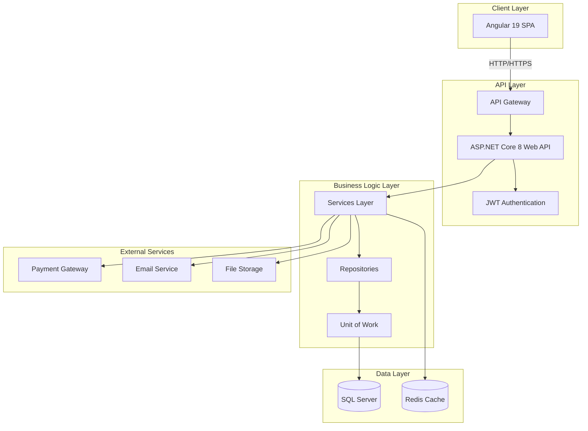
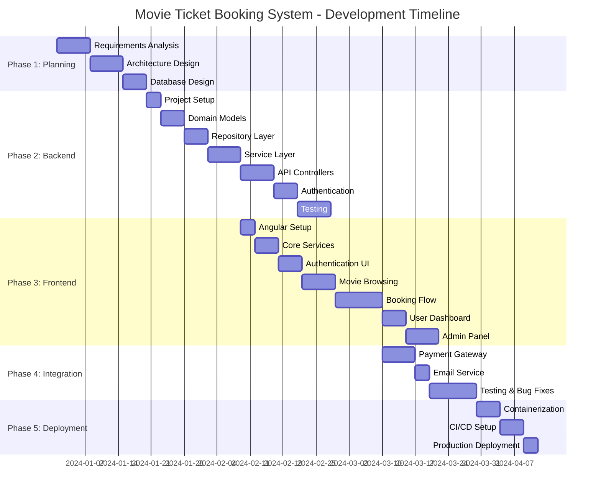

# Module 01: Introduction and System Overview

## 📖 Table of Contents
1. [Introduction](#introduction)
2. [System Overview](#system-overview)
3. [Functional Requirements](#functional-requirements)
4. [Non-Functional Requirements](#non-functional-requirements)
5. [User Stories](#user-stories)
6. [Technology Stack Justification](#technology-stack-justification)
7. [Project Timeline](#project-timeline)

---

## 1. Introduction

### 1.1 Purpose of This Guide

Welcome to the most comprehensive guide for building a **production-ready Movie Ticket Booking System**! This guide is designed to take you from zero to deployment, covering every aspect of modern full-stack development.

### 1.2 What You'll Build

You'll create a complete movie ticket booking platform with:
- **User-facing portal** for browsing movies, selecting seats, and booking tickets
- **Admin dashboard** for managing movies, theaters, shows, and bookings
- **Payment integration** for secure online transactions
- **Real-time seat selection** with WebSocket updates
- **Email notifications** for booking confirmations
- **Reporting and analytics** for business insights

### 1.3 Why This System?

Movie ticket booking systems are excellent learning projects because they cover:
- Complex database relationships
- Real-time updates and concurrency
- Payment processing  
- Authentication and authorization
- State management
- UI/UX challenges
- Scalability concerns

---

## 2. System Overview

### 2.1 High-Level Description

The Movie Ticket Booking System is a web-based application that allows users to:
1. Browse currently showing and upcoming movies
2. View theater locations and available showtimes
3. Select seats from an interactive seat map
4. Make secure payments
5. Receive booking confirmations via email
6. Manage their bookings (view, cancel)

Administrators can:
1. Manage movies (add, edit, delete)
2. Manage theaters and screens
3. Schedule shows
4. View bookings and revenue reports
5. Manage users and roles

### 2.2 System Architecture Overview



### 2.3 Key Features Breakdown

#### 🎬 Movie Management
- Movie information (title, description, genre, language, duration)
- Movie posters and trailers
- Ratings and reviews
- Search and filters

#### 🏢 Theater & Screen Management
- Multiple theaters support
- Multiple screens per theater
- Seat layouts (Regular, Premium, VIP)
- Amenities information

#### 🎫 Show & Booking Management
- Show scheduling
- Real-time seat availability
- Interactive seat selection
- Booking confirmation
- Ticket cancellation

#### 💰 Payment Processing
- Multiple payment methods
- Secure payment gateway integration
- Payment status tracking
- Refund processing

#### 👤 User Management
- User registration and login
- Profile management
- Booking history
- Role-based access control

#### 📊 Admin Features
- Dashboard with analytics
- Revenue reports
- Booking statistics
- User management

---

## 3. Functional Requirements

### 3.1 User Module

#### FR-U1: User Registration
**Description**: Users must be able to create an account  
**Priority**: High  
**Acceptance Criteria**:
- User provides email, password, name, and phone number
- Email verification required
- Password must meet security requirements (min 8 chars, special char, number)
- No duplicate email addresses allowed
- Success confirmation sent via email

#### FR-U2: User Login
**Description**: Registered users must be able to log in  
**Priority**: High  
**Acceptance Criteria**:
- Login with email and password
- JWT token issued on successful login
- Token expires after 24 hours
- Refresh token mechanism for extended sessions
- Failed login attempts tracked (max 5 attempts)

#### FR-U3: User Profile Management
**Description**: Users can view and edit their profile  
**Priority**: Medium  
**Acceptance Criteria**:
- View current profile information
- Edit name, phone number
- Change password (requires old password)
- Upload profile picture

### 3.2 Movie Module

#### FR-M1: Browse Movies
**Description**: Users can browse currently showing and upcoming movies  
**Priority**: High  
**Acceptance Criteria**:
- Display movie poster, title, genre, language, duration, rating
- Filter by genre, language, format (2D/3D/IMAX)
- Search by movie name
- Sort by popularity, rating, release date
- Pagination support (20 movies per page)

#### FR-M2: View Movie Details
**Description**: Users can view detailed information about a movie  
**Priority**: High  
**Acceptance Criteria**:
- Display full movie information
- Show cast and crew
- Display trailer (embedded video)
- Show user ratings and reviews
- List available showtimes

#### FR-M3: Movie Reviews and Ratings
**Description**: Users can rate and review movies  
**Priority**: Medium  
**Acceptance Criteria**:
- Users can rate movies (1-5 stars)
- Users can write text reviews
- Display average rating
- Show review count
- Reviews can be reported/moderated

### 3.3 Theater & Show Module

#### FR-T1: View Theaters
**Description**: Users can view available theaters in their city  
**Priority**: High  
**Acceptance Criteria**:
- List theaters by city
- Display theater name, address, amenities
- Show distance from user location (optional)
- Filter by amenities (parking, food court, etc.)

#### FR-T2: View Showtimes
**Description**: Users can view available showtimes for a movie  
**Priority**: High  
**Acceptance Criteria**:
- Display showtimes grouped by theater
- Show show date, time, screen name, format (2D/3D)
- Display pricing information
- Indicate availability status
- Filter by date and time slots

### 3.4 Booking Module

#### FR-B1: Seat Selection
**Description**: Users can select seats for a show  
**Priority**: High  
**Acceptance Criteria**:
- Display interactive seat layout
- Show seat types (Regular, Premium, VIP) with different colors
- Indicate seat status (Available, Booked, Selected, Blocked)
- Real-time seat updates (WebSocket)
- Hold selected seats for 10 minutes
- Display total price dynamically

#### FR-B2: Make Booking
**Description**: Users can complete a booking and payment  
**Priority**: High  
**Acceptance Criteria**:
- Review booking details before payment
- Apply promo codes/discount coupons
- Select payment method
- Redirect to payment gateway
- Generate booking confirmation on successful payment
- Send email notification with ticket details
- Generate QR code for ticket verification

#### FR-B3: View Bookings
**Description**: Users can view their booking history  
**Priority**: Medium  
**Acceptance Criteria**:
- List all bookings (upcoming and past)
- Display booking details (movie, theater, seats, price)
- Show booking status (Confirmed, Cancelled, Expired)
- Download ticket PDF
- Filter by status and date

#### FR-B4: Cancel Booking
**Description**: Users can cancel their bookings  
**Priority**: Medium  
**Acceptance Criteria**:
- Cancel bookings up to 2 hours before show time
- Calculate refund amount (based on cancellation policy)
- Initiate refund process
- Update seat availability
- Send cancellation confirmation email

### 3.5 Payment Module

#### FR-P1: Process Payment
**Description**: System processes payments securely  
**Priority**: High  
**Acceptance Criteria**:
- Support multiple payment methods (Credit/Debit, UPI, Wallets)
- Integrate with payment gateway (Stripe/Razorpay)
- Handle payment success callback
- Handle payment failure callback
- Store payment transaction details
- PCI DSS compliance

#### FR-P2: Refund Processing
**Description**: System processes refunds for cancelled bookings  
**Priority**: Medium  
**Acceptance Criteria**:
- Calculate refund based on cancellation policy
- Initiate refund through payment gateway
- Track refund status
- Update booking and payment records
- Notify user of refund status

### 3.6 Admin Module

#### FR-A1: Manage Movies
**Description**: Admin can manage movie catalog  
**Priority**: High  
**Acceptance Criteria**:
- Add new movies with all details
- Edit existing movie information
- Delete movies (soft delete)
- Upload movie posters and trailers
- Set movie status (Now Showing, Coming Soon, Archived)

#### FR-A2: Manage Theaters
**Description**: Admin can manage theater information  
**Priority**: High  
**Acceptance Criteria**:
- Add new theaters with address and amenities
- Add/edit screens within theaters
- Define seat layouts for each screen
- Set seat types and pricing
- Enable/disable theaters

#### FR-A3: Schedule Shows
**Description**: Admin can schedule movie shows  
**Priority**: High  
**Acceptance Criteria**:
- Create shows for a movie in a specific screen
- Set show date and time
- Set pricing for different seat types
- Avoid scheduling conflicts
- Bulk schedule support (multiple shows at once)

#### FR-A4: View Reports
**Description**: Admin can view business reports and analytics  
**Priority**: Medium  
**Acceptance Criteria**:
- Dashboard with key metrics (bookings, revenue, occupancy)
- Revenue reports by date range
- Popular movies report
- Theater-wise performance
- Export reports to Excel/PDF

#### FR-A5: Manage Users
**Description**: Admin can manage user accounts  
**Priority**: Low  
**Acceptance Criteria**:
- View all registered users
- Search and filter users
- Block/unblock users
- Reset user passwords
- View user booking history

---

## 4. Non-Functional Requirements

### 4.1 Performance Requirements

#### NFR-P1: Response Time
- **API Response**: 95% of API calls should respond within 200ms
- **Page Load**: Initial page load should complete within 2 seconds
- **Seat Selection**: Real-time updates should reflect within 1 second

#### NFR-P2: Throughput
- **Concurrent Users**: System should support 10,000 concurrent users
- **Bookings**: Handle 1000 bookings per minute during peak hours
- **Search**: Process 5000 search queries per minute

#### NFR-P3: Database Performance
- **Query Optimization**: All database queries optimized with proper indexing
- **Connection Pooling**: Efficient database connection management
- **Caching**: Frequently accessed data cached (Redis)

### 4.2 Scalability Requirements

#### NFR-S1: Horizontal Scalability
- **Load Balancing**: Support for multiple application servers
- **Database Sharding**: Support for database partitioning if needed
- **Microservices Ready**: Architecture should support future service separation

#### NFR-S2: Data Volume
- **Movies**: Support for 10,000+ movies
- **Theaters**: Support for 1000+ theaters
- **Bookings**: Handle 10 million+ booking records
- **Users**: Support for 1 million+ registered users

### 4.3 Security Requirements

#### NFR-SE1: Authentication & Authorization
- **JWT Tokens**: Secure token-based authentication
- **Password Security**: Passwords hashed using BCrypt (cost factor 12)
- **Role-Based Access**: Proper RBAC implementation
- **Session Management**: Secure session handling with timeout

#### NFR-SE2: Data Security
- **Encryption**: Sensitive data encrypted at rest and in transit
- **SQL Injection Prevention**: Parameterized queries only
- **XSS Prevention**: Input sanitization and output encoding
- **CSRF Protection**: Anti-CSRF tokens for state-changing operations

#### NFR-SE3: Payment Security
- **PCI DSS Compliance**: Never store card details on server
- **Secure Gateway**: Use certified payment gateway
- **Transaction Logging**: Complete audit trail for all transactions

#### NFR-SE4: API Security
- **Rate Limiting**: Prevent abuse with rate limiting (100 requests/minute per user)
- **CORS**: Proper CORS configuration
- **HTTPS Only**: All communications over HTTPS
- **API Versioning**: Proper API versioning for backward compatibility

### 4.4 Reliability Requirements

#### NFR-R1: Availability
- **Uptime**: 99.9% uptime (max 8.76 hours downtime per year)
- **Redundancy**: Database replication and failover
- **Backup**: Daily automated backups with 30-day retention

#### NFR-R2: Fault Tolerance
- **Graceful Degradation**: System remains functional even if some services fail
- **Circuit Breaker**: Implement circuit breaker pattern for external services
- **Retry Logic**: Automatic retry for transient failures

### 4.5 Maintainability Requirements

#### NFR-M1: Code Quality
- **Clean Code**: Follow SOLID principles
- **Code Coverage**: Minimum 80% unit test coverage
- **Code Review**: All code reviewed before merge
- **Documentation**: Comprehensive API documentation

#### NFR-M2: Logging & Monitoring
- **Structured Logging**: Serilog with structured logging
- **Application Monitoring**: Application Insights/ELK stack
- **Error Tracking**: Detailed error logs with stack traces
- **Performance Monitoring**: Track API performance metrics

### 4.6 Usability Requirements

#### NFR-U1: User Interface
- **Responsive Design**: Support desktop, tablet, and mobile devices
- **Accessibility**: WCAG 2.1 Level AA compliance
- **Browser Support**: Chrome, Firefox, Safari, Edge (latest 2 versions)
- **Intuitive Navigation**: User should complete booking in 3 steps or less

#### NFR-U2: User Experience
- **Loading Indicators**: Show progress for long operations
- **Error Messages**: Clear, actionable error messages
- **Confirmation Dialogs**: Confirm critical actions (booking, cancellation)
- **Keyboard Navigation**: Full keyboard support

---

## 5. User Stories

### 5.1 Customer User Stories

#### Epic: Movie Discovery
```
US-C1: Browse Movies
As a customer
I want to browse all currently showing movies
So that I can decide which movie to watch

Acceptance Criteria:
- Movies displayed with posters and basic info
- Ability to filter by genre, language
- Search by movie name works correctly
```

```
US-C2: View Movie Details
As a customer
I want to view detailed information about a movie
So that I can learn more before booking

Acceptance Criteria:
- View synopsis, cast, crew, duration
- See trailer
- View user ratings and reviews
- See available showtimes
```

#### Epic: Booking Flow
```
US-C3: Select Showtime
As a customer
I want to see all available showtimes for a movie
So that I can choose a convenient time

Acceptance Criteria:
- Showtimes grouped by theater
- Show date, time, format (2D/3D)
- Display pricing
- Filter by date
```

```
US-C4: Select Seats
As a customer
I want to select my preferred seats
So that I can book my desired seating location

Acceptance Criteria:
- Interactive seat map displayed
- Different seat types clearly indicated
- Real-time seat availability
- Selected seats highlighted
- Total price updates dynamically
```

```
US-C5: Complete Payment
As a customer
I want to make secure payment for my booking
So that I can confirm my tickets

Acceptance Criteria:
- Review booking summary
- Choose payment method
- Secure payment processing
- Receive booking confirmation
- Email with ticket details
```

#### Epic: Booking Management
```
US-C6: View My Bookings
As a customer
I want to see all my past and upcoming bookings
So that I can track my tickets

Acceptance Criteria:
- List all bookings
- Show booking details
- Filter by status
- Download tickets
```

```
US-C7: Cancel Booking
As a customer
I want to cancel my booking if my plans change
So that I can get a refund

Acceptance Criteria:
- Cancel up to 2 hours before show
- See refund amount
- Receive cancellation confirmation
- Refund processed
```

### 5.2 Admin User Stories

#### Epic: Movie Management
```
US-A1: Add Movie
As an admin
I want to add new movies to the system
So that customers can book tickets

Acceptance Criteria:
- Enter all movie details
- Upload poster and trailer
- Set movie status
- Save successfully
```

```
US-A2: Schedule Shows
As an admin
I want to schedule shows for a movie
So that customers can book tickets

Acceptance Criteria:
- Select movie, theater, screen
- Set date and time
- Set pricing
- No scheduling conflicts
```

#### Epic: Analytics
```
US-A3: View Dashboard
As an admin
I want to see key business metrics
So that I can monitor performance

Acceptance Criteria:
- Total bookings today
- Revenue today/this month
- Popular movies
- Occupancy rate
```

---

## 6. Technology Stack Justification

### 6.1 Backend: ASP.NET Core 8.0 LTS

#### Why ASP.NET Core 8?
✅ **Long-Term Support (LTS)**: 3 years of support (until November 2026)  
✅ **Performance**: One of the fastest web frameworks  
✅ **Cross-Platform**: Runs on Windows, Linux, macOS  
✅ **Mature Ecosystem**: enterprise-grade libraries and tools  
✅ **Built-in Features**: DI, middleware, configuration, logging  
✅ **Security**: Built-in security features, regular updates  
✅ **Scalability**: Excellent for high-traffic applications  

#### Why Not Alternatives?
- **Node.js/Express**: Less type-safe, callback hell, harder to maintain at scale
- **Spring Boot**: Slower startup, higher memory usage, verbose configuration
- **Django/Flask**: Python's GIL limits concurrency, slower performance

### 6.2 Database: SQL Server

#### Why SQL Server?
✅ **ACID Compliance**: Strong transactional guarantees  
✅ **Performance**: Excellent query optimization  
✅ **Tooling**: SQL Server Management Studio, Azure Data Studio  
✅ **Integration**: Seamless with .NET ecosystem  
✅ **Scalability**: Support for partitioning, replication  
✅ **Security**: Row-level security, encryption, auditing  

#### Why Not NoSQL?
- Movie booking requires strong consistency
- Complex relationships between entities
- ACID transactions crucial for payment processing

### 6.3 Frontend: Angular 19

#### Why Angular 19?
✅ **Enterprise-Ready**: Used by Google, Microsoft, etc.  
✅ **TypeScript First**: Type safety, better IDE support  
✅ **Complete Framework**: Routing, HTTP, forms out of the box  
✅ **Angular Signals**: Modern reactive state management  
✅ **Standalone Components**: Simpler, more modular  
✅ **Performance**: Ahead-of-time compilation, tree shaking  
✅ **Testing**: Built-in testing tools (Jasmine, Karma)  

#### Why Not React/Vue?
- **React**: Requires more configuration, library decisions
- **Vue**: Smaller ecosystem, less enterprise adoption
- Angular provides complete solution with opinionated structure

### 6.4 Caching: Redis

#### Why Redis?
✅ **Speed**: In-memory data store, sub-millisecond latency  
✅ **Data Structures**: Support for lists, sets, hashes  
✅ **Pub/Sub**: Real-time updates for seat selection  
✅ **Persistence**: Optional data persistence  
✅ **Scalability**: Support for clustering  

### 6.5 Authentication: JWT

#### Why JWT?
✅ **Stateless**: No server-side session storage  
✅ **Scalable**: Works across multiple servers  
✅ **Secure**: Cryptographically signed  
✅ **Standard**: RFC 7519 standard  
✅ **Claims-Based**: Embed user info in token  

---

## 7. Project Timeline

### 7.1 Development Phases



### 7.2 Phase Breakdown

#### Phase 1: Planning & Design (2-3 weeks)
- ✅ Gather requirements
- ✅ Create user stories
- ✅ Design architecture
- ✅ Design database schema
- ✅ Create wireframes

#### Phase 2: Backend Development (5-6 weeks)
- Week 1: Project setup, domain models
- Week 2-3: Repository and service layers
- Week 4-5: API controllers, authentication
- Week 6: Testing and refinement

#### Phase 3: Frontend Development (6-7 weeks)
- Week 1: Angular setup, core services
- Week 2: Authentication UI
- Week 3: Movie browsing and details
- Week 4-5: Booking flow (seat selection, payment)
- Week 6: User dashboard
- Week 7: Admin panel

#### Phase 4: Integration & Testing (3-4 weeks)
- Week 1-2: Payment and email integration
- Week 3-4: End-to-end testing, bug fixes

#### Phase 5: Deployment (2 weeks)
- Week 1: Containerization, CI/CD
- Week 2: Production deployment, monitoring

**Total Estimated Duration**: 18-22 weeks (4.5-5.5 months)

### 7.3 Team Structure (Recommended)

For optimal development:
- **Backend Developer**: 2 developers
- **Frontend Developer**: 2 developers
- **UI/UX Designer**: 1 designer (part-time)
- **QA Engineer**: 1 tester
- **DevOps Engineer**: 1 engineer (part-time)
- **Project Manager**: 1 PM

**Solo Development**: Expect 6-8 months with learning curve

---

## 8. Success Criteria

### 8.1 Technical Success Criteria
✅ All functional requirements implemented  
✅ 95%+ uptime in production  
✅ API response times < 200ms  
✅ 80%+ code coverage  
✅ Zero critical security vulnerabilities  
✅ Mobile-responsive design  

### 8.2 Business Success Criteria
✅ User can complete booking in < 3 minutes  
✅ Payment success rate > 95%  
✅ User satisfaction score > 4/5  
✅ Less than 5% booking cancellation rate  

---

## 9. Next Steps

Congratulations on completing Module 01! You now have a solid understanding of what we're building and why.

### What's Next?
👉 **[Module 02: High-Level Architecture Design](02-High-Level-Architecture-Design.md)**

In the next module, you'll learn:
- Detailed system architecture
- Clean Architecture layers
- Component interactions
- Design patterns we'll use
- Scalability strategies

---

## 📚 Additional Resources

### Books
- "Clean Architecture" by Robert C. Martin
- "Domain-Driven Design" by Eric Evans
- "Microservices Patterns" by Chris Richardson

### Documentation
- [ASP.NET Core Documentation](https://docs.microsoft.com/aspnet/core)
- [Angular Documentation](https://angular.io/docs)
- [Entity Framework Core Documentation](https://docs.microsoft.com/ef/core)

### Tools
- [Postman](https://www.postman.com/) - API testing
- [SQL Server Management Studio](https://docs.microsoft.com/sql/ssms) - Database management
- [Visual Studio Code](https://code.visualstudio.com/) - Code editor

---

**Module 01 Complete** ✅  
**Progress**: 1/18 modules (5.5%)

Ready to dive deeper? Head to **[Module 02: High-Level Architecture Design](02-High-Level-Architecture-Design.md)**!
