# Module 02: High-Level Architecture Design

## 📖 Table of Contents
1. [Architecture Overview](#architecture-overview)
2. [Clean Architecture Principles](#clean-architecture-principles)
3. [System Architecture](#system-architecture)
4. [Component Architecture](#component-architecture)
5. [Communication Patterns](#communication-patterns)
6. [Design Patterns](#design-patterns)
7. [Scalability Strategy](#scalability-strategy)
8. [Security Architecture](#security-architecture)

---

## 1. Architecture Overview

### 1.1 Architectural Goals

Our architecture is designed with the following principles:

🎯 **Maintainability**: Easy to understand, modify, and extend  
🎯 **Testability**: Each layer can be tested independently  
🎯 **Scalability**: Can handle growing user base and data  
🎯 **Security**: Built-in security at every layer  
🎯 **Performance**: Optimized for speed and efficiency  
🎯 **Flexibility**: Easy to swap out components  

### 1.2 Architectural Style

We're using **Clean Architecture** (also known as Onion Architecture or Hexagonal Architecture) combined with **Domain-Driven Design (DDD)** principles.

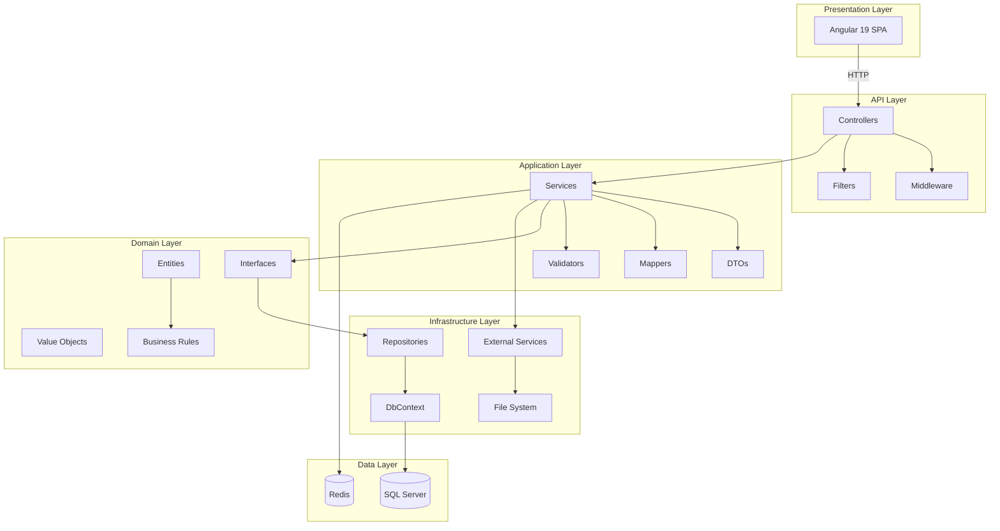

---

## 2. Clean Architecture Principles

### 2.1 The Dependency Rule

> **"Source code dependencies must point only inward, toward higher-level policies."**

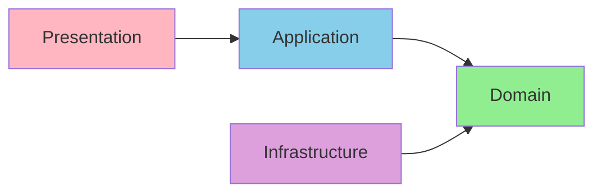

**Key Points**:
- Domain layer has NO dependencies on other layers
- Application layer depends only on Domain
- Infrastructure and Presentation depend on Application and Domain
- Dependencies point INWARD

### 2.2 Layer Responsibilities

#### 🟢 Domain Layer (Core Business Logic)
**Responsibilities**:
- Define business entities
- Define business rules
- Define repository interfaces
- No dependencies on external libraries

**Contains**:
- `Entities/` - Movie, Theater, Booking, User, etc.
- `ValueObjects/` - Price, Email, PhoneNumber, etc.
- `Enums/` - BookingStatus, SeatType, MovieFormat, etc.
- `Interfaces/` - IMovieRepository, IBookingService, etc.
- `Specifications/` - Business rule specifications

**Example**:
```csharp
// Domain Entity - No dependencies
public class Movie
{
    public int Id { get; private set; }
    public string Title { get; private set; }
    public TimeSpan Duration { get; private set; }
    
    // Business rule enforcement
    public void UpdateTitle(string newTitle)
    {
        if (string.IsNullOrWhiteSpace(newTitle))
            throw new DomainException("Movie title cannot be empty");
        
        Title = newTitle;
    }
}
```

#### 🔵 Application Layer (Use Cases)
**Responsibilities**:
- Implement use cases (business workflows)
- Define DTOs for data transfer
- Coordinate between domain and infrastructure
- Handle application-specific business rules

**Contains**:
- `Services/` - MovieService, BookingService, PaymentService
- `DTOs/` - MovieDto, BookingDto, CreateBookingRequest
- `Interfaces/` - IMovieService, IBookingService
- `Mapping/` - AutoMapper profiles
- `Validators/` - FluentValidation validators

**Example**:
```csharp
// Application Service
public class BookingService : IBookingService
{
    private readonly IBookingRepository _bookingRepository;
    private readonly IPaymentService _paymentService;
    private readonly IEmailService _emailService;
    
    public async Task<BookingDto> CreateBooking(CreateBookingRequest request)
    {
        // 1. Validate seats availability
        // 2. Create booking entity
        // 3. Process payment
        // 4. Send confirmation email
        // 5. Return DTO
    }
}
```

#### 🟣 Infrastructure Layer (External Concerns)
**Responsibilities**:
- Implement repository interfaces
- Database access (Entity Framework)
- External service integrations
- File system operations
- Caching implementation

**Contains**:
- `Persistence/` - DbContext, Configurations, Migrations
- `Repositories/` - MovieRepository, BookingRepository
- `ExternalServices/` - EmailService, PaymentGateway, CloudStorage
- `Caching/` - RedisCacheService

**Example**:
```csharp
// Infrastructure Repository
public class MovieRepository : IMovieRepository
{
    private readonly ApplicationDbContext _context;
    
    public async Task<Movie> GetByIdAsync(int id)
    {
        return await _context.Movies
            .Include(m => m.Cast)
            .FirstOrDefaultAsync(m => m.Id == id);
    }
}
```

#### 🔴 Presentation Layer (User Interface)
**Responsibilities**:
- Handle HTTP requests
- Validate input
- Return HTTP responses
- Authentication/Authorization

**Contains**:
- `Controllers/` - MoviesController, BookingsController
- `Middleware/` - ExceptionHandling, Logging
- `Filters/` - Authorization, Validation
- `Models/` - Request/Response models

**Example**:
```csharp
// API Controller
[ApiController]
[Route("api/[controller]")]
public class MoviesController : ControllerBase
{
    private readonly IMovieService _movieService;
    
    [HttpGet]
    public async Task<ActionResult<List<MovieDto>>> GetMovies()
    {
        var movies = await _movieService.GetAllMoviesAsync();
        return Ok(movies);
    }
}
```

---

## 3. System Architecture

### 3.1 Complete System Architecture

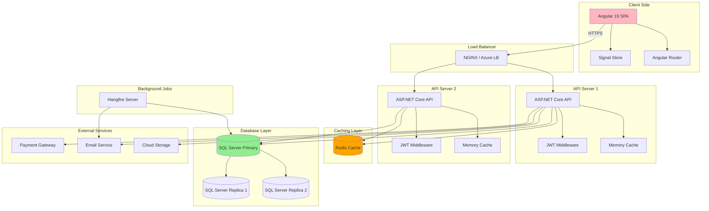

### 3.2 Request Flow

#### User Browsing Movies (Read Operation)

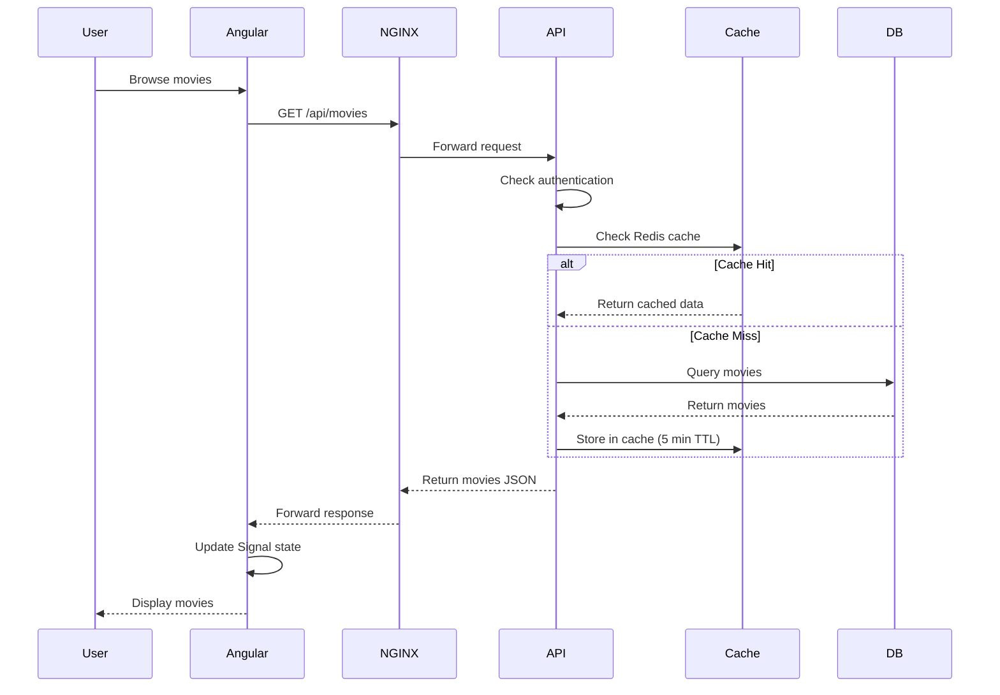

#### User Making Booking (Write Operation)

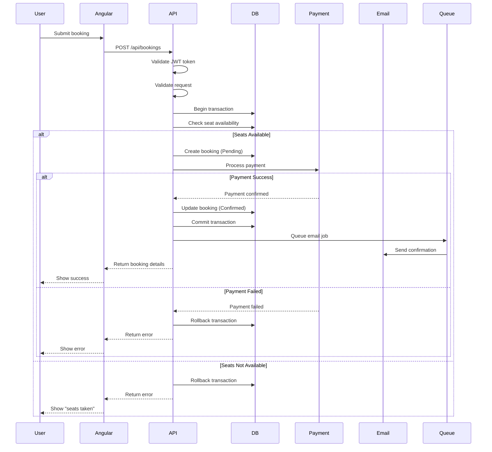

---

## 4. Component Architecture

### 4.1 Backend Components

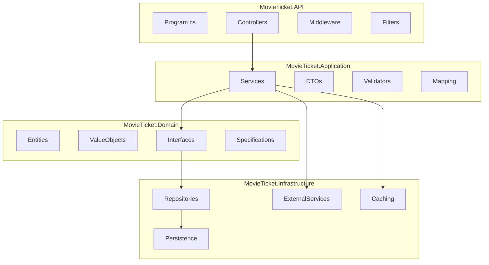

### 4.2 Solution Structure

```
MovieTicketBooking/
│
├── src/
│   ├── MovieTicket.Domain/
│   │   ├── Entities/
│   │   │   ├── Movie.cs
│   │   │   ├── Theater.cs
│   │   │   ├── Screen.cs
│   │   │   ├── Show.cs
│   │   │   ├── Booking.cs
│   │   │   ├── Seat.cs
│   │   │   ├── User.cs
│   │   │   └── Payment.cs
│   │   ├── ValueObjects/
│   │   │   ├── Price.cs
│   │   │   ├── Email.cs
│   │   │   └── PhoneNumber.cs
│   │   ├── Enums/
│   │   │   ├── BookingStatus.cs
│   │   │   ├── SeatType.cs
│   │   │   ├── MovieFormat.cs
│   │   │   └── PaymentStatus.cs
│   │   ├── Interfaces/
│   │   │   ├── Repositories/
│   │   │   └── Services/
│   │   └── Specifications/
│   │
│   ├── MovieTicket.Application/
│   │   ├── Services/
│   │   │   ├── MovieService.cs
│   │   │   ├── BookingService.cs
│   │   │   ├── TheaterService.cs
│   │   │   └── UserService.cs
│   │   ├── DTOs/
│   │   │   ├── Movies/
│   │   │   ├── Bookings/
│   │   │   ├── Theaters/
│   │   │   └── Users/
│   │   ├── Validators/
│   │   ├── Mapping/
│   │   └── Exceptions/
│   │
│   ├── MovieTicket.Infrastructure/
│   │   ├── Persistence/
│   │   │   ├── ApplicationDbContext.cs
│   │   │   ├── Configurations/
│   │   │   └── Migrations/
│   │   ├── Repositories/
│   │   ├── ExternalServices/
│   │   │   ├── EmailService.cs
│   │   │   ├── PaymentGateway.cs
│   │   │   └── CloudStorageService.cs
│   │   └── Caching/
│   │       └── RedisCacheService.cs
│   │
│   └── MovieTicket.API/
│       ├── Controllers/
│       │   ├── MoviesController.cs
│       │   ├── BookingsController.cs
│       │   ├── TheatersController.cs
│       │   └── AuthController.cs
│       ├── Middleware/
│       │   ├── ExceptionHandlingMiddleware.cs
│       │   └── RequestLoggingMiddleware.cs
│       ├── Filters/
│       └── Program.cs
│
├── tests/
│   ├── MovieTicket.UnitTests/
│   ├── MovieTicket.IntegrationTests/
│   └── MovieTicket.E2ETests/
│
└── client/
    └── movie-booking-app/
        ├── src/
        │   ├── app/
        │   │   ├── core/
        │   │   ├── features/
        │   │   ├── shared/
        │   │   └── app.component.ts
        │   └── environments/
        └── angular.json
```

### 4.3 Frontend Architecture

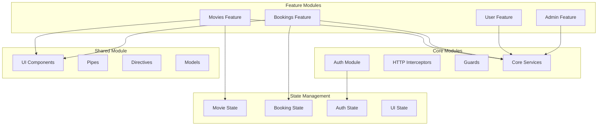

---

## 5. Communication Patterns

### 5.1 API Communication

#### REST API Design

All API endpoints follow RESTful conventions:

| HTTP Method | Endpoint | Description | Request Body | Response |
|------------|----------|-------------|--------------|----------|
| GET | `/api/movies` | Get all movies | - | `Movie[]` |
| GET | `/api/movies/{id}` | Get movie by ID | - | `Movie` |
| POST | `/api/movies` | Create movie | `CreateMovieDto` | `Movie` |
| PUT | `/api/movies/{id}` | Update movie | `UpdateMovieDto` | `Movie` |
| DELETE | `/api/movies/{id}` | Delete movie | - | `204 No Content` |

#### API Response Format

**Success Response**:
```json
{
  "success": true,
  "data": {
    "id": 1,
    "title": "Inception",
    "genre": "Sci-Fi"
  },
  "message": null,
  "errors": null
}
```

**Error Response**:
```json
{
  "success": false,
  "data": null,
  "message": "Validation failed",
  "errors": [
    {
      "field": "email",
      "message": "Email is required"
    }
  ]
}
```

### 5.2 Real-Time Communication

For seat selection, we use **SignalR** for real-time updates:

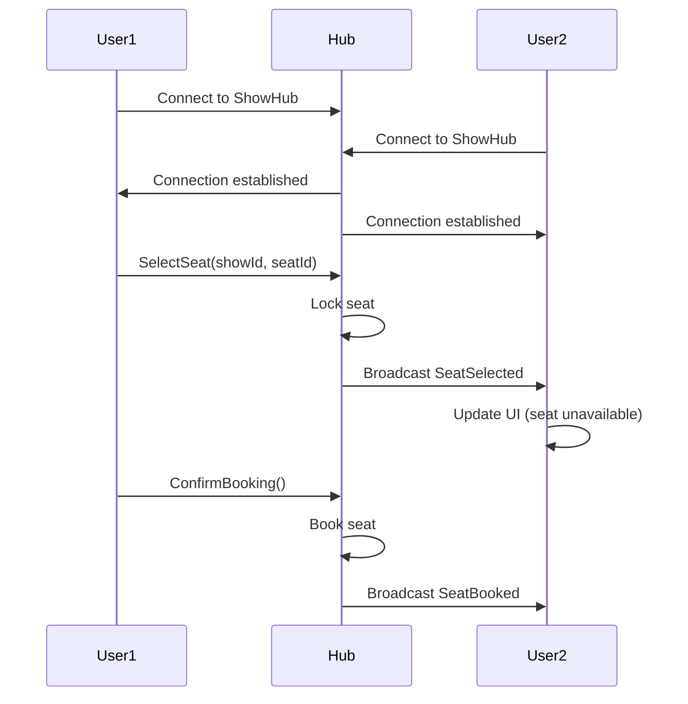

---

## 6. Design Patterns

### 6.1 Repository Pattern

**Purpose**: Abstract data access logic

```csharp
// Generic Repository
public interface IRepository<T> where T : class
{
    Task<T> GetByIdAsync(int id);
    Task<IEnumerable<T>> GetAllAsync();
    Task<T> AddAsync(T entity);
    Task UpdateAsync(T entity);
    Task DeleteAsync(int id);
}

// Specific Repository
public interface IMovieRepository : IRepository<Movie>
{
    Task<IEnumerable<Movie>> GetNowShowingAsync();
    Task<IEnumerable<Movie>> SearchByTitleAsync(string title);
    Task<Movie> GetWithShowsAsync(int id);
}
```

### 6.2 Unit of Work Pattern

**Purpose**: Maintain consistency across multiple repositories

```csharp
public interface IUnitOfWork : IDisposable
{
    IMovieRepository Movies { get; }
    IBookingRepository Bookings { get; }
    ITheaterRepository Theaters { get; }
    
    Task<int> SaveChangesAsync();
    Task BeginTransactionAsync();
    Task CommitAsync();
    Task RollbackAsync();
}
```

### 6.3 Specification Pattern

**Purpose**: Encapsulate query logic

```csharp
public class NowShowingMoviesSpecification : Specification<Movie>
{
    public override Expression<Func<Movie, bool>> ToExpression()
    {
        return movie => movie.ReleaseDate <= DateTime.Now 
                     && movie.EndDate >= DateTime.Now
                     && movie.Status == MovieStatus.Active;
    }
}

// Usage
var spec = new NowShowingMoviesSpecification();
var movies = await _movieRepository.GetAsync(spec);
```

### 6.4 CQRS Pattern (Simplified)

**Purpose**: Separate read and write operations

```csharp
// Command (Write)
public class CreateBookingCommand
{
    public int UserId { get; set; }
    public int ShowId { get; set; }
    public List<int> SeatIds { get; set; }
}

// Command Handler
public class CreateBookingCommandHandler
{
    public async Task<BookingDto> Handle(CreateBookingCommand command)
    {
        // Handle booking creation
    }
}

// Query (Read)
public class GetMoviesByGenreQuery
{
    public string Genre { get; set; }
}

// Query Handler
public class GetMoviesByGenreQueryHandler
{
    public async Task<List<MovieDto>> Handle(GetMoviesByGenreQuery query)
    {
        // Return movies
    }
}
```

### 6.5 Dependency Injection

**Purpose**: Loose coupling and testability

```csharp
// Program.cs
builder.Services.AddScoped<IMovieRepository, MovieRepository>();
builder.Services.AddScoped<IMovieService, MovieService>();
builder.Services.AddScoped<IUnitOfWork, UnitOfWork>();

// Controller
public class MoviesController : ControllerBase
{
    private readonly IMovieService _movieService;
    
    // Dependencies injected via constructor
    public MoviesController(IMovieService movieService)
    {
        _movieService = movieService;
    }
}
```

---

## 7. Scalability Strategy

### 7.1 Horizontal Scaling

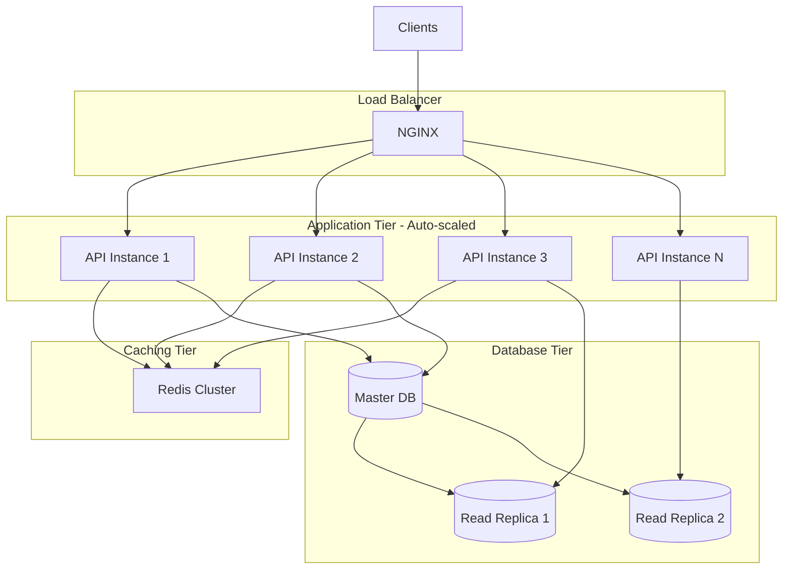

### 7.2 Caching Strategy

**Multi-Level Caching**:

1. **L1 Cache**: In-Memory Cache (short TTL, 1-5 min)
   - Frequently accessed data
   - User session data

2. **L2 Cache**: Redis (medium TTL, 10-60 min)
   - Movie catalog
   - Theater information
   - Show schedules

3. **L3 Cache**: CDN (long TTL, 1-24 hours)
   - Movie posters
   - Static assets

**Cache Invalidation**:
```csharp
public async Task UpdateMovie(UpdateMovieDto dto)
{
    await _movieRepository.UpdateAsync(dto);
    await _cache.RemoveAsync($"movie:{dto.Id}");
    await _cache.RemoveAsync("movies:all");
}
```

### 7.3 Database Optimization

**Indexing Strategy**:
```sql
-- Composite index for frequent queries
CREATE INDEX IX_Shows_MovieId_DateTime 
ON Shows(MovieId, ShowDateTime) 
INCLUDE (ScreenId, Price);

-- Partial index for active movies
CREATE INDEX IX_Movies_Active 
ON Movies(Status) 
WHERE Status = 'Active';
```

**Read/Write Splitting**:
```csharp
// Write to master
await _unitOfWork.Bookings.AddAsync(booking);
await _unitOfWork.SaveChangesAsync();

// Read from replica
var movies = await _readOnlyContext.Movies.ToListAsync();
```

### 7.4 Performance Targets

| Metric | Target | Strategy |
|--------|--------|----------|
| API Response Time (P95) | < 200ms | Caching, indexing |
| Database Query Time | < 50ms | Optimized queries, indexes |
| Page Load Time | < 2s | Code splitting, lazy loading |
| Concurrent Users | 10,000+ | Horizontal scaling |
| Booking Processing | 1000/min | Async processing, queues |

---

## 8. Security Architecture

### 8.1 Security Layers

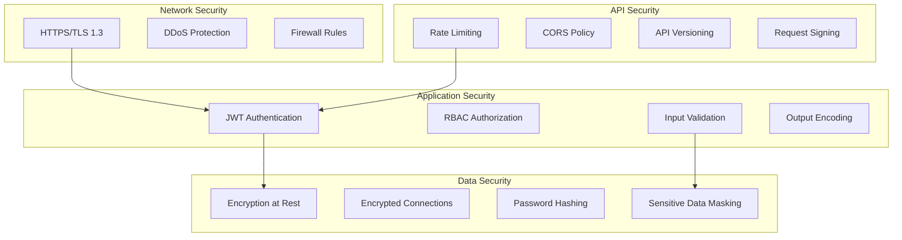

### 8.2 Authentication Flow

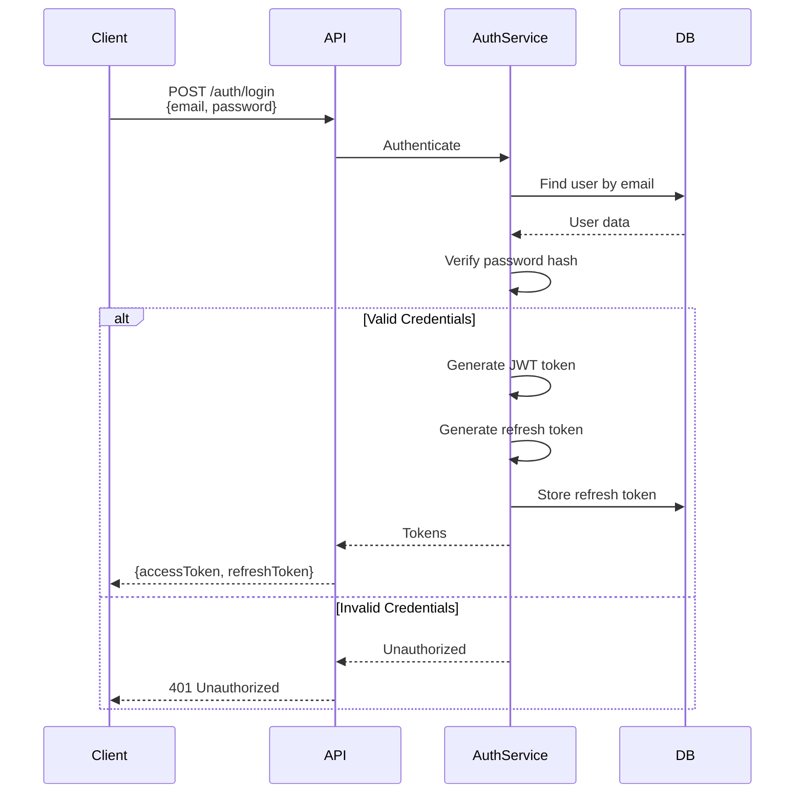

### 8.3 Authorization Strategy

**Role-Based Access Control (RBAC)**:

```csharp
[Authorize(Roles = "Admin")]
[HttpPost("movies")]
public async Task<ActionResult> CreateMovie(CreateMovieDto dto)
{
    // Only admins can create movies
}

[Authorize(Roles = "User,Admin")]
[HttpPost("bookings")]
public async Task<ActionResult> CreateBooking(CreateBookingDto dto)
{
    // Both users and admins can create bookings
}
```

**Claims-Based Authorization**:
```csharp
[Authorize(Policy = "CanCancelBooking")]
[HttpDelete("bookings/{id}")]
public async Task<ActionResult> CancelBooking(int id)
{
    // Custom policy checks if user owns the booking
}

// Policy definition
builder.Services.AddAuthorization(options =>
{
    options.AddPolicy("CanCancelBooking", policy =>
        policy.RequireAssertion(context =>
        {
            var userId = context.User.FindFirst(ClaimTypes.NameIdentifier)?.Value;
            var bookingUserId = // Get from booking
            return userId == bookingUserId || context.User.IsInRole("Admin");
        }));
});
```

### 8.4 Security Best Practices

#### Input Validation
```csharp
public class CreateBookingValidator : AbstractValidator<CreateBookingDto>
{
    public CreateBookingValidator()
    {
        RuleFor(x => x.ShowId)
            .GreaterThan(0)
            .WithMessage("Invalid show ID");
        
        RuleFor(x => x.SeatIds)
            .NotEmpty()
            .WithMessage("At least one seat must be selected")
            .Must(seats => seats.Count <= 10)
            .WithMessage("Maximum 10 seats per booking");
    }
}
```

#### SQL Injection Prevention
```csharp
// ✅ Good: Parameterized query
var movie = await _context.Movies
    .Where(m => m.Title == userInput)
    .FirstOrDefaultAsync();

// ❌ Bad: String concatenation
var query = $"SELECT * FROM Movies WHERE Title = '{userInput}'";
```

#### XSS Prevention
```csharp
// Angular automatically sanitizes
<div>{{ userReview }}</div>

// For backend
public string SanitizeHtml(string input)
{
    return HttpUtility.HtmlEncode(input);
}
```

---

## 9. Deployment Architecture

### 9.1 Production Deployment

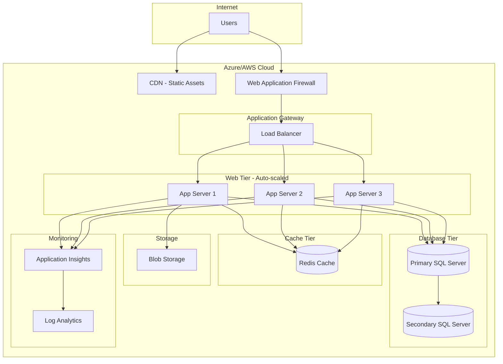

---

## 10. Summary & Key Takeaways

### ✅ What We Covered

1. **Clean Architecture**: Separation of concerns with clear boundaries
2. **Layer Responsibilities**: Domain, Application, Infrastructure, API
3. **Communication Patterns**: REST, SignalR, Event-driven
4. **Design Patterns**: Repository, Unit of Work, Specification, CQRS
5. **Scalability**: Horizontal scaling, caching, database optimization
6. **Security**: Multi-layered security approach

### 🎯 Architecture Decisions

| Decision | Choice | Rationale |
|----------|--------|-----------|
| Architecture Style | Clean Architecture | Maintainability, testability |
| Communication | REST + SignalR | Standard + real-time needs |
| State Management | Angular Signals | Modern, reactive approach |
| Caching | Redis | Fast, scalable, pub/sub support |
| Authentication | JWT | Stateless, scalable |
| Database | SQL Server | ACID, strong consistency |

---

## 11. Next Steps

Now that you understand the high-level architecture, we'll dive into the database design.

👉 **[Module 03: Database Design and ER Diagrams](03-Database-Design-and-ER-Diagrams.md)**

In the next module, you'll learn:
- Complete ER diagram
- Table schemas and relationships
- Indexing strategy
- Data migration approach
- Sample data seeding

---

**Module 02 Complete** ✅  
**Progress**: 2/18 modules (11%)
