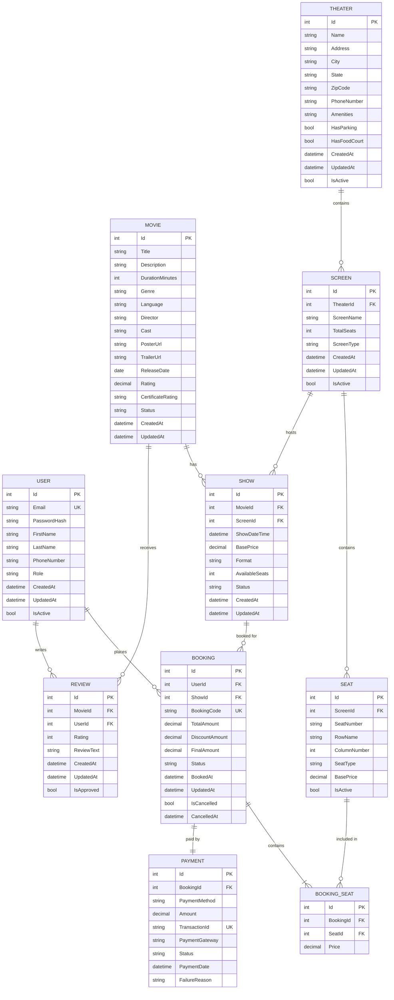
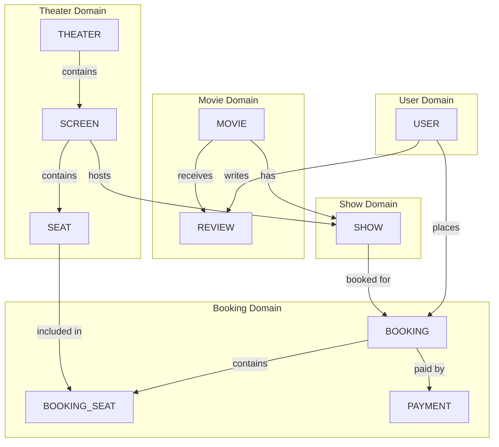
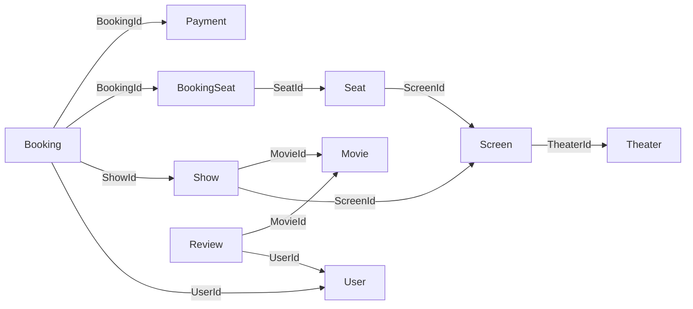

# Module 03: Database Design and ER Diagrams

## 📖 Table of Contents
1. [Database Overview](#database-overview)
2. [Entity Relationship Diagram](#entity-relationship-diagram)
3. [Table Schemas](#table-schemas)
4. [Relationships and Constraints](#relationships-and-constraints)
5. [Indexing Strategy](#indexing-strategy)
6. [Sample Data](#sample-data)
7. [Database Optimization](#database-optimization)

---

## 1. Database Overview

### 1.1 Database Requirements

Our movie ticket booking system requires a relational database to handle:
- Complex relationships between entities
- ACID transactions for bookings and payments
- Data integrity and consistency
- Efficient querying and reporting

### 1.2 Key Entities

| Entity | Purpose | Key Relationships |
|--------|---------|-------------------|
| **User** | Customer and admin accounts | → Bookings, Reviews |
| **Movie** | Movie information | → Shows, Reviews |
| **Theater** | Theater locations | → Screens |
| **Screen** | Individual screens in theaters | → Seats, Shows |
| **Seat** | Individual seats in screens | → Bookings |
| **Show** | Movie showings | → Bookings, Movie, Screen |
| **Booking** | Ticket reservations | → User, Show, Seats, Payment |
| **Payment** | Transaction records | → Booking |
| **Review** | Movie ratings and reviews | → Movie, User |

---

## 2. Entity Relationship Diagram

### 2.1 Complete ER Diagram



### 2.2 Database Diagram (Visual Representation)



---

## 3. Table Schemas

### 3.1 User Table

```sql
CREATE TABLE Users (
    Id INT PRIMARY KEY IDENTITY(1,1),
    Email NVARCHAR(256) NOT NULL UNIQUE,
    PasswordHash NVARCHAR(512) NOT NULL,
    FirstName NVARCHAR(100) NOT NULL,
    LastName NVARCHAR(100) NOT NULL,
    PhoneNumber NVARCHAR(20) NULL,
    Role NVARCHAR(50) NOT NULL DEFAULT 'User', -- 'User', 'Admin'
    ProfilePictureUrl NVARCHAR(500) NULL,
    EmailVerified BIT NOT NULL DEFAULT 0,
    EmailVerificationToken NVARCHAR(256) NULL,
    PasswordResetToken NVARCHAR(256) NULL,
    PasswordResetTokenExpiry DATETIME2 NULL,
    FailedLoginAttempts INT NOT NULL DEFAULT 0,
    LockoutEnd DATETIME2 NULL,
    CreatedAt DATETIME2 NOT NULL DEFAULT GETUTCDATE(),
    UpdatedAt DATETIME2 NOT NULL DEFAULT GETUTCDATE(),
    IsActive BIT NOT NULL DEFAULT 1,
    IsDeleted BIT NOT NULL DEFAULT 0
);

-- Indexes
CREATE INDEX IX_Users_Email ON Users(Email);
CREATE INDEX IX_Users_Role ON Users(Role);
CREATE INDEX IX_Users_IsActive ON Users(IsActive) WHERE IsActive = 1;
```

### 3.2 Movie Table

```sql
CREATE TABLE Movies (
    Id INT PRIMARY KEY IDENTITY(1,1),
    Title NVARCHAR(200) NOT NULL,
    Slug NVARCHAR(250) NOT NULL UNIQUE, -- URL-friendly title
    Description NVARCHAR(MAX) NULL,
    DurationMinutes INT NOT NULL,
    Genre NVARCHAR(100) NOT NULL, -- Can be comma-separated
    Language NVARCHAR(50) NOT NULL,
    Director NVARCHAR(200) NULL,
    Cast NVARCHAR(MAX) NULL, -- JSON or comma-separated
    PosterUrl NVARCHAR(500) NULL,
    BannerUrl NVARCHAR(500) NULL,
    TrailerUrl NVARCHAR(500) NULL,
    ReleaseDate DATE NOT NULL,
    EndDate DATE NULL,
    Rating DECIMAL(3,2) NULL DEFAULT 0, -- Average rating (0-5)
    TotalReviews INT NOT NULL DEFAULT 0,
    CertificateRating NVARCHAR(10) NULL, -- 'U', 'UA', 'A', 'R', etc.
    Status NVARCHAR(50) NOT NULL DEFAULT 'ComingSoon', -- 'ComingSoon', 'NowShowing', 'Archived'
    CreatedAt DATETIME2 NOT NULL DEFAULT GETUTCDATE(),
    UpdatedAt DATETIME2 NOT NULL DEFAULT GETUTCDATE(),
    IsDeleted BIT NOT NULL DEFAULT 0
);

-- Indexes
CREATE INDEX IX_Movies_Status ON Movies(Status) WHERE IsDeleted = 0;
CREATE INDEX IX_Movies_Genre ON Movies(Genre);
CREATE INDEX IX_Movies_Language ON Movies(Language);
CREATE INDEX IX_Movies_ReleaseDate ON Movies(ReleaseDate DESC);
CREATE FULLTEXT INDEX ON Movies(Title, Description) KEY INDEX PK_Movies;
```

### 3.3 Theater Table

```sql
CREATE TABLE Theaters (
    Id INT PRIMARY KEY IDENTITY(1,1),
    Name NVARCHAR(200) NOT NULL,
    Slug NVARCHAR(250) NOT NULL UNIQUE,
    Address NVARCHAR(500) NOT NULL,
    City NVARCHAR(100) NOT NULL,
    State NVARCHAR(100) NOT NULL,
    ZipCode NVARCHAR(20) NOT NULL,
    PhoneNumber NVARCHAR(20) NULL,
    Email NVARCHAR(256) NULL,
    Latitude DECIMAL(10,8) NULL,
    Longitude DECIMAL(11,8) NULL,
    Amenities NVARCHAR(MAX) NULL, -- JSON array
    HasParking BIT NOT NULL DEFAULT 0,
    HasFoodCourt BIT NOT NULL DEFAULT 0,
    HasWheelchairAccess BIT NOT NULL DEFAULT 0,
    CreatedAt DATETIME2 NOT NULL DEFAULT GETUTCDATE(),
    UpdatedAt DATETIME2 NOT NULL DEFAULT GETUTCDATE(),
    IsActive BIT NOT NULL DEFAULT 1,
    IsDeleted BIT NOT NULL DEFAULT 0
);

-- Indexes
CREATE INDEX IX_Theaters_City ON Theaters(City) WHERE IsDeleted = 0;
CREATE INDEX IX_Theaters_IsActive ON Theaters(IsActive) WHERE IsActive = 1;
```

### 3.4 Screen Table

```sql
CREATE TABLE Screens (
    Id INT PRIMARY KEY IDENTITY(1,1),
    TheaterId INT NOT NULL,
    ScreenName NVARCHAR(100) NOT NULL,
    TotalSeats INT NOT NULL,
    ScreenType NVARCHAR(50) NOT NULL DEFAULT 'Standard', -- 'Standard', '3D', 'IMAX', 'Dolby'
    CreatedAt DATETIME2 NOT NULL DEFAULT GETUTCDATE(),
    UpdatedAt DATETIME2 NOT NULL DEFAULT GETUTCDATE(),
    IsActive BIT NOT NULL DEFAULT 1,
    IsDeleted BIT NOT NULL DEFAULT 0,
    
    CONSTRAINT FK_Screens_Theaters FOREIGN KEY (TheaterId) 
        REFERENCES Theaters(Id),
    CONSTRAINT UC_Screen_Theater UNIQUE (TheaterId, ScreenName)
);

-- Indexes
CREATE INDEX IX_Screens_TheaterId ON Screens(TheaterId) WHERE IsDeleted = 0;
```

### 3.5 Seat Table

```sql
CREATE TABLE Seats (
    Id INT PRIMARY KEY IDENTITY(1,1),
    ScreenId INT NOT NULL,
    SeatNumber NVARCHAR(10) NOT NULL, -- e.g., 'A1', 'B5'
    RowName NVARCHAR(5) NOT NULL, -- e.g., 'A', 'B', 'C'
    ColumnNumber INT NOT NULL, -- e.g., 1, 2, 3
    SeatType NVARCHAR(50) NOT NULL DEFAULT 'Regular', -- 'Regular', 'Premium', 'VIP'
    BasePrice DECIMAL(10,2) NOT NULL, -- Additional price for this seat type
    IsActive BIT NOT NULL DEFAULT 1,
    
    CONSTRAINT FK_Seats_Screens FOREIGN KEY (ScreenId) 
        REFERENCES Screens(Id),
    CONSTRAINT UC_Seat_Screen UNIQUE (ScreenId, SeatNumber)
);

-- Indexes
CREATE INDEX IX_Seats_ScreenId ON Seats(ScreenId) WHERE IsActive = 1;
CREATE INDEX IX_Seats_SeatType ON Seats(SeatType);
```

### 3.6 Show Table

```sql
CREATE TABLE Shows (
    Id INT PRIMARY KEY IDENTITY(1,1),
    MovieId INT NOT NULL,
    ScreenId INT NOT NULL,
    ShowDateTime DATETIME2 NOT NULL,
    BasePrice DECIMAL(10,2) NOT NULL, -- Base ticket price
    Format NVARCHAR(50) NOT NULL DEFAULT '2D', -- '2D', '3D', 'IMAX'
    TotalSeats INT NOT NULL,
    BookedSeats INT NOT NULL DEFAULT 0,
    AvailableSeats AS (TotalSeats - BookedSeats) PERSISTED,
    Status NVARCHAR(50) NOT NULL DEFAULT 'Active', -- 'Active', 'Cancelled', 'Completed'
    CreatedAt DATETIME2 NOT NULL DEFAULT GETUTCDATE(),
    UpdatedAt DATETIME2 NOT NULL DEFAULT GETUTCDATE(),
    
    CONSTRAINT FK_Shows_Movies FOREIGN KEY (MovieId) 
        REFERENCES Movies(Id),
    CONSTRAINT FK_Shows_Screens FOREIGN KEY (ScreenId) 
        REFERENCES Screens(Id)
);

-- Indexes
CREATE INDEX IX_Shows_MovieId_DateTime ON Shows(MovieId, ShowDateTime) 
    INCLUDE (ScreenId, BasePrice, AvailableSeats);
CREATE INDEX IX_Shows_ScreenId_DateTime ON Shows(ScreenId, ShowDateTime);
CREATE INDEX IX_Shows_DateTime ON Shows(ShowDateTime) WHERE Status = 'Active';
```

### 3.7 Booking Table

```sql
CREATE TABLE Bookings (
    Id INT PRIMARY KEY IDENTITY(1,1),
    UserId INT NOT NULL,
    ShowId INT NOT NULL,
    BookingCode NVARCHAR(50) NOT NULL UNIQUE, -- e.g., 'BK20240101001'
    TotalAmount DECIMAL(10,2) NOT NULL,
    DiscountAmount DECIMAL(10,2) NOT NULL DEFAULT 0,
    ConvenienceFee DECIMAL(10,2) NOT NULL DEFAULT 0,
    FinalAmount DECIMAL(10,2) NOT NULL,
    PromoCode NVARCHAR(50) NULL,
    TotalSeats INT NOT NULL,
    Status NVARCHAR(50) NOT NULL DEFAULT 'Pending', -- 'Pending', 'Confirmed', 'Cancelled', 'Expired'
    BookedAt DATETIME2 NOT NULL DEFAULT GETUTCDATE(),
    UpdatedAt DATETIME2 NOT NULL DEFAULT GETUTCDATE(),
    IsCancelled BIT NOT NULL DEFAULT 0,
    CancelledAt DATETIME2 NULL,
    CancellationReason NVARCHAR(500) NULL,
    
    CONSTRAINT FK_Bookings_Users FOREIGN KEY (UserId) 
        REFERENCES Users(Id),
    CONSTRAINT FK_Bookings_Shows FOREIGN KEY (ShowId) 
        REFERENCES Shows(Id)
);

-- Indexes
CREATE INDEX IX_Bookings_UserId ON Bookings(UserId);
CREATE INDEX IX_Bookings_ShowId ON Bookings(ShowId);
CREATE INDEX IX_Bookings_BookingCode ON Bookings(BookingCode);
CREATE INDEX IX_Bookings_Status ON Bookings(Status);
CREATE INDEX IX_Bookings_BookedAt ON Bookings(BookedAt DESC);
```

### 3.8 BookingSeat Table (Junction Table)

```sql
CREATE TABLE BookingSeats (
    Id INT PRIMARY KEY IDENTITY(1,1),
    BookingId INT NOT NULL,
    SeatId INT NOT NULL,
    Price DECIMAL(10,2) NOT NULL, -- Price at the time of booking
    
    CONSTRAINT FK_BookingSeats_Bookings FOREIGN KEY (BookingId) 
        REFERENCES Bookings(Id) ON DELETE CASCADE,
    CONSTRAINT FK_BookingSeats_Seats FOREIGN KEY (SeatId) 
        REFERENCES Seats(Id),
    CONSTRAINT UC_BookingSeat UNIQUE (BookingId, SeatId)
);

-- Indexes
CREATE INDEX IX_BookingSeats_BookingId ON BookingSeats(BookingId);
CREATE INDEX IX_BookingSeats_SeatId ON BookingSeats(SeatId);
```

### 3.9 Payment Table

```sql
CREATE TABLE Payments (
    Id INT PRIMARY KEY IDENTITY(1,1),
    BookingId INT NOT NULL UNIQUE,
    PaymentMethod NVARCHAR(50) NOT NULL, -- 'Card', 'UPI', 'Wallet', 'NetBanking'
    Amount DECIMAL(10,2) NOT NULL,
    TransactionId NVARCHAR(256) NOT NULL UNIQUE,
    PaymentGateway NVARCHAR(50) NOT NULL, -- 'Stripe', 'Razorpay', etc.
    GatewayResponse NVARCHAR(MAX) NULL, -- JSON response
    Status NVARCHAR(50) NOT NULL DEFAULT 'Pending', -- 'Pending', 'Success', 'Failed', 'Refunded'
    PaymentDate DATETIME2 NULL,
    RefundAmount DECIMAL(10,2) NULL,
    RefundDate DATETIME2 NULL,
    RefundTransactionId NVARCHAR(256) NULL,
    FailureReason NVARCHAR(500) NULL,
    CreatedAt DATETIME2 NOT NULL DEFAULT GETUTCDATE(),
    UpdatedAt DATETIME2 NOT NULL DEFAULT GETUTCDATE(),
    
    CONSTRAINT FK_Payments_Bookings FOREIGN KEY (BookingId) 
        REFERENCES Bookings(Id)
);

-- Indexes
CREATE INDEX IX_Payments_TransactionId ON Payments(TransactionId);
CREATE INDEX IX_Payments_Status ON Payments(Status);
CREATE INDEX IX_Payments_PaymentDate ON Payments(PaymentDate DESC);
```

### 3.10 Review Table

```sql
CREATE TABLE Reviews (
    Id INT PRIMARY KEY IDENTITY(1,1),
    MovieId INT NOT NULL,
    UserId INT NOT NULL,
    Rating INT NOT NULL, -- 1-5
    ReviewText NVARCHAR(MAX) NULL,
    CreatedAt DATETIME2 NOT NULL DEFAULT GETUTCDATE(),
    UpdatedAt DATETIME2 NOT NULL DEFAULT GETUTCDATE(),
    IsApproved BIT NOT NULL DEFAULT 0,
    IsDeleted BIT NOT NULL DEFAULT 0,
    
    CONSTRAINT FK_Reviews_Movies FOREIGN KEY (MovieId) 
        REFERENCES Movies(Id),
    CONSTRAINT FK_Reviews_Users FOREIGN KEY (UserId) 
        REFERENCES Users(Id),
    CONSTRAINT UC_Review_User_Movie UNIQUE (UserId, MovieId),
    CONSTRAINT CK_Review_Rating CHECK (Rating BETWEEN 1 AND 5)
);

-- Indexes
CREATE INDEX IX_Reviews_MovieId ON Reviews(MovieId) WHERE IsDeleted = 0;
CREATE INDEX IX_Reviews_UserId ON Reviews(UserId);
CREATE INDEX IX_Reviews_IsApproved ON Reviews(IsApproved) WHERE IsApproved = 1;
```

---

## 4. Relationships and Constraints

### 4.1 Foreign Key Relationships



### 4.2 Constraint Summary

| Constraint Type | Count | Purpose |
|----------------|-------|---------|
| Primary Keys | 10 | Unique identification |
| Foreign Keys | 11 | Referential integrity |
| Unique Constraints | 8 | Prevent duplicates |
| Check Constraints | 1 | Data validation |
| Default Constraints | 20+ | Auto-fill values |

### 4.3 Cascading Rules

```sql
-- When Booking is deleted, delete BookingSeats
ALTER TABLE BookingSeats 
ADD CONSTRAINT FK_BookingSeats_Bookings 
FOREIGN KEY (BookingId) REFERENCES Bookings(Id) 
ON DELETE CASCADE;

-- When User is deleted, SET NULL on Bookings (keep booking history)
-- OR use soft delete (IsDeleted flag) - RECOMMENDED
```

---

## 5. Indexing Strategy

### 5.1 Index Types

#### Clustered Indexes
```sql
-- Primary key creates clustered index by default
-- Only ONE per table
ALTER TABLE Movies ADD CONSTRAINT PK_Movies PRIMARY KEY CLUSTERED (Id);
```

#### Non-Clustered Indexes
```sql
-- Frequent search by email
CREATE INDEX IX_Users_Email ON Users(Email);

-- Frequent queries for shows
CREATE INDEX IX_Shows_MovieId_DateTime 
ON Shows(MovieId, ShowDateTime) 
INCLUDE (BasePrice, AvailableSeats);
```

#### Filtered Indexes
```sql
-- Index only active movies
CREATE INDEX IX_Movies_Active 
ON Movies(Status) 
WHERE IsDeleted = 0 AND Status = 'NowShowing';

-- Index only active theaters
CREATE INDEX IX_Theaters_Active 
ON Theaters(City) 
WHERE IsActive = 1 AND IsDeleted = 0;
```

#### Covering Indexes
```sql
-- Cover entire query without table lookup
CREATE INDEX IX_Shows_MovieDateTime_Cover 
ON Shows(MovieId, ShowDateTime) 
INCLUDE (ScreenId, BasePrice, AvailableSeats, Status);
```

### 5.2 Index Maintenance

```sql
-- Rebuild fragmented indexes
ALTER INDEX ALL ON Movies REBUILD;

-- Update statistics
UPDATE STATISTICS Movies;

-- Check index fragmentation
SELECT 
    OBJECT_NAME(ips.object_id) AS TableName,
    i.name AS IndexName,
    ips.avg_fragmentation_in_percent
FROM sys.dm_db_index_physical_stats(DB_ID(), NULL, NULL, NULL, 'DETAILED') ips
INNER JOIN sys.indexes i ON ips.object_id = i.object_id 
    AND ips.index_id = i.index_id
WHERE ips.avg_fragmentation_in_percent > 10
ORDER BY ips.avg_fragmentation_in_percent DESC;
```

---

## 6. Sample Data

### 6.1 Seed Data Script

```sql
-- Insert sample users
INSERT INTO Users (Email, PasswordHash, FirstName, LastName, PhoneNumber, Role, EmailVerified) VALUES
('admin@moviebooking.com', 'HASHED_PASSWORD', 'Admin', 'User', '1234567890', 'Admin', 1),
('john@example.com', 'HASHED_PASSWORD', 'John', 'Doe', '9876543210', 'User', 1),
('jane@example.com', 'HASHED_PASSWORD', 'Jane', 'Smith', '8765432109', 'User', 1);

-- Insert sample movies
INSERT INTO Movies (Title, Slug, Description, DurationMinutes, Genre, Language, Director, Cast, 
    PosterUrl, ReleaseDate, CertificateRating, Status) VALUES
('Inception', 'inception', 'A thief who steals corporate secrets through dream-sharing technology...', 
    148, 'Sci-Fi,Thriller', 'English', 'Christopher Nolan', 'Leonardo DiCaprio,Tom Hardy', 
    '/posters/inception.jpg', '2010-07-16', 'PG-13', 'NowShowing'),
    
('The Dark Knight', 'the-dark-knight', 'When the menace known as the Joker emerges...', 
    152, 'Action,Crime,Drama', 'English', 'Christopher Nolan', 'Christian Bale,Heath Ledger', 
    '/posters/dark-knight.jpg', '2008-07-18', 'PG-13', 'NowShowing'),
    
('Interstellar', 'interstellar', 'A team of explorers travel through a wormhole in space...', 
    169, 'Sci-Fi,Drama', 'English', 'Christopher Nolan', 'Matthew McConaughey,Anne Hathaway', 
    '/posters/interstellar.jpg', '2014-11-07', 'PG-13', 'NowShowing');

-- Insert sample theaters
INSERT INTO Theaters (Name, Slug, Address, City, State, ZipCode, PhoneNumber, 
    Latitude, Longitude, HasParking, HasFoodCourt) VALUES
('PVR Cinemas - Phoenix Mall', 'pvr-phoenix-mall', 
    'Phoenix Market City, LBS Marg', 'Mumbai', 'Maharashtra', '400070', 
    '022-12345678', 19.0896, 72.8656, 1, 1),
    
('INOX - R City Mall', 'inox-r-city-mall', 
    'R City Mall, Ghatkopar', 'Mumbai', 'Maharashtra', '400086', 
    '022-87654321', 19.0862, 72.9081, 1, 1);

-- Insert screens for theaters
INSERT INTO Screens (TheaterId, ScreenName, TotalSeats, ScreenType) VALUES
(1, 'Screen 1', 150, 'Standard'),
(1, 'Screen 2', 200, '3D'),
(1, 'Screen 3', 100, 'IMAX'),
(2, 'Screen 1', 180, 'Standard'),
(2, 'Screen 2', 150, 'Dolby');

-- Insert seats for Screen 1 (150 seats: 10 rows x 15 columns)
DECLARE @ScreenId INT = 1;
DECLARE @Row CHAR(1);
DECLARE @Col INT;
DECLARE @SeatType NVARCHAR(50);
DECLARE @BasePrice DECIMAL(10,2);

DECLARE @RowNum INT = 1;
WHILE @RowNum <= 10
BEGIN
    SET @Row = CHAR(64 + @RowNum); -- A, B, C, ...
    
    -- Determine seat type based on row
    IF @RowNum <= 3
        SET @SeatType = 'Regular', @BasePrice = 0;
    ELSE IF @RowNum <= 7
        SET @SeatType = 'Premium', @BasePrice = 50;
    ELSE
        SET @SeatType = 'VIP', @BasePrice = 100;
    
    SET @Col = 1;
    WHILE @Col <= 15
    BEGIN
        INSERT INTO Seats (ScreenId, SeatNumber, RowName, ColumnNumber, SeatType, BasePrice)
        VALUES (@ScreenId, @Row + CAST(@Col AS VARCHAR(2)), @Row, @Col, @SeatType, @BasePrice);
        
        SET @Col = @Col + 1;
    END
    
    SET @RowNum = @RowNum + 1;
END

-- Insert shows
INSERT INTO Shows (MovieId, ScreenId, ShowDateTime, BasePrice, Format, TotalSeats) VALUES
(1, 1, '2024-12-15 10:00:00', 200.00, '2D', 150),
(1, 1, '2024-12-15 14:00:00', 250.00, '2D', 150),
(1, 2, '2024-12-15 18:00:00', 350.00, '3D', 200),
(2, 4, '2024-12-15 11:00:00', 200.00, '2D', 180),
(3, 3, '2024-12-15 20:00:00', 500.00, 'IMAX', 100);
```

---

## 7. Database Optimization

### 7.1 Query Optimization Examples

#### Bad Query (N+1 Problem)
```sql
-- Gets all shows, then queries movie for each show
SELECT * FROM Shows; -- 100 rows
-- Then for each show:
SELECT * FROM Movies WHERE Id = @MovieId; -- 100 queries!
```

#### Good Query (Join)
```sql
-- Single query with join
SELECT 
    s.*,
    m.Title, m.PosterUrl, m.Rating,
    sc.ScreenName,
    t.Name AS TheaterName
FROM Shows s
INNER JOIN Movies m ON s.MovieId = m.Id
INNER JOIN Screens sc ON s.ScreenId = sc.Id
INNER JOIN Theaters t ON sc.TheaterId = t.Id
WHERE s.ShowDateTime >= GETUTCDATE()
AND s.Status = 'Active';
```

### 7.2 Stored Procedures

#### Get Available Seats for Show
```sql
CREATE PROCEDURE sp_GetAvailableSeats
    @ShowId INT
AS
BEGIN
    SELECT 
        s.Id,
        s.SeatNumber,
        s.RowName,
        s.ColumnNumber,
        s.SeatType,
        sh.BasePrice + s.BasePrice AS TotalPrice,
        CASE 
            WHEN bs.BookingId IS NOT NULL THEN 'Booked'
            ELSE 'Available'
        END AS Status
    FROM Shows sh
    INNER JOIN Screens sc ON sh.ScreenId = sc.Id
    INNER JOIN Seats s ON sc.Id = s.ScreenId
    LEFT JOIN BookingSeats bs ON s.Id = bs.SeatId
        AND EXISTS (
            SELECT 1 FROM Bookings b 
            WHERE b.Id = bs.BookingId 
            AND b.ShowId = @ShowId 
            AND b.Status = 'Confirmed'
        )
    WHERE sh.Id = @ShowId
    ORDER BY s.RowName, s.ColumnNumber;
END
```

#### Create Booking with Transaction
```sql
CREATE PROCEDURE sp_CreateBooking
    @UserId INT,
    @ShowId INT,
    @SeatIds NVARCHAR(MAX), -- Comma-separated seat IDs
    @TotalAmount DECIMAL(10,2),
    @BookingId INT OUTPUT
AS
BEGIN
    SET NOCOUNT ON;
    BEGIN TRANSACTION;
    
    DECLARE @BookingCode NVARCHAR(50);
    DECLARE @SeatCount INT;
    
    BEGIN TRY
        -- Generate booking code
        SET @BookingCode = 'BK' + FORMAT(GETUTCDATE(), 'yyyyMMdd') + 
            RIGHT('000' + CAST(NEXT VALUE FOR BookingCode_Seq AS VARCHAR(3)), 3);
        
        -- Create booking
        INSERT INTO Bookings (UserId, ShowId, BookingCode, TotalAmount, FinalAmount, TotalSeats)
        VALUES (@UserId, @ShowId, @BookingCode, @TotalAmount, @TotalAmount, 
            (SELECT COUNT(*) FROM STRING_SPLIT(@SeatIds, ',')));
        
        SET @BookingId = SCOPE_IDENTITY();
        
        -- Insert booking seats
        INSERT INTO BookingSeats (BookingId, SeatId, Price)
        SELECT 
            @BookingId,
            value,
            sh.BasePrice + s.BasePrice
        FROM STRING_SPLIT(@SeatIds, ',')
        INNER JOIN Seats s ON s.Id = value
        CROSS JOIN Shows sh
        WHERE sh.Id = @ShowId;
        
        -- Update booked seats count
        UPDATE Shows
        SET BookedSeats = BookedSeats + (SELECT COUNT(*) FROM STRING_SPLIT(@SeatIds, ','))
        WHERE Id = @ShowId;
        
        COMMIT TRANSACTION;
    END TRY
    BEGIN CATCH
        ROLLBACK TRANSACTION;
        THROW;
    END CATCH
END
```

### 7.3 Database Views

```sql
-- View for upcoming shows with movie and theater details
CREATE VIEW vw_UpcomingShows AS
SELECT 
    s.Id AS ShowId,
    m.Id AS MovieId,
    m.Title AS MovieTitle,
    m.PosterUrl,
    m.Rating,
    m.DurationMinutes,
    m.Genre,
    m.CertificateRating,
    s.ShowDateTime,
    s.BasePrice,
    s.Format,
    s.AvailableSeats,
    sc.ScreenName,
    sc.ScreenType,
    t.Id AS TheaterId,
    t.Name AS TheaterName,
    t.Address,
    t.City
FROM Shows s
INNER JOIN Movies m ON s.MovieId = m.Id
INNER JOIN Screens sc ON s.ScreenId = sc.Id
INNER JOIN Theaters t ON sc.TheaterId = t.Id
WHERE s.ShowDateTime >= GETUTCDATE()
AND s.Status = 'Active'
AND m.IsDeleted = 0
AND t.IsActive = 1;
```

---

## 8. Summary & Key Points

### ✅ Database Design Highlights

1. **Normalized Structure**: 3NF compliance for data integrity
2. **Optimized Indexing**: Strategic indexes for common queries
3. **Referential Integrity**: Proper foreign key constraints
4. **Soft Deletes**: IsDeleted flags to maintain data history
5. **Audit Fields**: CreatedAt, UpdatedAt for tracking
6. **Computed Columns**: AvailableSeats for efficiency
7. **Constraints**: Data validation at database level

### 📊 Performance Considerations

| Aspect | Implementation | Impact |
|--------|---------------|--------|
| Indexing | Composite + Filtered | Fast queries |
| Partitioning | By date (future) | Scalability |
| Caching | Redis for reads | Reduced DB load |
| Replication | Read replicas | High availability |
| Connection Pooling | EF Core | Efficient connections |

---

## 9. Next Steps

Now that you understand the database design, let's set up the backend project!

👉 **[Module 04: Backend Project Setup](04-Backend-Project-Setup.md)**

In the next module, you'll learn:
- Solution and project structure
- NuGet package installation
- Configuration setup
- Dependency injection setup
- Creating the DbContext

---

**Module 03 Complete** ✅  
**Progress**: 3/18 modules (16.7%)
