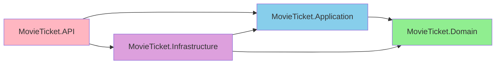

# Module 04: Backend Project Setup and Architecture

## 📖 Table of Contents
1. [Development Environment Setup](#development-environment-setup)
2. [Solution Structure](#solution-structure)
3. [Project Creation](#project-creation)
4. [NuGet Packages](#nuget-packages)
5. [Configuration Management](#configuration-management)
6. [Dependency Injection Setup](#dependency-injection-setup)
7. [Project Structure Deep Dive](#project-structure-deep-dive)

---

## 1. Development Environment Setup

### 1.1 Prerequisites

#### Install Required Software

**1. .NET 8 SDK**
```powershell
# Check if installed
dotnet --version

# Should show: 8.0.xxx

# If not installed, download from:
# https://dotnet.microsoft.com/download/dotnet/8.0
```

**2. Visual Studio 2022 or VS Code**

Visual Studio 2022:
- Download Community Edition (free)
- Workload: ASP.NET and web development
- Workload: .NET desktop development

VS Code:
- Download from https://code.visualstudio.com
- Extensions:
  - C# Dev Kit
  - NuGet Gallery
  - REST Client or Thunder Client

**3. SQL Server**
```powershell
# Options:
# - SQL Server Express (free): https://www.microsoft.com/sql-server/sql-server-downloads
# - SQL Server Developer Edition (free)
# - LocalDB (comes with Visual Studio)

# Verify SQL Server connection
sqlcmd -S localhost -E # Windows Authentication
```

**4. SQL Server Management Studio (SSMS)**
- Download from: https://docs.microsoft.com/sql/ssms/download-sql-server-management-studio-ssms

**5. Redis (for caching)**
```powershell
# Windows (using Docker):
docker run -d --name redis -p 6379:6379 redis:latest

# Or download Redis for Windows from:
# https://github.com/microsoftarchive/redis/releases
```

### 1.2 Verify Installation

```powershell
# Check .NET
dotnet --version
dotnet --list-sdks

# Check EF Core tools
dotnet ef --version

# If not installed:
dotnet tool install --global dotnet-ef
```

---

## 2. Solution Structure

### 2.1 Clean Architecture Layers

Our solution will have 4 main projects organized by layer:

```
MovieTicketBooking/
│
├── MovieTicketBooking.sln
│
├── src/
│   ├── MovieTicket.Domain/          # Core business logic (NO dependencies)
│   ├── MovieTicket.Application/     # Use cases (depends on Domain)
│   ├── MovieTicket.Infrastructure/  # External concerns (depends on Application)
│   └── MovieTicket.API/             # Web API (depends on all)
│
└── tests/
    ├── MovieTicket.UnitTests/
    ├── MovieTicket.IntegrationTests/
    └── MovieTicket.E2ETests/
```

### 2.2 Dependency Graph



---

## 3. Project Creation

### 3.1 Create Solution and Projects

Open PowerShell/Terminal and run:

```powershell
# Create solution directory
mkdir MovieTicketBooking
cd MovieTicketBooking

# Create solution file
dotnet new sln -n MovieTicketBooking

# Create src folder
mkdir src
cd src

# 1. Create Domain Layer (Class Library)
dotnet new classlib -n MovieTicket.Domain
dotnet sln ../MovieTicketBooking.sln add MovieTicket.Domain/MovieTicket.Domain.csproj

# 2. Create Application Layer (Class Library)
dotnet new classlib -n MovieTicket.Application
dotnet sln ../MovieTicketBooking.sln add MovieTicket.Application/MovieTicket.Application.csproj

# Add Domain reference to Application
dotnet add MovieTicket.Application/MovieTicket.Application.csproj reference MovieTicket.Domain/MovieTicket.Domain.csproj

# 3. Create Infrastructure Layer (Class Library)
dotnet new classlib -n MovieTicket.Infrastructure
dotnet sln ../MovieTicketBooking.sln add MovieTicket.Infrastructure/MovieTicket.Infrastructure.csproj

# Add references to Infrastructure
dotnet add MovieTicket.Infrastructure/MovieTicket.Infrastructure.csproj reference MovieTicket.Domain/MovieTicket.Domain.csproj
dotnet add MovieTicket.Infrastructure/MovieTicket.Infrastructure.csproj reference MovieTicket.Application/MovieTicket.Application.csproj

# 4. Create API Layer (Web API)
dotnet new webapi -n MovieTicket.API
dotnet sln ../MovieTicketBooking.sln add MovieTicket.API/MovieTicket.API.csproj

# Add references to API
dotnet add MovieTicket.API/MovieTicket.API.csproj reference MovieTicket.Application/MovieTicket.Application.csproj
dotnet add MovieTicket.API/MovieTicket.API.csproj reference MovieTicket.Infrastructure/MovieTicket.Infrastructure.csproj

# Go back to root
cd ..

# Create tests folder
mkdir tests
cd tests

# Create test projects
dotnet new xunit -n MovieTicket.UnitTests
dotnet new xunit -n MovieTicket.IntegrationTests
dotnet sln ../MovieTicketBooking.sln add MovieTicket.UnitTests/MovieTicket.UnitTests.csproj
dotnet sln ../MovieTicketBooking.sln add MovieTicket.IntegrationTests/MovieTicket.IntegrationTests.csproj

# Add references to test projects
dotnet add MovieTicket.UnitTests/MovieTicket.UnitTests.csproj reference ../src/MovieTicket.Domain/MovieTicket.Domain.csproj
dotnet add MovieTicket.UnitTests/MovieTicket.UnitTests.csproj reference ../src/MovieTicket.Application/MovieTicket.Application.csproj

dotnet add MovieTicket.IntegrationTests/MovieTicket.IntegrationTests.csproj reference ../src/MovieTicket.API/MovieTicket.API.csproj

cd ..
```

### 3.2 Verify Solution Structure

```powershell
# Build entire solution
dotnet build

# Should say: Build succeeded
```

---

## 4. NuGet Packages

### 4.1 Domain Layer Packages

```powershell
cd src/MovieTicket.Domain

# NO external dependencies in pure Domain layer!
# Only .NET base class library
```

### 4.2 Application Layer Packages

```powershell
cd ../MovieTicket.Application

# FluentValidation for input validation
dotnet add package FluentValidation
dotnet add package FluentValidation.DependencyInjectionExtensions

# AutoMapper for object mapping
dotnet add package AutoMapper
dotnet add package AutoMapper.Extensions.Microsoft.DependencyInjection

# MediatR for CQRS pattern (optional but recommended)
dotnet add package MediatR
dotnet add package MediatR.Extensions.Microsoft.DependencyInjection
```

### 4.3 Infrastructure Layer Packages

```powershell
cd ../MovieTicket.Infrastructure

# Entity Framework Core
dotnet add package Microsoft.EntityFrameworkCore
dotnet add package Microsoft.EntityFrameworkCore.SqlServer
dotnet add package Microsoft.EntityFrameworkCore.Tools

# Redis cache
dotnet add package StackExchange.Redis
dotnet add package Microsoft.Extensions.Caching.StackExchangeRedis

# Hangfire for background jobs
dotnet add package Hangfire.Core
dotnet add package Hangfire.SqlServer
dotnet add package Hangfire.AspNetCore

# Serilog for logging
dotnet add package Serilog
dotnet add package Serilog.Extensions.Hosting
dotnet add package Serilog.Sinks.Console
dotnet add package Serilog.Sinks.File
dotnet add package Serilog.Sinks.MSSqlServer

# Azure Blob Storage (for file uploads)
dotnet add package Azure.Storage.Blobs
```

### 4.4 API Layer Packages

```powershell
cd ../MovieTicket.API

# Authentication & Authorization
dotnet add package Microsoft.AspNetCore.Authentication.JwtBearer
dotnet add package Microsoft.AspNetCore.Identity.EntityFrameworkCore
dotnet add package System.IdentityModel.Tokens.Jwt

# Swagger/OpenAPI
dotnet add package Swashbuckle.AspNetCore
dotnet add package Swashbuckle.AspNetCore.Annotations

# CORS
# (Already included in ASP.NET Core 8)

# API Versioning
dotnet add package Asp.Versioning.Mvc
dotnet add package Asp.Versioning.Mvc.ApiExplorer

# Health Checks
dotnet add package AspNetCore.HealthChecks.SqlServer
dotnet add package AspNetCore.HealthChecks.Redis

# SignalR (for real-time seat updates)
# (Already included in ASP.NET Core 8)

# Rate Limiting
dotnet add package AspNetCoreRateLimit
```

### 4.5 Test Project Packages

```powershell
cd ../../tests/MovieTicket.UnitTests

# xUnit already added by template
# Additional packages:
dotnet add package Moq
dotnet add package FluentAssertions
dotnet add package Microsoft.EntityFrameworkCore.InMemory

cd ../MovieTicket.IntegrationTests
dotnet add package Microsoft.AspNetCore.Mvc.Testing
dotnet add package Moq
dotnet add package FluentAssertions
```

### 4.6 Package Summary

| Layer | Key Packages |
|-------|--------------|
| **Domain** | None (pure .NET) |
| **Application** | FluentValidation, AutoMapper, MediatR |
| **Infrastructure** | EF Core, Redis, Hangfire, Serilog, Azure.Storage |
| **API** | JWT, Swagger, Versioning, RateLimit, HealthChecks |
| **Tests** | xUnit, Moq, FluentAssertions |

---

## 5. Configuration Management

### 5.1 appsettings.json Structure

Create/Update `src/MovieTicket.API/appsettings.json`:

```json
{
  "ConnectionStrings": {
    "DefaultConnection": "Server=localhost;Database=MovieTicketBookingDB;Trusted_Connection=True;TrustServerCertificate=True;MultipleActiveResultSets=true",
    "RedisConnection": "localhost:6379"
  },
  "JwtSettings": {
    "SecretKey": "YourSuperSecretKeyThatIsAtLeast32CharactersLong",
    "Issuer": "MovieTicketBooking.API",
    "Audience": "MovieTicketBooking.Client",
    "ExpirationMinutes": 1440,
    "RefreshTokenExpirationDays": 7
  },
  "EmailSettings": {
    "SmtpServer": "smtp.gmail.com",
    "SmtpPort": 587,
    "SenderEmail": "noreply@movieticketbooking.com",
    "SenderName": "Movie Ticket Booking",
    "Username": "your-email@gmail.com",
    "Password": "your-app-password",
    "EnableSsl": true
  },
  "PaymentSettings": {
    "StripeSecretKey": "sk_test_...",
    "StripePublishableKey": "pk_test_...",
    "WebhookSecret": "whsec_..."
  },
  "AzureStorage": {
    "ConnectionString": "DefaultEndpointsProtocol=https;AccountName=...;AccountKey=...;EndpointSuffix=core.windows.net",
    "ContainerName": "movie-posters"
  },
  "CacheSettings": {
    "AbsoluteExpirationMinutes": 60,
    "SlidingExpirationMinutes": 30
  },
  "RateLimitSettings": {
    "EnableEndpointRateLimiting": true,
    "StackBlockedRequests": false,
    "RealIpHeader": "X-Real-IP",
    "ClientIdHeader": "X-ClientId",
    "HttpStatusCode": 429,
    "GeneralRules": [
      {
        "Endpoint": "*",
        "Period": "1m",
        "Limit": 100
      }
    ]
  },
  "Serilog": {
    "MinimumLevel": {
      "Default": "Information",
      "Override": {
        "Microsoft": "Warning",
        "System": "Warning"
      }
    },
    "WriteTo": [
      {
        "Name": "Console"
      },
      {
        "Name": "File",
        "Args": {
          "path": "Logs/log-.txt",
          "rollingInterval": "Day",
          "outputTemplate": "{Timestamp:yyyy-MM-dd HH:mm:ss.fff zzz} [{Level:u3}] {Message:lj}{NewLine}{Exception}"
        }
      },
      {
        "Name": "MSSqlServer",
        "Args": {
          "connectionString": "DefaultConnection",
          "tableName": "Logs",
          "autoCreateSqlTable": true
        }
      }
    ]
  },
  "AllowedHosts": "*",
  "Cors": {
    "AllowedOrigins": [
      "http://localhost:4200",
      "https://localhost:4200"
    ]
  }
}
```

### 5.2 appsettings.Development.json

```json
{
  "ConnectionStrings": {
    "DefaultConnection": "Server=localhost;Database=MovieTicketBookingDB_Dev;Trusted_Connection=True;TrustServerCertificate=True;MultipleActiveResultSets=true"
  },
  "Logging": {
    "LogLevel": {
      "Default": "Debug",
      "Microsoft.AspNetCore": "Information"
    }
  },
  "JwtSettings": {
    "SecretKey": "DevSecretKeyThatIsAtLeast32CharactersLongForDevelopment"
  },
  "EmailSettings": {
    "EnableSsl": false
  }
}
```

### 5.3 Configuration Classes

Create `src/MovieTicket.Infrastructure/Configuration/JwtSettings.cs`:

```csharp
namespace MovieTicket.Infrastructure.Configuration;

public class JwtSettings
{
    public const string SectionName = "JwtSettings";
    
    public string SecretKey { get; set; } = string.Empty;
    public string Issuer { get; set; } = string.Empty;
    public string Audience { get; set; } = string.Empty;
    public int ExpirationMinutes { get; set; }
    public int RefreshTokenExpirationDays { get; set; }
}
```

Create `src/MovieTicket.Infrastructure/Configuration/EmailSettings.cs`:

```csharp
namespace MovieTicket.Infrastructure.Configuration;

public class EmailSettings
{
    public const string SectionName = "EmailSettings";
    
    public string SmtpServer { get; set; } = string.Empty;
    public int SmtpPort { get; set; }
    public string SenderEmail { get; set; } = string.Empty;
    public string SenderName { get; set; } = string.Empty;
    public string Username { get; set; } = string.Empty;
    public string Password { get; set; } = string.Empty;
    public bool EnableSsl { get; set; }
}
```

---

## 6. Dependency Injection Setup

### 6.1 Program.cs Structure

Update `src/MovieTicket.API/Program.cs`:

```csharp
using Microsoft.AspNetCore.Authentication.JwtBearer;
using Microsoft.EntityFrameworkCore;
using Microsoft.IdentityModel.Tokens;
using Microsoft.OpenApi.Models;
using MovieTicket.Infrastructure.Persistence;
using MovieTicket.Infrastructure.Configuration;
using Serilog;
using System.Text;

var builder = WebApplication.CreateBuilder(args);

// ========================================
// 1. LOGGING CONFIGURATION
// ========================================
builder.Host.UseSerilog((context, configuration) =>
    configuration.ReadFrom.Configuration(context.Configuration));

// ========================================
// 2. CONFIGURATION
// ========================================
builder.Services.Configure<JwtSettings>(
    builder.Configuration.GetSection(JwtSettings.SectionName));

builder.Services.Configure<EmailSettings>(
    builder.Configuration.GetSection(EmailSettings.SectionName));

// ========================================
// 3. DATABASE
// ========================================
builder.Services.AddDbContext<ApplicationDbContext>(options =>
    options.UseSqlServer(
        builder.Configuration.GetConnectionString("DefaultConnection"),
        b => b.MigrationsAssembly("MovieTicket.Infrastructure")));

// ========================================
// 4. REDIS CACHE
// ========================================
builder.Services.AddStackExchangeRedisCache(options =>
{
    options.Configuration = builder.Configuration.GetConnectionString("RedisConnection");
    options.InstanceName = "MovieTicketBooking_";
});

// ========================================
// 5. AUTHENTICATION & AUTHORIZATION
// ========================================
var jwtSettings = builder.Configuration.GetSection(JwtSettings.SectionName).Get<JwtSettings>()!;

builder.Services.AddAuthentication(options =>
{
    options.DefaultAuthenticateScheme = JwtBearerDefaults.AuthenticationScheme;
    options.DefaultChallengeScheme = JwtBearerDefaults.AuthenticationScheme;
})
.AddJwtBearer(options =>
{
    options.TokenValidationParameters = new TokenValidationParameters
    {
        ValidateIssuer = true,
        ValidateAudience = true,
        ValidateLifetime = true,
        ValidateIssuerSigningKey = true,
        ValidIssuer = jwtSettings.Issuer,
        ValidAudience = jwtSettings.Audience,
        IssuerSigningKey = new SymmetricSecurityKey(
            Encoding.UTF8.GetBytes(jwtSettings.SecretKey)),
        ClockSkew = TimeSpan.Zero
    };
});

builder.Services.AddAuthorization();

// ========================================
// 6. CORS
// ========================================
builder.Services.AddCors(options =>
{
    options.AddPolicy("AllowAngularApp", policy =>
    {
        policy.WithOrigins(
                builder.Configuration.GetSection("Cors:AllowedOrigins").Get<string[]>()!)
              .AllowAnyHeader()
              .AllowAnyMethod()
              .AllowCredentials(); // For SignalR
    });
});

// ========================================
// 7. CONTROLLERS & API BEHAVIOR
// ========================================
builder.Services.AddControllers();
builder.Services.AddEndpointsApiExplorer();

// ========================================
// 8. SWAGGER
// ========================================
builder.Services.AddSwaggerGen(options =>
{
    options.SwaggerDoc("v1", new OpenApiInfo
    {
        Title = "Movie Ticket Booking API",
        Version = "v1",
        Description = "RESTful API for Movie Ticket Booking System",
        Contact = new OpenApiContact
        {
            Name = "Support",
            Email = "support@movieticketbooking.com"
        }
    });

    // JWT Authentication in Swagger
    options.AddSecurityDefinition("Bearer", new OpenApiSecurityScheme
    {
        Description = "JWT Authorization header using the Bearer scheme. Enter 'Bearer' [space] and then your token.",
        Name = "Authorization",
        In = ParameterLocation.Header,
        Type = SecuritySchemeType.ApiKey,
        Scheme = "Bearer"
    });

    options.AddSecurityRequirement(new OpenApiSecurityRequirement
    {
        {
            new OpenApiSecurityScheme
            {
                Reference = new OpenApiReference
                {
                    Type = ReferenceType.SecurityScheme,
                    Id = "Bearer"
                }
            },
            Array.Empty<string>()
        }
    });
});

// ========================================
// 9. APPLICATION SERVICES (will add later)
// ========================================
// builder.Services.AddApplicationServices();
// builder.Services.AddInfrastructureServices();

// ========================================
// 10. HEALTH CHECKS
// ========================================
builder.Services.AddHealthChecks()
    .AddSqlServer(builder.Configuration.GetConnectionString("DefaultConnection")!)
    .AddRedis(builder.Configuration.GetConnectionString("RedisConnection")!);

// ========================================
// BUILD APP
// ========================================
var app = builder.Build();

// ========================================
// MIDDLEWARE PIPELINE
// ========================================

// 1. Serilog Request Logging
app.UseSerilogRequestLogging();

// 2. Swagger (Development only)
if (app.Environment.IsDevelopment())
{
    app.UseSwagger();
    app.UseSwaggerUI(c =>
    {
        c.SwaggerEndpoint("/swagger/v1/swagger.json", "Movie Ticket Booking API V1");
    });
}

// 3. HTTPS Redirection
app.UseHttpsRedirection();

// 4. CORS
app.UseCors("AllowAngularApp");

// 5. Authentication & Authorization
app.UseAuthentication();
app.UseAuthorization();

// 6. Controllers
app.MapControllers();

// 7. Health Checks
app.MapHealthChecks("/health");

// ========================================
// RUN APP
// ========================================
app.Run();

// Make Program class accessible for testing
public partial class Program { }
```

### 6.2 Service Registration Extensions

Create `src/MovieTicket.Application/DependencyInjection.cs`:

```csharp
using Microsoft.Extensions.DependencyInjection;
using FluentValidation;
using System.Reflection;

namespace MovieTicket.Application;

public static class DependencyInjection
{
    public static IServiceCollection AddApplicationServices(this IServiceCollection services)
    {
        // AutoMapper
        services.AddAutoMapper(Assembly.GetExecutingAssembly());
        
        // FluentValidation
        services.AddValidatorsFromAssembly(Assembly.GetExecutingAssembly());
        
        // MediatR (if using CQRS)
        services.AddMediatR(cfg => 
            cfg.RegisterServicesFromAssembly(Assembly.GetExecutingAssembly()));
        
        return services;
    }
}
```

Create `src/MovieTicket.Infrastructure/DependencyInjection.cs`:

```csharp
using Microsoft.Extensions.DependencyInjection;
using MovieTicket.Application.Interfaces;
using MovieTicket.Infrastructure.Services;

namespace MovieTicket.Infrastructure;

public static class DependencyInjection
{
    public static IServiceCollection AddInfrastructureServices(this IServiceCollection services)
    {
        // Repositories (will add later)
        // services.AddScoped<IMovieRepository, MovieRepository>();
        
        // Services
        // services.AddScoped<IEmailService, EmailService>();
        // services.AddScoped<IPaymentService, StripePaymentService>();
        
        return services;
    }
}
```

### 6.3 Update Program.cs to Use Extensions

Add these lines in Program.cs after line "9. APPLICATION SERVICES":

```csharp
// Add to using statements at top:
using MovieTicket.Application;
using MovieTicket.Infrastructure;

// Replace the comment section with:
builder.Services.AddApplicationServices();
builder.Services.AddInfrastructureServices();
```

---

## 7. Project Structure Deep Dive

### 7.1 Domain Layer Structure

```
MovieTicket.Domain/
├── Entities/
│   ├── Movie.cs
│   ├── Theater.cs
│   ├── Screen.cs
│   ├── Seat.cs
│   ├── Show.cs
│   ├── Booking.cs
│   ├── BookingSeat.cs
│   ├── Payment.cs
│   ├── User.cs
│   └── Review.cs
│
├── ValueObjects/
│   ├── Price.cs
│   ├── Email.cs
│   └── PhoneNumber.cs
│
├── Enums/
│   ├── BookingStatus.cs
│   ├── PaymentStatus.cs
│   ├── MovieStatus.cs
│   ├── SeatType.cs
│   └── ShowFormat.cs
│
├── Common/
│   ├── BaseEntity.cs
│   ├── IAuditableEntity.cs
│   └── ISoftDeletable.cs
│
├── Interfaces/
│   ├── Repositories/
│   │   ├── IRepository.cs
│   │   ├── IMovieRepository.cs
│   │   ├── IBookingRepository.cs
│   │   ├── ITheaterRepository.cs
│   │   └── IUserRepository.cs
│   └── IUnitOfWork.cs
│
├── Specifications/
│   ├── BaseSpecification.cs
│   └── MovieSpecifications/
│       ├── NowShowingMoviesSpec.cs
│       └── MovieByGenreSpec.cs
│
└── Exceptions/
    ├── DomainException.cs
    ├── NotFoundException.cs
    └── ValidationException.cs
```

### 7.2 Application Layer Structure

```
MovieTicket.Application/
├── Services/
│   ├── Interfaces/
│   │   ├── IMovieService.cs
│   │   ├── IBookingService.cs
│   │   ├── ITheaterService.cs
│   │   ├── IAuthService.cs
│   │   ├── IEmailService.cs
│   │   └── IPaymentService.cs
│   └── Implementations/
│       ├── MovieService.cs
│       ├── BookingService.cs
│       ├── TheaterService.cs
│       └── AuthService.cs
│
├── DTOs/
│   ├── Movies/
│   │   ├── MovieDto.cs
│   │   ├── CreateMovieDto.cs
│   │   └── UpdateMovieDto.cs
│   ├── Bookings/
│   │   ├── BookingDto.cs
│   │   └── CreateBookingDto.cs
│   ├── Theaters/
│   │   └── TheaterDto.cs
│   └── Auth/
│       ├── LoginRequest.cs
│       ├── RegisterRequest.cs
│       └── AuthResponse.cs
│
├── Mapping/
│   ├── MappingProfile.cs
│   └── AutoMapperConfig.cs
│
├── Validators/
│   ├── CreateMovieValidator.cs
│   ├── CreateBookingValidator.cs
│   └── RegisterValidator.cs
│
├── Common/
│   ├── ApiResponse.cs
│   ├── PagedResult.cs
│   └── Result.cs
│
└── DependencyInjection.cs
```

### 7.3 Infrastructure Layer Structure

```
MovieTicket.Infrastructure/
├── Persistence/
│   ├── ApplicationDbContext.cs
│   ├── Configurations/
│   │   ├── MovieConfiguration.cs
│   │   ├── BookingConfiguration.cs
│   │   ├── TheaterConfiguration.cs
│   │   └── UserConfiguration.cs
│   └── Migrations/
│       └── (auto-generated files)
│
├── Repositories/
│   ├── Repository.cs
│   ├── MovieRepository.cs
│   ├── BookingRepository.cs
│   ├── TheaterRepository.cs
│   ├── UserRepository.cs
│   └── UnitOfWork.cs
│
├── Services/
│   ├── EmailService.cs
│   ├── StripePaymentService.cs
│   ├── CloudStorageService.cs
│   └── CacheService.cs
│
├── Configuration/
│   ├── JwtSettings.cs
│   ├── EmailSettings.cs
│   └── PaymentSettings.cs
│
└── DependencyInjection.cs
```

### 7.4 API Layer Structure

```
MovieTicket.API/
├── Controllers/
│   ├── MoviesController.cs
│   ├── BookingsController.cs
│   ├── TheatersController.cs
│   ├── ShowsController.cs
│   └── AuthController.cs
│
├── Middleware/
│   ├── ExceptionHandlingMiddleware.cs
│   ├── RequestLoggingMiddleware.cs
│   └── RateLimitingMiddleware.cs
│
├── Filters/
│   ├── ValidationFilter.cs
│   └── AuthorizationFilter.cs
│
├── Hubs/ (SignalR)
│   └── BookingHub.cs
│
├── Models/ (Request/Response)
│   ├── Requests/
│   └── Responses/
│
├── appsettings.json
├── appsettings.Development.json
├── Program.cs
└── launchSettings.json
```

---

## 8. Testing the Setup

### 8.1 Create a Test Controller

Create `src/MovieTicket.API/Controllers/HealthController.cs`:

```csharp
using Microsoft.AspNetCore.Mvc;

namespace MovieTicket.API.Controllers;

[ApiController]
[Route("api/[controller]")]
public class HealthController : ControllerBase
{
    [HttpGet]
    public IActionResult Get()
    {
        return Ok(new
        {
            Status = "Healthy",
            Timestamp = DateTime.UtcNow,
            Service = "Movie Ticket Booking API"
        });
    }
}
```

### 8.2 Build and Run

```powershell
# From solution root
dotnet build

# Run API
cd src/MovieTicket.API
dotnet run

# Should see:
# info: Microsoft.Hosting.Lifetime[14]
#       Now listening on: https://localhost:7001
#       Now listening on: http://localhost:5001
```

### 8.3 Test Endpoints

**Option 1: Browser**
- Navigate to: `https://localhost:7001/swagger`
- Test `/api/Health` endpoint

**Option 2: PowerShell**
```powershell
# Test health endpoint
Invoke-RestMethod -Uri "https://localhost:7001/api/Health" -Method Get

# Should return:
# Status    : Healthy
# Timestamp : 2024-12-10T...
# Service   : Movie Ticket Booking API
```

---

## 9. Git Setup

### 9.1 .gitignore

Create `.gitignore` in project root:

```gitignore
## Ignore Visual Studio temporary files, build results, and
## files generated by popular Visual Studio add-ons.

# User-specific files
*.rsuser
*.suo
*.user
*.userosscache
*.sln.docstates

# Build results
[Dd]ebug/
[Dd]ebugPublic/
[Rr]elease/
[Rr]eleases/
x64/
x86/
[Ww][Ii][Nn]32/
[Aa][Rr][Mm]/
[Aa][Rr][Mm]64/
bld/
[Bb]in/
[Oo]bj/
[Ll]og/
[Ll]ogs/

# Visual Studio cache/options directory
.vs/

# .NET Core
project.lock.json
project.fragment.lock.json
artifacts/

# ASP.NET Scaffolding
ScaffoldingReadMe.txt

# Files built by Visual Studio
*_i.c
*_p.c
*_h.h
*.ilk
*.meta
*.obj
*.iobj
*.pch
*.pdb
*.ipdb
*.pgc
*.pgd
*.rsp
*.sbr
*.tlb
*.tli
*.tlh
*.tmp
*.tmp_proj
*_wpftmp.csproj
*.log
*.vspscc
*.vssscc
.builds
*.pidb
*.svclog
*.scc

# Sensitive data
appsettings.Development.json
appsettings.Production.json
*.pfx
*.p12

# NuGet Packages
*.nupkg
**/packages/*
!**/packages/build/

# Logs
Logs/
*.log
```

### 9.2 Initialize Git

```powershell
git init
git add .
git commit -m "Initial project setup with Clean Architecture"
```

---

## 10. Summary & Next Steps

### ✅ What We Accomplished

1. ✅ Set up development environment
2. ✅ Created Clean Architecture solution structure
3. ✅ Installed all required NuGet packages
4. ✅ Configured appsettings.json
5. ✅ Set up dependency injection
6. ✅ Configured authentication (JWT)
7. ✅ Configured Swagger
8. ✅ Set up logging (Serilog)
9. ✅ Configured CORS
10. ✅ Created test endpoint

### 🎯 Current Project State

```
✅ Solution structure created
✅ Projects configured with dependencies
✅ NuGet packages installed
✅ Configuration files set up
✅ Program.cs configured
⏺ Ready for domain modeling!
```

---

## 11. Next Steps

Now we'll create the domain entities and database context!

👉 **[Module 05: Domain Models and Database Context](05-Domain-Models-and-DbContext.md)**

In the next module, you'll learn:
- Creating domain entities
- Implementing value objects
- Configuring Entity Framework Core
- Creating DbContext
- Setting up migrations
- Seeding initial data

---

**Module 04 Complete** ✅  
**Progress**: 4/18 modules (22.2%)
