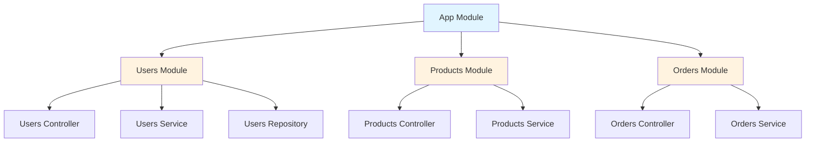
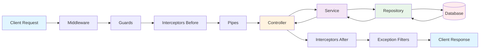
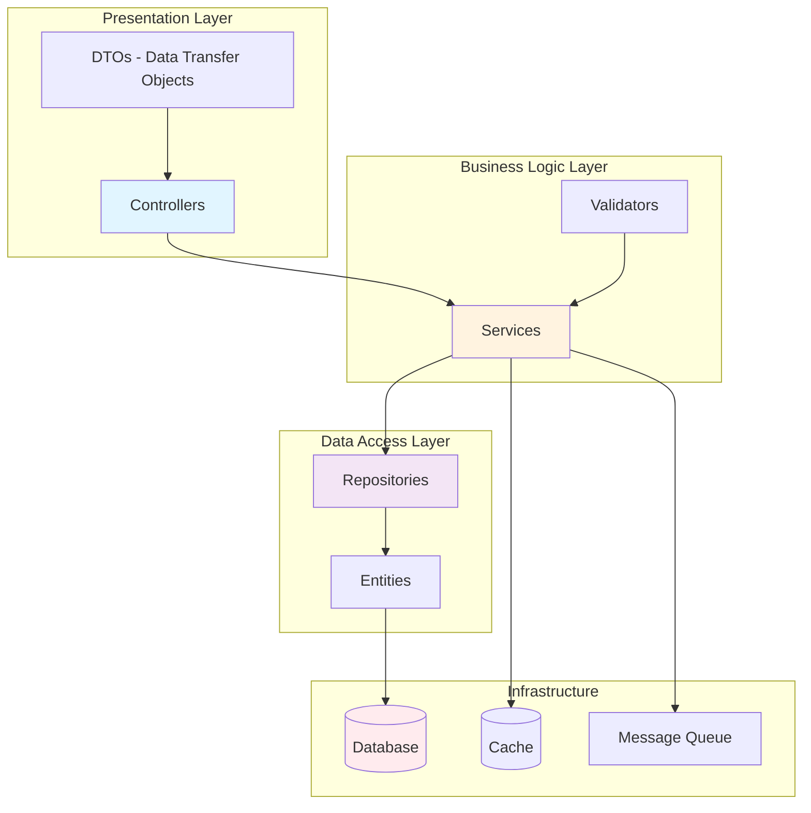
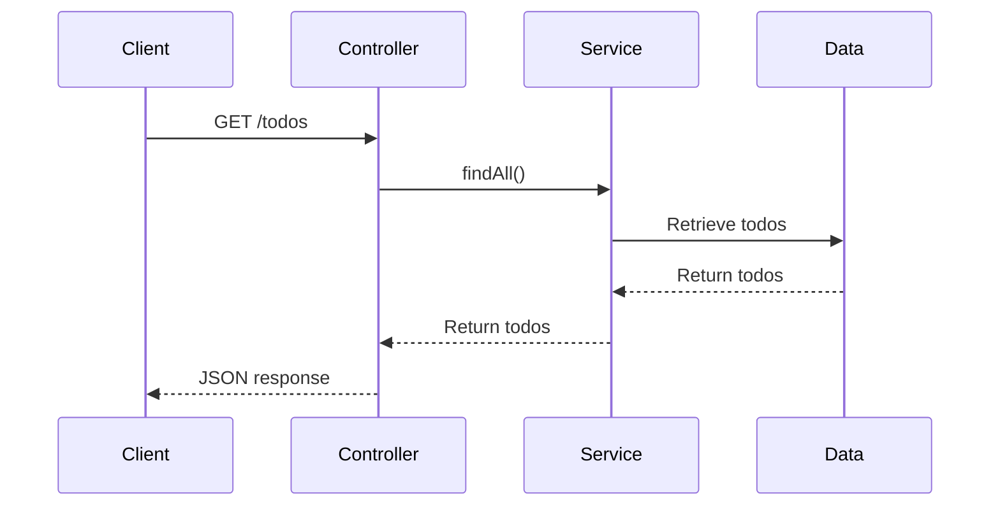
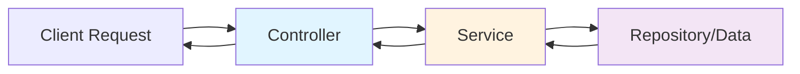

# Part 1: Introduction & Fundamentals

## Table of Contents
- [Why NestJS?](#why-nestjs)
- [NestJS vs Express](#nestjs-vs-express)
- [Core Philosophy](#core-philosophy)
- [Architecture Overview](#architecture-overview)
- [Installation & Setup](#installation--setup)
- [Project Structure](#project-structure)
- [Your First NestJS Application](#your-first-nestjs-application)
- [Understanding the Generated Code](#understanding-the-generated-code)
- [Next Steps](#next-steps)

---

## Why NestJS?

### The Problem with Traditional Node.js/Express

If you've been building backends with Node.js and Express, you might have encountered these challenges:

```javascript
// Express - Typical unstructured approach
const express = require('express');
const app = express();

// Business logic in routes
app.get('/users', async (req, res) => {
  try {
    const users = await db.query('SELECT * FROM users');
    res.json(users);
  } catch (error) {
    res.status(500).json({ error: error.message });
  }
});

// Where does validation go?
// How do we inject dependencies?
// How do we organize this as it grows?
// How do we test this effectively?
```

**Common Pain Points:**

❌ **No standard structure** - Every developer organizes code differently  
❌ **Tight coupling** - Hard to test and maintain  
❌ **Scattered concerns** - Validation, error handling, logging mixed with business logic  
❌ **Poor scalability** - Difficult to organize large applications  
❌ **Weak typing** - Even with TypeScript, many frameworks don't leverage it fully  

### The NestJS Solution

NestJS addresses these challenges by providing:

✅ **Opinionated architecture** - Clear structure and best practices  
✅ **Dependency Injection** - Loose coupling, easy testing  
✅ **Decorators & Metadata** - Clean, declarative code  
✅ **TypeScript-first** - Full type safety and IntelliSense  
✅ **Modular design** - Easy to scale and organize  
✅ **Built-in features** - Guards, pipes, interceptors, and more  

---

## NestJS vs Express

### Philosophy Comparison

| Aspect | Express | NestJS |
|--------|---------|--------|
| **Structure** | Unopinionated, flexible | Opinionated, structured |
| **Language** | JavaScript-first | TypeScript-first |
| **Architecture** | Your choice | MVC, Clean Architecture |
| **DI Container** | Manual setup | Built-in |
| **Decorators** | Not standard | Core feature |
| **Testing** | Manual setup | Built-in tools |
| **Scalability** | DIY | Built for enterprise |

### Code Comparison

#### Express Approach

```javascript
// users.controller.js
const express = require('express');
const router = express.Router();
const UsersService = require('./users.service');

const usersService = new UsersService();

router.get('/', async (req, res) => {
  try {
    const users = await usersService.findAll();
    res.json(users);
  } catch (error) {
    res.status(500).json({ error: error.message });
  }
});

router.get('/:id', async (req, res) => {
  try {
    const user = await usersService.findOne(req.params.id);
    if (!user) {
      return res.status(404).json({ error: 'User not found' });
    }
    res.json(user);
  } catch (error) {
    res.status(500).json({ error: error.message });
  }
});

module.exports = router;
```

#### NestJS Approach

```typescript
// users.controller.ts
import { Controller, Get, Param, ParseIntPipe } from '@nestjs/common';
import { UsersService } from './users.service';
import { User } from './entities/user.entity';

@Controller('users')
export class UsersController {
  constructor(private readonly usersService: UsersService) {}

  @Get()
  async findAll(): Promise<User[]> {
    return this.usersService.findAll();
  }

  @Get(':id')
  async findOne(@Param('id', ParseIntPipe) id: number): Promise<User> {
    return this.usersService.findOne(id);
  }
}
```

**Key Differences:**

1. **Decorators**: `@Controller()`, `@Get()` - Clean, declarative routing
2. **Dependency Injection**: Service injected via constructor
3. **Type Safety**: Full TypeScript support with return types
4. **Built-in Pipes**: `ParseIntPipe` handles validation automatically
5. **Error Handling**: Global exception filters handle errors
6. **No Boilerplate**: No manual try-catch, status codes, or error responses

---

## Core Philosophy

NestJS is built on three core principles:

### 1. **Modularity**

Applications are organized into modules, each encapsulating related functionality.



### 2. **Dependency Injection**

Components declare their dependencies, and NestJS provides them automatically.

```typescript
// Service declares what it needs
@Injectable()
export class UsersService {
  constructor(
    private readonly userRepository: UserRepository,
    private readonly emailService: EmailService,
  ) {}
}

// NestJS automatically provides these dependencies
// No manual instantiation needed!
```

### 3. **Testability**

DI makes testing incredibly easy - swap real dependencies with mocks.

```typescript
// Testing is simple - provide mock dependencies
const module = await Test.createTestingModule({
  providers: [
    UsersService,
    {
      provide: UserRepository,
      useValue: mockUserRepository, // Mock injected!
    },
  ],
}).compile();
```

---

## Architecture Overview

### High-Level Architecture



### Request Lifecycle

Every request in NestJS flows through these components in order:

1. **Middleware** - Request preprocessing (logging, CORS, etc.)
2. **Guards** - Authentication/Authorization checks
3. **Interceptors (Before)** - Transform incoming requests
4. **Pipes** - Validation and transformation
5. **Controller** - Route handler
6. **Service** - Business logic
7. **Repository** - Data access
8. **Interceptors (After)** - Transform outgoing responses
9. **Exception Filters** - Error handling

### Layered Architecture



---

## Installation & Setup

### Prerequisites

```bash
# Check Node.js version (18+ recommended)
node --version

# Check npm version
npm --version
```

### Install NestJS CLI

The NestJS CLI is the recommended way to create and manage NestJS projects.

```bash
# Install globally
npm install -g @nestjs/cli

# Verify installation
nest --version
```

### Create Your First Project

```bash
# Create new project
nest new my-nest-project

# You'll be prompted to choose a package manager
? Which package manager would you ❤️  to use?
  npm
❯ yarn
  pnpm

# Navigate to project
cd my-nest-project

# Start development server
npm run start:dev
```

### Alternative: Manual Setup

If you prefer not to use the CLI:

```bash
# Create directory
mkdir my-nest-project
cd my-nest-project

# Initialize package.json
npm init -y

# Install dependencies
npm install @nestjs/common @nestjs/core @nestjs/platform-express reflect-metadata rxjs

# Install dev dependencies
npm install -D @nestjs/cli @nestjs/schematics @types/node typescript ts-node

# Create tsconfig.json
```

---

## Project Structure

### Generated Project Structure

When you create a NestJS project, you get this structure:

```
my-nest-project/
├── src/
│   ├── app.controller.spec.ts    # Unit tests for controller
│   ├── app.controller.ts         # Basic controller
│   ├── app.module.ts             # Root module
│   ├── app.service.ts            # Basic service
│   └── main.ts                   # Application entry point
├── test/
│   ├── app.e2e-spec.ts          # E2E tests
│   └── jest-e2e.json            # Jest E2E config
├── node_modules/
├── .eslintrc.js                  # ESLint configuration
├── .prettierrc                   # Prettier configuration
├── nest-cli.json                 # Nest CLI configuration
├── package.json
├── tsconfig.json                 # TypeScript configuration
├── tsconfig.build.json
└── README.md
```

### Recommended Project Structure (Scalable)

As your project grows, organize it like this:

```
src/
├── modules/
│   ├── users/
│   │   ├── dto/
│   │   │   ├── create-user.dto.ts
│   │   │   └── update-user.dto.ts
│   │   ├── entities/
│   │   │   └── user.entity.ts
│   │   ├── users.controller.ts
│   │   ├── users.service.ts
│   │   ├── users.repository.ts
│   │   ├── users.module.ts
│   │   └── tests/
│   │       ├── users.controller.spec.ts
│   │       └── users.service.spec.ts
│   ├── products/
│   │   └── ...
│   └── orders/
│       └── ...
├── common/
│   ├── decorators/
│   ├── filters/
│   ├── guards/
│   ├── interceptors/
│   ├── middleware/
│   ├── pipes/
│   └── interfaces/
├── config/
│   ├── database.config.ts
│   ├── jwt.config.ts
│   └── app.config.ts
├── database/
│   ├── migrations/
│   └── seeds/
├── app.module.ts
└── main.ts
```

**Directory Purposes:**

- **modules/** - Feature modules (users, products, orders)
- **common/** - Shared utilities used across modules
- **config/** - Configuration files
- **database/** - Database migrations and seeds

---

## Your First NestJS Application

### Starting Point: main.ts

Every NestJS application starts from `main.ts`:

```typescript
// src/main.ts
import { NestFactory } from '@nestjs/core';
import { AppModule } from './app.module';

async function bootstrap() {
  // Create NestJS application instance
  const app = await NestFactory.create(AppModule);
  
  // Start listening on port 3000
  await app.listen(3000);
  
  console.log(`Application is running on: ${await app.getUrl()}`);
}

bootstrap();
```

**What's happening:**

1. `NestFactory.create()` - Creates the application instance
2. `AppModule` - Root module that imports all other modules
3. `app.listen(3000)` - Starts the HTTP server

### The Root Module: app.module.ts

```typescript
// src/app.module.ts
import { Module } from '@nestjs/common';
import { AppController } from './app.controller';
import { AppService } from './app.service';

@Module({
  imports: [],      // Other modules to import
  controllers: [    // Controllers in this module
    AppController,
  ],
  providers: [      // Services/providers in this module
    AppService,
  ],
})
export class AppModule {}
```

**Module Decorator Properties:**

- **imports**: Other modules this module depends on
- **controllers**: HTTP request handlers
- **providers**: Services and other injectables
- **exports**: Providers to make available to other modules

### The Controller: app.controller.ts

```typescript
// src/app.controller.ts
import { Controller, Get } from '@nestjs/common';
import { AppService } from './app.service';

@Controller()
export class AppController {
  constructor(private readonly appService: AppService) {}

  @Get()
  getHello(): string {
    return this.appService.getHello();
  }
}
```

**Key Concepts:**

1. **@Controller()** - Marks class as a controller
2. **Constructor injection** - `appService` injected automatically
3. **@Get()** - Handles GET requests to the root path
4. **Return value** - Automatically serialized to JSON

### The Service: app.service.ts

```typescript
// src/app.service.ts
import { Injectable } from '@nestjs/common';

@Injectable()
export class AppService {
  getHello(): string {
    return 'Hello World!';
  }
}
```

**Key Concepts:**

1. **@Injectable()** - Marks class as a provider that can be injected
2. **Business logic** - Services contain the actual business logic
3. **Separation of concerns** - Controller handles HTTP, service handles logic

### Testing It Out

```bash
# Start the development server
npm run start:dev

# Visit in browser or use curl
curl http://localhost:3000

# Response:
# Hello World!
```

---

## Understanding the Generated Code

### TypeScript Configuration

```json
// tsconfig.json
{
  "compilerOptions": {
    "module": "commonjs",
    "declaration": true,
    "removeComments": true,
    "emitDecoratorMetadata": true,    // Required for decorators
    "experimentalDecorators": true,   // Required for decorators
    "allowSyntheticDefaultImports": true,
    "target": "ES2021",
    "sourceMap": true,
    "outDir": "./dist",
    "baseUrl": "./",
    "incremental": true,
    "skipLibCheck": true,
    "strictNullChecks": false,
    "noImplicitAny": false,
    "strictBindCallApply": false,
    "forceConsistentCasingInFileNames": false,
    "noFallthroughCasesInSwitch": false
  }
}
```

**Important settings:**

- **emitDecoratorMetadata**: Enables decorator metadata reflection
- **experimentalDecorators**: Enables decorator syntax
- **target**: ES2021 for modern JavaScript features

### Package.json Scripts

```json
{
  "scripts": {
    "build": "nest build",              // Build for production
    "start": "nest start",              // Start production build
    "start:dev": "nest start --watch",  // Development with hot reload
    "start:debug": "nest start --debug --watch", // Debug mode
    "start:prod": "node dist/main",     // Run production build
    "test": "jest",                     // Run unit tests
    "test:watch": "jest --watch",       // Watch mode for tests
    "test:cov": "jest --coverage",      // Test with coverage
    "test:e2e": "jest --config ./test/jest-e2e.json" // E2E tests
  }
}
```

---

## Building a Simple REST API

Let's build a simple TODO API to understand the basics.

### Step 1: Generate a Module

```bash
# Using NestJS CLI
nest generate module todos
# or shorthand
nest g module todos
```

This creates:
- `src/todos/todos.module.ts`
- Automatically imports it in `app.module.ts`

### Step 2: Generate a Controller

```bash
nest g controller todos --no-spec
```

This creates:
- `src/todos/todos.controller.ts`
- Automatically adds it to `todos.module.ts`

### Step 3: Generate a Service

```bash
nest g service todos --no-spec
```

This creates:
- `src/todos/todos.service.ts`
- Automatically adds it to `todos.module.ts`

### Step 4: Implement the Service

```typescript
// src/todos/todos.service.ts
import { Injectable } from '@nestjs/common';

export interface Todo {
  id: number;
  title: string;
  completed: boolean;
}

@Injectable()
export class TodosService {
  private todos: Todo[] = [
    { id: 1, title: 'Learn NestJS', completed: false },
    { id: 2, title: 'Build an API', completed: false },
  ];

  findAll(): Todo[] {
    return this.todos;
  }

  findOne(id: number): Todo {
    return this.todos.find(todo => todo.id === id);
  }

  create(title: string): Todo {
    const newTodo: Todo = {
      id: this.todos.length + 1,
      title,
      completed: false,
    };
    this.todos.push(newTodo);
    return newTodo;
  }

  update(id: number, completed: boolean): Todo {
    const todo = this.findOne(id);
    if (todo) {
      todo.completed = completed;
    }
    return todo;
  }

  delete(id: number): boolean {
    const index = this.todos.findIndex(todo => todo.id === id);
    if (index > -1) {
      this.todos.splice(index, 1);
      return true;
    }
    return false;
  }
}
```

### Step 5: Implement the Controller

```typescript
// src/todos/todos.controller.ts
import {
  Controller,
  Get,
  Post,
  Put,
  Delete,
  Param,
  Body,
  ParseIntPipe,
} from '@nestjs/common';
import { TodosService, Todo } from './todos.service';

@Controller('todos')
export class TodosController {
  constructor(private readonly todosService: TodosService) {}

  @Get()
  findAll(): Todo[] {
    return this.todosService.findAll();
  }

  @Get(':id')
  findOne(@Param('id', ParseIntPipe) id: number): Todo {
    return this.todosService.findOne(id);
  }

  @Post()
  create(@Body('title') title: string): Todo {
    return this.todosService.create(title);
  }

  @Put(':id')
  update(
    @Param('id', ParseIntPipe) id: number,
    @Body('completed') completed: boolean,
  ): Todo {
    return this.todosService.update(id, completed);
  }

  @Delete(':id')
  delete(@Param('id', ParseIntPipe) id: number): boolean {
    return this.todosService.delete(id);
  }
}
```

### Step 6: Test the API

```bash
# Get all todos
curl http://localhost:3000/todos

# Get one todo
curl http://localhost:3000/todos/1

# Create a todo
curl -X POST http://localhost:3000/todos \
  -H "Content-Type: application/json" \
  -d '{"title":"New Todo"}'

# Update a todo
curl -X PUT http://localhost:3000/todos/1 \
  -H "Content-Type: application/json" \
  -d '{"completed":true}'

# Delete a todo
curl -X DELETE http://localhost:3000/todos/1
```

### What We Just Built



---

## Express vs NestJS: Side-by-Side Example

### Express Version

```javascript
// server.js
const express = require('express');
const app = express();

app.use(express.json());

let todos = [
  { id: 1, title: 'Learn NestJS', completed: false },
  { id: 2, title: 'Build an API', completed: false },
];

app.get('/todos', (req, res) => {
  res.json(todos);
});

app.get('/todos/:id', (req, res) => {
  const todo = todos.find(t => t.id === parseInt(req.params.id));
  if (!todo) {
    return res.status(404).json({ error: 'Not found' });
  }
  res.json(todo);
});

app.post('/todos', (req, res) => {
  const newTodo = {
    id: todos.length + 1,
    title: req.body.title,
    completed: false,
  };
  todos.push(newTodo);
  res.status(201).json(newTodo);
});

app.listen(3000, () => {
  console.log('Server running on port 3000');
});
```

**Issues with this approach:**

❌ All logic in one file - won't scale  
❌ No structure - hard to maintain  
❌ Manual error handling - repetitive  
❌ No dependency injection - hard to test  
❌ No type safety - prone to runtime errors  

### NestJS Version

We already built this! Notice how NestJS provides:

✅ **Clear separation** - Controller, Service, Module  
✅ **Automatic error handling** - No manual try-catch  
✅ **Dependency injection** - Easy to test and maintain  
✅ **Type safety** - TypeScript throughout  
✅ **Scalable structure** - Easy to add features  
✅ **Built-in validation** - ParseIntPipe validates automatically  

---

## Key Takeaways

### What We Learned

1. **NestJS vs Express**: NestJS provides structure and best practices
2. **Core Philosophy**: Modularity, DI, and Testability
3. **Architecture**: Layered approach with clear separation of concerns
4. **Project Structure**: Organized by features (modules)
5. **Basic Components**: Modules, Controllers, Services

### The NestJS Way



**Remember:**

- **Controllers** handle HTTP requests and responses
- **Services** contain business logic
- **Modules** organize related functionality
- **DI** makes everything testable and maintainable

---

## Next Steps

Now that you understand the fundamentals, continue to:

➡️ **[Part 2: Core Concepts](./Part02-Core-Concepts.md)** - Deep dive into Modules, Controllers, and Services

### Additional Resources

- [NestJS Official Documentation](https://docs.nestjs.com/)
- [TypeScript Handbook](https://www.typescriptlang.org/docs/)
- [Decorators in TypeScript](https://www.typescriptlang.org/docs/handbook/decorators.html)

---

## Practice Exercises

1. **Modify the TODO API**:
   - Add a `description` field
   - Add a `createdAt` timestamp
   - Implement filtering by completion status

2. **Create a New Module**:
   - Generate a `notes` module
   - Implement CRUD operations
   - Add category tags

3. **Experiment with Decorators**:
   - Try different HTTP methods (@Get, @Post, @Put, @Delete)
   - Use route parameters (@Param)
   - Work with request bodies (@Body)

---

**[← Back to README](./README.md)** | **[Next: Core Concepts →](./Part02-Core-Concepts.md)**
