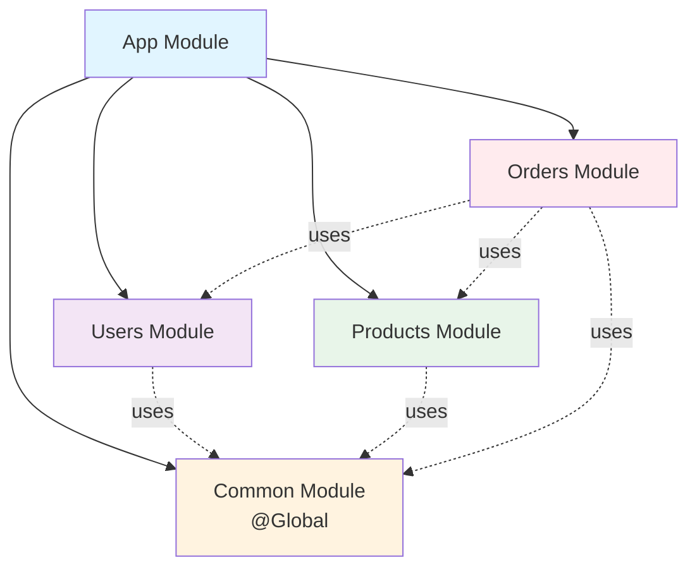
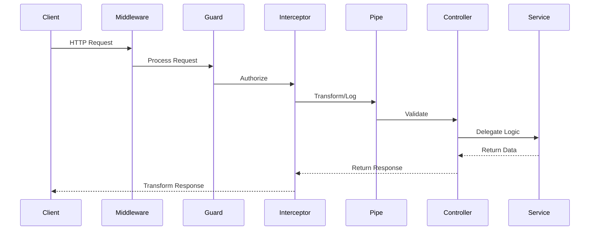
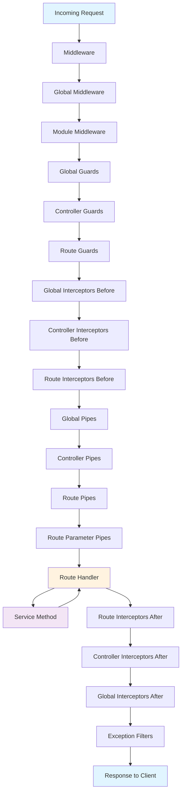
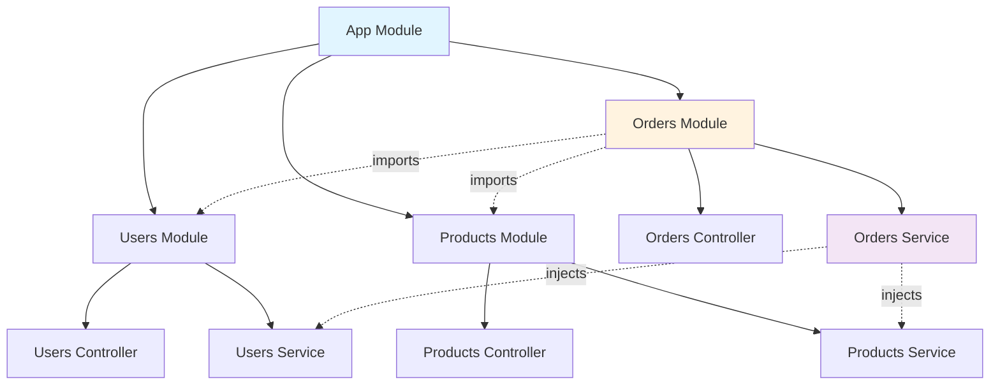

# Part 2: Core Concepts - Modules, Controllers, and Services

## Table of Contents
- [Modules](#modules)
- [Controllers](#controllers)
- [Services & Providers](#services--providers)
- [Request Lifecycle](#request-lifecycle)
- [Dependency Flow](#dependency-flow)
- [Best Practices](#best-practices)
- [Real-World Example](#real-world-example)

---

## Modules

### What is a Module?

A **module** is a class annotated with `@Module()` decorator. Modules organize your application's structure by grouping related components.

```typescript
import { Module } from '@nestjs/common';
import { UsersController } from './users.controller';
import { UsersService } from './users.service';

@Module({
  imports: [],         // Modules this module depends on
  controllers: [       // Controllers belonging to this module
    UsersController,
  ],
  providers: [        // Providers (services) in this module
    UsersService,
  ],
  exports: [],       // Providers to export for other modules
})
export class UsersModule {}
```

### Module Decorator Properties

```mermaid
graph TB
    Module[Module Decorator]
    
    Module --> Imports[imports: Module[]]
    Module --> Controllers[controllers: Controller[]]
    Module --> Providers[providers: Provider[]]
    Module --> Exports[exports: Provider[]]
    
    Imports --> ImportsDesc["Other modules needed<br/>by this module"]
    Controllers --> ControllersDesc["HTTP route handlers<br/>defined in this module"]
    Providers --> ProvidersDesc["Services/providers<br/>instantiated in this module"]
    Exports --> ExportsDesc["Providers from this module<br/>available to other modules"]
    
    style Module fill:#e1f5ff
    style Imports fill:#fff3e0
    style Controllers fill:#f3e5f5
    style Providers fill:#e8f5e9
    style Exports fill:#ffebee
```

### Module Organization Patterns

#### Feature Module

Organizes code by business feature:

```typescript
// users/users.module.ts
import { Module } from '@nestjs/common';
import { TypeOrmModule } from '@nestjs/typeorm';
import { UsersController } from './users.controller';
import { UsersService } from './users.service';
import { User } from './entities/user.entity';

@Module({
  imports: [
    TypeOrmModule.forFeature([User]), // Database entities
  ],
  controllers: [UsersController],
  providers: [UsersService],
  exports: [UsersService], // Export service for use in other modules
})
export class UsersModule {}
```

#### Shared Module

Provides common functionality across the app:

```typescript
// common/common.module.ts
import { Module, Global } from '@nestjs/common';
import { LoggerService } from './logger.service';
import { UtilsService } from './utils.service';

@Global() // Makes this module's exports available everywhere
@Module({
  providers: [LoggerService, UtilsService],
  exports: [LoggerService, UtilsService],
})
export class CommonModule {}
```

#### Dynamic Module

Configures modules at runtime:

```typescript
// database/database.module.ts
import { Module, DynamicModule } from '@nestjs/common';
import { TypeOrmModule } from '@nestjs/typeorm';

@Module({})
export class DatabaseModule {
  static forRoot(options: any): DynamicModule {
    return {
      module: DatabaseModule,
      imports: [TypeOrmModule.forRoot(options)],
      exports: [TypeOrmModule],
    };
  }
}

// Usage
@Module({
  imports: [
    DatabaseModule.forRoot({
      type: 'postgres',
      host: 'localhost',
      // ...more options
    }),
  ],
})
export class AppModule {}
```

### Module Relationships



### Express vs NestJS: Organization

#### Express (Unstructured)

```javascript
// routes/users.js
const express = require('express');
const router = express.Router();
const db = require('../db');

router.get('/', async (req, res) => {
  const users = await db.query('SELECT * FROM users');
  res.json(users);
});

module.exports = router;

// app.js
const usersRoutes = require('./routes/users');
app.use('/users', usersRoutes);
```

**Issues**: No encapsulation, scattered dependencies, hard to manage

#### NestJS (Modular)

```typescript
// users.module.ts - Everything organized in one place
@Module({
  imports: [TypeOrmModule.forFeature([User])],
  controllers: [UsersController],
  providers: [UsersService, UsersRepository],
  exports: [UsersService],
})
export class UsersModule {}
```

**Benefits**: Clear boundaries, reusable, testable, maintainable

---

## Controllers

### What is a Controller?

Controllers handle **incoming HTTP requests** and return **responses** to the client. They delegate business logic to services.

```typescript
import { Controller, Get, Post, Body, Param } from '@nestjs/common';

@Controller('users') // Route prefix: /users
export class UsersController {
  constructor(private readonly usersService: UsersService) {}

  @Get() // GET /users
  findAll() {
    return this.usersService.findAll();
  }

  @Get(':id') // GET /users/:id
  findOne(@Param('id') id: string) {
    return this.usersService.findOne(+id);
  }

  @Post() // POST /users
  create(@Body() createUserDto: CreateUserDto) {
    return this.usersService.create(createUserDto);
  }
}
```

### Route Decorators

```typescript
import {
  Controller,
  Get,
  Post,
  Put,
  Delete,
  Patch,
  Options,
  Head,
  All,
} from '@nestjs/common';

@Controller('products')
export class ProductsController {
  @Get()        // GET /products
  findAll() {}

  @Post()       // POST /products
  create() {}

  @Put(':id')   // PUT /products/:id
  update() {}

  @Patch(':id') // PATCH /products/:id
  partialUpdate() {}

  @Delete(':id') // DELETE /products/:id
  remove() {}

  @All()        // Any HTTP method
  handleAll() {}
}
```

### Request Object Decorators

```typescript
import {
  Controller,
  Get,
  Req,
  Res,
  Param,
  Query,
  Body,
  Headers,
  Ip,
  HostParam,
} from '@nestjs/common';
import { Request, Response } from 'express';

@Controller('examples')
export class ExamplesController {
  // Get entire request object
  @Get('request')
  getRequest(@Req() request: Request) {
    return { url: request.url, method: request.method };
  }

  // Route parameters
  @Get('users/:id/posts/:postId')
  getPost(
    @Param('id') userId: string,
    @Param('postId') postId: string,
    @Param() allParams: any, // Get all params as object
  ) {
    return { userId, postId, allParams };
  }

  // Query parameters
  @Get('search')
  search(
    @Query('q') searchTerm: string,
    @Query('page') page: number,
    @Query() allQuery: any, // Get all query params
  ) {
    return { searchTerm, page, allQuery };
  }

  // Request body
  @Post('users')
  createUser(
    @Body() createUserDto: CreateUserDto,
    @Body('email') email: string, // Specific field
  ) {
    return { user: createUserDto, email };
  }

  // Headers
  @Get('headers')
  getHeaders(
    @Headers('authorization') auth: string,
    @Headers() allHeaders: any,
  ) {
    return { auth, allHeaders };
  }

  // Client IP
  @Get('ip')
  getIp(@Ip() ip: string) {
    return { ip };
  }

  // Manual response handling
  @Get('manual')
  manualResponse(@Res() response: Response) {
    response.status(200).json({ message: 'Custom response' });
    // Note: When using @Res(), you must manually send the response
  }
}
```

### Status Codes and Headers

```typescript
import {
  Controller,
  Post,
  HttpCode,
  HttpStatus,
  Header,
  Redirect,
} from '@nestjs/common';

@Controller('examples')
export class StatusExamplesController {
  // Custom status code
  @Post('create')
  @HttpCode(HttpStatus.CREATED) // 201
  create() {
    return { message: 'Created' };
  }

  // No content response
  @Delete(':id')
  @HttpCode(HttpStatus.NO_CONTENT) // 204
  remove(@Param('id') id: string) {
    // No return needed for 204
  }

  // Custom headers
  @Get('cached')
  @Header('Cache-Control', 'max-age=3600')
  @Header('X-Custom-Header', 'CustomValue')
  getCached() {
    return { data: 'This response is cached' };
  }

  // Redirect
  @Get('redirect')
  @Redirect('https://nestjs.com', HttpStatus.MOVED_PERMANENTLY)
  redirectToNest() {
    // Can dynamically override redirect
    // return { url: 'https://other.com', statusCode: 302 };
  }
}
```

### Async Responses

NestJS handles promises and observables automatically:

```typescript
@Controller('async')
export class AsyncController {
  constructor(private readonly usersService: UsersService) {}

  // Promise - most common
  @Get('users')
  async getUsers(): Promise<User[]> {
    return await this.usersService.findAll();
  }

  // Observable (RxJS)
  @Get('users-observable')
  getUsersObservable(): Observable<User[]> {
    return of([{ id: 1, name: 'John' }]);
  }

  // Async/await
  @Get('user/:id')
  async getUserById(@Param('id') id: string): Promise<User> {
    const user = await this.usersService.findOne(+id);
    if (!user) {
      throw new NotFoundException('User not found');
    }
    return user;
  }
}
```

### Request Flow in Controller



---

## Services & Providers

### What is a Service?

Services contain **business logic**. They are marked with `@Injectable()` and injected into controllers via dependency injection.

```typescript
import { Injectable } from '@nestjs/common';

@Injectable()
export class UsersService {
  private users = [];

  findAll() {
    return this.users;
  }

  findOne(id: number) {
    return this.users.find(user => user.id === id);
  }

  create(createUserDto: CreateUserDto) {
    const newUser = {
      id: this.users.length + 1,
      ...createUserDto,
    };
    this.users.push(newUser);
    return newUser;
  }

  update(id: number, updateUserDto: UpdateUserDto) {
    const userIndex = this.users.findIndex(u => u.id === id);
    if (userIndex > -1) {
      this.users[userIndex] = { ...this.users[userIndex], ...updateUserDto };
      return this.users[userIndex];
    }
    return null;
  }

  remove(id: number) {
    const userIndex = this.users.findIndex(u => u.id === id);
    if (userIndex > -1) {
      this.users.splice(userIndex, 1);
      return true;
    }
    return false;
  }
}
```

### Service with Dependencies

Services can inject other services:

```typescript
@Injectable()
export class OrdersService {
  constructor(
    private readonly usersService: UsersService,
    private readonly productsService: ProductsService,
    private readonly emailService: EmailService,
  ) {}

  async createOrder(userId: number, productId: number) {
    // Use injected services
    const user = await this.usersService.findOne(userId);
    const product = await this.productsService.findOne(productId);
    
    // Business logic
    const order = {
      id: Date.now(),
      user,
      product,
      createdAt: new Date(),
    };

    // Send notification
    await this.emailService.sendOrderConfirmation(user.email, order);
    
    return order;
  }
}
```

### Provider Types

```typescript
// Standard provider (most common)
@Module({
  providers: [UsersService],
})

// Equivalent to:
@Module({
  providers: [
    {
      provide: UsersService,
      useClass: UsersService,
    },
  ],
})

// Value provider
@Module({
  providers: [
    {
      provide: 'CONFIG',
      useValue: {
        apiKey: 'abc123',
        baseUrl: 'https://api.example.com',
      },
    },
  ],
})

// Factory provider
@Module({
  providers: [
    {
      provide: 'DATABASE_CONNECTION',
      useFactory: async (configService: ConfigService) => {
        const config = configService.get('database');
        return await createConnection(config);
      },
      inject: [ConfigService],
    },
  ],
})

// Alias provider
@Module({
  providers: [
    UsersService,
    {
      provide: 'AliasedUsersService',
      useExisting: UsersService,
    },
  ],
})
```

### Express vs NestJS: Service Layer

#### Express

```javascript
// services/usersService.js
const db = require('../db');

class UsersService {
  async findAll() {
    return await db.query('SELECT * FROM users');
  }
}

module.exports = new UsersService(); // Singleton instantiation

// routes/users.js
const usersService = require('../services/usersService');

router.get('/', async (req, res) => {
  const users = await usersService.findAll();
  res.json(users);
});
```

**Issues**: Manual singleton management, tight coupling, hard to test

#### NestJS

```typescript
// users.service.ts
@Injectable()
export class UsersService {
  constructor(
    @InjectRepository(User)
    private userRepository: Repository<User>,
  ) {}

  findAll() {
    return this.userRepository.find();
  }
}

// users.controller.ts
@Controller('users')
export class UsersController {
  constructor(private readonly usersService: UsersService) {}
  
  @Get()
  findAll() {
    return this.usersService.findAll();
  }
}
```

**Benefits**: Automatic DI, loose coupling, easy to test, type-safe

---

## Request Lifecycle

### Complete Lifecycle



### Execution Order Example

```typescript
// app.module.ts
@Module({
  providers: [
    {
      provide: APP_INTERCEPTOR,
      useClass: LoggingInterceptor, // Global interceptor
    },
    {
      provide: APP_GUARD,
      useClass: AuthGuard, // Global guard
    },
    {
      provide: APP_PIPE,
      useClass: ValidationPipe, // Global pipe
    },
  ],
})
export class AppModule {}

// users.controller.ts
@Controller('users')
@UseGuards(RolesGuard) // Controller-level guard
@UseInterceptors(TransformInterceptor) // Controller-level interceptor
export class UsersController {
  @Get(':id')
  @UseGuards(UserOwnershipGuard) // Route-level guard
  @UsePipes(new ValidationPipe()) // Route-level pipe
  findOne(@Param('id', ParseIntPipe) id: number) { // Parameter-level pipe
    return this.usersService.findOne(id);
  }
}
```

**Execution order for the above:**
1. Global middleware
2. Global guards → AuthGuard
3. Controller guards → RolesGuard
4. Route guards → UserOwnershipGuard
5. Global interceptors (before)
6. Controller interceptors (before) → TransformInterceptor
7. Route interceptors (before)
8. Global pipes
9. Controller pipes
10. Route pipes → ValidationPipe
11. Parameter pipes → ParseIntPipe
12. **Route handler executes**
13. Interceptors (after) in reverse order
14. Exception filters (if error occurs)

---

## Dependency Flow

### How Dependencies Are Resolved



### Module Imports and Exports

```typescript
// users/users.module.ts
@Module({
  imports: [TypeOrmModule.forFeature([User])],
  controllers: [UsersController],
  providers: [UsersService],
  exports: [UsersService], // Make UsersService available to other modules
})
export class UsersModule {}

// orders/orders.module.ts
@Module({
  imports: [
    UsersModule, // Import to use UsersService
    ProductsModule,
  ],
  controllers: [OrdersController],
  providers: [OrdersService],
})
export class OrdersModule {}

// orders/orders.service.ts
@Injectable()
export class OrdersService {
  constructor(
    private readonly usersService: UsersService, // Injected from UsersModule
    private readonly productsService: ProductsService,
  ) {}
}
```

---

## Best Practices

### 1. Single Responsibility

```typescript
// ❌ Bad: Controller doing too much
@Controller('users')
export class UsersController {
  @Post()
  async create(@Body() createUserDto: CreateUserDto) {
    // Validation logic
    if (!createUserDto.email.includes('@')) {
      throw new BadRequestException('Invalid email');
    }
    
    // Business logic
    const hashedPassword = await bcrypt.hash(createUserDto.password, 10);
    
    // Database logic
    const user = await this.db.query(
      'INSERT INTO users ...',
      [createUserDto.email, hashedPassword]
    );
    
    // Email logic
    await this.sendEmail(user.email, 'Welcome!');
    
    return user;
  }
}

// ✅ Good: Separation of concerns
@Controller('users')
export class UsersController {
  constructor(private readonly usersService: UsersService) {}
  
  @Post()
  create(@Body() createUserDto: CreateUserDto) {
    return this.usersService.create(createUserDto);
  }
}

@Injectable()
export class UsersService {
  constructor(
    private readonly userRepository: UserRepository,
    private readonly emailService: EmailService,
  ) {}
  
  async create(createUserDto: CreateUserDto) {
    const hashedPassword = await this.hashPassword(createUserDto.password);
    const user = await this.userRepository.create({
      ...createUserDto,
      password: hashedPassword,
    });
    await this.emailService.sendWelcomeEmail(user.email);
    return user;
  }
}
```

### 2. Use DTOs for Type Safety

```typescript
// create-user.dto.ts
export class CreateUserDto {
  @IsEmail()
  email: string;

  @IsString()
  @MinLength(8)
  password: string;

  @IsString()
  name: string;
}

// Controller uses DTO
@Post()
create(@Body() createUserDto: CreateUserDto) {
  return this.usersService.create(createUserDto);
}
```

### 3. Proper Error Handling

```typescript
@Injectable()
export class UsersService {
  async findOne(id: number): Promise<User> {
    const user = await this.userRepository.findOneBy({ id });
    
    if (!user) {
      throw new NotFoundException(`User with ID ${id} not found`);
    }
    
    return user;
  }

  async create(createUserDto: CreateUserDto): Promise<User> {
    try {
      return await this.userRepository.save(createUserDto);
    } catch (error) {
      if (error.code === '23505') { // Unique violation
        throw new ConflictException('Email already exists');
      }
      throw new InternalServerErrorException('Failed to create user');
    }
  }
}
```

### 4. Module Organization

```typescript
// ✅ Organize by feature
src/
├── users/
│   ├── dto/
│   ├── entities/
│   ├── users.controller.ts
│   ├── users.service.ts
│   └── users.module.ts
├── products/
│   └── ...
└── orders/
    └── ...

// ❌ Organize by type
src/
├── controllers/
│   ├── users.controller.ts
│   ├── products.controller.ts
│   └── orders.controller.ts
├── services/
│   ├── users.service.ts
│   ├── products.service.ts
│   └── orders.service.ts
```

---

## Real-World Example

### E-Commerce Products Module

```typescript
// products/entities/product.entity.ts
import { Entity, Column, PrimaryGeneratedColumn } from 'typeorm';

@Entity('products')
export class Product {
  @PrimaryGeneratedColumn()
  id: number;

  @Column()
  name: string;

  @Column('text')
  description: string;

  @Column('decimal', { precision: 10, scale: 2 })
  price: number;

  @Column({ default: 0 })
  stock: number;

  @Column({ default: true })
  isActive: boolean;
}

// products/dto/create-product.dto.ts
import { IsString, IsNumber, IsOptional, Min } from 'class-validator';

export class CreateProductDto {
  @IsString()
  name: string;

  @IsString()
  description: string;

  @IsNumber()
  @Min(0)
  price: number;

  @IsNumber()
  @Min(0)
  @IsOptional()
  stock?: number;
}

// products/dto/update-product.dto.ts
import { PartialType } from '@nestjs/mapped-types';
import { CreateProductDto } from './create-product.dto';

export class UpdateProductDto extends PartialType(CreateProductDto) {}

// products/products.service.ts
import { Injectable, NotFoundException } from '@nestjs/common';
import { InjectRepository } from '@nestjs/typeorm';
import { Repository } from 'typeorm';
import { Product } from './entities/product.entity';
import { CreateProductDto } from './dto/create-product.dto';
import { UpdateProductDto } from './dto/update-product.dto';

@Injectable()
export class ProductsService {
  constructor(
    @InjectRepository(Product)
    private readonly productRepository: Repository<Product>,
  ) {}

  async findAll(): Promise<Product[]> {
    return await this.productRepository.find({
      where: { isActive: true },
    });
  }

  async findOne(id: number): Promise<Product> {
    const product = await this.productRepository.findOneBy({ id });
    
    if (!product) {
      throw new NotFoundException(`Product #${id} not found`);
    }
    
    return product;
  }

  async create(createProductDto: CreateProductDto): Promise<Product> {
    const product = this.productRepository.create(createProductDto);
    return await this.productRepository.save(product);
  }

  async update(id: number, updateProductDto: UpdateProductDto): Promise<Product> {
    const product = await this.findOne(id);
    Object.assign(product, updateProductDto);
    return await this.productRepository.save(product);
  }

  async remove(id: number): Promise<void> {
    const product = await this.findOne(id);
    await this.productRepository.remove(product);
  }

  async decreaseStock(id: number, quantity: number): Promise<Product> {
    const product = await this.findOne(id);
    
    if (product.stock < quantity) {
      throw new BadRequestException('Insufficient stock');
    }
    
    product.stock -= quantity;
    return await this.productRepository.save(product);
  }
}

// products/products.controller.ts
import {
  Controller,
  Get,
  Post,
  Put,
  Delete,
  Body,
  Param,
  ParseIntPipe,
  HttpCode,
  HttpStatus,
} from '@nestjs/common';
import { ProductsService } from './products.service';
import { CreateProductDto } from './dto/create-product.dto';
import { UpdateProductDto } from './dto/update-product.dto';
import { Product } from './entities/product.entity';

@Controller('products')
export class ProductsController {
  constructor(private readonly productsService: ProductsService) {}

  @Get()
  findAll(): Promise<Product[]> {
    return this.productsService.findAll();
  }

  @Get(':id')
  findOne(@Param('id', ParseIntPipe) id: number): Promise<Product> {
    return this.productsService.findOne(id);
  }

  @Post()
  @HttpCode(HttpStatus.CREATED)
  create(@Body() createProductDto: CreateProductDto): Promise<Product> {
    return this.productsService.create(createProductDto);
  }

  @Put(':id')
  update(
    @Param('id', ParseIntPipe) id: number,
    @Body() updateProductDto: UpdateProductDto,
  ): Promise<Product> {
    return this.productsService.update(id, updateProductDto);
  }

  @Delete(':id')
  @HttpCode(HttpStatus.NO_CONTENT)
  async remove(@Param('id', ParseIntPipe) id: number): Promise<void> {
    await this.productsService.remove(id);
  }
}

// products/products.module.ts
import { Module } from '@nestjs/common';
import { TypeOrmModule } from '@nestjs/typeorm';
import { ProductsController } from './products.controller';
import { ProductsService } from './products.service';
import { Product } from './entities/product.entity';

@Module({
  imports: [TypeOrmModule.forFeature([Product])],
  controllers: [ProductsController],
  providers: [ProductsService],
  exports: [ProductsService], // Export for use in OrdersModule
})
export class ProductsModule {}
```

### Usage in App Module

```typescript
// app.module.ts
import { Module } from '@nestjs/common';
import { TypeOrmModule } from '@nestjs/typeorm';
import { ConfigModule } from '@nestjs/config';
import { ProductsModule } from './products/products.module';
import { UsersModule } from './users/users.module';
import { OrdersModule } from './orders/orders.module';

@Module({
  imports: [
    ConfigModule.forRoot(),
    TypeOrmModule.forRoot({
      type: 'postgres',
      host: process.env.DB_HOST,
      port: parseInt(process.env.DB_PORT),
      username: process.env.DB_USERNAME,
      password: process.env.DB_PASSWORD,
      database: process.env.DB_DATABASE,
      autoLoadEntities: true,
      synchronize: process.env.NODE_ENV === 'development',
    }),
    ProductsModule,
    UsersModule,
    OrdersModule,
  ],
})
export class AppModule {}
```

---

## Key Takeaways

### Modules
✅ Organize code by features, not by types  
✅ Use `exports` to share services between modules  
✅ Use `@Global()` sparingly for truly global services  
✅ Create dynamic modules for configurable functionality  

### Controllers
✅ Keep controllers thin - delegate to services  
✅ Use decorators for clean, declarative routing  
✅ Return promises directly - NestJS handles them  
✅ Use DTOs for type-safe request/response  

### Services
✅ Contain all business logic  
✅ Are easily testable via dependency injection  
✅ Can inject other services  
✅ Should throw appropriate HTTP exceptions  

---

## Next Steps

➡️ **[Part 3: Dependency Injection & Providers](./Part03-Dependency-Injection.md)** - Deep dive into NestJS's powerful DI system

---

**[← Previous: Introduction](./Part01-Introduction-Fundamentals.md)** | **[Next: Dependency Injection →](./Part03-Dependency-Injection.md)**
