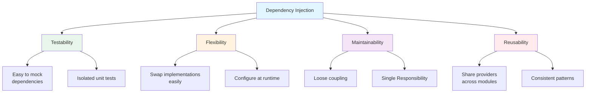
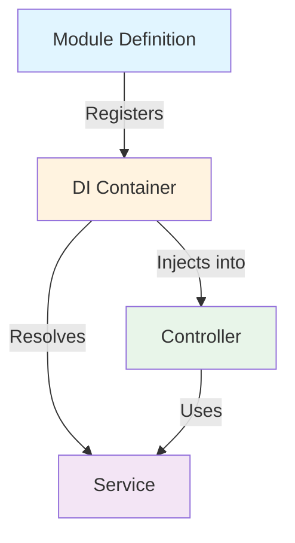
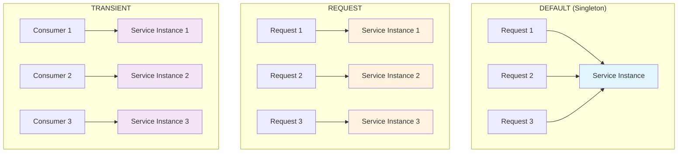

# Part 3: Dependency Injection & Providers

## Table of Contents
- [What is Dependency Injection?](#what-is-dependency-injection)
- [DI in NestJS](#di-in-nestjs)
- [Provider Types](#provider-types)
- [Injection Scopes](#injection-scopes)
- [Custom Providers](#custom-providers)
- [Async Providers](#async-providers)
- [Optional Dependencies](#optional-dependencies)
- [Circular Dependencies](#circular-dependencies)
- [Testing with DI](#testing-with-di)

---

## What is Dependency Injection?

**Dependency Injection (DI)** is a design pattern where a class receives its dependencies from external sources rather than creating them itself.

### Without DI (Traditional Node.js)

```javascript
// ❌ Tight coupling - hard to test and maintain
class UserService {
  constructor() {
    this.database = new Database(); // Direct instantiation
    this.emailService = new EmailService();
    this.logger = new Logger();
  }

  async createUser(userData) {
    this.logger.log('Creating user...');
    const user = await this.database.insert(userData);
    await this.emailService.sendWelcome(user.email);
    return user;
  }
}

// Problems:
// - Can't easily swap Database implementation
// - Hard to mock emailService in tests
// - Tight coupling to concrete classes
```

### With DI (NestJS Way)

```typescript
// ✅ Loose coupling - easy to test and maintain
@Injectable()
export class UserService {
  constructor(
    private readonly database: Database,
    private readonly emailService: EmailService,
    private readonly logger: Logger,
  ) {}

  async createUser(userData: CreateUserDto) {
    this.logger.log('Creating user...');
    const user = await this.database.insert(userData);
    await this.emailService.sendWelcome(user.email);
    return user;
  }
}

// Benefits:
// - Dependencies injected automatically
// - Easy to swap implementations
// - Simple to mock in tests
// - Follows SOLID principles
```

### DI Benefits



---

## DI in NestJS

### How NestJS DI Works



### Basic DI Example

```typescript
// Step 1: Create a service with @Injectable()
@Injectable()
export class UsersService {
  private users = [];

  findAll() {
    return this.users;
  }

  findOne(id: number) {
    return this.users.find(u => u.id === id);
  }
}

// Step 2: Register in module
@Module({
  providers: [UsersService], // Register provider
  controllers: [UsersController],
})
export class UsersModule {}

// Step 3: Inject into controller
@Controller('users')
export class UsersController {
  constructor(
    private readonly usersService: UsersService, // Injected automatically
  ) {}

  @Get()
  findAll() {
    return this.usersService.findAll();
  }
}
```

### Constructor Injection (Recommended)

```typescript
@Injectable()
export class OrdersService {
  constructor(
    // NestJS analyzes constructor parameters and injects them
    private readonly usersService: UsersService,
    private readonly productsService: ProductsService,
    private readonly emailService: EmailService,
    private readonly logger: Logger,
  ) {}

  async createOrder(userId: number, productId: number) {
    const user = await this.usersService.findOne(userId);
    const product = await this.productsService.findOne(productId);
    
    // Use injected services
    this.logger.log(`Creating order for user ${userId}`);
    const order = { user, product, createdAt: new Date() };
    await this.emailService.sendOrderConfirmation(user.email, order);
    
    return order;
  }
}
```

### Property Injection (Not Recommended)

```typescript
import { Injectable, Inject } from '@nestjs/common';

@Injectable()
export class UsersService {
  @Inject(LoggerService)
  private readonly logger: LoggerService;

  // ⚠️ Property injection is less preferred
  // Use constructor injection instead
}
```

---

## Provider Types

### 1. Class Providers (Standard)

```typescript
// Standard syntax
@Module({
  providers: [UsersService],
})

// Equivalent long-form
@Module({
  providers: [
    {
      provide: UsersService,
      useClass: UsersService,
    },
  ],
})
```

### 2. Value Providers

Inject constant values or objects:

```typescript
const CONFIG = {
  apiKey: 'abc123',
  apiUrl: 'https://api.example.com',
  timeout: 5000,
};

@Module({
  providers: [
    {
      provide: 'CONFIG',
      useValue: CONFIG,
    },
  ],
})
export class AppModule {}

// Usage
@Injectable()
export class ApiService {
  constructor(@Inject('CONFIG') private config: typeof CONFIG) {}

  async fetchData() {
    const response = await fetch(this.config.apiUrl, {
      headers: { 'X-API-Key': this.config.apiKey },
      timeout: this.config.timeout,
    });
    return response.json();
  }
}
```

### 3. Factory Providers

Create instances dynamically:

```typescript
@Module({
  providers: [
    {
      provide: 'DATABASE_CONNECTION',
      useFactory: async (configService: ConfigService, logger: Logger) => {
        logger.log('Connecting to database...');
        
        const config = configService.get('database');
        const connection = await createConnection({
          type: config.type,
          host: config.host,
          port: config.port,
          username: config.username,
          password: config.password,
          database: config.database,
        });
        
        logger.log('Database connected successfully');
        return connection;
      },
      inject: [ConfigService, Logger], // Dependencies for factory
    },
  ],
})
export class DatabaseModule {}

// Usage
@Injectable()
export class UsersService {
  constructor(
    @Inject('DATABASE_CONNECTION')
    private connection: Connection,
  ) {}
}
```

### 4. Existing Providers (Aliasing)

Create aliases for existing providers:

```typescript
@Module({
  providers: [
    LoggerService,
    {
      provide: 'AliasedLogger',
      useExisting: LoggerService, // Points to same instance
    },
  ],
})

// Both inject the same instance
@Injectable()
export class ServiceA {
  constructor(private logger: LoggerService) {}
}

@Injectable()
export class ServiceB {
  constructor(@Inject('AliasedLogger') private logger: LoggerService) {}
}
```

### 5. Class Providers with Different Implementation

```typescript
// Interface
export interface IEmailService {
  send(to: string, subject: string, body: string): Promise<void>;
}

// Implementations
@Injectable()
export class SendGridEmailService implements IEmailService {
  async send(to: string, subject: string, body: string) {
    // SendGrid implementation
  }
}

@Injectable()
export class MailgunEmailService implements IEmailService {
  async send(to: string, subject: string, body: string) {
    // Mailgun implementation
  }
}

// Module configuration
@Module({
  providers: [
    {
      provide: 'IEmailService',
      useClass: 
        process.env.EMAIL_PROVIDER === 'sendgrid'
          ? SendGridEmailService
          : MailgunEmailService,
    },
  ],
})
export class EmailModule {}

// Usage
@Injectable()
export class NotificationService {
  constructor(
    @Inject('IEmailService')
    private emailService: IEmailService,
  ) {}
}
```

---

## Injection Scopes

NestJS supports three injection scopes:

### 1. DEFAULT (Singleton) - Recommended

Single instance shared across application:

```typescript
@Injectable() // DEFAULT scope
export class UsersService {
  private users = [];
  
  // Same instance used everywhere
  // State is shared
}
```

### 2. REQUEST Scope

New instance per request:

```typescript
import { Injectable, Scope } from '@nestjs/common';

@Injectable({ scope: Scope.REQUEST })
export class RequestScopedService {
  constructor(@Inject(REQUEST) private request: Request) {}
  
  // New instance for each HTTP request
  // Can access request object
  
  getUserId() {
    return this.request.user?.id;
  }
}
```

### 3. TRANSIENT Scope

New instance for each consumer:

```typescript
@Injectable({ scope: Scope.TRANSIENT })
export class TransientService {
  // Each class that injects this gets a new instance
  // Not shared, even within the same request
}
```

### Scope Comparison



### When to Use Each Scope

| Scope | Use Case | Performance |
|-------|----------|-------------|
| **DEFAULT** | Most cases: stateless services, utilities | ⚡ Best |
| **REQUEST** | Request-specific data, user context | ⚠️ Medium |
| **TRANSIENT** | Truly isolated instances | ❌ Worst |

**Recommendation**: Use DEFAULT (singleton) unless you have a specific need for REQUEST or TRANSIENT scope.

---

## Custom Providers

### String-based Injection Tokens

```typescript
// Define token
export const DATABASE_CONFIG = 'DATABASE_CONFIG';

// Provide value
@Module({
  providers: [
    {
      provide: DATABASE_CONFIG,
      useValue: {
        host: 'localhost',
        port: 5432,
        database: 'mydb',
      },
    },
  ],
})

// Inject using @Inject
@Injectable()
export class DatabaseService {
  constructor(
    @Inject(DATABASE_CONFIG)
    private config: { host: string; port: number; database: string },
  ) {}
}
```

### Symbol-based Injection Tokens (Preferred)

```typescript
// config.constants.ts
export const DATABASE_CONFIG = Symbol('DATABASE_CONFIG');

// Provide
@Module({
  providers: [
    {
      provide: DATABASE_CONFIG,
      useValue: { /* config */ },
    },
  ],
})

// Inject
@Injectable()
export class DatabaseService {
  constructor(
    @Inject(DATABASE_CONFIG)
    private config: DatabaseConfig,
  ) {}
}
```

### Class-based Injection Tokens

```typescript
// Best practice: Use classes as tokens
export class DatabaseConfig {
  host: string;
  port: number;
  database: string;
}

@Module({
  providers: [
    {
      provide: DatabaseConfig,
      useValue: {
        host: 'localhost',
        port: 5432,
        database: 'mydb',
      },
    },
  ],
})

// Inject - no @Inject needed!
@Injectable()
export class DatabaseService {
  constructor(private config: DatabaseConfig) {}
}
```

---

## Async Providers

### Async Factory Providers

For providers that require async initialization:

```typescript
@Module({
  providers: [
    {
      provide: 'ASYNC_CONNECTION',
      useFactory: async () => {
        const connection = await createConnection({
          type: 'postgres',
          host: 'localhost',
          port: 5432,
        });
        return connection;
      },
    },
  ],
})
```

### With Dependencies

```typescript
@Module({
  providers: [
    {
      provide: 'REDIS_CLIENT',
      useFactory: async (configService: ConfigService, logger: Logger) => {
        logger.log('Initializing Redis...');
        
        const redisConfig = configService.get('redis');
        const client = createClient({
          host: redisConfig.host,
          port: redisConfig.port,
          password: redisConfig.password,
        });
        
        await client.connect();
        logger.log('Redis connected');
        
        return client;
      },
      inject: [ConfigService, Logger],
    },
  ],
})
```

### Real-World Example: Database Connection Pool

```typescript
import { Module } from '@nestjs/common';
import { Pool } from 'pg';
import { ConfigService } from '@nestjs/config';

export const PG_CONNECTION = 'PG_CONNECTION';

@Module({
  providers: [
    {
      provide: PG_CONNECTION,
      useFactory: async (configService: ConfigService) => {
        const pool = new Pool({
          host: configService.get('DB_HOST'),
          port: configService.get('DB_PORT'),
          user: configService.get('DB_USER'),
          password: configService.get('DB_PASSWORD'),
          database: configService.get('DB_NAME'),
          max: 20, // max pool size
          idleTimeoutMillis: 30000,
          connectionTimeoutMillis: 2000,
        });

        // Test connection
        await pool.query('SELECT NOW()');
        
        return pool;
      },
      inject: [ConfigService],
    },
  ],
  exports: [PG_CONNECTION],
})
export class DatabaseModule {}

// Usage
@Injectable()
export class UsersRepository {
  constructor(@Inject(PG_CONNECTION) private pool: Pool) {}

  async findAll() {
    const result = await this.pool.query('SELECT * FROM users');
    return result.rows;
  }
}
```

---

## Optional Dependencies

Sometimes you want a dependency to be optional:

```typescript
import { Injectable, Optional, Inject } from '@nestjs/common';

@Injectable()
export class UsersService {
  constructor(
    @Optional() @Inject('CACHE_SERVICE')
    private cacheService?: CacheService,
  ) {}

  async findAll() {
    // Check if cache service is available
    if (this.cacheService) {
      const cached = await this.cacheService.get('users');
      if (cached) return cached;
    }

    // Fetch from database
    const users = await this.fetchFromDatabase();
    
    // Cache if service available
    if (this.cacheService) {
      await this.cacheService.set('users', users);
    }
    
    return users;
  }
}
```

---

## Circular Dependencies

### The Problem

```typescript
// ❌ Circular dependency
@Injectable()
export class UsersService {
  constructor(private ordersService: OrdersService) {}
}

@Injectable()
export class OrdersService {
  constructor(private usersService: UsersService) {}
}

// NestJS will throw: "Cannot resolve dependency"
```

### Solution 1: Forward Reference (Quick Fix)

```typescript
import { Injectable, forwardRef, Inject } from '@nestjs/common';

@Injectable()
export class UsersService {
  constructor(
    @Inject(forwardRef(() => OrdersService))
    private ordersService: OrdersService,
  ) {}
}

@Injectable()
export class OrdersService {
  constructor(
    @Inject(forwardRef(() => UsersService))
    private usersService: UsersService,
  ) {}
}
```

### Solution 2: Refactor (Better Approach)

```typescript
// ✅ Extract shared logic to a third service
@Injectable()
export class UserOrdersService {
  constructor(
    private usersService: UsersService,
    private ordersService: OrdersService,
  ) {}

  async getUserOrders(userId: number) {
    const user = await this.usersService.findOne(userId);
    const orders = await this.ordersService.findByUser(userId);
    return { user, orders };
  }
}

// No circular dependency!
@Injectable()
export class UsersService {
  // No OrdersService dependency
}

@Injectable()
export class OrdersService {
  // No UsersService dependency
}
```

### Circular Module Dependencies

```typescript
// Modules can have circular dependencies too
@Module({
  imports: [forwardRef(() => OrdersModule)],
  providers: [UsersService],
  exports: [UsersService],
})
export class UsersModule {}

@Module({
  imports: [forwardRef(() => UsersModule)],
  providers: [OrdersService],
  exports: [OrdersService],
})
export class OrdersModule {}
```

---

## Testing with DI

### Unit Testing

DI makes testing incredibly easy:

```typescript
// users.service.spec.ts
import { Test, TestingModule } from '@nestjs/testing';
import { UsersService } from './users.service';
import { UserRepository } from './user.repository';
import { EmailService } from '../email/email.service';

describe('UsersService', () => {
  let service: UsersService;
  let userRepository: UserRepository;
  let emailService: EmailService;

  beforeEach(async () => {
    const module: TestingModule = await Test.createTestingModule({
      providers: [
        UsersService,
        {
          provide: UserRepository,
          useValue: {
            findAll: jest.fn(),
            findOne: jest.fn(),
            create: jest.fn(),
          },
        },
        {
          provide: EmailService,
          useValue: {
            sendWelcome: jest.fn(),
          },
        },
      ],
    }).compile();

    service = module.get<UsersService>(UsersService);
    userRepository = module.get<UserRepository>(UserRepository);
    emailService = module.get<EmailService>(EmailService);
  });

  it('should be defined', () => {
    expect(service).toBeDefined();
  });

  describe('findAll', () => {
    it('should return an array of users', async () => {
      const users = [{ id: 1, name: 'John' }];
      jest.spyOn(userRepository, 'findAll').mockResolvedValue(users);

      expect(await service.findAll()).toEqual(users);
      expect(userRepository.findAll).toHaveBeenCalled();
    });
  });

  describe('create', () => {
    it('should create a user and send welcome email', async () => {
      const createUserDto = { name: 'John', email: 'john@example.com' };
      const user = { id: 1, ...createUserDto };

      jest.spyOn(userRepository, 'create').mockResolvedValue(user);
      jest.spyOn(emailService, 'sendWelcome').mockResolvedValue(undefined);

      const result = await service.create(createUserDto);

      expect(result).toEqual(user);
      expect(userRepository.create).toHaveBeenCalledWith(createUserDto);
      expect(emailService.sendWelcome).toHaveBeenCalledWith(user.email);
    });
  });
});
```

### Integration Testing

```typescript
// users.controller.spec.ts (integration test)
import { Test, TestingModule } from '@nestjs/testing';
import { UsersController } from './users.controller';
import { UsersService } from './users.service';
import { UsersModule } from './users.module';

describe('UsersController (integration)', () => {
  let controller: UsersController;
  let service: UsersService;

  beforeEach(async () => {
    const module: TestingModule = await Test.createTestingModule({
      imports: [UsersModule], // Import entire module
    }).compile();

    controller = module.get<UsersController>(UsersController);
    service = module.get<UsersService>(UsersService);
  });

  it('should create a user', async () => {
    const createUserDto = { name: 'John', email: 'john@example.com' };
    
    const result = await controller.create(createUserDto);
    
    expect(result).toHaveProperty('id');
    expect(result.name).toBe(createUserDto.name);
  });
});
```

---

## Real-World Example: Multi-Provider Pattern

```typescript
// logger.interface.ts
export interface ILogger {
  log(message: string): void;
  error(message: string, trace?: string): void;
  warn(message: string): void;
}

// console-logger.service.ts
@Injectable()
export class ConsoleLogger implements ILogger {
  log(message: string) {
    console.log(`[LOG] ${message}`);
  }

  error(message: string, trace?: string) {
    console.error(`[ERROR] ${message}`, trace);
  }

  warn(message: string) {
    console.warn(`[WARN] ${message}`);
  }
}

// file-logger.service.ts
@Injectable()
export class FileLogger implements ILogger {
  log(message: string) {
    fs.appendFileSync('app.log', `[LOG] ${message}\n`);
  }

  error(message: string, trace?: string) {
    fs.appendFileSync('error.log', `[ERROR] ${message} ${trace}\n`);
  }

  warn(message: string) {
    fs.appendFileSync('app.log', `[WARN] ${message}\n`);
  }
}

// logger.module.ts
@Module({
  providers: [
    ConsoleLogger,
    FileLogger,
    {
      provide: 'ILogger',
      useFactory: (
        consoleLogger: ConsoleLogger,
        fileLogger: FileLogger,
        configService: ConfigService,
      ) => {
        // Choose logger based on environment
        return configService.get('NODE_ENV') === 'production'
          ? fileLogger
          : consoleLogger;
      },
      inject: [ConsoleLogger, FileLogger, ConfigService],
    },
  ],
  exports: ['ILogger'],
})
export class LoggerModule {}

// Usage
@Injectable()
export class UsersService {
  constructor(@Inject('ILogger') private logger: ILogger) {}

  async createUser(dto: CreateUserDto) {
    this.logger.log(`Creating user: ${dto.email}`);
    // ... create user
  }
}
```

---

## Best Practices

### 1. Use Constructor Injection

```typescript
// ✅ Recommended
@Injectable()
export class UsersService {
  constructor(
    private readonly userRepository: UserRepository,
    private readonly emailService: EmailService,
  ) {}
}

// ❌ Avoid property injection
@Injectable()
export class UsersService {
  @Inject(UserRepository)
  private readonly userRepository: UserRepository;
}
```

### 2. Use Interfaces for Flexibility

```typescript
// Define interface
export interface IPaymentService {
  charge(amount: number): Promise<void>;
}

// Multiple implementations
@Injectable()
export class StripePaymentService implements IPaymentService {
  async charge(amount: number) { /* ... */ }
}

@Injectable()
export class PayPalPaymentService implements IPaymentService {
  async charge(amount: number) { /* ... */ }
}

// Configure in module
@Module({
  providers: [
    {
      provide: 'IPaymentService',
      useClass: StripePaymentService, // Easily swap
    },
  ],
})
```

### 3. Favor DEFAULT Scope

```typescript
// ✅ Use singleton (default) when possible
@Injectable()
export class UsersService {}

// ⚠️ Only use REQUEST scope when needed
@Injectable({ scope: Scope.REQUEST })
export class RequestContextService {
  constructor(@Inject(REQUEST) private request: Request) {}
}
```

### 4. Use Symbols for Tokens

```typescript
// ✅ Symbols prevent naming collisions
export const CONFIG = Symbol('CONFIG');

@Module({
  providers: [
    { provide: CONFIG, useValue: { /* ... */ } },
  ],
})

// ❌ Strings can collide
export const CONFIG = 'CONFIG'; // Could conflict with other modules
```

---

## Key Takeaways

✅ **DI improves testability** - Easy to mock and test in isolation  
✅ **Use constructor injection** - Clear dependencies, automatic resolution  
✅ **DEFAULT scope for most cases** - Best performance, shared instances  
✅ **Factory providers** - For complex initialization logic  
✅ **Avoid circular dependencies** - Refactor into separate services  
✅ **Use interfaces** - Flexibility to swap implementations  

---

## Next Steps

➡️ **[Part 4: Middleware, Guards, Interceptors, Pipes](./Part04-Middleware-Guards-Interceptors.md)** - Learn about request processing

---

**[← Previous: Core Concepts](./Part02-Core-Concepts.md)** | **[Next: Middleware & Guards →](./Part04-Middleware-Guards-Interceptors.md)**
