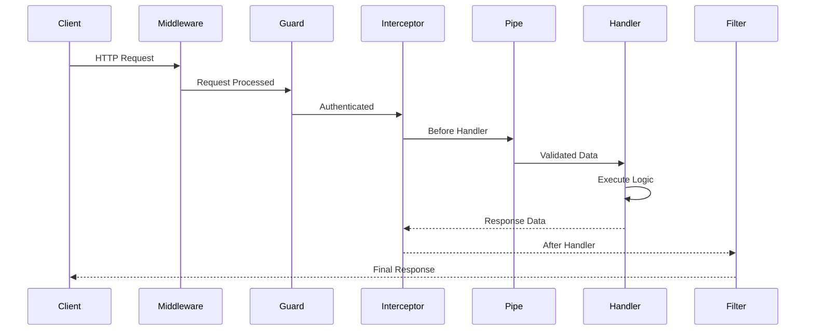
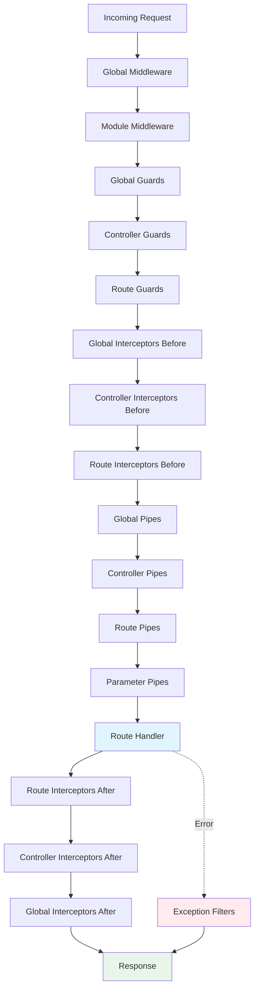

# Part 4: Middleware, Guards, Interceptors, and Pipes

## Table of Contents
- [Request Processing Pipeline](#request-processing-pipeline)
- [Middleware](#middleware)
- [Guards](#guards)
- [Interceptors](#interceptors)
- [Pipes](#pipes)
- [Exception Filters](#exception-filters)
- [Execution Order](#execution-order)

---

## Request Processing Pipeline



---

## Middleware

### What is Middleware?

Middleware functions execute **before** route handlers. They have access to request and response objects.

```typescript
import { Injectable, NestMiddleware } from '@nestjs/common';
import { Request, Response, NextFunction } from 'express';

@Injectable()
export class LoggerMiddleware implements NestMiddleware {
  use(req: Request, res: Response, next: NextFunction) {
    console.log(`[${new Date().toISOString()}] ${req.method} ${req.url}`);
    next(); // Pass control to next middleware
  }
}
```

### Applying Middleware

```typescript
// app.module.ts
import { Module, NestModule, MiddlewareConsumer } from '@nestjs/common';

@Module({
  imports: [UsersModule],
})
export class AppModule implements NestModule {
  configure(consumer: MiddlewareConsumer) {
    consumer
      .apply(LoggerMiddleware)
      .forRoutes('*'); // Apply to all routes
  }
}
```

### Route-Specific Middleware

```typescript
export class AppModule implements NestModule {
  configure(consumer: MiddlewareConsumer) {
    consumer
      .apply(LoggerMiddleware)
      .forRoutes('users'); // Only /users routes
      
    consumer
      .apply(AuthMiddleware)
      .exclude(
        { path: 'auth/login', method: RequestMethod.POST },
        { path: 'auth/register', method: RequestMethod.POST },
      )
      .forRoutes({ path: '*', method: RequestMethod.ALL });
  }
}
```

### Functional Middleware

```typescript
// Simple logging middleware
export function logger(req: Request, res: Response, next: NextFunction) {
  console.log(`Request: ${req.method} ${req.url}`);
  next();
}

// Apply it
consumer.apply(logger).forRoutes('*');
```

### Real-World Example: Authentication Middleware

```typescript
@Injectable()
export class AuthenticationMiddleware implements NestMiddleware {
  constructor(private jwtService: JwtService) {}
  
  async use(req: Request, res: Response, next: NextFunction) {
    const token = req.headers.authorization?.replace('Bearer ', '');
    
    if (!token) {
      return res.status(401).json({ message: 'No token provided' });
    }
    
    try {
      const payload = this.jwtService.verify(token);
      req['user'] = payload; // Attach user to request
      next();
    } catch (error) {
      return res.status(401).json({ message: 'Invalid token' });
    }
  }
}
```

---

## Guards

### What are Guards?

Guards determine if a request should be handled by the route handler. They execute **after middleware** and **before interceptors**.

```typescript
import { Injectable, CanActivate, ExecutionContext } from '@nestjs/common';
import { Observable } from 'rxjs';

@Injectable()
export class AuthGuard implements CanActivate {
  canActivate(
    context: ExecutionContext,
  ): boolean | Promise<boolean> | Observable<boolean> {
    const request = context.switchToHttp().getRequest();
    return this.validateRequest(request);
  }
  
  private validateRequest(request: any): boolean {
    return !!request.user; // User must exist
  }
}
```

### Applying Guards

```typescript
// Global guard
const app = await NestFactory.create(AppModule);
app.useGlobalGuards(new AuthGuard());

// Controller-level
@Controller('users')
@UseGuards(AuthGuard)
export class UsersController {}

// Route-level
@Get('profile')
@UseGuards(AuthGuard)
getProfile() {}
```

### Role-Based Access Control (RBAC)

```typescript
// Custom decorator for roles
import { SetMetadata } from '@nestjs/common';

export const ROLES_KEY = 'roles';
export const Roles = (...roles: string[]) => SetMetadata(ROLES_KEY, roles);

// Roles guard
@Injectable()
export class RolesGuard implements CanActivate {
  constructor(private reflector: Reflector) {}

  canActivate(context: ExecutionContext): boolean {
    const requiredRoles = this.reflector.getAllAndOverride<string[]>(
      ROLES_KEY,
      [context.getHandler(), context.getClass()],
    );
    
    if (!requiredRoles) {
      return true; // No roles required
    }
    
    const request = context.switchToHttp().getRequest();
    const user = request.user;
    
    return requiredRoles.some((role) => user.roles?.includes(role));
  }
}

// Usage
@Post()
@Roles('admin')
@UseGuards(RolesGuard)
create() {}
```

### JWT Authentication Guard

```typescript
@Injectable()
export class JwtAuthGuard implements CanActivate {
  constructor(private jwtService: JwtService) {}

  async canActivate(context: ExecutionContext): Promise<boolean> {
    const request = context.switchToHttp().getRequest();
    const token = this.extractToken(request);
    
    if (!token) {
      throw new UnauthorizedException('No token provided');
    }
    
    try {
      const payload = await this.jwtService.verifyAsync(token);
      request.user = payload;
      return true;
    } catch {
      throw new UnauthorizedException('Invalid token');
    }
  }
  
  private extractToken(request: Request): string | undefined {
    const [type, token] = request.headers.authorization?.split(' ') ?? [];
    return type === 'Bearer' ? token : undefined;
  }
}
```

---

## Interceptors

### What are Interceptors?

Interceptors execute **before and after** route handlers. They can transform requests, responses, handle errors, and add extra logic.

```typescript
import {
  Injectable,
  NestInterceptor,
  ExecutionContext,
  CallHandler,
} from '@nestjs/common';
import { Observable } from 'rxjs';
import { map } from 'rxjs/operators';

@Injectable()
export class TransformInterceptor implements NestInterceptor {
  intercept(context: ExecutionContext, next: CallHandler): Observable<any> {
    console.log('Before handler...');
    
    return next.handle().pipe(
      map((data) => {
        console.log('After handler...');
        return { data, timestamp: new Date().toISOString() };
      }),
    );
  }
}
```

### Response Transformation

```typescript
@Injectable()
export class ResponseInterceptor implements NestInterceptor {
  intercept(context: ExecutionContext, next: CallHandler): Observable<any> {
    return next.handle().pipe(
      map((data) => ({
        success: true,
        statusCode: context.switchToHttp().getResponse().statusCode,
        data,
        timestamp: new Date().toISOString(),
      })),
    );
  }
}

// Before: { id: 1, name: "John" }
// After: { success: true, statusCode: 200, data: { id: 1, name: "John" }, timestamp: "..." }
```

### Logging Interceptor

```typescript
@Injectable()
export class LoggingInterceptor implements NestInterceptor {
  intercept(context: ExecutionContext, next: CallHandler): Observable<any> {
    const request = context.switchToHttp().getRequest();
    const { method, url } = request;
    const now = Date.now();
    
    console.log(`→ ${method} ${url}`);
    
    return next.handle().pipe(
      tap(() => {
        const response = context.switchToHttp().getResponse();
        console.log(
          `← ${method} ${url} ${response.statusCode} - ${Date.now() - now}ms`,
        );
      }),
    );
  }
}
```

### Timeout Interceptor

```typescript
import { timeout } from 'rxjs/operators';

@Injectable()
export class TimeoutInterceptor implements NestInterceptor {
  intercept(context: ExecutionContext, next: CallHandler): Observable<any> {
    return next.handle().pipe(
      timeout(5000), // 5 second timeout
    );
  }
}
```

### Cache Interceptor

```typescript
@Injectable()
export class CacheInterceptor implements NestInterceptor {
  constructor(private cacheManager: Cache) {}

  async intercept(
    context: ExecutionContext,
    next: CallHandler,
  ): Promise<Observable<any>> {
    const request = context.switchToHttp().getRequest();
    const cacheKey = `${request.method}:${request.url}`;
    
    const cachedResponse = await this.cacheManager.get(cacheKey);
    if (cachedResponse) {
      return of(cachedResponse); // Return cached data
    }
    
    return next.handle().pipe(
      tap(async (response) => {
        await this.cacheManager.set(cacheKey, response, { ttl: 60 });
      }),
    );
  }
}
```

---

## Pipes

### What are Pipes?

Pipes transform and validate data **before** it reaches the route handler.

### Built-in Pipes

```typescript
import {
  ParseIntPipe,
  ParseFloatPipe,
  ParseBoolPipe,
  ParseArrayPipe,
  ParseUUIDPipe,
  DefaultValuePipe,
  ParseEnumPipe,
} from '@nestjs/common';

@Controller('examples')
export class ExamplesController {
  // Parse to integer
  @Get(':id')
  findOne(@Param('id', ParseIntPipe) id: number) {
    return { id }; // id is number, not string
  }
  
  // Parse with default value
  @Get()
  findAll(@Query('page', new DefaultValuePipe(1), ParseIntPipe) page: number) {
    return { page };
  }
  
  // Parse array
  @Get('filter')
  filter(@Query('ids', new ParseArrayPipe({ items: Number })) ids: number[]) {
    return { ids }; // [1, 2, 3]
  }
  
  // Parse UUID
  @Get('uuid/:id')
  findByUuid(@Param('id', ParseUUIDPipe) id: string) {
    return { id }; // Validates UUID format
  }
  
  // Parse enum
  enum Status {
    ACTIVE = 'active',
    INACTIVE = 'inactive',
  }
  
  @Get('status/:status')
  findByStatus(@Param('status', new ParseEnumPipe(Status)) status: Status) {
    return { status };
  }
}
```

### ValidationPipe (Most Important)

```typescript
import { ValidationPipe } from '@nestjs/common';

// Global validation
const app = await NestFactory.create(AppModule);
app.useGlobalPipes(new ValidationPipe({
  whitelist: true, // Strip properties not in DTO
  forbidNonWhitelisted: true, // Throw error if extra properties
  transform: true, // Auto-transform to DTO instance
  transformOptions: {
    enableImplicitConversion: true, // Auto-convert types
  },
}));

// DTO with validation
import { IsEmail, IsString, MinLength, IsInt, Min } from 'class-validator';

export class CreateUserDto {
  @IsEmail()
  email: string;

  @IsString()
  @MinLength(8)
  password: string;

  @IsString()
  name: string;

  @IsInt()
  @Min(18)
  age: number;
}

// Controller
@Post()
create(@Body() createUserDto: CreateUserDto) {
  // createUserDto is validated and transformed
  return this.usersService.create(createUserDto);
}
```

### Custom Pipe

```typescript
import { PipeTransform, Injectable, BadRequestException } from '@nestjs/common';

@Injectable()
export class ParseDatePipe implements PipeTransform<string, Date> {
  transform(value: string): Date {
    const date = new Date(value);
    
    if (isNaN(date.getTime())) {
      throw new BadRequestException('Invalid date format');
    }
    
    return date;
  }
}

// Usage
@Get('range')
findByDateRange(
  @Query('from', ParseDatePipe) from: Date,
  @Query('to', ParseDatePipe) to: Date,
) {
  return { from, to }; // Both are Date objects
}
```

---

## Exception Filters

### What are Exception Filters?

Exception filters handle errors and format error responses.

### Custom Exception Filter

```typescript
import {
  ExceptionFilter,
  Catch,
  ArgumentsHost,
  HttpException,
  HttpStatus,
} from '@nestjs/common';

@Catch(HttpException)
export class HttpExceptionFilter implements ExceptionFilter {
  catch(exception: HttpException, host: ArgumentsHost) {
    const ctx = host.switchToHttp();
    const response = ctx.getResponse();
    const request = ctx.getRequest();
    const status = exception.getStatus();
    const exceptionResponse = exception.getResponse();

    response.status(status).json({
      success: false,
      statusCode: status,
      timestamp: new Date().toISOString(),
      path: request.url,
      message: typeof exceptionResponse === 'object'
        ? exceptionResponse['message']
        : exceptionResponse,
    });
  }
}

// Apply globally
app.useGlobalFilters(new HttpExceptionFilter());
```

### All Exceptions Filter

```typescript
@Catch()
export class AllExceptionsFilter implements ExceptionFilter {
  catch(exception: unknown, host: ArgumentsHost) {
    const ctx = host.switchToHttp();
    const response = ctx.getResponse();
    const request = ctx.getRequest();

    const status =
      exception instanceof HttpException
        ? exception.getStatus()
        : HttpStatus.INTERNAL_SERVER_ERROR;

    const message =
      exception instanceof HttpException
        ? exception.message
        : 'Internal server error';

    response.status(status).json({
      success: false,
      statusCode: status,
      timestamp: new Date().toISOString(),
      path: request.url,
      message,
    });
  }
}
```

---

## Execution Order

### Complete Order



### Example with All Components

```typescript
// Middleware
@Injectable()
export class LoggerMiddleware implements NestMiddleware {
  use(req: Request, res: Response, next: NextFunction) {
    console.log('1. Middleware');
    next();
  }
}

// Guard
@Injectable()
export class AuthGuard implements CanActivate {
  canActivate(): boolean {
    console.log('2. Guard');
    return true;
  }
}

// Interceptor
@Injectable()
export class LoggingInterceptor implements NestInterceptor {
  intercept(context: ExecutionContext, next: CallHandler) {
    console.log('3. Interceptor Before');
    return next.handle().pipe(
      tap(() => console.log('6. Interceptor After')),
    );
  }
}

// Pipe
@Injectable()
export class ValidationPipe implements PipeTransform {
  transform(value: any) {
    console.log('4. Pipe');
    return value;
  }
}

// Controller
@Controller('test')
@UseGuards(AuthGuard)
@UseInterceptors(LoggingInterceptor)
export class TestController {
  @Get()
  test(@Query('value', ValidationPipe) value: string) {
    console.log('5. Handler');
    return { value };
  }
}

// Output:
// 1. Middleware
// 2. Guard
// 3. Interceptor Before
// 4. Pipe
// 5. Handler
// 6. Interceptor After
```

---

## Real-World Examples

### API Rate Limiting

```typescript
import { Injectable, NestInterceptor, ExecutionContext, CallHandler } from '@nestjs/common';
import { ThrottlerException } from '@nestjs/throttler';

@Injectable()
export class RateLimitInterceptor implements NestInterceptor {
  private requests = new Map<string, number[]>();

  intercept(context: ExecutionContext, next: CallHandler) {
    const request = context.switchToHttp().getRequest();
    const ip = request.ip;
    const now = Date.now();
    const windowMs = 60000; // 1 minute
    const maxRequests = 100;

    if (!this.requests.has(ip)) {
      this.requests.set(ip, []);
    }

    const requests = this.requests.get(ip)!;
    const recentRequests = requests.filter((time) => now - time < windowMs);

    if (recentRequests.length >= maxRequests) {
      throw new ThrottlerException('Too many requests');
    }

    recentRequests.push(now);
    this.requests.set(ip, recentRequests);

    return next.handle();
  }
}
```

### Request ID Tracking

```typescript
@Injectable()
export class RequestIdMiddleware implements NestMiddleware {
  use(req: Request, res: Response, next: NextFunction) {
    const requestId = req.headers['x-request-id'] || uuid();
    req['requestId'] = requestId;
    res.setHeader('X-Request-ID', requestId);
    next();
  }
}

@Injectable()
export class RequestIdInterceptor implements NestInterceptor {
  intercept(context: ExecutionContext, next: CallHandler) {
    const request = context.switchToHttp().getRequest();
    const requestId = request.requestId;

    return next.handle().pipe(
      map((data) => ({
        ...data,
        requestId,
      })),
    );
  }
}
```

---

## Key Takeaways

✅ **Middleware** - Request preprocessing, runs first  
✅ **Guards** - Authentication/authorization checks  
✅ **Interceptors** - Transform requests/responses, logging  
✅ **Pipes** - Validation and transformation  
✅ **Exception Filters** - Error handling  

---

## Next Steps

➡️ **[Part 5: Database Integration](./Part05-Database-Integration.md)** - TypeORM and Prisma

---

**[← Previous: Dependency Injection](./Part03-Dependency-Injection.md)** | **[Next: Database Integration →](./Part05-Database-Integration.md)**
