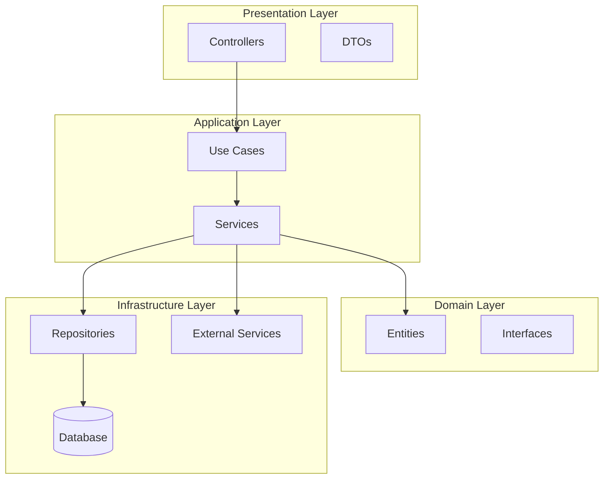

# Part 15: Best Practices & Design Patterns

## Table of Contents
- [Clean Architecture](#clean-architecture)
- [SOLID Principles](#solid-principles)
- [Design Patterns](#design-patterns)
- [Project Structure](#project-structure)
- [Security Best Practices](#security-best-practices)
- [Performance Tips](#performance-tips)

---

## Clean Architecture



### Layered Structure

```
src/
├── modules/
│   └── users/
│       ├── domain/
│       │   ├── user.entity.ts
│       │   └── user.repository.interface.ts
│       ├── application/
│       │   ├── dto/
│       │   └── services/
│       ├── infrastructure/
│       │   └── user.repository.ts
│       └── presentation/
│           └── users.controller.ts
```

---

## SOLID Principles

### 1. Single Responsibility

```typescript
// ❌ Bad: Too many responsibilities
@Injectable()
export class UserService {
  createUser() {}
  validateEmail() {}
  hashPassword() {}
  sendWelcomeEmail() {}
  logActivity() {}
}

// ✅ Good: Separated concerns
@Injectable()
export class UserService {
  constructor(
    private emailValidator: EmailValidator,
    private passwordHasher: PasswordHasher,
    private emailService: EmailService,
    private logger: Logger,
  ) {}

  async createUser(dto: CreateUserDto) {
    this.emailValidator.validate(dto.email);
    const hashedPassword = await this.passwordHasher.hash(dto.password);
    const user = await this.userRepository.save({ ...dto, password: hashedPassword });
    await this.emailService.sendWelcome(user.email);
    this.logger.log(`User created: ${user.id}`);
    return user;
  }
}
```

### 2. Open/Closed Principle

```typescript
// ✅ Open for extension, closed for modification
interface PaymentStrategy {
  charge(amount: number): Promise<void>;
}

@Injectable()
export class StripePayment implements PaymentStrategy {
  async charge(amount: number) {
    // Stripe implementation
  }
}

@Injectable()
export class PayPalPayment implements PaymentStrategy {
  async charge(amount: number) {
    // PayPal implementation
  }
}

@Injectable()
export class PaymentService {
  constructor(
    @Inject('PAYMENT_STRATEGY')
    private strategy: PaymentStrategy,
  ) {}

  async processPayment(amount: number) {
    return this.strategy.charge(amount);
  }
}
```

### 3. Liskov Substitution

```typescript
// Base class
abstract class BaseRepository<T> {
  abstract find(): Promise<T[]>;
  abstract findOne(id: string): Promise<T>;
}

// Implementations must honor the contract
@Injectable()
export class UserRepository extends BaseRepository<User> {
  async find(): Promise<User[]> {
    return this.orm.find();
  }

  async findOne(id: string): Promise<User> {
    return this.orm.findOne({ where: { id } });
  }
}
```

### 4. Interface Segregation

```typescript
// ❌ Bad: Fat interface
interface IRepository {
  find(): Promise<any[]>;
  findOne(id: string): Promise<any>;
  create(data: any): Promise<any>;
  update(id: string, data: any): Promise<any>;
  delete(id: string): Promise<void>;
  softDelete(id: string): Promise<void>;
  restore(id: string): Promise<void>;
}

// ✅ Good: Segregated interfaces
interface IReadRepository {
  find(): Promise<any[]>;
  findOne(id: string): Promise<any>;
}

interface IWriteRepository {
  create(data: any): Promise<any>;
  update(id: string, data: any): Promise<any>;
  delete(id: string): Promise<void>;
}

interface ISoftDeleteRepository {
  softDelete(id: string): Promise<void>;
  restore(id: string): Promise<void>;
}
```

### 5. Dependency Inversion

```typescript
// ✅ Depend on abstractions, not concretions
interface IEmailService {
  send(to: string, subject: string, body: string): Promise<void>;
}

@Injectable()
export class UserService {
  constructor(
    @Inject('IEmailService')
    private emailService: IEmailService, // Depends on interface
  ) {}
}

// Multiple implementations
@Injectable()
export class SendGridEmailService implements IEmailService {
  async send(to, subject, body) { /* SendGrid */ }
}

@Injectable()
export class MailgunEmailService implements IEmailService {
  async send(to, subject, body) { /* Mailgun */ }
}
```

---

## Design Patterns

### Repository Pattern

```typescript
// Domain interface
export interface IUserRepository {
  findAll(): Promise<User[]>;
  findById(id: string): Promise<User>;
  create(user: User): Promise<User>;
  update(id: string, user: Partial<User>): Promise<User>;
  delete(id: string): Promise<void>;
}

// Implementation
@Injectable()
export class TypeOrmUserRepository implements IUserRepository {
  constructor(
    @InjectRepository(UserEntity)
    private repository: Repository<UserEntity>,
  ) {}

  async findAll(): Promise<User[]> {
    const entities = await this.repository.find();
    return entities.map(e => this.toDomain(e));
  }

  private toDomain(entity: UserEntity): User {
    return new User(entity.id, entity.email, entity.name);
  }
}
```

### Factory Pattern

```typescript
@Injectable()
export class NotificationFactory {
  create(type: string): INotificationService {
    switch (type) {
      case 'email':
        return new EmailNotificationService();
      case 'sms':
        return new SMSNotificationService();
      case 'push':
        return new PushNotificationService();
      default:
        throw new Error('Invalid notification type');
    }
  }
}
```

### Strategy Pattern

```typescript
interface SortStrategy {
  sort(data: any[]): any[];
}

@Injectable()
export class QuickSort implements SortStrategy {
  sort(data: any[]): any[] {
    // QuickSort implementation
    return data;
  }
}

@Injectable()
export class MergeSort implements SortStrategy {
  sort(data: any[]): any[] {
    // MergeSort implementation
    return data;
  }
}

@Injectable()
export class DataService {
  constructor(
    @Inject('SORT_STRATEGY')
    private sortStrategy: SortStrategy,
  ) {}

  processData(data: any[]) {
    return this.sortStrategy.sort(data);
  }
}
```

---

## Security Best Practices

### 1. Input Validation

```typescript
// Always validate and sanitize
@Post()
async create(@Body(new ValidationPipe()) dto: CreateUserDto) {
  return this.usersService.create(dto);
}
```

### 2. Authentication & Authorization

```typescript
// Use guards on all protected routes
@UseGuards(JwtAuthGuard, RolesGuard)
@Roles('admin')
@Get()
findAll() {}
```

### 3. Rate Limiting

```typescript
@UseGuards(ThrottlerGuard)
@Throttle(10, 60) // 10 requests per minute
@Post('login')
login() {}
```

### 4. CORS Configuration

```typescript
app.enableCors({
  origin: process.env.ALLOWED_ORIGINS.split(','),
  credentials: true,
});
```

### 5. Helmet for Security Headers

```bash
npm install helmet
```

```typescript
import * as helmet from 'helmet';
app.use(helmet());
```

---

## Performance Tips

### 1. Use Indexing

```typescript
@Entity()
@Index(['email']) // Single index
@Index(['userId', 'createdAt']) // Composite index
export class User {}
```

### 2. Pagination

```typescript
async findAll(page: number = 1, limit: number = 10) {
  return this.repository.find({
    skip: (page - 1) * limit,
    take: limit,
  });
}
```

### 3. Select Only Needed Fields

```typescript
async findAll() {
  return this.repository.find({
    select: ['id', 'email', 'name'], // Don't fetch password
  });
}
```

### 4. Use Caching

```typescript
@CacheKey('all-users')
@CacheTTL(300)
async findAll() {
  return this.repository.find();
}
```

### 5. Lazy Loading

```typescript
// Load relations only when needed
async findOne(id: string, includeRelations: boolean = false) {
  const options: FindOneOptions = { where: { id } };
  
  if (includeRelations) {
    options.relations = ['posts', 'comments'];
  }
  
  return this.repository.findOne(options);
}
```

---

## Project Structure Best Practices

### Recommended Structure

```
project-root/
├── src/
│   ├── modules/
│   │   ├── auth/
│   │   ├── users/
│   │   └── products/
│   ├── common/
│   │   ├── decorators/
│   │   ├── filters/
│   │   ├── guards/
│   │   ├── interceptors/
│   │   ├── pipes/
│   │   └── interfaces/
│   ├── config/
│   │   ├── database.config.ts
│   │   └── jwt.config.ts
│   ├── database/
│   │   ├── migrations/
│   │   └── seeds/
│   ├── utils/
│   ├── app.module.ts
│   └── main.ts
├── test/
│   ├── unit/
│   ├── integration/
│   └── e2e/
├── .env.example
├── .gitignore
├── nest-cli.json
├── package.json
└── tsconfig.json
```

---

## Key Takeaways

✅ **Clean Architecture** - Separation of concerns  
✅ **SOLID** - Maintainable, scalable code  
✅ **Design Patterns** - Proven solutions  
✅ **Security** - Always validate, authenticate, authorize  
✅ **Performance** - Index, cache, paginate  

---

## Next Steps

➡️ **[Part 16: Complete Project Example](./Part16-Complete-Project.md)** - Put it all together

---

**[← Previous: Advanced Topics](./Part11-Advanced-Topics.md)** | **[Next: Complete Project →](./Part16-Complete-Project.md)**
