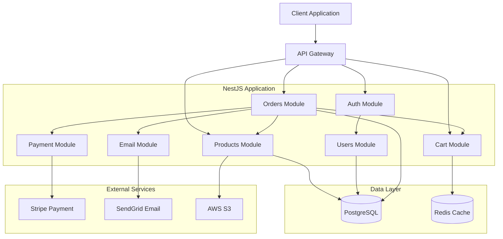

# Part 16: Complete E-Commerce Backend Project

This part presents a complete, production-ready e-commerce backend that demonstrates all concepts covered in this guide.

## Table of Contents
- [Project Overview](#project-overview)
- [Architecture](#architecture)
- [Project Structure](#project-structure)
- [Core Modules](#core-modules)
- [Running the Project](#running-the-project)
- [API Endpoints](#api-endpoints)

---

## Project Overview

### Features

- **User Management**: Registration, authentication with JWT + refresh tokens
- **Product Catalog**: CRUD operations with categories and images
- **Shopping Cart**: Add/remove items, calculate totals
- **Orders**: Place orders, payment processing, order history
- **Admin Panel**: Manage products, orders, users
- **Real-time**: WebSocket notifications for order status
- **Email**: Welcome emails, order confirmations
- **Caching**: Redis for product catalog
- **Background Jobs**: Email sending, image processing
- **API Documentation**: Swagger/OpenAPI

### Technology Stack

- **Framework**: NestJS 10
- **Database**: PostgreSQL with TypeORM
- **Cache**: Redis
- **Queue**: Bull
- **Authentication**: JWT with Passport
- **Validation**: class-validator
- **Documentation**: Swagger
- **Testing**: Jest

---

## Architecture



---

## Project Structure

```
ecommerce-backend/
├── src/
│   ├── modules/
│   │   ├── auth/
│   │   │   ├── dto/
│   │   │   │   ├── login.dto.ts
│   │   │   │   └── register.dto.ts
│   │   │   ├── guards/
│   │   │   │   ├── jwt-auth.guard.ts
│   │   │   │   └── roles.guard.ts
│   │   │   ├── strategies/
│   │   │   │   └── jwt.strategy.ts
│   │   │   ├── auth.controller.ts
│   │   │   ├── auth.service.ts
│   │   │   └── auth.module.ts
│   │   ├── users/
│   │   │   ├── dto/
│   │   │   ├── entities/
│   │   │   │   └── user.entity.ts
│   │   │   ├── users.controller.ts
│   │   │   ├── users.service.ts
│   │   │   └── users.module.ts
│   │   ├── products/
│   │   │   ├── dto/
│   │   │   ├── entities/
│   │   │   │   ├── product.entity.ts
│   │   │   │   └── category.entity.ts
│   │   │   ├── products.controller.ts
│   │   │   ├── products.service.ts
│   │   │   └── products.module.ts
│   │   ├── cart/
│   │   │   ├── dto/
│   │   │   ├── cart.controller.ts
│   │   │   ├── cart.service.ts
│   │   │   └── cart.module.ts
│   │   ├── orders/
│   │   │   ├── dto/
│   │   │   ├── entities/
│   │   │   │   ├── order.entity.ts
│   │   │   │   └── order-item.entity.ts
│   │   │   ├── orders.controller.ts
│   │   │   ├── orders.service.ts
│   │   │   └── orders.module.ts
│   │   ├── payment/
│   │   │   ├── payment.service.ts
│   │   │   └── payment.module.ts
│   │   └── email/
│   │       ├── templates/
│   │       ├── email.processor.ts
│   │       ├── email.service.ts
│   │       └── email.module.ts
│   ├── common/
│   │   ├── decorators/
│   │   │   ├── current-user.decorator.ts
│   │   │   ├── roles.decorator.ts
│   │   │   └── public.decorator.ts
│   │   ├── filters/
│   │   │   └── http-exception.filter.ts
│   │   ├── interceptors/
│   │   │   ├── logging.interceptor.ts
│   │   │   └── transform.interceptor.ts
│   │   └── guards/
│   │       └── throttle.guard.ts
│   ├── config/
│   │   ├── database.config.ts
│   │   ├── jwt.config.ts
│   │   ├── redis.config.ts
│   │   └── app.config.ts
│   ├── database/
│   │   └── migrations/
│   ├── app.module.ts
│   └── main.ts
├── test/
│   ├── unit/
│   └── e2e/
├── .env.example
├── docker-compose.yml
├── package.json
└── README.md
```

---

## Core Modules

### User Entity

```typescript
// users/entities/user.entity.ts
import { Entity, Column, PrimaryGeneratedColumn, CreateDateColumn, OneToMany, BeforeInsert } from 'typeorm';
import * as bcrypt from 'bcrypt';
import { Order } from '../../orders/entities/order.entity';

export enum UserRole {
  USER = 'user',
  ADMIN = 'admin',
}

@Entity('users')
export class User {
  @PrimaryGeneratedColumn('uuid')
  id: string;

  @Column({ unique: true })  email: string;

  @Column()
  name: string;

  @Column({ select: false })
  password: string;

  @Column({ type: 'enum', enum: UserRole, default: UserRole.USER })
  role: UserRole;

  @Column({ nullable: true })
  refreshToken: string;

  @OneToMany(() => Order, (order) => order.user)
  orders: Order[];

  @CreateDateColumn()
  createdAt: Date;

  @BeforeInsert()
  async hashPassword() {
    this.password = await bcrypt.hash(this.password, 10);
  }
}
```

### Product Entity

```typescript
// products/entities/product.entity.ts
@Entity('products')
export class Product {
  @PrimaryGeneratedColumn('uuid')
  id: string;

  @Column()
  name: string;

  @Column('text')
  description: string;

  @Column('decimal', { precision: 10, scale: 2 })
  price: number;

  @Column({ default: 0 })
  stock: number;

  @Column({ nullable: true })
  imageUrl: string;

  @ManyToOne(() => Category, (category) => category.products)
  category: Category;

  @Column()
  categoryId: string;

  @Column({ default: true })
  isActive: boolean;

  @CreateDateColumn()
  createdAt: Date;
}

@Entity('categories')
export class Category {
  @PrimaryGeneratedColumn('uuid')
  id: string;

  @Column({ unique: true })
  name: string;

  @Column({ nullable: true })
  description: string;

  @OneToMany(() => Product, (product) => product.category)
  products: Product[];
}
```

### Order Entities

```typescript
// orders/entities/order.entity.ts
@Entity('orders')
export class Order {
  @PrimaryGeneratedColumn('uuid')
  id: string;

  @ManyToOne(() => User, (user) => user.orders)
  user: User;

  @Column()
  userId: string;

  @OneToMany(() => OrderItem, (item) => item.order, { cascade: true })
  items: OrderItem[];

  @Column('decimal', { precision: 10, scale: 2 })
  total: number;

  @Column({ type: 'enum', enum: OrderStatus, default: OrderStatus.PENDING })
  status: OrderStatus;

  @Column({ nullable: true })
  paymentIntentId: string;

  @CreateDateColumn()
  createdAt: Date;
}

@Entity('order_items')
export class OrderItem {
  @PrimaryGeneratedColumn('uuid')
  id: string;

  @ManyToOne(() => Order, (order) => order.items)
  order: Order;

  @ManyToOne(() => Product)
  product: Product;

  @Column()
  productId: string;

  @Column()
  quantity: number;

  @Column('decimal', { precision: 10, scale: 2 })
  price: number;
}

export enum OrderStatus {
  PENDING = 'pending',
  PROCESSING = 'processing',
  SHIPPED = 'shipped',
  DELIVERED = 'delivered',
  CANCELLED = 'cancelled',
}
```

### Products Service

```typescript
// products/products.service.ts
@Injectable()
export class ProductsService {
  constructor(
    @InjectRepository(Product)
    private productsRepository: Repository<Product>,
    @Inject(CACHE_MANAGER)
    private cacheManager: Cache,
  ) {}

  async findAll(page: number = 1, limit: number = 10): Promise<{ data: Product[]; total: number }> {
    const cacheKey = `products_${page}_${limit}`;
    const cached = await this.cacheManager.get(cacheKey);
    
    if (cached) {
      return cached as { data: Product[]; total: number };
    }

    const [data, total] = await this.productsRepository.findAndCount({
      where: { isActive: true },
      relations: ['category'],
      skip: (page - 1) * limit,
      take: limit,
    });

    const result = { data, total };
    await this.cacheManager.set(cacheKey, result, { ttl: 300 });
    
    return result;
  }

  async findOne(id: string): Promise<Product> {
    const product = await this.productsRepository.findOne({
      where: { id },
      relations: ['category'],
    });

    if (!product) {
      throw new NotFoundException(`Product #${id} not found`);
    }

    return product;
  }

  async create(dto: CreateProductDto): Promise<Product> {
    const product = this.productsRepository.create(dto);
    await this.clearCache();
    return this.productsRepository.save(product);
  }

  async update(id: string, dto: UpdateProductDto): Promise<Product> {
    const product = await this.findOne(id);
    Object.assign(product, dto);
    await this.clearCache();
    return this.productsRepository.save(product);
  }

  async decreaseStock(id: string, quantity: number): Promise<void> {
    const product = await this.findOne(id);
    
    if (product.stock < quantity) {
      throw new BadRequestException('Insufficient stock');
    }

    product.stock -= quantity;
    await this.productsRepository.save(product);
  }

  private async clearCache() {
    const keys = await this.cacheManager.store.keys('products_*');
    await Promise.all(keys.map(key => this.cacheManager.del(key)));
  }
}
```

### Orders Service with Transactions

```typescript
// orders/orders.service.ts
@Injectable()
export class OrdersService {
  constructor(
    @InjectRepository(Order)
    private ordersRepository: Repository<Order>,
    private dataSource: DataSource,
    private productsService: ProductsService,
    private paymentService: PaymentService,
    private emailService: EmailService,
  ) {}

  async create(userId: string, items: CreateOrderItemDto[]): Promise<Order> {
    const queryRunner = this.dataSource.createQueryRunner();
    await queryRunner.connect();
    await queryRunner.startTransaction();

    try {
      // Create order
      const order = queryRunner.manager.create(Order, {
        userId,
        total: 0,
        status: OrderStatus.PENDING,
      });
      await queryRunner.manager.save(order);

      // Process items and calculate total
      let total = 0;
      for (const item of items) {
        const product = await this.productsService.findOne(item.productId);

        // Check stock
        if (product.stock < item.quantity) {
          throw new BadRequestException(`Insufficient stock for ${product.name}`);
        }

        // Decrease stock
        await this.productsService.decreaseStock(product.id, item.quantity);

        // Create order item
        const orderItem = queryRunner.manager.create(OrderItem, {
          orderId: order.id,
          productId: item.productId,
          quantity: item.quantity,
          price: product.price,
        });
        await queryRunner.manager.save(orderItem);

        total += product.price * item.quantity;
      }

      // Update order total
      order.total = total;
      await queryRunner.manager.save(order);

      // Process payment
      const paymentIntent = await this.paymentService.createPayment(total);
      order.paymentIntentId = paymentIntent.id;
      order.status = OrderStatus.PROCESSING;
      await queryRunner.manager.save(order);

      await queryRunner.commitTransaction();

      // Send confirmation email
      await this.emailService.sendOrderConfirmation(userId, order);

      return order;
    } catch (error) {
      await queryRunner.rollbackTransaction();
      throw error;
    } finally {
      await queryRunner.release();
    }
  }

  async findUserOrders(userId: string): Promise<Order[]> {
    return this.ordersRepository.find({
      where: { userId },
      relations: ['items', 'items.product'],
      order: { createdAt: 'DESC' },
    });
  }

  async updateStatus(orderId: string, status: OrderStatus): Promise<Order> {
    const order = await this.ordersRepository.findOne({ where: { id: orderId } });
    
    if (!order) {
      throw new NotFoundException(`Order #${orderId} not found`);
    }

    order.status = status;
    return this.ordersRepository.save(order);
  }
}
```

### Payment Service

```typescript
// payment/payment.service.ts
import Stripe from 'stripe';

@Injectable()
export class PaymentService {
  private stripe: Stripe;

  constructor(private configService: ConfigService) {
    this.stripe = new Stripe(this.configService.get('STRIPE_SECRET_KEY'), {
      apiVersion: '2023-10-16',
    });
  }

  async createPayment(amount: number): Promise<Stripe.PaymentIntent> {
    return this.stripe.paymentIntents.create({
      amount: Math.round(amount * 100), // Convert to cents
      currency: 'usd',
      payment_method_types: ['card'],
    });
  }

  async confirmPayment(paymentIntentId: string): Promise<Stripe.PaymentIntent> {
    return this.stripe.paymentIntents.confirm(paymentIntentId);
  }
}
```

### Email Service with Queue

```typescript
// email/email.service.ts
@Injectable()
export class EmailService {
  constructor(@InjectQueue('email') private emailQueue: Queue) {}

  async sendWelcomeEmail(email: string, name: string) {
    await this.emailQueue.add('welcome', { email, name });
  }

  async sendOrderConfirmation(userId: string, order: Order) {
    await this.emailQueue.add('order-confirmation', { userId, order });
  }
}

// email/email.processor.ts
@Processor('email')
export class EmailProcessor {
  constructor(private usersService: UsersService) {}

  @Process('welcome')
  async handleWelcomeEmail(job: Job) {
    const { email, name } = job.data;
    // Send email using SendGrid or similar
    console.log(`Sending welcome email to ${email}`);
  }

  @Process('order-confirmation')
  async handleOrderConfirmation(job: Job) {
    const { userId, order } = job.data;
    const user = await this.usersService.findOne(userId);
    // Send order confirmation email
    console.log(`Sending order confirmation to ${user.email}`);
  }
}
```

---

## Running the Project

### Prerequisites

```bash
# Install dependencies
npm install

# Setup database and Redis with Docker
docker-compose up -d

# Copy environment variables
cp .env.example .env
```

### Environment Variables

```env
# .env
NODE_ENV=development
PORT=3000

# Database
DB_HOST=localhost
DB_PORT=5432
DB_USER=postgres
DB_PASSWORD=postgres
DB_NAME=ecommerce

# Redis
REDIS_HOST=localhost
REDIS_PORT=6379

# JWT
JWT_SECRET=your-super-secret-jwt-key
JWT_EXPIRES_IN=1h
JWT_REFRESH_SECRET=your-refresh-secret
JWT_REFRESH_EXPIRES_IN=7d

# Stripe
STRIPE_SECRET_KEY=sk_test_your_stripe_key
STRIPE_PUBLISHABLE_KEY=pk_test_your_stripe_key

# SendGrid
SENDGRID_API_KEY=your_sendgrid_api_key
```

### Running

```bash
# Development
npm run start:dev

# Production build
npm run build
npm run start:prod

# Run tests
npm run test
npm run test:e2e
npm run test:cov
```

---

## API Endpoints

### Authentication
- `POST /auth/register` - Register new user
- `POST /auth/login` - Login
- `POST /auth/refresh` - Refresh access token
- `POST /auth/logout` - Logout
- `GET /auth/profile` - Get current user

### Products
- `GET /products` - List products (paginated, cached)
- `GET /products/:id` - Get product details
- `POST /products` - Create product (Admin only)
- `PUT /products/:id` - Update product (Admin only)
- `DELETE /products/:id` - Delete product (Admin only)

### Categories
- `GET /categories` - List categories
- `POST /categories` - Create category (Admin only)

### Cart
- `GET /cart` - Get current cart
- `POST /cart/items` - Add item to cart
- `DELETE /cart/items/:id` - Remove item from cart
- `DELETE /cart` - Clear cart

### Orders
- `POST /orders` - Create order
- `GET /orders` - Get user's orders
- `GET /orders/:id` - Get order details
- `PUT /orders/:id/status` - Update order status (Admin only)

---

## Docker Compose

```yaml
# docker-compose.yml
version: '3.8'

services:
  postgres:
    image: postgres:15
    environment:
      POSTGRES_USER: postgres
      POSTGRES_PASSWORD: postgres
      POSTGRES_DB: ecommerce
    ports:
      - '5432:5432'
    volumes:
      - postgres_data:/var/lib/postgresql/data

  redis:
    image: redis:7-alpine
    ports:
      - '6379:6379'

volumes:
  postgres_data:
```

---

## Key Features Demonstrated

✅ **Clean Architecture** - Layered structure  
✅ **Type Safety** - Full TypeScript usage  
✅ **Authentication** - JWT with refresh tokens  
✅ **Authorization** - Role-based access control  
✅ **Database** - PostgreSQL with TypeORM, relations, transactions  
✅ **Caching** - Redis for product catalog  
✅ **Queues** - Background job processing for emails  
✅ **Validation** - class-validator for all inputs  
✅ **Error Handling** - Global exception filters  
✅ **Security** - Helmet, CORS, rate limiting  
✅ **Testing** - Unit and E2E tests  
✅ **Documentation** - Swagger/OpenAPI  

---

## Conclusion

This complete project demonstrates all the concepts covered throughout this guide:

- **Parts 1-3**: Modules, controllers, services, dependency injection
- **Part 4**: Guards for authentication, interceptors for logging
- **Part 5**: Database integration with relations and transactions
- **Part 6**: JWT authentication with role-based access
- **Part 7**: DTOs with validation
- **Part 8**: Configuration management
- **Part 9**: Error handling and logging
- **Part 10**: Comprehensive testing
- **Part 11**: Caching and background jobs
- **Part 15**: Clean architecture and best practices

You now have a complete, production-ready NestJS application that you can use as a reference for your own projects!

---

**[← Previous: Best Practices](./Part15-Best-Practices.md)** | **[Back to README](./README.md)**
