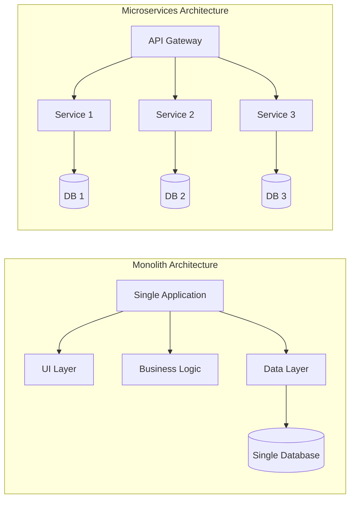
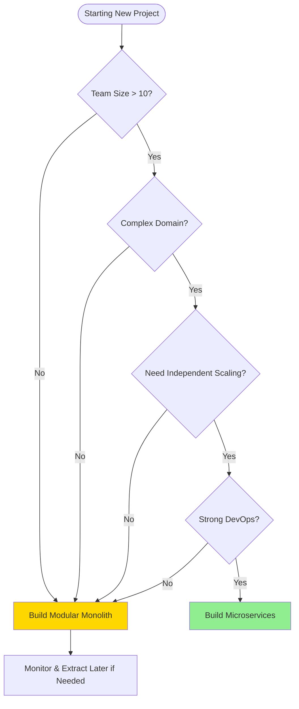
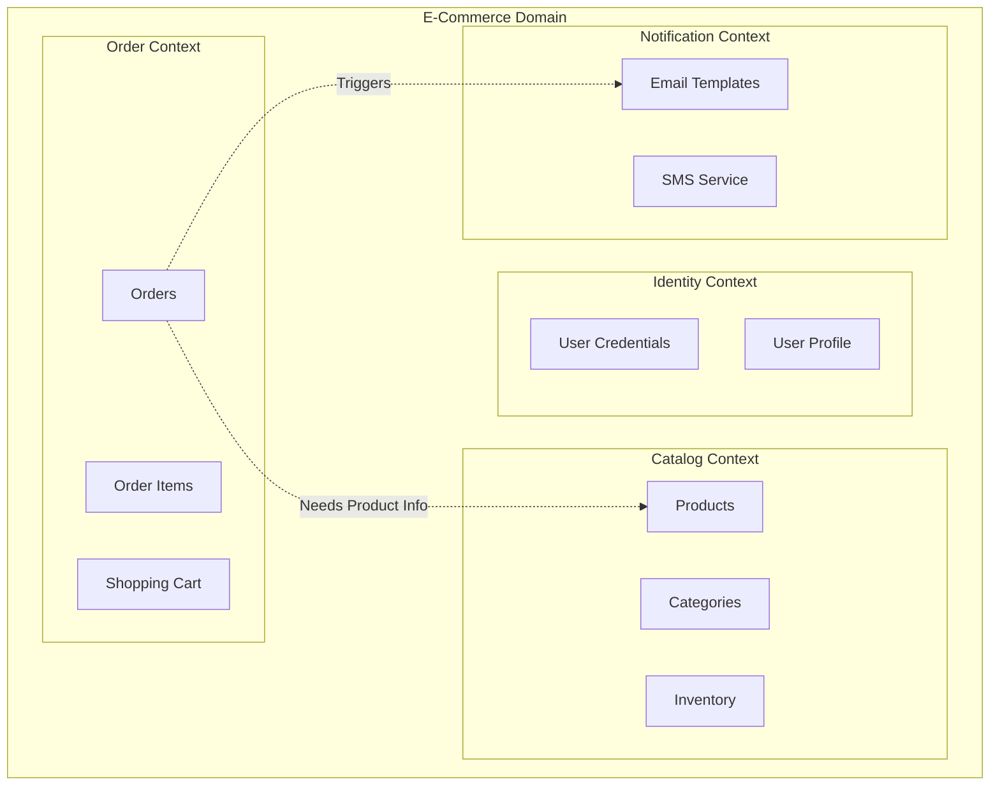
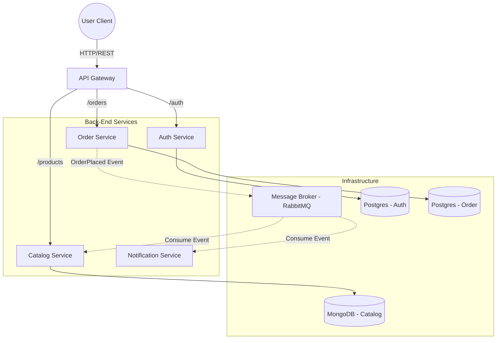
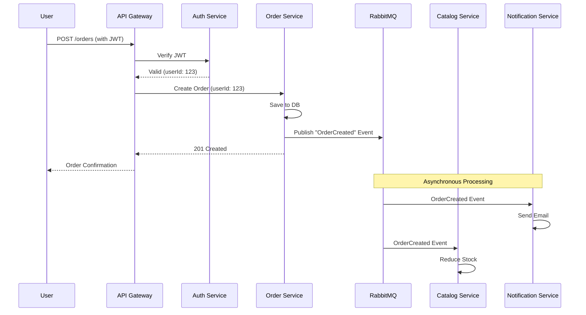
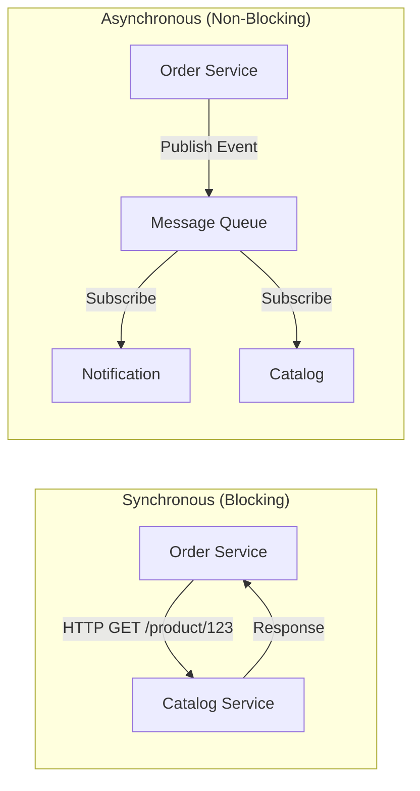

# Node.js Microservices: From Scratch to Production
## Part 1: Introduction, Architecture & Design

Welcome to the ultimate guide on building scalable, robust, and production-ready microservices using Node.js. In this series, we won't just talk theory; we will build a full-fledged **E-Commerce System** from scratch.

### 1. The Paradigm Shift: Monolith vs. Microservices

Before writing code, we must understand *why* we are doing this.

**Monolithic Architecture**
- **Single Unit**: All modules (Auth, Products, Orders) run in a single process.
- **Shared Database**: Often uses a huge central database.
- **Pros**: Easy to develop initially, simple deployment, easy debugging.
- **Cons**: Hard to scale specific parts, technology lock-in, a single bug can crash the entire app, large codebase becomes unmanageable ("Spaghetti Code").

**Microservices Architecture**
- **Distributed System**: Application is split into small, independent services.
- **Decentralized Data**: Each service has its own database (Database-per-Service pattern).
- **Communication**: Services talk via APIs (REST/gRPC) or Messaging (RabbitMQ/Kafka).
- **Pros**: Independent scaling, technology freedom (Polyglot), fault isolation, smaller teams.
- **Cons**: Complexity (distributed systems fallacies), data consistency (Eventual Consistency), operational overhead (DevOps).

#### 1.1 Visual Comparison



#### 1.2 When NOT to Use Microservices

> [!CAUTION]
> Microservices are NOT a silver bullet. Here's when you should avoid them:

**Don't use microservices if:**
- Your team has fewer than 5-10 developers
- You're building an MVP or startup (start with a well-structured monolith)
- You don't have strong DevOps capabilities (CI/CD, monitoring, automation)
- Your application domain is simple and unlikely to scale independently
- You can't afford the operational overhead (multiple deployments, distributed debugging)

**Use a Modular Monolith instead:**
A well-architected monolith with clear module boundaries can give you 80% of the benefits without the complexity. You can always extract services later when you have proven need.

#### 1.3 Decision Flowchart



---

### 2. Domain-Driven Design (DDD) Fundamentals

Before diving into our project, let's understand **Domain-Driven Design** - the philosophy that guides microservice boundaries.

#### 2.1 Core Concepts

**Bounded Context**: A boundary within which a particular model is defined and applicable.
- Example: "Customer" in `Order Service` (has shipping address) vs. "Customer" in `Auth Service` (has credentials)
- Each microservice should represent one bounded context

**Aggregate**: A cluster of domain objects that can be treated as a single unit.
- Example: `Order` aggregate includes `OrderItems`, `ShippingAddress`
- The `Order` is the aggregate root; you can't modify `OrderItems` without going through `Order`

**Ubiquitous Language**: Terms used by both developers and domain experts.
- Instead of "Create User Record", use "Register Customer"

#### 2.2 Identifying Service Boundaries



**Rule of Thumb**: If two concepts need to change together frequently, they belong in the same service. If they change independently, separate them.

---

### 3. The Project: "ShopMicro" E-Commerce System

We will build a system with the following independent services:

| Service | Responsibility | Database | Tech Stack |
| :--- | :--- | :--- | :--- |
| **Auth Service** | User Registration, Login, JWT Management | PostgreSQL | Node, Express, TypeORM |
| **Catalog Service** | Manage Products, Categories, Stock | MongoDB | Node, Express, Mongoose |
| **Order Service** | Place Orders, Manage Cart, Payment Stub | PostgreSQL | Node, Express, Prisma |
| **Notification Service** | Send Emails/SMS asynchronously | Redis (Queue) | Node, BullMQ |
| **API Gateway** | Entry point, routing, rate limiting | - | Node, Http-Proxy |

#### 2.1 High-Level Architecture Diagram



> **Note:** Notice how `Order Service` does not directly talk to `Notification Service`. We use **RabbitMQ** for asynchronous decoupling. When an order is placed, an event is published. The Notification service listens and sends an email. The Catalog service also listens to update inventory.

#### 3.2 Request Flow - Sequence Diagram

Let's visualize what happens when a user places an order:



This diagram shows both **synchronous** (solid arrows) and **asynchronous** (message queue) communication patterns.

---

### 4. Key Concepts & Patterns We Will Implement

1.  **Database-per-Service**: No sharing of tables! Auth service cannot read Order tables directly.
2.  **API Gateway**: A single entry point that reverse-proxies requests to internal services. Clients don't know about `localhost:4001` or `localhost:4002`.
3.  **Synchronous vs Asynchronous Communication**:
    -   *Sync*: Catalog service queries Auth service? (Avoid if possible, creates coupling).
    -   *Async*: Order service *tells* the world "Order 123 Created" via RabbitMQ.
4.  **Distributed Transactions (Saga Pattern)**: How to rollback if Payment succeeds but Inventory fails? We will touch on this.
5.  **Infrastructure as Code**: We will use `docker-compose` to run everything locally.

### 5. Technical Prerequisites

Ensure you have the following installed before proceeding to Part 2:
-   **Node.js** (v18 or v20+)
-   **Docker Desktop** (Essential for running Databases and RabbitMQ easily)
-   **VS Code**
-   **Postman** (for API testing)

### 6. Directory Structure Strategy

We will use a **Monorepo**-like folder structure for simplicity in this guide, but treat each folder as a separate project.

```text
/microservices-ecommerce
  /api-gateway      # Port 8000
  /auth-service     # Port 4001
  /catalog-service  # Port 4002
  /order-service    # Port 4003
  /notification-service # Worker
  docker-compose.yml
```

### 7. Communication Patterns Deep Dive

#### 7.1 Synchronous Communication (REST/HTTP)
**Use when:** You need an immediate response (e.g., checking if product exists before ordering).
**Drawback:** Creates tight coupling - if Catalog crashes, Order fails.

#### 7.2 Asynchronous Communication (Event-Driven)
**Use when:** The operation can happen later (e.g., sending notification email).
**Benefit:** Decoupling - if Notification is down, Order still succeeds.



---
**[Next: Part 2 - Setting Up the Monorepo, Docker & The User Service](./02-Project-Setup-and-User-Service.md)**
