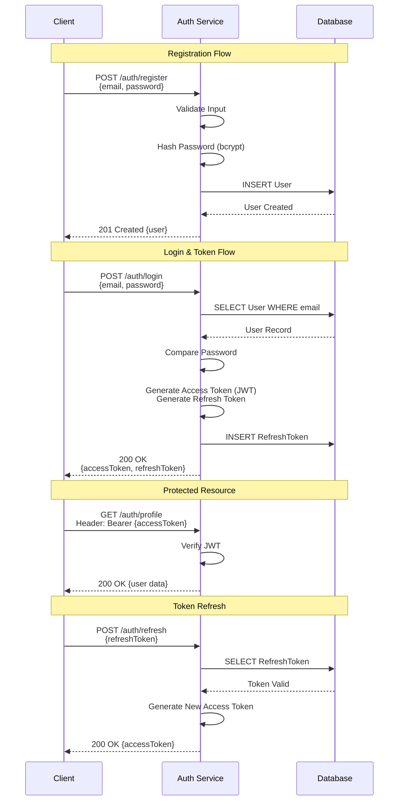
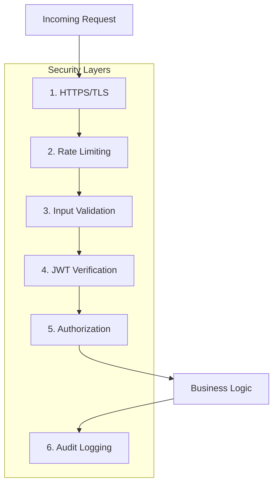

# Node.js Microservices: From Scratch to Production
## Part 3: Authentication & Security Strategy

In this part, we implement the core logic for the **Auth Service**: User Registration, Login, and JWT issuance. We will also create a middleware to secure other services.

### 1. Dependencies

We need `bcryptjs` for hashing passwords and `jsonwebtoken` for tokens.
Enter `auth-service` directory:
```bash
npm install bcryptjs jsonwebtoken
npm install -D @types/bcryptjs @types/jsonwebtoken
```

### 2. Enhanced Prisma Schema with Refresh Tokens

Update `prisma/schema.prisma` to support refresh tokens:
```prisma
model User {
  id            Int            @id @default(autoincrement())
  email         String         @unique
  password      String
  name          String?
  createdAt     DateTime       @default(now())
  refreshTokens RefreshToken[]
}

model RefreshToken {
  id        Int      @id @default(autoincrement())
  token     String   @unique
  userId    Int
  user      User     @relation(fields: [userId], references: [id], onDelete: Cascade)
  expiresAt DateTime
  createdAt DateTime @default(now())
}
```

Run migration:
```bash
npx prisma migrate dev --name add_refresh_tokens
```

### 3. Input Validation Schemas

Create `src/validators/authSchemas.ts`:
```typescript
import Joi from 'joi';

export const registerSchema = Joi.object({
    email: Joi.string().email().required(),
    password: Joi.string().min(8).pattern(/^(?=.*[a-z])(?=.*[A-Z])(?=.*\d)/).required()
        .messages({
            'string.pattern.base': 'Password must contain uppercase, lowercase, and number'
        }),
    name: Joi.string().min(2).max(50).optional()
});

export const loginSchema = Joi.object({
    email: Joi.string().email().required(),
    password: Joi.string().required()
});
```

### 4. Service Layer with Refresh Tokens

Create `src/services/authService.ts`:
```typescript
import { prisma } from '../config/database';
import bcrypt from 'bcryptjs';
import jwt from 'jsonwebtoken';
import { AppError } from '../middleware/errorHandler';
import crypto from 'crypto';

interface TokenPayload {
    userId: number;
    email: string;
}

export const register = async (email: string, password: string, name?: string) => {
    const existingUser = await prisma.user.findUnique({ where: { email } });
    if (existingUser) {
        throw new AppError('User already exists', 409);
    }

    const hashedPassword = await bcrypt.hash(password, 12);

    const user = await prisma.user.create({
        data: { email, password: hashedPassword, name },
        select: { id: true, email: true, name: true }
    });

    return user;
};

export const login = async (email: string, password: string) => {
    const user = await prisma.user.findUnique({ where: { email } });
    
    if (!user || !(await bcrypt.compare(password, user.password))) {
        throw new AppError('Invalid credentials', 401);
    }

    const accessToken = generateAccessToken({ userId: user.id, email: user.email });
    const refreshToken = await generateRefreshToken(user.id);

    return { 
        accessToken, 
        refreshToken,
        user: { id: user.id, email: user.email, name: user.name } 
    };
};

export const refreshAccessToken = async (refreshToken: string) => {
    const storedToken = await prisma.refreshToken.findUnique({
        where: { token: refreshToken },
        include: { user: true }
    });

    if (!storedToken || storedToken.expiresAt < new Date()) {
        throw new AppError('Invalid or expired refresh token', 401);
    }

    const accessToken = generateAccessToken({
        userId: storedToken.user.id,
        email: storedToken.user.email
    });

    return { accessToken };
};

export const logout = async (refreshToken: string) => {
    await prisma.refreshToken.delete({ where: { token: refreshToken } });
};

function generateAccessToken(payload: TokenPayload): string {
    return jwt.sign(payload, process.env.JWT_SECRET as string, { 
        expiresIn: process.env.JWT_EXPIRES_IN || '15m' 
    });
}

async function generateRefreshToken(userId: number): Promise<string> {
    const token = crypto.randomBytes(40).toString('hex');
    const expiresAt = new Date();
    expiresAt.setDate(expiresAt.getDate() + 7); // 7 days

    await prisma.refreshToken.create({
        data: { token, userId, expiresAt }
    });

    return token;
}
```

### 5. Controller with AsyncHandler

Create `src/controllers/authController.ts`:
```typescript
import { Request, Response, NextFunction } from 'express';
import * as authService from '../services/authService';
import { AuthRequest } from '../middleware/authMiddleware';

// Async error wrapper
const asyncHandler = (fn: Function) => (req: Request, res: Response, next: NextFunction) => {
    Promise.resolve(fn(req, res, next)).catch(next);
};

export const register = asyncHandler(async (req: Request, res: Response) => {
    const { email, password, name } = req.body;
    const user = await authService.register(email, password, name);
    
    res.status(201).json({
        success: true,
        message: 'User registered successfully',
        data: user
    });
});

export const login = asyncHandler(async (req: Request, res: Response) => {
    const { email, password } = req.body;
    const data = await authService.login(email, password);
    
    res.json({
        success: true,
        data
    });
});

export const refresh = asyncHandler(async (req: Request, res: Response) => {
    const { refreshToken } = req.body;
    const data = await authService.refreshAccessToken(refreshToken);
    
    res.json({
        success: true,
        data
    });
});

export const logout = asyncHandler(async (req: Request, res: Response) => {
    const { refreshToken } = req.body;
    await authService.logout(refreshToken);
    
    res.json({
        success: true,
        message: 'Logged out successfully'
    });
});

export const getProfile = asyncHandler(async (req: AuthRequest, res: Response) => {
    res.json({
        success: true,
        data: req.user
    });
});
```

### 6. Routes with Validation & Rate Limiting

Update `src/routes/authRoutes.ts`:
```typescript
import { Router } from 'express';
import { register, login, refresh, logout, getProfile } from '../controllers/authController';
import { validate } from '../middleware/validator';
import { registerSchema, loginSchema } from '../validators/authSchemas';
import { authenticateToken } from '../middleware/authMiddleware';
import rateLimit from 'express-rate-limit';

const router = Router();

// Rate limiter for auth routes
const authLimiter = rateLimit({
    windowMs: 15 * 60 * 1000, // 15 minutes
    max: 5, // 5 requests per window
    message: 'Too many attempts, please try again later'
});

router.post('/register', validate(registerSchema), register);
router.post('/login', authLimiter, validate(loginSchema), login);
router.post('/refresh', refresh);
router.post('/logout', logout);

// Protected route example
router.get('/profile', authenticateToken, getProfile);

export default router;
```

Now you can test with Postman:
- POST `http://localhost:4001/auth/register`
- POST `http://localhost:4001/auth/login` (Returns JWT)

### 7. Enhanced Auth Middleware

Update `src/middleware/authMiddleware.ts`:

```typescript
import { Request, Response, NextFunction } from 'express';
import jwt from 'jsonwebtoken';
import { AppError } from './errorHandler';

export interface AuthRequest extends Request {
    user?: {
        userId: number;
        email: string;
        iat: number;
        exp: number;
    };
}

export const authenticateToken = (req: AuthRequest, res: Response, next: NextFunction) => {
    try {
        const authHeader = req.headers['authorization'];
        const token = authHeader?.split(' ')[1]; // Bearer TOKEN

        if (!token) {
            throw new AppError('No token provided', 401);
        }

        const decoded = jwt.verify(token, process.env.JWT_SECRET as string);
        req.user = decoded as AuthRequest['user'];
        next();
    } catch (error) {
        if (error instanceof jwt.TokenExpiredError) {
            next(new AppError('Token expired', 401));
        } else if (error instanceof jwt.JsonWebTokenError) {
            next(new AppError('Invalid token', 401));
        } else {
            next(error);
        }
    }
};

// Optional role-based middleware
export const authorize = (...roles: string[]) => {
    return (req: AuthRequest, res: Response, next: NextFunction) => {
        if (!req.user) {
            return next(new AppError('Unauthorized', 401));
        }
        
        // Assume user object has roles (you'd need to add this to your schema)
        // if (!roles.includes(req.user.role)) {
        //     return next(new AppError('Forbidden', 403));
        // }
        
        next();
    };
};
```

### 8. Authentication Flow Diagram



### 9. Security Best Practices

> [!WARNING]
> **Production Security Checklist**

- **Password Policy**: Minimum 8 characters, complexity requirements
- **Rate Limiting**: Prevent brute-force attacks (implemented above)
- **HTTPS Only**: Never transmit tokens over HTTP
- **Token Expiry**: Short-lived access tokens (15min), longer refresh tokens (7 days)
- **Secure Storage**: Store refresh tokens in httpOnly cookies (not localStorage)
- **Token Rotation**: Rotate refresh tokens on use
- **Account Lockout**: Lock after N failed attempts
- **2FA**: Consider adding two-factor authentication for critical apps

#### 9.1 Security Layers Diagram



> **Important**: All services must share the same `JWT_SECRET` to validate tokens issued by the Auth Service.

---
**[Next: Part 4 - Product Service, Order Service & Asynchronous Communication](./04-Inter-Service-Communication.md)**
