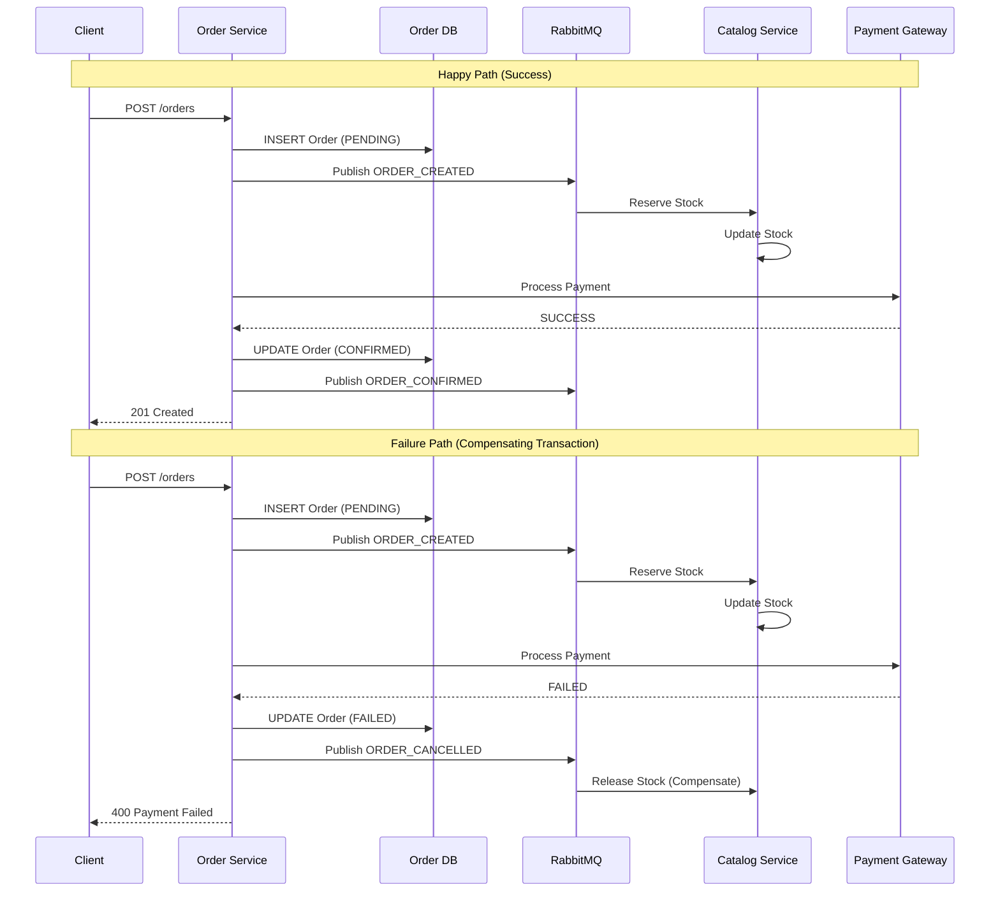

# Node.js Microservices: From Scratch to Production
## Part 4: Inter-Service Communication & Distributed Patterns

We have our Auth Service. Now we need a **Catalog Service** (Products) and an **Order Service**. The challenge: When an order is placed, we need to notify the user and update stock. We will use **RabbitMQ** for this, and implement advanced patterns like **Saga** and **Circuit Breaker**.

### 1. Complete Catalog Service (MongoDB)

We use MongoDB here to demonstrate polyglot persistence.

#### 1.1 Setup
```bash
cd catalog-service
npm init -y
npm install express mongoose amqplib dotenv cors helmet winston
npm install -D typescript ts-node @types/express @types/mongoose @types/amqplib nodemon
npx tsc --init
```

#### 1.2 Product Schema
Create `src/models/Product.ts`:
```typescript
import mongoose from 'mongoose';

const ProductSchema = new mongoose.Schema({
    name: { type: String, required: true, index: true },
    description: String,
    price: { type: Number, required: true, min: 0 },
    stock: { type: Number, required: true, min: 0, default: 0 },
    category: String,
    createdAt: { type: Date, default: Date.now },
    updatedAt: { type: Date, default: Date.now }
});

export default mongoose.model('Product', ProductSchema);
```

#### 1.3 Catalog Service Implementation
Create `src/services/productService.ts`:
```typescript
import Product from '../models/Product';
import { AppError } from '../middleware/errorHandler';

export const getAllProducts = async (filters: any) => {
    const { category, minPrice, maxPrice, page = 1, limit = 10 } = filters;
    
    const query: any = {};
    if (category) query.category = category;
    if (minPrice || maxPrice) {
        query.price = {};
        if (minPrice) query.price.$gte = Number(minPrice);
        if (maxPrice) query.price.$lte = Number(maxPrice);
    }
    
    const products = await Product.find(query)
        .limit(limit * 1)
        .skip((page - 1) * limit)
        .sort({ createdAt: -1 });
    
    const count = await Product.countDocuments(query);
    
    return {
        products,
        totalPages: Math.ceil(count / limit),
        currentPage: page
    };
};

export const reserveStock = async (productId: string, quantity: number) => {
    const product = await Product.findById(productId);
    
    if (!product) {
        throw new AppError('Product not found', 404);
    }
    
    if (product.stock < quantity) {
        throw new AppError('Insufficient stock', 400);
    }
    
    product.stock -= quantity;
    await product.save();
    
    return product;
};

export const releaseStock = async (productId: string, quantity: number) => {
    await Product.findByIdAndUpdate(productId, { $inc: { stock: quantity } });
};
```

#### 1.4 Event Consumer for Stock Updates
Create `src/consumers/stockConsumer.ts`:
```typescript
import amqp from 'amqplib';
import { reserveStock, releaseStock } from '../services/productService';
import { logger } from '../utils/logger';

export const startStockConsumer = async () => {
    const connection = await amqp.connect(process.env.RABBITMQ_URL || 'amqp://localhost');
    const channel = await connection.createChannel();
    
    await channel.assertQueue('ORDER_CREATED');
    await channel.assertQueue('ORDER_CANCELLED');
    
    channel.consume('ORDER_CREATED', async (msg) => {
        if (msg) {
            try {
                const order = JSON.parse(msg.content.toString());
                logger.info(`Processing ORDER_CREATED: ${order.id}`);
                
                for (const item of order.items) {
                    await reserveStock(item.productId, item.quantity);
                }
                
                channel.ack(msg);
            } catch (error: any) {
                logger.error(`Stock reservation failed: ${error.message}`);
                channel.nack(msg, false, false); // Dead letter queue
            }
        }
    });
    
    channel.consume('ORDER_CANCELLED', async (msg) => {
        if (msg) {
            const order = JSON.parse(msg.content.toString());
            for (const item of order.items) {
                await releaseStock(item.productId, item.quantity);
            }
            channel.ack(msg);
        }
    });
    
    logger.info('Stock consumer started');
};
```

---

### 2. Complete Order Service with Saga Pattern

#### 2.1 Prisma  Schema for Orders
```prisma
model Order {
  id         Int         @id @default(autoincrement())
  userId     Int
  total      Float
  status     OrderStatus @default(PENDING)
  items      OrderItem[]
  createdAt  DateTime    @default(now())
  updatedAt  DateTime    @updatedAt
}

model OrderItem {
  id        Int    @id @default(autoincrement())
  orderId   Int
  order     Order  @relation(fields: [orderId], references: [id])
  productId String
  quantity  Int
  price     Float
}

enum OrderStatus {
  PENDING
  CONFIRMED
  FAILED
  CANCELLED
}
```

#### 2.2 Saga Pattern Implementation
Create `src/services/orderSaga.ts`:
```typescript
import { prisma } from '../config/database';
import { publishMessage } from '../utils/messageBroker';
import { logger } from '../utils/logger';
import axios from 'axios';

interface OrderInput {
    userId: number;
    items: Array<{ productId: string; quantity: number }>;
}

export const createOrderSaga = async (input: OrderInput) => {
    let order: any = null;
    
    try {
        // Step 1: Create Order (Pending)
        const itemsWithPrice = await Promise.all(
            input.items.map(async (item) => {
                const res = await axios.get(`http://localhost:4002/products/${item.productId}`);
                return { ...item, price: res.data.price };
            })
        );
        
        const total = itemsWithPrice.reduce((sum, item) => sum + (item.price * item.quantity), 0);
        
        order = await prisma.order.create({
            data: {
                userId: input.userId,
                total,
                status: 'PENDING',
                items: {
                    create: itemsWithPrice.map(item => ({
                        productId: item.productId,
                        quantity: item.quantity,
                        price: item.price
                    }))
                }
            },
            include: { items: true }
        });
        
        logger.info(`Order ${order.id} created, starting saga`);
        
        // Step 2: Publish Event to Reserve Stock
        await publishMessage('ORDER_CREATED', {
            id: order.id,
            userId: order.userId,
            items: order.items
        });
        
        // Step 3: Simulate Payment
        const paymentSuccess = await processPayment(order.id, order.total);
        
        if (!paymentSuccess) {
            throw new Error('Payment failed');
        }
        
        // Step 4: Confirm Order
        await prisma.order.update({
            where: { id: order.id },
            data: { status: 'CONFIRMED' }
        });
        
        // Step 5: Notify user
        await publishMessage('ORDER_CONFIRMED', {
            orderId: order.id,
            userId: order.userId
        });
        
        return order;
        
    } catch (error: any) {
        logger.error(`Order Saga Failed: ${error.message}`);
        
        // COMPENSATING TRANSACTION
        if (order) {
            await prisma.order.update({
                where: { id: order.id },
                data: { status: 'FAILED' }
            });
            
            // Publish event to release reserved stock
            await publishMessage('ORDER_CANCELLED', {
                id: order.id,
                items: order.items
            });
        }
        
        throw error;
    }
};

async function processPayment(orderId: number, amount: number): Promise<boolean> {
    // Simulate payment gateway call
    logger.info(`Processing payment for order ${orderId}: $${amount}`);
    return Math.random() > 0.1; // 90% success rate
}
```

#### 2.3 Saga Flow Diagram



---

### 3. Circuit Breaker Pattern

When Order Service calls Catalog Service synchronously, we need to handle failures gracefully.

#### 3.1 Install Dependencies
```bash
npm install opossum
npm install -D @types/opossum
```

#### 3.2 Circuit Breaker Implementation
Create `src/utils/circuitBreaker.ts`:
```typescript
import CircuitBreaker from 'opossum';
import axios, { AxiosRequestConfig } from 'axios';
import { logger } from './logger';

const options = {
    timeout: 3000, // If function takes longer than 3s, trigger a failure
    errorThresholdPercentage: 50, // When 50% of requests fail, open the circuit
    resetTimeout: 30000 // After 30s, try again
};

const httpCall = async (config: AxiosRequestConfig) => {
    const response = await axios(config);
    return response.data;
};

export const catalogServiceBreaker = new CircuitBreaker(httpCall, options);

catalogServiceBreaker.on('open', () => {
    logger.warn('Circuit breaker OPEN - Catalog service is down');
});

catalogServiceBreaker.on('halfOpen', () => {
    logger.info('Circuit breaker HALF_OPEN - Testing catalog service');
});

catalogServiceBreaker.on('close', () => {
    logger.info('Circuit breaker CLOSED - Catalog service is healthy');
});

// Usage:
export const getProductWithBreaker = async (productId: string) => {
    try {
        return await catalogServiceBreaker.fire({
            method: 'GET',
            url: `http://localhost:4002/products/${productId}`
        });
    } catch (error) {
        logger.error('Catalog service unavailable, using fallback');
        // Return cached data or default
        return { id: productId, name: 'Product Unavailable', price: 0 };
    }
};
```

### 4. Advanced RabbitMQ Patterns

#### 4.1 Retry Mechanism with Dead Letter Exchange
Create `src/utils/messageBroker.ts`:
```typescript
import amqp, { Channel, Connection } from 'amqplib';
import { logger } from './logger';

let connection: Connection;
let channel: Channel;

export const connectRabbitMQ = async () => {
    connection = await amqp.connect(process.env.RABBITMQ_URL || 'amqp://localhost');
    channel = await connection.createChannel();
    
    // Dead Letter Exchange for failed messages
    await channel.assertExchange('dlx', 'direct', { durable: true });
    await channel.assertQueue('failed_messages', { durable: true });
    await channel.bindQueue('failed_messages', 'dlx', 'failed');
    
    // Main queue with DLX
    await channel.assertQueue('ORDER_CREATED', {
        durable: true,
        arguments: {
            'x-dead-letter-exchange': 'dlx',
            'x-dead-letter-routing-key': 'failed'
        }
    });
    
    logger.info('RabbitMQ connected with DLX');
};

export const publishMessage = async (queue: string, message: any) => {
    if (!channel) {
        throw new Error('RabbitMQ not connected');
    }
    
    channel.sendToQueue(queue, Buffer.from(JSON.stringify(message)), {
        persistent: true
    });
    
    logger.info(`Message published to ${queue}`);
};

export const getChannel = () => channel;
```

---

> [!NOTE]
> **Saga vs Two-Phase Commit (2PC)**:
> - **Saga**: Each step is a separate transaction. If failure, run compensating transactions.
> - **2PC**: All services participate in a distributed transaction (avoid in microservices due to tight coupling).

**[Next: Part 5 - API Gateway & Service Discovery](./05-API-Gateway-and-Data-Management.md)**
