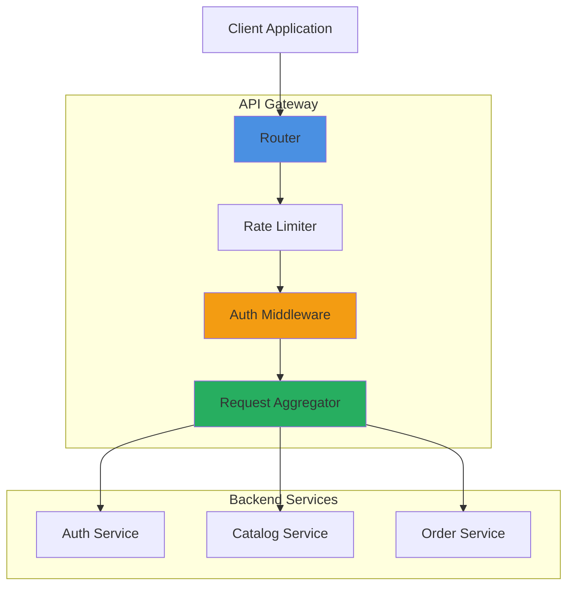

# Node.js Microservices: From Scratch to Production
## Part 5: API Gateway, Service Discovery & Advanced Patterns

The **API Gateway** is the single entry point for all client requests. It separates the internal architecture from the external API and provides a centralized place for cross-cutting concerns.

### 1. Why a Gateway?

Without a Gateway:
- Client needs to know: `auth.com`, `products.com`, `orders.com`
- Cross-Cutting Concerns (Auth, Rate Limiting, Logging) must be implemented in *every* service
- No unified error handling or response format

With a Gateway:
- Client only knows: `api.myshop.com`
- Gateway handles Auth, Logging, Rate Limiting centrally
- Simplifies client implementation

### 2. Building the API Gateway

#### 2.1 Setup
```bash
cd api-gateway
npm init -y
npm install express http-proxy-middleware cors helmet morgan express-rate-limit dotenv
npm install jsonwebtoken axios consul
npm install -D typescript @types/express @types/node nodemon
npx tsc --init
```

#### 2.2 Complete Gateway Implementation

Create `src/index.ts`:
```typescript
import express from 'express';
import { createProxyMiddleware, fixRequestBody } from 'http-proxy-middleware';
import cors from 'cors';
import helmet from 'helmet';
import morgan from 'morgan';
import rateLimit from 'express-rate-limit';
import { authenticateGateway } from './middleware/authMiddleware';
import { errorHandler } from './middleware/errorHandler';
import { logger } from './utils/logger';
import { getServiceUrl } from './utils/serviceDiscovery';

const app = express();
const PORT = process.env.PORT || 8000;

// Security & Logging Middleware
app.use(helmet());
app.use(cors({
    origin: process.env.ALLOWED_ORIGINS?.split(',') || ['http://localhost:3000'],
    credentials: true
}));
app.use(morgan('combined'));
app.use(express.json());

// Global Rate Limiter
const limiter = rateLimit({
    windowMs: 15 * 60 * 1000,
    max: 100,
    message: 'Too many requests from this IP'
});
app.use(limiter);

// Service Routes Configuration
const services = {
    auth: { 
        target: process.env.AUTH_SERVICE_URL || 'http://localhost:4001',
        protected: false 
    },
    catalog: { 
        target: process.env.CATALOG_SERVICE_URL || 'http://localhost:4002',
        protected: false 
    },
    orders: { 
        target: process.env.ORDER_SERVICE_URL || 'http://localhost:4003',
        protected: true // Requires authentication
    }
};

// Auth endpoints (public)
app.use('/api/auth', createProxyMiddleware({
    target: services.auth.target,
    changeOrigin: true,
    pathRewrite: { '^/api/auth': '/auth' },
    onProxyReq: fixRequestBody
}));

// Products endpoints (public read, protected write)
app.get('/api/products*', createProxyMiddleware({
    target: services.catalog.target,
    changeOrigin: true,
    pathRewrite: { '^/api/products': '/products' }
}));

app.use('/api/products', authenticateGateway, createProxyMiddleware({
    target: services.catalog.target,
    changeOrigin: true,
    pathRewrite: { '^/api/products': '/products' },
    onProxyReq: (proxyReq, req: any) => {
        // Forward user info from JWT
        if (req.user) {
            proxyReq.setHeader('X-User-Id', req.user.userId);
            proxyReq.setHeader('X-User-Email', req.user.email);
        }
    }
}));

// Orders endpoints (all protected)
app.use('/api/orders', authenticateGateway, createProxyMiddleware({
    target: services.orders.target,
    changeOrigin: true,
    pathRewrite: { '^/api/orders': '/orders' },
    onProxyReq: (proxyReq, req: any) => {
        proxyReq.setHeader('X-User-Id', req.user.userId);
        proxyReq.setHeader('X-User-Email', req.user.email);
    }
}));

// Request Aggregation Example: Get User Dashboard Data
app.get('/api/dashboard', authenticateGateway, async (req: any, res, next) => {
    try {
        const userId = req.user.userId;
        
        // Parallel requests to multiple services
        const [userProfile, userOrders, recommendations] = await Promise.all([
            fetch(`${services.auth.target}/auth/profile`, {
                headers: { 'Authorization': req.headers.authorization || '' }
            }).then(r => r.json()),
            
            fetch(`${services.orders.target}/orders?userId=${userId}`).then(r => r.json()),
            
            fetch(`${services.catalog.target}/products/recommended`).then(r => r.json())
        ]);
        
        res.json({
            profile: userProfile,
            orders: userOrders,
            recommendations
        });
    } catch (error) {
        next(error);
    }
});

// Health Check
app.get('/health', (req, res) => {
    res.json({ status: 'ok', service: 'API Gateway', timestamp: new Date().toISOString() });
});

// 404 Handler
app.use((req, res) => {
    res.status(404).json({ error: 'Route not found' });
});

// Error Handler
app.use(errorHandler);

app.listen(PORT, () => {
    logger.info(`API Gateway running on port ${PORT}`);
});
```

#### 2.3 Gateway Authentication Middleware

Create `src/middleware/authMiddleware.ts`:
```typescript
import { Request, Response, NextFunction } from 'express';
import jwt from 'jsonwebtoken';

export interface AuthenticatedRequest extends Request {
    user?: {
        userId: number;
        email: string;
    };
}

export const authenticateGateway = (req: AuthenticatedRequest, res: Response, next: NextFunction) => {
    try {
        const token = req.headers.authorization?.split(' ')[1];
        
        if (!token) {
            return res.status(401).json({ error: 'No token provided' });
        }
        
        const decoded = jwt.verify(token, process.env.JWT_SECRET as string) as any;
        req.user = { userId: decoded.userId, email: decoded.email };
        next();
    } catch (error) {
        res.status(401).json({ error: 'Invalid or expired token' });
    }
};
```

### 3. Service Discovery with Consul

Instead of hardcoding service URLs, use **Consul** for dynamic service discovery.

#### 3.1 Setup Consul (Docker)
Add to `docker-compose.yml`:
```yaml
consul:
  image: consul:latest
  container_name: consul
  ports:
    - "8500:8500"
    - "8600:8600/udp"
  command: agent -server -ui -bootstrap-expect=1 -client=0.0.0.0
```

#### 3.2 Service Registration

Each service should register with Consul on startup.

Create `src/utils/serviceDiscovery.ts` (add to each service):
```typescript
import Consul from 'consul';

const consul = new Consul({ host: 'localhost', port: 8500 });

export const registerService = async (serviceName: string, port: number) => {
    await consul.agent.service.register({
        name: serviceName,
        address: 'localhost',
        port,
        check: {
            http: `http://localhost:${port}/health`,
            interval: '10s'
        }
    });
    
    console.log(`${serviceName} registered with Consul`);
};

export const getServiceUrl = async (serviceName: string): Promise<string> => {
    const result = await consul.health.service({ service: serviceName, passing: true });
    
    if (result.length === 0) {
        throw new Error(`No healthy instances of ${serviceName}`);
    }
    
    const service = result[0].Service;
    return `http://${service.Address}:${service.Port}`;
};
```

### 4. Gateway Patterns Diagram



### 5. API Versioning

Support multiple API versions simultaneously:

```typescript
// v1 routes
app.use('/api/v1/products', createProxyMiddleware({
    target: 'http://localhost:4002',
    pathRewrite: { '^/api/v1/products': '/v1/products' }
}));

// v2 routes (new version with breaking changes)
app.use('/api/v2/products', createProxyMiddleware({
    target: 'http://localhost:4002',
    pathRewrite: { '^/api/v2/products': '/v2/products' }
}));
```

### 6. Caching Layer

Add Redis caching to the gateway:

```typescript
import Redis from 'ioredis';

const redis = new Redis();

app.get('/api/products/:id', async (req, res, next) => {
    const cached = await redis.get(`product:${req.params.id}`);
    
    if (cached) {
        return res.json(JSON.parse(cached));
    }
    
    // Proxy to catalog service
    next();
});
```

---
**[Next: Part 6 - Production Deployment & Observability](./06-Deployment-and-Monitoring.md)**
