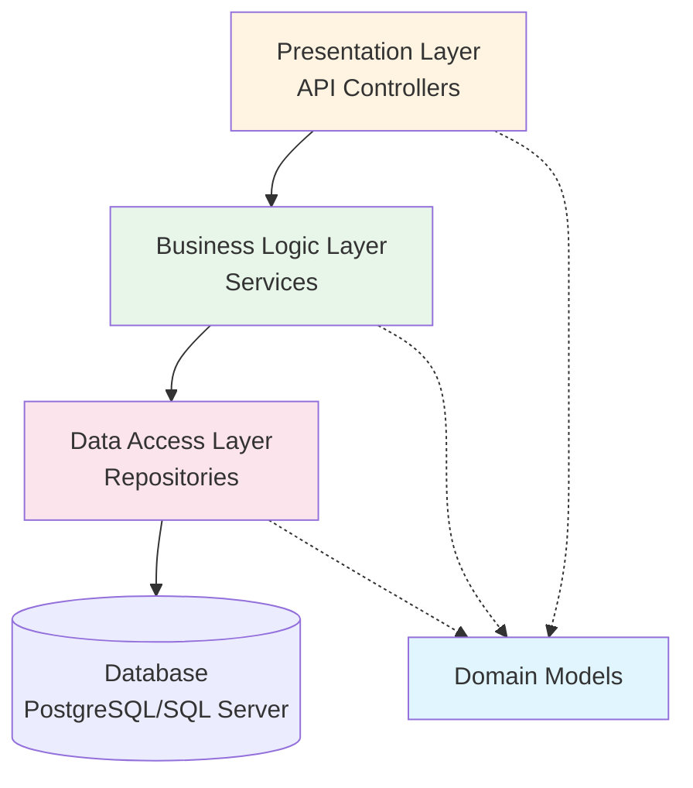
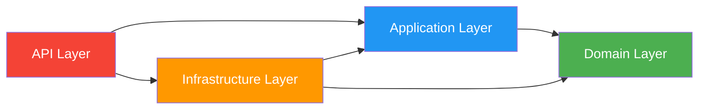

# Building Scalable & Maintainable ASP.NET APIs - Part 1
## Introduction, Architecture & Project Structure

> **Production Example**: E-Commerce Order Management API
> 
> Throughout this guide, we'll build a real-world **Order Management API** that demonstrates enterprise-grade patterns and practices.

---

## Table of Contents
1. [Introduction](#introduction)
2. [Why ASP.NET for APIs?](#why-aspnet-for-apis)
3. [Architecture Patterns](#architecture-patterns)
4. [Project Structure](#project-structure)
5. [Setting Up the Solution](#setting-up-the-solution)

---

## Introduction

Building scalable and maintainable APIs requires more than just creating endpoints. This guide covers:

- **Clean Architecture** principles
- **SOLID** design principles
- **Repository & Unit of Work** patterns
- **Dependency Injection**
- **Authentication & Authorization**
- **Logging, Caching & Error Handling**
- **Performance optimization**
- **Testing strategies**
- **Production deployment**

---

## Why ASP.NET for APIs?

### Key Advantages

| Feature | Benefit |
|---------|---------|
| **High Performance** | Kestrel web server, async/await, minimal overhead |
| **Cross-Platform** | Runs on Windows, Linux, macOS |
| **Built-in DI** | First-class dependency injection support |
| **Robust Ecosystem** | Entity Framework, Identity, SignalR, etc. |
| **Type Safety** | C# strong typing reduces runtime errors |
| **Excellent Tooling** | Visual Studio, Rider, VS Code support |

### Performance Benchmarks
ASP.NET Core consistently ranks among the fastest web frameworks:
- **6M+ requests/sec** in TechEmpower benchmarks
- **Low latency** with minimal memory footprint
- **Efficient async I/O** operations

---

## Architecture Patterns

### 1. Clean Architecture (Onion Architecture)

Clean Architecture separates concerns into layers, with dependencies pointing inward.



#### Layer Responsibilities

**1. Domain Layer (Core)**
- Business entities
- Business logic
- Interfaces (contracts)
- No external dependencies

**2. Application Layer**
- Use cases / business rules
- DTOs (Data Transfer Objects)
- Service interfaces
- Validation logic

**3. Infrastructure Layer**
- Data access (EF Core, Dapper)
- External services (email, SMS)
- File storage
- Caching

**4. Presentation Layer (API)**
- Controllers
- API models
- Authentication filters
- Middleware

---

### 2. SOLID Principles in API Design

#### Single Responsibility Principle (SRP)
```csharp
// ❌ BAD: Controller doing too much
public class OrderController
{
    public IActionResult CreateOrder(OrderDto order)
    {
        // Validation
        if (string.IsNullOrEmpty(order.CustomerName)) 
            return BadRequest();
        
        // Business logic
        var total = order.Items.Sum(x => x.Price * x.Quantity);
        
        // Data access
        _context.Orders.Add(order);
        _context.SaveChanges();
        
        // Email notification
        _emailService.Send($"Order {order.Id} created");
        
        return Ok();
    }
}

// ✅ GOOD: Separated concerns
public class OrderController
{
    private readonly IOrderService _orderService;
    
    public OrderController(IOrderService orderService)
    {
        _orderService = orderService;
    }
    
    public async Task<IActionResult> CreateOrder(CreateOrderDto dto)
    {
        var result = await _orderService.CreateOrderAsync(dto);
        return Ok(result);
    }
}
```

#### Dependency Inversion Principle (DIP)
```csharp
// ✅ Depend on abstractions, not concretions
public interface IOrderRepository
{
    Task<Order> GetByIdAsync(int id);
    Task<IEnumerable<Order>> GetAllAsync();
    Task AddAsync(Order order);
}

public class OrderService : IOrderService
{
    private readonly IOrderRepository _repository; // Interface, not concrete class
    
    public OrderService(IOrderRepository repository)
    {
        _repository = repository;
    }
}
```

---

### 3. Repository Pattern

Abstracts data access logic and provides a collection-like interface.

```csharp
// Generic repository interface
public interface IRepository<T> where T : class
{
    Task<T> GetByIdAsync(int id);
    Task<IEnumerable<T>> GetAllAsync();
    Task<IEnumerable<T>> FindAsync(Expression<Func<T, bool>> predicate);
    Task AddAsync(T entity);
    Task UpdateAsync(T entity);
    Task DeleteAsync(T entity);
}

// Specific repository with custom methods
public interface IOrderRepository : IRepository<Order>
{
    Task<IEnumerable<Order>> GetOrdersByCustomerAsync(int customerId);
    Task<Order> GetOrderWithItemsAsync(int orderId);
    Task<decimal> GetTotalRevenueAsync(DateTime startDate, DateTime endDate);
}
```

---

### 4. Unit of Work Pattern

Coordinates multiple repository operations in a single transaction.

```csharp
public interface IUnitOfWork : IDisposable
{
    IOrderRepository Orders { get; }
    ICustomerRepository Customers { get; }
    IProductRepository Products { get; }
    
    Task<int> SaveChangesAsync();
    Task BeginTransactionAsync();
    Task CommitTransactionAsync();
    Task RollbackTransactionAsync();
}

// Usage in service
public class OrderService : IOrderService
{
    private readonly IUnitOfWork _unitOfWork;
    
    public async Task<OrderDto> CreateOrderAsync(CreateOrderDto dto)
    {
        await _unitOfWork.BeginTransactionAsync();
        
        try
        {
            // Multiple operations in one transaction
            var order = new Order { /* ... */ };
            await _unitOfWork.Orders.AddAsync(order);
            
            var customer = await _unitOfWork.Customers.GetByIdAsync(dto.CustomerId);
            customer.LastOrderDate = DateTime.UtcNow;
            
            await _unitOfWork.SaveChangesAsync();
            await _unitOfWork.CommitTransactionAsync();
            
            return MapToDto(order);
        }
        catch
        {
            await _unitOfWork.RollbackTransactionAsync();
            throw;
        }
    }
}
```

---

## Project Structure

### Recommended Solution Structure

```
OrderManagement.API/
├── src/
│   ├── OrderManagement.API/              # Presentation Layer
│   │   ├── Controllers/
│   │   ├── Middleware/
│   │   ├── Filters/
│   │   ├── Extensions/
│   │   ├── Program.cs
│   │   └── appsettings.json
│   │
│   ├── OrderManagement.Application/       # Application Layer
│   │   ├── DTOs/
│   │   ├── Interfaces/
│   │   ├── Services/
│   │   ├── Validators/
│   │   ├── Mappings/
│   │   └── Exceptions/
│   │
│   ├── OrderManagement.Domain/            # Domain Layer
│   │   ├── Entities/
│   │   ├── Enums/
│   │   ├── ValueObjects/
│   │   └── Interfaces/
│   │
│   └── OrderManagement.Infrastructure/    # Infrastructure Layer
│       ├── Data/
│       │   ├── Context/
│       │   ├── Repositories/
│       │   ├── UnitOfWork/
│       │   └── Migrations/
│       ├── Services/
│       │   ├── EmailService/
│       │   ├── CacheService/
│       │   └── FileStorageService/
│       └── Configuration/
│
├── tests/
│   ├── OrderManagement.UnitTests/
│   ├── OrderManagement.IntegrationTests/
│   └── OrderManagement.ApiTests/
│
└── OrderManagement.sln
```

### Layer Dependencies



> **Note**: Domain layer has **zero dependencies**. It's the core of your application.

---

## Setting Up the Solution

### Step 1: Create Solution Structure

```bash
# Create solution
dotnet new sln -n OrderManagement

# Create projects
dotnet new webapi -n OrderManagement.API
dotnet new classlib -n OrderManagement.Application
dotnet new classlib -n OrderManagement.Domain
dotnet new classlib -n OrderManagement.Infrastructure

# Create test projects
dotnet new xunit -n OrderManagement.UnitTests
dotnet new xunit -n OrderManagement.IntegrationTests

# Add projects to solution
dotnet sln add src/OrderManagement.API/OrderManagement.API.csproj
dotnet sln add src/OrderManagement.Application/OrderManagement.Application.csproj
dotnet sln add src/OrderManagement.Domain/OrderManagement.Domain.csproj
dotnet sln add src/OrderManagement.Infrastructure/OrderManagement.Infrastructure.csproj
dotnet sln add tests/OrderManagement.UnitTests/OrderManagement.UnitTests.csproj
dotnet sln add tests/OrderManagement.IntegrationTests/OrderManagement.IntegrationTests.csproj
```

### Step 2: Configure Project References

```bash
# API references
dotnet add src/OrderManagement.API reference src/OrderManagement.Application
dotnet add src/OrderManagement.API reference src/OrderManagement.Infrastructure

# Application references
dotnet add src/OrderManagement.Application reference src/OrderManagement.Domain

# Infrastructure references
dotnet add src/OrderManagement.Infrastructure reference src/OrderManagement.Application
dotnet add src/OrderManagement.Infrastructure reference src/OrderManagement.Domain
```

### Step 3: Install Essential NuGet Packages

**OrderManagement.API**
```xml
<ItemGroup>
  <PackageReference Include="Microsoft.AspNetCore.Authentication.JwtBearer" Version="8.0.0" />
  <PackageReference Include="Swashbuckle.AspNetCore" Version="6.5.0" />
  <PackageReference Include="Serilog.AspNetCore" Version="8.0.0" />
  <PackageReference Include="FluentValidation.AspNetCore" Version="11.3.0" />
</ItemGroup>
```

**OrderManagement.Infrastructure**
```xml
<ItemGroup>
  <PackageReference Include="Microsoft.EntityFrameworkCore" Version="8.0.0" />
  <PackageReference Include="Microsoft.EntityFrameworkCore.SqlServer" Version="8.0.0" />
  <PackageReference Include="Microsoft.EntityFrameworkCore.Design" Version="8.0.0" />
  <PackageReference Include="Npgsql.EntityFrameworkCore.PostgreSQL" Version="8.0.0" />
  <PackageReference Include="StackExchange.Redis" Version="2.7.0" />
  <PackageReference Include="Dapper" Version="2.1.0" />
</ItemGroup>
```

**OrderManagement.Application**
```xml
<ItemGroup>
  <PackageReference Include="AutoMapper" Version="12.0.1" />
  <PackageReference Include="FluentValidation" Version="11.9.0" />
  <PackageReference Include="MediatR" Version="12.2.0" />
</ItemGroup>
```

---

## Configuration Best Practices

### appsettings.json Structure

```json
{
  "Logging": {
    "LogLevel": {
      "Default": "Information",
      "Microsoft.AspNetCore": "Warning",
      "Microsoft.EntityFrameworkCore": "Information"
    }
  },
  "ConnectionStrings": {
    "DefaultConnection": "Server=localhost;Database=OrderManagementDb;Trusted_Connection=True;",
    "RedisConnection": "localhost:6379"
  },
  "JwtSettings": {
    "SecretKey": "your-secret-key-min-32-chars-long",
    "Issuer": "OrderManagementAPI",
    "Audience": "OrderManagementClient",
    "ExpiryMinutes": 60
  },
  "CorsSettings": {
    "AllowedOrigins": ["http://localhost:4200", "https://yourdomain.com"]
  },
  "CacheSettings": {
    "DefaultExpirationMinutes": 30,
    "SlidingExpirationMinutes": 10
  },
  "ApiSettings": {
    "RateLimitPerMinute": 100,
    "MaxPageSize": 100,
    "DefaultPageSize": 20
  }
}
```

### Environment-Specific Configuration

```json
// appsettings.Development.json
{
  "Logging": {
    "LogLevel": {
      "Default": "Debug"
    }
  },
  "DetailedErrors": true,
  "UseInMemoryDatabase": false
}

// appsettings.Production.json
{
  "Logging": {
    "LogLevel": {
      "Default": "Warning"
    }
  },
  "DetailedErrors": false,
  "UseHttpsRedirection": true
}
```

---

## Program.cs Setup (Minimal API Style)

```csharp
using OrderManagement.Application;
using OrderManagement.Infrastructure;
using Serilog;

var builder = WebApplication.CreateBuilder(args);

// Configure Serilog
Log.Logger = new LoggerConfiguration()
    .ReadFrom.Configuration(builder.Configuration)
    .Enrich.FromLogContext()
    .WriteTo.Console()
    .WriteTo.File("logs/log-.txt", rollingInterval: RollingInterval.Day)
    .CreateLogger();

builder.Host.UseSerilog();

// Add services to container
builder.Services.AddControllers();
builder.Services.AddEndpointsApiExplorer();

// Add application layers
builder.Services.AddApplicationLayer();
builder.Services.AddInfrastructureLayer(builder.Configuration);

// Configure Swagger
builder.Services.AddSwaggerGen(options =>
{
    options.SwaggerDoc("v1", new OpenApiInfo
    {
        Title = "Order Management API",
        Version = "v1",
        Description = "Production-grade Order Management System API",
        Contact = new OpenApiContact
        {
            Name = "Your Team",
            Email = "team@company.com"
        }
    });
    
    // Add JWT authentication to Swagger
    options.AddSecurityDefinition("Bearer", new OpenApiSecurityScheme
    {
        Description = "JWT Authorization header using Bearer scheme",
        Name = "Authorization",
        In = ParameterLocation.Header,
        Type = SecuritySchemeType.ApiKey,
        Scheme = "Bearer"
    });
});

// Configure CORS
builder.Services.AddCors(options =>
{
    options.AddPolicy("AllowSpecificOrigins", policy =>
    {
        policy.WithOrigins(builder.Configuration.GetSection("CorsSettings:AllowedOrigins").Get<string[]>())
              .AllowAnyMethod()
              .AllowAnyHeader()
              .AllowCredentials();
    });
});

var app = builder.Build();

// Configure middleware pipeline
if (app.Environment.IsDevelopment())
{
    app.UseSwagger();
    app.UseSwaggerUI(c =>
    {
        c.SwaggerEndpoint("/swagger/v1/swagger.json", "Order Management API V1");
        c.RoutePrefix = string.Empty; // Swagger at root
    });
}
else
{
    app.UseHsts();
}

app.UseHttpsRedirection();
app.UseCors("AllowSpecificOrigins");

// Custom middleware (covered in later parts)
app.UseMiddleware<ExceptionHandlingMiddleware>();
app.UseMiddleware<RequestLoggingMiddleware>();

app.UseAuthentication();
app.UseAuthorization();

app.MapControllers();

// Health check endpoint
app.MapGet("/health", () => Results.Ok(new { status = "healthy", timestamp = DateTime.UtcNow }));

try
{
    Log.Information("Starting Order Management API");
    app.Run();
}
catch (Exception ex)
{
    Log.Fatal(ex, "Application failed to start");
}
finally
{
    Log.CloseAndFlush();
}
```

---

## Key Takeaways

✅ **Clean Architecture** separates concerns and makes code testable  
✅ **SOLID Principles** lead to maintainable, flexible code  
✅ **Repository Pattern** abstracts data access  
✅ **Unit of Work** manages transactions across repositories  
✅ **Proper project structure** organizes code logically  
✅ **Configuration management** handles different environments  

---

## Next Steps

In **Part 2**, we'll implement:
- Domain entities and value objects
- DTOs and AutoMapper configurations
- Controllers with proper HTTP methods
- Input validation with FluentValidation

Continue to [Part 2: Core Implementation](aspnet-api-guide-part2.md) →
